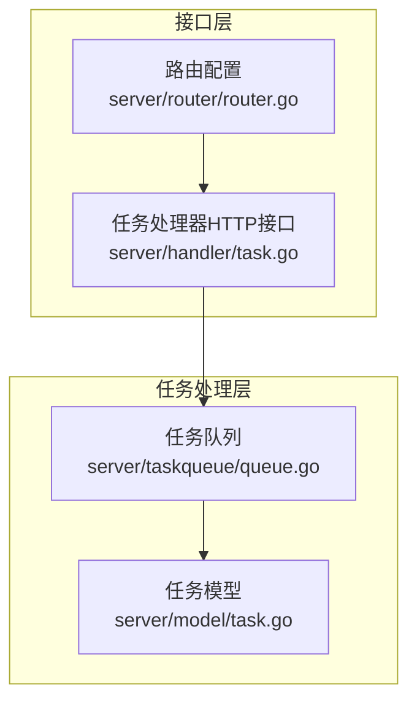
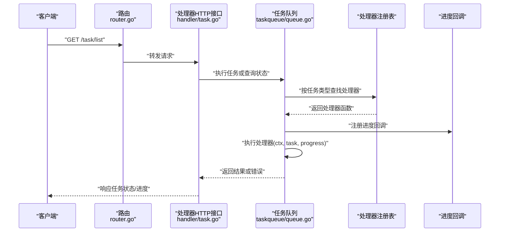
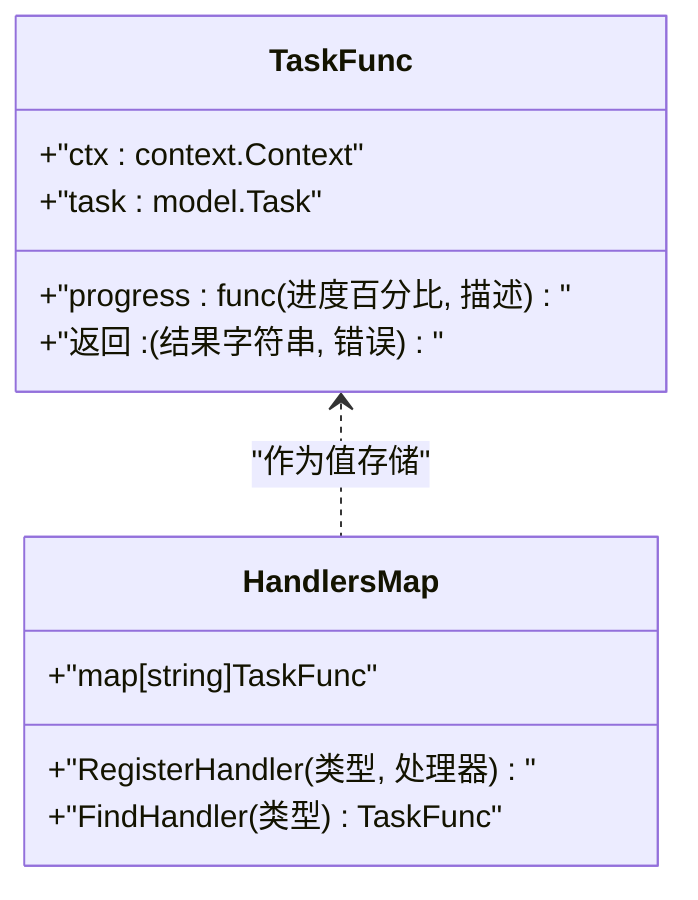
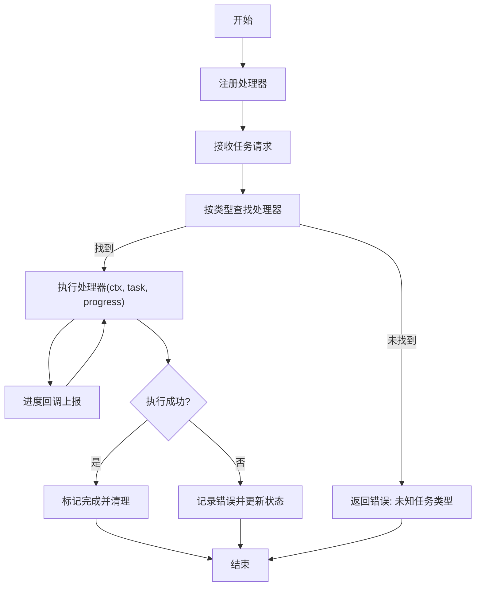
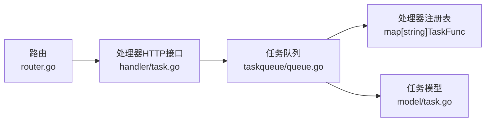

# 任务处理器管理

<cite>
**本文引用的文件**
- [server/taskqueue/queue.go](file://server/taskqueue/queue.go)
- [server/handler/task.go](file://server/handler/task.go)
- [server/model/task.go](file://server/model/task.go)
- [server/router/router.go](file://server/router/router.go)
</cite>

## 目录
1. [引言](#引言)
2. [项目结构](#项目结构)
3. [核心组件](#核心组件)
4. [架构总览](#架构总览)
5. [详细组件分析](#详细组件分析)
6. [依赖分析](#依赖分析)
7. [性能考虑](#性能考虑)
8. [故障排查指南](#故障排查指南)
9. [结论](#结论)
10. [附录](#附录)

## 引言
本文件面向Open虚拟机管理控制台的任务处理器管理子系统，系统性阐述任务处理器的注册机制、查找与执行流程、并发安全保证、生命周期管理（注册/注销/异常处理），以及如何开发自定义任务处理器的最佳实践。目标是帮助开发者快速理解并正确扩展任务处理能力。

## 项目结构
任务处理器管理涉及以下关键模块：
- 任务队列与处理器注册：位于任务队列模块中，负责处理器注册、查找与执行
- 任务模型：定义任务实体与状态字段，供处理器读写
- 处理器HTTP接口：提供任务列表、进度订阅、取消与清理等REST接口
- 路由：对外暴露任务相关API端点

图表来源
- [server/taskqueue/queue.go:1-350](file://server/taskqueue/queue.go#L1-L350)
- [server/model/task.go:1-200](file://server/model/task.go#L1-L200)
- [server/handler/task.go:1-300](file://server/handler/task.go#L1-L300)
- [server/router/router.go:450-460](file://server/router/router.go#L450-L460)

章节来源
- [server/taskqueue/queue.go:1-350](file://server/taskqueue/queue.go#L1-L350)
- [server/handler/task.go:1-300](file://server/handler/task.go#L1-L300)
- [server/model/task.go:1-200](file://server/model/task.go#L1-L200)
- [server/router/router.go:450-460](file://server/router/router.go#L450-L460)

## 核心组件
- 任务函数类型：用于定义任务处理器的统一签名，包含上下文、任务对象与进度回调
- 处理器注册表：以任务类型字符串为键，绑定到具体处理器函数
- 执行调度：根据任务类型从注册表中查找处理器并执行
- 进度回调：通过进度函数向客户端推送实时进度
- 生命周期管理：注册、执行、异常处理与清理

章节来源
- [server/taskqueue/queue.go:20-35](file://server/taskqueue/queue.go#L20-L35)
- [server/taskqueue/queue.go:150-170](file://server/taskqueue/queue.go#L150-L170)
- [server/taskqueue/queue.go:260-310](file://server/taskqueue/queue.go#L260-L310)

## 架构总览
任务处理的整体流程如下：
- 客户端通过路由访问任务接口（列表、详情、取消、清理）
- 处理器HTTP接口调用任务队列执行任务
- 任务队列根据任务类型在注册表中查找对应处理器
- 处理器在执行过程中通过进度回调上报进度
- 异常时记录错误并更新任务状态

图表来源
- [server/router/router.go:455-459](file://server/router/router.go#L455-L459)
- [server/handler/task.go:1-300](file://server/handler/task.go#L1-L300)
- [server/taskqueue/queue.go:150-170](file://server/taskqueue/queue.go#L150-L170)
- [server/taskqueue/queue.go:260-310](file://server/taskqueue/queue.go#L260-L310)

## 详细组件分析

### 任务函数类型与处理器注册
- 任务函数类型定义了统一的处理器签名，包含：
  - 上下文：用于控制超时与取消
  - 任务对象：包含任务类型、参数、状态等
  - 进度回调：用于上报百分比与描述
- 注册机制：
  - 使用全局映射保存“任务类型 -> 处理器函数”
  - 提供注册函数以类型字符串为键进行绑定
- 查找机制：
  - 执行前根据任务类型从映射中查找处理器
  - 若未找到则返回错误，避免未知类型任务被执行

图表来源
- [server/taskqueue/queue.go:20-35](file://server/taskqueue/queue.go#L20-L35)
- [server/taskqueue/queue.go:150-170](file://server/taskqueue/queue.go#L150-L170)
- [server/taskqueue/queue.go:260-270](file://server/taskqueue/queue.go#L260-L270)

章节来源
- [server/taskqueue/queue.go:20-35](file://server/taskqueue/queue.go#L20-L35)
- [server/taskqueue/queue.go:150-170](file://server/taskqueue/queue.go#L150-L170)
- [server/taskqueue/queue.go:260-270](file://server/taskqueue/queue.go#L260-L270)

### 并发安全与线程模型
- 注册表为全局映射，建议在应用启动阶段完成处理器注册，避免运行期并发写入
- 执行阶段仅读取映射，不修改，天然满足读多写少场景
- 如需动态注册/注销，应在注册表上加互斥锁保护
- 进度回调可能被多次调用，应确保回调内部逻辑幂等且无阻塞

章节来源
- [server/taskqueue/queue.go:150-170](file://server/taskqueue/queue.go#L150-L170)
- [server/taskqueue/queue.go:260-310](file://server/taskqueue/queue.go#L260-L310)

### 生命周期管理
- 注册：在服务启动时集中注册所有任务处理器
- 执行：根据任务类型查找处理器并执行；执行期间通过进度回调上报状态
- 取消：支持通过接口取消任务（基于上下文传播取消信号）
- 清理：提供清理已完成任务的接口，释放资源
- 异常处理：捕获处理器返回的错误并更新任务状态；对SSE客户端异常断开进行清理

图表来源
- [server/taskqueue/queue.go:150-170](file://server/taskqueue/queue.go#L150-L170)
- [server/taskqueue/queue.go:260-310](file://server/taskqueue/queue.go#L260-L310)
- [server/handler/task.go:1-300](file://server/handler/task.go#L1-L300)

章节来源
- [server/handler/task.go:1-300](file://server/handler/task.go#L1-L300)
- [server/taskqueue/queue.go:150-170](file://server/taskqueue/queue.go#L150-L170)
- [server/taskqueue/queue.go:260-310](file://server/taskqueue/queue.go#L260-L310)

### 自定义任务处理器开发指南
- 参数解析
  - 从任务对象中读取任务类型与参数字段
  - 对必填参数进行校验，必要时转换为处理器内部数据结构
- 进度回调
  - 在关键步骤调用进度回调，传入百分比与描述
  - 回调应尽量轻量，避免阻塞执行线程
- 错误处理
  - 将可恢复错误与致命错误区分，返回相应错误以便上层处理
  - 记录错误日志并更新任务状态，便于前端展示
- 并发与取消
  - 使用上下文感知的网络/IO操作，及时响应取消信号
  - 避免长时间持有锁或阻塞资源
- 生命周期
  - 在应用启动阶段注册处理器
  - 在处理器退出时清理临时资源，确保幂等

章节来源
- [server/taskqueue/queue.go:20-35](file://server/taskqueue/queue.go#L20-L35)
- [server/taskqueue/queue.go:260-310](file://server/taskqueue/queue.go#L260-L310)
- [server/model/task.go:1-200](file://server/model/task.go#L1-L200)

## 依赖分析
- 路由到处理器接口
  - 路由定义了任务相关端点，交由处理器HTTP接口实现业务逻辑
- 处理器接口到任务队列
  - 处理器接口调用任务队列执行任务，传递上下文与任务对象
- 任务队列到处理器注册表
  - 任务队列根据任务类型查找处理器并执行
- 模型依赖
  - 任务模型提供任务状态、参数等数据载体

图表来源
- [server/router/router.go:455-459](file://server/router/router.go#L455-L459)
- [server/handler/task.go:1-300](file://server/handler/task.go#L1-L300)
- [server/taskqueue/queue.go:150-170](file://server/taskqueue/queue.go#L150-L170)
- [server/model/task.go:1-200](file://server/model/task.go#L1-L200)

章节来源
- [server/router/router.go:455-459](file://server/router/router.go#L455-L459)
- [server/handler/task.go:1-300](file://server/handler/task.go#L1-L300)
- [server/taskqueue/queue.go:150-170](file://server/taskqueue/queue.go#L150-L170)
- [server/model/task.go:1-200](file://server/model/task.go#L1-L200)

## 性能考虑
- 注册表查找为O(1)，适合高频任务调度
- 进度回调应避免阻塞，建议异步化或限流
- 处理器内部应采用非阻塞I/O与合理的超时设置
- 对于长耗时任务，建议拆分为多个小步骤并上报进度

## 故障排查指南
- 任务类型未注册
  - 现象：执行时报错提示未知任务类型
  - 排查：确认处理器是否在启动阶段完成注册
- 进度不更新
  - 现象：前端无法收到进度事件
  - 排查：检查进度回调是否被调用；确认SSE连接未断开
- 任务无法取消
  - 现象：调用取消接口后任务仍继续执行
  - 排查：确认处理器内部使用上下文感知的操作；检查取消信号是否正确传播
- SSE客户端异常断开
  - 现象：断开后内存或连接未清理
  - 排查：确认在处理器退出时调用清理函数，避免资源泄漏

章节来源
- [server/taskqueue/queue.go:150-170](file://server/taskqueue/queue.go#L150-L170)
- [server/taskqueue/queue.go:260-310](file://server/taskqueue/queue.go#L260-L310)
- [server/handler/task.go:1-300](file://server/handler/task.go#L1-L300)

## 结论
任务处理器管理通过统一的函数类型、注册表与执行流程，实现了任务类型与处理器的解耦与可扩展。结合进度回调与生命周期管理，能够稳定支撑复杂后台任务的执行与监控。遵循本文最佳实践，可快速开发高质量的自定义任务处理器。

## 附录
- 关键API端点（示例）
  - 获取任务列表：GET /task/list
  - 订阅进度（SSE）：GET /task/sse
  - 获取任务详情：GET /task/:id
  - 取消任务：POST /task/:id/cancel
  - 清理已完成任务：DELETE /task/clear

章节来源
- [server/router/router.go:455-459](file://server/router/router.go#L455-L459)