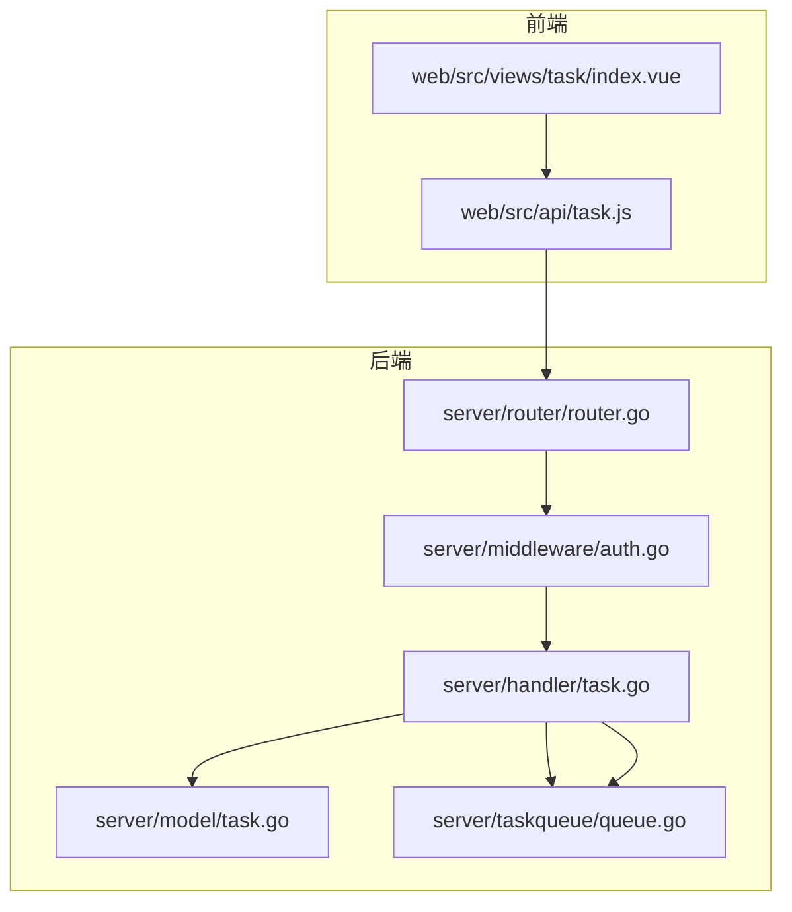
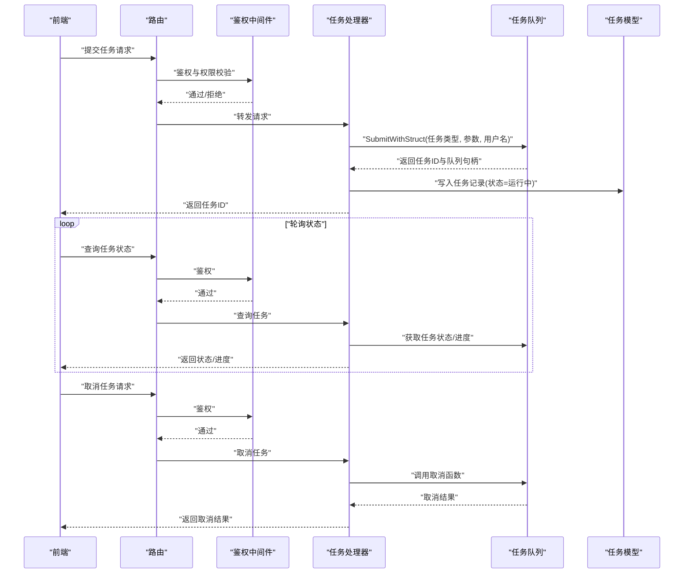
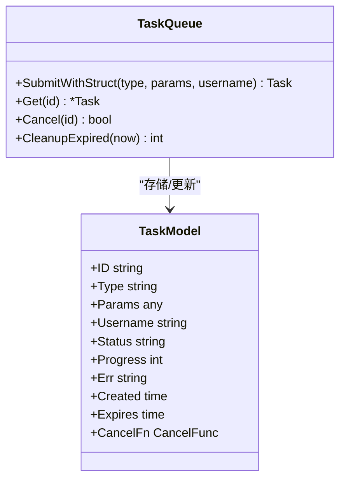
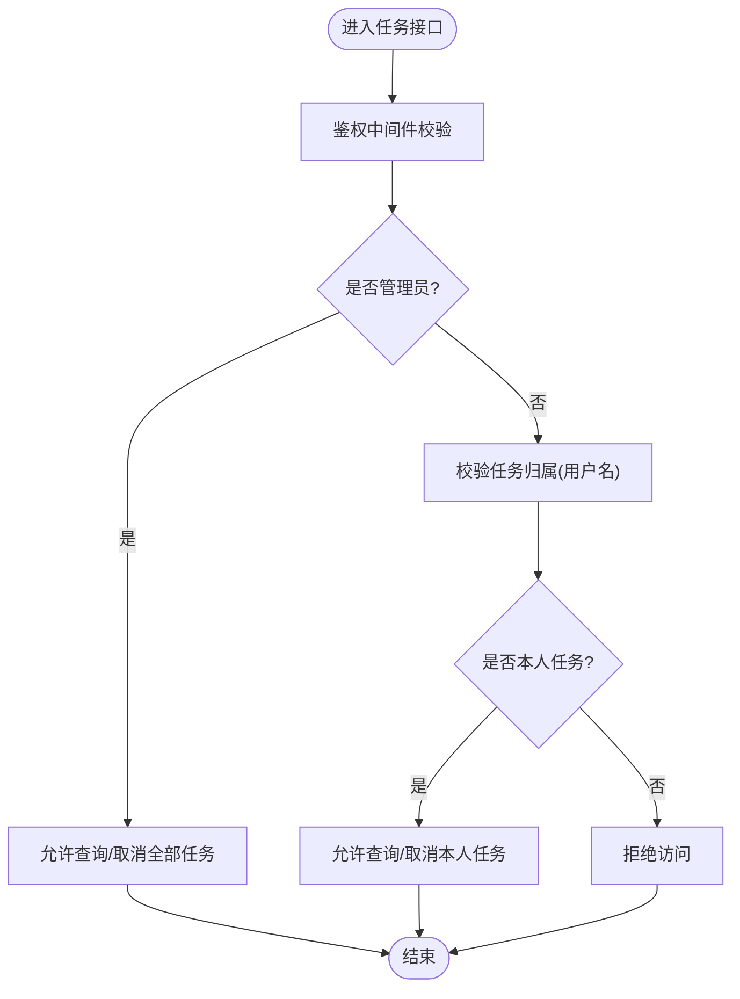
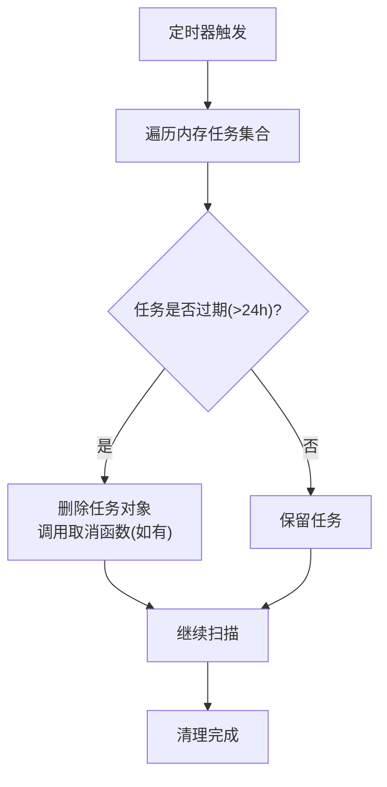
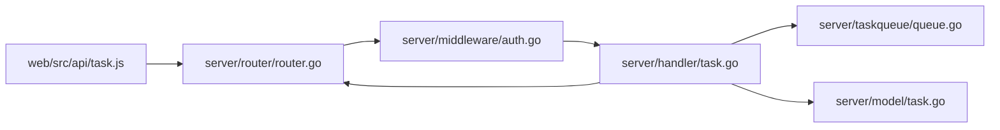

# 任务存储与清理

<cite>
**本文引用的文件**
- [server/handler/task.go](file://server/handler/task.go)
- [server/model/task.go](file://server/model/task.go)
- [server/taskqueue/queue.go](file://server/taskqueue/queue.go)
- [server/middleware/auth.go](file://server/middleware/auth.go)
- [server/router/router.go](file://server/router/router.go)
- [web/src/api/task.js](file://web/src/api/task.js)
- [web/src/views/task/index.vue](file://web/src/views/task/index.vue)
</cite>

## 目录
1. [引言](#引言)
2. [项目结构](#项目结构)
3. [核心组件](#核心组件)
4. [架构总览](#架构总览)
5. [详细组件分析](#详细组件分析)
6. [依赖关系分析](#依赖关系分析)
7. [性能考量](#性能考量)
8. [故障排查指南](#故障排查指南)
9. [结论](#结论)
10. [附录](#附录)

## 引言
本文件聚焦于Open虚拟机管理控制台的任务存储与清理机制，系统性说明内存中任务存储的实现方式（任务ID生成、任务对象存储、取消函数管理）、任务访问权限控制（管理员与普通用户差异）、自动清理机制（24小时过期任务清理与手动清理接口）、内存管理策略与性能考虑，并提供容量规划与清理策略的配置指南。内容基于后端handler、model、taskqueue模块以及前端任务视图与API的实现进行整理。

## 项目结构
任务相关能力主要分布在以下层次：
- 路由层：定义任务查询、状态拉取、取消等接口
- 中间件层：鉴权与权限校验
- 处理器层：任务提交、状态查询、取消执行
- 模型层：任务数据结构与持久化字段
- 队列层：任务在内存中的存储、调度与清理
- 前端：任务列表展示、状态刷新、取消操作

图表来源
- [server/router/router.go](file://server/router/router.go)
- [server/middleware/auth.go](file://server/middleware/auth.go)
- [server/handler/task.go](file://server/handler/task.go)
- [server/model/task.go](file://server/model/task.go)
- [server/taskqueue/queue.go](file://server/taskqueue/queue.go)
- [web/src/api/task.js](file://web/src/api/task.js)
- [web/src/views/task/index.vue](file://web/src/views/task/index.vue)

章节来源
- [server/router/router.go](file://server/router/router.go)
- [server/middleware/auth.go](file://server/middleware/auth.go)
- [server/handler/task.go](file://server/handler/task.go)
- [server/model/task.go](file://server/model/task.go)
- [server/taskqueue/queue.go](file://server/taskqueue/queue.go)
- [web/src/api/task.js](file://web/src/api/task.js)
- [web/src/views/task/index.vue](file://web/src/views/task/index.vue)

## 核心组件
- 任务处理器：负责接收任务提交请求、查询任务状态、执行任务取消；并与队列层交互完成任务入队与状态更新。
- 任务模型：定义任务的数据结构（如类型、参数、状态、进度、错误信息、创建时间、过期时间等）。
- 任务队列：在内存中维护任务集合，提供任务ID生成、任务对象存储、取消函数注册与调用、过期清理等能力。
- 权限中间件：对任务相关接口进行鉴权与角色校验（管理员与普通用户权限差异）。
- 前端API与视图：封装任务查询与取消的HTTP调用，渲染任务列表与状态。

章节来源
- [server/handler/task.go](file://server/handler/task.go)
- [server/model/task.go](file://server/model/task.go)
- [server/taskqueue/queue.go](file://server/taskqueue/queue.go)
- [server/middleware/auth.go](file://server/middleware/auth.go)
- [web/src/api/task.js](file://web/src/api/task.js)
- [web/src/views/task/index.vue](file://web/src/views/task/index.vue)

## 架构总览
任务从提交到执行、状态更新与清理的整体流程如下：

图表来源
- [server/router/router.go](file://server/router/router.go)
- [server/middleware/auth.go](file://server/middleware/auth.go)
- [server/handler/task.go](file://server/handler/task.go)
- [server/taskqueue/queue.go](file://server/taskqueue/queue.go)
- [server/model/task.go](file://server/model/task.go)
- [web/src/api/task.js](file://web/src/api/task.js)

## 详细组件分析

### 任务ID生成与任务对象存储
- 任务ID生成：通过队列层统一生成唯一任务ID，确保全局可区分。
- 任务对象存储：队列层在内存中保存任务对象，包含任务类型、参数、创建时间、过期时间、状态、进度、错误信息等。
- 取消函数管理：队列层为每个任务注册取消函数，当收到取消请求时调用该函数以中断或回滚任务。

图表来源
- [server/taskqueue/queue.go](file://server/taskqueue/queue.go)
- [server/model/task.go](file://server/model/task.go)

章节来源
- [server/taskqueue/queue.go](file://server/taskqueue/queue.go)
- [server/model/task.go](file://server/model/task.go)

### 任务访问权限控制
- 管理员权限：可查询与取消所有用户提交的任务。
- 普通用户权限：仅能查询与取消自己提交的任务。
- 实现要点：处理器在执行查询与取消前，通过鉴权中间件校验当前用户身份与任务归属，若越权则拒绝请求。

图表来源
- [server/middleware/auth.go](file://server/middleware/auth.go)
- [server/handler/task.go](file://server/handler/task.go)

章节来源
- [server/middleware/auth.go](file://server/middleware/auth.go)
- [server/handler/task.go](file://server/handler/task.go)

### 自动清理机制
- 过期清理：队列层按固定周期扫描内存中的任务，移除超过24小时未完成的任务，释放内存占用。
- 手动清理接口：提供主动清理过期任务的接口，便于运维在高峰期或资源紧张时触发清理。

图表来源
- [server/taskqueue/queue.go](file://server/taskqueue/queue.go)

章节来源
- [server/taskqueue/queue.go](file://server/taskqueue/queue.go)

### 内存管理策略与性能考虑
- 内存占用控制：通过24小时过期清理限制任务对象长期驻留内存；同时建议限制单节点并发任务上限，避免内存峰值过高。
- 并发与锁：队列层应采用细粒度锁或无锁结构，保证高并发场景下的查询与更新性能。
- 状态同步：任务状态变更需及时写入模型层以便前端轮询，同时避免频繁I/O导致阻塞。
- 前端轮询优化：前端采用指数退避或节流策略减少高频请求，降低后端压力。

章节来源
- [server/taskqueue/queue.go](file://server/taskqueue/queue.go)
- [server/handler/task.go](file://server/handler/task.go)
- [web/src/api/task.js](file://web/src/api/task.js)

### 任务存储容量规划与清理策略配置
- 容量规划建议：
  - 单节点最大并发任务数：根据CPU、内存与磁盘IO能力设定上限，建议预留20%~30%缓冲。
  - 内存峰值估算：单任务平均内存占用 × 最大并发数 × 任务保留系数（建议1.2）。
- 清理策略配置：
  - 过期时间：默认24小时，可根据业务场景调整（如短期任务可缩短至2小时）。
  - 清理周期：建议每小时执行一次全量扫描，或在任务高峰后触发快速清理。
  - 主动清理：提供管理接口在资源紧张时立即触发清理。
- 监控指标：
  - 在线任务数量、内存占用、清理任务数量、取消成功率、超时率等。

章节来源
- [server/taskqueue/queue.go](file://server/taskqueue/queue.go)
- [server/handler/task.go](file://server/handler/task.go)

## 依赖关系分析
任务相关模块之间的依赖关系如下：

图表来源
- [server/router/router.go](file://server/router/router.go)
- [server/middleware/auth.go](file://server/middleware/auth.go)
- [server/handler/task.go](file://server/handler/task.go)
- [server/taskqueue/queue.go](file://server/taskqueue/queue.go)
- [server/model/task.go](file://server/model/task.go)
- [web/src/api/task.js](file://web/src/api/task.js)

章节来源
- [server/router/router.go](file://server/router/router.go)
- [server/middleware/auth.go](file://server/middleware/auth.go)
- [server/handler/task.go](file://server/handler/task.go)
- [server/taskqueue/queue.go](file://server/taskqueue/queue.go)
- [server/model/task.go](file://server/model/task.go)
- [web/src/api/task.js](file://web/src/api/task.js)

## 性能考量
- 队列层并发安全：采用读写分离或分段锁降低锁竞争，提升高并发下的吞吐。
- 状态更新批量化：合并短周期内的状态更新，减少数据库写入频率。
- 前端轮询节流：根据任务预计耗时设置合理的轮询间隔，避免无效请求。
- 取消函数幂等：确保取消操作可重复调用且不会产生副作用，提升可靠性。

## 故障排查指南
- 提交失败：检查队列层是否成功生成任务ID与注册取消函数；确认处理器写入模型层是否成功。
- 查询无结果：确认任务是否已过期被清理；核对鉴权中间件是否正确识别用户与任务归属。
- 取消无效：检查取消函数是否正确注册与调用；确认任务状态是否允许取消。
- 内存增长：核查清理周期与过期时间配置是否合理；评估并发任务上限是否过高。

章节来源
- [server/handler/task.go](file://server/handler/task.go)
- [server/taskqueue/queue.go](file://server/taskqueue/queue.go)
- [server/middleware/auth.go](file://server/middleware/auth.go)

## 结论
本文档梳理了Open虚拟机管理控制台的任务存储与清理机制，明确了任务ID生成、任务对象存储与取消函数管理的实现方式，阐述了管理员与普通用户的权限差异，总结了24小时过期清理与手动清理接口的工作原理，并提供了内存管理策略、性能优化建议与容量规划配置指南。建议在生产环境中结合业务负载动态调整清理策略与并发上限，确保系统稳定性与用户体验。

## 附录
- 前端任务视图与API：用于展示任务列表、状态轮询与取消操作。
- 后端处理器与模型：负责任务提交、状态查询、取消执行与持久化。
- 队列层：负责任务在内存中的存储、调度与清理。

章节来源
- [web/src/views/task/index.vue](file://web/src/views/task/index.vue)
- [web/src/api/task.js](file://web/src/api/task.js)
- [server/handler/task.go](file://server/handler/task.go)
- [server/model/task.go](file://server/model/task.go)
- [server/taskqueue/queue.go](file://server/taskqueue/queue.go)