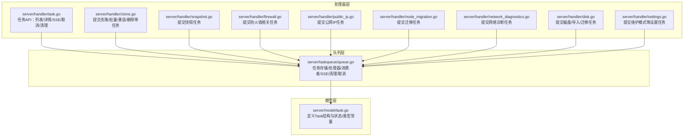
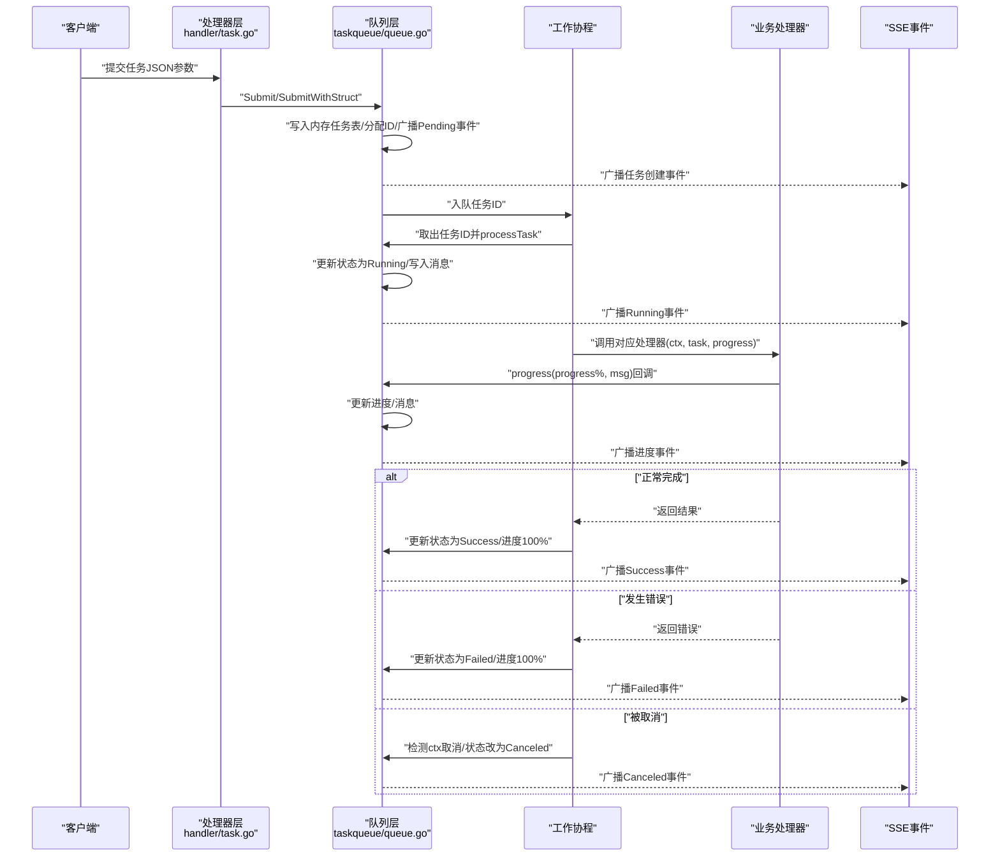

# 任务生命周期跟踪

<cite>
**本文引用的文件**
- [server/model/task.go](file://server/model/task.go)
- [server/taskqueue/queue.go](file://server/taskqueue/queue.go)
- [server/handler/task.go](file://server/handler/task.go)
- [server/handler/clone.go](file://server/handler/clone.go)
- [server/handler/snapshot.go](file://server/handler/snapshot.go)
- [server/handler/firewall.go](file://server/handler/firewall.go)
- [server/handler/public_ip.go](file://server/handler/public_ip.go)
- [server/handler/node_migration.go](file://server/handler/node_migration.go)
- [server/handler/network_diagnostics.go](file://server/handler/network_diagnostics.go)
- [server/handler/disk.go](file://server/handler/disk.go)
- [server/handler/settings.go](file://server/handler/settings.go)
</cite>

## 目录
1. [引言](#引言)
2. [项目结构](#项目结构)
3. [核心组件](#核心组件)
4. [架构总览](#架构总览)
5. [详细组件分析](#详细组件分析)
6. [依赖分析](#依赖分析)
7. [性能考虑](#性能考虑)
8. [故障排查指南](#故障排查指南)
9. [结论](#结论)
10. [附录](#附录)

## 引言
本文件面向Open虚拟机管理控制台的任务生命周期跟踪，系统性说明任务从提交到完成的全生命周期，覆盖状态转换（Pending→Running→Success/Failed/Canceled）、内存存储与持久化策略、进度跟踪与消息传递（SSE事件广播）、取消机制（上下文取消与优雅终止）、以及任务状态查询与过滤的API使用方法。目标是帮助开发者与运维人员快速理解并正确使用任务系统。

## 项目结构
任务系统由三层组成：
- 模型层：定义任务数据结构与状态/类型常量
- 队列层：负责任务提交、调度、执行、状态更新、SSE广播、清理与取消
- 处理器层：各业务模块在控制器中提交任务，调用队列层Submit/SubmitWithStruct

图表来源
- [server/model/task.go:63-76](file://server/model/task.go#L63-L76)
- [server/taskqueue/queue.go:183-211](file://server/taskqueue/queue.go#L183-L211)
- [server/handler/task.go:15-49](file://server/handler/task.go#L15-L49)
- [server/handler/clone.go:275](file://server/handler/clone.go#L275)

章节来源
- [server/model/task.go:1-76](file://server/model/task.go#L1-L76)
- [server/taskqueue/queue.go:1-562](file://server/taskqueue/queue.go#L1-L562)
- [server/handler/task.go:1-195](file://server/handler/task.go#L1-L195)

## 核心组件
- 任务模型（Task）：包含任务ID、类型、状态、参数、结果、进度、消息、创建者及时间戳；采用纯内存存储，不落地数据库。
- 任务队列（taskqueue）：提供提交、调度、执行、状态更新、SSE广播、按用户过滤、取消、自动清理等功能。
- 控制器（handler）：对外暴露任务API，封装分页、筛选、鉴权、SSE流、取消与清理等逻辑。

章节来源
- [server/model/task.go:63-76](file://server/model/task.go#L63-L76)
- [server/taskqueue/queue.go:183-211](file://server/taskqueue/queue.go#L183-L211)
- [server/handler/task.go:15-49](file://server/handler/task.go#L15-L49)

## 架构总览
任务生命周期的关键流转如下：

图表来源
- [server/handler/task.go:15-49](file://server/handler/task.go#L15-L49)
- [server/taskqueue/queue.go:183-211](file://server/taskqueue/queue.go#L183-L211)
- [server/taskqueue/queue.go:229-354](file://server/taskqueue/queue.go#L229-L354)
- [server/taskqueue/queue.go:288-301](file://server/taskqueue/queue.go#L288-L301)

## 详细组件分析

### 任务状态与类型
- 状态常量：pending、running、success、failed、canceled
- 类型覆盖：克隆、批量克隆、重装系统、制作/导出/导入/删除模板、创建/删除虚拟机、快照、导出/导入、磁盘转移、救援、重置来宾密码、防火墙应用/回滚/禁用/更新GeoIP、宿主机防火墙开关、OVS修复、公网IP应用、维护模式、存储格式化/分区/LVM、网络抓包、端口转发探测、定时任务、轻量云开通、迁移、导入磁盘等

章节来源
- [server/model/task.go:7-14](file://server/model/task.go#L7-L14)
- [server/model/task.go:16-61](file://server/model/task.go#L16-L61)

### 任务模型与内存存储策略
- 模型字段：ID、类型、状态、参数（JSON）、结果（JSON）、进度（0-100）、消息、创建者、创建/更新时间
- 存储策略：纯内存存储（map），不落库；通过全局互斥锁保护并发安全；提供自动清理（24小时过期清理）与手动清理（成功/失败/取消）

章节来源
- [server/model/task.go:63-76](file://server/model/task.go#L63-L76)
- [server/taskqueue/queue.go:43-48](file://server/taskqueue/queue.go#L43-L48)
- [server/taskqueue/queue.go:55-103](file://server/taskqueue/queue.go#L55-L103)
- [server/taskqueue/queue.go:531-561](file://server/taskqueue/queue.go#L531-L561)

### 任务提交与调度
- 提交流程：生成自增ID、初始化状态为pending、写入内存、广播pending事件、入队等待消费
- 调度机制：固定数量工作协程从任务通道取出任务ID并执行；每个任务执行前会检查是否已被取消

章节来源
- [server/taskqueue/queue.go:183-211](file://server/taskqueue/queue.go#L183-L211)
- [server/taskqueue/queue.go:222-227](file://server/taskqueue/queue.go#L222-L227)
- [server/taskqueue/queue.go:229-241](file://server/taskqueue/queue.go#L229-L241)

### 任务状态转换与持久化
- 状态转换：pending → running → success/failed/canceled
- 持久化策略：不落库，仅内存；通过自动清理协程每小时扫描并删除超过24小时且已结束的任务；支持手动清理成功/失败/取消的任务
- 结束条件：任务完成后（成功/失败/取消）不再主动清理，直到手动清理或自动清理周期到达

章节来源
- [server/model/task.go:7-14](file://server/model/task.go#L7-L14)
- [server/taskqueue/queue.go:251-354](file://server/taskqueue/queue.go#L251-L354)
- [server/taskqueue/queue.go:503-527](file://server/taskqueue/queue.go#L503-L527)
- [server/taskqueue/queue.go:531-561](file://server/taskqueue/queue.go#L531-L561)

### 进度跟踪与消息传递（SSE事件广播）
- 进度回调：处理器在执行过程中调用progress(progress%, message)，内部原子更新任务进度与消息，并广播事件
- SSE客户端：处理器侧建立SSE连接，注册到队列层，接收“connected”与“task_progress”事件；断开自动注销
- 事件内容：包含任务ID、类型、状态、进度、消息

章节来源
- [server/taskqueue/queue.go:288-301](file://server/taskqueue/queue.go#L288-L301)
- [server/taskqueue/queue.go:121-154](file://server/taskqueue/queue.go#L121-L154)
- [server/handler/task.go:87-130](file://server/handler/task.go#L87-L130)

### 任务取消机制（上下文取消与优雅终止）
- 取消入口：支持对等待中与运行中任务取消；等待中直接标记canceled；运行中通过context.Cancel触发
- 上下文传播：为每个运行中任务保存cancel函数，执行器在循环/子流程中定期检查ctx.Done()
- 优雅终止：取消后状态在执行器检测到ctx.Canceled后更新为canceled，并广播事件；同时保留上次进度与消息

章节来源
- [server/taskqueue/queue.go:458-501](file://server/taskqueue/queue.go#L458-L501)
- [server/taskqueue/queue.go:309-322](file://server/taskqueue/queue.go#L309-L322)
- [server/taskqueue/queue.go:243-249](file://server/taskqueue/queue.go#L243-L249)

### 任务状态查询与过滤API
- 列表查询：支持分页、按状态与类型过滤；按创建时间倒序；支持管理员与普通用户权限
- 详情查询：按任务ID查询，校验用户与角色
- SSE订阅：建立SSE连接，接收任务进度事件
- 取消任务：按ID取消，支持权限校验
- 清理任务：清理指定用户可访问的已结束任务（成功/失败/取消）

章节来源
- [server/handler/task.go:15-49](file://server/handler/task.go#L15-L49)
- [server/handler/task.go:51-85](file://server/handler/task.go#L51-L85)
- [server/handler/task.go:87-130](file://server/handler/task.go#L87-L130)
- [server/handler/task.go:132-170](file://server/handler/task.go#L132-L170)
- [server/handler/task.go:172-194](file://server/handler/task.go#L172-L194)
- [server/taskqueue/queue.go:372-449](file://server/taskqueue/queue.go#L372-L449)
- [server/taskqueue/queue.go:390-403](file://server/taskqueue/queue.go#L390-L403)

### 业务模块如何提交任务
- 典型流程：解析请求参数 → 调用SubmitWithStruct提交任务 → 返回任务ID给客户端
- 示例涉及：克隆、批量克隆、重装系统、删除、快照、防火墙应用/回滚/禁用/更新GeoIP、宿主机防火墙开关、OVS修复、公网IP应用、维护模式、迁移、磁盘/导入/迁移、网络抓包、端口转发探测等

章节来源
- [server/handler/clone.go:275](file://server/handler/clone.go#L275)
- [server/handler/clone.go:423](file://server/handler/clone.go#L423)
- [server/handler/clone.go:537](file://server/handler/clone.go#L537)
- [server/handler/clone.go:606](file://server/handler/clone.go#L606)
- [server/handler/snapshot.go:144](file://server/handler/snapshot.go#L144)
- [server/handler/firewall.go:77](file://server/handler/firewall.go#L77)
- [server/handler/public_ip.go:142](file://server/handler/public_ip.go#L142)
- [server/handler/node_migration.go:128](file://server/handler/node_migration.go#L128)
- [server/handler/network_diagnostics.go:37](file://server/handler/network_diagnostics.go#L37)
- [server/handler/disk.go:104](file://server/handler/disk.go#L104)
- [server/handler/disk.go:202](file://server/handler/disk.go#L202)
- [server/handler/disk.go:537](file://server/handler/disk.go#L537)
- [server/handler/settings.go:592](file://server/handler/settings.go#L592)

## 依赖分析
- 模块耦合
  - handler依赖taskqueue进行任务提交、查询、取消与清理
  - taskqueue依赖model定义任务结构
  - 业务处理器通过Submit/SubmitWithStruct统一接入任务队列
- 外部依赖
  - Gin框架用于HTTP路由与SSE
  - 日志组件用于事件记录
- 潜在风险
  - 纯内存存储在进程重启后丢失；建议结合业务需要评估持久化方案
  - SSE客户端过多可能导致广播阻塞，需关注广播缓冲与丢弃策略

图表来源
- [server/handler/task.go:12](file://server/handler/task.go#L12)
- [server/taskqueue/queue.go:16](file://server/taskqueue/queue.go#L16)
- [server/model/task.go:1-76](file://server/model/task.go#L1-L76)

章节来源
- [server/handler/task.go:12](file://server/handler/task.go#L12)
- [server/taskqueue/queue.go:16](file://server/taskqueue/queue.go#L16)

## 性能考虑
- 并发安全：使用读写锁保护任务存储与SSE客户端集合，降低锁竞争
- 广播效率：SSE广播默认丢弃阻塞事件，避免慢消费者拖垮系统
- 清理策略：每小时自动清理过期任务，减少内存占用
- 执行器数量：可通过启动参数调整工作协程数，平衡吞吐与资源

章节来源
- [server/taskqueue/queue.go:121-154](file://server/taskqueue/queue.go#L121-L154)
- [server/taskqueue/queue.go:531-561](file://server/taskqueue/queue.go#L531-L561)
- [server/taskqueue/queue.go:173-181](file://server/taskqueue/queue.go#L173-L181)

## 故障排查指南
- 任务未出现：检查是否正确调用Submit/SubmitWithStruct并入队；确认SSE客户端已注册
- 无法取消：仅等待中与运行中任务可取消；若状态已是结束态则不可取消
- 权限问题：GetTaskForUser与CancelTaskForUser均进行用户与角色校验，确保传入正确的用户名与角色
- 清理异常：手动清理仅对已结束任务生效；如需立即释放内存，可等待自动清理周期或在高可用场景下重启服务

章节来源
- [server/taskqueue/queue.go:458-501](file://server/taskqueue/queue.go#L458-L501)
- [server/taskqueue/queue.go:390-403](file://server/taskqueue/queue.go#L390-L403)
- [server/handler/task.go:132-170](file://server/handler/task.go#L132-L170)

## 结论
Open虚拟机管理控制台的任务系统以纯内存存储为核心，配合SSE事件广播与上下文取消机制，实现了高效、可观测的任务生命周期管理。通过统一的提交入口与严格的权限控制，业务模块可以便捷地异步化复杂操作；通过自动清理与手动清理策略，兼顾了性能与资源占用。建议在生产环境中结合业务需求评估持久化与监控方案，进一步提升可靠性与可观测性。

## 附录

### API使用指南（任务状态查询与过滤）
- 获取任务列表
  - 方法：GET /api/tasks
  - 参数：page、page_size、status、type
  - 权限：管理员或任务创建者
  - 返回：列表、总数、分页信息
- 获取任务详情
  - 方法：GET /api/tasks/:id
  - 权限：管理员或任务创建者
- 订阅任务进度（SSE）
  - 方法：GET /api/tasks/sse
  - 返回：connected与task_progress事件
- 取消任务
  - 方法：POST /api/tasks/:id/cancel
  - 权限：管理员或任务创建者
- 清理已完成任务
  - 方法：POST /api/tasks/clear-finished
  - 权限：高风险验证通过（管理员）

章节来源
- [server/handler/task.go:15-49](file://server/handler/task.go#L15-L49)
- [server/handler/task.go:51-85](file://server/handler/task.go#L51-L85)
- [server/handler/task.go:87-130](file://server/handler/task.go#L87-L130)
- [server/handler/task.go:132-170](file://server/handler/task.go#L132-L170)
- [server/handler/task.go:172-194](file://server/handler/task.go#L172-L194)