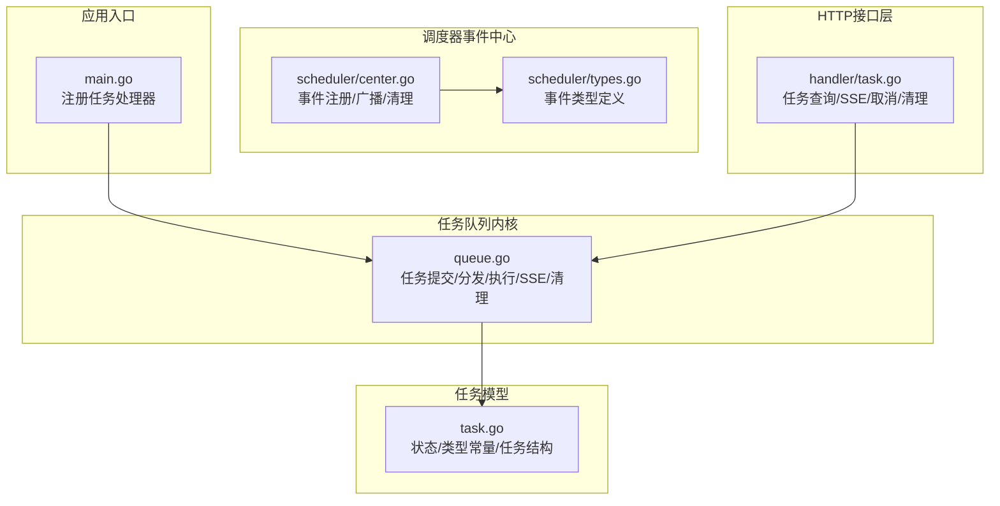
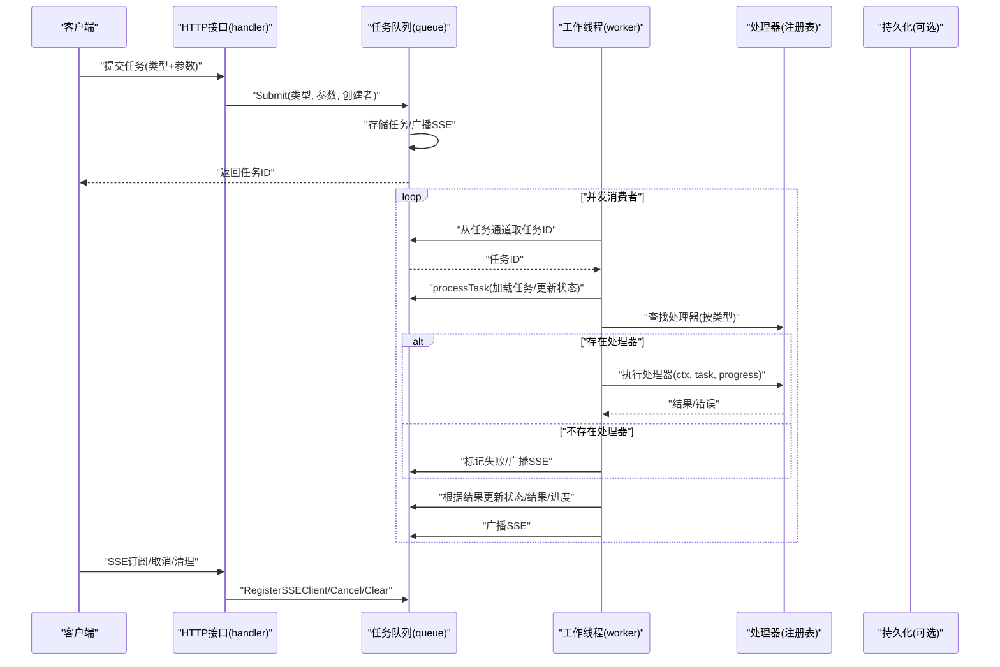
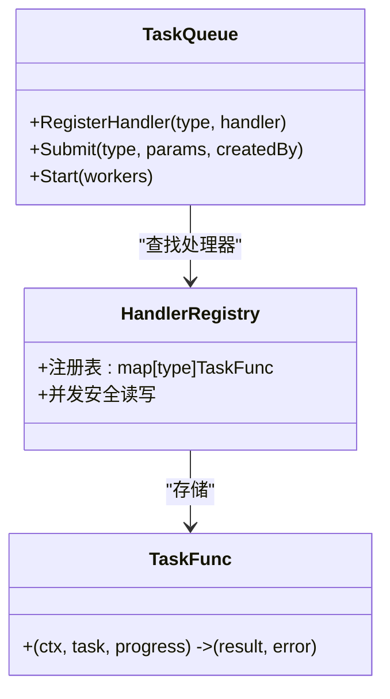
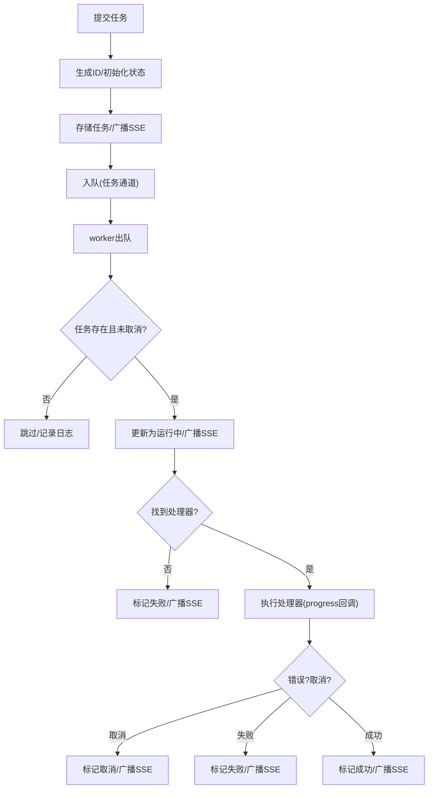
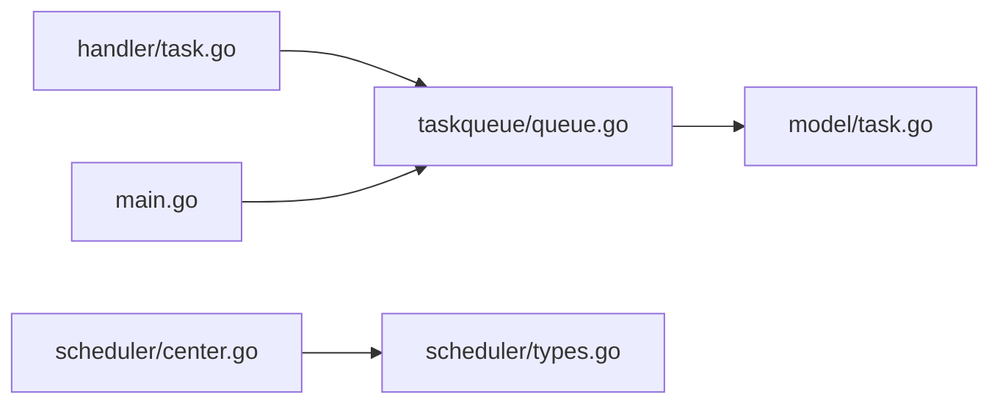

# 任务队列架构

<cite>
**本文引用的文件**
- [server\taskqueue\queue.go](file://server/taskqueue/queue.go)
- [server\model\task.go](file://server/model/task.go)
- [server\handler\task.go](file://server/handler/task.go)
- [server\service\scheduler\center.go](file://server/service/scheduler/center.go)
- [server\service\scheduler\types.go](file://server/service/scheduler/types.go)
- [server\main.go](file://server/main.go)
</cite>

## 目录
1. [引言](#引言)
2. [项目结构](#项目结构)
3. [核心组件](#核心组件)
4. [架构总览](#架构总览)
5. [详细组件分析](#详细组件分析)
6. [依赖关系分析](#依赖关系分析)
7. [性能考量](#性能考量)
8. [故障排查指南](#故障排查指南)
9. [结论](#结论)
10. [附录](#附录)

## 引言
本文件面向Open虚拟机管理控制台的任务队列架构，系统性阐述异步任务处理机制与任务调度中心的工作原理，覆盖任务处理器的注册与管理、任务类型定义、参数解析、进度回调机制、并发控制与负载均衡策略、任务状态管理与错误处理、生命周期跟踪与清理策略等。文末提供任务开发指南与性能优化建议，帮助开发者快速上手并稳定扩展。

## 项目结构
任务队列相关代码主要分布在以下模块：
- 任务队列内核：负责任务提交、分发、执行、状态更新、SSE事件广播、清理与并发控制
- 任务模型：定义任务状态、任务类型常量与任务数据结构
- 任务HTTP接口：提供任务查询、SSE进度推送、取消与清理等REST接口
- 调度器事件中心：与任务队列并行的事件推送子系统，用于调度事件的SSE广播与清理
- 主程序：集中注册各类任务处理器，形成“处理器注册表”

图表来源
- [server\taskqueue\queue.go:1-562](file://server/taskqueue/queue.go#L1-L562)
- [server\model\task.go:1-76](file://server/model/task.go#L1-L76)
- [server\handler\task.go:1-195](file://server/handler/task.go#L1-L195)
- [server\service\scheduler\center.go:1-179](file://server/service/scheduler/center.go#L1-L179)
- [server\service\scheduler\types.go:1-49](file://server/service/scheduler/types.go#L1-L49)
- [server\main.go:132-637](file://server/main.go#L132-L637)

章节来源
- [server\taskqueue\queue.go:1-562](file://server/taskqueue/queue.go#L1-L562)
- [server\model\task.go:1-76](file://server/model/task.go#L1-L76)
- [server\handler\task.go:1-195](file://server/handler/task.go#L1-L195)
- [server\service\scheduler\center.go:1-179](file://server/service/scheduler/center.go#L1-L179)
- [server\service\scheduler\types.go:1-49](file://server/service/scheduler/types.go#L1-L49)
- [server\main.go:132-637](file://server/main.go#L132-L637)

## 核心组件
- 任务内核（queue.go）
  - 任务存储：基于内存的map，支持读写锁保护；提供任务ID自增序列、任务存取、更新、删除
  - 任务通道：有界channel作为任务队列，支持并发消费者
  - 任务处理器注册：基于字符串类型映射的处理器注册表，支持并发安全读写
  - SSE事件中心：维护客户端连接集合，广播任务事件
  - 生命周期管理：提交、执行、状态变更、取消、清理
- 任务模型（task.go）
  - 定义任务状态常量（等待中、执行中、成功、失败、已取消）
  - 定义任务类型常量（克隆、批量克隆、快照、网络防火墙、存储管理、调度等）
  - 定义任务结构体（ID、类型、状态、参数、结果、进度、消息、创建者、时间戳）
- HTTP接口（handler/task.go）
  - 任务列表查询（支持分页、按状态与类型过滤、按用户角色过滤）
  - 任务详情查询（鉴权校验）
  - SSE实时进度推送（连接建立、事件流、断开清理）
  - 取消任务（等待中/运行中）
  - 清理已完成任务
- 调度器事件中心（scheduler/center.go）
  - 调度器注册、列表查询
  - 调度事件生命周期（开始、成功、失败），持久化与SSE广播
  - 清理过期调度事件

章节来源
- [server\taskqueue\queue.go:1-562](file://server/taskqueue/queue.go#L1-L562)
- [server\model\task.go:1-76](file://server/model/task.go#L1-L76)
- [server\handler\task.go:1-195](file://server/handler/task.go#L1-L195)
- [server\service\scheduler\center.go:1-179](file://server/service/scheduler/center.go#L1-L179)
- [server\service\scheduler\types.go:1-49](file://server/service/scheduler/types.go#L1-L49)

## 架构总览
任务队列采用“生产者-消费者”模型，结合SSE实现前端实时进度推送。主程序在启动阶段注册各类任务处理器，任务通过Submit提交至内存队列，由多个worker并发消费执行，执行过程中通过进度回调更新状态并广播事件，最终根据执行结果更新任务状态。

图表来源
- [server\handler\task.go:87-130](file://server/handler/task.go#L87-L130)
- [server\taskqueue\queue.go:173-354](file://server/taskqueue/queue.go#L173-L354)
- [server\main.go:132-637](file://server/main.go#L132-L637)

## 详细组件分析

### 任务处理器注册与管理
- 注册方式
  - 通过全局注册表按任务类型注册处理器函数
  - 注册表支持并发安全读写，避免竞态
- 使用方式
  - 提交任务时按任务类型查找对应处理器
  - 若未找到处理器，任务直接标记失败并广播
- 开发建议
  - 为每个任务类型提供清晰的参数结构与错误语义
  - 在处理器内部定期检查ctx.Done()以响应取消

图表来源
- [server\taskqueue\queue.go:157-181](file://server/taskqueue/queue.go#L157-L181)
- [server\main.go:132-637](file://server/main.go#L132-L637)

章节来源
- [server\taskqueue\queue.go:157-181](file://server/taskqueue/queue.go#L157-L181)
- [server\main.go:132-637](file://server/main.go#L132-L637)

### 任务提交与执行流程
- 提交流程
  - 生成唯一ID、初始化状态为等待中、写入内存存储
  - 广播SSE事件（等待中）
  - 将任务ID发送到任务通道
- 执行流程
  - worker从通道取出任务ID，加载任务并更新为运行中
  - 查找处理器并执行，期间通过progress回调更新进度与消息
  - 根据执行结果设置成功/失败/取消状态并广播SSE
- 取消流程
  - 等待中：直接标记取消
  - 运行中：触发上下文取消信号，状态在检测到取消后更新

图表来源
- [server\taskqueue\queue.go:183-354](file://server/taskqueue/queue.go#L183-L354)

章节来源
- [server\taskqueue\queue.go:183-354](file://server/taskqueue/queue.go#L183-L354)

### 任务状态管理与生命周期
- 状态流转
  - pending → running → success/failed/canceled
- 生命周期
  - 提交 → 等待 → 执行 → 结束（成功/失败/取消）
  - 自动清理：超过24小时的历史任务（仅结束态）
  - 手动清理：按用户角色清理其已结束任务
- 权限控制
  - 任务详情与操作需校验用户身份与角色（admin或任务创建者）

章节来源
- [server\model\task.go:7-14](file://server/model/task.go#L7-L14)
- [server\taskqueue\queue.go:358-527](file://server/taskqueue/queue.go#L358-L527)
- [server\handler\task.go:51-85](file://server/handler/task.go#L51-L85)

### 进度回调与SSE推送
- 进度回调
  - 处理器内部通过progress(progress%, message)上报进度
  - 回调会同步更新任务进度与消息，并广播SSE事件
- SSE客户端
  - 支持多客户端连接，断开自动清理
  - 事件类型包括“连接确认”和“任务进度”
- 前端集成
  - 建议前端监听SSE事件，实时渲染任务面板与进度条

章节来源
- [server\taskqueue\queue.go:126-154](file://server/taskqueue/queue.go#L126-L154)
- [server\handler\task.go:87-130](file://server/handler/task.go#L87-L130)

### 并发控制与负载均衡
- 并发模型
  - 有界任务通道（默认容量100）限制积压
  - 多worker并发消费，worker数量可配置
  - 读写锁保护任务存储与处理器注册表
- 负载均衡
  - 任务通道天然实现“轮询式”分发
  - 建议根据业务复杂度调整worker数量与通道容量
- 资源隔离
  - 处理器内部应避免阻塞IO，必要时拆分子步骤并定期上报进度

章节来源
- [server\taskqueue\queue.go:171-181](file://server/taskqueue/queue.go#L171-L181)

### 错误处理与重试策略
- 错误分类
  - 未找到处理器：直接失败
  - 执行错误：标记失败，保留结果与消息
  - 用户取消：标记取消，保留进度
- 重试策略
  - 当前实现未内置自动重试
  - 建议在业务侧对可恢复错误进行二次提交
- 超时处理
  - 未内置任务级超时
  - 建议在处理器内部结合ctx.Done()与周期性检查实现超时控制

章节来源
- [server\taskqueue\queue.go:272-353](file://server/taskqueue/queue.go#L272-L353)

### 调度器事件中心（与任务队列并行）
- 功能定位
  - 与任务队列类似的事件推送与清理机制
  - 用于调度器事件的生命周期管理与持久化
- 事件类型
  - running/success/failed
- 清理策略
  - 基于配置的保留时长（默认168小时），定时清理

章节来源
- [server\service\scheduler\center.go:1-179](file://server/service/scheduler/center.go#L1-L179)
- [server\service\scheduler\types.go:1-49](file://server/service/scheduler/types.go#L1-L49)

## 依赖关系分析
- 组件耦合
  - HTTP层依赖任务队列接口（查询、SSE、取消、清理）
  - 任务队列依赖任务模型（状态、类型、结构）
  - 主程序集中注册任务处理器，形成“处理器注册表”
- 外部依赖
  - 日志库用于记录任务状态变化
  - Gin框架用于HTTP路由与SSE响应

图表来源
- [server\handler\task.go:1-195](file://server/handler/task.go#L1-L195)
- [server\taskqueue\queue.go:1-562](file://server/taskqueue/queue.go#L1-L562)
- [server\model\task.go:1-76](file://server/model/task.go#L1-L76)
- [server\main.go:132-637](file://server/main.go#L132-L637)
- [server\service\scheduler\center.go:1-179](file://server/service/scheduler/center.go#L1-L179)
- [server\service\scheduler\types.go:1-49](file://server/service/scheduler/types.go#L1-L49)

章节来源
- [server\handler\task.go:1-195](file://server/handler/task.go#L1-L195)
- [server\taskqueue\queue.go:1-562](file://server/taskqueue/queue.go#L1-L562)
- [server\model\task.go:1-76](file://server/model/task.go#L1-L76)
- [server\main.go:132-637](file://server/main.go#L132-L637)
- [server\service\scheduler\center.go:1-179](file://server/service/scheduler/center.go#L1-L179)
- [server\service\scheduler\types.go:1-49](file://server/service/scheduler/types.go#L1-L49)

## 性能考量
- 并发与吞吐
  - 合理设置worker数量与任务通道容量，避免过度竞争或积压
  - 控制单个任务的执行时长，拆分为可上报进度的小步骤
- 内存与GC
  - 任务存储为内存结构，注意任务量增长带来的内存占用
  - 频繁创建/销毁的临时对象尽量复用或池化
- 网络与SSE
  - SSE客户端过多可能导致广播压力，建议前端按需订阅
  - 对客户端缓冲区满的情况进行降级处理（当前实现为丢弃）
- 清理策略
  - 自动清理每小时触发，建议结合业务峰值时段调整
  - 手动清理接口可用于紧急释放内存

## 故障排查指南
- 常见问题
  - 任务未执行：检查处理器是否注册、任务是否被取消、worker是否正常运行
  - 进度不更新：检查处理器是否调用progress回调、SSE客户端是否在线
  - 取消无效：确认任务处于运行中且存在取消函数
  - 权限拒绝：确认用户角色与任务创建者匹配
- 排查步骤
  - 通过任务列表与详情接口确认任务状态与参数
  - 查看日志中关于任务状态变更的关键信息
  - 使用SSE接口验证事件推送是否正常
- 建议
  - 在处理器中增加细粒度的日志与错误码
  - 对长时间任务增加阶段性进度上报

章节来源
- [server\handler\task.go:132-194](file://server/handler/task.go#L132-L194)
- [server\taskqueue\queue.go:453-527](file://server/taskqueue/queue.go#L453-L527)

## 结论
该任务队列架构以简洁的内存存储与有界通道为核心，配合SSE实现高效、实时的任务进度反馈。通过集中式的处理器注册与严格的权限控制，系统在保证易用性的同时具备良好的扩展性。建议在生产环境中结合业务特性合理配置并发参数、完善错误与超时处理，并持续优化处理器内部的执行策略与日志可观测性。

## 附录

### 任务开发指南
- 定义任务类型
  - 在任务模型中新增类型常量，保持与处理器注册一致
- 编写处理器
  - 函数签名遵循TaskFunc约定，接收ctx、task、progress
  - 在关键节点调用progress上报进度与消息
  - 正确处理ctx.Done()以支持取消
- 注册处理器
  - 在主程序中按任务类型注册处理器
- 参数解析
  - 建议使用结构体参数并通过SubmitWithStruct提交
- 测试与验证
  - 单元测试覆盖正常路径、取消路径与错误路径
  - 集成测试验证SSE推送与UI联动

章节来源
- [server\model\task.go:16-61](file://server/model/task.go#L16-L61)
- [server\taskqueue\queue.go:28-30](file://server/taskqueue/queue.go#L28-L30)
- [server\main.go:132-637](file://server/main.go#L132-L637)