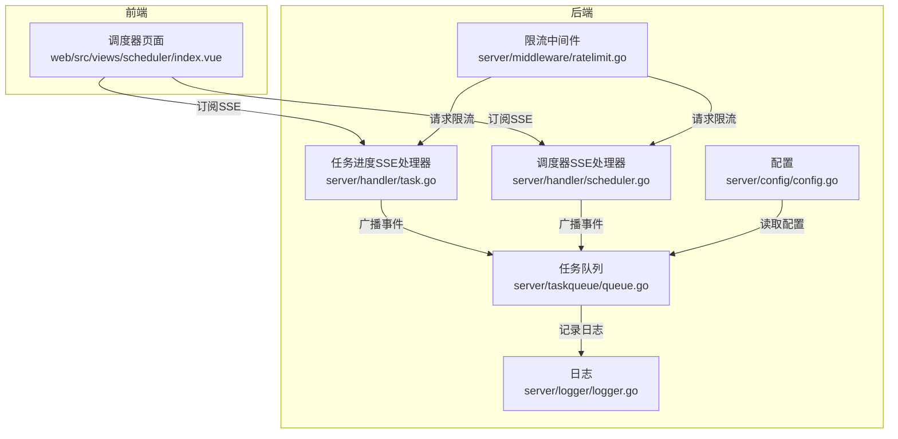
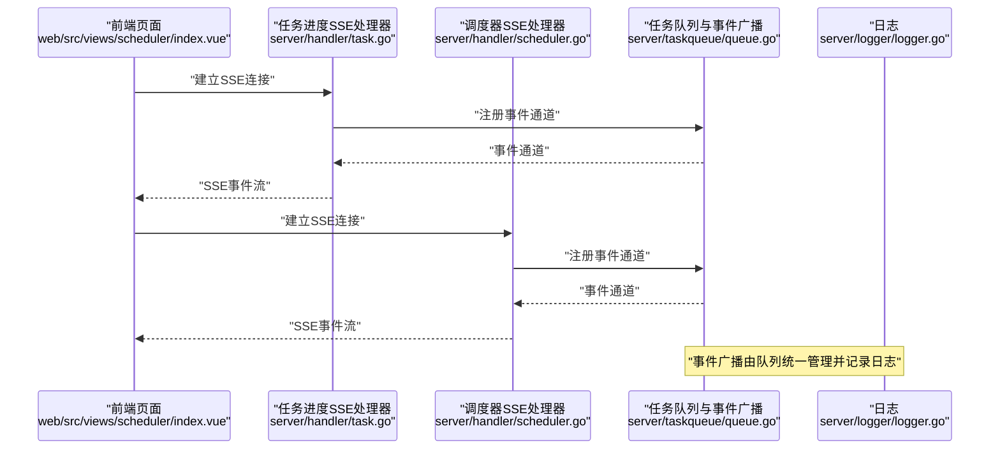
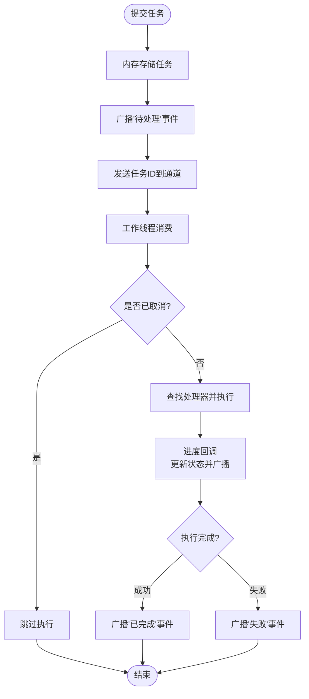
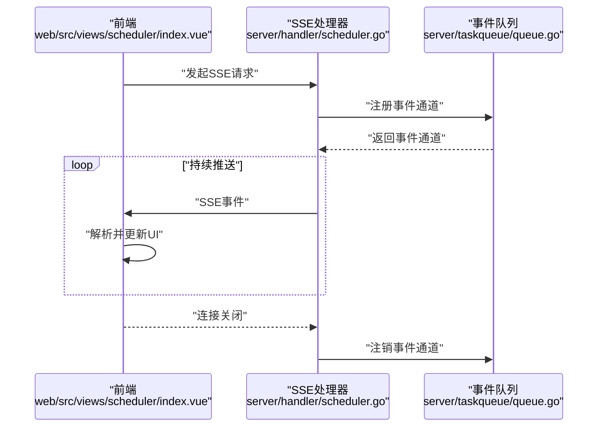
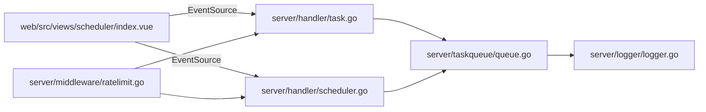

# 并发控制与事件广播

<cite>
**本文引用的文件**
- [server/taskqueue/queue.go](file://server/taskqueue/queue.go)
- [server/handler/task.go](file://server/handler/task.go)
- [server/handler/scheduler.go](file://server/handler/scheduler.go)
- [web/src/views/scheduler/index.vue](file://web/src/views/scheduler/index.vue)
- [server/main.go](file://server/main.go)
- [server/config/config.go](file://server/config/config.go)
- [server/middleware/ratelimit.go](file://server/middleware/ratelimit.go)
- [server/logger/logger.go](file://server/logger/logger.go)
</cite>

## 目录
1. [引言](#引言)
2. [项目结构](#项目结构)
3. [核心组件](#核心组件)
4. [架构总览](#架构总览)
5. [详细组件分析](#详细组件分析)
6. [依赖关系分析](#依赖关系分析)
7. [性能考虑](#性能考虑)
8. [故障排查指南](#故障排查指南)
9. [结论](#结论)
10. [附录](#附录)

## 引言
本文件聚焦于 Open 虚拟机管理控制台中的“并发控制与事件广播”子系统，围绕以下目标展开：  
- 任务队列的并发控制机制：工作线程数量配置、任务通道缓冲区管理、负载均衡策略  
- SSE 事件广播系统：客户端注册、事件分发与连接管理  
- 并发安全实现：互斥锁与原子操作的应用  
- 事件丢失处理与客户端缓冲区管理策略  
- 性能调优建议与最佳实践  

## 项目结构
后端采用 Go 编写的微服务架构，前端使用 Vue 3 + Vite 构建。与本主题相关的关键模块如下：  
- 任务队列与事件广播：位于 server/taskqueue/queue.go  
- 任务进度 SSE 接口：位于 server/handler/task.go  
- 调度器 SSE 接口：位于 server/handler/scheduler.go  
- 前端订阅与重连逻辑：位于 web/src/views/scheduler/index.vue  
- 全局入口与配置：server/main.go、server/config/config.go  
- 限流中间件：server/middleware/ratelimit.go  
- 日志记录：server/logger/logger.go  

图表来源
- [server/taskqueue/queue.go:1-306](file://server/taskqueue/queue.go#L1-L306)
- [server/handler/task.go:87-105](file://server/handler/task.go#L87-L105)
- [server/handler/scheduler.go:96-115](file://server/handler/scheduler.go#L96-L115)
- [web/src/views/scheduler/index.vue:266-310](file://web/src/views/scheduler/index.vue#L266-L310)

章节来源
- [server/main.go](file://server/main.go)
- [server/config/config.go](file://server/config/config.go)

## 核心组件
- 任务队列与事件广播核心：负责任务提交、执行、状态更新与 SSE 事件广播  
- 任务进度 SSE 处理器：为任务进度提供实时事件流  
- 调度器 SSE 处理器：为调度事件提供实时事件流  
- 前端订阅与重连：基于浏览器 EventSource 订阅并自动重连  
- 并发安全：读写锁、原子计数、通道与上下文取消  
- 日志与限流：统一日志输出与请求限流保护

章节来源
- [server/taskqueue/queue.go:171-227](file://server/taskqueue/queue.go#L171-L227)
- [server/handler/task.go:87-105](file://server/handler/task.go#L87-L105)
- [server/handler/scheduler.go:96-115](file://server/handler/scheduler.go#L96-L115)
- [web/src/views/scheduler/index.vue:266-310](file://web/src/views/scheduler/index.vue#L266-L310)

## 架构总览
下图展示了从任务提交到事件广播的整体流程，以及前端订阅与后端并发处理的关系。

图表来源
- [server/handler/task.go:87-105](file://server/handler/task.go#L87-L105)
- [server/handler/scheduler.go:96-115](file://server/handler/scheduler.go#L96-L115)
- [server/taskqueue/queue.go:171-227](file://server/taskqueue/queue.go#L171-L227)
- [server/logger/logger.go](file://server/logger/logger.go)

## 详细组件分析

### 任务队列与并发控制
- 工作线程数量配置：通过 Start(workerCount) 启动指定数量的工作协程，每个协程从任务通道消费任务  
- 任务通道缓冲区：使用带缓冲的任务通道，初始容量为固定值；Submit 将任务 ID 发送到通道，触发消费者处理  
- 负载均衡策略：采用简单的一对一通道消费模型，所有工作线程共享同一任务通道，天然实现基本的负载均衡  
- 任务生命周期：提交 -> 内存存储 -> 广播“待处理” -> 分配给空闲工作线程 -> 执行 -> 广播“运行中” -> 处理器回调进度 -> 完成/失败 -> 广播最终状态  
- 取消与上下文：为每个运行中任务保存取消函数，支持外部取消；处理器内部使用进度回调进行状态更新与事件广播  
- 并发安全：任务存储使用读写锁保护；任务 ID 使用原子自增保证唯一性；事件通道为内置同步通道，避免额外加锁  
- 清理策略：后台定时清理长时间未更新或已完成的任务，降低内存占用  

图表来源
- [server/taskqueue/queue.go:183-306](file://server/taskqueue/queue.go#L183-L306)

章节来源
- [server/taskqueue/queue.go:171-227](file://server/taskqueue/queue.go#L171-L227)
- [server/taskqueue/queue.go:229-306](file://server/taskqueue/queue.go#L229-L306)

### SSE 事件广播系统
- 客户端注册：SSE 处理器创建事件通道并注册到全局事件广播中心，使用上下文 Done 侦测客户端断开  
- 事件分发：任务队列在状态变更时统一广播事件；SSE 处理器从通道读取事件并通过流式响应推送给客户端  
- 连接管理：客户端断开时自动注销事件通道；前端使用 EventSource 自动重连，提升鲁棒性  
- 前端订阅：前端页面在挂载时建立 SSE 连接，监听“connected”和“scheduler_event”事件，异常时自动重连  

图表来源
- [server/handler/scheduler.go:96-115](file://server/handler/scheduler.go#L96-L115)
- [web/src/views/scheduler/index.vue:266-310](file://web/src/views/scheduler/index.vue#L266-L310)

章节来源
- [server/handler/task.go:87-105](file://server/handler/task.go#L87-L105)
- [server/handler/scheduler.go:96-115](file://server/handler/scheduler.go#L96-L115)
- [web/src/views/scheduler/index.vue:266-310](file://web/src/views/scheduler/index.vue#L266-L310)

### 并发安全实现
- 互斥锁：任务存储使用读写锁，读多写少场景下提升并发性能；处理器映射使用读写锁保护  
- 原子操作：任务 ID 使用原子自增，确保高并发下的唯一性与无锁增长  
- 通道与上下文：任务通道为内置同步通道，避免额外加锁；使用 context.WithCancel 支持取消与超时  
- 日志：统一通过日志模块输出，避免并发写入竞争  

章节来源
- [server/taskqueue/queue.go:43-48](file://server/taskqueue/queue.go#L43-L48)
- [server/taskqueue/queue.go:268-270](file://server/taskqueue/queue.go#L268-L270)
- [server/logger/logger.go](file://server/logger/logger.go)

### 事件丢失处理与客户端缓冲区管理
- 事件丢失风险：当前实现依赖事件通道的缓冲区；若客户端处理速度慢于事件产生速度，可能导致部分事件丢失  
- 缓冲区策略：SSE 处理器侧创建带缓冲的事件通道；任务队列侧任务通道同样有缓冲；需根据业务吞吐量调整缓冲大小  
- 客户端重连：前端使用 EventSource 的自动重连机制，异常断开后等待固定时间再次连接，降低数据不一致影响  
- 建议优化：  
  - 为每个客户端维护独立的事件通道与缓冲队列，避免全局共享导致的阻塞  
  - 在客户端侧引入本地缓存与去重机制，结合事件序号或时间戳进行幂等处理  
  - 对高频事件进行合并或采样，减少网络与前端压力  

章节来源
- [server/handler/task.go:97-105](file://server/handler/task.go#L97-L105)
- [server/handler/scheduler.go:96-115](file://server/handler/scheduler.go#L96-L115)
- [web/src/views/scheduler/index.vue:266-310](file://web/src/views/scheduler/index.vue#L266-L310)

## 依赖关系分析
- 任务队列依赖：日志模块用于记录事件与状态；模型层提供任务结构定义  
- SSE 处理器依赖：任务队列提供事件通道注册与注销接口；HTTP 框架提供流式响应能力  
- 前端依赖：浏览器 EventSource API；Vue 页面组件负责连接与渲染  
- 中间件：限流中间件保护 SSE 接口免受突发流量冲击  

图表来源
- [server/taskqueue/queue.go:1-306](file://server/taskqueue/queue.go#L1-L306)
- [server/handler/task.go:87-105](file://server/handler/task.go#L87-L105)
- [server/handler/scheduler.go:96-115](file://server/handler/scheduler.go#L96-L115)
- [web/src/views/scheduler/index.vue:266-310](file://web/src/views/scheduler/index.vue#L266-L310)
- [server/middleware/ratelimit.go](file://server/middleware/ratelimit.go)

章节来源
- [server/taskqueue/queue.go:1-306](file://server/taskqueue/queue.go#L1-L306)
- [server/handler/task.go:87-105](file://server/handler/task.go#L87-L105)
- [server/handler/scheduler.go:96-115](file://server/handler/scheduler.go#L96-L115)
- [web/src/views/scheduler/index.vue:266-310](file://web/src/views/scheduler/index.vue#L266-L310)
- [server/middleware/ratelimit.go](file://server/middleware/ratelimit.go)

## 性能考虑
- 工作线程数量：根据 CPU 核心数与 I/O 密集程度设置合理数量，避免过多上下文切换  
- 通道缓冲区：根据峰值吞吐量估算缓冲区大小，防止阻塞与丢事件；必要时采用背压策略  
- 进度回调频率：避免过于频繁的状态更新，建议批量或节流上报  
- 日志级别：生产环境降低日志量级，避免 IO 抖动  
- 限流策略：为 SSE 接口启用限流，防止恶意连接或突发流量  
- 内存清理：定期清理历史任务，避免内存膨胀  

## 故障排查指南
- 任务未被消费：检查工作线程是否正常启动、任务通道是否阻塞  
- 事件未到达前端：确认 SSE 处理器是否正确注册通道、客户端是否断开、前端是否重连  
- 并发冲突：核对读写锁使用是否正确，是否存在竞态条件  
- 取消无效：确认取消函数是否正确存储与调用，上下文传播是否完整  
- 日志定位：通过日志模块输出的关键字段快速定位问题节点  

章节来源
- [server/taskqueue/queue.go:171-227](file://server/taskqueue/queue.go#L171-L227)
- [server/handler/task.go:87-105](file://server/handler/task.go#L87-L105)
- [server/handler/scheduler.go:96-115](file://server/handler/scheduler.go#L96-L115)
- [web/src/views/scheduler/index.vue:266-310](file://web/src/views/scheduler/index.vue#L266-L310)

## 结论
本系统通过“任务通道 + 工作线程 + SSE 事件广播”的组合，在保证并发安全的前提下实现了高效的异步任务处理与实时事件推送。建议在生产环境中进一步完善客户端缓冲与去重、限流与背压策略，并根据实际负载动态调整工作线程与通道缓冲大小，以获得更稳定的性能表现。

## 附录
- 关键实现位置参考：  
  - 任务队列与事件广播：[server/taskqueue/queue.go](file://server/taskqueue/queue.go)  
  - 任务进度 SSE 处理器：[server/handler/task.go](file://server/handler/task.go)  
  - 调度器 SSE 处理器：[server/handler/scheduler.go](file://server/handler/scheduler.go)  
  - 前端订阅与重连：[web/src/views/scheduler/index.vue](file://web/src/views/scheduler/index.vue)  
  - 配置与入口：[server/main.go](file://server/main.go)、[server/config/config.go](file://server/config/config.go)  
  - 限流中间件：[server/middleware/ratelimit.go](file://server/middleware/ratelimit.go)  
  - 日志模块：[server/logger/logger.go](file://server/logger/logger.go)