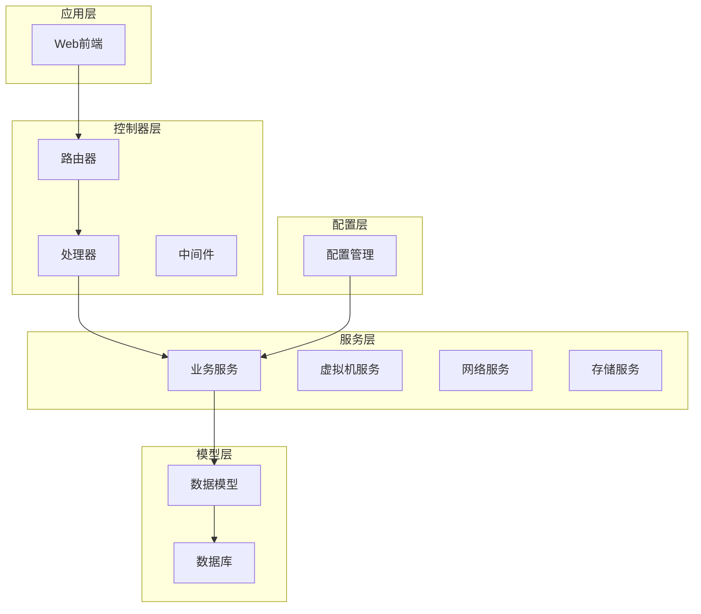
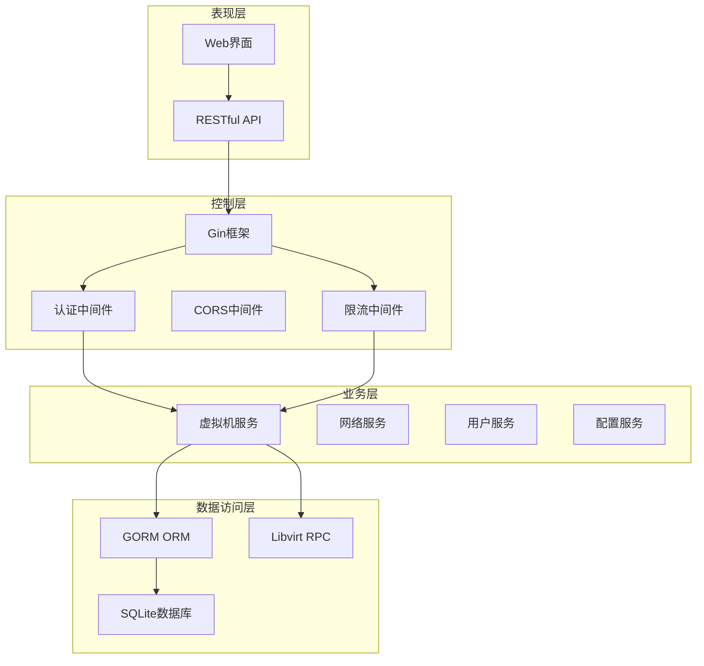
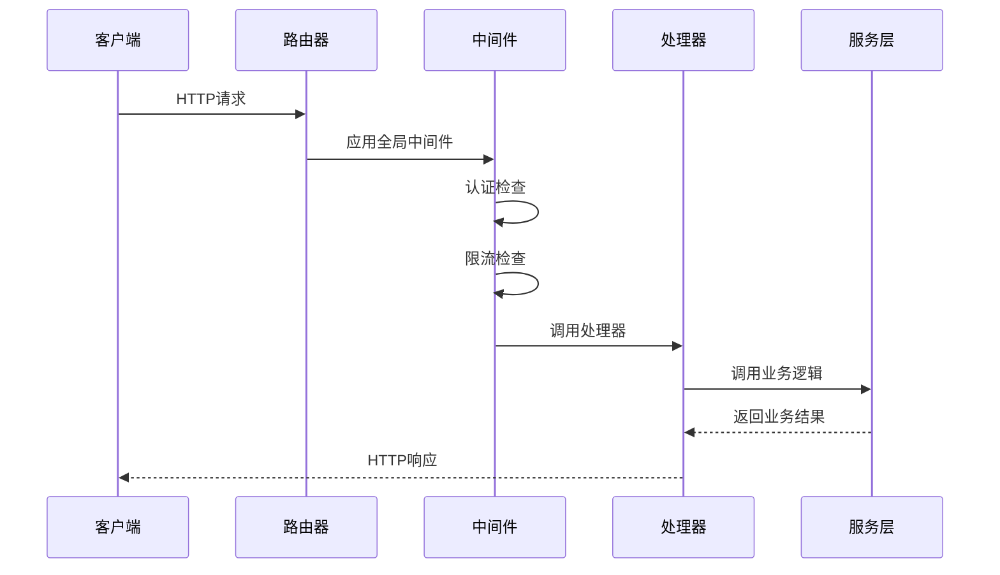
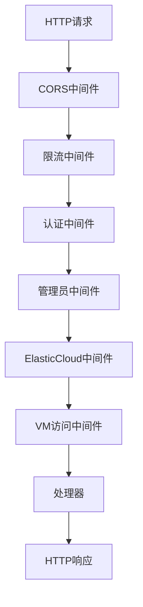
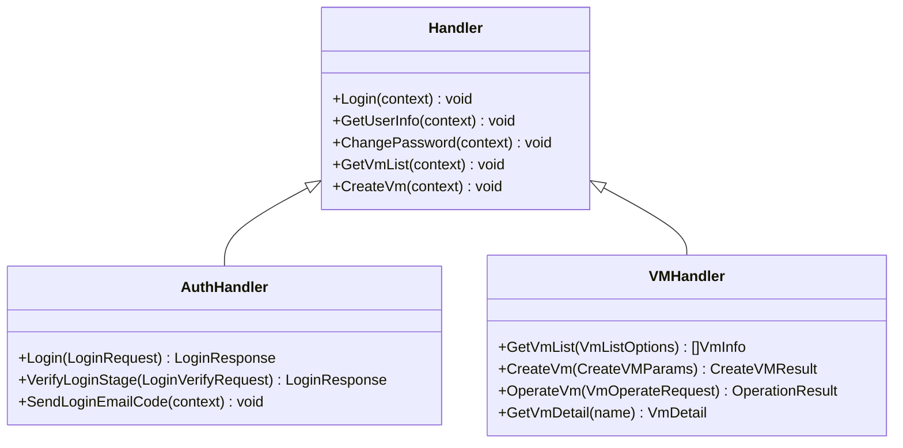
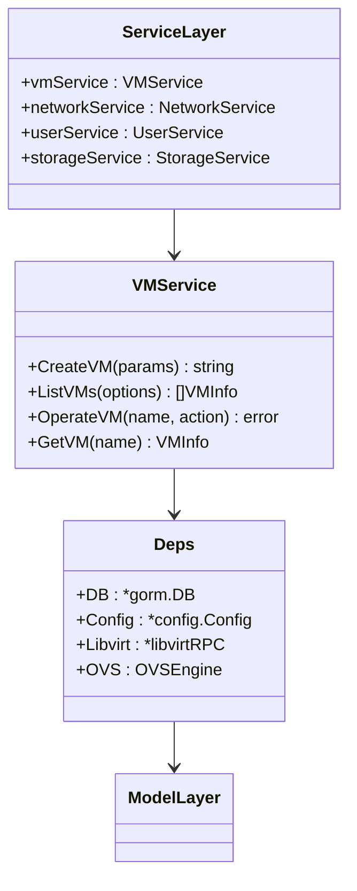
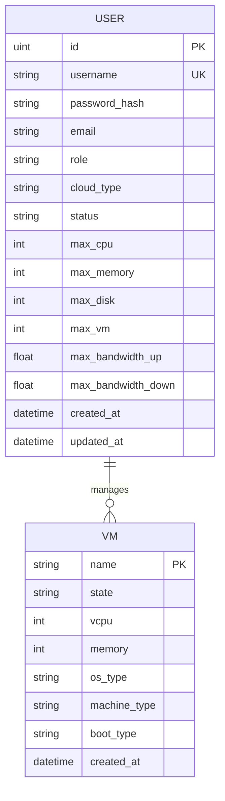
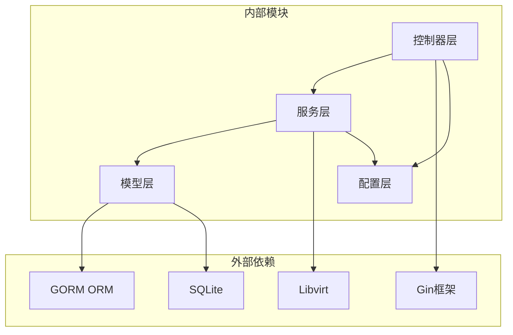
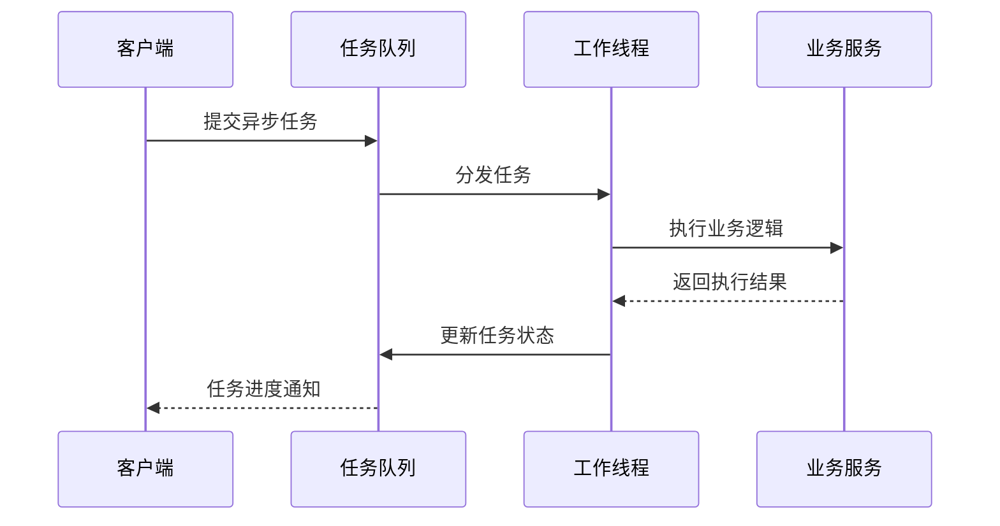

# 分层架构设计

<cite>
**本文档引用的文件**
- [server/main.go](file://server/main.go)
- [server/router/router.go](file://server/router/router.go)
- [server/middleware/auth.go](file://server/middleware/auth.go)
- [server/handler/auth.go](file://server/handler/auth.go)
- [server/handler/types.go](file://server/handler/types.go)
- [server/handler/vm.go](file://server/handler/vm.go)
- [server/model/db.go](file://server/model/db.go)
- [server/model/user.go](file://server/model/user.go)
- [server/config/config.go](file://server/config/config.go)
- [server/service/vm/deps.go](file://server/service/vm/deps.go)
- [server/service/vm/create.go](file://server/service/vm/create.go)
</cite>

## 目录
1. [简介](#简介)
2. [项目结构](#项目结构)
3. [核心组件](#核心组件)
4. [架构概览](#架构概览)
5. [详细组件分析](#详细组件分析)
6. [依赖分析](#依赖分析)
7. [性能考虑](#性能考虑)
8. [故障排除指南](#故障排除指南)
9. [结论](#结论)

## 简介

Open虚拟机管理控制台采用经典的三层架构设计，将系统分为控制器层（Controller）、服务层（Service）和模型层（Model）。这种分层架构实现了关注点分离，提高了代码的可维护性、可测试性和可扩展性。

该系统基于Go语言开发，使用Gin框架处理HTTP请求，GORM进行数据库操作，支持虚拟化管理、网络配置、存储管理等核心功能。

## 项目结构

项目采用清晰的分层组织结构：

**图表来源**
- [server/main.go:119-128](file://server/main.go#L119-L128)
- [server/router/router.go:19-485](file://server/router/router.go#L19-L485)

**章节来源**
- [server/main.go:31-128](file://server/main.go#L31-L128)
- [server/router/router.go:19-485](file://server/router/router.go#L19-L485)

## 核心组件

### 控制器层（Controller Layer）

控制器层负责处理HTTP请求和响应，主要包含三个子层：

1. **路由器（Router）**：负责URL路由映射和请求分发
2. **处理器（Handler）**：处理具体的业务请求，进行参数验证和响应格式化
3. **中间件（Middleware）**：处理跨切面功能，如认证、授权、限流等

### 服务层（Service Layer）

服务层封装核心业务逻辑，提供领域服务和应用服务：
- 虚拟机管理服务
- 网络管理服务  
- 存储管理服务
- 用户管理服务
- 系统配置服务

### 模型层（Model Layer）

模型层负责数据访问和持久化：
- 数据库实体模型
- 数据库连接管理
- 数据迁移和版本控制

**章节来源**
- [server/handler/auth.go:102-202](file://server/handler/auth.go#L102-L202)
- [server/middleware/auth.go:76-199](file://server/middleware/auth.go#L76-L199)
- [server/model/db.go:54-113](file://server/model/db.go#L54-L113)

## 架构概览

系统采用分层架构设计，各层职责明确，耦合度低：

**图表来源**
- [server/main.go:31-128](file://server/main.go#L31-L128)
- [server/router/router.go:19-485](file://server/router/router.go#L19-L485)
- [server/middleware/auth.go:76-199](file://server/middleware/auth.go#L76-L199)

## 详细组件分析

### 路由器层设计

路由器层采用Gin框架，实现了灵活的路由管理和中间件链：

**图表来源**
- [server/router/router.go:19-485](file://server/router/router.go#L19-L485)
- [server/middleware/auth.go:76-199](file://server/middleware/auth.go#L76-L199)

#### 路由组织结构

路由器按功能模块组织路由：

| 路由组 | 描述 | 示例路径 |
|--------|------|----------|
| /api/auth | 认证相关 | POST /api/auth/login, GET /api/auth/invite |
| /api/vm | 虚拟机管理 | GET /api/vm/list, POST /api/vm/create |
| /api/template | 模板管理 | GET /api/template/list, POST /api/template/prepare |
| /api/network | 网络管理 | GET /api/network/static-ip/list, POST /api/network/port-forward/add |
| /api/storage-pool | 存储池管理 | GET /api/storage-pool/list, POST /api/storage-pool/create-volume |

**章节来源**
- [server/router/router.go:35-478](file://server/router/router.go#L35-L478)

### 中间件层设计

中间件层提供了横切关注点的统一处理：

**图表来源**
- [server/middleware/auth.go:76-324](file://server/middleware/auth.go#L76-L324)

#### 中间件功能

| 中间件类型 | 功能描述 | 应用场景 |
|------------|----------|----------|
| CORS中间件 | 处理跨域请求 | 前后端分离 |
| 限流中间件 | API请求频率控制 | 防止滥用 |
| 认证中间件 | JWT Token验证 | 所有受保护接口 |
| 管理员中间件 | 权限检查 | 系统管理功能 |
| ElasticCloud中间件 | 云类型限制 | 轻量云用户隔离 |
| VM访问中间件 | 虚拟机权限验证 | VM操作接口 |

**章节来源**
- [server/middleware/auth.go:76-324](file://server/middleware/auth.go#L76-L324)

### 处理器层设计

处理器层负责具体的业务请求处理：

**图表来源**
- [server/handler/auth.go:102-202](file://server/handler/auth.go#L102-L202)
- [server/handler/vm.go:82-126](file://server/handler/vm.go#L82-L126)

#### 处理器职责

处理器层的主要职责包括：
1. **参数验证**：使用结构体标签进行输入验证
2. **业务调用**：调用服务层处理具体业务逻辑
3. **响应格式化**：统一JSON响应格式
4. **错误处理**：捕获和转换业务异常

**章节来源**
- [server/handler/auth.go:102-202](file://server/handler/auth.go#L102-L202)
- [server/handler/types.go:9-59](file://server/handler/types.go#L9-L59)

### 服务层设计

服务层封装核心业务逻辑，采用依赖注入模式：

**图表来源**
- [server/service/vm/deps.go:17-175](file://server/service/vm/deps.go#L17-L175)
- [server/service/vm/create.go:148-574](file://server/service/vm/create.go#L148-L574)

#### 依赖注入机制

服务层通过依赖容器实现松耦合：

| 依赖类型 | 作用域 | 示例依赖 |
|----------|--------|----------|
| 数据库连接 | 全局 | gorm.DB |
| 配置管理 | 全局 | config.Config |
| Libvirt RPC | 全局 | libvirtRPC |
| 网络引擎 | 全局 | OVSEngine |
| 存储管理 | 局部 | storage/disk |
| 网络管理 | 局部 | network/vpc |

**章节来源**
- [server/service/vm/deps.go:17-175](file://server/service/vm/deps.go#L17-L175)
- [server/service/vm/create.go:148-574](file://server/service/vm/create.go#L148-L574)

### 模型层设计

模型层负责数据持久化和数据库操作：

**图表来源**
- [server/model/user.go:9-56](file://server/model/user.go#L9-L56)
- [server/model/db.go:86-92](file://server/model/db.go#L86-L92)

#### 数据模型设计

| 实体 | 主要字段 | 关系 |
|------|----------|------|
| User | id, username, password_hash, role, cloud_type | 1对多: VM |
| VM | name, state, vcpu, memory, os_type | N对1: User |
| VMCredential | vm_name, username, password | 1对1: VM |
| VPCSwitch | id, name, cidr | 1对多: VPCVMBinding |
| VPCVMBinding | vm_name, switch_id, interface_order | 1对1: VM |

**章节来源**
- [server/model/user.go:9-56](file://server/model/user.go#L9-L56)
- [server/model/db.go:86-113](file://server/model/db.go#L86-L113)

## 依赖分析

系统采用依赖倒置原则，实现松耦合设计：

**图表来源**
- [server/main.go:31-128](file://server/main.go#L31-L128)
- [server/service/vm/deps.go:17-175](file://server/service/vm/deps.go#L17-L175)

### 依赖关系特点

1. **向上依赖**：下层模块可以依赖上层模块
2. **向下依赖**：上层模块不能依赖下层模块
3. **接口隔离**：通过接口定义抽象依赖
4. **依赖注入**：通过构造函数注入依赖

**章节来源**
- [server/main.go:31-128](file://server/main.go#L31-L128)
- [server/service/vm/deps.go:172-175](file://server/service/vm/deps.go#L172-L175)

## 性能考虑

### 缓存策略

系统实现了多层次缓存机制：

1. **VM缓存**：内存中缓存虚拟机状态
2. **配置缓存**：缓存系统配置减少数据库访问
3. **用户权限缓存**：缓存用户权限信息

### 并发处理

**图表来源**
- [server/main.go:130-503](file://server/main.go#L130-L503)

### 性能优化措施

| 优化方面 | 实现方式 | 效果 |
|----------|----------|------|
| 数据库查询 | 连接池管理 | 减少连接开销 |
| 缓存策略 | 多级缓存 | 提高响应速度 |
| 异步处理 | 任务队列 | 提升并发能力 |
| 中间件优化 | 早返回机制 | 减少不必要的处理 |

**章节来源**
- [server/main.go:130-503](file://server/main.go#L130-L503)

## 故障排除指南

### 常见问题及解决方案

#### 认证相关问题

| 问题类型 | 症状 | 解决方案 |
|----------|------|----------|
| Token过期 | 401 Unauthorized | 重新登录获取新Token |
| 权限不足 | 403 Forbidden | 检查用户角色和权限 |
| API Key无效 | 401 Unauthorized | 验证API Key格式和有效期 |

#### 业务逻辑问题

| 问题类型 | 症状 | 解决方案 |
|----------|------|----------|
| 虚拟机创建失败 | 创建过程报错 | 检查磁盘空间和配置参数 |
| 网络配置错误 | VM无法上网 | 验证网络桥接和VPC配置 |
| 存储空间不足 | 磁盘操作失败 | 清理存储空间或扩容 |

#### 数据库问题

| 问题类型 | 症状 | 解决方案 |
|----------|------|----------|
| 连接失败 | 数据库连接错误 | 检查数据库路径和权限 |
| 迁移失败 | 表结构不匹配 | 执行数据库迁移脚本 |
| 查询超时 | SQL执行缓慢 | 优化查询语句和索引 |

**章节来源**
- [server/middleware/auth.go:102-199](file://server/middleware/auth.go#L102-L199)
- [server/model/db.go:54-113](file://server/model/db.go#L54-L113)

## 结论

Open虚拟机管理控制台的分层架构设计具有以下优势：

1. **职责清晰**：每层都有明确的职责边界，便于维护和扩展
2. **松耦合**：通过依赖注入和接口抽象实现模块解耦
3. **可测试性**：清晰的层次结构便于单元测试和集成测试
4. **可扩展性**：新增功能只需在相应层次添加代码
5. **安全性**：中间件层统一处理安全相关逻辑

该架构设计为虚拟化管理系统的开发提供了良好的基础，支持未来功能的持续扩展和性能优化。通过合理的分层设计，系统能够在保证稳定性的同时，快速响应业务需求的变化。