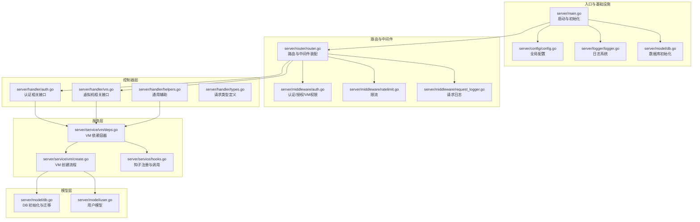
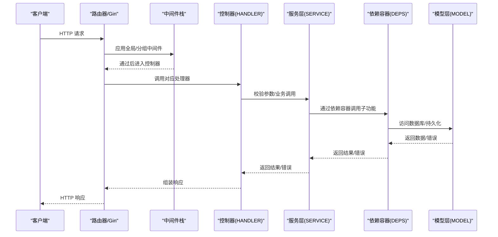
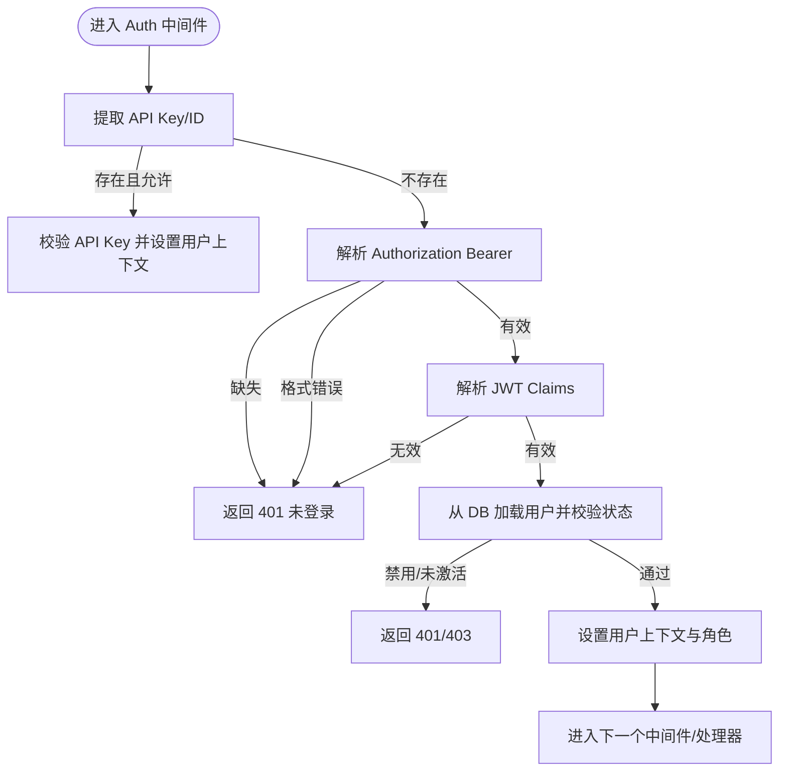
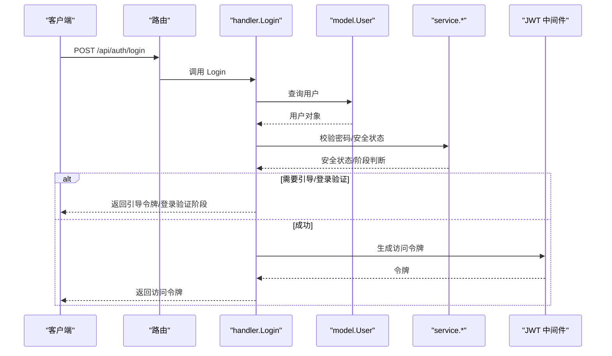
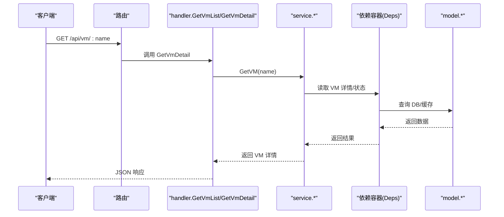
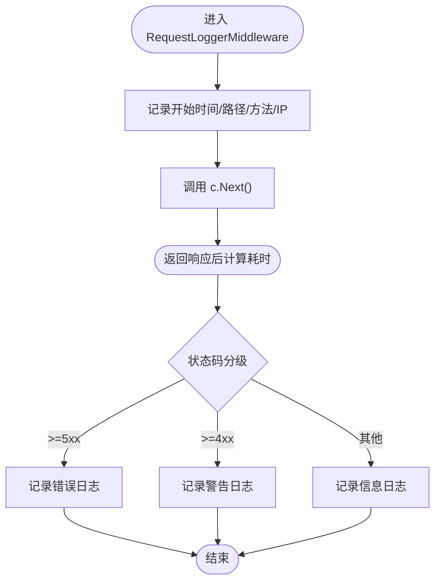
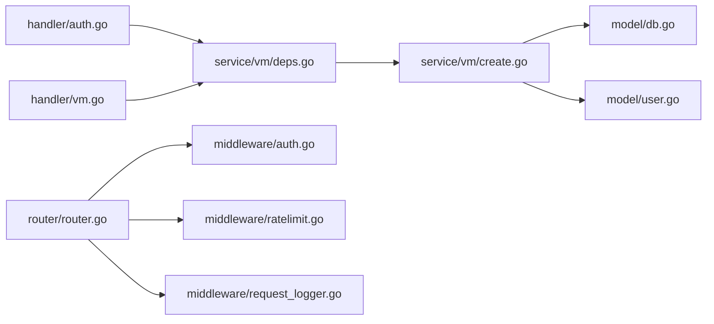

# 层间交互模式

<cite>
**本文引用的文件**
- [server/main.go](file://server/main.go)
- [server/router/router.go](file://server/router/router.go)
- [server/middleware/auth.go](file://server/middleware/auth.go)
- [server/middleware/request_logger.go](file://server/middleware/request_logger.go)
- [server/middleware/ratelimit.go](file://server/middleware/ratelimit.go)
- [server/handler/auth.go](file://server/handler/auth.go)
- [server/handler/vm.go](file://server/handler/vm.go)
- [server/handler/helpers.go](file://server/handler/helpers.go)
- [server/handler/types.go](file://server/handler/types.go)
- [server/model/db.go](file://server/model/db.go)
- [server/model/user.go](file://server/model/user.go)
- [server/service/vm/deps.go](file://server/service/vm/deps.go)
- [server/service/vm/create.go](file://server/service/vm/create.go)
- [server/service/hooks.go](file://server/service/hooks.go)
- [server/config/config.go](file://server/config/config.go)
- [server/logger/logger.go](file://server/logger/logger.go)
</cite>

## 目录
1. [简介](#简介)
2. [项目结构](#项目结构)
3. [核心组件](#核心组件)
4. [架构总览](#架构总览)
5. [详细组件分析](#详细组件分析)
6. [依赖分析](#依赖分析)
7. [性能考虑](#性能考虑)
8. [故障排查指南](#故障排查指南)
9. [结论](#结论)

## 简介
本文件面向 Open 虚拟机管理控制台的三层架构（控制器-服务-模型），系统化梳理层间交互模式与数据传递流程，重点说明：
- 控制器（handler）、中间件（middleware）、服务（service）、模型（model）之间的调用关系与职责边界
- 参数传递、错误传播与异常处理机制
- 中间件如何实现横切关注点（认证、授权、日志、限流）
- 层间解耦设计原则、依赖方向与接口定义规范
- 典型业务场景（如虚拟机创建、登录认证）在多层架构中的完整调用链与错误处理流程

## 项目结构
后端采用 Go Gin Web 框架，按“控制器-中间件-服务-模型”分层组织；入口在 main.go 初始化配置、日志、数据库、RPC、路由与任务队列，随后启动 HTTP 服务。

图示来源
- [server/main.go:31-128](file://server/main.go#L31-L128)
- [server/router/router.go:18-485](file://server/router/router.go#L18-L485)
- [server/middleware/auth.go:75-324](file://server/middleware/auth.go#L75-L324)
- [server/middleware/ratelimit.go:173-211](file://server/middleware/ratelimit.go#L173-L211)
- [server/middleware/request_logger.go:11-70](file://server/middleware/request_logger.go#L11-L70)
- [server/handler/auth.go:101-202](file://server/handler/auth.go#L101-L202)
- [server/handler/vm.go:81-126](file://server/handler/vm.go#L81-L126)
- [server/handler/helpers.go:17-179](file://server/handler/helpers.go#L17-L179)
- [server/handler/types.go:9-59](file://server/handler/types.go#L9-L59)
- [server/service/vm/deps.go:17-274](file://server/service/vm/deps.go#L17-L274)
- [server/service/vm/create.go:147-200](file://server/service/vm/create.go#L147-L200)
- [server/service/hooks.go:1-81](file://server/service/hooks.go#L1-L81)
- [server/model/db.go:57-113](file://server/model/db.go#L57-L113)
- [server/model/user.go:9-56](file://server/model/user.go#L9-L56)

章节来源
- [server/main.go:31-128](file://server/main.go#L31-L128)
- [server/router/router.go:18-485](file://server/router/router.go#L18-L485)

## 核心组件
- 控制器（Handler）：接收 HTTP 请求，解析参数，调用服务层执行业务，组装响应。典型如登录、虚拟机列表/详情、创建等接口。
- 中间件（Middleware）：全局或分组应用，实现认证、授权、限流、CORS、请求日志等横切关注点。
- 服务层（Service）：封装业务逻辑与领域操作，协调模型与外部系统（如 libvirt RPC、存储、网络）。通过依赖容器解耦子包。
- 模型层（Model）：数据库 ORM 定义与迁移，提供数据持久化能力。

章节来源
- [server/handler/auth.go:101-202](file://server/handler/auth.go#L101-L202)
- [server/handler/vm.go:81-126](file://server/handler/vm.go#L81-L126)
- [server/middleware/auth.go:75-324](file://server/middleware/auth.go#L75-L324)
- [server/service/vm/deps.go:17-274](file://server/service/vm/deps.go#L17-L274)
- [server/model/db.go:57-113](file://server/model/db.go#L57-L113)

## 架构总览
控制器-中间件-服务-模型的调用链遵循“自顶向下、自外向内”的依赖方向，控制器仅依赖服务接口，服务层通过依赖容器与模型层交互，避免循环依赖。

图示来源
- [server/router/router.go:18-485](file://server/router/router.go#L18-L485)
- [server/middleware/auth.go:75-324](file://server/middleware/auth.go#L75-L324)
- [server/handler/auth.go:101-202](file://server/handler/auth.go#L101-L202)
- [server/service/vm/deps.go:17-274](file://server/service/vm/deps.go#L17-L274)
- [server/model/db.go:57-113](file://server/model/db.go#L57-L113)

## 详细组件分析

### 认证与授权中间件
- 作用：解析 JWT 或 API Key，校验用户状态与角色，拦截无权限访问；支持登录态、高风险操作、弹性云限制等策略。
- 关键点：
  - 支持多种 Token 类型与来源（Header、Query、API Key 头）。
  - 校验用户存在、状态、安全更新时间等。
  - 提供管理员、VM 所有权、弹性云能力隔离等中间件。

图示来源
- [server/middleware/auth.go:75-324](file://server/middleware/auth.go#L75-L324)

章节来源
- [server/middleware/auth.go:75-324](file://server/middleware/auth.go#L75-L324)

### 登录流程（控制器-服务-模型）
- 控制器接收用户名/密码，查询用户并校验状态。
- 依据安全状态生成不同阶段的令牌（引导、登录验证、访问令牌）。
- 服务层负责密码校验、挑战/恢复码校验、安全状态构建等。

图示来源
- [server/handler/auth.go:101-202](file://server/handler/auth.go#L101-L202)
- [server/model/user.go:9-56](file://server/model/user.go#L9-L56)

章节来源
- [server/handler/auth.go:101-202](file://server/handler/auth.go#L101-L202)
- [server/model/user.go:9-56](file://server/model/user.go#L9-L56)

### 虚拟机创建流程（控制器-服务-模型）
- 控制器解析请求体，调用服务层执行创建。
- 服务层通过依赖容器执行校验、存储解析、XML 生成、磁盘创建、网络绑定等。
- 模型层参与配额检查、持久化状态变更。

图示来源
- [server/handler/vm.go:101-126](file://server/handler/vm.go#L101-L126)
- [server/service/vm/deps.go:17-274](file://server/service/vm/deps.go#L17-L274)
- [server/model/db.go:57-113](file://server/model/db.go#L57-L113)

章节来源
- [server/handler/vm.go:81-126](file://server/handler/vm.go#L81-L126)
- [server/service/vm/deps.go:17-274](file://server/service/vm/deps.go#L17-L274)
- [server/service/vm/create.go:147-200](file://server/service/vm/create.go#L147-L200)

### 请求日志与限流中间件
- 请求日志：按状态码分级记录，携带用户、路径、耗时等信息。
- 限流：基于滑动窗口的 IP 级限流，支持公开/认证接口不同阈值，定期清理过期条目。

图示来源
- [server/middleware/request_logger.go:11-70](file://server/middleware/request_logger.go#L11-L70)

章节来源
- [server/middleware/ratelimit.go:173-211](file://server/middleware/ratelimit.go#L173-L211)
- [server/middleware/request_logger.go:11-70](file://server/middleware/request_logger.go#L11-L70)

### 错误处理与异常传播
- 控制器层：对服务层返回的错误进行分类处理，区分 libvirt 不可用、参数错误、业务约束等，返回标准化 HTTP 状态码与消息。
- 服务层：通过依赖容器与钩子机制，将跨子包逻辑延迟绑定，避免循环依赖；错误向上抛出，由控制器统一处理。
- 模型层：GORM 日志统一经 appWriter 输出，便于定位慢查询与错误。

章节来源
- [server/handler/helpers.go:17-31](file://server/handler/helpers.go#L17-L31)
- [server/service/hooks.go:1-81](file://server/service/hooks.go#L1-L81)
- [server/model/db.go:20-52](file://server/model/db.go#L20-L52)

## 依赖分析
- 控制器仅依赖服务接口，不直接依赖模型，保证控制器纯粹性。
- 服务层通过依赖容器（Deps）与各子包解耦，避免循环 import。
- 模型层集中于数据持久化与迁移，提供统一的 DB 访问入口。
- 中间件作为横切层，贯穿控制器前后，不引入业务逻辑。

图示来源
- [server/handler/auth.go:101-202](file://server/handler/auth.go#L101-L202)
- [server/handler/vm.go:81-126](file://server/handler/vm.go#L81-L126)
- [server/service/vm/deps.go:17-274](file://server/service/vm/deps.go#L17-L274)
- [server/service/vm/create.go:147-200](file://server/service/vm/create.go#L147-L200)
- [server/model/db.go:57-113](file://server/model/db.go#L57-L113)
- [server/model/user.go:9-56](file://server/model/user.go#L9-L56)
- [server/router/router.go:18-485](file://server/router/router.go#L18-L485)
- [server/middleware/auth.go:75-324](file://server/middleware/auth.go#L75-L324)
- [server/middleware/ratelimit.go:173-211](file://server/middleware/ratelimit.go#L173-L211)
- [server/middleware/request_logger.go:11-70](file://server/middleware/request_logger.go#L11-L70)

章节来源
- [server/service/vm/deps.go:17-274](file://server/service/vm/deps.go#L17-L274)
- [server/service/hooks.go:1-81](file://server/service/hooks.go#L1-L81)

## 性能考虑
- 限流中间件采用滑动窗口算法，降低突发请求对后端压力；公开接口默认较低阈值，认证接口可配置为不限制。
- 请求日志按状态码分级，减少高频错误日志噪声，提升可观测性。
- 服务层通过依赖容器与钩子延迟绑定，避免不必要的初始化成本。
- 数据库迁移与默认管理员初始化仅在启动阶段执行，减少运行时开销。

章节来源
- [server/middleware/ratelimit.go:173-211](file://server/middleware/ratelimit.go#L173-L211)
- [server/middleware/request_logger.go:11-70](file://server/middleware/request_logger.go#L11-L70)
- [server/model/db.go:57-113](file://server/model/db.go#L57-L113)

## 故障排查指南
- 登录失败
  - 检查用户状态（禁用/未激活）、密码哈希匹配、安全状态与挑战流程。
  - 若返回“需要引导/登录验证”，需按阶段完成相应流程。
- 虚拟机列表不可用
  - 若提示 libvirt 未就绪，检查服务状态与依赖；控制器会返回 503。
- 创建失败
  - 校验磁盘大小、名称重复、VPC 网桥存在性等前置条件；服务层会返回具体错误。
- 日志定位
  - 使用日志系统按类型输出，结合请求日志中的用户、路径、耗时快速定位问题。

章节来源
- [server/handler/auth.go:101-202](file://server/handler/auth.go#L101-L202)
- [server/handler/helpers.go:17-31](file://server/handler/helpers.go#L17-L31)
- [server/logger/logger.go:31-84](file://server/logger/logger.go#L31-L84)

## 结论
本项目通过清晰的分层与依赖注入，实现了控制器-服务-模型的高内聚低耦合。中间件统一承载横切关注点，服务层以依赖容器与钩子机制解耦子包，配合完善的错误处理与日志体系，保障了复杂虚拟机管理场景下的稳定性与可维护性。建议在扩展新功能时严格遵循“控制器只做编排、服务只做业务、模型只做持久化”的原则，并通过依赖容器与钩子保持层间解耦。