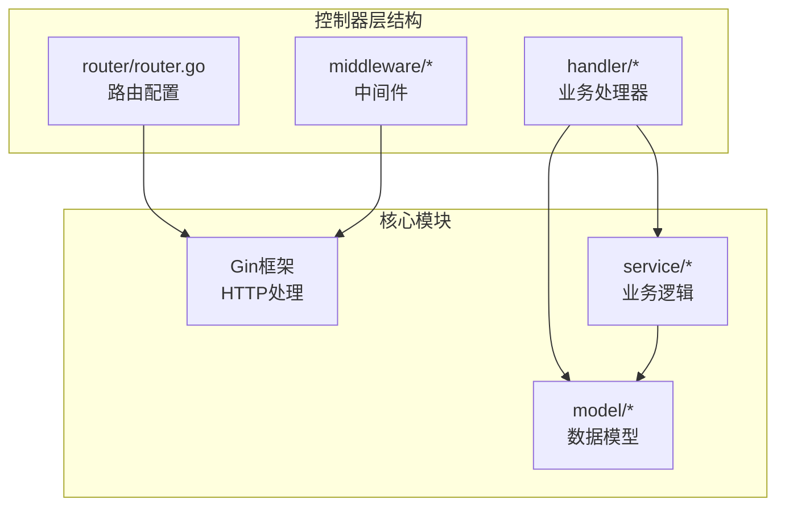
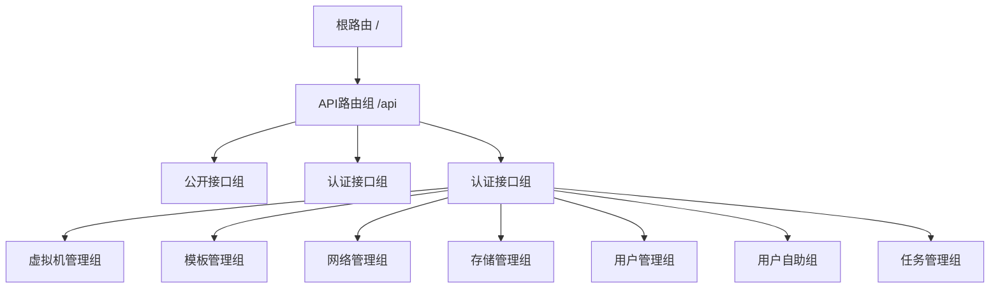
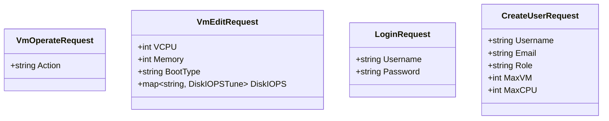
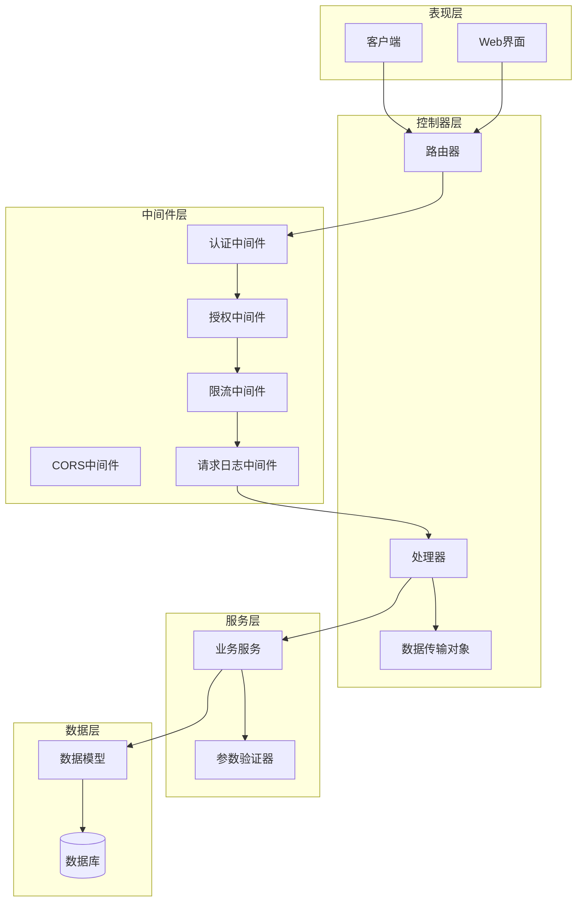
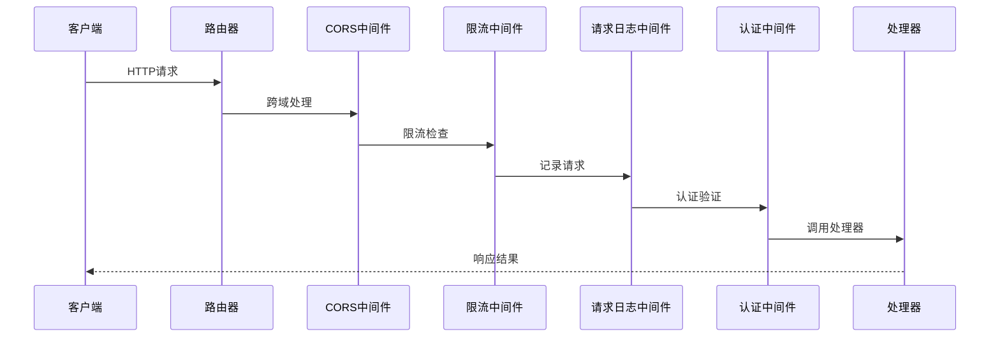
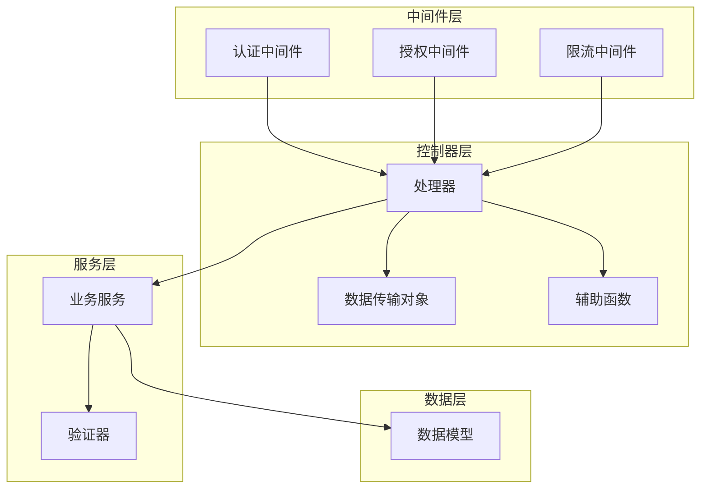
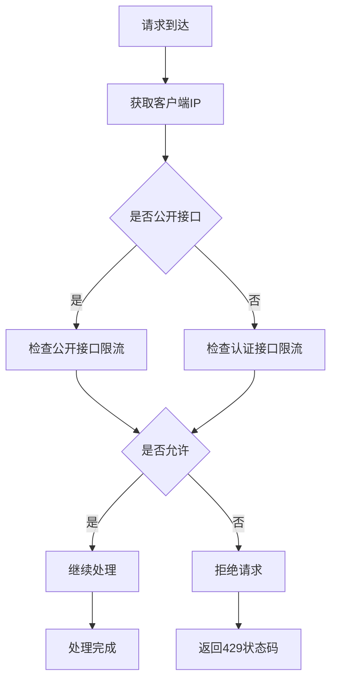

# 控制器层设计

<cite>
**本文档引用的文件**
- [router.go](file://server/router/router.go)
- [auth.go](file://server/middleware/auth.go)
- [types.go](file://server/handler/types.go)
- [main.go](file://server/main.go)
- [helpers.go](file://server/handler/helpers.go)
- [request_logger.go](file://server/middleware/request_logger.go)
- [cors.go](file://server/middleware/cors.go)
- [ratelimit.go](file://server/middleware/ratelimit.go)
- [version.go](file://server/handler/version.go)
- [settings.go](file://server/handler/settings.go)
- [vm.go](file://server/handler/vm.go)
- [auth.go](file://server/handler/auth.go)
- [user.go](file://server/handler/user.go)
- [task.go](file://server/handler/task.go)
</cite>

## 目录
1. [引言](#引言)
2. [项目结构](#项目结构)
3. [核心组件](#核心组件)
4. [架构概览](#架构概览)
5. [详细组件分析](#详细组件分析)
6. [依赖关系分析](#依赖关系分析)
7. [性能考虑](#性能考虑)
8. [故障排除指南](#故障排除指南)
9. [结论](#结论)

## 引言

Open虚拟机管理控制台采用经典的三层架构设计，其中控制器层（Handler Layer）位于系统的最外层，负责HTTP请求处理、参数验证、响应格式化以及与中间件的协调工作。控制器层通过Gin框架实现，提供了统一的RESTful API接口，支持虚拟机管理、用户管理、系统设置、任务调度等多个业务领域的功能。

控制器层的设计遵循单一职责原则，每个处理器函数专注于特定的业务操作，通过标准化的响应格式向客户端返回结果。同时，控制器层与中间件层紧密协作，实现了认证授权、请求预处理、限流保护等横切关注点。

## 项目结构

控制器层主要分布在以下目录结构中：



**图表来源**
- [router.go:1-539](file://server/router/router.go#L1-L539)
- [main.go:1-128](file://server/main.go#L1-L128)

**章节来源**
- [router.go:1-539](file://server/router/router.go#L1-L539)
- [main.go:118-128](file://server/main.go#L118-L128)

## 核心组件

### 路由器（Router）

路由器是控制器层的核心入口，负责API路由的组织和管理。它采用Gin框架的路由组机制，按照业务领域对API进行分组管理：



**图表来源**
- [router.go:35-479](file://server/router/router.go#L35-L479)

### 中间件体系

控制器层通过多种中间件实现横切关注点：

1. **认证中间件**：JWT令牌验证和API密钥认证
2. **授权中间件**：角色权限检查和VM访问权限验证
3. **限流中间件**：IP级别的滑动窗口限流
4. **CORS中间件**：跨域资源共享支持
5. **请求日志中间件**：结构化请求日志记录

**章节来源**
- [auth.go:75-199](file://server/middleware/auth.go#L75-L199)
- [ratelimit.go:173-197](file://server/middleware/ratelimit.go#L173-L197)
- [cors.go:7-24](file://server/middleware/cors.go#L7-L24)
- [request_logger.go:11-69](file://server/middleware/request_logger.go#L11-L69)

### 数据传输对象（DTO）

控制器层定义了丰富的数据传输对象，用于请求参数验证和响应数据结构化：



**图表来源**
- [types.go:9-59](file://server/handler/types.go#L9-L59)
- [auth.go:16-19](file://server/handler/auth.go#L16-L19)
- [user.go:16-41](file://server/handler/user.go#L16-L41)

**章节来源**
- [types.go:1-59](file://server/handler/types.go#L1-L59)

## 架构概览

控制器层采用分层架构设计，各层职责清晰分离：



**图表来源**
- [router.go:18-485](file://server/router/router.go#L18-L485)
- [main.go:118-128](file://server/main.go#L118-L128)

## 详细组件分析

### 路由组织策略

路由器采用嵌套路由组的方式，实现了按业务域的层次化组织：

#### 公开接口组
- `/api/public/settings` - 获取公开系统设置
- `/api/public/version` - 获取系统版本信息

#### 认证接口组
- `/api/auth/login` - 用户登录
- `/api/auth/invite` - 获取邀请信息
- `/api/auth/password/forgot` - 忘记密码

#### 认证后接口组
- `/api/vm` - 虚拟机管理
- `/api/template` - 模板管理
- `/api/network` - 网络管理
- `/api/storage-pool` - 存储池管理

**章节来源**
- [router.go:38-479](file://server/router/router.go#L38-L479)

### 中间件执行流程

控制器层的中间件按照严格的执行顺序工作：



**图表来源**
- [router.go:19-33](file://server/router/router.go#L19-L33)
- [auth.go:75-199](file://server/middleware/auth.go#L75-L199)

### 参数验证机制

控制器层实现了多层次的参数验证：

#### JSON绑定验证
使用Gin的`ShouldBindJSON`方法进行结构化参数绑定，自动处理JSON解析和基本类型转换。

#### 结构体标签验证
通过Go结构体标签实现字段约束：
- `binding:"required"` - 必填字段
- `json:"field_name"` - JSON字段映射
- `binding:"-"` - 忽略绑定

#### 业务逻辑验证
在处理器内部进行更复杂的业务规则验证，如配额检查、权限验证等。

**章节来源**
- [vm.go:225-232](file://server/handler/vm.go#L225-L232)
- [types.go:9-18](file://server/handler/types.go#L9-L18)

### 响应格式标准化

控制器层采用统一的响应格式：

```json
{
  "code": 200,
  "message": "操作成功",
  "data": {}
}
```

对于错误响应：
```json
{
  "code": 400,
  "message": "参数错误",
  "data": null
}
```

**章节来源**
- [vm.go:94-98](file://server/handler/vm.go#L94-L98)
- [auth.go:104-106](file://server/handler/auth.go#L104-L106)

### 错误处理策略

控制器层实现了完善的错误处理机制：

#### HTTP状态码映射
- 400系列：参数错误、验证失败
- 401系列：未认证、Token无效
- 403系列：权限不足
- 404系列：资源不存在
- 429系列：请求过于频繁
- 500系列：服务器内部错误

#### 错误信息本地化
所有错误消息都使用统一的格式，便于前端处理和用户理解。

**章节来源**
- [vm.go:295-304](file://server/handler/vm.go#L295-L304)
- [helpers.go:17-31](file://server/handler/helpers.go#L17-L31)

## 依赖关系分析

### 组件耦合度

控制器层与各层之间的依赖关系如下：



**图表来源**
- [router.go:1-16](file://server/router/router.go#L1-L16)
- [auth.go:1-15](file://server/middleware/auth.go#L1-L15)

### 循环依赖避免

通过明确的依赖方向避免循环依赖：
- 控制器层 → 服务层 → 数据层（单向依赖）
- 中间件层独立于业务逻辑
- 数据传输对象仅用于接口契约

**章节来源**
- [main.go:1-25](file://server/main.go#L1-L25)

## 性能考虑

### 限流机制

控制器层实现了IP级别的滑动窗口限流：



**图表来源**
- [ratelimit.go:60-105](file://server/middleware/ratelimit.go#L60-L105)

### 缓存策略

控制器层利用VM缓存减少数据库查询压力：
- 管理员操作时触发缓存刷新
- 普通用户操作使用缓存数据
- 异步缓存更新保证数据一致性

**章节来源**
- [vm.go:84-86](file://server/handler/vm.go#L84-L86)

## 故障排除指南

### 常见问题诊断

#### 认证失败
- 检查Token格式和有效期
- 验证用户状态和权限
- 确认JWT密钥配置

#### 权限不足
- 验证用户角色和权限
- 检查VM访问权限文件
- 确认轻量云用户限制

#### 请求限流
- 检查IP地址识别
- 验证限流配置
- 监控请求频率

**章节来源**
- [auth.go:153-198](file://server/middleware/auth.go#L153-L198)
- [ratelimit.go:173-197](file://server/middleware/ratelimit.go#L173-L197)

### 日志分析

控制器层提供了详细的请求日志：
- 成功请求：INFO级别
- 客户端错误：WARN级别  
- 服务器错误：ERROR级别
- 包含用户信息、请求路径、状态码等

**章节来源**
- [request_logger.go:38-68](file://server/middleware/request_logger.go#L38-L68)

## 结论

Open虚拟机管理控制台的控制器层设计体现了现代Web应用的最佳实践：

1. **清晰的分层架构**：控制器层专注于HTTP处理，与业务逻辑和服务层分离
2. **强大的中间件体系**：通过中间件实现横切关注点，保持代码简洁
3. **标准化的响应格式**：统一的API响应格式提升用户体验
4. **完善的错误处理**：多层次的错误处理机制确保系统稳定性
5. **性能优化考虑**：限流、缓存等机制保证系统性能

控制器层的设计为后续的功能扩展提供了良好的基础，通过模块化的架构和清晰的职责划分，使得系统具有良好的可维护性和可扩展性。