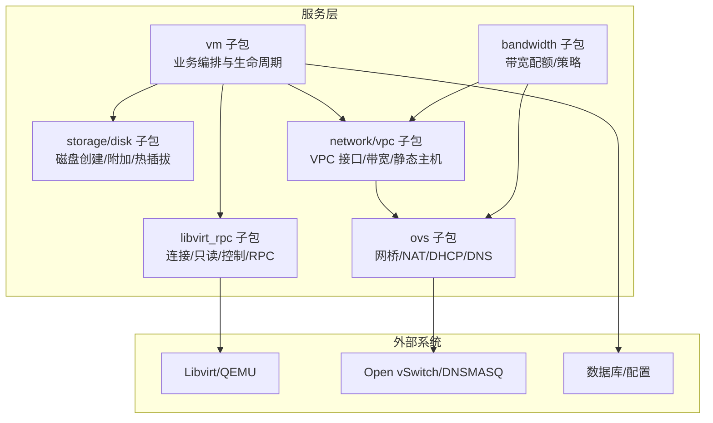
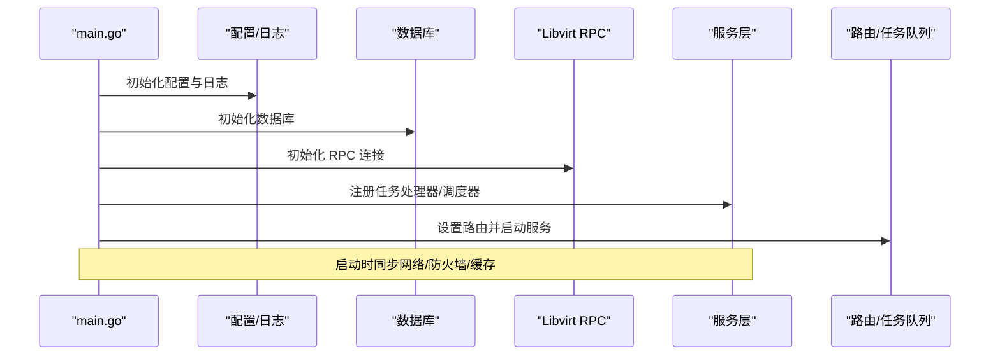
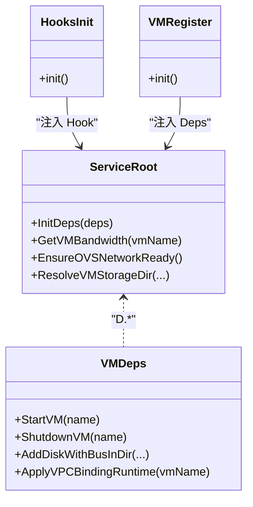
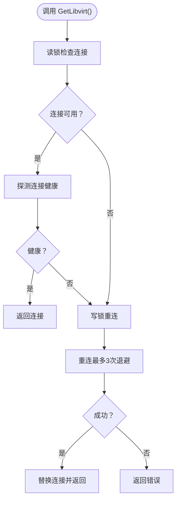
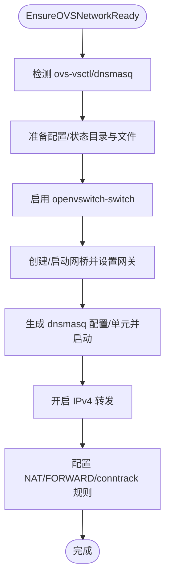
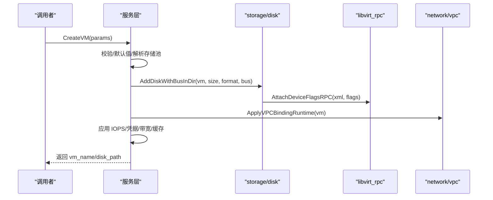
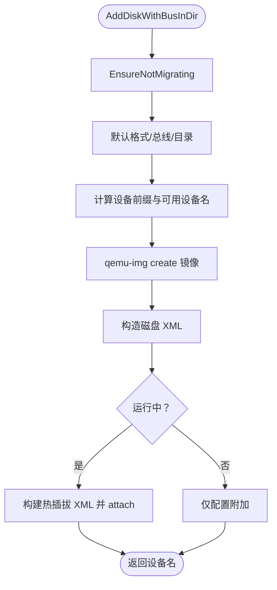
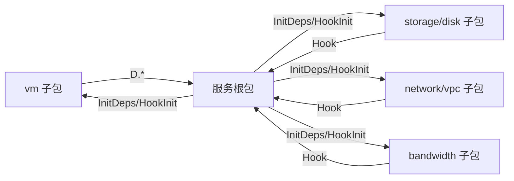

# 服务层设计

<cite>
**本文档引用的文件**
- [server/main.go](file://server/main.go)
- [server/service/libvirt_rpc/connection.go](file://server/service/libvirt_rpc/connection.go)
- [server/service/libvirt_rpc/domain.go](file://server/service/libvirt_rpc/domain.go)
- [server/service/ovs/network.go](file://server/service/ovs/network.go)
- [server/service/vm/deps.go](file://server/service/vm/deps.go)
- [server/service/network/vpc/deps.go](file://server/service/network/vpc/deps.go)
- [server/service/hooks_init.go](file://server/service/hooks_init.go)
- [server/service/vm/create.go](file://server/service/vm/create.go)
- [server/service/storage/disk/create.go](file://server/service/storage/disk/create.go)
- [server/service/storage/disk/deps.go](file://server/service/storage/disk/deps.go)
- [server/service/bandwidth/deps.go](file://server/service/bandwidth/deps.go)
- [server/service/vm_register.go](file://server/service/vm_register.go)
</cite>

## 目录
1. [引言](#引言)
2. [项目结构](#项目结构)
3. [核心组件](#核心组件)
4. [架构总览](#架构总览)
5. [详细组件分析](#详细组件分析)
6. [依赖分析](#依赖分析)
7. [性能考虑](#性能考虑)
8. [故障排查指南](#故障排查指南)
9. [结论](#结论)

## 引言
本设计文档聚焦 Open 虚拟机管理控制台的服务层（service 层），阐述其在分层架构中的核心职责：封装业务逻辑、协调跨组件协作、编排复杂流程、统一错误处理与事务边界，并通过依赖注入与钩子机制解耦外部系统（Libvirt、Open vSwitch、数据库等）。服务层是连接 Handler/Router 与底层基础设施的桥梁，既保证上层接口稳定，又屏蔽 Libvirt、OVS、存储与网络等子系统的差异。

## 项目结构
服务层位于 server/service 目录下，按功能划分子包，典型结构如下：
- libvirt_rpc：对 go-libvirt 的连接与调用封装，提供只读与控制两类 RPC 方法
- ovs：OVS 网络准备、DHCP/DNS、NAT 规则与 systemd 单元管理
- vm：虚拟机生命周期、创建、配置变更、统计与资源检查等业务编排
- storage/disk：磁盘创建、附加、热插拔与 IOPS 调优
- network/vpc：VPC 网络运行态、接口绑定、带宽策略与静态主机/租约管理
- bandwidth：带宽配额与策略应用（面向 OVS/VPC）
- 其他子包：clone、firewall、host、lightweight、public_ip、snapshot、template、traffic、user 等
- hooks_init.go、vm_register.go 等负责依赖注入与钩子注册，避免循环 import

图表来源
- [server/service/vm/deps.go:17-167](file://server/service/vm/deps.go#L17-L167)
- [server/service/network/vpc/deps.go:55-116](file://server/service/network/vpc/deps.go#L55-L116)
- [server/service/ovs/network.go:112-217](file://server/service/ovs/network.go#L112-L217)
- [server/service/libvirt_rpc/connection.go:20-42](file://server/service/libvirt_rpc/connection.go#L20-L42)

章节来源
- [server/main.go:31-128](file://server/main.go#L31-L128)
- [server/service/vm_register.go:12-167](file://server/service/vm_register.go#L12-L167)

## 核心组件
- 依赖注入容器（Deps）：vm 子包通过 D.* 方法访问服务层公共能力，避免直接 import 造成循环依赖
- 钩子（Hook）机制：服务根包将函数指针注入到子包，子包通过 Hook 调用根包能力，形成“反向依赖”
- Libvirt RPC 封装：提供连接管理、只读查询与控制操作，统一错误与重连策略
- OVS 网络准备：确保网桥、DHCP/DNS、NAT 与 iptables 规则就绪
- 业务编排：VM 创建、磁盘附加、VPC 绑定、带宽策略应用、快照与迁移等

章节来源
- [server/service/vm/deps.go:17-167](file://server/service/vm/deps.go#L17-L167)
- [server/service/network/vpc/deps.go:55-116](file://server/service/network/vpc/deps.go#L55-L116)
- [server/service/hooks_init.go:7-42](file://server/service/hooks_init.go#L7-L42)
- [server/service/libvirt_rpc/connection.go:20-98](file://server/service/libvirt_rpc/connection.go#L20-L98)
- [server/service/ovs/network.go:112-217](file://server/service/ovs/network.go#L112-L217)

## 架构总览
服务层通过依赖注入与钩子机制，向上提供稳定的业务接口，向下协调 Libvirt、OVS、数据库与存储系统。启动阶段完成：
- 初始化配置与日志
- 初始化数据库
- 建立 Libvirt RPC 连接并验证
- 注册任务处理器与后台调度器
- 同步网络与防火墙运行态

图表来源
- [server/main.go:39-128](file://server/main.go#L39-L128)
- [server/service/libvirt_rpc/connection.go:20-42](file://server/service/libvirt_rpc/connection.go#L20-L42)

## 详细组件分析

### 依赖注入与钩子机制
- vm 子包通过 D.* 方法访问服务层能力，InitDeps 在启动时注入完整依赖图
- hooks_init.go 将服务根包函数注入到 memory 子包的 Hook 变量，避免循环 import
- vm_register.go 将服务根包函数映射到 vm.Deps，供 vm 子包以 D.XXX() 形式调用

图表来源
- [server/service/vm/deps.go:17-167](file://server/service/vm/deps.go#L17-L167)
- [server/service/hooks_init.go:10-42](file://server/service/hooks_init.go#L10-L42)
- [server/service/vm_register.go:15-167](file://server/service/vm_register.go#L15-L167)

章节来源
- [server/service/vm/deps.go:17-167](file://server/service/vm/deps.go#L17-L167)
- [server/service/network/vpc/deps.go:55-116](file://server/service/network/vpc/deps.go#L55-L116)
- [server/service/hooks_init.go:7-42](file://server/service/hooks_init.go#L7-L42)
- [server/service/vm_register.go:12-167](file://server/service/vm_register.go#L12-L167)

### Libvirt RPC 封装
- 连接管理：单例连接、读写锁保护、自动重连与退避、健康探测
- 只读操作：列出域、状态、信息、XML、统计等
- 控制操作：启动/关机/销毁/重启/重置、挂起/恢复、设置 autostart、vCPU/内存、设备热插拔等
- 错误处理：统一包装错误，区分连接失败与操作失败，便于上层降级

图表来源
- [server/service/libvirt_rpc/connection.go:45-98](file://server/service/libvirt_rpc/connection.go#L45-L98)
- [server/service/libvirt_rpc/connection.go:100-121](file://server/service/libvirt_rpc/connection.go#L100-L121)

章节来源
- [server/service/libvirt_rpc/connection.go:20-98](file://server/service/libvirt_rpc/connection.go#L20-L98)
- [server/service/libvirt_rpc/domain.go:69-181](file://server/service/libvirt_rpc/domain.go#L69-L181)

### OVS 网络准备
- 检测 OVS 与 DNSMASQ 可用性，准备配置/状态目录与静态主机文件
- 确保 openvswitch-switch 与 dnsmasq systemd 单元启用与运行
- 配置网桥、网关地址、NAT 与 FORWARD 规则，清理陈旧规则
- 提供 dnsmasq 重载、输入规则增删与文件变更检测

图表来源
- [server/service/ovs/network.go:112-217](file://server/service/ovs/network.go#L112-L217)
- [server/service/ovs/network.go:277-368](file://server/service/ovs/network.go#L277-L368)

章节来源
- [server/service/ovs/network.go:25-217](file://server/service/ovs/network.go#L25-L217)

### 业务编排：虚拟机创建
- 参数校验与默认值填充（网络、磁盘格式、机器类型、引导类型、网卡模型、架构等）
- 名称合法性校验、存储池解析、CPU 限制规范化
- 检查虚拟机是否存在、创建磁盘镜像、构建磁盘 XML、热插拔或配置附加
- 应用额外磁盘、VPC 绑定、IOPS 限制、凭据保存、带宽重新分配与缓存刷新

图表来源
- [server/service/vm/create.go:147-200](file://server/service/vm/create.go#L147-L200)
- [server/service/storage/disk/create.go:26-113](file://server/service/storage/disk/create.go#L26-L113)
- [server/service/libvirt_rpc/domain.go:620-654](file://server/service/libvirt_rpc/domain.go#L620-L654)

章节来源
- [server/service/vm/create.go:147-200](file://server/service/vm/create.go#L147-L200)
- [server/service/storage/disk/create.go:26-113](file://server/service/storage/disk/create.go#L26-L113)
- [server/service/storage/disk/deps.go:8-27](file://server/service/storage/disk/deps.go#L8-L27)

### 业务编排：磁盘附加
- 校验迁移状态、选择总线与设备前缀、计算可用设备名
- 创建磁盘镜像、构造 XML、根据运行态选择 live+config 或仅 config
- 热插拔失败回退到 SCSI（若存在 virtio-scsi 控制器）

图表来源
- [server/service/storage/disk/create.go:26-113](file://server/service/storage/disk/create.go#L26-L113)
- [server/service/storage/disk/deps.go:8-14](file://server/service/storage/disk/deps.go#L8-L14)

章节来源
- [server/service/storage/disk/create.go:26-113](file://server/service/storage/disk/create.go#L26-L113)
- [server/service/storage/disk/deps.go:8-27](file://server/service/storage/disk/deps.go#L8-L27)

### 带宽与网络策略
- bandwidth 子包通过 Hook 访问 OVS 静态主机、VPC 网关端口、用户 VM 列表等
- 依据用户/VM 状态与 VPC 配置应用带宽策略，刷新缓存

章节来源
- [server/service/bandwidth/deps.go:12-30](file://server/service/bandwidth/deps.go#L12-L30)
- [server/service/network/vpc/deps.go:83-97](file://server/service/network/vpc/deps.go#L83-L97)

## 依赖分析
- 耦合与内聚
  - vm 子包通过 D.* 与服务根包耦合，避免直接 import，降低循环依赖风险
  - 子包通过 Hook 反向依赖服务根包，形成清晰的单向依赖
- 外部依赖
  - Libvirt：通过 libvirt_rpc 提供统一连接与操作封装
  - OVS：通过 ovs 子包提供网络准备与运行态维护
  - 数据库：通过 model 初始化与持久化设置加载
- 循环依赖规避
  - 使用镜像类型与钩子函数替代直接 import
  - 通过 init() 注入依赖，避免运行期循环

图表来源
- [server/service/vm_register.go:12-167](file://server/service/vm_register.go#L12-L167)
- [server/service/hooks_init.go:7-42](file://server/service/hooks_init.go#L7-L42)
- [server/service/vm/deps.go:17-167](file://server/service/vm/deps.go#L17-L167)
- [server/service/network/vpc/deps.go:55-116](file://server/service/network/vpc/deps.go#L55-L116)
- [server/service/bandwidth/deps.go:12-30](file://server/service/bandwidth/deps.go#L12-L30)

章节来源
- [server/service/vm_register.go:12-167](file://server/service/vm_register.go#L12-L167)
- [server/service/hooks_init.go:7-42](file://server/service/hooks_init.go#L7-L42)
- [server/service/vm/deps.go:17-167](file://server/service/vm/deps.go#L17-L167)
- [server/service/network/vpc/deps.go:55-116](file://server/service/network/vpc/deps.go#L55-L116)
- [server/service/bandwidth/deps.go:12-30](file://server/service/bandwidth/deps.go#L12-L30)

## 性能考虑
- 连接复用与健康探测：libvirt_rpc 使用单例连接与探测，减少握手开销
- 读写锁分离：快速路径读锁，慢路径写锁重连，兼顾并发与一致性
- 退避重连：最多三次重连，避免阻塞主线程
- 热插拔优化：运行中附加磁盘时优先热插拔，失败回退 SCSI，减少停机时间
- 统一错误包装：便于上层快速降级与重试策略

## 故障排查指南
- Libvirt 连接失败
  - 现象：启动阶段 InitLibvirtRPC 报错或运行中 GetLibvirt 返回错误
  - 排查：检查 /var/run/libvirt/libvirt-sock 权限与进程状态；查看重连日志
  - 参考
    - [server/service/libvirt_rpc/connection.go:20-42](file://server/service/libvirt_rpc/connection.go#L20-L42)
    - [server/service/libvirt_rpc/connection.go:100-121](file://server/service/libvirt_rpc/connection.go#L100-L121)
- OVS 网络异常
  - 现象：网桥未创建、DHCP/DNS 未启动、NAT/FORWARD 规则缺失
  - 排查：确认 openvswitch-switch 与 dnsmasq 单元状态；检查配置文件与 iptables 规则
  - 参考
    - [server/service/ovs/network.go:112-217](file://server/service/ovs/network.go#L112-L217)
    - [server/service/ovs/network.go:277-368](file://server/service/ovs/network.go#L277-L368)
- 磁盘附加失败
  - 现象：热插拔报错且无可用 PCIe 插槽
  - 排查：确认 VM 运行态、控制器存在；回退到 SCSI；检查镜像路径与权限
  - 参考
    - [server/service/storage/disk/create.go:85-100](file://server/service/storage/disk/create.go#L85-L100)
    - [server/service/storage/disk/create.go:157-200](file://server/service/storage/disk/create.go#L157-L200)
- 依赖注入问题
  - 现象：vm 子包调用 D.XXX() 为空或 panic
  - 排查：确认 main 启动时调用 InitDeps 与各 register.init() 是否执行
  - 参考
    - [server/service/vm_register.go:12-167](file://server/service/vm_register.go#L12-L167)
    - [server/service/hooks_init.go:7-42](file://server/service/hooks_init.go#L7-L42)

## 结论
服务层通过依赖注入与钩子机制，有效解耦了 vm、storage、network、bandwidth 等子包与外部系统，实现了业务逻辑封装、跨组件协调、复杂流程编排与统一错误处理。结合 libvirt_rpc 的连接管理与 OVS 的网络准备，服务层在保证稳定性的同时提供了良好的可维护性与扩展性。建议后续持续完善任务队列与事务边界、增强可观测性与告警策略，以支撑更大规模的虚拟化管理场景。