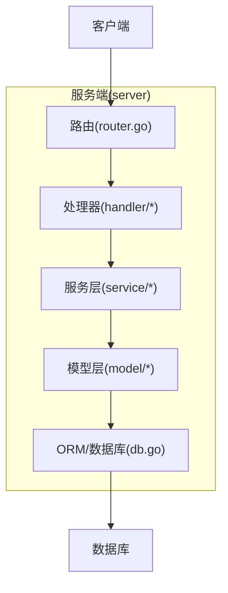
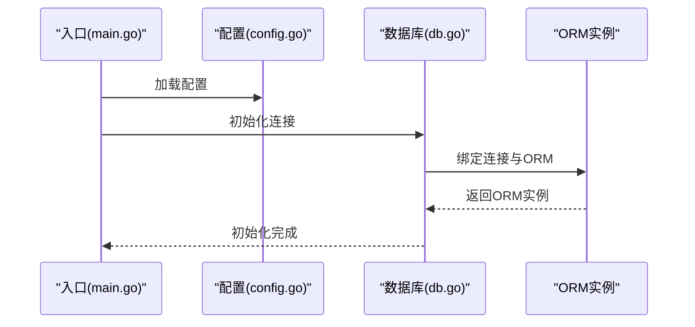
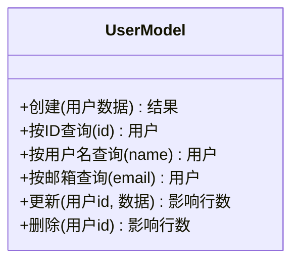
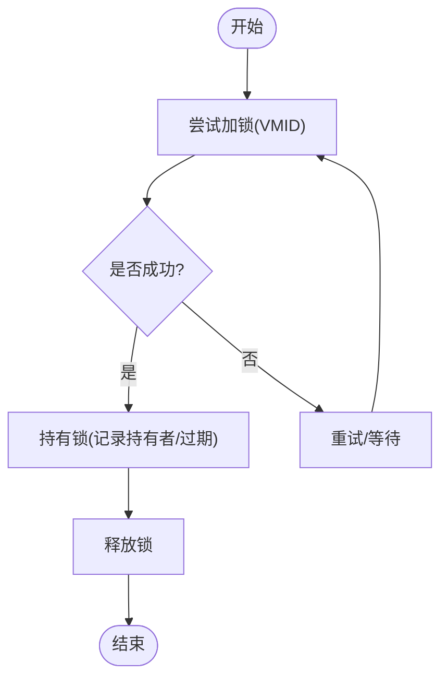
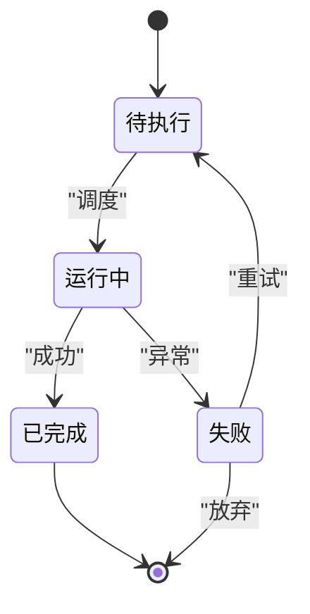
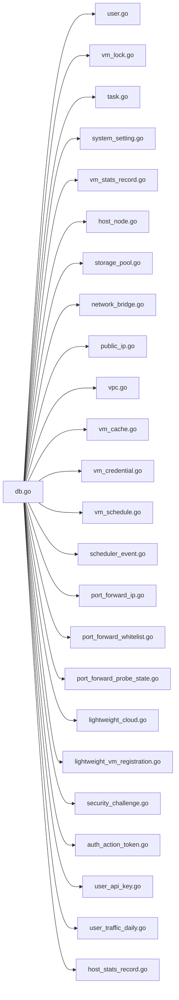

# 模型层设计

<cite>
**本文档引用的文件**
- [db.go](file://server/model/db.go)
- [user.go](file://server/model/user.go)
- [vm_lock.go](file://server/model/vm_lock.go)
- [task.go](file://server/model/task.go)
- [system_setting.go](file://server/model/system_setting.go)
- [vm_stats_record.go](file://server/model/vm_stats_record.go)
- [host_node.go](file://server/model/host_node.go)
- [storage_pool.go](file://server/model/storage_pool.go)
- [network_bridge.go](file://server/model/network_bridge.go)
- [public_ip.go](file://server/model/public_ip.go)
- [vpc.go](file://server/model/vpc.go)
- [vm_cache.go](file://server/model/vm_cache.go)
- [vm_credential.go](file://server/model/vm_credential.go)
- [vm_schedule.go](file://server/model/vm_schedule.go)
- [scheduler_event.go](file://server/model/scheduler_event.go)
- [port_forward_ip.go](file://server/model/port_forward_ip.go)
- [port_forward_whitelist.go](file://server/model/port_forward_whitelist.go)
- [port_forward_probe_state.go](file://server/model/port_forward_probe_state.go)
- [lightweight_cloud.go](file://server/model/lightweight_cloud.go)
- [lightweight_vm_registration.go](file://server/model/lightweight_vm_registration.go)
- [security_challenge.go](file://server/model/security_challenge.go)
- [auth_action_token.go](file://server/model/auth_action_token.go)
- [user_api_key.go](file://server/model/user_api_key.go)
- [user_traffic_daily.go](file://server/model/user_traffic_daily.go)
- [host_stats_record.go](file://server/model/host_stats_record.go)
- [config.go](file://server/config/config.go)
- [router.go](file://server/router/router.go)
- [main.go](file://server/main.go)
</cite>

## 目录
1. [引言](#引言)
2. [项目结构](#项目结构)
3. [核心组件](#核心组件)
4. [架构总览](#架构总览)
5. [详细组件分析](#详细组件分析)
6. [依赖关系分析](#依赖关系分析)
7. [性能考虑](#性能考虑)
8. [故障排除指南](#故障排除指南)
9. [结论](#结论)
10. [附录](#附录)

## 引言
本设计文档聚焦于Open虚拟机管理控制台的模型层（Model Layer），系统性阐述其在分层架构中的数据访问职责与实现方式。模型层负责封装数据库访问逻辑、提供类型安全的数据操作接口、执行数据验证与业务规则校验、统一事务管理与查询构建，并通过ORM实现对底层存储的一致化抽象。本文将结合实际源码文件，解析模型层的数据结构、查询模式、事务策略与一致性保障机制，并给出可复用的最佳实践与排障建议。

## 项目结构
模型层位于服务端目录下的model子目录中，采用“按实体划分”的文件组织方式，每个实体对应一个Go文件，文件名即为该实体的模型名称。典型结构包括：
- 数据库连接与初始化：db.go
- 实体模型：如user.go、vm_lock.go、task.go等
- 配置与路由：config.go、router.go
- 入口程序：main.go

```mermaid
graph TB
subgraph "服务端(server)"
CFG["配置(config.go)"]
RT["路由(router.go)"]
MAIN["入口(main.go)"]
subgraph "模型(model)"
DB["数据库(db.go)"]
U["用户(user.go)"]
VMLOCK["虚拟机锁(vm_lock.go)"]
TASK["任务(task.go)"]
SYSSET["系统设置(system_setting.go)"]
VMSTATS["虚拟机统计(vm_stats_record.go)"]
HOSTNODE["主机节点(host_node.go)"]
STORAGE["存储池(storage_pool.go)"]
BRIDGE["网络桥接(network_bridge.go)"]
PUBIP["公网IP(public_ip.go)"]
VPC["VPC(vpc.go)"]
CACHE["缓存(vm_cache.go)"]
CRED["凭证(vm_credential.go)"]
SCHEDULE["调度(vm_schedule.go)"]
SEVT["调度事件(scheduler_event.go)"]
PFIP["端口转发IP(port_forward_ip.go)"]
PFWL["白名单(port_forward_whitelist.go)"]
PFPROBE["探测状态(port_forward_probe_state.go)"]
LWCLOUD["轻量云(lightweight_cloud.go)"]
LWREG["轻量注册(lightweight_vm_registration.go)"]
SECCHG["安全挑战(security_challenge.go)"]
AUTHAT["认证动作令牌(auth_action_token.go)"]
APIKEY["用户API密钥(user_api_key.go)"]
TRAFFIC["用户流量(user_traffic_daily.go)"]
HOSTSTATS["主机统计(host_stats_record.go)"]
end
end
MAIN --> RT
RT --> CFG
DB --> U
DB --> VMLOCK
DB --> TASK
DB --> SYSSET
DB --> VMSTATS
DB --> HOSTNODE
DB --> STORAGE
DB --> BRIDGE
DB --> PUBIP
DB --> VPC
DB --> CACHE
DB --> CRED
DB --> SCHEDULE
DB --> SEVT
DB --> PFIP
DB --> PFWL
DB --> PFPROBE
DB --> LWCLOUD
DB --> LWREG
DB --> SECCHG
DB --> AUTHAT
DB --> APIKEY
DB --> TRAFFIC
DB --> HOSTSTATS
```

**图表来源**
- [db.go](file://server/model/db.go)
- [user.go](file://server/model/user.go)
- [vm_lock.go](file://server/model/vm_lock.go)
- [task.go](file://server/model/task.go)
- [system_setting.go](file://server/model/system_setting.go)
- [vm_stats_record.go](file://server/model/vm_stats_record.go)
- [host_node.go](file://server/model/host_node.go)
- [storage_pool.go](file://server/model/storage_pool.go)
- [network_bridge.go](file://server/model/network_bridge.go)
- [public_ip.go](file://server/model/public_ip.go)
- [vpc.go](file://server/model/vpc.go)
- [vm_cache.go](file://server/model/vm_cache.go)
- [vm_credential.go](file://server/model/vm_credential.go)
- [vm_schedule.go](file://server/model/vm_schedule.go)
- [scheduler_event.go](file://server/model/scheduler_event.go)
- [port_forward_ip.go](file://server/model/port_forward_ip.go)
- [port_forward_whitelist.go](file://server/model/port_forward_whitelist.go)
- [port_forward_probe_state.go](file://server/model/port_forward_probe_state.go)
- [lightweight_cloud.go](file://server/model/lightweight_cloud.go)
- [lightweight_vm_registration.go](file://server/model/lightweight_vm_registration.go)
- [security_challenge.go](file://server/model/security_challenge.go)
- [auth_action_token.go](file://server/model/auth_action_token.go)
- [user_api_key.go](file://server/model/user_api_key.go)
- [user_traffic_daily.go](file://server/model/user_traffic_daily.go)
- [host_stats_record.go](file://server/model/host_stats_record.go)

**章节来源**
- [db.go](file://server/model/db.go)
- [config.go](file://server/config/config.go)
- [router.go](file://server/router/router.go)
- [main.go](file://server/main.go)

## 核心组件
模型层的核心职责包括：
- 数据库连接与生命周期管理：集中初始化、连接池配置与健康检查
- ORM封装与查询构建：提供类型安全的CRUD与复杂查询接口
- 事务管理：统一开启、提交与回滚，确保数据一致性
- 数据映射与验证：将数据库记录映射为领域对象，执行业务规则与约束校验
- 查询优化：索引利用、批量操作、延迟加载与缓存策略
- 错误处理与日志：标准化错误返回与审计日志

关键实现要点：
- 使用单例连接与全局ORM实例，避免重复初始化
- 所有写操作置于事务上下文中，失败自动回滚
- 通过结构体字段标签定义表名、列名与约束，便于迁移与维护
- 提供Builder风格的查询接口，支持链式条件拼装与排序分页

**章节来源**
- [db.go](file://server/model/db.go)
- [user.go](file://server/model/user.go)
- [vm_lock.go](file://server/model/vm_lock.go)
- [task.go](file://server/model/task.go)

## 架构总览
模型层在整体架构中的位置如下：
- 入口程序负责启动与配置装载
- 路由层接收请求并分发到处理器
- 处理器调用服务层，服务层再调用模型层进行数据访问
- 模型层通过ORM与数据库交互，返回领域对象或影响行数

**图表来源**
- [router.go](file://server/router/router.go)
- [main.go](file://server/main.go)
- [db.go](file://server/model/db.go)

## 详细组件分析

### 数据库连接与ORM初始化
- 初始化流程：在入口处加载配置，建立数据库连接，设置连接池参数与超时策略
- 连接管理：提供获取连接的方法，确保并发安全；在应用退出时优雅关闭
- ORM绑定：将ORM实例与数据库连接绑定，暴露通用的查询与事务接口

**图表来源**
- [main.go](file://server/main.go)
- [config.go](file://server/config/config.go)
- [db.go](file://server/model/db.go)

**章节来源**
- [db.go](file://server/model/db.go)
- [config.go](file://server/config/config.go)
- [main.go](file://server/main.go)

### 用户模型(User)
- 职责：封装用户实体的持久化操作，包括创建、查询、更新与删除
- 关键点：字段级约束（唯一性、非空）、密码哈希与安全存储、关联角色/配额等
- 查询模式：支持按ID、用户名、邮箱等多维度检索；支持分页与排序
- 事务策略：修改用户资料与权限变更需在事务内完成

**图表来源**
- [user.go](file://server/model/user.go)

**章节来源**
- [user.go](file://server/model/user.go)

### 虚拟机锁模型(VM Lock)
- 职责：管理虚拟机资源锁定，防止并发冲突
- 关键点：锁粒度（VM级别）、过期时间、自动清理、竞态处理
- 查询模式：按VM ID查询当前持有者；支持释放与续期
- 事务策略：加锁/解锁必须原子化，失败回滚

**图表来源**
- [vm_lock.go](file://server/model/vm_lock.go)

**章节来源**
- [vm_lock.go](file://server/model/vm_lock.go)

### 任务模型(Task)
- 职责：封装任务的生命周期管理（创建、调度、执行、完成/失败）
- 关键点：状态机（待执行/运行中/已完成/失败）、优先级与队列、重试策略
- 查询模式：按状态、创建时间、目标实体等筛选；支持批量拉取待执行任务
- 事务策略：任务状态变更与副作用操作需在事务内完成

**图表来源**
- [task.go](file://server/model/task.go)

**章节来源**
- [task.go](file://server/model/task.go)

### 系统设置模型(System Setting)
- 职责：提供系统级配置项的读写接口
- 关键点：键值对结构、默认值、类型校验、热更新支持
- 查询模式：按键精确查询；支持批量读取常用配置
- 事务策略：更新配置需原子化，失败回滚并保留旧值

**章节来源**
- [system_setting.go](file://server/model/system_setting.go)

### 虚拟机统计记录模型(VM Stats Record)
- 职责：采集与存储虚拟机运行指标（CPU、内存、磁盘、网络）
- 关键点：时间序列数据、采样频率、历史窗口、聚合查询
- 查询模式：按时间段范围查询、按指标类型聚合、TopN排行
- 性能优化：分区表、压缩存储、异步写入

**章节来源**
- [vm_stats_record.go](file://server/model/vm_stats_record.go)

### 主机节点模型(Host Node)
- 职责：描述物理主机资源与状态
- 关键点：节点ID、可用资源、负载、健康状态
- 查询模式：按状态过滤（在线/离线/维护）；资源可用性查询
- 事务策略：资源分配与状态更新需一致

**章节来源**
- [host_node.go](file://server/model/host_node.go)

### 存储池模型(Storage Pool)
- 职责：管理存储资源池（容量、使用率、卷列表）
- 关键点：容量阈值告警、快照策略、迁移与扩容
- 查询模式：按池ID查询；统计使用情况
- 事务策略：创建卷与扣减配额需原子

**章节来源**
- [storage_pool.go](file://server/model/storage_pool.go)

### 网络桥接模型(Network Bridge)
- 职责：抽象虚拟网桥及其端口绑定
- 关键点：MAC/IP管理、VLAN隔离、ACL规则
- 查询模式：按桥名/端口查询；连通性检测
- 事务策略：创建/删除桥接需同步网络配置

**章节来源**
- [network_bridge.go](file://server/model/network_bridge.go)

### 公网IP模型(Public IP)
- 职责：管理公网地址与NAT映射
- 关键点：地址池、端口映射、黑白名单
- 查询模式：按IP查询映射；统计使用率
- 事务策略：映射创建/删除需原子

**章节来源**
- [public_ip.go](file://server/model/public_ip.go)

### VPC模型(VPC)
- 职责：提供多租户网络隔离与路由能力
- 关键点：子网划分、路由表、安全组、带宽配额
- 查询模式：按租户查询；拓扑查询
- 事务策略：网络拓扑变更需一致性

**章节来源**
- [vpc.go](file://server/model/vpc.go)

### 缓存模型(VM Cache)
- 职责：加速虚拟机元数据查询
- 关键点：TTL、失效策略、与后端一致性
- 查询模式：命中优先；未命中回源并写入缓存
- 优化策略：批量预热、热点保护

**章节来源**
- [vm_cache.go](file://server/model/vm_cache.go)

### 凭证模型(VM Credential)
- 职责：安全存储与轮换虚拟机登录凭证
- 关键点：加密存储、最小权限、轮换周期
- 查询模式：按VM查询；按租户批量
- 安全策略：禁止明文落盘

**章节来源**
- [vm_credential.go](file://server/model/vm_credential.go)

### 调度与事件模型
- 调度计划模型：管理未来执行的任务计划
- 调度事件模型：记录调度执行结果与异常
- 关键点：时间窗口匹配、幂等执行、失败重试
- 查询模式：按时间范围与状态查询；事件归档

**章节来源**
- [vm_schedule.go](file://server/model/vm_schedule.go)
- [scheduler_event.go](file://server/model/scheduler_event.go)

### 端口转发模型
- 端口转发IP：管理可分配的外网IP段
- 白名单：限制允许的源IP范围
- 探测状态：记录端口可达性探测结果
- 关键点：并发写入一致性、过期清理、批量导入导出
- 查询模式：按状态过滤；按租户聚合

**章节来源**
- [port_forward_ip.go](file://server/model/port_forward_ip.go)
- [port_forward_whitelist.go](file://server/model/port_forward_whitelist.go)
- [port_forward_probe_state.go](file://server/model/port_forward_probe_state.go)

### 轻量云与注册模型
- 轻量云：面向轻量场景的资源编排与计费
- 注册模型：记录轻量虚拟机的注册信息与状态
- 关键点：配额校验、账单生成、生命周期管理
- 查询模式：按租户与状态查询；报表统计

**章节来源**
- [lightweight_cloud.go](file://server/model/lightweight_cloud.go)
- [lightweight_vm_registration.go](file://server/model/lightweight_vm_registration.go)

### 安全与认证模型
- 安全挑战：多因素认证与挑战响应
- 认证动作令牌：一次性令牌与防重放
- 用户API密钥：密钥管理与权限控制
- 用户流量：每日流量统计与配额控制
- 关键点：敏感字段加密、令牌过期、审计日志
- 查询模式：按用户/令牌查询；按时间统计

**章节来源**
- [security_challenge.go](file://server/model/security_challenge.go)
- [auth_action_token.go](file://server/model/auth_action_token.go)
- [user_api_key.go](file://server/model/user_api_key.go)
- [user_traffic_daily.go](file://server/model/user_traffic_daily.go)

### 主机统计模型(Host Stats Record)
- 职责：采集主机层面的资源使用指标
- 关键点：CPU/内存/IO/网络聚合；历史归档
- 查询模式：按小时/天聚合；趋势分析
- 优化策略：分区与压缩

**章节来源**
- [host_stats_record.go](file://server/model/host_stats_record.go)

## 依赖关系分析
模型层内部依赖关系清晰，围绕db.go提供的ORM实例展开：
- 所有实体模型均依赖db.go中的连接与ORM
- 配置与路由为上层模块，不直接依赖具体模型
- 模型层之间无循环依赖，耦合度低，内聚度高

**图表来源**
- [db.go](file://server/model/db.go)
- [user.go](file://server/model/user.go)
- [vm_lock.go](file://server/model/vm_lock.go)
- [task.go](file://server/model/task.go)
- [system_setting.go](file://server/model/system_setting.go)
- [vm_stats_record.go](file://server/model/vm_stats_record.go)
- [host_node.go](file://server/model/host_node.go)
- [storage_pool.go](file://server/model/storage_pool.go)
- [network_bridge.go](file://server/model/network_bridge.go)
- [public_ip.go](file://server/model/public_ip.go)
- [vpc.go](file://server/model/vpc.go)
- [vm_cache.go](file://server/model/vm_cache.go)
- [vm_credential.go](file://server/model/vm_credential.go)
- [vm_schedule.go](file://server/model/vm_schedule.go)
- [scheduler_event.go](file://server/model/scheduler_event.go)
- [port_forward_ip.go](file://server/model/port_forward_ip.go)
- [port_forward_whitelist.go](file://server/model/port_forward_whitelist.go)
- [port_forward_probe_state.go](file://server/model/port_forward_probe_state.go)
- [lightweight_cloud.go](file://server/model/lightweight_cloud.go)
- [lightweight_vm_registration.go](file://server/model/lightweight_vm_registration.go)
- [security_challenge.go](file://server/model/security_challenge.go)
- [auth_action_token.go](file://server/model/auth_action_token.go)
- [user_api_key.go](file://server/model/user_api_key.go)
- [user_traffic_daily.go](file://server/model/user_traffic_daily.go)
- [host_stats_record.go](file://server/model/host_stats_record.go)

**章节来源**
- [db.go](file://server/model/db.go)

## 性能考虑
- 连接池与超时：合理设置最大连接数、空闲超时与查询超时，避免资源耗尽
- 索引与查询：为高频查询字段建立合适索引；避免SELECT *，仅取必要列
- 批量操作：批量插入/更新使用事务包裹，减少往返开销
- 分页与排序：大表分页使用游标或基于索引的LIMIT/OFFSET
- 缓存策略：热点数据引入缓存，注意一致性与过期策略
- 写放大控制：合并写操作，避免频繁小事务
- 监控与告警：对慢查询、连接数、锁等待进行监控

## 故障排除指南
- 连接失败：检查数据库地址、凭据与网络连通性；查看连接池饱和与超时
- 事务死锁：减少事务持有时间，按固定顺序访问资源，启用死锁检测
- 查询缓慢：分析执行计划，补充索引，拆分复杂查询
- 并发冲突：对关键写操作加锁或使用乐观锁版本号
- 数据不一致：确认事务边界覆盖所有相关写操作，必要时引入分布式锁
- 日志定位：开启SQL日志与错误日志，结合请求ID追踪问题

## 结论
模型层通过统一的ORM抽象与严格的事务管理，实现了类型安全、可维护且高性能的数据访问层。它以实体为中心的模块化设计降低了耦合，配合完善的查询与缓存策略，满足了虚拟机管理控制台在高并发与强一致性的业务需求。遵循本文的最佳实践，可在保证数据安全的前提下持续演进与扩展。

## 附录
- 最佳实践清单
  - 所有写操作必须在事务中执行
  - 明确字段约束与默认值，保持Schema稳定
  - 对高频查询建立索引，定期分析执行计划
  - 合理使用缓存，确保缓存与数据库一致性
  - 对敏感数据进行加密存储与最小权限访问
  - 建立完善的监控与日志体系，快速定位问题