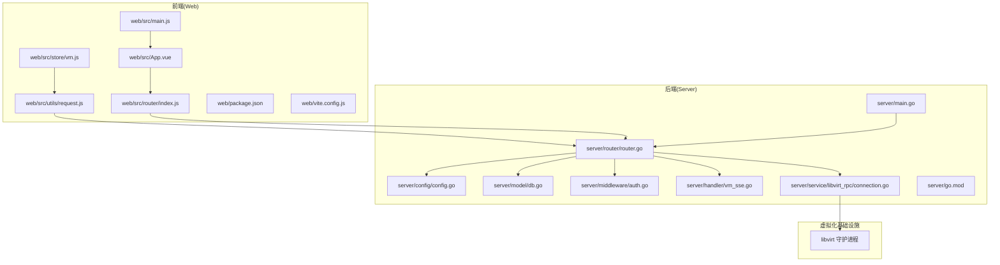
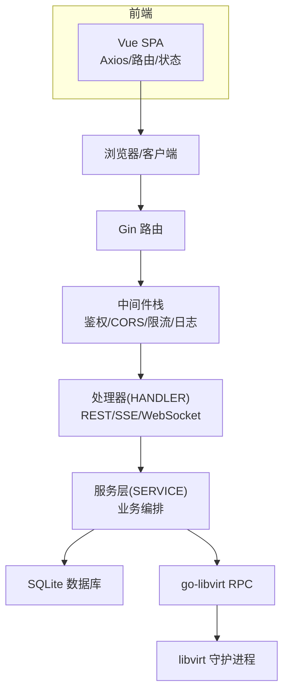
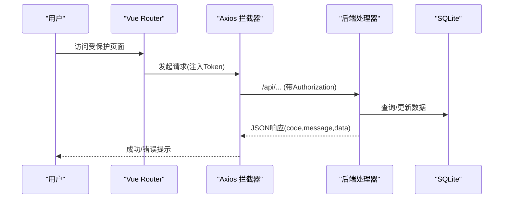
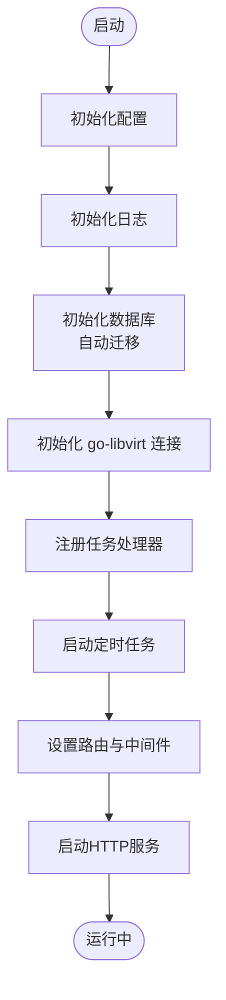
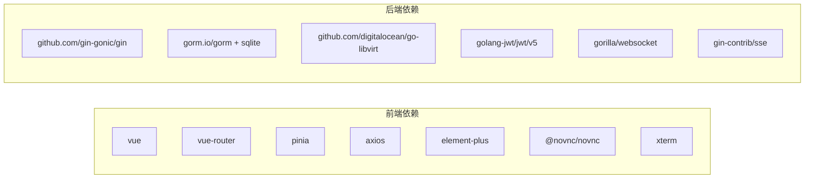

# 整体架构设计

<cite>
**本文引用的文件**
- [server/main.go](file://server/main.go)
- [server/router/router.go](file://server/router/router.go)
- [server/config/config.go](file://server/config/config.go)
- [server/model/db.go](file://server/model/db.go)
- [server/service/libvirt_rpc/connection.go](file://server/service/libvirt_rpc/connection.go)
- [server/middleware/auth.go](file://server/middleware/auth.go)
- [server/handler/vm_sse.go](file://server/handler/vm_sse.go)
- [web/src/main.js](file://web/src/main.js)
- [web/src/App.vue](file://web/src/App.vue)
- [web/src/router/index.js](file://web/src/router/index.js)
- [web/src/store/vm.js](file://web/src/store/vm.js)
- [web/src/utils/request.js](file://web/src/utils/request.js)
- [web/package.json](file://web/package.json)
- [web/vite.config.js](file://web/vite.config.js)
- [server/go.mod](file://server/go.mod)
</cite>

## 目录
1. [简介](#简介)
2. [项目结构](#项目结构)
3. [核心组件](#核心组件)
4. [架构总览](#架构总览)
5. [详细组件分析](#详细组件分析)
6. [依赖关系分析](#依赖关系分析)
7. [性能考量](#性能考量)
8. [故障排查指南](#故障排查指南)
9. [结论](#结论)
10. [附录](#附录)

## 简介
本项目为“Open虚拟机管理控制台”，采用前后端分离架构：前端基于Vue 3 + Pinia + Element Plus的单页应用（SPA），后端基于Gin Web框架，数据库使用SQLite，虚拟化基础设施通过go-libvirt与libvirt守护进程交互。系统提供RESTful API、SSE服务器推送以及WebSocket实时通信能力，覆盖虚拟机生命周期管理、网络与存储管理、任务队列、用户与权限管理等模块。

## 项目结构
- 前端（web）
  - 使用Vite构建，Vue 3 + Vue Router + Pinia + Element Plus
  - 通过Axios进行HTTP请求，内置NProgress进度条
  - 本地开发通过Vite代理将/api前缀转发到后端
- 后端（server）
  - Gin路由组织REST API，中间件负责鉴权、CORS、限流、请求日志
  - 配置中心集中管理运行参数，数据库模型自动迁移
  - 服务层封装业务逻辑，底层通过go-libvirt与libvirt通信
  - SSE处理器提供虚拟机列表与详情的实时推送
  - 任务队列支持异步任务处理（如克隆、导入、迁移等）

**图表来源**
- [web/src/main.js:1-26](file://web/src/main.js#L1-L26)
- [web/src/App.vue:1-64](file://web/src/App.vue#L1-L64)
- [web/src/router/index.js:1-180](file://web/src/router/index.js#L1-L180)
- [web/src/store/vm.js:1-61](file://web/src/store/vm.js#L1-L61)
- [web/src/utils/request.js:1-209](file://web/src/utils/request.js#L1-L209)
- [web/package.json:1-30](file://web/package.json#L1-L30)
- [web/vite.config.js:1-27](file://web/vite.config.js#L1-L27)
- [server/main.go:1-128](file://server/main.go#L1-L128)
- [server/router/router.go:1-539](file://server/router/router.go#L1-L539)
- [server/config/config.go:1-824](file://server/config/config.go#L1-L824)
- [server/model/db.go:1-345](file://server/model/db.go#L1-L345)
- [server/middleware/auth.go:1-324](file://server/middleware/auth.go#L1-L324)
- [server/handler/vm_sse.go:1-99](file://server/handler/vm_sse.go#L1-L99)
- [server/service/libvirt_rpc/connection.go:1-138](file://server/service/libvirt_rpc/connection.go#L1-L138)
- [server/go.mod:1-51](file://server/go.mod#L1-L51)

**章节来源**
- [server/main.go:1-128](file://server/main.go#L1-L128)
- [server/router/router.go:1-539](file://server/router/router.go#L1-L539)
- [server/config/config.go:1-824](file://server/config/config.go#L1-L824)
- [server/model/db.go:1-345](file://server/model/db.go#L1-L345)
- [server/service/libvirt_rpc/connection.go:1-138](file://server/service/libvirt_rpc/connection.go#L1-L138)
- [server/middleware/auth.go:1-324](file://server/middleware/auth.go#L1-L324)
- [server/handler/vm_sse.go:1-99](file://server/handler/vm_sse.go#L1-L99)
- [web/src/main.js:1-26](file://web/src/main.js#L1-L26)
- [web/src/App.vue:1-64](file://web/src/App.vue#L1-L64)
- [web/src/router/index.js:1-180](file://web/src/router/index.js#L1-L180)
- [web/src/store/vm.js:1-61](file://web/src/store/vm.js#L1-L61)
- [web/src/utils/request.js:1-209](file://web/src/utils/request.js#L1-L209)
- [web/package.json:1-30](file://web/package.json#L1-L30)
- [web/vite.config.js:1-27](file://web/vite.config.js#L1-L27)
- [server/go.mod:1-51](file://server/go.mod#L1-L51)

## 核心组件
- 前端应用
  - 应用入口与插件注册：应用初始化Element Plus、路由、Pinia；全局挂载图标组件
  - 路由系统：定义登录、仪表盘、虚拟机列表/详情、模板、网络、存储、用户、调度、设置等页面；内置路由守卫，处理登录态与角色权限
  - 状态管理：Pinia Store缓存虚拟机列表与最近访问记录，减少重复请求
  - 请求封装：Axios拦截器统一注入Token、处理高风险操作二次验证、错误提示与401登出
- 后端服务
  - 启动流程：初始化配置、日志、数据库、libvirt连接、任务队列、定时任务；设置路由并启动HTTP服务
  - 路由与中间件：按功能域分组API，鉴权中间件支持JWT与API Key；CORS、限流、请求日志
  - 数据层：SQLite数据库，自动迁移与兼容性修复；默认管理员初始化
  - 业务层：封装虚拟机、网络、存储、任务等业务逻辑；通过go-libvirt与libvirt交互
  - 实时通信：SSE处理器推送虚拟机列表与详情；WebSocket用于VNC控制台
- 虚拟化基础设施
  - go-libvirt通过UNIX Socket连接libvirt守护进程，提供高性能RPC调用；具备自动重连机制

**章节来源**
- [web/src/main.js:1-26](file://web/src/main.js#L1-L26)
- [web/src/router/index.js:1-180](file://web/src/router/index.js#L1-L180)
- [web/src/store/vm.js:1-61](file://web/src/store/vm.js#L1-L61)
- [web/src/utils/request.js:1-209](file://web/src/utils/request.js#L1-L209)
- [server/main.go:1-128](file://server/main.go#L1-L128)
- [server/router/router.go:1-539](file://server/router/router.go#L1-L539)
- [server/model/db.go:1-345](file://server/model/db.go#L1-L345)
- [server/service/libvirt_rpc/connection.go:1-138](file://server/service/libvirt_rpc/connection.go#L1-L138)

## 架构总览
系统采用典型的三层架构：表现层（前端Vue SPA）、接入层（Gin路由与中间件）、业务与数据层（服务层与SQLite）。虚拟化控制通过go-libvirt与libvirt守护进程解耦，便于扩展与运维。

**图表来源**
- [server/router/router.go:1-539](file://server/router/router.go#L1-L539)
- [server/middleware/auth.go:1-324](file://server/middleware/auth.go#L1-L324)
- [server/handler/vm_sse.go:1-99](file://server/handler/vm_sse.go#L1-L99)
- [server/service/libvirt_rpc/connection.go:1-138](file://server/service/libvirt_rpc/connection.go#L1-L138)
- [server/model/db.go:1-345](file://server/model/db.go#L1-L345)
- [web/src/utils/request.js:1-209](file://web/src/utils/request.js#L1-L209)

## 详细组件分析

### 前端组件分析
- 应用入口与插件
  - 注册Element Plus主题与国际化；安装路由与Pinia；全局注册图标组件；挂载应用
- 路由与导航
  - 定义多视图路由，支持面包屑与菜单；路由守卫根据Token与角色控制访问；轻量云用户访问限制
- 状态管理
  - 虚拟机列表缓存Store，支持访问历史记录；提供清理缓存方法
- 请求与安全
  - Axios拦截器注入Authorization头；高风险操作二次验证（TOTP/邮箱验证码）；统一错误提示与401登出

**图表来源**
- [web/src/router/index.js:148-177](file://web/src/router/index.js#L148-L177)
- [web/src/utils/request.js:46-206](file://web/src/utils/request.js#L46-L206)
- [server/router/router.go:104-478](file://server/router/router.go#L104-L478)
- [server/model/db.go:57-113](file://server/model/db.go#L57-L113)

**章节来源**
- [web/src/main.js:1-26](file://web/src/main.js#L1-L26)
- [web/src/App.vue:1-64](file://web/src/App.vue#L1-L64)
- [web/src/router/index.js:1-180](file://web/src/router/index.js#L1-L180)
- [web/src/store/vm.js:1-61](file://web/src/store/vm.js#L1-L61)
- [web/src/utils/request.js:1-209](file://web/src/utils/request.js#L1-L209)

### 后端组件分析
- 启动与初始化
  - 加载配置与日志；初始化数据库并自动迁移；建立go-libvirt连接；注册任务处理器与定时任务；设置路由并启动HTTP服务
- 路由与中间件
  - 分组API：认证、系统设置、虚拟机、模板、网络、VPC、防火墙、OVS、存储池、节点、用户、任务、调度、宿主机、CPU亲和性等
  - 中间件：鉴权（JWT/API Key）、管理员权限、弹性云限制、VM归属校验、CORS、限流、请求日志
- 数据层
  - SQLite驱动；GORM日志适配；自动迁移与兼容性修复；默认管理员初始化
- 实时通信
  - SSE处理器：周期推送虚拟机列表与详情；WebSocket：VNC控制台
- 虚拟化集成
  - go-libvirt单例连接，自动重连；提供可用性检测；错误降级策略

**图表来源**
- [server/main.go:31-128](file://server/main.go#L31-L128)
- [server/config/config.go:157-249](file://server/config/config.go#L157-L249)
- [server/model/db.go:57-113](file://server/model/db.go#L57-L113)
- [server/service/libvirt_rpc/connection.go:20-43](file://server/service/libvirt_rpc/connection.go#L20-L43)
- [server/router/router.go:18-484](file://server/router/router.go#L18-L484)

**章节来源**
- [server/main.go:1-128](file://server/main.go#L1-L128)
- [server/router/router.go:1-539](file://server/router/router.go#L1-L539)
- [server/middleware/auth.go:1-324](file://server/middleware/auth.go#L1-L324)
- [server/model/db.go:1-345](file://server/model/db.go#L1-L345)
- [server/service/libvirt_rpc/connection.go:1-138](file://server/service/libvirt_rpc/connection.go#L1-L138)
- [server/handler/vm_sse.go:1-99](file://server/handler/vm_sse.go#L1-L99)

### 系统边界与职责
- 前端边界
  - 仅负责UI渲染、路由导航、状态缓存、HTTP请求与实时订阅（SSE/WS）
- 后端边界
  - 对外提供REST API、SSE与WebSocket；内部负责鉴权、权限校验、业务编排、数据库访问、虚拟化控制
- 数据库边界
  - 仅承载系统配置、用户、配额、网络与存储元数据、任务与统计等
- 虚拟化边界
  - 通过go-libvirt与libvirt守护进程交互，不暴露底层细节给业务层

**章节来源**
- [server/router/router.go:35-478](file://server/router/router.go#L35-L478)
- [server/middleware/auth.go:243-324](file://server/middleware/auth.go#L243-L324)
- [server/model/db.go:85-113](file://server/model/db.go#L85-L113)
- [server/service/libvirt_rpc/connection.go:14-98](file://server/service/libvirt_rpc/connection.go#L14-L98)

## 依赖关系分析
- 前端依赖
  - Vue 3、Vue Router、Pinia、Element Plus、Axios、@novnc/novnc、xterm等
  - 开发时通过Vite代理将/api转发到后端
- 后端依赖
  - Gin、GORM/SQLite、go-libvirt、JWT、WebSocket、SSE等

**图表来源**
- [web/package.json:11-24](file://web/package.json#L11-L24)
- [server/go.mod:5-15](file://server/go.mod#L5-L15)

**章节来源**
- [web/package.json:1-30](file://web/package.json#L1-L30)
- [server/go.mod:1-51](file://server/go.mod#L1-L51)

## 性能考量
- 前端
  - 使用Pinia缓存虚拟机列表，减少重复请求；路由懒加载与NProgress提升体验
- 后端
  - go-libvirt单例连接与自动重连，降低连接成本；SSE周期推送（列表2秒、详情3秒）平衡实时性与负载
  - GORM日志适配与慢查询告警，便于定位性能问题
- 数据库
  - SQLite适合中小规模部署；自动迁移与索引优化保障查询效率

[本节为通用指导，不涉及具体文件分析]

## 故障排查指南
- 认证失败
  - 检查Authorization头格式与Token有效性；确认用户状态与安全更新时间
- SSE无推送
  - 确认SSE端点与客户端连接；关注go-libvirt可用性变化
- WebSocket异常
  - 检查代理配置与后端路由；确认VNC相关端点可用
- 数据库异常
  - 查看迁移日志与慢查询日志；确认默认管理员初始化状态

**章节来源**
- [server/middleware/auth.go:95-198](file://server/middleware/auth.go#L95-L198)
- [server/handler/vm_sse.go:14-57](file://server/handler/vm_sse.go#L14-L57)
- [web/vite.config.js:17-24](file://web/vite.config.js#L17-L24)
- [server/model/db.go:57-113](file://server/model/db.go#L57-L113)

## 结论
本项目通过清晰的前后端分离架构、完善的中间件体系与SSE/WS实时通信，实现了从用户请求到虚拟机操作的完整闭环。配置中心与数据库自动迁移提升了可运维性；go-libvirt与libvirt的解耦设计为后续扩展提供了良好基础。

[本节为总结性内容，不涉及具体文件分析]

## 附录
- 开发与构建
  - 前端：Vite开发服务器、代理/api到后端；生产构建产物由后端静态文件服务提供
  - 后端：主程序启动后自动提供web-dist静态文件服务（若存在）

**章节来源**
- [web/vite.config.js:1-27](file://web/vite.config.js#L1-L27)
- [server/router/router.go:487-539](file://server/router/router.go#L487-L539)
- [server/main.go:118-128](file://server/main.go#L118-L128)