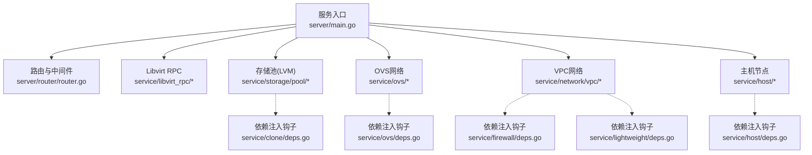
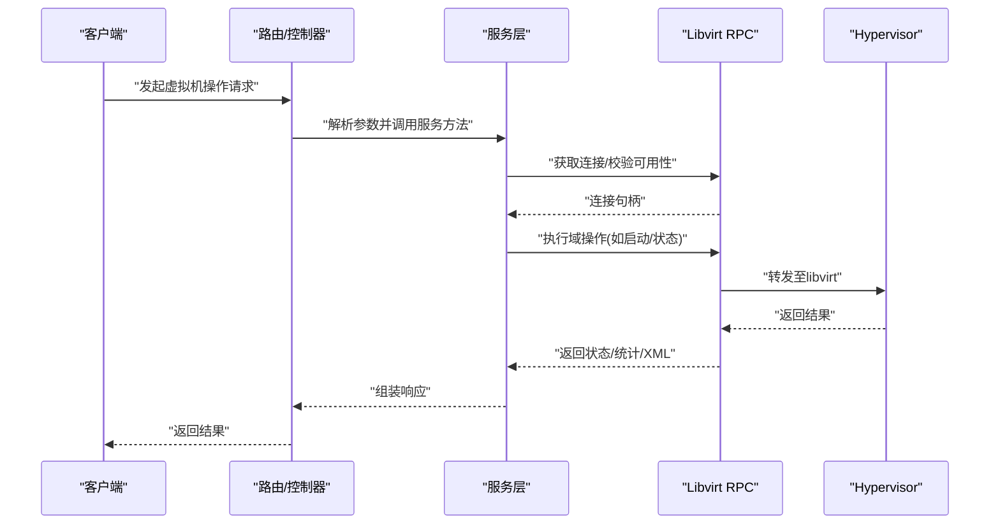
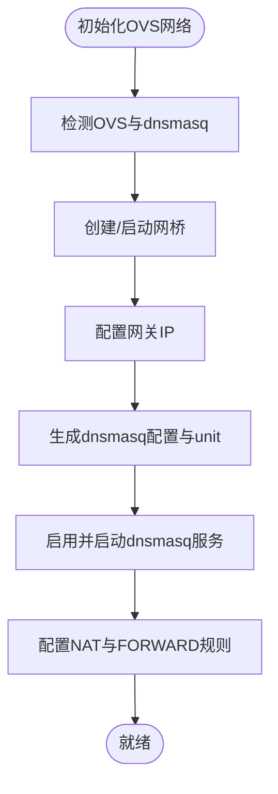
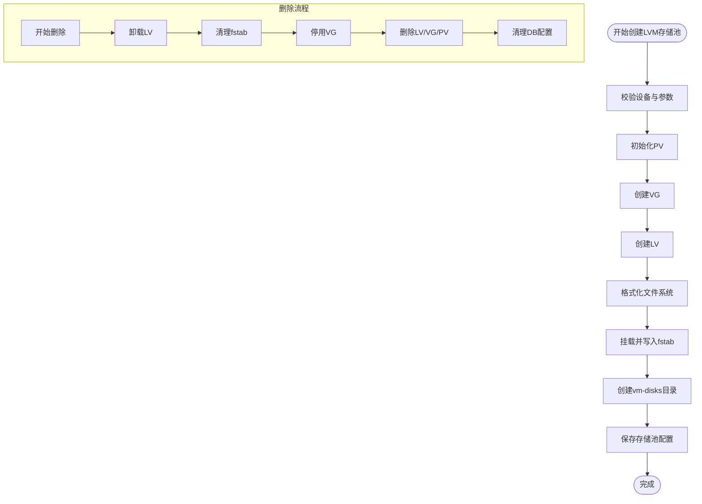
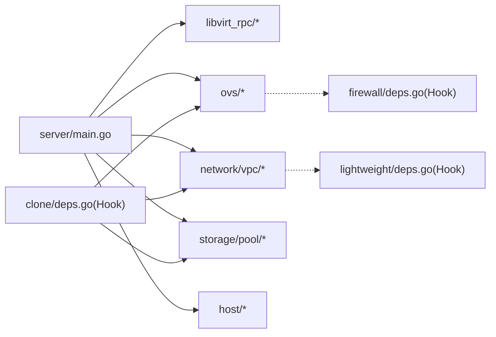

# 组件交互关系

<cite>
**本文档引用的文件**
- [main.go](file://server/main.go)
- [router.go](file://server/router/router.go)
- [connection.go](file://server/service/libvirt_rpc/connection.go)
- [domain.go](file://server/service/libvirt_rpc/domain.go)
- [network.go](file://server/service/ovs/network.go)
- [deps.go](file://server/service/ovs/deps.go)
- [lvm_volume.go](file://server/service/storage/pool/lvm_volume.go)
- [switch.go](file://server/service/network/vpc/switch.go)
- [node.go](file://server/service/host/node.go)
- [deps.go](file://server/service/clone/deps.go)
- [deps.go](file://server/service/firewall/deps.go)
- [deps.go](file://server/service/host/deps.go)
- [deps.go](file://server/service/lightweight/deps.go)
</cite>

## 目录
1. [引言](#引言)
2. [项目结构](#项目结构)
3. [核心组件](#核心组件)
4. [架构总览](#架构总览)
5. [详细组件分析](#详细组件分析)
6. [依赖关系分析](#依赖关系分析)
7. [性能考虑](#性能考虑)
8. [故障排查指南](#故障排查指南)
9. [结论](#结论)

## 引言
本文件面向Open虚拟机管理控制台，系统梳理组件交互关系与协作机制，重点覆盖以下方面：
- 虚拟机管理组件与Libvirt RPC接口的交互方式
- 网络管理组件与Open vSwitch的集成路径
- 存储管理组件与LVM及文件系统的交互流程
- 组件间依赖注入与接口抽象设计
- 分布式组件的协调机制与一致性保障
- 典型业务场景下的组件协作时序

## 项目结构
后端采用Go语言实现，主要模块包括：
- 服务入口与生命周期管理：server/main.go
- 路由与中间件：server/router/router.go
- Libvirt RPC封装：server/service/libvirt_rpc/*
- Open vSwitch网络集成：server/service/ovs/*
- VPC网络与安全组：server/service/network/vpc/*
- 存储池与LVM：server/service/storage/pool/*
- 主机节点与分布式能力：server/service/host/*
- 子包依赖注入钩子：各子包deps.go



图表来源
- [main.go:31-128](file://server/main.go#L31-L128)
- [router.go:18-485](file://server/router/router.go#L18-L485)
- [connection.go:20-98](file://server/service/libvirt_rpc/connection.go#L20-L98)
- [lvm_volume.go:68-167](file://server/service/storage/pool/lvm_volume.go#L68-L167)
- [network.go:112-217](file://server/service/ovs/network.go#L112-L217)
- [switch.go:32-96](file://server/service/network/vpc/switch.go#L32-L96)
- [node.go:46-79](file://server/service/host/node.go#L46-L79)
- [deps.go:6-16](file://server/service/ovs/deps.go#L6-L16)

章节来源
- [main.go:31-128](file://server/main.go#L31-L128)
- [router.go:18-485](file://server/router/router.go#L18-L485)

## 核心组件
- 服务入口与生命周期
  - 初始化配置、日志、数据库
  - 建立Libvirt RPC连接并进行健康检查
  - 启动任务队列、资源采集器、调度器等后台任务
  - 加载系统设置、恢复网络与公共IP规则
  - 注册路由并启动HTTP服务
- 路由与中间件
  - 统一鉴权、CORS、速率限制
  - API分组与权限控制（管理员/普通用户）
- Libvirt RPC
  - 单例连接、自动重连、可用性探测
  - 提供域查询、状态、统计、控制等高频操作
- OVS网络
  - 网络后端选择、网桥准备、DHCP/DNS服务、NAT规则
- VPC网络
  - 交换机创建/更新/删除、子网解析、带宽与流量策略
- 存储池(LVM)
  - PV/VG/LV创建、格式化、挂载、fstab维护
- 主机节点
  - 远端节点探测、能力上报、密钥加解密

章节来源
- [main.go:39-128](file://server/main.go#L39-L128)
- [router.go:35-485](file://server/router/router.go#L35-L485)
- [connection.go:20-98](file://server/service/libvirt_rpc/connection.go#L20-L98)
- [domain.go:69-181](file://server/service/libvirt_rpc/domain.go#L69-L181)
- [network.go:112-217](file://server/service/ovs/network.go#L112-L217)
- [switch.go:32-96](file://server/service/network/vpc/switch.go#L32-L96)
- [lvm_volume.go:68-167](file://server/service/storage/pool/lvm_volume.go#L68-L167)
- [node.go:81-130](file://server/service/host/node.go#L81-L130)

## 架构总览
下图展示核心组件与外部系统（Libvirt、OVS、LVM、iptables、dnsmasq）的交互关系。

```mermaid
graph TB
subgraph "应用层"
R["路由与控制器<br/>server/router/router.go"]
TQ["任务队列<br/>异步任务处理器"]
end
subgraph "服务层"
LR["Libvirt RPC<br/>connection.go / domain.go"]
OVS["OVS网络<br/>network.go"]
VPC["VPC网络<br/>switch.go"]
LVM["存储池(LVM)<br/>lvm_volume.go"]
HOST["主机节点<br/>node.go"]
end
subgraph "外部系统"
LIBVIRT["libvirt/QEMU"]
OVSDEV["Open vSwitch"]
IPT["iptables"]
DNS["dnsmasq"]
FS["文件系统/挂载"]
end
R --> LR
R --> OVS
R --> VPC
R --> LVM
R --> HOST
TQ --> LR
TQ --> OVS
TQ --> VPC
TQ --> LVM
TQ --> HOST
LR <- --> LIBVIRT
OVS <- --> OVSDEV
OVS <- --> IPT
OVS <- --> DNS
LVM --> FS
```

图表来源
- [router.go:18-485](file://server/router/router.go#L18-L485)
- [connection.go:20-98](file://server/service/libvirt_rpc/connection.go#L20-L98)
- [domain.go:69-181](file://server/service/libvirt_rpc/domain.go#L69-L181)
- [network.go:112-217](file://server/service/ovs/network.go#L112-L217)
- [switch.go:32-96](file://server/service/network/vpc/switch.go#L32-L96)
- [lvm_volume.go:68-167](file://server/service/storage/pool/lvm_volume.go#L68-L167)
- [node.go:81-130](file://server/service/host/node.go#L81-L130)

## 详细组件分析

### 虚拟机管理组件与Libvirt RPC交互
- 连接管理
  - 启动时建立RPC连接并校验版本
  - 提供单例连接获取与自动重连机制
  - 可用性快速检测，避免无效调用
- 常用操作
  - 列表、状态、信息、XML、统计等只读高频操作
  - 启动/关机/销毁/重启/暂停/恢复等控制操作
  - 设置vCPU/内存、热插拔设备、执行QEMU Monitor命令等扩展操作
- 错误处理
  - 连接失败时返回明确错误，调用方可降级为本地工具链



图表来源
- [connection.go:20-98](file://server/service/libvirt_rpc/connection.go#L20-L98)
- [domain.go:69-181](file://server/service/libvirt_rpc/domain.go#L69-L181)
- [router.go:104-211](file://server/router/router.go#L104-L211)

章节来源
- [connection.go:20-98](file://server/service/libvirt_rpc/connection.go#L20-L98)
- [domain.go:69-181](file://server/service/libvirt_rpc/domain.go#L69-L181)

### 网络管理组件与Open vSwitch集成
- 网络后端选择与准备
  - 依据配置选择OVS网络后端
  - 检测并安装必要组件（ovs-vsctl、dnsmasq）
  - 创建/启动网桥、配置网关IP、DHCP/DNS配置与服务单元
  - 配置NAT与FORWARD规则，清理陈旧规则
- 与VPC的协同
  - VPC交换机在OVS网桥上运行
  - 通过钩子函数与VPC模块交互，实现ACL、带宽策略下发
- 诊断与运维
  - 提供DHCP租约、静态主机、端口状态等查询能力



图表来源
- [network.go:112-217](file://server/service/ovs/network.go#L112-L217)
- [network.go:278-368](file://server/service/ovs/network.go#L278-L368)
- [network.go:370-416](file://server/service/ovs/network.go#L370-L416)
- [network.go:418-509](file://server/service/ovs/network.go#L418-L509)

章节来源
- [network.go:112-217](file://server/service/ovs/network.go#L112-L217)
- [network.go:278-368](file://server/service/ovs/network.go#L278-L368)
- [network.go:370-416](file://server/service/ovs/network.go#L370-L416)
- [network.go:418-509](file://server/service/ovs/network.go#L418-L509)

### 存储管理组件与LVM及文件系统交互
- 创建LVM存储池
  - 校验设备、初始化PV、创建VG、创建LV、格式化、挂载、写入fstab
  - 创建虚拟机磁盘目录，保存存储池配置
- 删除LVM存储池
  - 卸载LV、清理fstab、停用VG、删除LV/VG/PV，清理数据库配置
- 信息扫描与解析
  - 扫描VG/LV/PV，解析挂载关系与文件系统类型



图表来源
- [lvm_volume.go:68-167](file://server/service/storage/pool/lvm_volume.go#L68-L167)
- [lvm_volume.go:699-800](file://server/service/storage/pool/lvm_volume.go#L699-L800)
- [lvm_volume.go:381-529](file://server/service/storage/pool/lvm_volume.go#L381-L529)

章节来源
- [lvm_volume.go:68-167](file://server/service/storage/pool/lvm_volume.go#L68-L167)
- [lvm_volume.go:699-800](file://server/service/storage/pool/lvm_volume.go#L699-L800)
- [lvm_volume.go:381-529](file://server/service/storage/pool/lvm_volume.go#L381-L529)

### 组件间依赖注入与接口抽象设计
- 钩子变量模式
  - 各子包通过deps.go声明Hook变量，避免循环导入
  - 服务根包在初始化阶段为Hook变量赋值，形成跨包调用
- 典型钩子
  - OVS：网桥存在性检查、virt-install网络参数、接口XML生成
  - 防火墙：OVS网桥名、VPC网关端口名、端口转发规则读取
  - 主机：远端SSH执行、节点API调用、VM关停等待
  - 轻量云：默认安全组/交换机、带宽策略、运行时配额
- 优势
  - 解耦服务层与子包，便于扩展与测试
  - 保持接口稳定，降低耦合度

章节来源
- [deps.go:6-16](file://server/service/ovs/deps.go#L6-L16)
- [deps.go:6-19](file://server/service/firewall/deps.go#L6-L19)
- [deps.go:11-29](file://server/service/host/deps.go#L11-L29)
- [deps.go:40-81](file://server/service/lightweight/deps.go#L40-L81)
- [deps.go:13-112](file://server/service/clone/deps.go#L13-L112)

### 分布式组件的协调机制与一致性保证
- 主机节点探测
  - 通过SSH与节点面板API进行连通性与功能检查
  - 能力上报与状态更新，支持启用/禁用
- 运行时跟踪与配额
  - 初始化运行时追踪器，基于活跃VM集合同步配额状态
  - 定期检查与修正流量配额状态
- 一致性保障
  - 通过数据库事务与幂等操作减少不一致
  - 任务队列异步执行，结合进度回调与重试策略

章节来源
- [node.go:81-130](file://server/service/host/node.go#L81-L130)
- [node.go:210-218](file://server/service/host/node.go#L210-L218)
- [deps.go:18-28](file://server/service/host/deps.go#L18-L28)

## 依赖关系分析
- 组件耦合
  - 服务入口对Libvirt、OVS、VPC、LVM、主机节点均有强依赖
  - 子包通过Hook变量与服务根包弱耦合
- 外部依赖
  - Libvirt RPC依赖libvirt守护进程
  - OVS依赖openvswitch-switch与dnsmasq
  - LVM依赖lvm2工具链与文件系统
  - iptables与系统网络栈用于NAT与转发



图表来源
- [main.go:31-128](file://server/main.go#L31-L128)
- [deps.go:6-16](file://server/service/ovs/deps.go#L6-L16)
- [deps.go:6-19](file://server/service/firewall/deps.go#L6-L19)
- [deps.go:40-81](file://server/service/lightweight/deps.go#L40-L81)
- [deps.go:13-112](file://server/service/clone/deps.go#L13-L112)

章节来源
- [main.go:31-128](file://server/main.go#L31-L128)
- [deps.go:6-16](file://server/service/ovs/deps.go#L6-L16)
- [deps.go:6-19](file://server/service/firewall/deps.go#L6-L19)
- [deps.go:40-81](file://server/service/lightweight/deps.go#L40-L81)
- [deps.go:13-112](file://server/service/clone/deps.go#L13-L112)

## 性能考虑
- RPC连接池与自动重连
  - 单例连接与快速可用性检测，避免频繁握手
  - 重连采用指数退避，降低抖动
- 任务队列与并发
  - 后台Worker并行处理异步任务，提升吞吐
- I/O与存储
  - LVM创建/删除流程中采用分阶段进度回调，便于可观测与限流
- 网络
  - OVS NAT与FORWARD规则一次性配置，减少重复变更

## 故障排查指南
- Libvirt连接问题
  - 检查socket路径与权限，确认libvirt服务状态
  - 使用可用性检测函数快速定位
- OVS网络异常
  - 检查openvswitch-switch与dnsmasq状态
  - 校验网桥、网关IP、DHCP配置与iptables规则
- LVM操作失败
  - 确认设备未挂载且类型符合要求
  - 检查lvm2工具链与权限
- 节点探测失败
  - 核对SSH与API密钥、网络连通性
  - 查看能力上报与最后探测时间

章节来源
- [connection.go:20-98](file://server/service/libvirt_rpc/connection.go#L20-L98)
- [network.go:112-217](file://server/service/ovs/network.go#L112-L217)
- [lvm_volume.go:68-167](file://server/service/storage/pool/lvm_volume.go#L68-L167)
- [node.go:81-130](file://server/service/host/node.go#L81-L130)

## 结论
本项目通过清晰的服务分层、严格的依赖注入与接口抽象，实现了虚拟机、网络、存储三大领域的统一编排。Libvirt RPC提供稳定的底层控制面，OVS与VPC组合实现灵活的网络隔离与策略，LVM与文件系统支撑弹性存储。分布式节点探测与运行时配额机制进一步增强了系统的可观测性与一致性保障。建议在生产环境中持续关注RPC连接健康、OVS规则收敛与LVM操作幂等性，以维持高可用与高性能。