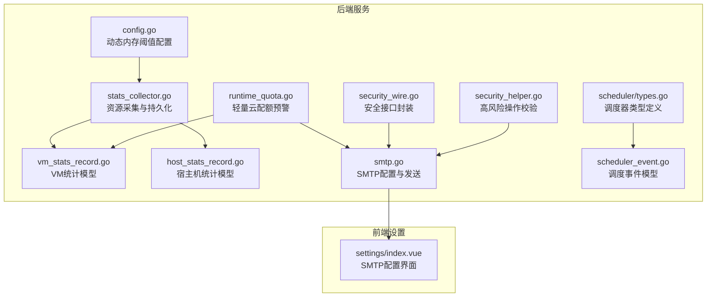
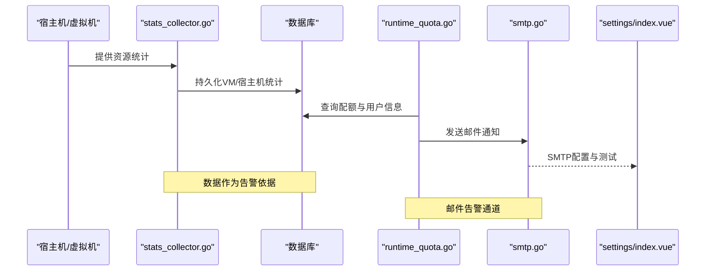
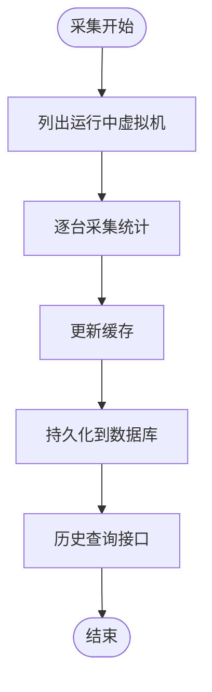
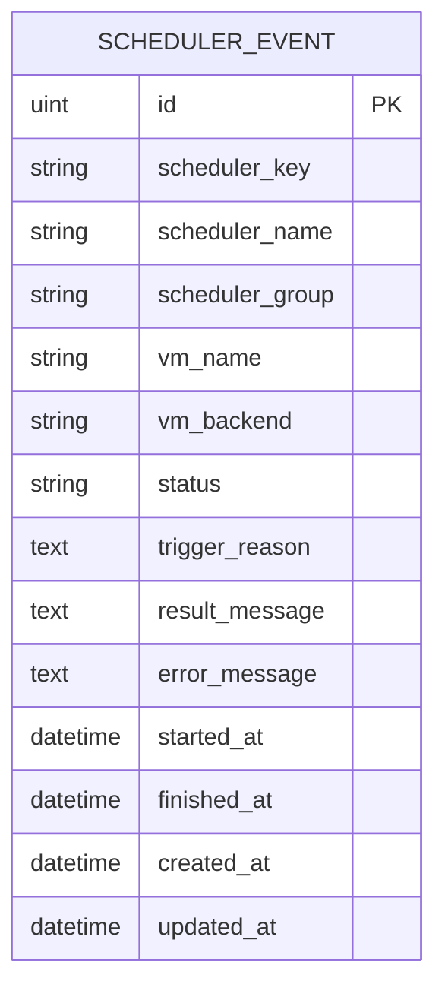
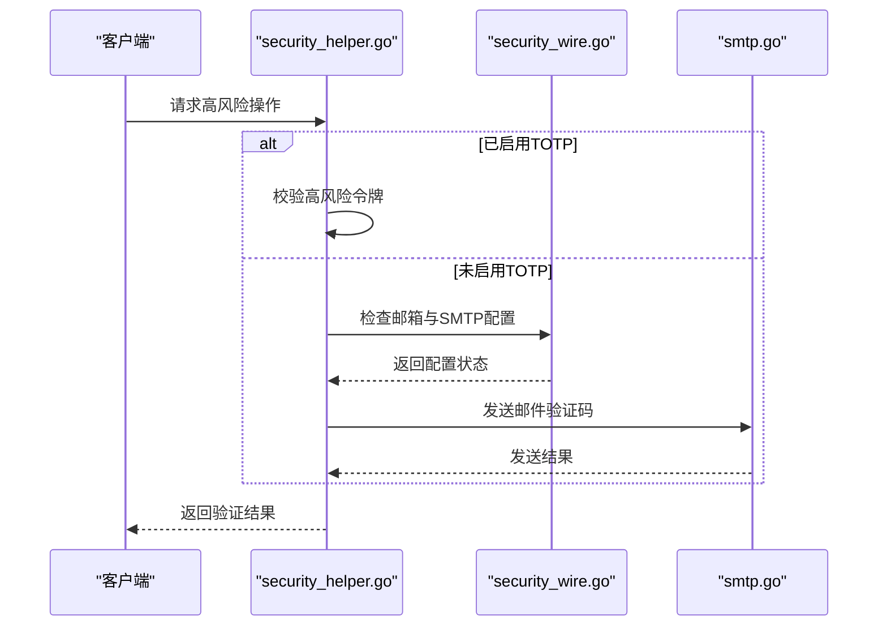
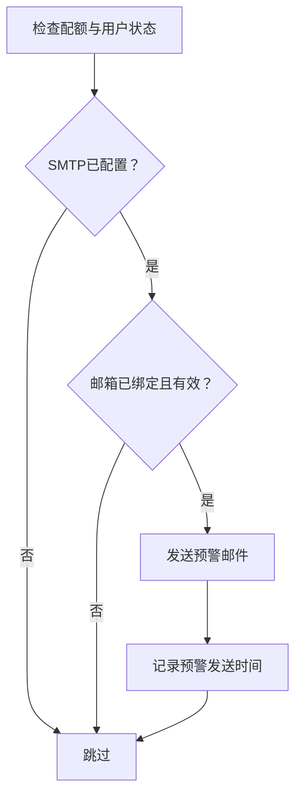
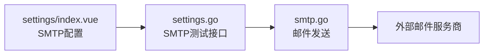
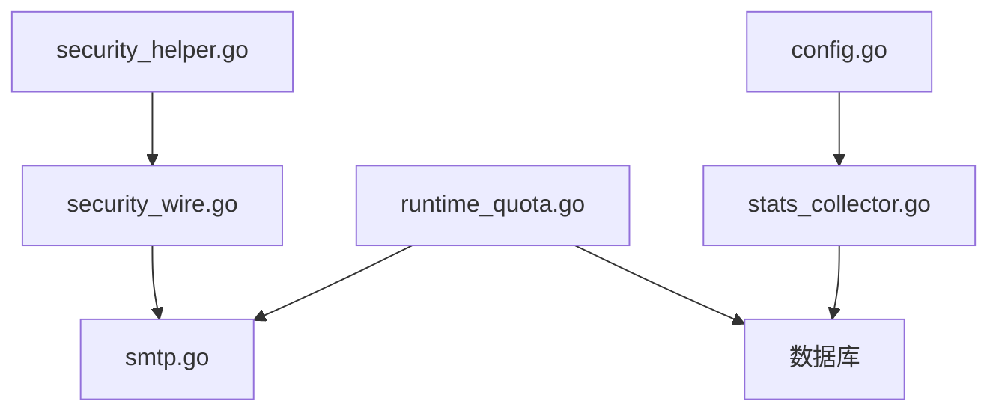

# 告警机制

<cite>
**本文引用的文件**
- [server/service/host/stats_collector.go](file://server/service/host/stats_collector.go)
- [server/model/vm_stats_record.go](file://server/model/vm_stats_record.go)
- [server/model/host_stats_record.go](file://server/model/host_stats_record.go)
- [server/service/lightweight/runtime_quota.go](file://server/service/lightweight/runtime_quota.go)
- [server/service/security/smtp.go](file://server/service/security/smtp.go)
- [server/handler/settings.go](file://server/handler/settings.go)
- [server/service/security/constants.go](file://server/service/security/constants.go)
- [server/config/config.go](file://server/config/config.go)
- [server/service/scheduler/types.go](file://server/service/scheduler/types.go)
- [server/model/scheduler_event.go](file://server/model/scheduler_event.go)
- [web/src/views/settings/index.vue](file://web/src/views/settings/index.vue)
- [server/service/security_wire.go](file://server/service/security_wire.go)
- [server/handler/security_helper.go](file://server/handler/security_helper.go)
</cite>

## 目录
1. [简介](#简介)
2. [项目结构](#项目结构)
3. [核心组件](#核心组件)
4. [架构总览](#架构总览)
5. [详细组件分析](#详细组件分析)
6. [依赖关系分析](#依赖关系分析)
7. [性能考量](#性能考量)
8. [故障排查指南](#故障排查指南)
9. [结论](#结论)
10. [附录](#附录)

## 简介
本文件面向 Open 虚拟机管理控制台的“告警机制”，系统性梳理现有告警能力与扩展点，覆盖资源使用率监控、系统状态记录、安全事件提示以及邮件通知通道。文档重点解释：
- 告警规则的配置与管理：阈值设置、告警条件与触发逻辑
- 多种告警类型：资源使用率告警、系统状态告警、安全事件告警
- 告警通知渠道：邮件通知、短信告警、Webhook 推送
- 告警去重与抑制：避免重复告警与噪音
- 告警历史记录与统计分析
- 告警配置最佳实践与处理流程

## 项目结构
后端采用 Go 语言模块化设计，告警相关能力主要分布在以下模块：
- 资源监控与记录：宿主机与虚拟机资源统计采集与持久化
- 安全与通知：SMTP 配置、邮件发送、高风险操作验证
- 配置中心：动态内存阈值等运行时参数
- 前端设置页：SMTP 配置与测试入口

**图表来源**
- [server/service/host/stats_collector.go:87-365](file://server/service/host/stats_collector.go#L87-L365)
- [server/model/vm_stats_record.go](file://server/model/vm_stats_record.go)
- [server/model/host_stats_record.go](file://server/model/host_stats_record.go)
- [server/service/lightweight/runtime_quota.go:198-230](file://server/service/lightweight/runtime_quota.go#L198-L230)
- [server/service/security/smtp.go](file://server/service/security/smtp.go)
- [server/config/config.go:110-111](file://server/config/config.go#L110-L111)
- [server/service/scheduler/types.go](file://server/service/scheduler/types.go)
- [server/model/scheduler_event.go:1-36](file://server/model/scheduler_event.go#L1-L36)
- [server/service/security_wire.go:141-151](file://server/service/security_wire.go#L141-L151)
- [server/handler/security_helper.go:104-156](file://server/handler/security_helper.go#L104-L156)
- [web/src/views/settings/index.vue:1149-1167](file://web/src/views/settings/index.vue#L1149-L1167)

**章节来源**
- [server/service/host/stats_collector.go:87-365](file://server/service/host/stats_collector.go#L87-L365)
- [server/service/lightweight/runtime_quota.go:198-230](file://server/service/lightweight/runtime_quota.go#L198-L230)
- [server/service/security/smtp.go](file://server/service/security/smtp.go)
- [server/config/config.go:110-111](file://server/config/config.go#L110-L111)
- [web/src/views/settings/index.vue:1149-1167](file://web/src/views/settings/index.vue#L1149-L1167)

## 核心组件
- 资源统计采集与持久化：定时采集宿主机与虚拟机资源指标，写入数据库，作为后续告警判断的数据基础
- 轻量云配额预警：基于运行时长配额的到期提醒，通过邮件通知用户
- SMTP 通知通道：集中化的邮件发送能力，支持配置与测试
- 动态内存阈值：通过环境变量配置的动态内存回收与扩容阈值，用于资源使用率告警的参考
- 调度事件记录：记录调度器的动作尝试与结果，便于系统状态告警
- 安全事件提示：高风险操作的二次验证与邮件挑战，作为安全事件告警的前置流程

**章节来源**
- [server/service/host/stats_collector.go:87-365](file://server/service/host/stats_collector.go#L87-L365)
- [server/service/lightweight/runtime_quota.go:198-230](file://server/service/lightweight/runtime_quota.go#L198-L230)
- [server/service/security/smtp.go](file://server/service/security/smtp.go)
- [server/config/config.go:110-111](file://server/config/config.go#L110-L111)
- [server/model/scheduler_event.go:1-36](file://server/model/scheduler_event.go#L1-L36)
- [server/handler/security_helper.go:104-156](file://server/handler/security_helper.go#L104-L156)

## 架构总览
下图展示了资源监控、配额预警与通知的整体流程。

**图表来源**
- [server/service/host/stats_collector.go:264-306](file://server/service/host/stats_collector.go#L264-L306)
- [server/service/lightweight/runtime_quota.go:198-230](file://server/service/lightweight/runtime_quota.go#L198-L230)
- [server/service/security/smtp.go](file://server/service/security/smtp.go)
- [web/src/views/settings/index.vue:1149-1167](file://web/src/views/settings/index.vue#L1149-L1167)

## 详细组件分析

### 资源使用率告警（CPU/内存/网络/磁盘）
- 数据采集与存储
  - 宿主机与虚拟机资源统计由采集器周期性收集并持久化，形成历史记录，用于趋势分析与阈值对比
  - 采集器同时清理已关机虚拟机的缓存，确保数据准确性
- 阈值与触发逻辑
  - 动态内存阈值通过环境变量配置，用于内存使用率的动态回收与扩容决策，可作为资源使用率告警的参考阈值
  - CPU/网络/磁盘等其他阈值建议在采集器或独立告警服务中实现，结合历史记录进行滑动窗口计算与比较
- 去重与抑制
  - 采集器按 VM 名称缓存最新统计，避免重复写入；可通过“相同指标+时间窗口”策略实现告警去重
- 历史与统计
  - 提供按时间范围查询 VM/宿主机统计历史的能力，支持前端图表与报表

**图表来源**
- [server/service/host/stats_collector.go:87-124](file://server/service/host/stats_collector.go#L87-L124)
- [server/service/host/stats_collector.go:264-306](file://server/service/host/stats_collector.go#L264-L306)
- [server/model/vm_stats_record.go](file://server/model/vm_stats_record.go)
- [server/model/host_stats_record.go](file://server/model/host_stats_record.go)

**章节来源**
- [server/service/host/stats_collector.go:87-124](file://server/service/host/stats_collector.go#L87-L124)
- [server/service/host/stats_collector.go:264-306](file://server/service/host/stats_collector.go#L264-L306)
- [server/config/config.go:110-111](file://server/config/config.go#L110-L111)

### 系统状态告警（调度事件）
- 记录内容
  - 包括调度器键、名称、分组、虚拟机名、后端、状态、触发原因、结果消息、错误信息及起止时间
- 触发逻辑
  - 当调度器尝试执行动作时记录事件；状态包含“运行中/成功/失败”，可用于系统健康度告警
- 去重与抑制
  - 可基于“调度器键+虚拟机名+时间段”聚合，合并同类事件
- 历史与统计
  - 支持按调度器、状态、虚拟机名与时间范围筛选，便于统计分析

**图表来源**
- [server/model/scheduler_event.go:1-36](file://server/model/scheduler_event.go#L1-L36)

**章节来源**
- [server/model/scheduler_event.go:1-36](file://server/model/scheduler_event.go#L1-L36)
- [server/service/scheduler/types.go](file://server/service/scheduler/types.go)

### 安全事件告警（高风险操作与邮件挑战）
- 高风险操作验证
  - 对于启用 TOTP 的用户，要求二次验证；未启用时，若未绑定邮箱或未配置 SMTP，则阻断操作并提示
  - 若满足条件，系统下发邮件验证码，用户输入后继续
- 邮件挑战
  - 通过安全接口封装的 SMTP 能力发送验证码邮件，前端提供 SMTP 配置与测试入口
- 去重与抑制
  - 可对同一操作与用户在短时间内重复挑战进行限制，避免骚扰
- 历史与统计
  - 可结合调度事件与安全日志进行关联分析，定位异常行为

**图表来源**
- [server/handler/security_helper.go:104-156](file://server/handler/security_helper.go#L104-L156)
- [server/service/security_wire.go:141-151](file://server/service/security_wire.go#L141-L151)
- [server/service/security/smtp.go](file://server/service/security/smtp.go)

**章节来源**
- [server/handler/security_helper.go:104-156](file://server/handler/security_helper.go#L104-L156)
- [server/service/security_wire.go:141-151](file://server/service/security_wire.go#L141-L151)
- [server/service/security/smtp.go](file://server/service/security/smtp.go)

### 轻量云配额预警（运行时长）
- 触发条件
  - 用户处于活跃状态且已配置 SMTP，用户绑定有效邮箱
  - 当配额剩余时长低于阈值时，发送预警邮件
- 去重与抑制
  - 成功发送后记录“预警邮件发送时间”，后续周期内不再重复发送
- 历史与统计
  - 可基于配额记录与发送时间统计预警频率与用户分布

**图表来源**
- [server/service/lightweight/runtime_quota.go:198-230](file://server/service/lightweight/runtime_quota.go#L198-L230)

**章节来源**
- [server/service/lightweight/runtime_quota.go:198-230](file://server/service/lightweight/runtime_quota.go#L198-L230)

### 通知渠道集成
- 邮件通知
  - SMTP 配置项在前端设置页暴露，支持主机、端口、用户名、密码、发件人、安全方式、超时等
  - 提供“SMTP 测试邮件”接口，支持使用传入配置或已保存配置进行测试
- 短信告警
  - 代码库未发现短信通道实现，建议通过外部短信网关或 Webhook 方式接入
- Webhook 推送
  - 代码库未发现 Webhook 实现，建议在告警触发处增加 Webhook 调用，统一处理第三方平台推送

**图表来源**
- [web/src/views/settings/index.vue:1149-1167](file://web/src/views/settings/index.vue#L1149-L1167)
- [server/handler/settings.go:628-654](file://server/handler/settings.go#L628-L654)
- [server/service/security/smtp.go](file://server/service/security/smtp.go)

**章节来源**
- [web/src/views/settings/index.vue:1149-1167](file://web/src/views/settings/index.vue#L1149-L1167)
- [server/handler/settings.go:628-654](file://server/handler/settings.go#L628-L654)
- [server/service/security/smtp.go](file://server/service/security/smtp.go)

## 依赖关系分析
- 组件耦合
  - 资源采集依赖 libvirt RPC 与数据库；配额预警依赖用户模型与 SMTP；安全验证依赖 JWT 与挑战机制
- 外部依赖
  - 邮件通知依赖 SMTP 服务；动态内存阈值依赖环境变量配置
- 循环依赖
  - 未见循环导入迹象；各模块职责清晰

**图表来源**
- [server/service/host/stats_collector.go:87-365](file://server/service/host/stats_collector.go#L87-L365)
- [server/service/lightweight/runtime_quota.go:198-230](file://server/service/lightweight/runtime_quota.go#L198-L230)
- [server/service/security_wire.go:141-151](file://server/service/security_wire.go#L141-L151)
- [server/handler/security_helper.go:104-156](file://server/handler/security_helper.go#L104-L156)
- [server/config/config.go:110-111](file://server/config/config.go#L110-L111)

**章节来源**
- [server/service/host/stats_collector.go:87-365](file://server/service/host/stats_collector.go#L87-L365)
- [server/service/lightweight/runtime_quota.go:198-230](file://server/service/lightweight/runtime_quota.go#L198-L230)
- [server/service/security_wire.go:141-151](file://server/service/security_wire.go#L141-L151)
- [server/handler/security_helper.go:104-156](file://server/handler/security_helper.go#L104-L156)
- [server/config/config.go:110-111](file://server/config/config.go#L110-L111)

## 性能考量
- 采集频率与批处理
  - 控制采集周期，批量写入数据库，减少 IO 压力
- 缓存与去重
  - 使用缓存避免重复写入；对告警事件进行去重与抑制，降低通知风暴
- 查询优化
  - 历史查询按时间范围与索引字段过滤，避免全表扫描
- 内存阈值
  - 动态内存阈值应与资源使用率告警联动，避免频繁扩容/回收

## 故障排查指南
- SMTP 未配置或测试失败
  - 在前端设置页检查 SMTP 参数，使用“SMTP 测试邮件”接口验证连通性
- 邮件未送达
  - 检查用户邮箱是否已验证；确认预警邮件发送时间记录是否更新
- 资源统计缺失
  - 检查采集器运行状态与 libvirt 连接；核对数据库写入日志
- 高风险操作被阻断
  - 确认用户是否已绑定邮箱且 SMTP 已配置；检查 JWT 令牌有效性

**章节来源**
- [server/handler/settings.go:628-654](file://server/handler/settings.go#L628-L654)
- [server/service/lightweight/runtime_quota.go:198-230](file://server/service/lightweight/runtime_quota.go#L198-L230)
- [server/service/host/stats_collector.go:87-124](file://server/service/host/stats_collector.go#L87-L124)
- [server/handler/security_helper.go:104-156](file://server/handler/security_helper.go#L104-L156)

## 结论
当前代码库已具备资源统计采集、轻量云配额预警与邮件通知的基础能力。建议在此基础上扩展：
- 资源使用率告警：引入阈值配置与滑动窗口算法
- 系统状态告警：完善调度事件的聚合与可视化
- 安全事件告警：增强挑战频率限制与审计日志
- 通知渠道：接入短信与 Webhook
- 去重与抑制：统一告警策略，避免噪音

## 附录
- 告警配置最佳实践
  - 明确阈值来源与单位，定期校准
  - 分层告警（预警/严重），区分通知渠道与升级策略
  - 开启去重与静默窗口，避免重复打扰
- 告警处理流程
  - 触发 → 评估 → 通知 → 处置 → 回访 → 优化