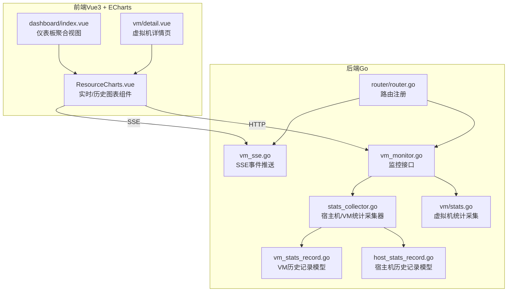
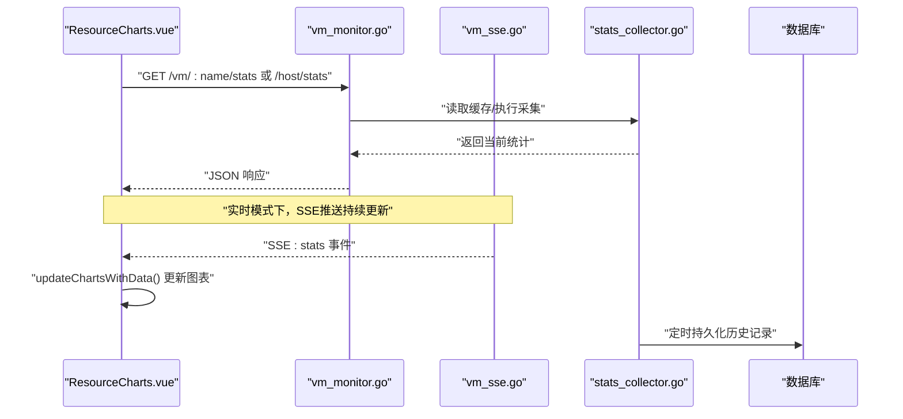
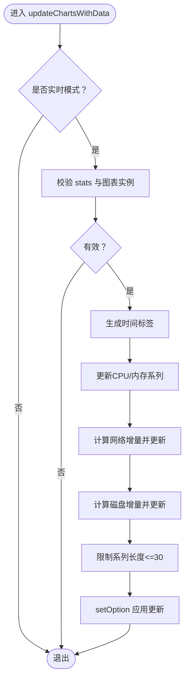
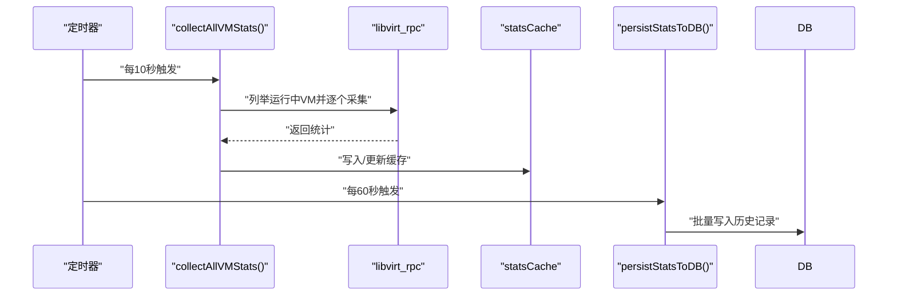
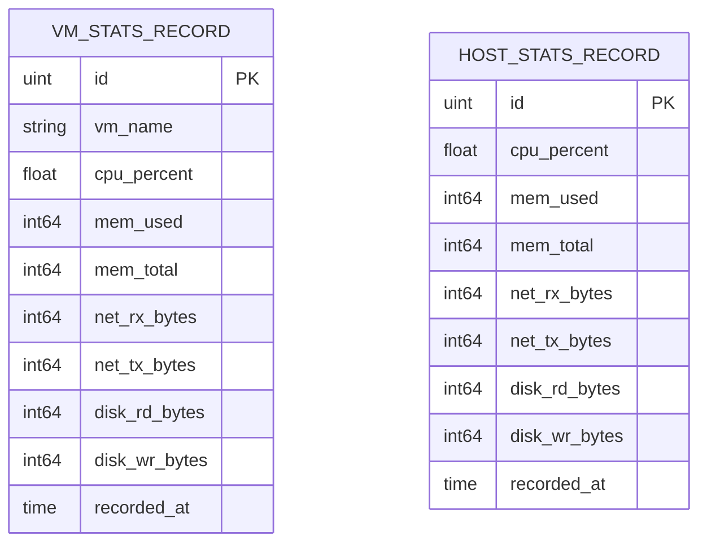
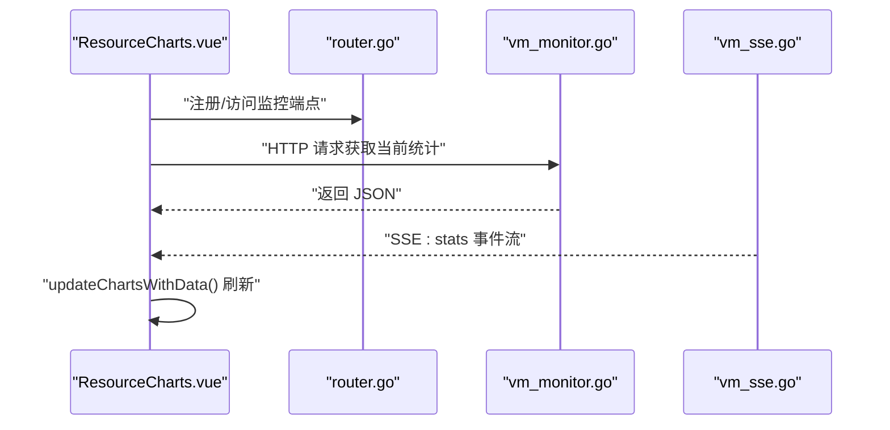
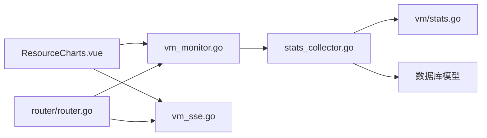

# 性能监控

<cite>
**本文引用的文件**
- [ResourceCharts.vue](file://web/src/components/ResourceCharts.vue)
- [index.vue（仪表板）](file://web/src/views/dashboard/index.vue)
- [detail.vue（虚拟机详情）](file://web/src/views/vm/detail.vue)
- [stats_collector.go](file://server/service/host/stats_collector.go)
- [stats.go（虚拟机统计）](file://server/service/vm/stats.go)
- [vm_stats_record.go](file://server/model/vm_stats_record.go)
- [host_stats_record.go](file://server/model/host_stats_record.go)
- [vm_monitor.go](file://server/handler/vm_monitor.go)
- [vm_sse.go](file://server/handler/vm_sse.go)
- [router.go](file://server/router/router.go)
- [types.go（虚拟机统计类型）](file://server/service/vm/types.go)
- [libvirt_rpc/connection.go](file://server/service/libvirt_rpc/connection.go)
</cite>

## 目录
1. [简介](#简介)
2. [项目结构](#项目结构)
3. [核心组件](#核心组件)
4. [架构总览](#架构总览)
5. [详细组件分析](#详细组件分析)
6. [依赖关系分析](#依赖关系分析)
7. [性能考量](#性能考量)
8. [故障排查指南](#故障排查指南)
9. [结论](#结论)
10. [附录](#附录)

## 简介
本文件面向Open虚拟机管理控制台的性能监控系统，围绕“实时性能监控面板”的实现进行深入解析，涵盖图表展示、数据刷新机制与用户交互；同时阐述性能数据的采集频率、存储策略与查询优化，历史数据分析（趋势、峰值、报告）、性能基准与异常检测思路，以及前端可视化组件的实现要点（图表库集成、数据绑定与响应式设计）。最后给出配置优化与调优建议。

## 项目结构
性能监控涉及前后端协同：前端负责实时/历史图表渲染与交互，后端负责采集、缓存、持久化与对外接口；二者通过HTTP API与Server-Sent Events（SSE）联动。

**图表来源**
- [ResourceCharts.vue:44-171](file://web/src/components/ResourceCharts.vue#L44-L171)
- [stats_collector.go:45-73](file://server/service/host/stats_collector.go#L45-L73)
- [vm_monitor.go](file://server/handler/vm_monitor.go)
- [vm_sse.go](file://server/handler/vm_sse.go)
- [router.go](file://server/router/router.go)

**章节来源**
- [ResourceCharts.vue:44-171](file://web/src/components/ResourceCharts.vue#L44-L171)
- [stats_collector.go:45-73](file://server/service/host/stats_collector.go#L45-L73)
- [router.go](file://server/router/router.go)

## 核心组件
- 实时/历史图表组件：负责ECharts初始化、数据绑定、窗口大小自适应、轮询或SSE驱动更新。
- 采集器：定时批量采集宿主机与运行中虚拟机的资源数据，维护内存缓存，并周期性落库。
- 模型层：定义VM与宿主机的历史记录结构，包含索引字段以便高效查询。
- 接口与SSE：提供历史查询接口与SSE事件流，支撑前端实时刷新与历史回放。
- 视图集成：仪表板与虚拟机详情页按需加载图表组件，支持不同模式切换。

**章节来源**
- [ResourceCharts.vue:44-171](file://web/src/components/ResourceCharts.vue#L44-L171)
- [stats_collector.go:45-73](file://server/service/host/stats_collector.go#L45-L73)
- [vm_stats_record.go:1-19](file://server/model/vm_stats_record.go#L1-L19)
- [host_stats_record.go](file://server/model/host_stats_record.go)

## 架构总览
下图展示了从前端图表到后端采集、存储与接口的完整链路，以及SSE在实时场景下的作用。

**图表来源**
- [ResourceCharts.vue:155-229](file://web/src/components/ResourceCharts.vue#L155-L229)
- [vm_monitor.go](file://server/handler/vm_monitor.go)
- [vm_sse.go](file://server/handler/vm_sse.go)
- [stats_collector.go:45-73](file://server/service/host/stats_collector.go#L45-L73)

## 详细组件分析

### 前端：ResourceCharts.vue（实时/历史图表）
- 图表初始化与布局
  - 初始化CPU、内存、网络、磁盘四类折线图实例，采用平滑曲线与统一标题样式。
  - 支持“实时”和“历史”两种模式，默认实时模式，可通过属性切换。
- 数据刷新机制
  - 轮询：当未启用SSE或外部未推送时，组件内部以固定间隔拉取数据并更新图表。
  - SSE：监听外部传入的stats对象，深监听变化后直接更新图表，避免额外XHR。
  - 速率计算：网络与磁盘采用增量/时间窗计算，保证单位时间内吞吐量显示稳定。
- 用户交互
  - 支持通过属性禁用轮询，交由外部通过SSE驱动更新，降低重复请求。
  - 支持动态切换图表模式，适配不同页面场景（仪表板/详情页）。
- 响应式与性能
  - 固定最多保留30个点，超出则移除最早数据，维持内存占用与渲染性能。
  - 时间轴格式为“时:分:秒”，便于实时定位。

**图表来源**
- [ResourceCharts.vue:165-216](file://web/src/components/ResourceCharts.vue#L165-L216)

**章节来源**
- [ResourceCharts.vue:44-171](file://web/src/components/ResourceCharts.vue#L44-L171)
- [ResourceCharts.vue:155-229](file://web/src/components/ResourceCharts.vue#L155-L229)
- [ResourceCharts.vue:165-216](file://web/src/components/ResourceCharts.vue#L165-L216)

### 后端：采集器与存储（stats_collector.go）
- 采集频率与节奏
  - 采集周期：约10秒一次，持久化周期：约60秒一次。
  - 在非维护模式下，批量采集所有运行中虚拟机的统计，并同步宿主机统计。
- 缓存策略
  - 内存缓存：保存最近一次采集结果，清理已关机虚拟机的缓存项。
  - 宿主机统计独立缓存，避免与VM统计互相影响。
- 持久化策略
  - 定时将VM与宿主机统计写入数据库，形成历史记录，供查询与报表使用。
  - 历史查询接口按时间范围排序返回，便于前端绘制历史曲线。
- 异常处理
  - 单个VM采集失败仅记录告警并跳过，不影响整体流程。

**图表来源**
- [stats_collector.go:45-73](file://server/service/host/stats_collector.go#L45-L73)
- [stats_collector.go:85-124](file://server/service/host/stats_collector.go#L85-L124)
- [stats_collector.go:264-281](file://server/service/host/stats_collector.go#L264-L281)

**章节来源**
- [stats_collector.go:45-73](file://server/service/host/stats_collector.go#L45-L73)
- [stats_collector.go:85-124](file://server/service/host/stats_collector.go#L85-L124)
- [stats_collector.go:264-281](file://server/service/host/stats_collector.go#L264-L281)
- [stats_collector.go:346-358](file://server/service/host/stats_collector.go#L346-L358)

### 数据模型与查询优化
- VM历史记录模型
  - 字段：虚拟机名、CPU使用率、内存使用/总量、网络收发字节、磁盘读写字节、记录时间。
  - 索引：VM名与记录时间均建立索引，支持按VM与时间范围快速检索。
- 宿主机历史记录模型
  - 字段：CPU使用率、内存使用/总量、网络收发字节、磁盘读写字节、记录时间。
  - 索引：记录时间索引，支持按时间范围查询。
- 查询接口
  - 提供按时间范围查询VM与宿主机历史记录的接口，返回有序列表，便于前端绘制。

**图表来源**
- [vm_stats_record.go:1-19](file://server/model/vm_stats_record.go#L1-L19)
- [host_stats_record.go](file://server/model/host_stats_record.go)

**章节来源**
- [vm_stats_record.go:1-19](file://server/model/vm_stats_record.go#L1-L19)
- [stats_collector.go:346-358](file://server/service/host/stats_collector.go#L346-L358)

### 接口与SSE（vm_monitor.go、vm_sse.go、router.go）
- 监控接口
  - 提供获取单台虚拟机或宿主机当前统计的接口，供前端轮询或首次加载使用。
- SSE事件
  - 当启用实时模式且存在外部stats时，通过SSE推送stats事件，前端监听并更新图表。
- 路由注册
  - 路由模块负责将监控接口与SSE端点纳入服务，确保前后端连通。

**图表来源**
- [vm_monitor.go](file://server/handler/vm_monitor.go)
- [vm_sse.go](file://server/handler/vm_sse.go)
- [router.go](file://server/router/router.go)

**章节来源**
- [vm_monitor.go](file://server/handler/vm_monitor.go)
- [vm_sse.go](file://server/handler/vm_sse.go)
- [router.go](file://server/router/router.go)

### 视图集成（仪表板与详情页）
- 仪表板
  - 在展开某台虚拟机时，按“历史”模式加载图表，适合查看历史趋势。
- 虚拟机详情页
  - 在开发者监视器标签页中，按“实时”模式加载图表，外部stats通过SSE驱动，禁用轮询以减少冗余请求。

**章节来源**
- [index.vue（仪表板）:219-246](file://web/src/views/dashboard/index.vue#L219-L246)
- [detail.vue（虚拟机详情）:237-250](file://web/src/views/vm/detail.vue#L237-L250)

### 虚拟机统计采集（vm/stats.go）
- 采集内容
  - CPU使用率、内存使用/总量、网络收发字节、磁盘读写字节、IO延迟、磁盘空间等。
- 数据来源
  - 通过shell命令与系统文件读取，结合libvirt RPC获取域信息。
- 与采集器协作
  - 采集器定期批量调用此逻辑，汇总为缓存与持久化数据。

**章节来源**
- [stats.go（虚拟机统计）:232-264](file://server/service/vm/stats.go#L232-L264)

## 依赖关系分析
- 前端对后端的依赖
  - ResourceCharts依赖vm_monitor接口与vm_sse事件；在实时模式下优先SSE，在SSE不可用时回退轮询。
- 后端对底层的依赖
  - 采集器依赖libvirt RPC与系统命令（如iostat、lsblk、/proc/net/dev等）。
  - 模型层依赖数据库ORM，查询接口基于GORM链式API构建。
- 路由与中间件
  - 路由模块集中注册监控与SSE端点，确保访问路径一致。

**图表来源**
- [ResourceCharts.vue:155-229](file://web/src/components/ResourceCharts.vue#L155-L229)
- [vm_monitor.go](file://server/handler/vm_monitor.go)
- [vm_sse.go](file://server/handler/vm_sse.go)
- [stats_collector.go:45-73](file://server/service/host/stats_collector.go#L45-L73)
- [router.go](file://server/router/router.go)

**章节来源**
- [ResourceCharts.vue:155-229](file://web/src/components/ResourceCharts.vue#L155-L229)
- [stats_collector.go:45-73](file://server/service/host/stats_collector.go#L45-L73)
- [router.go](file://server/router/router.go)

## 性能考量
- 采集频率与负载
  - 10秒采集一次，对宿主机与运行中VM进行批量统计，建议在高密度VM场景下评估CPU与I/O开销。
- 存储与查询
  - 历史记录按分钟级写入，查询按时间范围排序，建议在数据库层面建立合适索引（已见模型定义）。
- 前端渲染
  - 每类指标最多保留30个点，避免长时间运行导致内存膨胀；建议根据屏幕宽度动态调整点数上限。
- SSE与轮询
  - 实时模式优先SSE，减少HTTP请求；若SSE断开，组件自动回退轮询，保障可用性。
- 异常与降级
  - 单台VM采集失败不阻塞其他VM，采集器与持久化过程均有错误日志，便于定位问题。

[本节为通用指导，无需特定文件引用]

## 故障排查指南
- 图表不刷新
  - 检查SSE连接状态与外部stats是否传入；确认实时模式开启且未禁用轮询。
  - 查看浏览器控制台是否有网络错误或跨域问题。
- 数据为空或延迟严重
  - 检查后端采集器定时任务是否正常运行；确认libvirt RPC连接与系统命令可用。
  - 核对数据库写入是否成功，查询接口能否返回数据。
- 历史数据缺失
  - 确认持久化定时器是否触发；检查查询时间范围是否覆盖记录时间。
- 性能抖动
  - 关注磁盘IO延迟与网络收发字节的突增；结合SSE事件与轮询数据对比定位异常时段。

**章节来源**
- [ResourceCharts.vue:223-228](file://web/src/components/ResourceCharts.vue#L223-L228)
- [stats_collector.go:277-280](file://server/service/host/stats_collector.go#L277-L280)

## 结论
该性能监控体系以“前端图表组件 + 后端采集器 + 数据库存储 + 接口/SSE”为核心，实现了从实时到历史的全链路监控能力。通过合理的采集频率、内存缓存与数据库索引，兼顾了性能与可观测性；前端组件在SSE与轮询之间灵活切换，满足不同场景需求。后续可在异常检测、阈值报警与报告自动化方面进一步增强。

[本节为总结，无需特定文件引用]

## 附录

### 历史数据分析与报告建议
- 趋势分析
  - 基于历史记录的时间序列，计算移动平均、分位数等指标，识别长期趋势。
- 峰值检测
  - 设定CPU/内存/网络/磁盘的阈值，结合滑动窗口检测异常峰值。
- 报告生成
  - 按天/周/月导出统计摘要（最大值、平均值、P95/P99、总流量等），用于容量规划与成本分析。

[本节为概念性建议，无需特定文件引用]

### 配置优化与调优建议
- 采集参数
  - 在高并发VM场景下，适当延长采集间隔或分批采集，避免瞬时压力过大。
- 前端渲染
  - 根据设备性能动态调整点数上限与刷新频率；对低性能设备可默认历史模式。
- 数据库
  - 对历史表定期归档与清理，避免冷数据膨胀；确保查询索引命中率。
- SSE与限流
  - 在高并发场景下启用服务端限流与客户端重连退避策略，提升稳定性。

[本节为通用建议，无需特定文件引用]