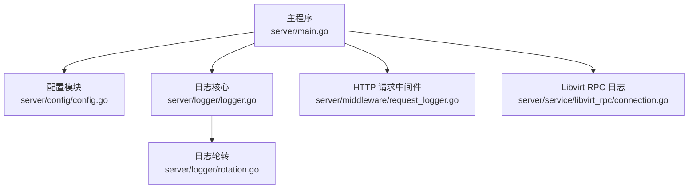
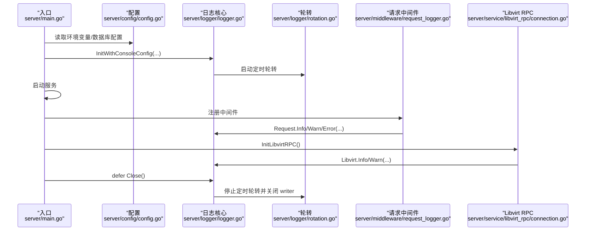
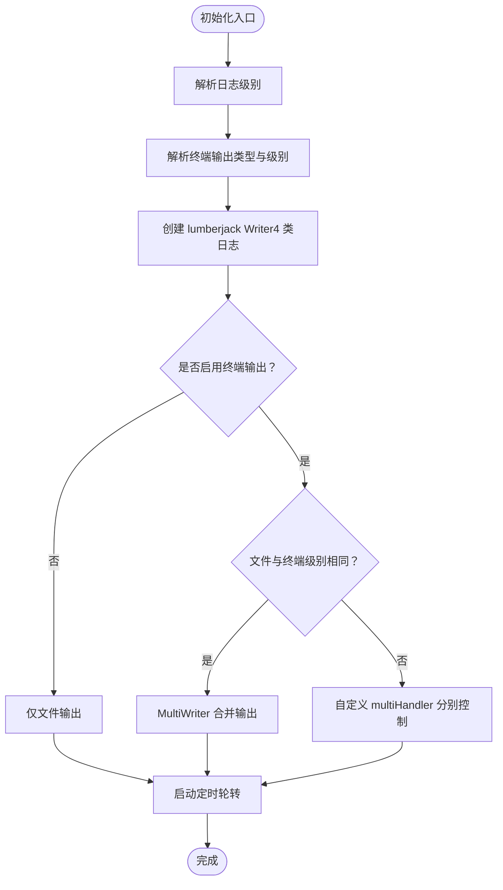
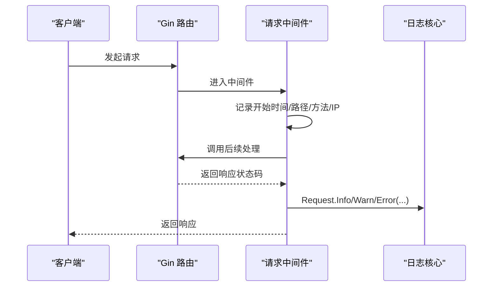
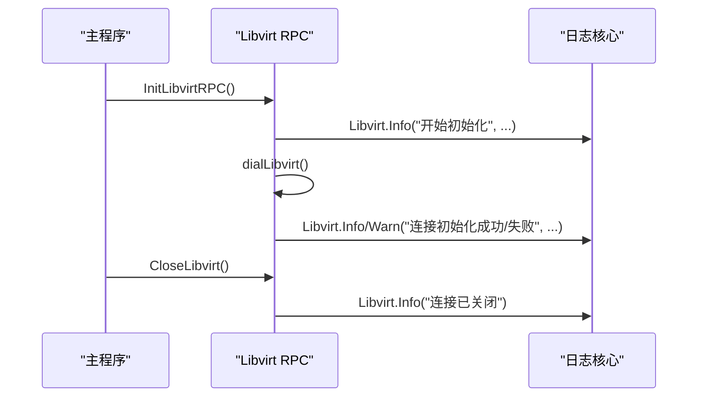
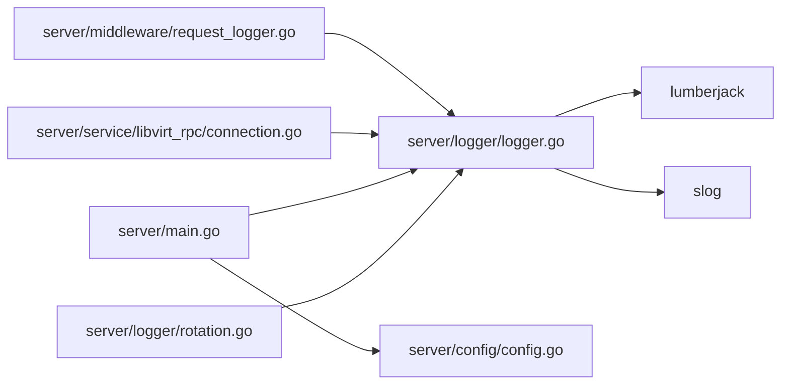

# 日志管理

<cite>
**本文引用的文件**
- [server/logger/logger.go](file://server/logger/logger.go)
- [server/logger/rotation.go](file://server/logger/rotation.go)
- [server/middleware/request_logger.go](file://server/middleware/request_logger.go)
- [server/main.go](file://server/main.go)
- [server/config/config.go](file://server/config/config.go)
- [server/service/libvirt_rpc/connection.go](file://server/service/libvirt_rpc/connection.go)
</cite>

## 目录
1. [简介](#简介)
2. [项目结构](#项目结构)
3. [核心组件](#核心组件)
4. [架构总览](#架构总览)
5. [详细组件分析](#详细组件分析)
6. [依赖分析](#依赖分析)
7. [性能考量](#性能考量)
8. [故障排查指南](#故障排查指南)
9. [结论](#结论)
10. [附录](#附录)

## 简介
本文件面向 Open 虚拟机管理控制台的日志管理系统，系统性梳理多类型日志的实现与用途，包括通用应用日志、HTTP 请求日志、命令执行日志与 Libvirt RPC 日志；解释日志级别配置机制（debug/info/warn/error）及动态调整能力；阐述日志轮转机制（按大小、按时间、压缩策略）；说明日志输出配置（文件、终端、混合模式）；并给出日志目录管理、文件权限控制与存储空间优化的最佳实践与故障排查方法。

## 项目结构
日志系统主要由以下模块构成：
- 日志核心：统一初始化、级别解析、输出目标（文件/终端/混合）、多处理器合并
- 日志轮转：基于第三方库的按大小轮转与按时间轮转（每日 00:00 触发）
- HTTP 请求日志中间件：基于 Gin 的请求处理日志，按状态码分级
- Libvirt RPC 日志：对 go-libvirt 连接生命周期进行记录
- 配置来源：环境变量与数据库持久化配置驱动日志行为
- 启动入口：主程序负责初始化日志系统并在退出时关闭

**图表来源**
- [server/main.go:31-128](file://server/main.go#L31-L128)
- [server/config/config.go:157-249](file://server/config/config.go#L157-L249)
- [server/logger/logger.go:31-84](file://server/logger/logger.go#L31-L84)
- [server/logger/rotation.go:13-35](file://server/logger/rotation.go#L13-L35)
- [server/middleware/request_logger.go:11-69](file://server/middleware/request_logger.go#L11-L69)
- [server/service/libvirt_rpc/connection.go:20-43](file://server/service/libvirt_rpc/connection.go#L20-L43)

**章节来源**
- [server/main.go:31-128](file://server/main.go#L31-L128)
- [server/config/config.go:157-249](file://server/config/config.go#L157-L249)

## 核心组件
- 多类型日志实例
  - App：通用应用日志
  - Request：HTTP 请求日志
  - CMD：命令执行日志
  - Libvirt：go-libvirt RPC 日志
- 日志级别
  - debug、info、warn、error 四级，支持字符串解析
- 输出目标
  - 文件输出：每个类型独立文件
  - 终端输出：可选，支持独立级别
  - 混合输出：文件与终端同时输出，可分别设置级别
- 日志轮转
  - 基于 lumberjack：按大小轮转、按时间轮转（每日 00:00）、压缩、最大备份数
- HTTP 请求日志中间件
  - 按状态码分级记录（5xx 错误、4xx 警告、其他信息）
  - 记录路径、方法、状态码、耗时、客户端 IP、用户标识等
- Libvirt RPC 日志
  - 初始化、连接校验、关闭阶段记录

**章节来源**
- [server/logger/logger.go:14-20](file://server/logger/logger.go#L14-L20)
- [server/logger/logger.go:31-84](file://server/logger/logger.go#L31-L84)
- [server/logger/logger.go:196-210](file://server/logger/logger.go#L196-L210)
- [server/logger/logger.go:98-126](file://server/logger/logger.go#L98-L126)
- [server/logger/rotation.go:13-35](file://server/logger/rotation.go#L13-L35)
- [server/middleware/request_logger.go:11-69](file://server/middleware/request_logger.go#L11-L69)
- [server/service/libvirt_rpc/connection.go:20-43](file://server/service/libvirt_rpc/connection.go#L20-L43)

## 架构总览
下图展示了日志系统的整体交互：主程序加载配置并初始化日志；HTTP 请求经中间件记录；Libvirt RPC 生命周期被单独记录；日志写入 lumberjack 并按配置轮转。

**图表来源**
- [server/main.go:31-128](file://server/main.go#L31-L128)
- [server/config/config.go:157-249](file://server/config/config.go#L157-L249)
- [server/logger/logger.go:31-84](file://server/logger/logger.go#L31-L84)
- [server/logger/rotation.go:13-35](file://server/logger/rotation.go#L13-L35)
- [server/middleware/request_logger.go:11-69](file://server/middleware/request_logger.go#L11-L69)
- [server/service/libvirt_rpc/connection.go:20-43](file://server/service/libvirt_rpc/connection.go#L20-L43)

## 详细组件分析

### 日志核心与初始化流程
- 初始化入口
  - 支持完整控制台输出配置的初始化函数，允许：
    - 日志目录、级别、最大保留天数、压缩开关
    - 是否输出到终端、终端类型过滤、终端级别
    - 单文件最大大小、最大备份数
- 目录与权限
  - 自动创建日志目录（权限掩码在初始化处可见）
- 多处理器输出
  - 当终端级别与文件级别相同时，使用 MultiWriter 合并输出
  - 当两者不同时，使用自定义 multiHandler 分别控制
- 日志级别解析
  - 字符串到 slog.Level 的映射，支持 debug/info/warn/error，默认 info

**图表来源**
- [server/logger/logger.go:31-84](file://server/logger/logger.go#L31-L84)
- [server/logger/logger.go:98-126](file://server/logger/logger.go#L98-L126)
- [server/logger/logger.go:196-210](file://server/logger/logger.go#L196-L210)

**章节来源**
- [server/logger/logger.go:31-84](file://server/logger/logger.go#L31-L84)
- [server/logger/logger.go:98-126](file://server/logger/logger.go#L98-L126)
- [server/logger/logger.go:196-210](file://server/logger/logger.go#L196-L210)

### 日志轮转机制
- 轮转触发
  - 每日凌晨 00:00 触发一次 Rotate
- 轮转内容
  - 对 app/request/cmd/libvirt 四个 lumberjack.Writer 执行 Rotate
- 停止机制
  - Close 时停止定时器并逐个关闭 writer
- 第三方库特性
  - 按大小轮转、按时间轮转（本地时间）、压缩、最大备份数

**图表来源**
- [server/logger/rotation.go:13-35](file://server/logger/rotation.go#L13-L35)
- [server/logger/rotation.go:37-42](file://server/logger/rotation.go#L37-L42)
- [server/logger/rotation.go:44-50](file://server/logger/rotation.go#L44-L50)

**章节来源**
- [server/logger/rotation.go:13-35](file://server/logger/rotation.go#L13-L35)
- [server/logger/rotation.go:37-42](file://server/logger/rotation.go#L37-L42)
- [server/logger/rotation.go:44-50](file://server/logger/rotation.go#L44-L50)

### HTTP 请求日志中间件
- 记录字段
  - 方法、路径（含查询串）、状态码、耗时、客户端 IP、用户标识、错误集合
- 级别策略
  - 5xx：错误级别
  - 4xx：警告级别
  - 其他：信息级别
- 使用位置
  - 作为 Gin 中间件在路由层统一接入

**图表来源**
- [server/middleware/request_logger.go:11-69](file://server/middleware/request_logger.go#L11-L69)
- [server/logger/logger.go:14-19](file://server/logger/logger.go#L14-L19)

**章节来源**
- [server/middleware/request_logger.go:11-69](file://server/middleware/request_logger.go#L11-L69)

### Libvirt RPC 日志
- 初始化阶段
  - 记录 socket 路径与连接结果
  - 连接后查询版本并记录版本信息
- 关闭阶段
  - 断开连接并记录
- 可用性检测
  - 提供快速检测函数，避免不必要的网络探测

**图表来源**
- [server/service/libvirt_rpc/connection.go:20-43](file://server/service/libvirt_rpc/connection.go#L20-L43)
- [server/service/libvirt_rpc/connection.go:88-98](file://server/service/libvirt_rpc/connection.go#L88-L98)
- [server/logger/logger.go:16-19](file://server/logger/logger.go#L16-L19)

**章节来源**
- [server/service/libvirt_rpc/connection.go:20-43](file://server/service/libvirt_rpc/connection.go#L20-L43)
- [server/service/libvirt_rpc/connection.go:88-98](file://server/service/libvirt_rpc/connection.go#L88-L98)

### 日志输出配置与动态调整
- 配置来源
  - 环境变量与数据库持久化配置共同驱动
  - 关键项：日志目录、级别、最大保留天数、压缩、终端开关、终端类型、终端级别、单文件最大大小、最大备份数
- 动态调整
  - 当前实现为一次性初始化，未提供运行时热重载
  - 如需动态调整，建议重启进程以应用新配置

**章节来源**
- [server/config/config.go:157-249](file://server/config/config.go#L157-L249)
- [server/config/config.go:376-386](file://server/config/config.go#L376-L386)
- [server/main.go:42-54](file://server/main.go#L42-L54)

## 依赖分析
- 组件耦合
  - 日志核心与轮转模块松耦合，轮转模块仅依赖标准库 time
  - 中间件与日志核心解耦，通过 logger 包暴露的全局实例使用
  - Libvirt RPC 与日志核心解耦，仅在关键节点打点
- 外部依赖
  - lumberjack：提供按大小/时间轮转与压缩
  - slog：标准库结构化日志
  - gin：HTTP 中间件框架

**图表来源**
- [server/logger/logger.go:31-84](file://server/logger/logger.go#L31-L84)
- [server/logger/rotation.go:13-35](file://server/logger/rotation.go#L13-L35)
- [server/middleware/request_logger.go:11-69](file://server/middleware/request_logger.go#L11-L69)
- [server/service/libvirt_rpc/connection.go:20-43](file://server/service/libvirt_rpc/connection.go#L20-L43)
- [server/main.go:31-128](file://server/main.go#L31-L128)
- [server/config/config.go:157-249](file://server/config/config.go#L157-L249)

**章节来源**
- [server/logger/logger.go:31-84](file://server/logger/logger.go#L31-L84)
- [server/logger/rotation.go:13-35](file://server/logger/rotation.go#L13-L35)
- [server/middleware/request_logger.go:11-69](file://server/middleware/request_logger.go#L11-L69)
- [server/service/libvirt_rpc/connection.go:20-43](file://server/service/libvirt_rpc/connection.go#L20-L43)
- [server/main.go:31-128](file://server/main.go#L31-L128)
- [server/config/config.go:157-249](file://server/config/config.go#L157-L249)

## 性能考量
- 日志级别
  - 在高并发场景建议使用 info/warn 级别，避免过多 debug 日志带来的 I/O 压力
- 输出目标
  - 终端输出会增加额外开销，生产环境建议关闭或限制到特定类型
- 轮转策略
  - 合理设置单文件大小与最大备份数，平衡磁盘占用与检索效率
  - 压缩可节省空间，但会带来 CPU 开销
- 中间件成本
  - 请求日志中间件每次请求都会构造日志记录，建议在高 QPS 场景谨慎开启详细字段

## 故障排查指南
- 无法创建日志目录
  - 现象：启动时抛出异常
  - 排查：确认日志目录权限与路径正确
  - 参考
    - [server/logger/logger.go:51-54](file://server/logger/logger.go#L51-L54)
- 日志未输出到终端
  - 现象：终端无日志
  - 排查：确认终端开关与终端类型过滤配置
  - 参考
    - [server/logger/logger.go:65-66](file://server/logger/logger.go#L65-L66)
    - [server/logger/logger.go:172-194](file://server/logger/logger.go#L172-L194)
- 日志级别未生效
  - 现象：终端与文件级别不一致
  - 排查：确认终端级别配置是否为空（空则跟随文件级别）
  - 参考
    - [server/logger/logger.go:59-63](file://server/logger/logger.go#L59-L63)
- 轮转未触发
  - 现象：日志文件未按日期轮转
  - 排查：确认系统时间与时区；检查定时器是否被关闭
  - 参考
    - [server/logger/rotation.go:13-35](file://server/logger/rotation.go#L13-L35)
    - [server/logger/rotation.go:44-50](file://server/logger/rotation.go#L44-L50)
- Libvirt 连接问题
  - 现象：初始化失败或版本查询失败
  - 排查：确认 socket 路径、权限与 libvirtd 服务状态
  - 参考
    - [server/service/libvirt_rpc/connection.go:20-43](file://server/service/libvirt_rpc/connection.go#L20-L43)
- 配置未生效
  - 现象：修改配置后未见变化
  - 排查：确认环境变量与数据库持久化配置优先级；需重启进程以应用新配置
  - 参考
    - [server/config/config.go:458-460](file://server/config/config.go#L458-L460)
    - [server/main.go:42-54](file://server/main.go#L42-L54)

**章节来源**
- [server/logger/logger.go:51-54](file://server/logger/logger.go#L51-L54)
- [server/logger/logger.go:59-63](file://server/logger/logger.go#L59-L63)
- [server/logger/logger.go:65-66](file://server/logger/logger.go#L65-L66)
- [server/logger/logger.go:172-194](file://server/logger/logger.go#L172-L194)
- [server/logger/rotation.go:13-35](file://server/logger/rotation.go#L13-L35)
- [server/logger/rotation.go:44-50](file://server/logger/rotation.go#L44-L50)
- [server/service/libvirt_rpc/connection.go:20-43](file://server/service/libvirt_rpc/connection.go#L20-L43)
- [server/config/config.go:458-460](file://server/config/config.go#L458-L460)
- [server/main.go:42-54](file://server/main.go#L42-L54)

## 结论
该日志系统以结构化日志为核心，提供四类日志分离、灵活的输出目标与轮转策略，并通过配置模块实现环境变量与数据库持久化配置的统一管理。HTTP 请求与 Libvirt RPC 的专门日志通道有助于定位业务与底层通信问题。建议在生产环境中合理设置级别与轮转参数，结合监控与告警完善日志运维体系。

## 附录

### 日志类型与用途对照
- App（通用应用日志）
  - 用途：系统启动、关键业务流程、错误与警告
  - 参考
    - [server/main.go:56-127](file://server/main.go#L56-L127)
- Request（HTTP 请求日志）
  - 用途：请求路径、方法、状态码、耗时、客户端 IP、用户标识
  - 参考
    - [server/middleware/request_logger.go:11-69](file://server/middleware/request_logger.go#L11-L69)
- CMD（命令执行日志）
  - 用途：外部命令执行、参数、结果与错误
  - 参考
    - [server/logger/logger.go:18](file://server/logger/logger.go#L18)
- Libvirt（Libvirt RPC 日志）
  - 用途：连接初始化、版本校验、关闭
  - 参考
    - [server/service/libvirt_rpc/connection.go:20-43](file://server/service/libvirt_rpc/connection.go#L20-L43)

**章节来源**
- [server/logger/logger.go:14-20](file://server/logger/logger.go#L14-L20)
- [server/middleware/request_logger.go:11-69](file://server/middleware/request_logger.go#L11-L69)
- [server/service/libvirt_rpc/connection.go:20-43](file://server/service/libvirt_rpc/connection.go#L20-L43)