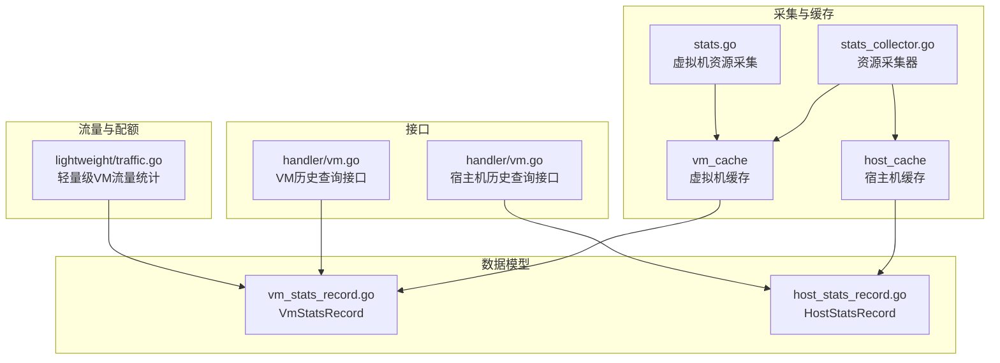
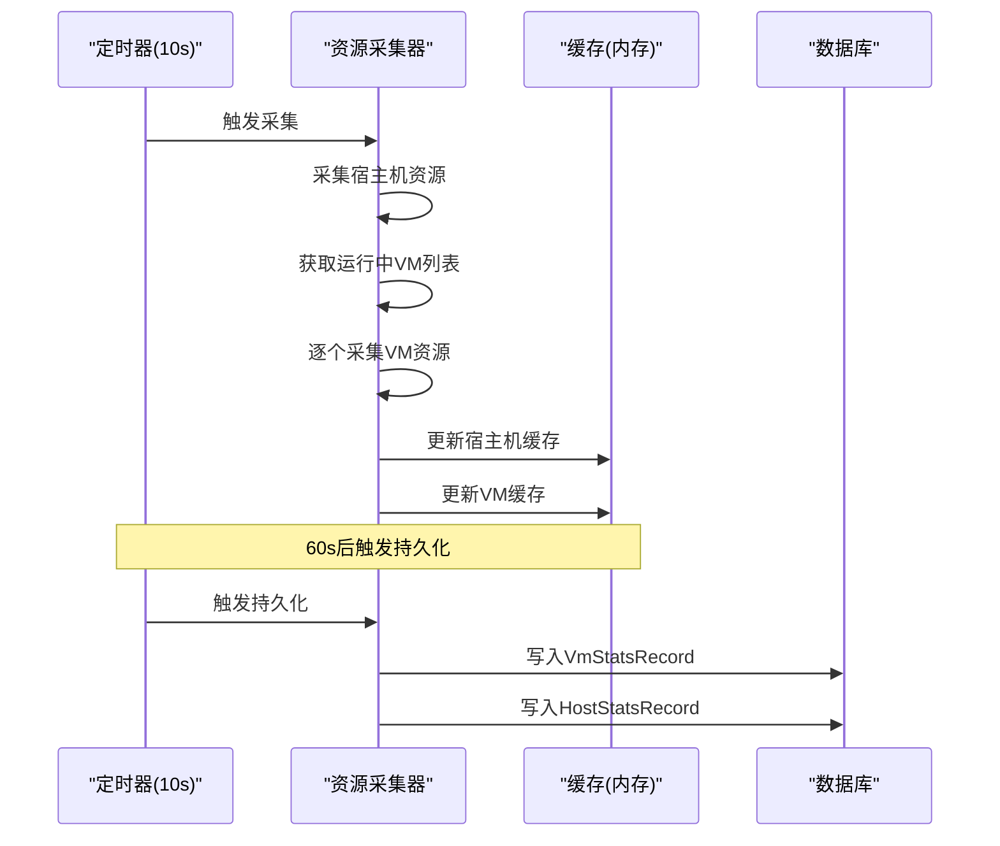
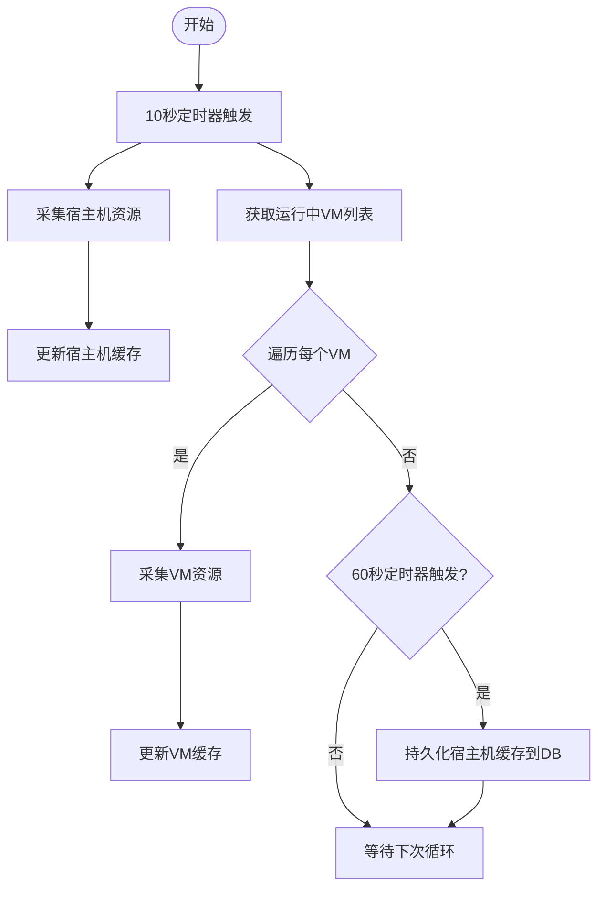
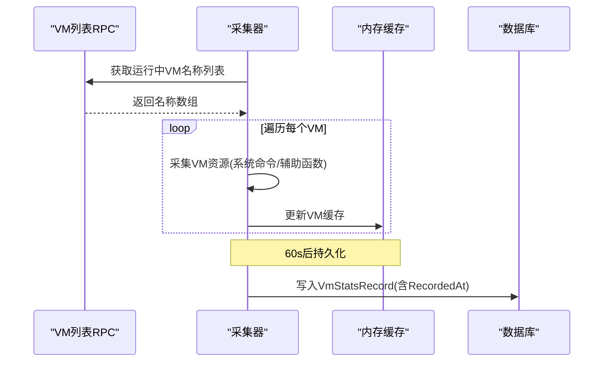
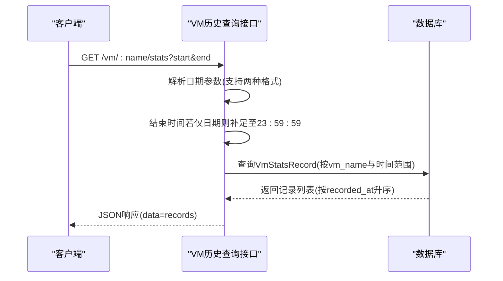
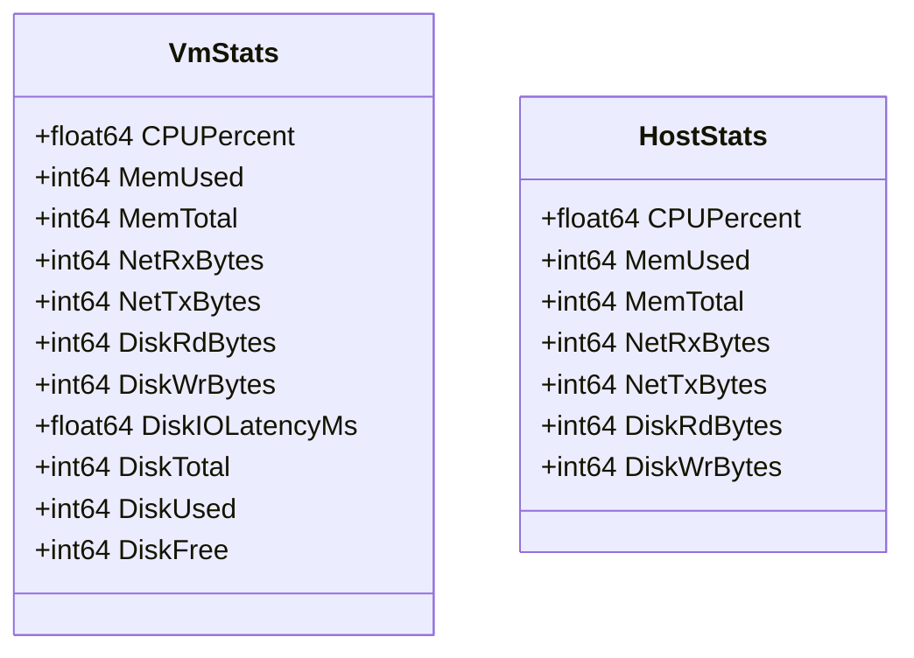
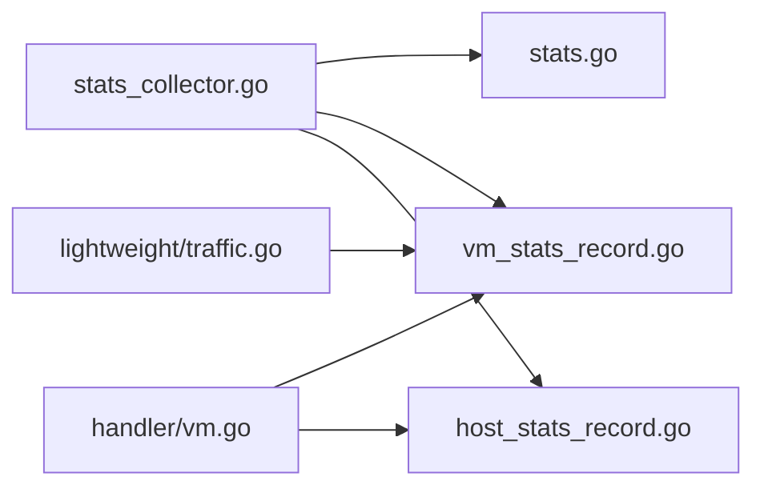

# 监控指标与统计

<cite>
**本文引用的文件**
- [server/service/host/stats_collector.go](file://server/service/host/stats_collector.go)
- [server/service/vm/stats.go](file://server/service/vm/stats.go)
- [server/model/vm_stats_record.go](file://server/model/vm_stats_record.go)
- [server/model/host_stats_record.go](file://server/model/host_stats_record.go)
- [server/handler/vm.go](file://server/handler/vm.go)
- [server/service/lightweight/traffic.go](file://server/service/lightweight/traffic.go)
- [server/service/vm/types.go](file://server/service/vm/types.go)
- [server/service/vm/memory/types.go](file://server/service/vm/memory/types.go)
</cite>

## 目录
1. [简介](#简介)
2. [项目结构](#项目结构)
3. [核心组件](#核心组件)
4. [架构总览](#架构总览)
5. [详细组件分析](#详细组件分析)
6. [依赖关系分析](#依赖关系分析)
7. [性能考量](#性能考量)
8. [故障排查指南](#故障排查指南)
9. [结论](#结论)
10. [附录](#附录)

## 简介
本文件面向Open虚拟机管理控制台的监控指标与统计系统，围绕以下目标展开：
- 深入解释主机资源使用率监控的实现，包括CPU使用率、内存占用、磁盘IO和网络流量的采集机制
- 详述虚拟机性能统计功能，包括运行状态、资源消耗与性能指标的收集与存储
- 阐明统计数据的存储结构与查询接口，包括时间序列数据的组织方式与历史数据管理策略
- 解释监控数据的实时更新机制与缓存策略
- 提供监控指标配置与自定义监控项的扩展方法

## 项目结构
监控与统计相关的关键模块分布如下：
- 服务层采集与缓存
  - 宿主机与虚拟机资源采集器：负责周期性采集并缓存最新数据，同时按固定周期持久化至数据库
  - 虚拟机资源采集：通过系统命令与libvirt RPC等手段获取CPU、内存、磁盘IO、网络IO等指标
- 数据模型层
  - 虚拟机资源历史记录表与宿主机资源历史记录表，均以“记录时间”为索引，便于高效查询
- 接口层
  - 提供按日期范围查询虚拟机与宿主机资源历史记录的HTTP接口
- 流量与配额
  - 轻量级虚拟机月度流量统计与带宽限制应用逻辑，作为资源统计的补充能力

**图表来源**
- [server/service/host/stats_collector.go:33-73](file://server/service/host/stats_collector.go#L33-L73)
- [server/service/vm/stats.go:232-264](file://server/service/vm/stats.go#L232-L264)
- [server/model/vm_stats_record.go:7-19](file://server/model/vm_stats_record.go#L7-L19)
- [server/model/host_stats_record.go:5-16](file://server/model/host_stats_record.go#L5-L16)
- [server/handler/vm.go:1009-1056](file://server/handler/vm.go#L1009-L1056)
- [server/service/lightweight/traffic.go:42-112](file://server/service/lightweight/traffic.go#L42-L112)

**章节来源**
- [server/service/host/stats_collector.go:1-73](file://server/service/host/stats_collector.go#L1-L73)
- [server/service/vm/stats.go:232-264](file://server/service/vm/stats.go#L232-L264)
- [server/model/vm_stats_record.go:1-19](file://server/model/vm_stats_record.go#L1-L19)
- [server/model/host_stats_record.go:1-16](file://server/model/host_stats_record.go#L1-L16)
- [server/handler/vm.go:1009-1056](file://server/handler/vm.go#L1009-L1056)
- [server/service/lightweight/traffic.go:42-112](file://server/service/lightweight/traffic.go#L42-L112)

## 核心组件
- 资源采集器
  - 启动后以10秒为采集周期，更新宿主机与运行中虚拟机的最新资源缓存；以60秒为持久化周期，将缓存快照写入数据库
  - 在非维护模式下批量采集运行中虚拟机的资源数据，并同步运行时配额状态
- 虚拟机资源采集
  - 通过系统命令与辅助函数采集磁盘IO延迟、磁盘空间、网络IO、磁盘IO等指标
  - 通过RPC获取运行中虚拟机列表，逐个采集并写入缓存
- 数据模型
  - 虚拟机资源历史记录包含虚拟机名称、CPU使用率、内存使用/总量、网络收发字节、磁盘读写字节与记录时间
  - 宿主机资源历史记录包含CPU使用率、内存使用/总量、网络收发字节、磁盘读写字节与记录时间
- 查询接口
  - 提供按起止时间范围查询虚拟机与宿主机的历史记录接口，支持多种日期格式解析
- 流量与配额
  - 轻量级虚拟机月度流量统计与带宽限制应用，结合历史记录进行配额校验与限速生效

**章节来源**
- [server/service/host/stats_collector.go:33-73](file://server/service/host/stats_collector.go#L33-L73)
- [server/service/vm/stats.go:232-264](file://server/service/vm/stats.go#L232-L264)
- [server/model/vm_stats_record.go:7-19](file://server/model/vm_stats_record.go#L7-L19)
- [server/model/host_stats_record.go:5-16](file://server/model/host_stats_record.go#L5-L16)
- [server/handler/vm.go:1009-1056](file://server/handler/vm.go#L1009-L1056)
- [server/service/lightweight/traffic.go:42-112](file://server/service/lightweight/traffic.go#L42-L112)

## 架构总览
监控系统采用“采集-缓存-持久化-查询”的分层架构：
- 采集层：周期性采集宿主机与运行中虚拟机的资源数据
- 缓存层：内存缓存最新数据，支撑列表页等高频读场景
- 存储层：定时将缓存快照持久化到数据库，形成时间序列历史
- 查询层：提供REST接口按时间范围查询历史记录

**图表来源**
- [server/service/host/stats_collector.go:33-73](file://server/service/host/stats_collector.go#L33-L73)
- [server/service/host/stats_collector.go:263-306](file://server/service/host/stats_collector.go#L263-L306)

## 详细组件分析

### 宿主机资源采集与缓存
- 采集频率与内容
  - 每10秒采集一次宿主机资源，包括CPU使用率、内存使用/总量、网络收发字节、磁盘读写字节
  - 通过系统命令汇总物理网卡流量，排除回环与虚拟网桥接口
- 缓存策略
  - 使用读写锁保护共享内存缓存，保证并发安全
  - 提供按名称获取单条记录与全量复制接口，用于列表展示
- 持久化策略
  - 每60秒将当前宿主机缓存快照写入数据库，记录时间为持久化时刻

**图表来源**
- [server/service/host/stats_collector.go:33-73](file://server/service/host/stats_collector.go#L33-L73)
- [server/service/host/stats_collector.go:283-306](file://server/service/host/stats_collector.go#L283-L306)

**章节来源**
- [server/service/host/stats_collector.go:1-73](file://server/service/host/stats_collector.go#L1-L73)
- [server/service/host/stats_collector.go:283-306](file://server/service/host/stats_collector.go#L283-L306)

### 虚拟机资源采集与缓存
- 采集内容
  - CPU使用率、内存使用/总量、磁盘IO延迟、磁盘空间、网络IO、磁盘IO
  - 通过系统命令与辅助函数获取磁盘IO延迟、磁盘空间、网络IO与磁盘IO
- 采集流程
  - 获取运行中虚拟机列表
  - 对每个VM执行资源采集，填充VmStats结构体
  - 写入内存缓存，供列表页快速读取
- 缓存与持久化
  - 内存缓存支持按名称查询与全量复制
  - 每60秒将缓存快照写入数据库，形成时间序列

**图表来源**
- [server/service/host/stats_collector.go:85-91](file://server/service/host/stats_collector.go#L85-L91)
- [server/service/host/stats_collector.go:263-281](file://server/service/host/stats_collector.go#L263-L281)
- [server/service/vm/stats.go:232-264](file://server/service/vm/stats.go#L232-L264)

**章节来源**
- [server/service/host/stats_collector.go:85-91](file://server/service/host/stats_collector.go#L85-L91)
- [server/service/host/stats_collector.go:263-281](file://server/service/host/stats_collector.go#L263-L281)
- [server/service/vm/stats.go:232-264](file://server/service/vm/stats.go#L232-L264)

### 数据模型与时间序列组织
- 虚拟机资源历史记录
  - 字段：虚拟机名称、CPU使用率、内存使用/总量、网络收发字节、磁盘读写字节、记录时间
  - 索引：按记录时间升序排序，便于范围查询
- 宿主机资源历史记录
  - 字段：CPU使用率、内存使用/总量、网络收发字节、磁盘读写字节、记录时间
  - 索引：按记录时间升序排序，便于范围查询
- 时间序列组织
  - 以“记录时间”为时间轴，形成等间隔的时间序列
  - 通过查询接口按起止时间筛选，返回有序列表

```mermaid
erDiagram
VM_STATS_RECORD {
uint id PK
string vm_name
decimal cpu_percent
int64 mem_used
int64 mem_total
int64 net_rx_bytes
int64 net_tx_bytes
int64 disk_rd_bytes
int64 disk_wr_bytes
datetime recorded_at
}
HOST_STATS_RECORD {
uint id PK
decimal cpu_percent
int64 mem_used
int64 mem_total
int64 net_rx_bytes
int64 net_tx_bytes
int64 disk_rd_bytes
int64 disk_wr_bytes
datetime recorded_at
}
```

**图表来源**
- [server/model/vm_stats_record.go:7-19](file://server/model/vm_stats_record.go#L7-L19)
- [server/model/host_stats_record.go:5-16](file://server/model/host_stats_record.go#L5-L16)

**章节来源**
- [server/model/vm_stats_record.go:1-19](file://server/model/vm_stats_record.go#L1-L19)
- [server/model/host_stats_record.go:1-16](file://server/model/host_stats_record.go#L1-L16)

### 查询接口与历史数据管理
- 虚拟机历史查询
  - 支持两种日期格式解析：日期与日期+时间
  - 若结束时间仅包含日期，则自动扩展至当日23:59:59
  - 按虚拟机名称与时间范围查询，结果按记录时间升序排列
- 宿主机历史查询
  - 按时间范围查询宿主机资源历史记录，结果按记录时间升序排列
- 历史数据管理
  - 提供删除指定虚拟机历史记录的清理操作
  - 清理同时更新内存缓存，保持一致性

**图表来源**
- [server/handler/vm.go:1009-1056](file://server/handler/vm.go#L1009-L1056)

**章节来源**
- [server/handler/vm.go:1009-1056](file://server/handler/vm.go#L1009-L1056)
- [server/service/host/stats_collector.go:327-350](file://server/service/host/stats_collector.go#L327-L350)

### 实时更新机制与缓存策略
- 实时更新
  - 采集器以10秒为周期更新内存缓存，确保列表页等读场景的低延迟
  - 非维护模式下才进行VM资源采集，避免在维护期间产生无效开销
- 缓存策略
  - 读写锁保护共享缓存，读多写少场景下提升吞吐
  - 提供全量复制接口，避免在遍历过程中持有锁
- 持久化策略
  - 60秒周期将缓存快照写入数据库，兼顾实时性与存储成本
  - 宿主机与虚拟机分别维护独立缓存与持久化流程

**章节来源**
- [server/service/host/stats_collector.go:33-73](file://server/service/host/stats_collector.go#L33-L73)
- [server/service/host/stats_collector.go:308-325](file://server/service/host/stats_collector.go#L308-L325)

### 流量与配额扩展点
- 轻量级虚拟机流量统计
  - 月度聚合有效上下行流量，与配额阈值比较，决定是否启用下行/上行限速
  - 支持根据限速状态调整实际带宽配置，保障公平性与稳定性
- 与监控系统的协同
  - 流量统计与历史记录表配合，形成更全面的资源使用画像
  - 可基于历史记录进行趋势分析与容量规划

**章节来源**
- [server/service/lightweight/traffic.go:42-112](file://server/service/lightweight/traffic.go#L42-L112)

### 类型与数据结构概览
- 虚拟机资源数据结构
  - 包含CPU使用率、内存使用/总量、网络收发字节、磁盘读写字节、磁盘IO延迟、磁盘空间等字段
- 宿主机资源数据结构
  - 包含CPU使用率、内存使用/总量、网络收发字节、磁盘读写字节等字段

**图表来源**
- [server/service/vm/types.go:107-130](file://server/service/vm/types.go#L107-L130)
- [server/service/vm/memory/types.go:131-140](file://server/service/vm/memory/types.go#L131-L140)

**章节来源**
- [server/service/vm/types.go:107-130](file://server/service/vm/types.go#L107-L130)
- [server/service/vm/memory/types.go:131-140](file://server/service/vm/memory/types.go#L131-L140)

## 依赖关系分析
- 组件耦合
  - 资源采集器依赖虚拟机资源采集函数与宿主机资源采集钩子
  - 数据模型被采集器与查询接口共同依赖
  - 接口层依赖数据模型进行查询与返回
- 外部依赖
  - 通过系统命令与辅助函数采集磁盘IO延迟、磁盘空间、网络IO与磁盘IO
  - 通过RPC获取运行中虚拟机列表
- 循环依赖
  - 当前结构未发现循环导入，各模块职责清晰

**图表来源**
- [server/service/host/stats_collector.go:33-73](file://server/service/host/stats_collector.go#L33-L73)
- [server/service/vm/stats.go:232-264](file://server/service/vm/stats.go#L232-L264)
- [server/model/vm_stats_record.go:7-19](file://server/model/vm_stats_record.go#L7-L19)
- [server/model/host_stats_record.go:5-16](file://server/model/host_stats_record.go#L5-L16)
- [server/handler/vm.go:1009-1056](file://server/handler/vm.go#L1009-L1056)
- [server/service/lightweight/traffic.go:42-112](file://server/service/lightweight/traffic.go#L42-L112)

**章节来源**
- [server/service/host/stats_collector.go:33-73](file://server/service/host/stats_collector.go#L33-L73)
- [server/service/vm/stats.go:232-264](file://server/service/vm/stats.go#L232-L264)
- [server/model/vm_stats_record.go:7-19](file://server/model/vm_stats_record.go#L7-L19)
- [server/model/host_stats_record.go:5-16](file://server/model/host_stats_record.go#L5-L16)
- [server/handler/vm.go:1009-1056](file://server/handler/vm.go#L1009-L1056)
- [server/service/lightweight/traffic.go:42-112](file://server/service/lightweight/traffic.go#L42-L112)

## 性能考量
- 采集频率权衡
  - 10秒采集周期满足列表页实时性需求；如需更高精度可缩短周期，但会增加系统负载
  - 60秒持久化周期平衡了历史数据粒度与数据库写入压力
- 缓存优化
  - 读写锁降低锁竞争；全量复制避免遍历时长期持锁
  - 内存缓存显著降低数据库查询压力，建议在高并发场景下保持缓存命中率
- I/O与命令调用
  - 系统命令调用与/proc文件读取为轻量操作，但应避免在同一周期内重复高成本操作
- 存储索引
  - 历史记录按“记录时间”建立索引，查询效率高；建议定期归档或清理过期数据以维持索引性能

## 故障排查指南
- 采集失败
  - 检查系统命令可用性与权限，确认磁盘IO延迟、磁盘空间、网络IO与磁盘IO采集路径可达
  - 关注运行中虚拟机列表RPC调用是否成功，失败时会导致VM资源采集中断
- 缓存异常
  - 若出现读取为空或数据不一致，检查读写锁使用是否正确，确认全量复制逻辑
  - 维护模式下需手动清理缓存，避免脏数据影响
- 持久化失败
  - 数据库连接异常或约束冲突会导致持久化失败，需检查数据库状态与字段约束
- 查询异常
  - 确认日期格式解析逻辑，避免因格式不匹配导致查询范围异常
  - 检查时间边界处理（结束时间补足至23:59:59）是否符合预期

**章节来源**
- [server/service/host/stats_collector.go:33-73](file://server/service/host/stats_collector.go#L33-L73)
- [server/service/host/stats_collector.go:283-306](file://server/service/host/stats_collector.go#L283-L306)
- [server/handler/vm.go:1009-1056](file://server/handler/vm.go#L1009-L1056)

## 结论
该监控指标与统计系统通过“10秒采集、60秒持久化”的双层机制，在保证实时性的前提下实现了稳定的历史数据积累。内存缓存有效降低了查询延迟，数据模型以“记录时间”为索引，便于高效范围查询。接口层提供了灵活的历史数据查询能力，并与流量配额系统协同，形成完整的资源治理闭环。后续可在采集精度、存储压缩与查询优化方面进一步演进。

## 附录
- 自定义监控项扩展方法
  - 新增指标：在虚拟机资源采集函数中添加新的系统命令或辅助函数调用，填充VmStats结构体对应字段
  - 新增存储：在数据模型中新增字段，并在持久化逻辑中写入对应值
  - 新增查询：在查询接口中支持新字段的过滤与排序
  - 新增缓存：在内存缓存结构中新增字段，并在更新逻辑中写入
  - 注意事项：确保字段类型与数据库定义一致，索引设计满足查询需求，注意锁的使用与性能影响