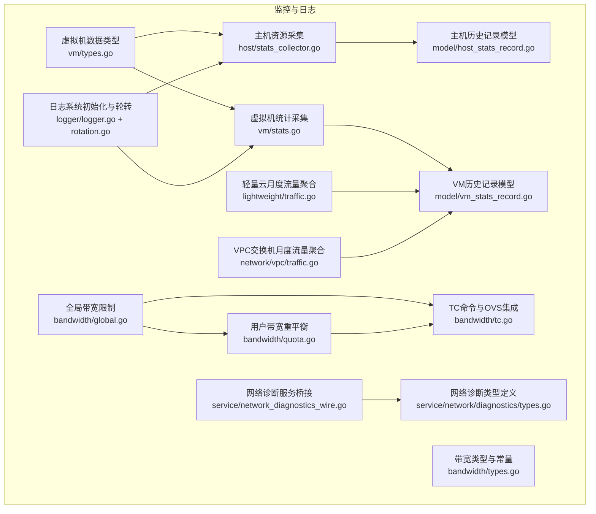
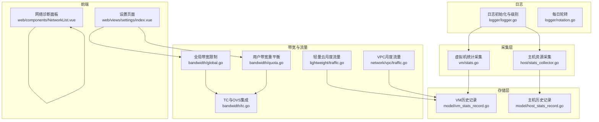
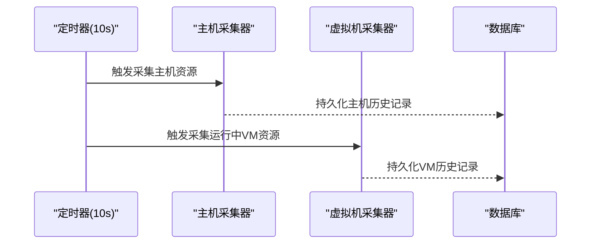
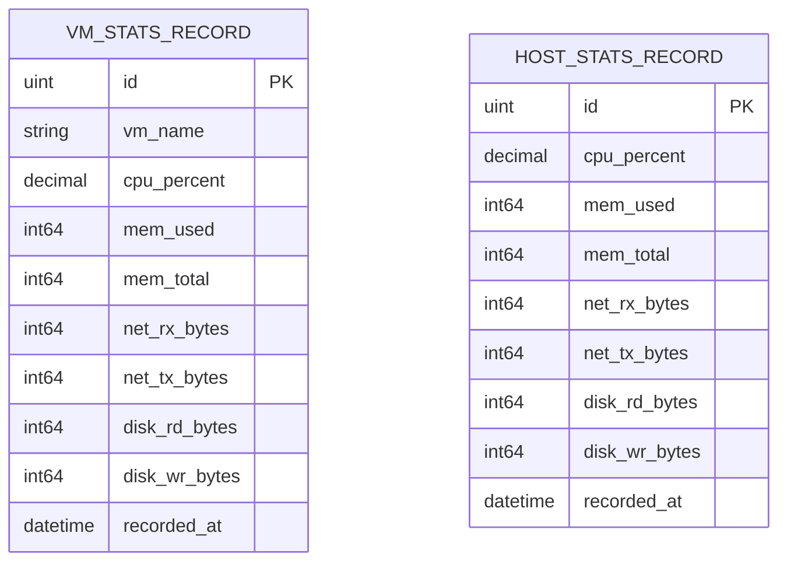
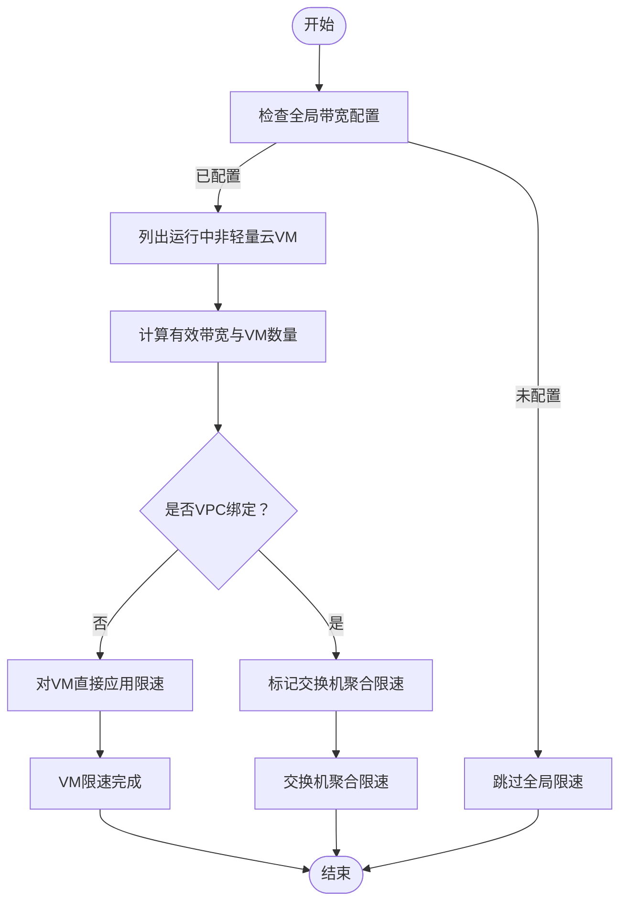
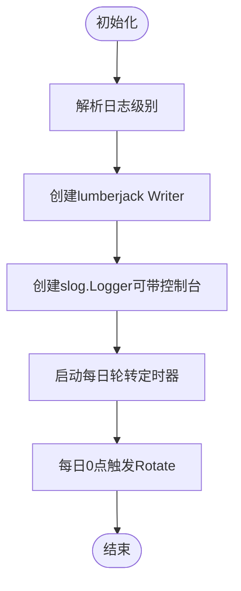
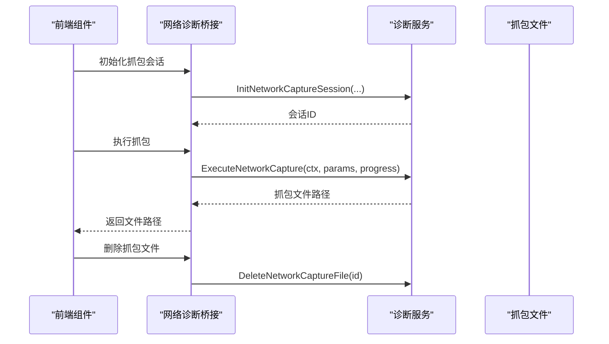
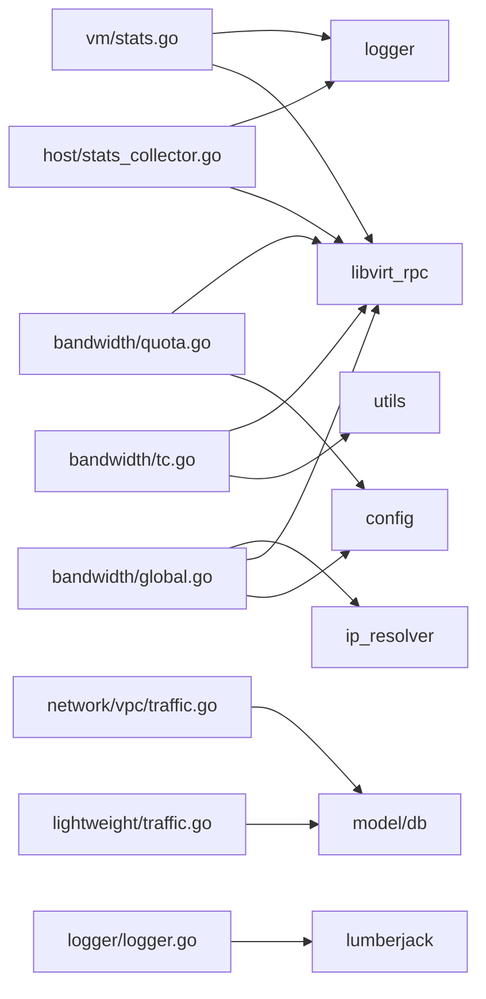

# 系统监控与日志

<cite>
**本文引用的文件**
- [server/service/host/stats_collector.go](file://server/service/host/stats_collector.go)
- [server/service/vm/stats.go](file://server/service/vm/stats.go)
- [server/service/vm/types.go](file://server/service/vm/types.go)
- [server/model/vm_stats_record.go](file://server/model/vm_stats_record.go)
- [server/model/host_stats_record.go](file://server/model/host_stats_record.go)
- [server/service/bandwidth/global.go](file://server/service/bandwidth/global.go)
- [server/service/bandwidth/tc.go](file://server/service/bandwidth/tc.go)
- [server/service/bandwidth/quota.go](file://server/service/bandwidth/quota.go)
- [server/service/bandwidth/types.go](file://server/service/bandwidth/types.go)
- [server/service/lightweight/traffic.go](file://server/service/lightweight/traffic.go)
- [server/service/network/vpc/traffic.go](file://server/service/network/vpc/traffic.go)
- [server/logger/logger.go](file://server/logger/logger.go)
- [server/logger/rotation.go](file://server/logger/rotation.go)
- [server/service/network_diagnostics_wire.go](file://server/service/network_diagnostics_wire.go)
- [server/service/network/diagnostics/types.go](file://server/service/network/diagnostics/types.go)
- [web/src/views/settings/index.vue](file://web/src/views/settings/index.vue)
- [web/src/components/NetworkList.vue](file://web/src/components/NetworkList.vue)
</cite>

## 目录
1. [简介](#简介)
2. [项目结构](#项目结构)
3. [核心组件](#核心组件)
4. [架构总览](#架构总览)
5. [详细组件分析](#详细组件分析)
6. [依赖关系分析](#依赖关系分析)
7. [性能考量](#性能考量)
8. [故障排查指南](#故障排查指南)
9. [结论](#结论)
10. [附录](#附录)

## 简介
本文件面向Open虚拟机管理控制台的系统监控与日志管理，围绕以下目标展开：
- 系统监控指标的采集与分析：主机资源使用率、虚拟机性能统计、网络流量监控
- 日志管理策略：日志级别配置、轮转机制、存储管理
- 性能监控系统：实时监控面板与历史数据分析
- 告警机制：阈值设置、通知渠道与故障处理流程
- 故障诊断工具：网络抓包与诊断能力的使用方法与调试技巧
- 监控配置优化与日志分析最佳实践

## 项目结构
后端采用Go语言实现，监控与日志相关代码主要分布在如下模块：
- 主机与虚拟机资源采集：host/stats_collector.go、vm/stats.go、vm/types.go
- 数据模型：model/vm_stats_record.go、model/host_stats_record.go
- 带宽与流量：bandwidth/global.go、bandwidth/tc.go、bandwidth/quota.go、bandwidth/types.go
- 轻量云与VPC流量聚合：lightweight/traffic.go、network/vpc/traffic.go
- 日志系统：logger/logger.go、logger/rotation.go
- 网络诊断：service/network_diagnostics_wire.go、service/network/diagnostics/types.go
- 前端监控入口：web/src/views/settings/index.vue、web/src/components/NetworkList.vue

**图表来源**
- [server/service/host/stats_collector.go:33-73](file://server/service/host/stats_collector.go#L33-L73)
- [server/service/vm/stats.go:232-264](file://server/service/vm/stats.go#L232-L264)
- [server/service/vm/types.go:110-140](file://server/service/vm/types.go#L110-L140)
- [server/model/vm_stats_record.go:1-20](file://server/model/vm_stats_record.go#L1-L20)
- [server/model/host_stats_record.go:1-17](file://server/model/host_stats_record.go#L1-L17)
- [server/service/bandwidth/global.go:81-153](file://server/service/bandwidth/global.go#L81-L153)
- [server/service/bandwidth/tc.go:188-242](file://server/service/bandwidth/tc.go#L188-L242)
- [server/service/bandwidth/quota.go:30-121](file://server/service/bandwidth/quota.go#L30-L121)
- [server/service/bandwidth/types.go:1-183](file://server/service/bandwidth/types.go#L1-L183)
- [server/service/lightweight/traffic.go:15-43](file://server/service/lightweight/traffic.go#L15-L43)
- [server/service/network/vpc/traffic.go:10-41](file://server/service/network/vpc/traffic.go#L10-L41)
- [server/logger/logger.go:31-84](file://server/logger/logger.go#L31-L84)
- [server/logger/rotation.go:13-50](file://server/logger/rotation.go#L13-L50)
- [server/service/network_diagnostics_wire.go:58-100](file://server/service/network_diagnostics_wire.go#L58-L100)
- [server/service/network/diagnostics/types.go:1-40](file://server/service/network/diagnostics/types.go#L1-L40)

**章节来源**
- [server/service/host/stats_collector.go:33-73](file://server/service/host/stats_collector.go#L33-L73)
- [server/service/vm/stats.go:232-264](file://server/service/vm/stats.go#L232-L264)
- [server/service/vm/types.go:110-140](file://server/service/vm/types.go#L110-L140)
- [server/model/vm_stats_record.go:1-20](file://server/model/vm_stats_record.go#L1-L20)
- [server/model/host_stats_record.go:1-17](file://server/model/host_stats_record.go#L1-L17)
- [server/service/bandwidth/global.go:81-153](file://server/service/bandwidth/global.go#L81-L153)
- [server/service/bandwidth/tc.go:188-242](file://server/service/bandwidth/tc.go#L188-L242)
- [server/service/bandwidth/quota.go:30-121](file://server/service/bandwidth/quota.go#L30-L121)
- [server/service/bandwidth/types.go:1-183](file://server/service/bandwidth/types.go#L1-L183)
- [server/service/lightweight/traffic.go:15-43](file://server/service/lightweight/traffic.go#L15-L43)
- [server/service/network/vpc/traffic.go:10-41](file://server/service/network/vpc/traffic.go#L10-L41)
- [server/logger/logger.go:31-84](file://server/logger/logger.go#L31-L84)
- [server/logger/rotation.go:13-50](file://server/logger/rotation.go#L13-L50)
- [server/service/network_diagnostics_wire.go:58-100](file://server/service/network_diagnostics_wire.go#L58-L100)
- [server/service/network/diagnostics/types.go:1-40](file://server/service/network/diagnostics/types.go#L1-L40)

## 核心组件
- 资源采集与缓存：定时采集主机与运行中虚拟机的CPU、内存、网络、磁盘等指标，缓存于内存并在周期性任务中持久化至数据库。
- 历史数据模型：VM与主机的历史记录模型提供索引与字段约束，支撑历史查询与报表。
- 带宽与流量：全局带宽限制、用户带宽重平衡、TC队列整形与OVS队列/计量器集成，以及轻量云/VPC维度的流量聚合。
- 日志系统：基于slog与lumberjack的日志初始化、级别解析、终端输出控制与每日轮转。
- 网络诊断：前端网络诊断面板与后端诊断服务桥接，支持抓包、模板与过滤。

**章节来源**
- [server/service/host/stats_collector.go:33-73](file://server/service/host/stats_collector.go#L33-L73)
- [server/model/vm_stats_record.go:1-20](file://server/model/vm_stats_record.go#L1-L20)
- [server/model/host_stats_record.go:1-17](file://server/model/host_stats_record.go#L1-L17)
- [server/service/bandwidth/global.go:81-153](file://server/service/bandwidth/global.go#L81-L153)
- [server/service/bandwidth/tc.go:188-242](file://server/service/bandwidth/tc.go#L188-L242)
- [server/service/bandwidth/quota.go:30-121](file://server/service/bandwidth/quota.go#L30-L121)
- [server/logger/logger.go:31-84](file://server/logger/logger.go#L31-L84)
- [server/logger/rotation.go:13-50](file://server/logger/rotation.go#L13-L50)
- [server/service/network_diagnostics_wire.go:58-100](file://server/service/network_diagnostics_wire.go#L58-L100)

## 架构总览
下图展示了监控与日志的关键交互：采集器定时采集、缓存与持久化，带宽服务根据配置与配额动态下发，日志系统统一输出与轮转，前端通过设置页面与网络诊断组件进行可视化与操作。

**图表来源**
- [server/service/host/stats_collector.go:33-73](file://server/service/host/stats_collector.go#L33-L73)
- [server/service/vm/stats.go:232-264](file://server/service/vm/stats.go#L232-L264)
- [server/model/vm_stats_record.go:1-20](file://server/model/vm_stats_record.go#L1-L20)
- [server/model/host_stats_record.go:1-17](file://server/model/host_stats_record.go#L1-L17)
- [server/service/bandwidth/global.go:81-153](file://server/service/bandwidth/global.go#L81-L153)
- [server/service/bandwidth/quota.go:30-121](file://server/service/bandwidth/quota.go#L30-L121)
- [server/service/bandwidth/tc.go:188-242](file://server/service/bandwidth/tc.go#L188-L242)
- [server/service/lightweight/traffic.go:15-43](file://server/service/lightweight/traffic.go#L15-L43)
- [server/service/network/vpc/traffic.go:10-41](file://server/service/network/vpc/traffic.go#L10-L41)
- [server/logger/logger.go:31-84](file://server/logger/logger.go#L31-L84)
- [server/logger/rotation.go:13-50](file://server/logger/rotation.go#L13-L50)
- [web/src/views/settings/index.vue:1149-1167](file://web/src/views/settings/index.vue#L1149-L1167)
- [web/src/components/NetworkList.vue:345-367](file://web/src/components/NetworkList.vue#L345-L367)

## 详细组件分析

### 资源采集与缓存（主机与虚拟机）
- 采集频率与节奏：每10秒采集一次运行中虚拟机与宿主机资源，每60秒将缓存快照持久化到数据库。
- 采集内容：
  - 虚拟机：CPU使用率（基于两次采样差值）、内存使用、网络接口收发字节、磁盘读写字节。
  - 宿主机：CPU使用率、内存总量/可用/使用、交换分区、磁盘读写、网络收发字节。
- 缓存与持久化：内存缓存用于列表接口快速读取，数据库记录用于历史查询与报表。
- 历史查询：提供按时间段查询VM与主机历史记录的接口。

**图表来源**
- [server/service/host/stats_collector.go:33-73](file://server/service/host/stats_collector.go#L33-L73)
- [server/service/host/stats_collector.go:259-306](file://server/service/host/stats_collector.go#L259-L306)
- [server/service/vm/stats.go:232-264](file://server/service/vm/stats.go#L232-L264)

**章节来源**
- [server/service/host/stats_collector.go:33-73](file://server/service/host/stats_collector.go#L33-L73)
- [server/service/host/stats_collector.go:259-306](file://server/service/host/stats_collector.go#L259-L306)
- [server/service/vm/stats.go:232-264](file://server/service/vm/stats.go#L232-L264)

### 数据模型（历史记录）
- VM历史记录：包含VM名称、CPU使用率、内存使用/总量、网络收发字节、磁盘读写字节、记录时间（带索引）。
- 主机历史记录：包含CPU使用率、内存使用/总量、网络收发字节、磁盘读写字节、记录时间（带索引）。

**图表来源**
- [server/model/vm_stats_record.go:1-20](file://server/model/vm_stats_record.go#L1-L20)
- [server/model/host_stats_record.go:1-17](file://server/model/host_stats_record.go#L1-L17)

**章节来源**
- [server/model/vm_stats_record.go:1-20](file://server/model/vm_stats_record.go#L1-L20)
- [server/model/host_stats_record.go:1-17](file://server/model/host_stats_record.go#L1-L17)

### 带宽与流量管理
- 全局带宽限制：根据系统配置计算有效带宽，对非轻量云VM直接应用限速，VPC VM由交换机聚合限速。
- 用户带宽重平衡：按用户配额与VM数量均分average，peak保持用户配额，burst按系统或配额上限计算；若用户流量超限，则应用惩罚速率。
- TC与OVS集成：在非OVS环境下，下行通过tc qdisc兜底；运行态在OVS网络下通过队列/计量器实现更稳定限速。
- 流量聚合：轻量云与VPC维度提供月度流量聚合，支持偏移与Clamp处理。

**图表来源**
- [server/service/bandwidth/global.go:81-153](file://server/service/bandwidth/global.go#L81-L153)
- [server/service/bandwidth/tc.go:188-242](file://server/service/bandwidth/tc.go#L188-L242)
- [server/service/bandwidth/quota.go:30-121](file://server/service/bandwidth/quota.go#L30-L121)

**章节来源**
- [server/service/bandwidth/global.go:81-153](file://server/service/bandwidth/global.go#L81-L153)
- [server/service/bandwidth/tc.go:188-242](file://server/service/bandwidth/tc.go#L188-L242)
- [server/service/bandwidth/quota.go:30-121](file://server/service/bandwidth/quota.go#L30-L121)
- [server/service/bandwidth/types.go:1-183](file://server/service/bandwidth/types.go#L1-L183)

### 日志系统与轮转
- 初始化：支持按级别（debug/info/warn/error）与终端输出类型（app/request/cmd/libvirt）配置，可分别设置文件与控制台级别。
- 存储：每个日志类别独立文件，使用lumberjack进行大小/天数/备份数/压缩控制。
- 轮转：每日凌晨0点触发轮转，支持优雅关闭与定时器停止。

**图表来源**
- [server/logger/logger.go:31-84](file://server/logger/logger.go#L31-L84)
- [server/logger/logger.go:98-126](file://server/logger/logger.go#L98-L126)
- [server/logger/rotation.go:13-50](file://server/logger/rotation.go#L13-L50)

**章节来源**
- [server/logger/logger.go:31-84](file://server/logger/logger.go#L31-L84)
- [server/logger/logger.go:98-126](file://server/logger/logger.go#L98-L126)
- [server/logger/logger.go:133-170](file://server/logger/logger.go#L133-L170)
- [server/logger/logger.go:196-210](file://server/logger/logger.go#L196-L210)
- [server/logger/rotation.go:13-50](file://server/logger/rotation.go#L13-L50)

### 网络诊断与抓包
- 类型定义：包含过滤条件、抓包请求、模板与诊断结果结构。
- 服务桥接：前端通过API调用后端诊断服务，支持初始化会话、执行抓包、查询进度与删除文件。
- 前端面板：提供网络诊断标签页，显示默认接口/IP、状态、端口转发条目与诊断状态提示。

**图表来源**
- [server/service/network_diagnostics_wire.go:58-100](file://server/service/network_diagnostics_wire.go#L58-L100)
- [server/service/network/diagnostics/types.go:1-40](file://server/service/network/diagnostics/types.go#L1-L40)
- [web/src/components/NetworkList.vue:345-367](file://web/src/components/NetworkList.vue#L345-L367)

**章节来源**
- [server/service/network_diagnostics_wire.go:58-100](file://server/service/network_diagnostics_wire.go#L58-L100)
- [server/service/network/diagnostics/types.go:1-40](file://server/service/network/diagnostics/types.go#L1-L40)
- [web/src/components/NetworkList.vue:345-367](file://web/src/components/NetworkList.vue#L345-L367)

## 依赖关系分析
- 采集器依赖libvirt RPC获取运行中VM列表与统计，依赖lumberjack输出日志。
- 带宽服务依赖配置、IP解析、libvirt RPC与utils执行tc命令。
- 流量聚合依赖数据库VM统计记录与时间窗口计算。
- 日志系统依赖lumberjack与slog，提供统一级别与多输出能力。

**图表来源**
- [server/service/host/stats_collector.go:1-15](file://server/service/host/stats_collector.go#L1-L15)
- [server/service/vm/stats.go:1-15](file://server/service/vm/stats.go#L1-L15)
- [server/service/bandwidth/global.go:1-14](file://server/service/bandwidth/global.go#L1-L14)
- [server/service/bandwidth/quota.go:1-10](file://server/service/bandwidth/quota.go#L1-L10)
- [server/service/bandwidth/tc.go:1-12](file://server/service/bandwidth/tc.go#L1-L12)
- [server/service/lightweight/traffic.go:1-13](file://server/service/lightweight/traffic.go#L1-L13)
- [server/service/network/vpc/traffic.go:1-8](file://server/service/network/vpc/traffic.go#L1-L8)
- [server/logger/logger.go:1-12](file://server/logger/logger.go#L1-L12)

**章节来源**
- [server/service/host/stats_collector.go:1-15](file://server/service/host/stats_collector.go#L1-L15)
- [server/service/vm/stats.go:1-15](file://server/service/vm/stats.go#L1-L15)
- [server/service/bandwidth/global.go:1-14](file://server/service/bandwidth/global.go#L1-L14)
- [server/service/bandwidth/quota.go:1-10](file://server/service/bandwidth/quota.go#L1-L10)
- [server/service/bandwidth/tc.go:1-12](file://server/service/bandwidth/tc.go#L1-L12)
- [server/service/lightweight/traffic.go:1-13](file://server/service/lightweight/traffic.go#L1-L13)
- [server/service/network/vpc/traffic.go:1-8](file://server/service/network/vpc/traffic.go#L1-L8)
- [server/logger/logger.go:1-12](file://server/logger/logger.go#L1-L12)

## 性能考量
- 采集频率权衡：10秒采集一次兼顾实时性与开销；建议在高密度VM场景适当增大间隔或启用维护模式减少干扰。
- 内存缓存命中：列表接口直接读取内存缓存，避免频繁数据库查询；注意缓存清理与持久化时机。
- 带宽下发策略：非OVS环境下行tc兜底，OVS环境通过队列/计量器稳定限速；惩罚速率避免超配额VM影响整体网络。
- 日志吞吐：lumberjack按大小/天数轮转，合理设置备份数与压缩可控制磁盘占用。

[本节为通用指导，不直接分析具体文件]

## 故障排查指南
- 采集失败
  - 检查libvirt连接状态与权限，确认运行中VM列表获取成功。
  - 查看采集器日志中的错误与警告，定位具体VM或接口统计失败原因。
- 带宽不生效
  - 非OVS网络：确认下行tc qdisc已正确添加；检查IFB接口与队列配置。
  - OVS网络：确认队列/计量器下发成功，必要时清理旧流表后重刷配置。
- 日志异常
  - 检查日志目录权限与磁盘空间；确认轮转定时器正常运行。
  - 若出现级别不一致，检查文件与控制台级别的独立配置。
- 网络诊断
  - 前端“网络诊断”标签页显示诊断状态与建议；抓包完成后检查文件是否存在与可下载。

**章节来源**
- [server/service/host/stats_collector.go:89-124](file://server/service/host/stats_collector.go#L89-L124)
- [server/service/bandwidth/tc.go:188-242](file://server/service/bandwidth/tc.go#L188-L242)
- [server/logger/logger.go:31-84](file://server/logger/logger.go#L31-L84)
- [server/logger/rotation.go:13-50](file://server/logger/rotation.go#L13-L50)
- [web/src/components/NetworkList.vue:345-367](file://web/src/components/NetworkList.vue#L345-L367)

## 结论
本系统通过定时采集、内存缓存与数据库持久化实现了主机与虚拟机的资源监控；结合全局与用户级带宽策略，提供了灵活稳定的流量治理能力；日志系统支持多类别、多级别与每日轮转，满足运维与审计需求；网络诊断组件为问题定位提供了直观工具。建议在生产环境中根据负载调整采集频率、优化带宽策略与日志配置，并建立完善的监控告警与应急预案。

[本节为总结性内容，不直接分析具体文件]

## 附录
- 监控配置入口（前端设置页面）：包含SMTP、JWT密钥轮换、日志备份数等系统级配置项。
- 网络诊断面板：提供刷新诊断、状态提示与诊断摘要，便于快速定位网络问题。

**章节来源**
- [web/src/views/settings/index.vue:1149-1167](file://web/src/views/settings/index.vue#L1149-L1167)
- [web/src/components/NetworkList.vue:345-367](file://web/src/components/NetworkList.vue#L345-L367)