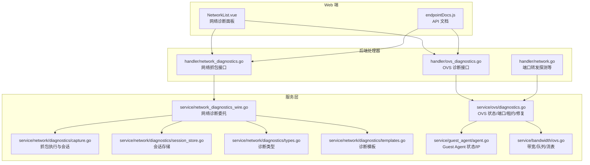
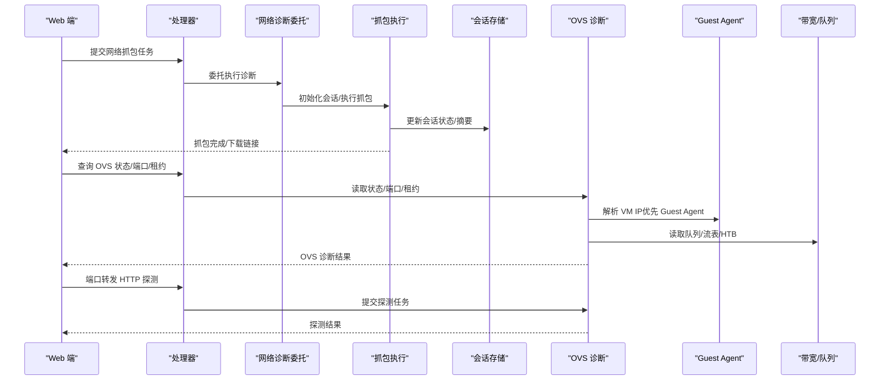
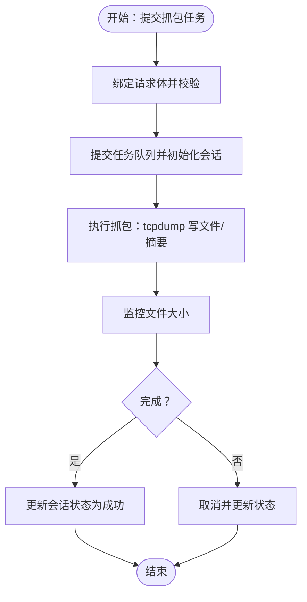
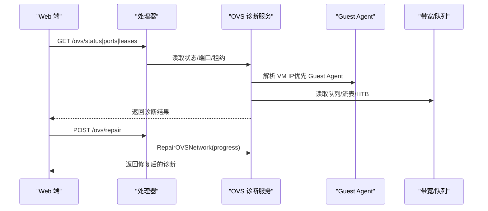
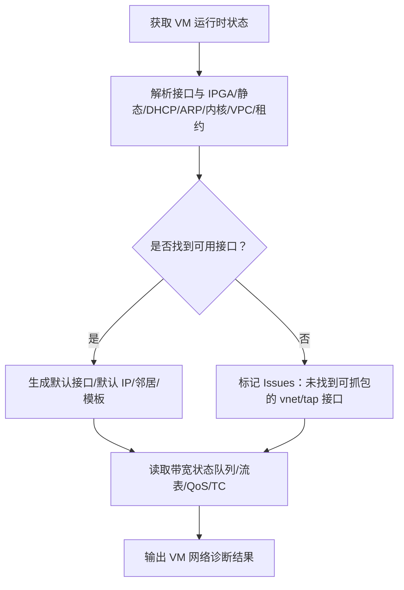
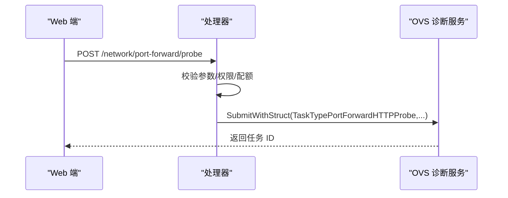
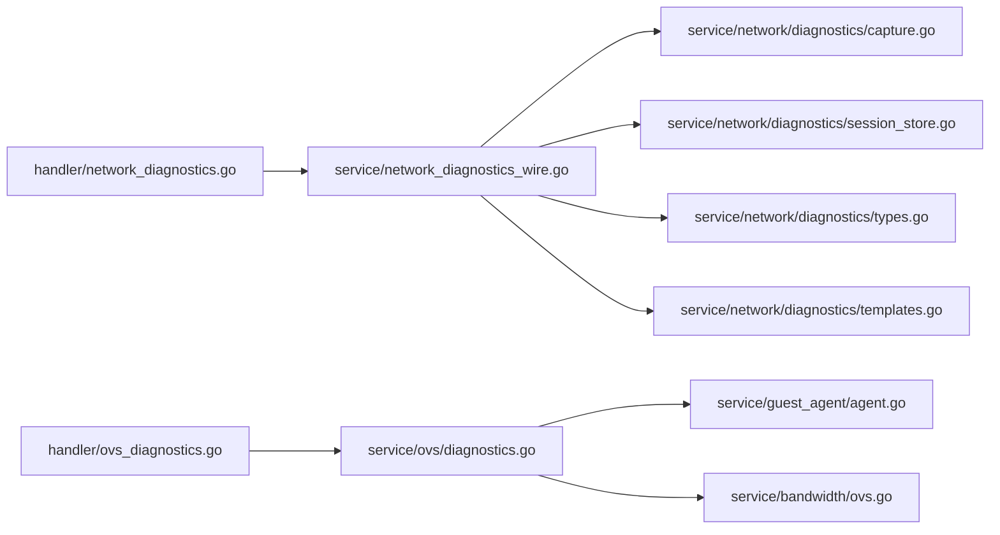

# 诊断工具

<cite>
**本文档引用的文件**
- [server/handler/network_diagnostics.go](file://server/handler/network_diagnostics.go)
- [server/handler/ovs_diagnostics.go](file://server/handler/ovs_diagnostics.go)
- [server/service/network/diagnostics/capture.go](file://server/service/network/diagnostics/capture.go)
- [server/service/network/diagnostics/session_store.go](file://server/service/network/diagnostics/session_store.go)
- [server/service/network/diagnostics/types.go](file://server/service/network/diagnostics/types.go)
- [server/service/network/diagnostics/templates.go](file://server/service/network/diagnostics/templates.go)
- [server/service/network_diagnostics_wire.go](file://server/service/network_diagnostics_wire.go)
- [server/service/ovs/diagnostics.go](file://server/service/ovs/diagnostics.go)
- [server/service/guest_agent/agent.go](file://server/service/guest_agent/agent.go)
- [server/service/bandwidth/ovs.go](file://server/service/bandwidth/ovs.go)
- [server/handler/network.go](file://server/handler/network.go)
- [web/src/views/api-docs/endpointDocs.js](file://web/src/views/api-docs/endpointDocs.js)
- [web/src/components/NetworkList.vue](file://web/src/components/NetworkList.vue)
</cite>

## 目录
1. [简介](#简介)
2. [项目结构](#项目结构)
3. [核心组件](#核心组件)
4. [架构总览](#架构总览)
5. [详细组件分析](#详细组件分析)
6. [依赖分析](#依赖分析)
7. [性能考虑](#性能考虑)
8. [故障排查指南](#故障排查指南)
9. [结论](#结论)
10. [附录](#附录)

## 简介
本文件面向 Open 虚拟机管理控制台的诊断工具，聚焦以下能力：
- 网络诊断：连通性测试、延迟测量、带宽检测
- OVS 网络诊断：交换机状态检查、端口监控、流量分析
- 虚拟机诊断：Guest Agent 通信检测、系统健康检查、性能问题定位
- 诊断数据采集与分析：日志提取、配置验证、错误追踪
- 诊断工具 API 与自动化集成方案
- 常见问题的诊断流程与解决方案

## 项目结构
诊断工具由“处理器层（Handler）+ 服务层（Service）+ 类型与工具（Types/Helpers）”构成，并通过 Web 端进行可视化展示与触发。

图示来源
- [server/handler/network_diagnostics.go:1-99](file://server/handler/network_diagnostics.go#L1-L99)
- [server/handler/ovs_diagnostics.go:1-70](file://server/handler/ovs_diagnostics.go#L1-L70)
- [server/service/network_diagnostics_wire.go:36-100](file://server/service/network_diagnostics_wire.go#L36-L100)
- [server/service/network/diagnostics/capture.go:1-267](file://server/service/network/diagnostics/capture.go#L1-L267)
- [server/service/network/diagnostics/session_store.go:1-106](file://server/service/network/diagnostics/session_store.go#L1-L106)
- [server/service/network/diagnostics/types.go:1-115](file://server/service/network/diagnostics/types.go#L1-L115)
- [server/service/network/diagnostics/templates.go:1-42](file://server/service/network/diagnostics/templates.go#L1-L42)
- [server/service/ovs/diagnostics.go:1-707](file://server/service/ovs/diagnostics.go#L1-L707)
- [server/service/guest_agent/agent.go:1-209](file://server/service/guest_agent/agent.go#L1-L209)
- [server/service/bandwidth/ovs.go:1-358](file://server/service/bandwidth/ovs.go#L1-L358)
- [web/src/views/api-docs/endpointDocs.js:401-415](file://web/src/views/api-docs/endpointDocs.js#L401-L415)
- [web/src/components/NetworkList.vue:345-367](file://web/src/components/NetworkList.vue#L345-L367)

章节来源
- [server/handler/network_diagnostics.go:1-99](file://server/handler/network_diagnostics.go#L1-L99)
- [server/handler/ovs_diagnostics.go:1-70](file://server/handler/ovs_diagnostics.go#L1-L70)
- [server/service/network_diagnostics_wire.go:36-100](file://server/service/network_diagnostics_wire.go#L36-L100)
- [server/service/network/diagnostics/capture.go:1-267](file://server/service/network/diagnostics/capture.go#L1-L267)
- [server/service/network/diagnostics/session_store.go:1-106](file://server/service/network/diagnostics/session_store.go#L1-L106)
- [server/service/network/diagnostics/types.go:1-115](file://server/service/network/diagnostics/types.go#L1-L115)
- [server/service/network/diagnostics/templates.go:1-42](file://server/service/network/diagnostics/templates.go#L1-L42)
- [server/service/ovs/diagnostics.go:1-707](file://server/service/ovs/diagnostics.go#L1-L707)
- [server/service/guest_agent/agent.go:1-209](file://server/service/guest_agent/agent.go#L1-L209)
- [server/service/bandwidth/ovs.go:1-358](file://server/service/bandwidth/ovs.go#L1-L358)
- [web/src/views/api-docs/endpointDocs.js:401-415](file://web/src/views/api-docs/endpointDocs.js#L401-L415)
- [web/src/components/NetworkList.vue:345-367](file://web/src/components/NetworkList.vue#L345-L367)

## 核心组件
- 网络抓包与会话管理：提供抓包任务提交、进度回调、会话查询、文件下载与删除。
- OVS 诊断与修复：提供 OVS 状态、端口、DHCP 租约检查，以及一键修复流程。
- 虚拟机网络诊断：聚合 VM 运行时状态、接口、IP 来源、带宽状态与诊断模板。
- Guest Agent 诊断：检测 Guest Agent 配置与连通性，获取 VM 网络接口 IP。
- 带宽与队列诊断：读取 OVS 队列、HTB、POLICE 等配置，判断限速生效情况。
- 端口转发探测：对 VM 的端口转发规则进行 HTTP 探测，辅助连通性验证。

章节来源
- [server/service/network/diagnostics/capture.go:17-188](file://server/service/network/diagnostics/capture.go#L17-L188)
- [server/service/network/diagnostics/session_store.go:11-106](file://server/service/network/diagnostics/session_store.go#L11-L106)
- [server/service/ovs/diagnostics.go:20-189](file://server/service/ovs/diagnostics.go#L20-L189)
- [server/service/network_diagnostics_wire.go:58-96](file://server/service/network_diagnostics_wire.go#L58-L96)
- [server/service/guest_agent/agent.go:62-106](file://server/service/guest_agent/agent.go#L62-L106)
- [server/service/bandwidth/ovs.go:18-358](file://server/service/bandwidth/ovs.go#L18-L358)
- [server/handler/network.go:622-672](file://server/handler/network.go#L622-L672)

## 架构总览
下图展示了“Web 端 -> 处理器 -> 服务层”的调用链路，以及关键数据结构之间的关系。

图示来源
- [server/handler/network_diagnostics.go:23-51](file://server/handler/network_diagnostics.go#L23-L51)
- [server/service/network_diagnostics_wire.go:58-96](file://server/service/network_diagnostics_wire.go#L58-L96)
- [server/service/network/diagnostics/capture.go:90-188](file://server/service/network/diagnostics/capture.go#L90-L188)
- [server/service/network/diagnostics/session_store.go:18-90](file://server/service/network/diagnostics/session_store.go#L18-L90)
- [server/service/ovs/diagnostics.go:191-259](file://server/service/ovs/diagnostics.go#L191-L259)
- [server/service/guest_agent/agent.go:108-188](file://server/service/guest_agent/agent.go#L108-L188)
- [server/service/bandwidth/ovs.go:632-673](file://server/service/bandwidth/ovs.go#L632-L673)
- [server/handler/network.go:622-672](file://server/handler/network.go#L622-L672)

## 详细组件分析

### 网络诊断组件
- 功能要点
  - 抓包任务提交：校验高风险操作，绑定请求体，提交任务队列，初始化会话。
  - 会话查询：并发安全地读取抓包会话，包含摘要行、文件大小等。
  - 文件管理：删除抓包文件、生成下载路径。
  - 诊断模板：内置 ARP/DHCP/DNS 模板，以及基于 VM 默认 IP 与端口转发规则的模板。
- 关键流程
  - 抓包执行：校验 tcpdump 可用性，构建 BPF 过滤，多协程并行写 pcap 与生成摘要，监控文件大小，更新状态。
  - 会话存储：内存中维护会话表，定期清理过期会话，自动删除旧文件。

图示来源
- [server/handler/network_diagnostics.go:23-51](file://server/handler/network_diagnostics.go#L23-L51)
- [server/service/network/diagnostics/capture.go:90-188](file://server/service/network/diagnostics/capture.go#L90-L188)
- [server/service/network/diagnostics/session_store.go:18-90](file://server/service/network/diagnostics/session_store.go#L18-L90)

章节来源
- [server/handler/network_diagnostics.go:14-99](file://server/handler/network_diagnostics.go#L14-L99)
- [server/service/network/diagnostics/capture.go:17-188](file://server/service/network/diagnostics/capture.go#L17-L188)
- [server/service/network/diagnostics/session_store.go:11-106](file://server/service/network/diagnostics/session_store.go#L11-L106)
- [server/service/network/diagnostics/templates.go:9-42](file://server/service/network/diagnostics/templates.go#L9-L42)
- [server/service/network_diagnostics_wire.go:58-96](file://server/service/network_diagnostics_wire.go#L58-L96)

### OVS 诊断组件
- 功能要点
  - OVS 状态：网桥存在性、网关 IP、服务状态、内核转发、NAT/FORWARD 规则。
  - 端口列表：解析 ofctl 输出，关联 VM 运行时接口、静态绑定、DHCP 租约，标注异常。
  - 租约冲突：检测静态 IP 与 DHCP 租约冲突。
  - 修复建议：基于状态生成修复建议，支持一键修复流程。
  - VM 运行时状态：读取 VM 状态、接口、IP 来源、带宽状态。
- 关键流程
  - 修复流程：前置检查、逐步修复、刷新诊断状态、返回结果。

图示来源
- [server/handler/ovs_diagnostics.go:13-69](file://server/handler/ovs_diagnostics.go#L13-L69)
- [server/service/ovs/diagnostics.go:20-189](file://server/service/ovs/diagnostics.go#L20-L189)
- [server/service/guest_agent/agent.go:525-561](file://server/service/guest_agent/agent.go#L525-L561)
- [server/service/bandwidth/ovs.go:632-673](file://server/service/bandwidth/ovs.go#L632-L673)

章节来源
- [server/handler/ovs_diagnostics.go:13-70](file://server/handler/ovs_diagnostics.go#L13-L70)
- [server/service/ovs/diagnostics.go:20-189](file://server/service/ovs/diagnostics.go#L20-L189)
- [server/service/guest_agent/agent.go:525-561](file://server/service/guest_agent/agent.go#L525-L561)
- [server/service/bandwidth/ovs.go:632-673](file://server/service/bandwidth/ovs.go#L632-L673)

### 虚拟机诊断组件
- 功能要点
  - VM 网络诊断：聚合运行时状态、接口、Issues、默认接口与 IP、邻居、端口转发规则、诊断模板。
  - Guest Agent 诊断：检测配置与连通性，获取 VM IP（优先 Guest Agent，其次静态绑定、DHCP、ARP、内核邻居、VPC DHCP、libvirt 租约）。
  - 带宽状态：读取 Cookie、队列 ID、QoS/HTB/INGRESS/POLICE 等，判断限速是否生效。
- 关键流程
  - IP 解析：按优先级链路解析，保证准确性与时效性。
  - 带宽判定：综合 OVS 流表、QoS、队列、TC 等指标判断。

图示来源
- [server/service/network_diagnostics_wire.go:58-61](file://server/service/network_diagnostics_wire.go#L58-L61)
- [server/service/network/diagnostics/capture.go:17-36](file://server/service/network/diagnostics/capture.go#L17-L36)
- [server/service/guest_agent/agent.go:525-561](file://server/service/guest_agent/agent.go#L525-L561)
- [server/service/bandwidth/ovs.go:632-673](file://server/service/bandwidth/ovs.go#L632-L673)

章节来源
- [server/service/network_diagnostics_wire.go:58-61](file://server/service/network_diagnostics_wire.go#L58-L61)
- [server/service/network/diagnostics/capture.go:5-36](file://server/service/network/diagnostics/capture.go#L5-L36)
- [server/service/guest_agent/agent.go:525-561](file://server/service/guest_agent/agent.go#L525-L561)
- [server/service/bandwidth/ovs.go:632-673](file://server/service/bandwidth/ovs.go#L632-L673)

### 端口转发探测组件
- 功能要点
  - 提交端口转发 HTTP 探测任务，支持按 VM 或全局执行。
  - 结合安全组策略与用户配额进行权限与配额校验。
- 关键流程
  - 参数校验 -> 权限校验 -> 提交任务 -> 返回任务 ID。

图示来源
- [server/handler/network.go:622-672](file://server/handler/network.go#L622-L672)

章节来源
- [server/handler/network.go:622-672](file://server/handler/network.go#L622-L672)

## 依赖分析
- 组件耦合
  - 处理器仅负责参数绑定、鉴权与任务提交，具体逻辑委托给服务层，保持高内聚低耦合。
  - 服务层内部通过 Hook/工具函数解耦命令执行、IP 解析、带宽读取等模块。
- 外部依赖
  - 命令行工具：tcpdump、ovs-vsctl、ovs-ofctl、iptables、ip、tc、virsh、systemctl 等。
  - 数据库与模型：用于持久化端口转发、静态绑定等配置。
- 循环依赖
  - 通过 wire 层进行类型别名与委托，避免直接跨包导入导致的循环依赖。

图示来源
- [server/handler/network_diagnostics.go:1-99](file://server/handler/network_diagnostics.go#L1-L99)
- [server/handler/ovs_diagnostics.go:1-70](file://server/handler/ovs_diagnostics.go#L1-L70)
- [server/service/network_diagnostics_wire.go:36-100](file://server/service/network_diagnostics_wire.go#L36-L100)
- [server/service/network/diagnostics/capture.go:1-267](file://server/service/network/diagnostics/capture.go#L1-L267)
- [server/service/network/diagnostics/session_store.go:1-106](file://server/service/network/diagnostics/session_store.go#L1-L106)
- [server/service/network/diagnostics/types.go:1-115](file://server/service/network/diagnostics/types.go#L1-L115)
- [server/service/network/diagnostics/templates.go:1-42](file://server/service/network/diagnostics/templates.go#L1-L42)
- [server/service/ovs/diagnostics.go:1-707](file://server/service/ovs/diagnostics.go#L1-L707)
- [server/service/guest_agent/agent.go:1-209](file://server/service/guest_agent/agent.go#L1-L209)
- [server/service/bandwidth/ovs.go:1-358](file://server/service/bandwidth/ovs.go#L1-L358)

章节来源
- [server/service/network_diagnostics_wire.go:36-100](file://server/service/network_diagnostics_wire.go#L36-L100)
- [server/service/ovs/diagnostics.go:1-707](file://server/service/ovs/diagnostics.go#L1-L707)

## 性能考虑
- 抓包并发：同时运行 tcpdump 写文件与摘要输出，减少串行等待时间。
- 文件大小监控：按秒轮询抓包文件大小，达到阈值自动停止，避免磁盘压力过大。
- 会话内存管理：定期清理过期会话，避免内存泄漏。
- 命令执行优化：对重复命令结果进行缓存与复用，降低系统调用开销。
- 带宽判定：优先读取 OVS 流表与队列状态，快速判断限速是否生效。

## 故障排查指南
- 网络抓包
  - 现象：抓包任务失败或未生成 pcap。
  - 排查：确认 tcpdump 是否安装；检查会话状态与错误消息；确认接口名与 BPF 过滤是否合法。
  - 参考
    - [server/service/network/diagnostics/capture.go:90-110](file://server/service/network/diagnostics/capture.go#L90-L110)
    - [server/service/network/diagnostics/capture.go:192-203](file://server/service/network/diagnostics/capture.go#L192-L203)
- OVS 状态
  - 现象：网桥不存在、服务未运行、NAT/FORWARD 规则缺失。
  - 排查：检查 openvswitch-switch 与 dnsmasq 服务状态；核对网桥与网关 IP；确认内核转发开启。
  - 参考
    - [server/service/ovs/diagnostics.go:20-98](file://server/service/ovs/diagnostics.go#L20-L98)
- 端口异常
  - 现象：ofport 为 -1、未关联 VM、未找到 IP。
  - 排查：核对端口类型与 VM 绑定；检查静态绑定与 DHCP 租约；确认 Guest Agent 可用。
  - 参考
    - [server/service/ovs/diagnostics.go:408-462](file://server/service/ovs/diagnostics.go#L408-L462)
- 带宽限速
  - 现象：限速未生效或流量异常。
  - 排查：检查队列/HTB/INGRESS/POLICE 是否配置；核对 OVS 流表中 Cookie；确认 VM vnet 口 ofport。
  - 参考
    - [server/service/bandwidth/ovs.go:632-673](file://server/service/bandwidth/ovs.go#L632-L673)
- Guest Agent
  - 现象：无法获取 VM IP 或状态异常。
  - 排查：确认 XML 中是否配置 org.qemu.guest_agent.0；检查 qemu-agent-command 可用性；确认 VM 已安装并运行 Guest Agent。
  - 参考
    - [server/service/guest_agent/agent.go:62-106](file://server/service/guest_agent/agent.go#L62-L106)

章节来源
- [server/service/network/diagnostics/capture.go:90-110](file://server/service/network/diagnostics/capture.go#L90-L110)
- [server/service/network/diagnostics/capture.go:192-203](file://server/service/network/diagnostics/capture.go#L192-L203)
- [server/service/ovs/diagnostics.go:20-98](file://server/service/ovs/diagnostics.go#L20-L98)
- [server/service/ovs/diagnostics.go:408-462](file://server/service/ovs/diagnostics.go#L408-L462)
- [server/service/bandwidth/ovs.go:632-673](file://server/service/bandwidth/ovs.go#L632-L673)
- [server/service/guest_agent/agent.go:62-106](file://server/service/guest_agent/agent.go#L62-L106)

## 结论
本诊断工具以“处理器 + 委托 + 服务层”的分层设计，覆盖网络抓包、OVS 诊断、Guest Agent 与带宽状态等关键场景。通过 Web 端直观呈现诊断结果与模板，结合任务队列与会话存储，实现可追溯、可扩展的诊断能力。建议在生产环境中配合日志与告警体系，持续监控网络与带宽状态，提升问题定位效率。

## 附录

### API 接口与自动化集成
- 网络抓包
  - 提交抓包任务：POST /api/network/vms/{name}/captures
  - 查询会话：GET /api/network/captures/{task_id}
  - 下载文件：GET /api/network/captures/{task_id}/download
  - 删除文件：DELETE /api/network/captures/{task_id}
  - 参考
    - [server/handler/network_diagnostics.go:23-99](file://server/handler/network_diagnostics.go#L23-L99)
- OVS 诊断
  - 读取状态：GET /api/ovs/status
  - 读取端口：GET /api/ovs/ports
  - 读取租约：GET /api/ovs/leases
  - 检查网络：GET /api/ovs/check
  - 修复网络：POST /api/ovs/repair
  - VM 运行时状态：GET /api/ovs/vms/{name}/runtime
  - 参考
    - [server/handler/ovs_diagnostics.go:13-70](file://server/handler/ovs_diagnostics.go#L13-L70)
    - [web/src/views/api-docs/endpointDocs.js:411-415](file://web/src/views/api-docs/endpointDocs.js#L411-L415)
- 端口转发探测
  - 提交探测：POST /api/network/port-forward/probe
  - 参考
    - [server/handler/network.go:622-672](file://server/handler/network.go#L622-L672)
- Web 端集成
  - 网络诊断面板：NetworkList.vue
  - 参考
    - [web/src/components/NetworkList.vue:345-367](file://web/src/components/NetworkList.vue#L345-L367)

章节来源
- [server/handler/network_diagnostics.go:23-99](file://server/handler/network_diagnostics.go#L23-L99)
- [server/handler/ovs_diagnostics.go:13-70](file://server/handler/ovs_diagnostics.go#L13-L70)
- [server/handler/network.go:622-672](file://server/handler/network.go#L622-L672)
- [web/src/views/api-docs/endpointDocs.js:411-415](file://web/src/views/api-docs/endpointDocs.js#L411-L415)
- [web/src/components/NetworkList.vue:345-367](file://web/src/components/NetworkList.vue#L345-L367)