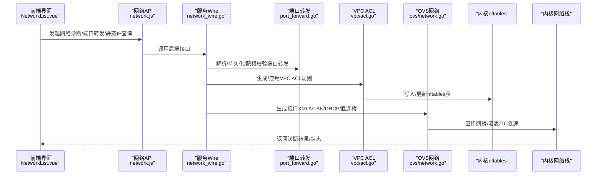
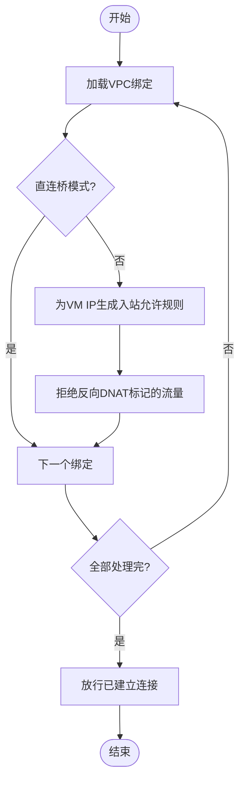
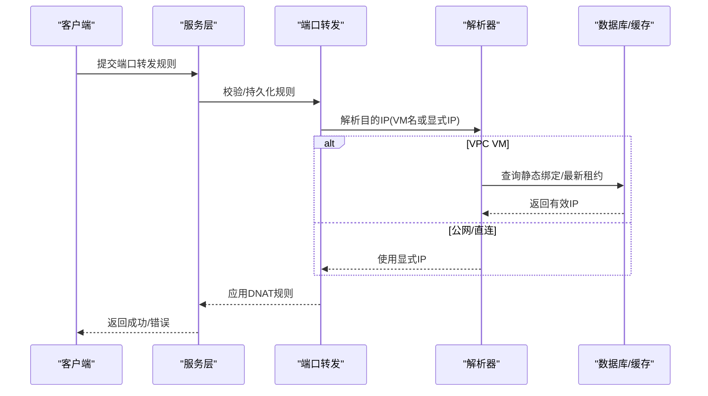
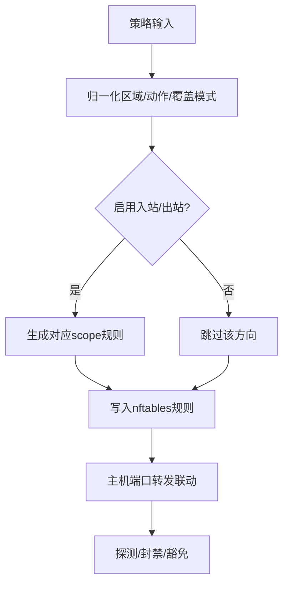
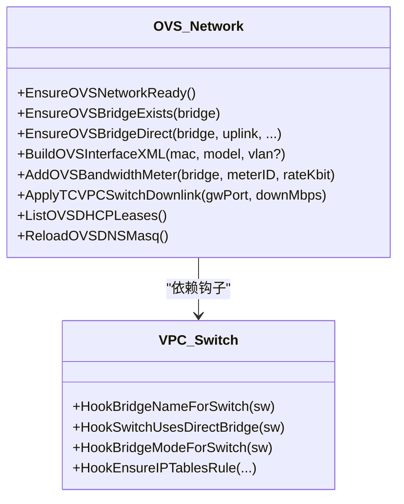
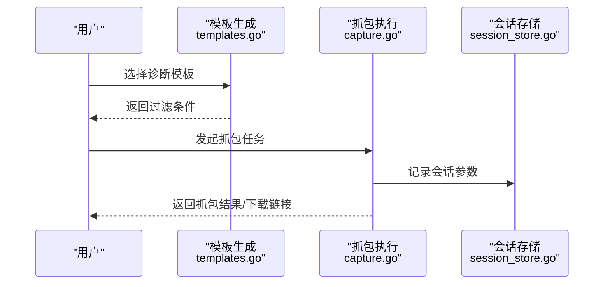
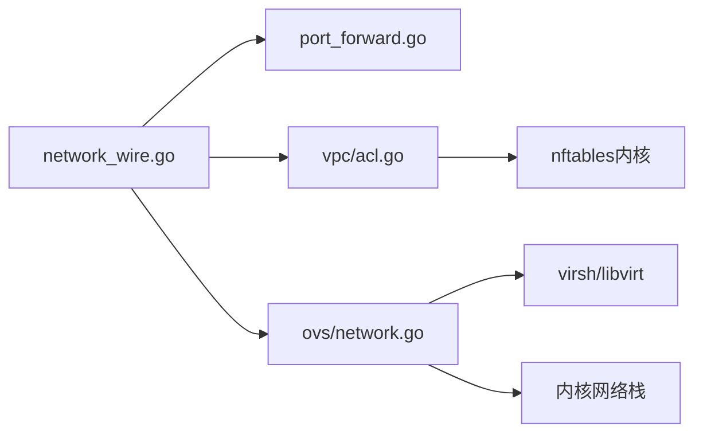

# 网络管理

<cite>
**本文引用的文件**
- [server/service/network/vpc/acl.go](file://server/service/network/vpc/acl.go)
- [server/service/network/vpc/switch.go](file://server/service/network/vpc/switch.go)
- [server/service/network/vpc/switch_bandwidth.go](file://server/service/network/vpc/switch_bandwidth.go)
- [server/service/network/vpc/interface_xml.go](file://server/service/network/vpc/interface_xml.go)
- [server/service/network/vpc/helpers.go](file://server/service/network/vpc/helpers.go)
- [server/service/network/vpc/types.go](file://server/service/network/vpc/types.go)
- [server/service/network/port_forward.go](file://server/service/network/port_forward.go)
- [server/service/network/port_forward_persist.go](file://server/service/network/port_forward_persist.go)
- [server/service/network/port_forward_quota.go](file://server/service/network/port_forward_quota.go)
- [server/service/network/static_ip.go](file://server/service/network/static_ip.go)
- [server/service/firewall/rules.go](file://server/service/firewall/rules.go)
- [server/service/firewall/types.go](file://server/service/firewall/types.go)
- [server/service/firewall/policy.go](file://server/service/firewall/policy.go)
- [server/service/firewall/host_portfwd.go](file://server/service/firewall/host_portfwd.go)
- [server/service/firewall/exemption.go](file://server/service/firewall/exemption.go)
- [server/service/ovs/network.go](file://server/service/ovs/network.go)
- [server/service/ovs/diagnostics.go](file://server/service/ovs/diagnostics.go)
- [server/service/ovs/deps.go](file://server/service/ovs/deps.go)
- [server/service/ovs/types.go](file://server/service/ovs/types.go)
- [server/service/network/diagnostics/capture.go](file://server/service/network/diagnostics/capture.go)
- [server/service/network/diagnostics/templates.go](file://server/service/network/diagnostics/templates.go)
- [server/service/network/diagnostics/types.go](file://server/service/network/diagnostics/types.go)
- [server/service/network/diagnostics/session_store.go](file://server/service/network/diagnostics/session_store.go)
- [server/service/network/deps.go](file://server/service/network/deps.go)
- [server/service/network_wire.go](file://server/service/network_wire.go)
- [server/service/network_bridge_wire.go](file://server/service/network_bridge_wire.go)
- [server/service/ovs_wire.go](file://server/service/ovs_wire.go)
- [web/src/api/network.js](file://web/src/api/network.js)
- [web/src/components/NetworkList.vue](file://web/src/components/NetworkList.vue)
</cite>

## 目录
1. [简介](#简介)
2. [项目结构](#项目结构)
3. [核心组件](#核心组件)
4. [架构总览](#架构总览)
5. [详细组件分析](#详细组件分析)
6. [依赖关系分析](#依赖关系分析)
7. [性能考虑](#性能考虑)
8. [故障排查指南](#故障排查指南)
9. [结论](#结论)
10. [附录](#附录)

## 简介
本文件面向Open虚拟机管理控制台的网络管理系统，系统性梳理VPC网络架构设计与实现，涵盖虚拟交换机、路由器与防火墙的配置管理；详解端口转发（静态映射与动态分配）机制；阐述防火墙规则与安全组体系；提供网络诊断工具使用与故障排查方法；并说明Open vSwitch网络虚拟化集成方式。最后给出网络性能优化、带宽管理与网络安全最佳实践。

## 项目结构
后端采用分层与模块化组织：服务层按功能拆分为网络、防火墙、VPC、OVS等子包；前端通过API模块与后端交互；网络诊断与会话存储位于独立子包中。整体以Hook机制解耦各模块，避免循环依赖，并通过Wire适配器桥接服务层与具体实现。

```mermaid
graph TB
subgraph "前端"
FE_API["web/src/api/network.js"]
FE_UI["web/src/components/NetworkList.vue"]
end
subgraph "服务层"
NET_WIRE["service/network_wire.go"]
BRIDGE_WIRE["service/network_bridge_wire.go"]
OVS_WIRE["service/ovs_wire.go"]
subgraph "网络(VPC)"
VPC_ACL["vpc/acl.go"]
VPC_SWITCH["vpc/switch.go"]
VPC_BW["vpc/switch_bandwidth.go"]
VPC_IFXML["vpc/interface_xml.go"]
VPC_HELP["vpc/helpers.go"]
VPC_TYPES["vpc/types.go"]
end
subgraph "端口转发"
PF_CORE["network/port_forward.go"]
PF_PERSIST["network/port_forward_persist.go"]
PF_QUOTA["network/port_forward_quota.go"]
end
subgraph "静态IP"
STATIC_IP["network/static_ip.go"]
end
subgraph "防火墙"
FW_RULES["firewall/rules.go"]
FW_TYPES["firewall/types.go"]
FW_POLICY["firewall/policy.go"]
FW_HOSTPF["firewall/host_portfwd.go"]
FW_EXEMPT["firewall/exemption.go"]
end
subgraph "OVS"
OVS_NET["ovs/network.go"]
OVS_DIAG["ovs/diagnostics.go"]
OVS_DEPS["ovs/deps.go"]
OVS_TYPES["ovs/types.go"]
end
subgraph "诊断"
DIAG_CAP["network/diagnostics/capture.go"]
DIAG_TMPL["network/diagnostics/templates.go"]
DIAG_TYPES["network/diagnostics/types.go"]
DIAG_STORE["network/diagnostics/session_store.go"]
end
end
FE_API --> NET_WIRE
FE_UI --> FE_API
NET_WIRE --> PF_CORE
NET_WIRE --> STATIC_IP
NET_WIRE --> DIAG_CAP
NET_WIRE --> DIAG_TMPL
NET_WIRE --> DIAG_TYPES
NET_WIRE --> DIAG_STORE
NET_WIRE --> VPC_ACL
NET_WIRE --> VPC_SWITCH
NET_WIRE --> VPC_BW
NET_WIRE --> VPC_IFXML
NET_WIRE --> VPC_HELP
NET_WIRE --> VPC_TYPES
NET_WIRE --> FW_RULES
NET_WIRE --> FW_TYPES
NET_WIRE --> FW_POLICY
NET_WIRE --> FW_HOSTPF
NET_WIRE --> FW_EXEMPT
NET_WIRE --> OVS_NET
NET_WIRE --> OVS_DIAG
NET_WIRE --> OVS_DEPS
NET_WIRE --> OVS_TYPES
BRIDGE_WIRE --> OVS_NET
OVS_WIRE --> OVS_NET
```

图示来源
- [server/service/network_wire.go:138-181](file://server/service/network_wire.go#L138-L181)
- [server/service/network_bridge_wire.go:71-90](file://server/service/network_bridge_wire.go#L71-L90)
- [server/service/ovs_wire.go:38-74](file://server/service/ovs_wire.go#L38-L74)

章节来源
- [server/service/network_wire.go:138-181](file://server/service/network_wire.go#L138-L181)
- [server/service/network_bridge_wire.go:71-90](file://server/service/network_bridge_wire.go#L71-L90)
- [server/service/ovs_wire.go:38-74](file://server/service/ovs_wire.go#L38-L74)

## 核心组件
- VPC虚拟交换机与ACL：基于nftables表构建VPC ACL链，过滤跨VM流量并拒绝DNAT回环，结合直连网桥模式与OVS网桥模式的差异处理。
- 端口转发：支持静态端口映射持久化与配额控制，动态解析VM目标IP，确保宿主DNAT指向有效地址。
- 防火墙策略：统一入站/出站策略、区域过滤、阻断动作与探测封禁；支持主机级端口转发与豁免。
- OVS虚拟化：提供接口XML生成、VLAN标签设置、直连网桥与uplink桥接、DNSMASQ集成与DHCP租约管理。
- 网络诊断：模板化抓包过滤、会话存储与问题汇总，辅助快速定位网络异常。

章节来源
- [server/service/network/vpc/acl.go:17-54](file://server/service/network/vpc/acl.go#L17-L54)
- [server/service/network/port_forward.go](file://server/service/network/port_forward.go)
- [server/service/network/port_forward_persist.go](file://server/service/network/port_forward_persist.go)
- [server/service/network/port_forward_quota.go](file://server/service/network/port_forward_quota.go)
- [server/service/network/static_ip.go:312-350](file://server/service/network/static_ip.go#L312-L350)
- [server/service/firewall/rules.go:114-144](file://server/service/firewall/rules.go#L114-L144)
- [server/service/ovs/network.go](file://server/service/ovs/network.go)
- [server/service/network/diagnostics/capture.go](file://server/service/network/diagnostics/capture.go)

## 架构总览
下图展示从Web前端到后端服务、再到内核网络栈与OVS的完整数据流与控制流。

图示来源
- [web/src/components/NetworkList.vue:345-367](file://web/src/components/NetworkList.vue#L345-L367)
- [web/src/api/network.js:1-53](file://web/src/api/network.js#L1-L53)
- [server/service/network_wire.go:138-181](file://server/service/network_wire.go#L138-L181)
- [server/service/network/port_forward.go](file://server/service/network/port_forward.go)
- [server/service/network/vpc/acl.go:17-54](file://server/service/network/vpc/acl.go#L17-L54)
- [server/service/ovs/network.go](file://server/service/ovs/network.go)

## 详细组件分析

### VPC虚拟交换机与ACL
- ACL生成逻辑：遍历所有VPC绑定，跳过直连桥场景，对每个VM IP生成入站允许规则并拒绝反向DNAT，最终统一放行已建立连接。
- 交换机模式：区分直连网桥与OVS网桥，针对不同模式调整规则与流表应用。
- 接口XML与VLAN：根据首块OVS接口自动设置桥接与VLAN标签，保证VM与宿主网络一致。

图示来源
- [server/service/network/vpc/acl.go:17-54](file://server/service/network/vpc/acl.go#L17-L54)

章节来源
- [server/service/network/vpc/acl.go:17-54](file://server/service/network/vpc/acl.go#L17-L54)
- [server/service/network/vpc/switch.go](file://server/service/network/vpc/switch.go)
- [server/service/network/vpc/interface_xml.go:48-89](file://server/service/network/vpc/interface_xml.go#L48-L89)

### 端口转发配置与动态解析
- 规则稳定性：通过协议+宿主端口+目的IP+目的端口的稳定键避免依赖iptables行号，便于幂等应用与迁移。
- 动态解析：VPC环境下优先解析VM当前静态绑定或最新DHCP租约，防止前端缓存导致DNAT失效。
- 持久化与配额：支持规则持久化与配额统计，避免资源滥用。

图示来源
- [server/service/network/port_forward.go](file://server/service/network/port_forward.go)
- [server/service/network/port_forward_persist.go](file://server/service/network/port_forward_persist.go)
- [server/service/network/port_forward_quota.go](file://server/service/network/port_forward_quota.go)
- [server/service/network/static_ip.go:312-350](file://server/service/network/static_ip.go#L312-L350)

章节来源
- [server/service/network/port_forward.go](file://server/service/network/port_forward.go)
- [server/service/network/port_forward_persist.go](file://server/service/network/port_forward_persist.go)
- [server/service/network/port_forward_quota.go](file://server/service/network/port_forward_quota.go)
- [server/service/network/static_ip.go:312-350](file://server/service/network/static_ip.go#L312-L350)

### 防火墙规则与安全组
- 策略维度：入站/出站开关、区域过滤（支持继承）、阻断动作（drop/reject）。
- 主机端口转发：与防火墙策略联动，避免冲突与绕过。
- 豁免机制：支持探测封禁、白名单范围与探测状态记录，便于审计与恢复。

图示来源
- [server/service/firewall/rules.go:114-144](file://server/service/firewall/rules.go#L114-L144)
- [server/service/firewall/types.go:171-222](file://server/service/firewall/types.go#L171-L222)
- [server/service/firewall/policy.go](file://server/service/firewall/policy.go)
- [server/service/firewall/host_portfwd.go](file://server/service/firewall/host_portfwd.go)
- [server/service/firewall/exemption.go](file://server/service/firewall/exemption.go)

章节来源
- [server/service/firewall/rules.go:114-144](file://server/service/firewall/rules.go#L114-L144)
- [server/service/firewall/types.go:171-222](file://server/service/firewall/types.go#L171-L222)
- [server/service/firewall/policy.go](file://server/service/firewall/policy.go)
- [server/service/firewall/host_portfwd.go](file://server/service/firewall/host_portfwd.go)
- [server/service/firewall/exemption.go](file://server/service/firewall/exemption.go)

### Open vSwitch网络虚拟化集成
- 接口XML与VLAN：根据首OVS接口自动设置桥接与VLAN标签，兼容直连网桥与uplink桥接。
- 直连网桥：支持uplink直连与主机地址/GW/Metric迁移，保障业务连续性。
- DNSMASQ与DHCP：集成本地DNSMASQ输入、租约解析与清理，维护VPC内DNS与IP分配。
- 流表与TC限速：为VPC交换机生成带宽计量器与出/下行速率限制流表，结合TC实现精细化限速。

图示来源
- [server/service/ovs/network.go](file://server/service/ovs/network.go)
- [server/service/ovs/deps.go:1-15](file://server/service/ovs/deps.go#L1-L15)
- [server/service/network/vpc/switch_bandwidth.go:243-254](file://server/service/network/vpc/switch_bandwidth.go#L243-L254)

章节来源
- [server/service/ovs/network.go](file://server/service/ovs/network.go)
- [server/service/ovs/deps.go:1-15](file://server/service/ovs/deps.go#L1-L15)
- [server/service/network/vpc/switch_bandwidth.go:243-254](file://server/service/network/vpc/switch_bandwidth.go#L243-L254)

### 网络诊断工具
- 模板化过滤：内置ARP/DHCP/DNS模板，以及基于当前VM IP与端口转发规则的动态模板。
- 抓包与会话：支持指定接口、过滤条件、时长与大小限制，会话存储用于复用与回放。
- 问题汇总：聚合诊断结果，标注“可抓包/需要关注”，辅助快速定位。

图示来源
- [server/service/network/diagnostics/templates.go:9-41](file://server/service/network/diagnostics/templates.go#L9-L41)
- [server/service/network/diagnostics/capture.go](file://server/service/network/diagnostics/capture.go)
- [server/service/network/diagnostics/session_store.go](file://server/service/network/diagnostics/session_store.go)
- [server/service/network/diagnostics/types.go:1-40](file://server/service/network/diagnostics/types.go#L1-L40)

章节来源
- [server/service/network/diagnostics/templates.go:9-41](file://server/service/network/diagnostics/templates.go#L9-L41)
- [server/service/network/diagnostics/capture.go](file://server/service/network/diagnostics/capture.go)
- [server/service/network/diagnostics/session_store.go](file://server/service/network/diagnostics/session_store.go)
- [server/service/network/diagnostics/types.go:1-40](file://server/service/network/diagnostics/types.go#L1-L40)
- [web/src/components/NetworkList.vue:345-367](file://web/src/components/NetworkList.vue#L345-L367)
- [web/src/api/network.js:1-53](file://web/src/api/network.js#L1-L53)

## 依赖关系分析
- Hook解耦：服务根包通过Hook变量调用子包能力，避免循环依赖；Wire适配器集中注册钩子，屏蔽具体实现差异。
- 依赖方向：网络层依赖VPC与OVS能力；VPC依赖nftables与内核网络；OVS依赖virsh与内核模块。
- 外部依赖：libvirt virsh、内核nftables、OVS用户空间工具、DNSMASQ。

图示来源
- [server/service/network_wire.go:138-181](file://server/service/network_wire.go#L138-L181)
- [server/service/network/port_forward.go](file://server/service/network/port_forward.go)
- [server/service/network/vpc/acl.go:17-54](file://server/service/network/vpc/acl.go#L17-L54)
- [server/service/ovs/network.go](file://server/service/ovs/network.go)

章节来源
- [server/service/network_wire.go:138-181](file://server/service/network_wire.go#L138-L181)
- [server/service/network/deps.go:49-75](file://server/service/network/deps.go#L49-L75)
- [server/service/network/vpc/deps.go:56-88](file://server/service/network/vpc/deps.go#L56-L88)

## 性能考虑
- 带宽管理
  - 使用OVS计量器与nftables/TC流表实现上下行速率限制，优先为关键VM/租户设置上限。
  - 结合直连桥与OVS桥模式选择，减少不必要的三层转发开销。
- 连接跟踪
  - 放行已建立/相关连接，降低重复匹配成本；仅对新连接进行严格ACL检查。
- 规则收敛
  - 通过稳定键去重与幂等应用，避免规则膨胀；定期清理无效/过期规则。
- DNS与DHCP
  - 本地DNSMASQ缓存热点域名；合理设置租期与并发扫描，避免DNS风暴。

## 故障排查指南
- 端口转发不可达
  - 检查规则是否持久化且稳定键正确；确认目的IP解析为当前有效地址（静态绑定/最新租约）。
  - 对照模板过滤条件，使用网络诊断抓包验证宿主入站流量是否到达VM。
- ACL拦截异常
  - 核对VPC绑定与直连桥模式；确认未生成反向DNAT拒绝规则；检查已建立连接放行链。
- OVS桥接问题
  - 确认首接口XML桥接与VLAN标签正确；直连桥模式下uplink与主机地址迁移是否完成。
  - 查看DHCP租约与DNSMASQ状态，排除地址冲突与解析失败。
- 防火墙策略冲突
  - 检查入/出站开关与区域过滤；确认阻断动作与主机端口转发无冲突；必要时临时关闭策略验证链路。

章节来源
- [server/service/network/static_ip.go:312-350](file://server/service/network/static_ip.go#L312-L350)
- [server/service/network/diagnostics/templates.go:9-41](file://server/service/network/diagnostics/templates.go#L9-L41)
- [server/service/network/vpc/acl.go:17-54](file://server/service/network/vpc/acl.go#L17-L54)
- [server/service/ovs/network.go](file://server/service/ovs/network.go)

## 结论
本网络管理体系以VPC为核心，结合nftables ACL、OVS虚拟化与完善的端口转发/静态IP解析机制，形成从策略到落地的全链路闭环。配合诊断工具与Hook解耦架构，既满足多租户隔离与性能需求，又具备良好的可观测性与可维护性。

## 附录
- 前端API与界面
  - 网络API：静态IP、端口转发、宿主接口、网桥、公网IP等接口定义。
  - 网络列表界面：提供网络诊断面板、问题提示与摘要信息展示。

章节来源
- [web/src/api/network.js:1-53](file://web/src/api/network.js#L1-L53)
- [web/src/components/NetworkList.vue:345-367](file://web/src/components/NetworkList.vue#L345-L367)