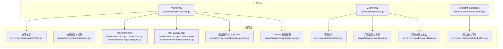
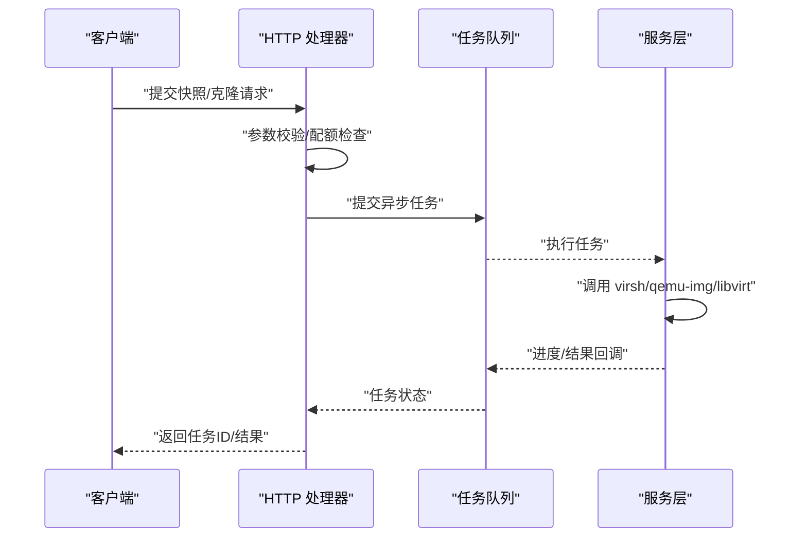
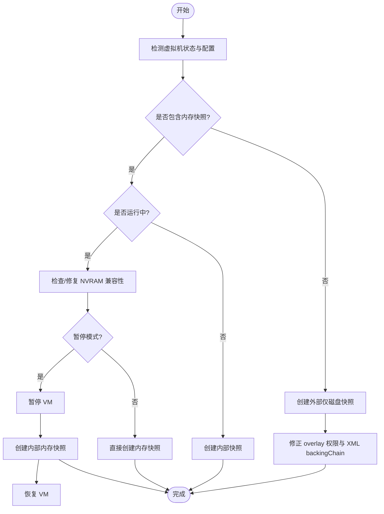
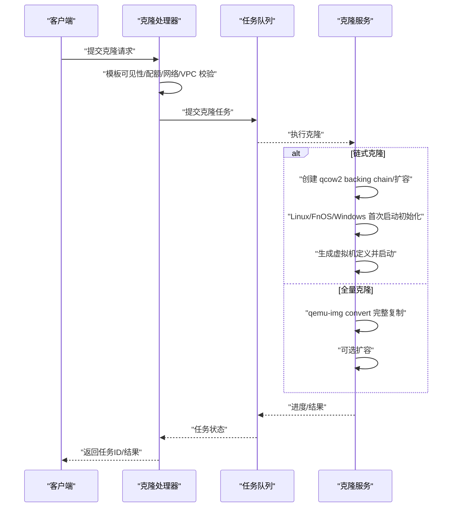
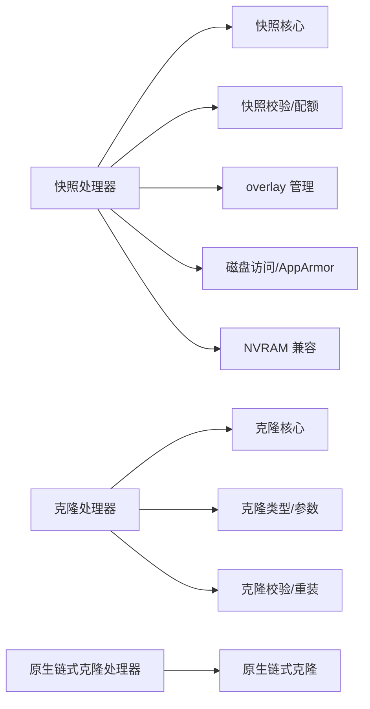

# 虚拟机快照与克隆

<cite>
**本文档引用的文件**
- [server/handler/snapshot.go](file://server/handler/snapshot.go)
- [server/handler/clone.go](file://server/handler/clone.go)
- [server/handler/linked_clone.go](file://server/handler/linked_clone.go)
- [server/service/snapshot/types.go](file://server/service/snapshot/types.go)
- [server/service/snapshot/core.go](file://server/service/snapshot/core.go)
- [server/service/snapshot/validation.go](file://server/service/snapshot/validation.go)
- [server/service/snapshot/quota.go](file://server/service/snapshot/quota.go)
- [server/service/snapshot/overlay.go](file://server/service/snapshot/overlay.go)
- [server/service/snapshot/disk_access.go](file://server/service/snapshot/disk_access.go)
- [server/service/snapshot/cleanup.go](file://server/service/snapshot/cleanup.go)
- [server/service/snapshot/nvram.go](file://server/service/snapshot/nvram.go)
- [server/service/clone/types.go](file://server/service/clone/types.go)
- [server/service/clone/core.go](file://server/service/clone/core.go)
- [server/service/clone/validation.go](file://server/service/clone/validation.go)
- [server/service/clone/linked_clone.go](file://server/service/clone/linked_clone.go)
</cite>

## 目录
1. [引言](#引言)
2. [项目结构](#项目结构)
3. [核心组件](#核心组件)
4. [架构总览](#架构总览)
5. [详细组件分析](#详细组件分析)
6. [依赖分析](#依赖分析)
7. [性能考量](#性能考量)
8. [故障排查指南](#故障排查指南)
9. [结论](#结论)
10. [附录](#附录)

## 引言
本文件面向虚拟机快照与克隆功能，系统性阐述以下内容：
- 快照技术原理：内部快照（内存+磁盘）、外部快照（仅磁盘）、快照链管理与合并策略
- 快照生命周期：创建、删除、恢复、批量清理与残留文件回收
- 克隆能力：全量克隆与链式克隆的差异、适用场景与实现机制
- 存储影响与性能权衡：空间占用、IO 影响、并发与一致性
- 策略建议与最佳实践：命名规范、配额控制、NVRAM 兼容、AppArmor 权限与 overlay 合并

## 项目结构
本项目采用分层架构，快照与克隆相关代码主要分布在以下模块：
- HTTP 层（handler）：接收请求、参数校验、提交异步任务
- 服务层（service）：快照与克隆的核心算法、磁盘与权限管理、配额与校验
- 工具与系统集成：virsh/qemu-img/libvirt 调用、AppArmor 权限注入、NVRAM 兼容处理

图表来源
- [server/handler/snapshot.go:1-274](file://server/handler/snapshot.go#L1-L274)
- [server/handler/clone.go:1-691](file://server/handler/clone.go#L1-L691)
- [server/handler/linked_clone.go:1-155](file://server/handler/linked_clone.go#L1-L155)
- [server/service/snapshot/core.go:1-488](file://server/service/snapshot/core.go#L1-L488)
- [server/service/snapshot/types.go:1-75](file://server/service/snapshot/types.go#L1-L75)
- [server/service/snapshot/validation.go:1-135](file://server/service/snapshot/validation.go#L1-L135)
- [server/service/snapshot/quota.go:1-103](file://server/service/snapshot/quota.go#L1-L103)
- [server/service/snapshot/overlay.go:1-121](file://server/service/snapshot/overlay.go#L1-L121)
- [server/service/snapshot/disk_access.go:1-445](file://server/service/snapshot/disk_access.go#L1-L445)
- [server/service/snapshot/cleanup.go:1-241](file://server/service/snapshot/cleanup.go#L1-L241)
- [server/service/snapshot/nvram.go:1-146](file://server/service/snapshot/nvram.go#L1-L146)
- [server/service/clone/core.go:1-349](file://server/service/clone/core.go#L1-L349)
- [server/service/clone/types.go:1-172](file://server/service/clone/types.go#L1-L172)
- [server/service/clone/validation.go:1-322](file://server/service/clone/validation.go#L1-L322)
- [server/service/clone/linked_clone.go:1-439](file://server/service/clone/linked_clone.go#L1-L439)

章节来源
- [server/handler/snapshot.go:1-274](file://server/handler/snapshot.go#L1-L274)
- [server/handler/clone.go:1-691](file://server/handler/clone.go#L1-L691)
- [server/handler/linked_clone.go:1-155](file://server/handler/linked_clone.go#L1-L155)
- [server/service/snapshot/core.go:1-488](file://server/service/snapshot/core.go#L1-L488)
- [server/service/clone/core.go:1-349](file://server/service/clone/core.go#L1-L349)

## 核心组件
- 快照处理器（HTTP）：提供列出、创建、恢复、删除、批量删除等接口，统一参数校验、配额检查与异步任务提交。
- 快照服务（核心）：封装 virsh/qemu-img/libvirt 命令，实现内部/外部快照创建、恢复、删除、合并与残留文件清理。
- 克隆处理器（HTTP）：提供克隆、批量克隆、重装系统接口，负责参数校验、配额与网络/VPC 解析、异步任务提交。
- 克隆服务（核心）：实现链式/全量克隆磁盘创建、来宾初始化、虚拟机定义与启动、额外磁盘挂载、首启修复等。
- 辅助模块：快照命名与校验、配额统计、NVRAM 兼容、AppArmor 权限注入、overlay 合并与残留文件回收。

章节来源
- [server/handler/snapshot.go:34-273](file://server/handler/snapshot.go#L34-L273)
- [server/handler/clone.go:120-554](file://server/handler/clone.go#L120-L554)
- [server/handler/linked_clone.go:50-154](file://server/handler/linked_clone.go#L50-L154)
- [server/service/snapshot/core.go:14-488](file://server/service/snapshot/core.go#L14-L488)
- [server/service/clone/core.go:43-349](file://server/service/clone/core.go#L43-L349)

## 架构总览
快照与克隆均通过 HTTP 层接收请求，随后进入服务层执行具体逻辑。快照侧重点在于磁盘链与权限管理，克隆侧重点在于磁盘创建与来宾初始化。

图表来源
- [server/handler/snapshot.go:59-161](file://server/handler/snapshot.go#L59-L161)
- [server/handler/clone.go:120-297](file://server/handler/clone.go#L120-L297)
- [server/handler/linked_clone.go:50-154](file://server/handler/linked_clone.go#L50-L154)

## 详细组件分析

### 快照组件分析
- 数据模型与常量
  - 快照信息结构体包含名称、创建时间、状态、描述、是否当前、位置（内部/外部）、子节点与后代数量等字段。
  - 快照名称正则约束与生成策略，确保与 libvirt/QEMU 兼容。
- 快照生命周期
  - 列表：解析 virsh 输出，补充描述与位置信息，标记当前快照。
  - 创建：根据运行态与是否包含内存决定内部/外部快照策略；运行中内存快照支持暂停或直接创建两种模式；外部快照创建后修正 overlay 权限与 XML backingChain。
  - 恢复：区分内部/外部快照；外部快照走专用恢复流程；内部快照直接 revert；必要时恢复 VM 运行。
  - 删除：叶子节点优先删除；外部快照需处理当前活动 overlay 的合并或独立复制，避免污染其他快照恢复点；支持删除元数据与残留文件清理。
  - 批量删除：按叶子节点顺序迭代删除，最终清理残留文件。
- NVRAM 兼容
  - 对使用 pflash NVRAM 的 UEFI 虚拟机，确保 NVRAM 文件格式为 qcow2，必要时自动关机、转换、再开机。
- 权限与 AppArmor
  - 外部快照创建后修正 overlay 权限为 libvirt-qemu:kvm；清理 VM XML 中不完整的 backingStore，避免 AppArmor 白名单不完整导致启动拒绝。
- overlay 合并与保护
  - 在删除/清理过程中识别当前活动 overlay，按策略执行 blockcommit/pivot 或 blockcopy 独立，避免污染其他快照恢复点。

图表来源
- [server/service/snapshot/core.go:104-253](file://server/service/snapshot/core.go#L104-L253)
- [server/service/snapshot/nvram.go:12-53](file://server/service/snapshot/nvram.go#L12-L53)
- [server/service/snapshot/disk_access.go:18-46](file://server/service/snapshot/disk_access.go#L18-L46)

章节来源
- [server/service/snapshot/types.go:17-75](file://server/service/snapshot/types.go#L17-L75)
- [server/service/snapshot/validation.go:14-135](file://server/service/snapshot/validation.go#L14-L135)
- [server/service/snapshot/core.go:14-488](file://server/service/snapshot/core.go#L14-L488)
- [server/service/snapshot/nvram.go:12-146](file://server/service/snapshot/nvram.go#L12-L146)
- [server/service/snapshot/disk_access.go:18-445](file://server/service/snapshot/disk_access.go#L18-L445)
- [server/service/snapshot/overlay.go:13-121](file://server/service/snapshot/overlay.go#L13-L121)
- [server/service/snapshot/cleanup.go:13-241](file://server/service/snapshot/cleanup.go#L13-L241)

### 克隆组件分析
- 参数与类型
  - 克隆参数涵盖名称、模板、CPU/RAM、磁盘大小、网络/VPC、UEFI/APIC/PAE、视频模型、CPU 亲和性、首次重启策略、额外磁盘等。
  - 支持链式克隆与全量克隆两种模式；Windows/Linux/FnOS/Other 类型分别处理。
- 核心流程
  - 链式克隆：基于模板创建 qcow2 backing chain，按需扩容；针对 Linux/FnOS/Windwos 做首次启动身份重置与系统盘扩展；创建虚拟机定义并启动。
  - 全量克隆：使用 qemu-img convert 将模板完整复制到新磁盘，脱离模板链。
  - 原生链式克隆：不进行来宾初始化，直接通过 virt-install 生成 XML 并定义，适合高级场景。
- 重装系统
  - 解析系统盘大小，校验启动族兼容性，按模板类型执行相应初始化步骤。

图表来源
- [server/handler/clone.go:120-297](file://server/handler/clone.go#L120-L297)
- [server/service/clone/core.go:43-349](file://server/service/clone/core.go#L43-L349)
- [server/service/clone/types.go:16-172](file://server/service/clone/types.go#L16-L172)
- [server/service/clone/validation.go:31-322](file://server/service/clone/validation.go#L31-L322)

章节来源
- [server/handler/clone.go:120-554](file://server/handler/clone.go#L120-L554)
- [server/handler/linked_clone.go:50-154](file://server/handler/linked_clone.go#L50-L154)
- [server/service/clone/core.go:43-349](file://server/service/clone/core.go#L43-L349)
- [server/service/clone/types.go:16-172](file://server/service/clone/types.go#L16-L172)
- [server/service/clone/validation.go:31-322](file://server/service/clone/validation.go#L31-L322)
- [server/service/clone/linked_clone.go:77-439](file://server/service/clone/linked_clone.go#L77-L439)

### 快照与克隆的存储影响与性能
- 快照存储
  - 外部快照（仅磁盘）：创建 qcow2 overlay，叠加在模板/父链之上；运行中创建外部快照会修正 overlay 权限，避免 QEMU 访问失败。
  - 内部快照（含内存）：在运行中创建内存快照可选择暂停 VM 或直接创建；后者会短暂进入 paused (saving) 状态。
  - overlay 合并：删除外部快照时，若 overlay 为当前活动盘，优先执行 blockcommit/pivot 或 blockcopy 独立，避免污染其他快照恢复点。
- 克隆存储
  - 链式克隆：仅记录差异，空间开销小，依赖模板链；全量克隆：复制完整数据，空间开销大但独立性强。
- 性能影响
  - 快照创建：内存快照耗时与内存大小相关，运行中创建可能短暂暂停；外部快照涉及 IO 合并与权限修正。
  - 克隆：链式克隆速度快、空间省；全量克隆速度受磁盘容量与 IO 限制；Linux/FnOS 首次启动初始化会触发 cloud-init 等流程。
- 权限与安全
  - AppArmor 规则动态注入，确保 libvirt-qemu 对 backing chain 的访问；清理 VM XML 中不完整 backingStore，避免权限缺失。

章节来源
- [server/service/snapshot/disk_access.go:18-46](file://server/service/snapshot/disk_access.go#L18-L46)
- [server/service/snapshot/overlay.go:13-121](file://server/service/snapshot/overlay.go#L13-L121)
- [server/service/clone/core.go:154-184](file://server/service/clone/core.go#L154-L184)

## 依赖分析
- 处理器与服务层解耦：HTTP 层仅负责参数校验与任务提交，核心逻辑集中在服务层，便于测试与维护。
- 外部依赖：大量调用 virsh、qemu-img、libvirt RPC 与系统命令，服务层封装这些调用并处理错误与回滚。
- 配额与校验：快照配额按用户/轻量化云维度统计与检查；克隆参数校验覆盖主机名、用户名、密码强度、模板可见性等。

图表来源
- [server/handler/snapshot.go:59-273](file://server/handler/snapshot.go#L59-L273)
- [server/handler/clone.go:120-554](file://server/handler/clone.go#L120-L554)
- [server/handler/linked_clone.go:50-154](file://server/handler/linked_clone.go#L50-L154)
- [server/service/snapshot/core.go:14-488](file://server/service/snapshot/core.go#L14-L488)
- [server/service/clone/core.go:43-349](file://server/service/clone/core.go#L43-L349)

章节来源
- [server/handler/snapshot.go:59-273](file://server/handler/snapshot.go#L59-L273)
- [server/handler/clone.go:120-554](file://server/handler/clone.go#L120-L554)
- [server/handler/linked_clone.go:50-154](file://server/handler/linked_clone.go#L50-L154)
- [server/service/snapshot/core.go:14-488](file://server/service/snapshot/core.go#L14-L488)
- [server/service/clone/core.go:43-349](file://server/service/clone/core.go#L43-L349)

## 性能考量
- 快照
  - 运行中内存快照：暂停模式可保证一致性但带来业务暂停；直接模式缩短暂停窗口但不同宿主机行为可能差异。
  - 外部快照：创建后立即修正权限，避免后续启动失败；删除时优先合并当前活动 overlay，减少后续 IO 压力。
- 克隆
  - 链式克隆：IO 压力小，适合快速批量部署；全量克隆：IO 压力大，适合长期独立部署。
  - 首次启动初始化：Linux/FnOS 通过 cloud-init 处理，Windows 通过系统特定流程，注意等待与取消机制。

## 故障排查指南
- 快照创建失败
  - 常见原因：快照名称非法、运行中存在 VirtFS 共享目录导致禁止内存快照、NVRAM 格式不兼容。
  - 排查步骤：检查快照名称正则、确认虚拟机状态、查看 NVRAM 格式与自动修复提示、确认外部快照 overlay 权限。
- 快照恢复失败
  - 外部快照不能直接 revert，需走专用恢复流程；内部快照恢复后若 VM 处于 paused 状态会自动 resume。
- 快照删除失败
  - 若内部快照所在磁盘与当前活动磁盘不一致，需先合并当前外部 overlay 或确认磁盘链后再删除；叶子节点优先删除。
- 克隆失败
  - 模板不存在、主机名/用户名/密码不合法、存储空间不足、网络/VPC 解析失败、Windows 用户名固定为 administrator。
  - 排查步骤：确认模板可见性与类型、检查配额、核对网络与存储池、查看日志与任务进度。

章节来源
- [server/service/snapshot/validation.go:46-135](file://server/service/snapshot/validation.go#L46-L135)
- [server/service/snapshot/core.go:270-375](file://server/service/snapshot/core.go#L270-L375)
- [server/service/snapshot/core.go:377-419](file://server/service/snapshot/core.go#L377-L419)
- [server/service/snapshot/nvram.go:55-146](file://server/service/snapshot/nvram.go#L55-L146)
- [server/service/clone/validation.go:31-91](file://server/service/clone/validation.go#L31-L91)
- [server/handler/clone.go:146-174](file://server/handler/clone.go#L146-L174)

## 结论
本系统通过严格的参数校验、配额控制与完善的磁盘链管理，实现了稳定可靠的快照与克隆能力。快照侧重一致性与权限保障，克隆侧重灵活性与效率。结合合理的策略与最佳实践，可在保证业务连续性的同时优化存储与性能。

## 附录
- 快照策略建议
  - 命名规范：使用字母、数字、下划线、点或短横线，避免特殊字符；建议包含时间戳与用途标识。
  - 配额控制：按用户/轻量化云维度设定最大快照数量，定期清理无用快照。
  - NVRAM 兼容：使用 UEFI 的虚拟机应确保 NVRAM 为 qcow2 格式，必要时自动修复。
  - 外部快照：关注 overlay 权限与 backingChain，删除时优先合并当前活动 overlay。
- 克隆最佳实践
  - 链式克隆适合快速批量部署与开发测试；全量克隆适合长期独立部署与迁移。
  - Linux/FnOS 首次启动初始化已内置，Windows 需遵循系统特定流程；注意首次重启策略。
  - 模板可见性与配额：确保模板对用户可见，克隆前检查 CPU/RAM/磁盘配额。