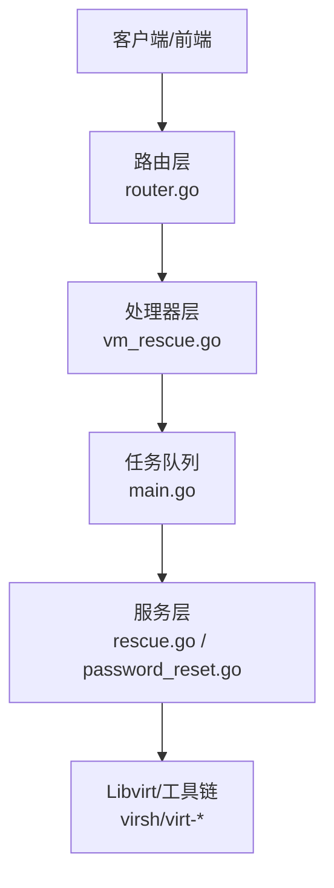
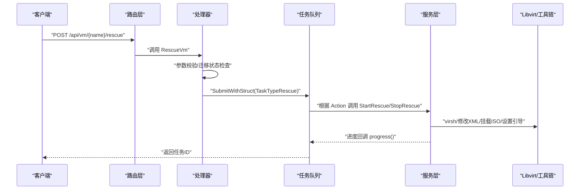
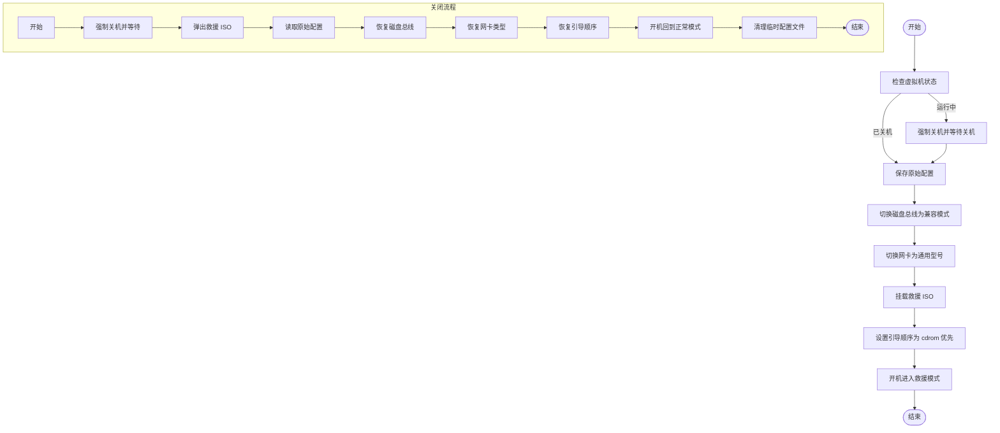
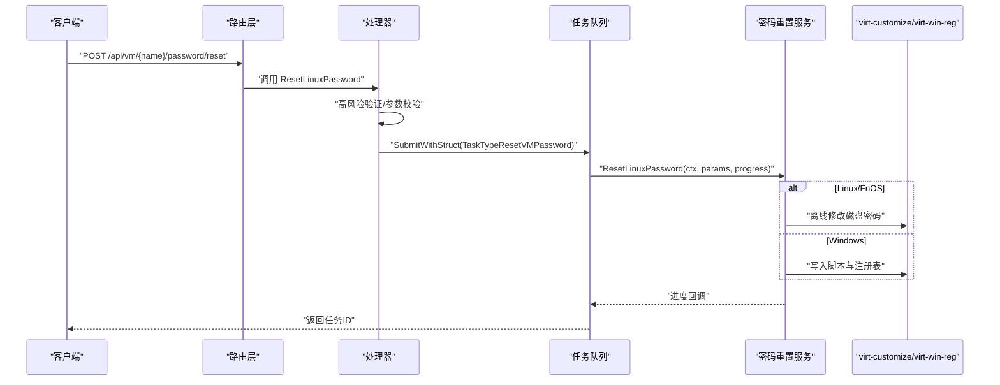
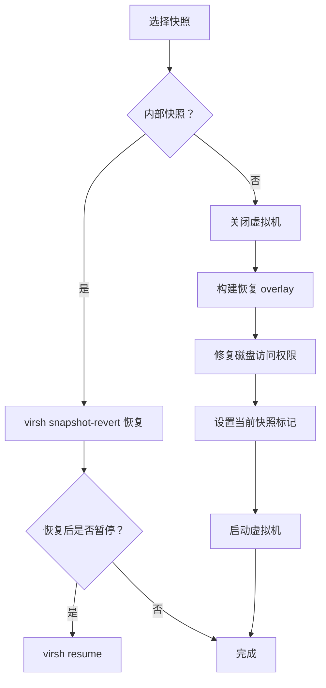
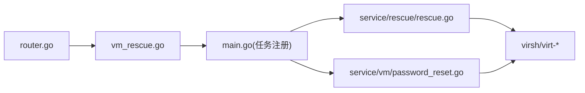

# 虚拟机救援与恢复

<cite>
**本文档引用的文件**
- [server/handler/vm_rescue.go](file://server/handler/vm_rescue.go)
- [server/service/rescue/rescue.go](file://server/service/rescue/rescue.go)
- [server/service/rescue/deps.go](file://server/service/rescue/deps.go)
- [server/service/rescue_wire.go](file://server/service/rescue_wire.go)
- [server/router/router.go](file://server/router/router.go)
- [server/main.go](file://server/main.go)
- [server/service/vm/password_reset.go](file://server/service/vm/password_reset.go)
- [server/model/task.go](file://server/model/task.go)
- [server/config/config.go](file://server/config/config.go)
- [server/service/snapshot/core.go](file://server/service/snapshot/core.go)
- [server/service/snapshot/external.go](file://server/service/snapshot/external.go)
</cite>

## 目录
1. [引言](#引言)
2. [项目结构](#项目结构)
3. [核心组件](#核心组件)
4. [架构总览](#架构总览)
5. [详细组件分析](#详细组件分析)
6. [依赖分析](#依赖分析)
7. [性能考虑](#性能考虑)
8. [故障排查指南](#故障排查指南)
9. [结论](#结论)
10. [附录](#附录)

## 引言
本文件面向运维与平台开发者，系统化阐述虚拟机救援与恢复能力的设计与实现，覆盖以下主题：
- 救援模式的工作原理与启动/关闭流程
- 临时文件系统挂载与隔离环境配置
- 密码重置与离线修复机制
- 恢复策略：从备份恢复、快照恢复与手动修复
- 安全注意事项与风险控制
- 常见场景处理流程与故障排除

## 项目结构
救援与恢复功能由“HTTP 层 → 任务队列 → 服务层 → Libvirt/工具链”的分层架构组成。关键入口与职责如下：
- 路由层：注册 /api/vm/:name/rescue 与 /api/vm/:name/password/reset 等 API
- 处理器层：校验参数、提交异步任务、返回任务 ID
- 任务队列：统一调度与进度上报
- 服务层：实现具体逻辑（救援、密码重置、快照恢复）
- Libvirt/工具链：与虚拟化后端交互（virsh、virt-customize、virt-win-reg 等）

图表来源
- [server/router/router.go:203-205](file://server/router/router.go#L203-L205)
- [server/handler/vm_rescue.go:17-94](file://server/handler/vm_rescue.go#L17-L94)
- [server/main.go:726-755](file://server/main.go#L726-L755)
- [server/service/rescue/rescue.go:36-111](file://server/service/rescue/rescue.go#L36-L111)
- [server/service/vm/password_reset.go:65-129](file://server/service/vm/password_reset.go#L65-L129)

章节来源
- [server/router/router.go:203-205](file://server/router/router.go#L203-L205)
- [server/handler/vm_rescue.go:17-94](file://server/handler/vm_rescue.go#L17-L94)
- [server/main.go:726-755](file://server/main.go#L726-L755)

## 核心组件
- 救援模式控制器：负责接收启动/停止请求、参数校验、提交异步任务
- 救援服务：实现强制关机、记录原始配置、切换磁盘总线/网卡、挂载救援 ISO、设置引导顺序、开机与恢复
- 密码重置服务：支持 Linux/FnOS 离线重置与 Windows 注册表脚本注入
- 任务队列：统一的任务注册、执行与进度回调
- 快照恢复：内部快照与外部快照的差异化恢复流程

章节来源
- [server/handler/vm_rescue.go:17-94](file://server/handler/vm_rescue.go#L17-L94)
- [server/service/rescue/rescue.go:36-189](file://server/service/rescue/rescue.go#L36-L189)
- [server/service/vm/password_reset.go:65-129](file://server/service/vm/password_reset.go#L65-L129)
- [server/main.go:726-755](file://server/main.go#L726-L755)
- [server/service/snapshot/core.go:277-307](file://server/service/snapshot/core.go#L277-L307)
- [server/service/snapshot/external.go:125-272](file://server/service/snapshot/external.go#L125-L272)

## 架构总览
救援与恢复采用“异步任务 + 分层服务”的设计，确保操作幂等、可观测、可回滚。

图表来源
- [server/router/router.go:203-205](file://server/router/router.go#L203-L205)
- [server/handler/vm_rescue.go:17-94](file://server/handler/vm_rescue.go#L17-L94)
- [server/main.go:726-755](file://server/main.go#L726-L755)
- [server/service/rescue/rescue.go:36-111](file://server/service/rescue/rescue.go#L36-L111)

## 详细组件分析

### 救援模式启动与关闭流程
- 启动流程要点
  - 强制关机并等待至关机状态
  - 读取并保存原始配置（磁盘总线、网卡类型、引导顺序）
  - 将磁盘总线切换为兼容模式、网卡切换为通用型号
  - 挂载救援 ISO 并设置引导顺序为光驱优先
  - 开机进入救援环境
- 关闭流程要点
  - 强制关机并等待
  - 弹出救援 ISO
  - 加载原始配置并恢复磁盘总线/网卡/引导顺序
  - 开机回到正常模式
  - 清理临时配置文件

图表来源
- [server/service/rescue/rescue.go:36-111](file://server/service/rescue/rescue.go#L36-L111)
- [server/service/rescue/rescue.go:113-189](file://server/service/rescue/rescue.go#L113-L189)

章节来源
- [server/service/rescue/rescue.go:36-189](file://server/service/rescue/rescue.go#L36-L189)

### 救援模式配置与钩子
- 通过全局配置项指定救援 ISO 路径
- 服务层通过钩子变量与上层服务解耦，避免循环依赖
- 初始化阶段将具体实现注入钩子，供救援模块调用

章节来源
- [server/config/config.go:81](file://server/config/config.go#L81)
- [server/config/config.go:189](file://server/config/config.go#L189)
- [server/service/rescue/deps.go:5-12](file://server/service/rescue/deps.go#L5-L12)
- [server/service/rescue_wire.go:8-14](file://server/service/rescue_wire.go#L8-L14)

### 密码重置流程
- Linux/FnOS：离线修改磁盘密码（virt-customize），支持强口令校验与凭据落盘
- Windows：注入批处理脚本与注册表，开机自动执行并清理痕迹
- 任务队列统一调度，支持进度上报与取消

图表来源
- [server/router/router.go:204-205](file://server/router/router.go#L204-L205)
- [server/handler/vm_rescue.go:96-161](file://server/handler/vm_rescue.go#L96-L161)
- [server/main.go:756-769](file://server/main.go#L756-L769)
- [server/service/vm/password_reset.go:65-129](file://server/service/vm/password_reset.go#L65-L129)

章节来源
- [server/service/vm/password_reset.go:65-129](file://server/service/vm/password_reset.go#L65-L129)

### 快照恢复策略
- 内部快照：直接使用 virsh snapshot-revert 恢复，必要时自动 resume
- 外部快照：关闭虚拟机、回切到快照创建时的磁盘状态、修复权限、设置当前快照标记并重启

图表来源
- [server/service/snapshot/core.go:277-307](file://server/service/snapshot/core.go#L277-L307)
- [server/service/snapshot/external.go:125-272](file://server/service/snapshot/external.go#L125-L272)

章节来源
- [server/service/snapshot/core.go:277-307](file://server/service/snapshot/core.go#L277-L307)
- [server/service/snapshot/external.go:125-272](file://server/service/snapshot/external.go#L125-L272)

## 依赖分析
- 路由层对处理器层的依赖：明确的 API 注册与鉴权中间件
- 处理器层对服务层与任务队列的依赖：参数校验与异步任务提交
- 服务层对 Libvirt/工具链的依赖：virsh、virt-customize、virt-win-reg
- 救援模块通过钩子变量与上层服务解耦，避免循环依赖

图表来源
- [server/router/router.go:203-205](file://server/router/router.go#L203-L205)
- [server/handler/vm_rescue.go:17-94](file://server/handler/vm_rescue.go#L17-L94)
- [server/main.go:726-755](file://server/main.go#L726-L755)
- [server/service/rescue/rescue.go:36-111](file://server/service/rescue/rescue.go#L36-L111)
- [server/service/vm/password_reset.go:65-129](file://server/service/vm/password_reset.go#L65-L129)

章节来源
- [server/router/router.go:203-205](file://server/router/router.go#L203-L205)
- [server/handler/vm_rescue.go:17-94](file://server/handler/vm_rescue.go#L17-L94)
- [server/main.go:726-755](file://server/main.go#L726-L755)
- [server/service/rescue/rescue.go:36-111](file://server/service/rescue/rescue.go#L36-L111)
- [server/service/vm/password_reset.go:65-129](file://server/service/vm/password_reset.go#L65-L129)

## 性能考虑
- 救援与密码重置均为异步任务，避免阻塞 API 响应
- 救援流程中对虚拟机状态轮询等待关机，建议在大规模并发时配合限速与重试策略
- 快照恢复涉及磁盘重建与权限修复，建议在低峰期执行并预留足够磁盘空间
- 使用进度回调提升可观测性，便于前端展示与用户感知

## 故障排查指南
- 救援 ISO 未配置
  - 现象：启动救援时报错提示未配置救援 ISO
  - 处理：在系统设置中正确配置救援 ISO 路径
  - 参考
    - [server/handler/vm_rescue.go:54-62](file://server/handler/vm_rescue.go#L54-L62)
    - [server/config/config.go:81](file://server/config/config.go#L81)
- 救援启动失败（关机/修改配置）
  - 现象：获取状态失败、强制关机失败、修改磁盘总线/网卡失败
  - 处理：检查 Libvirt 连接、确认虚拟机未迁移中、核对 XML 结构
  - 参考
    - [server/service/rescue/rescue.go:53-60](file://server/service/rescue/rescue.go#L53-L60)
    - [server/service/rescue/rescue.go:272-326](file://server/service/rescue/rescue.go#L272-L326)
- 救援关闭失败（恢复配置/开机）
  - 现象：读取原始配置失败、恢复引导顺序失败、开机失败
  - 处理：检查临时配置文件是否存在、确认引导顺序与网卡恢复成功
  - 参考
    - [server/service/rescue/rescue.go:145-152](file://server/service/rescue/rescue.go#L145-L152)
    - [server/service/rescue/rescue.go:170-182](file://server/service/rescue/rescue.go#L170-L182)
- 密码重置失败
  - 现象：Linux/FnOS 离线修改失败、Windows 注册表写入失败
  - 处理：确认虚拟机已关机、磁盘路径有效、工具链安装完整
  - 参考
    - [server/service/vm/password_reset.go:73-89](file://server/service/vm/password_reset.go#L73-L89)
    - [server/service/vm/password_reset.go:97-109](file://server/service/vm/password_reset.go#L97-L109)
- 快照恢复异常
  - 现象：外部快照恢复后磁盘权限问题、无法设置当前快照
  - 处理：检查权限修复流程、确认 overlay 创建与清理
  - 参考
    - [server/service/snapshot/external.go:244-272](file://server/service/snapshot/external.go#L244-L272)
    - [server/service/snapshot/core.go:290-307](file://server/service/snapshot/core.go#L290-L307)

## 结论
该救援与恢复体系通过“异步任务 + 分层服务 + 钩子解耦”的设计，在保障安全性的同时提供了高可靠性的系统故障恢复能力。结合快照与离线修复手段，能够覆盖密码重置、系统修复、紧急排障等典型场景。建议在生产环境中配合严格的权限控制、高风险验证与完善的日志审计，持续优化任务调度与资源预留策略。

## 附录
- API 一览
  - 启动/关闭救援：POST /api/vm/:name/rescue
  - 重置密码：POST /api/vm/:name/password/reset
- 任务类型
  - 救援系统：rescue
  - 重置来宾虚拟机密码：reset_vm_password
- 相关实现参考
  - [server/router/router.go:203-205](file://server/router/router.go#L203-L205)
  - [server/model/task.go:36-37](file://server/model/task.go#L36-L37)