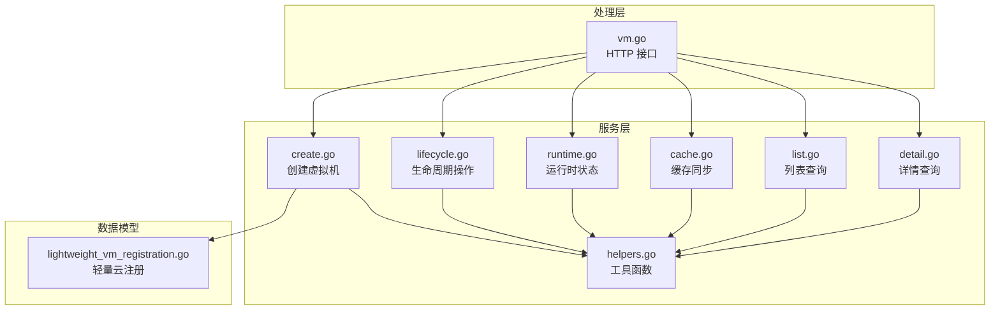
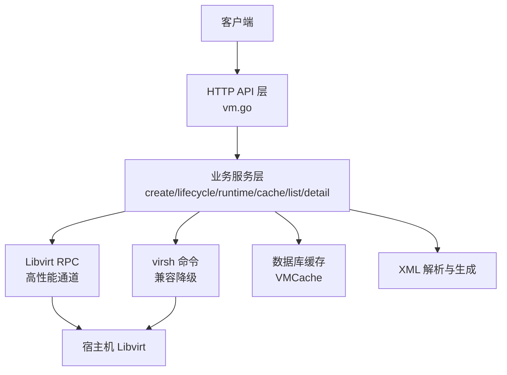
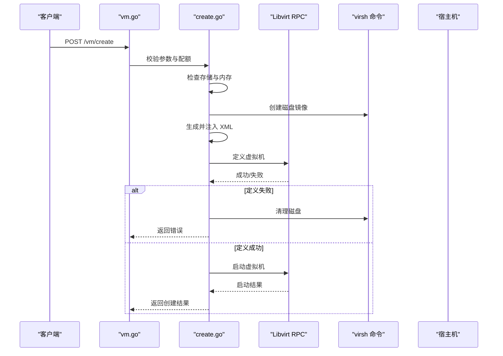
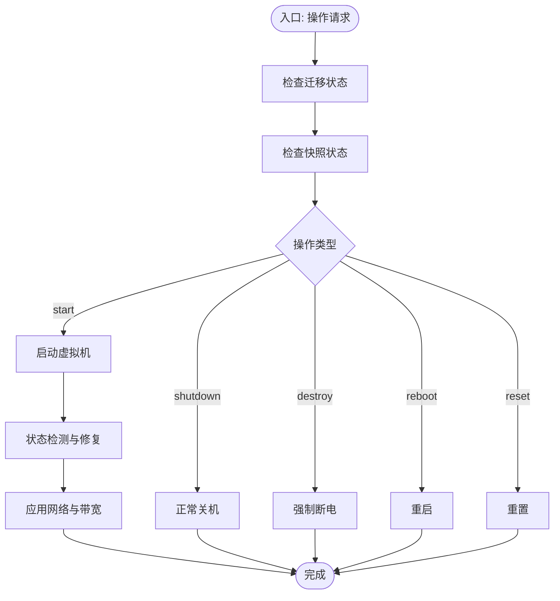
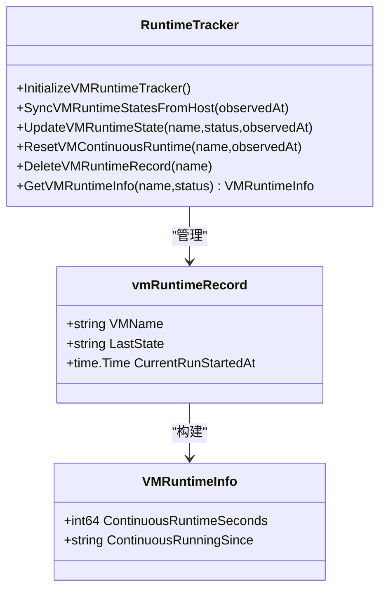
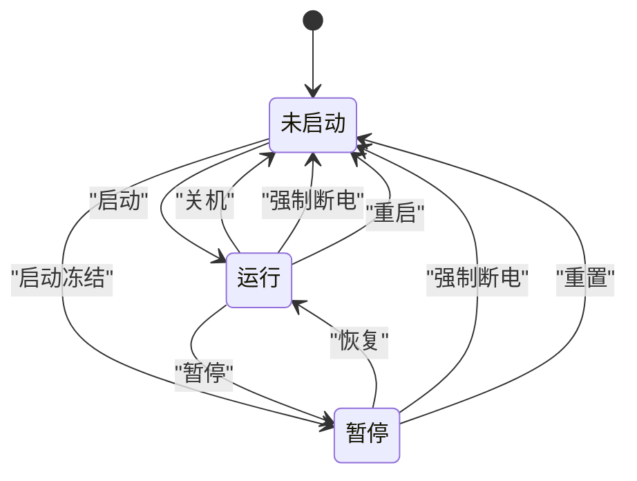
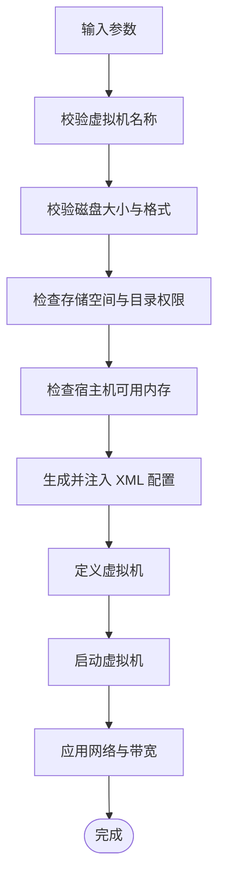
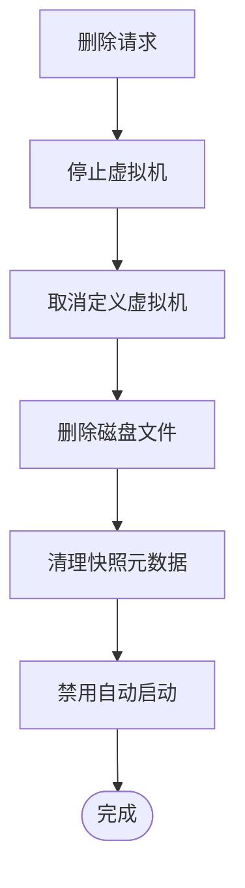
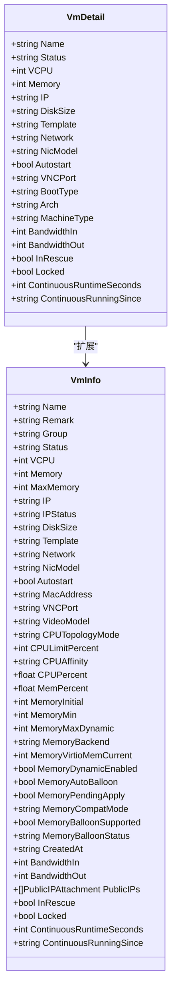
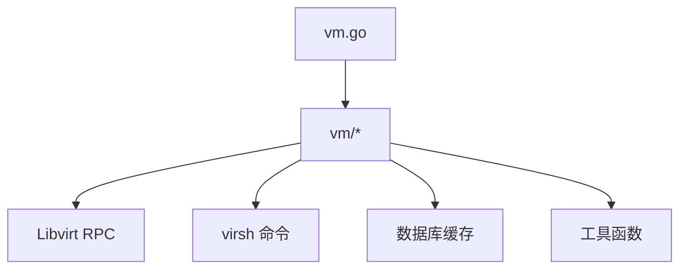

# 虚拟机生命周期管理

<cite>
**本文档引用的文件**
- [vm.go](file://server/handler/vm.go)
- [lifecycle.go](file://server/service/vm/lifecycle.go)
- [create.go](file://server/service/vm/create.go)
- [runtime.go](file://server/service/vm/runtime.go)
- [types.go](file://server/service/vm/types.go)
- [detail.go](file://server/service/vm/detail.go)
- [helpers.go](file://server/service/vm/helpers.go)
- [cache.go](file://server/service/vm/cache.go)
- [list.go](file://server/service/vm/list.go)
- [lightweight_vm_registration.go](file://server/model/lightweight_vm_registration.go)
</cite>

## 目录
1. [引言](#引言)
2. [项目结构](#项目结构)
3. [核心组件](#核心组件)
4. [架构概览](#架构概览)
5. [详细组件分析](#详细组件分析)
6. [依赖分析](#依赖分析)
7. [性能考虑](#性能考虑)
8. [故障排除指南](#故障排除指南)
9. [结论](#结论)
10. [附录](#附录)

## 引言
本文件全面阐述虚拟机生命周期管理的设计与实现，覆盖从创建到销毁的完整流程，包括状态转换逻辑、配置验证、资源分配与释放、异常处理策略以及最佳实践。系统通过 Libvirt RPC 与 virsh 命令相结合的方式实现高可靠性的虚拟机管理，同时提供缓存机制以优化性能。

## 项目结构
虚拟机生命周期相关代码主要分布在以下模块：
- 处理层（Handler）：对外提供 HTTP 接口，封装业务调用与错误响应
- 服务层（Service）：包含虚拟机创建、生命周期操作、运行时状态管理、缓存同步等核心逻辑
- 数据模型（Model）：定义虚拟机注册与配额等数据结构
- 工具与帮助函数：提供底层命令执行、XML 解析、状态检测等通用能力

**图表来源**
- [vm.go:1-352](file://server/handler/vm.go#L1-L352)
- [create.go:147-574](file://server/service/vm/create.go#L147-L574)
- [lifecycle.go:17-282](file://server/service/vm/lifecycle.go#L17-L282)
- [runtime.go:29-236](file://server/service/vm/runtime.go#L29-L236)
- [cache.go:163-440](file://server/service/vm/cache.go#L163-L440)
- [list.go:21-188](file://server/service/vm/list.go#L21-L188)
- [detail.go:23-175](file://server/service/vm/detail.go#L23-L175)
- [helpers.go:12-44](file://server/service/vm/helpers.go#L12-L44)
- [lightweight_vm_registration.go:5-56](file://server/model/lightweight_vm_registration.go#L5-L56)

**章节来源**
- [vm.go:81-352](file://server/handler/vm.go#L81-L352)
- [create.go:147-574](file://server/service/vm/create.go#L147-L574)
- [lifecycle.go:17-282](file://server/service/vm/lifecycle.go#L17-L282)
- [runtime.go:29-236](file://server/service/vm/runtime.go#L29-L236)
- [cache.go:163-440](file://server/service/vm/cache.go#L163-L440)
- [list.go:21-188](file://server/service/vm/list.go#L21-L188)
- [detail.go:23-175](file://server/service/vm/detail.go#L23-L175)
- [helpers.go:12-44](file://server/service/vm/helpers.go#L12-L44)
- [lightweight_vm_registration.go:5-56](file://server/model/lightweight_vm_registration.go#L5-L56)

## 核心组件
- 虚拟机创建组件：负责参数校验、磁盘创建、XML 生成与定义、启动与配置应用
- 生命周期操作组件：提供开机、关机、强制断电、重启、重置等操作，包含状态检查与异常处理
- 运行时状态组件：维护虚拟机连续运行时间与状态缓存，支持从宿主机同步
- 缓存同步组件：将宿主机状态同步至数据库缓存，支持增量更新与失效标记
- 查询组件：提供列表与详情查询，支持多种维度的数据聚合与降级策略
- 工具与帮助函数：封装底层命令执行、XML 解析、状态检测等通用能力

**章节来源**
- [create.go:17-61](file://server/service/vm/create.go#L17-L61)
- [lifecycle.go:17-282](file://server/service/vm/lifecycle.go#L17-L282)
- [runtime.go:12-236](file://server/service/vm/runtime.go#L12-L236)
- [cache.go:163-440](file://server/service/vm/cache.go#L163-L440)
- [list.go:21-188](file://server/service/vm/list.go#L21-L188)
- [detail.go:23-175](file://server/service/vm/detail.go#L23-L175)
- [helpers.go:12-44](file://server/service/vm/helpers.go#L12-L44)

## 架构概览
系统采用分层架构，处理层负责接口与鉴权，服务层承载业务逻辑，底层通过 Libvirt RPC 与 virsh 命令交互宿主机，数据层提供缓存与持久化支持。

**图表来源**
- [vm.go:214-352](file://server/handler/vm.go#L214-L352)
- [lifecycle.go:43-159](file://server/service/vm/lifecycle.go#L43-L159)
- [cache.go:163-229](file://server/service/vm/cache.go#L163-L229)
- [list.go:30-50](file://server/service/vm/list.go#L30-L50)

## 详细组件分析

### 虚拟机创建流程
创建流程涵盖参数校验、磁盘准备、XML 生成、定义与启动等步骤，并进行资源检查与错误回滚。

**图表来源**
- [vm.go:354-800](file://server/handler/vm.go#L354-L800)
- [create.go:147-574](file://server/service/vm/create.go#L147-L574)

**章节来源**
- [create.go:147-574](file://server/service/vm/create.go#L147-L574)
- [vm.go:354-800](file://server/handler/vm.go#L354-L800)

### 虚拟机生命周期操作
生命周期操作包含开机、关机、强制断电、重启、重置等，均包含状态检查与异常处理。

**图表来源**
- [lifecycle.go:43-282](file://server/service/vm/lifecycle.go#L43-L282)

**章节来源**
- [lifecycle.go:17-282](file://server/service/vm/lifecycle.go#L17-L282)

### 运行时状态管理
运行时状态组件维护虚拟机连续运行时间与状态缓存，支持从宿主机同步与降级策略。

**图表来源**
- [runtime.go:12-236](file://server/service/vm/runtime.go#L12-L236)

**章节来源**
- [runtime.go:12-236](file://server/service/vm/runtime.go#L12-L236)

### 虚拟机状态转换逻辑
系统通过 Libvirt RPC 与 virsh 命令获取与更新虚拟机状态，支持运行、暂停、崩溃、PM 暂停等多种状态的识别与处理。

**图表来源**
- [lifecycle.go:74-105](file://server/service/vm/lifecycle.go#L74-L105)
- [lifecycle.go:201-260](file://server/service/vm/lifecycle.go#L201-L260)

**章节来源**
- [lifecycle.go:74-105](file://server/service/vm/lifecycle.go#L74-L105)
- [lifecycle.go:201-260](file://server/service/vm/lifecycle.go#L201-L260)

### 虚拟机配置验证与资源分配
配置验证涵盖名称、磁盘大小、网络、CPU/内存、PCIe 热插槽等；资源分配包括存储空间检查、宿主机内存预留与系统开销缓冲。

**图表来源**
- [create.go:150-236](file://server/service/vm/create.go#L150-L236)
- [create.go:227-236](file://server/service/vm/create.go#L227-L236)

**章节来源**
- [create.go:150-236](file://server/service/vm/create.go#L150-L236)
- [create.go:227-236](file://server/service/vm/create.go#L227-L236)

### 虚拟机删除与清理机制
删除流程涉及卸载/删除磁盘、清理快照元数据、取消自动启动等步骤，确保资源完全释放。

**图表来源**
- [create.go:496-501](file://server/service/vm/create.go#L496-L501)

**章节来源**
- [create.go:496-501](file://server/service/vm/create.go#L496-L501)

### 虚拟机配置与详情查询
详情查询整合运行时状态、网络、磁盘、带宽、动态内存等多维信息，并支持缓存与降级策略。

**图表来源**
- [types.go:21-105](file://server/service/vm/types.go#L21-L105)
- [detail.go:23-175](file://server/service/vm/detail.go#L23-L175)

**章节来源**
- [types.go:21-105](file://server/service/vm/types.go#L21-L105)
- [detail.go:23-175](file://server/service/vm/detail.go#L23-L175)

## 依赖分析
- 处理层依赖服务层提供的业务方法，统一错误处理与响应格式
- 服务层依赖 Libvirt RPC 与 virsh 命令，实现高性能与兼容性双重保障
- 缓存层依赖数据库模型，提供列表与详情查询的性能优化
- 工具层提供底层命令执行与 XML 解析，支撑上层业务逻辑

**图表来源**
- [vm.go:81-352](file://server/handler/vm.go#L81-L352)
- [lifecycle.go:43-159](file://server/service/vm/lifecycle.go#L43-L159)
- [cache.go:163-229](file://server/service/vm/cache.go#L163-L229)

**章节来源**
- [vm.go:81-352](file://server/handler/vm.go#L81-L352)
- [lifecycle.go:43-159](file://server/service/vm/lifecycle.go#L43-L159)
- [cache.go:163-229](file://server/service/vm/cache.go#L163-L229)

## 性能考虑
- 优先使用 Libvirt RPC 进行状态查询与操作，必要时降级为 virsh 命令
- 通过缓存机制减少频繁的底层调用，提升列表与详情查询性能
- 对磁盘与网络操作进行批量处理，避免重复扫描与解析
- 在启动与重启后异步触发带宽重新分配，避免阻塞主流程

## 故障排除指南
- 启动失败：检查权限问题（如 AppArmor/权限拒绝），自动修复后重试
- 恢复失败：当虚拟机处于 QEMU 内部错误暂停状态时，需重置或强制断电后重启
- 状态异常：系统自动检测崩溃、PM 暂停等异常状态并进行强制关闭与重启
- 缓存不同步：管理员访问列表时触发缓存刷新，确保数据一致性

**章节来源**
- [lifecycle.go:142-153](file://server/service/vm/lifecycle.go#L142-L153)
- [lifecycle.go:174-184](file://server/service/vm/lifecycle.go#L174-L184)
- [lifecycle.go:101-105](file://server/service/vm/lifecycle.go#L101-L105)
- [cache.go:45-75](file://server/service/vm/cache.go#L45-L75)

## 结论
该虚拟机生命周期管理系统通过清晰的分层设计与完善的异常处理机制，实现了从创建到销毁的全生命周期管理。结合缓存与降级策略，系统在保证功能完整性的同时兼顾了性能与稳定性。建议在生产环境中配合监控与告警机制，持续优化资源配置与运维流程。

## 附录
- 轻量云虚拟机注册模型：支持待开通服务器配置与状态管理
- 虚拟机统计信息：包含 CPU、内存、网络、磁盘等资源使用情况
- 网络与存储：支持 VPC 绑定、带宽限制、IOPS 限制等高级特性

**章节来源**
- [lightweight_vm_registration.go:5-56](file://server/model/lightweight_vm_registration.go#L5-L56)
- [types.go:107-151](file://server/service/vm/types.go#L107-L151)
- [list.go:144-183](file://server/service/vm/list.go#L144-L183)