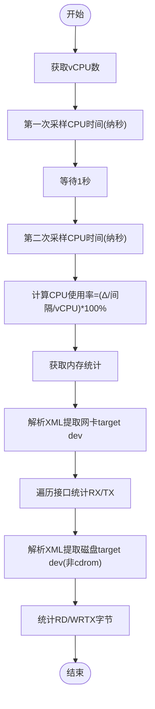
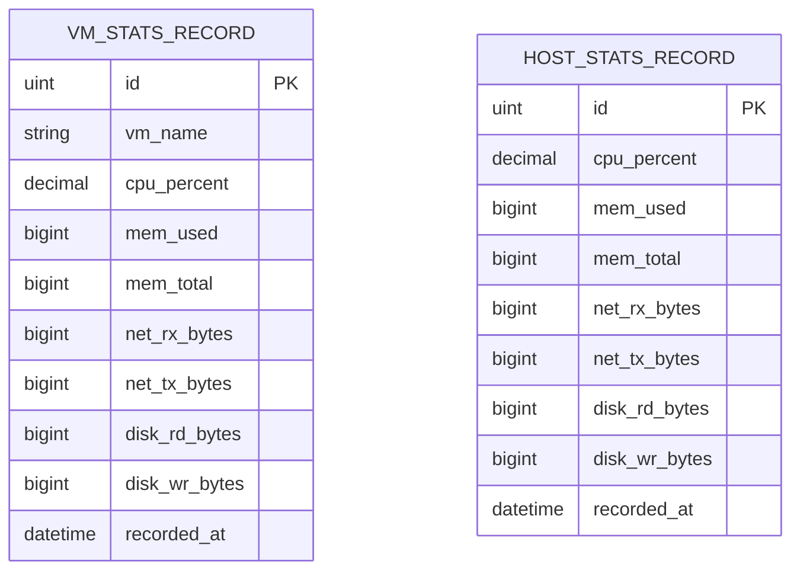
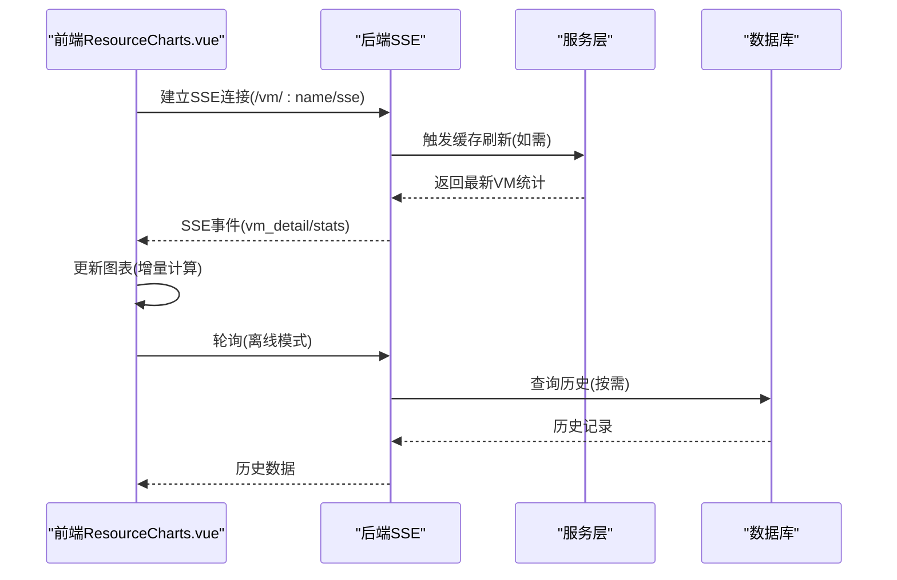
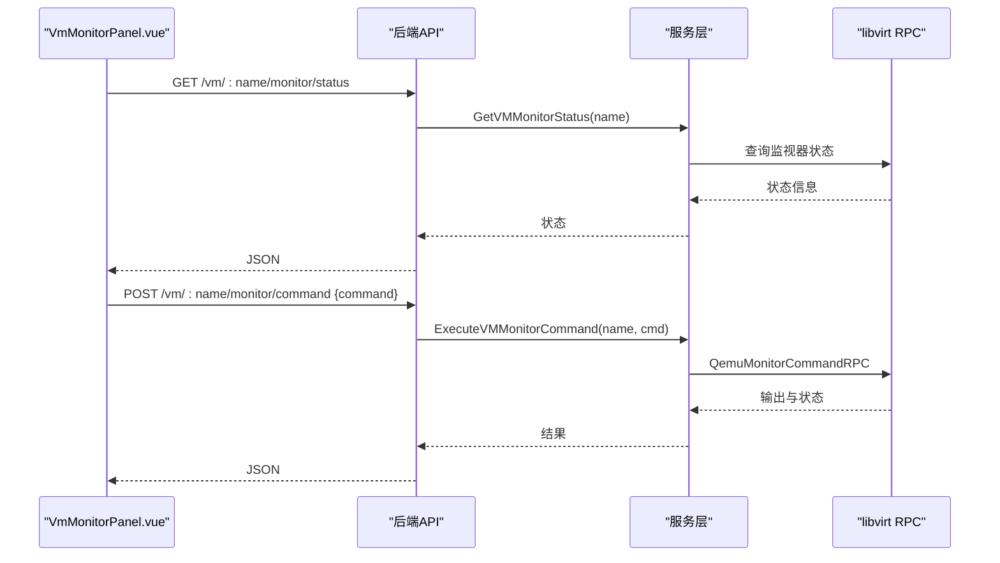
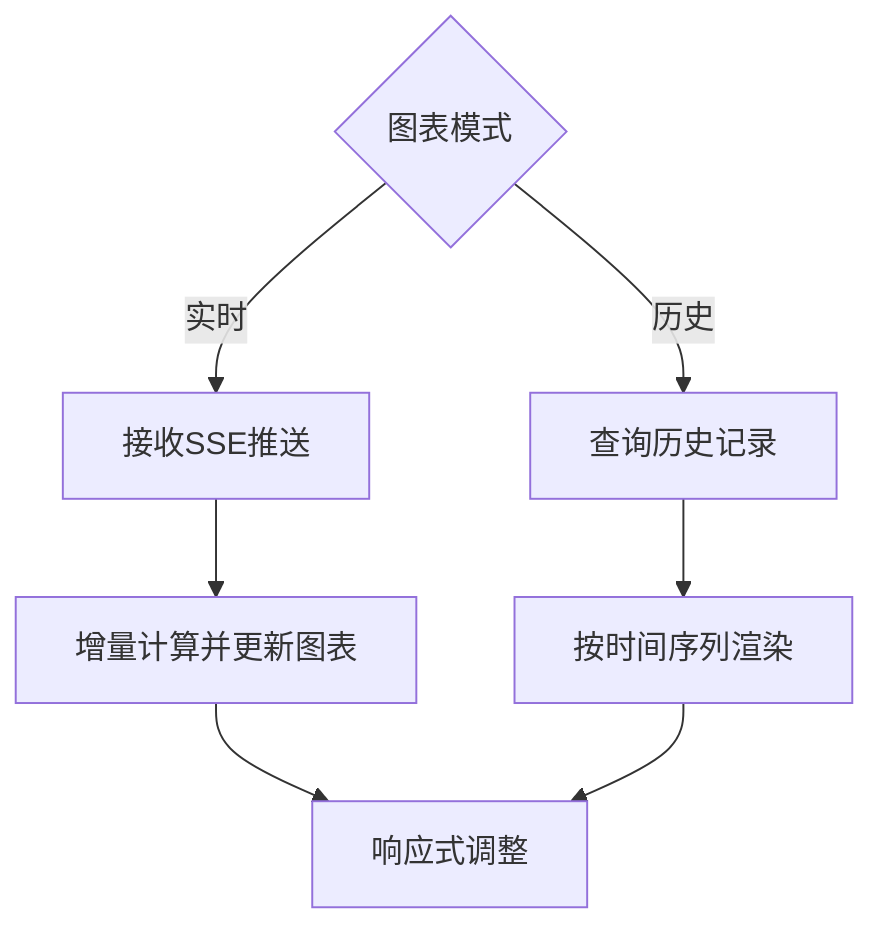
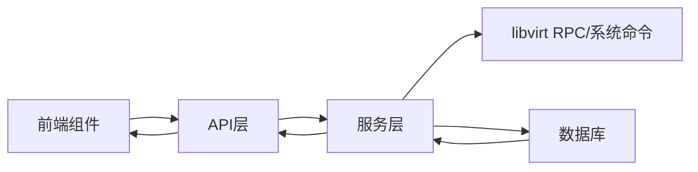

# 虚拟机监控与统计

<cite>
**本文档引用的文件**
- [server/handler/vm_monitor.go](file://server/handler/vm_monitor.go)
- [server/service/host/stats_collector.go](file://server/service/host/stats_collector.go)
- [server/service/vm/stats.go](file://server/service/vm/stats.go)
- [server/service/libvirt_rpc/domain.go](file://server/service/libvirt_rpc/domain.go)
- [server/model/vm_stats_record.go](file://server/model/vm_stats_record.go)
- [server/model/host_stats_record.go](file://server/model/host_stats_record.go)
- [web/src/components/VmMonitorPanel.vue](file://web/src/components/VmMonitorPanel.vue)
- [web/src/components/ResourceCharts.vue](file://web/src/components/ResourceCharts.vue)
- [web/src/api/vm.js](file://web/src/api/vm.js)
- [server/handler/vm_sse.go](file://server/handler/vm_sse.go)
- [server/router/router.go](file://server/router/router.go)
</cite>

## 目录
1. [简介](#简介)
2. [项目结构](#项目结构)
3. [核心组件](#核心组件)
4. [架构总览](#架构总览)
5. [详细组件分析](#详细组件分析)
6. [依赖关系分析](#依赖关系分析)
7. [性能考量](#性能考量)
8. [故障排查指南](#故障排查指南)
9. [结论](#结论)
10. [附录](#附录)

## 简介
本项目提供一套完整的虚拟机监控与统计系统，涵盖以下能力：
- 实时性能指标采集：CPU 使用率、内存占用、磁盘 I/O、网络流量
- 历史数据存储与查询：数据库持久化、按时间范围检索
- 实时监控与可视化：前端图表展示、SSE 实时推送
- 开发者监视器：通过 QEMU Monitor 命令进行调试与诊断
- 告警与配额：基于运行时长的配额预警与自动关机流程（与监控数据协同）

## 项目结构
后端采用 Go 语言与 Gin 框架，服务层封装 libvirt RPC 与系统命令，模型层定义数据库表结构；前端使用 Vue 3 + Element Plus，通过 API 与 SSE 与后端交互。

```mermaid
graph TB
subgraph "前端(Web)"
A[VmMonitorPanel.vue]
B[ResourceCharts.vue]
C[vm.js(API)]
end
subgraph "后端(Server)"
D[handler/vm_monitor.go]
E[handler/vm_sse.go]
F[service/host/stats_collector.go]
G[service/vm/stats.go]
H[service/libvirt_rpc/domain.go]
I[model/vm_stats_record.go]
J[model/host_stats_record.go]
end
A --> C
B --> C
C --> D
C --> E
D --> H
E --> F
F --> I
F --> J
G --> H
```

**图示来源**
- [web/src/components/VmMonitorPanel.vue:135-289](file://web/src/components/VmMonitorPanel.vue#L135-L289)
- [web/src/components/ResourceCharts.vue:173-282](file://web/src/components/ResourceCharts.vue#L173-L282)
- [web/src/api/vm.js:299-313](file://web/src/api/vm.js#L299-L313)
- [server/handler/vm_monitor.go:16-77](file://server/handler/vm_monitor.go#L16-L77)
- [server/handler/vm_sse.go:14-57](file://server/handler/vm_sse.go#L14-L57)
- [server/service/host/stats_collector.go:33-73](file://server/service/host/stats_collector.go#L33-L73)
- [server/service/vm/stats.go:18-186](file://server/service/vm/stats.go#L18-L186)
- [server/service/libvirt_rpc/domain.go:183-200](file://server/service/libvirt_rpc/domain.go#L183-L200)
- [server/model/vm_stats_record.go:7-19](file://server/model/vm_stats_record.go#L7-L19)
- [server/model/host_stats_record.go:5-16](file://server/model/host_stats_record.go#L5-L16)

**章节来源**
- [server/handler/vm_monitor.go:1-78](file://server/handler/vm_monitor.go#L1-L78)
- [server/service/host/stats_collector.go:1-366](file://server/service/host/stats_collector.go#L1-L366)
- [server/service/vm/stats.go:1-333](file://server/service/vm/stats.go#L1-L333)
- [server/service/libvirt_rpc/domain.go:1-961](file://server/service/libvirt_rpc/domain.go#L1-L961)
- [server/model/vm_stats_record.go:1-20](file://server/model/vm_stats_record.go#L1-L20)
- [server/model/host_stats_record.go:1-17](file://server/model/host_stats_record.go#L1-L17)
- [web/src/components/VmMonitorPanel.vue:1-450](file://web/src/components/VmMonitorPanel.vue#L1-L450)
- [web/src/components/ResourceCharts.vue:173-409](file://web/src/components/ResourceCharts.vue#L173-L409)
- [web/src/api/vm.js:1-705](file://web/src/api/vm.js#L1-L705)
- [server/handler/vm_sse.go:1-60](file://server/handler/vm_sse.go#L1-L60)
- [server/router/router.go:115-115](file://server/router/router.go#L115-L115)

## 核心组件
- 指标采集与缓存
  - 后台定时采集运行中虚拟机的 CPU、内存、网络、磁盘 I/O 指标，写入内存缓存并定期持久化到数据库。
  - 宿主机指标同样采集并缓存，周期性持久化。
- 历史数据管理
  - 提供按日期范围查询虚拟机与宿主机的历史记录接口。
- 实时监控与推送
  - SSE 推送虚拟机列表与详情变更；前端图表根据 SSE 或轮询更新。
- 开发者监视器
  - 通过 QEMU Monitor 命令进行调试，支持常用安全命令与快捷按钮。
- 数据模型
  - 定义虚拟机与宿主机的历史记录表结构，包含时间索引与常用字段。

**章节来源**
- [server/service/host/stats_collector.go:33-73](file://server/service/host/stats_collector.go#L33-L73)
- [server/service/host/stats_collector.go:259-306](file://server/service/host/stats_collector.go#L259-L306)
- [server/service/host/stats_collector.go:342-358](file://server/service/host/stats_collector.go#L342-L358)
- [server/model/vm_stats_record.go:7-19](file://server/model/vm_stats_record.go#L7-L19)
- [server/model/host_stats_record.go:5-16](file://server/model/host_stats_record.go#L5-L16)
- [web/src/api/vm.js:36-40](file://web/src/api/vm.js#L36-L40)
- [web/src/api/vm.js:137-153](file://web/src/api/vm.js#L137-L153)
- [web/src/components/VmMonitorPanel.vue:135-289](file://web/src/components/VmMonitorPanel.vue#L135-L289)

## 架构总览
系统采用“采集-缓存-持久化-查询-推送-展示”的闭环架构。采集器定时从 libvirt 与系统命令获取指标，写入内存缓存并在后台持久化；前端通过 API 与 SSE 获取实时/历史数据并渲染图表。

```mermaid
sequenceDiagram
participant FE as "前端"
participant API as "后端API"
participant SVC as "服务层"
participant LIB as "libvirt RPC/系统命令"
participant DB as "数据库"
FE->>API : 请求虚拟机实时统计
API->>SVC : GetVMStats(name)
SVC->>LIB : 两次采样计算CPU/内存/网络/磁盘
LIB-->>SVC : 指标数据
SVC-->>API : VmStats
API-->>FE : JSON响应
loop 后台定时
SVC->>LIB : 批量采集运行中VM
LIB-->>SVC : 指标集合
SVC->>SVC : 写入内存缓存
SVC->>DB : 每分钟持久化一批
end
```



**图示来源**
- [server/service/vm/stats.go:18-186](file://server/service/vm/stats.go#L18-L186)
- [server/service/host/stats_collector.go:33-73](file://server/service/host/stats_collector.go#L33-L73)
- [server/service/host/stats_collector.go:259-306](file://server/service/host/stats_collector.go#L259-L306)
- [server/service/libvirt_rpc/domain.go:183-200](file://server/service/libvirt_rpc/domain.go#L183-L200)

## 详细组件分析

### 指标采集与计算
- CPU 使用率
  - 通过 libvirt RPC 获取两次 CPU 时间（纳秒），间隔 1 秒，计算公式为：(Δcpu_time / 采样间隔 / vCPU数) × 100%，并限制最大 100%。
- 内存使用
  - 优先使用内存统计接口，回退到 virsh dommemstat；内存使用按实际可用与总内存计算。
- 网络 I/O
  - 从 domain XML 提取网卡 target dev，遍历接口统计 RX/TX 字节，累加得到总值。
- 磁盘 I/O
  - 从 domain XML 提取第一个非 cdrom 磁盘 target dev，统计读写字节。



**图示来源**
- [server/service/host/stats_collector.go:149-223](file://server/service/host/stats_collector.go#L149-L223)
- [server/service/vm/stats.go:18-186](file://server/service/vm/stats.go#L18-L186)
- [server/service/libvirt_rpc/domain.go:183-200](file://server/service/libvirt_rpc/domain.go#L183-L200)

**章节来源**
- [server/service/host/stats_collector.go:149-223](file://server/service/host/stats_collector.go#L149-L223)
- [server/service/vm/stats.go:18-186](file://server/service/vm/stats.go#L18-L186)
- [server/service/libvirt_rpc/domain.go:183-200](file://server/service/libvirt_rpc/domain.go#L183-L200)

### 历史数据存储与查询
- 存储结构
  - 虚拟机历史记录：包含 VM 名称、CPU 百分比、内存使用/总量、网络 RX/TX、磁盘 RD/WR、记录时间。
  - 宿主机历史记录：包含 CPU 百分比、内存使用/总量、网络 RX/TX、磁盘 RD/WR、记录时间。
- 持久化策略
  - 每 60 秒将内存缓存中的快照批量写入数据库。
- 查询接口
  - 支持按起止时间查询虚拟机与宿主机的历史记录，按时间升序排列。



**图示来源**
- [server/model/vm_stats_record.go:7-19](file://server/model/vm_stats_record.go#L7-L19)
- [server/model/host_stats_record.go:5-16](file://server/model/host_stats_record.go#L5-L16)

**章节来源**
- [server/service/host/stats_collector.go:259-306](file://server/service/host/stats_collector.go#L259-L306)
- [server/service/host/stats_collector.go:342-358](file://server/service/host/stats_collector.go#L342-L358)
- [server/model/vm_stats_record.go:7-19](file://server/model/vm_stats_record.go#L7-L19)
- [server/model/host_stats_record.go:5-16](file://server/model/host_stats_record.go#L5-L16)

### 实时监控与 WebSocket/SSE
- SSE 推送
  - 虚拟机列表与详情通过 SSE 持续推送，前端监听事件并更新界面。
  - 虚拟机详情 SSE：/api/vm/:name/sse
- 前端集成
  - ResourceCharts.vue 在实时模式下接收外部 stats 推送，或在离线模式下轮询获取数据并更新图表。
  - VmMonitorPanel.vue 通过 API 获取监视器状态与执行命令，支持快捷命令与自定义命令。



**图示来源**
- [web/src/api/vm.js:36-40](file://web/src/api/vm.js#L36-L40)
- [server/handler/vm_sse.go:59-93](file://server/handler/vm_sse.go#L59-L93)
- [web/src/components/ResourceCharts.vue:173-282](file://web/src/components/ResourceCharts.vue#L173-L282)
- [server/service/host/stats_collector.go:309-325](file://server/service/host/stats_collector.go#L309-L325)

**章节来源**
- [web/src/api/vm.js:36-40](file://web/src/api/vm.js#L36-L40)
- [server/handler/vm_sse.go:14-57](file://server/handler/vm_sse.go#L14-L57)
- [web/src/components/ResourceCharts.vue:173-282](file://web/src/components/ResourceCharts.vue#L173-L282)
- [server/router/router.go:115-115](file://server/router/router.go#L115-L115)

### 开发者监视器（QEMU Monitor）
- 状态获取与命令执行
  - 通过 API 获取监视器状态与执行命令，支持常用安全命令（如 c、stop、info ...、system_reset、system_powerdown、system_wakeup、sendkey ...）。
- 权限与提示
  - 前端显示权限提示与操作确认对话框，避免误操作。
- 后端实现
  - handler 层接收请求并调用服务层执行 QEMU Monitor 命令，返回结果与状态。



**图示来源**
- [web/src/components/VmMonitorPanel.vue:135-289](file://web/src/components/VmMonitorPanel.vue#L135-L289)
- [web/src/api/vm.js:298-313](file://web/src/api/vm.js#L298-L313)
- [server/handler/vm_monitor.go:16-77](file://server/handler/vm_monitor.go#L16-L77)
- [server/service/libvirt_rpc/domain.go:545-562](file://server/service/libvirt_rpc/domain.go#L545-L562)

**章节来源**
- [web/src/components/VmMonitorPanel.vue:135-289](file://web/src/components/VmMonitorPanel.vue#L135-L289)
- [web/src/api/vm.js:298-313](file://web/src/api/vm.js#L298-L313)
- [server/handler/vm_monitor.go:16-77](file://server/handler/vm_monitor.go#L16-L77)
- [server/service/libvirt_rpc/domain.go:545-562](file://server/service/libvirt_rpc/domain.go#L545-L562)

### 图表展示与历史查询
- 实时模式
  - 接收 SSE 推送的 stats，按 3 秒（SSE）或 5 秒（轮询）增量计算网络与磁盘速率，更新图表。
- 历史模式
  - 选择日期范围后查询历史记录，按时间升序渲染图表。
- 图表组件
  - 包含 CPU 使用率、内存使用率、网络流量、磁盘 I/O 四个子图，支持切换模式与自适应布局。



**图示来源**
- [web/src/components/ResourceCharts.vue:173-282](file://web/src/components/ResourceCharts.vue#L173-L282)
- [web/src/components/ResourceCharts.vue:238-282](file://web/src/components/ResourceCharts.vue#L238-L282)
- [web/src/api/vm.js:146-153](file://web/src/api/vm.js#L146-L153)

**章节来源**
- [web/src/components/ResourceCharts.vue:173-282](file://web/src/components/ResourceCharts.vue#L173-L282)
- [web/src/components/ResourceCharts.vue:238-282](file://web/src/components/ResourceCharts.vue#L238-L282)
- [web/src/api/vm.js:146-153](file://web/src/api/vm.js#L146-L153)

## 依赖关系分析
- 采集层依赖 libvirt RPC 与系统命令，提供高精度指标；当 RPC 不可用时回退到 virsh 命令。
- 服务层负责缓存与持久化，避免频繁访问底层接口。
- 前端通过 API 与 SSE 获取数据，图表组件负责可视化与交互。
- 数据模型统一了历史记录的字段与索引设计，便于查询与扩展。



**图示来源**
- [server/service/host/stats_collector.go:33-73](file://server/service/host/stats_collector.go#L33-L73)
- [server/service/vm/stats.go:18-186](file://server/service/vm/stats.go#L18-L186)
- [server/service/libvirt_rpc/domain.go:183-200](file://server/service/libvirt_rpc/domain.go#L183-L200)
- [server/model/vm_stats_record.go:7-19](file://server/model/vm_stats_record.go#L7-L19)
- [server/model/host_stats_record.go:5-16](file://server/model/host_stats_record.go#L5-L16)

**章节来源**
- [server/service/host/stats_collector.go:33-73](file://server/service/host/stats_collector.go#L33-L73)
- [server/service/vm/stats.go:18-186](file://server/service/vm/stats.go#L18-L186)
- [server/service/libvirt_rpc/domain.go:183-200](file://server/service/libvirt_rpc/domain.go#L183-L200)
- [server/model/vm_stats_record.go:7-19](file://server/model/vm_stats_record.go#L7-L19)
- [server/model/host_stats_record.go:5-16](file://server/model/host_stats_record.go#L5-L16)

## 性能考量
- 采集频率
  - 运行中 VM 指标每 10 秒采集一次，历史持久化每 60 秒一次，兼顾实时性与系统开销。
- 内存缓存
  - 采用读写锁保护的内存缓存，减少数据库压力；仅保留活跃 VM 的最新数据。
- 增量计算
  - 图表侧按时间间隔对字节计数做增量计算，降低带宽与前端渲染压力。
- 回退策略
  - libvirt RPC 失败时自动回退到 virsh 命令，保证监控可用性。

[本节为通用指导，无需特定文件引用]

## 故障排查指南
- 监控命令执行失败
  - 检查后端日志与 libvirt 连接状态；确认命令权限与虚拟机状态。
- SSE 连接断开
  - 前端自动重连；检查网络与跨域配置；确认后端 SSE 事件通道正常。
- 历史数据缺失
  - 确认采集器是否正常运行与数据库写入；检查查询时间范围与索引。
- 图表无数据
  - 确认实时模式下的 SSE 推送或轮询是否启用；检查浏览器控制台与网络面板。

**章节来源**
- [web/src/components/VmMonitorPanel.vue:135-289](file://web/src/components/VmMonitorPanel.vue#L135-L289)
- [server/handler/vm_sse.go:14-57](file://server/handler/vm_sse.go#L14-L57)
- [server/service/host/stats_collector.go:33-73](file://server/service/host/stats_collector.go#L33-L73)

## 结论
本系统通过 libvirt RPC 与系统命令结合的方式，实现了高精度的虚拟机性能指标采集；借助内存缓存与定时持久化，平衡了实时性与系统负载；SSE 与前端图表提供了直观的可视化体验；开发者监视器增强了运维与调试能力。建议在生产环境中持续监控采集器健康度与数据库写入性能，并根据业务需求调整采集与推送频率。

[本节为总结性内容，无需特定文件引用]

## 附录
- 常用接口
  - 获取虚拟机实时统计：GET /api/vm/:name/stats
  - 获取虚拟机历史统计：GET /api/vm/:name/stats/history?start=&end=
  - 虚拟机详情 SSE：/api/vm/:name/sse
  - 获取监视器状态：GET /api/vm/:name/monitor/status
  - 执行监视器命令：POST /api/vm/:name/monitor/command

**章节来源**
- [web/src/api/vm.js:137-153](file://web/src/api/vm.js#L137-L153)
- [web/src/api/vm.js:36-40](file://web/src/api/vm.js#L36-L40)
- [web/src/api/vm.js:298-313](file://web/src/api/vm.js#L298-L313)
- [server/router/router.go:115-115](file://server/router/router.go#L115-L115)