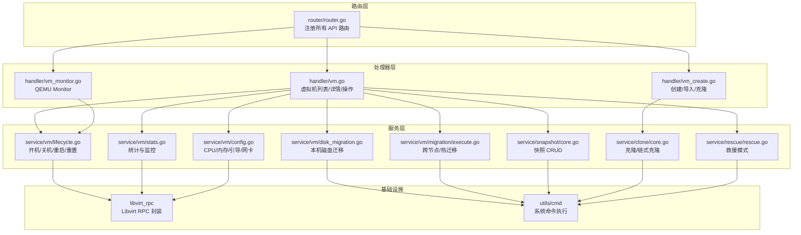
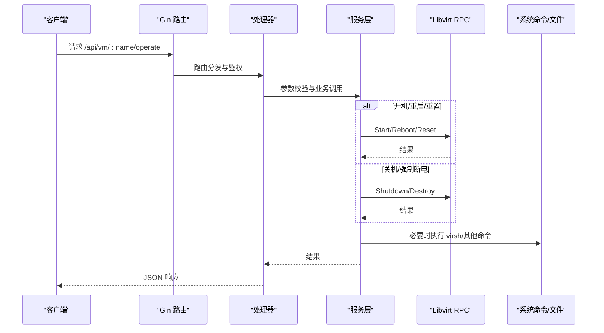
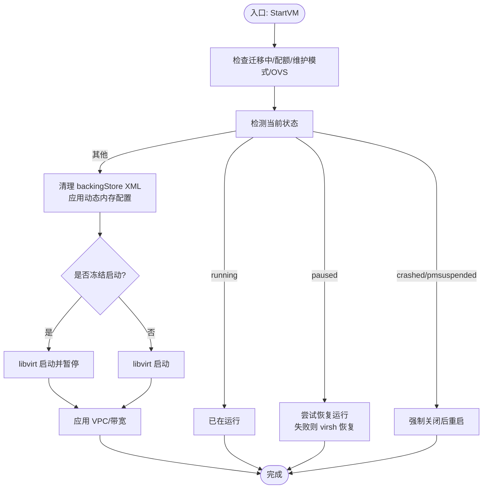
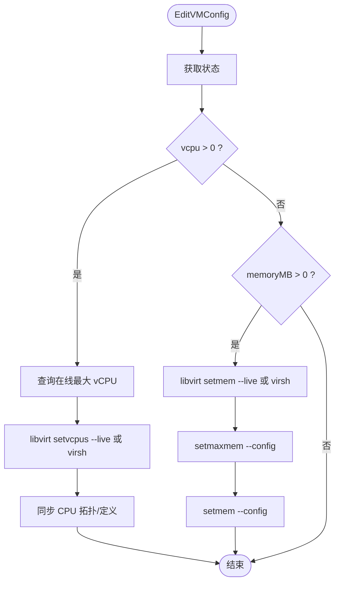
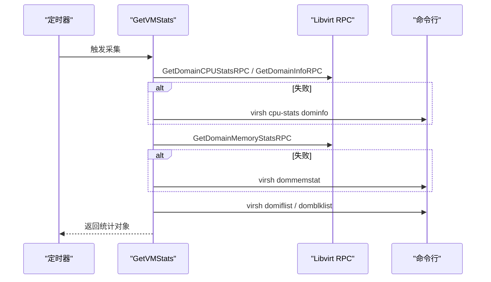
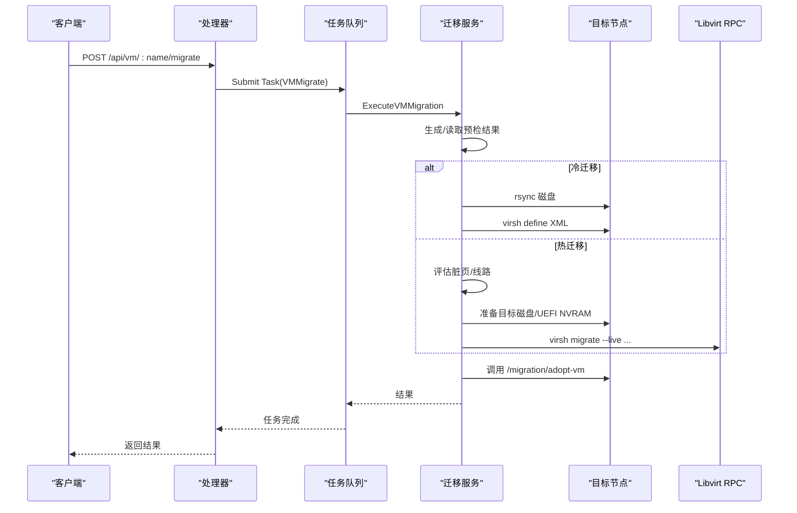
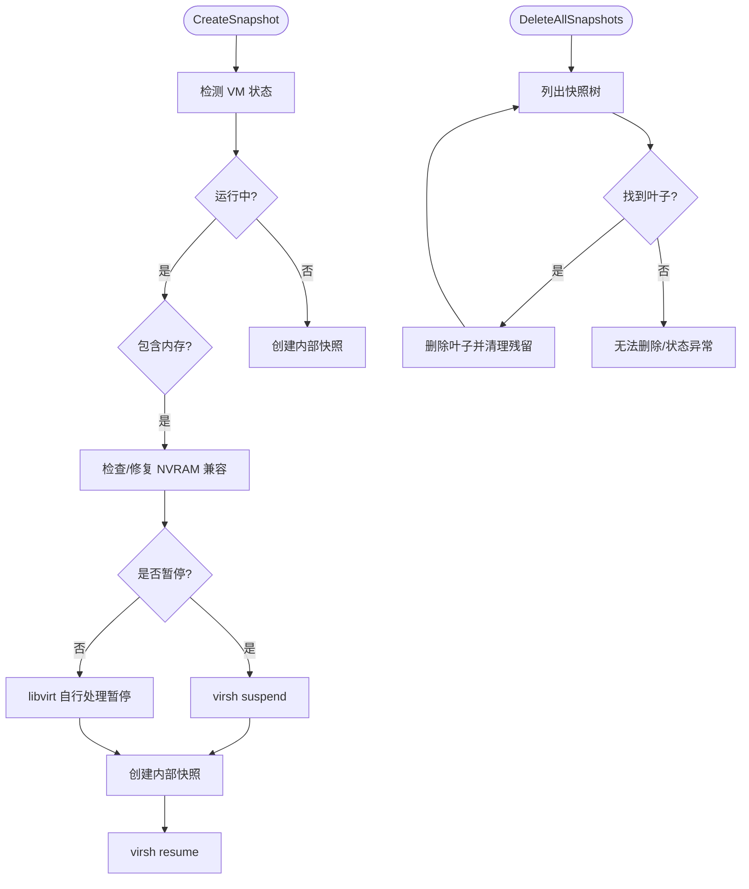
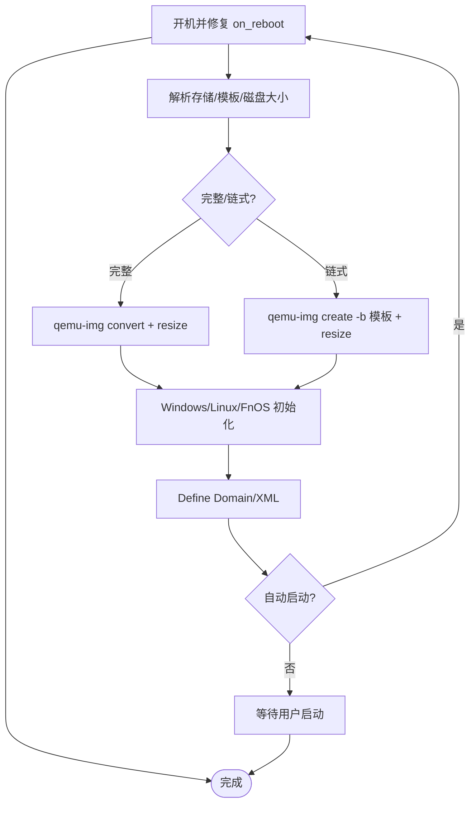
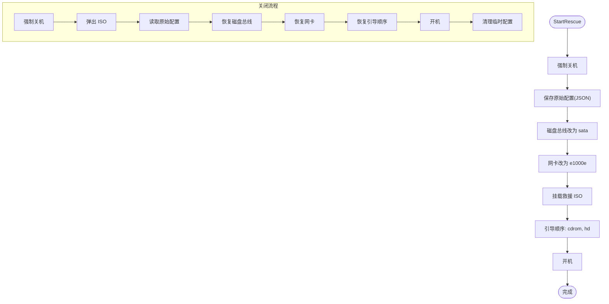
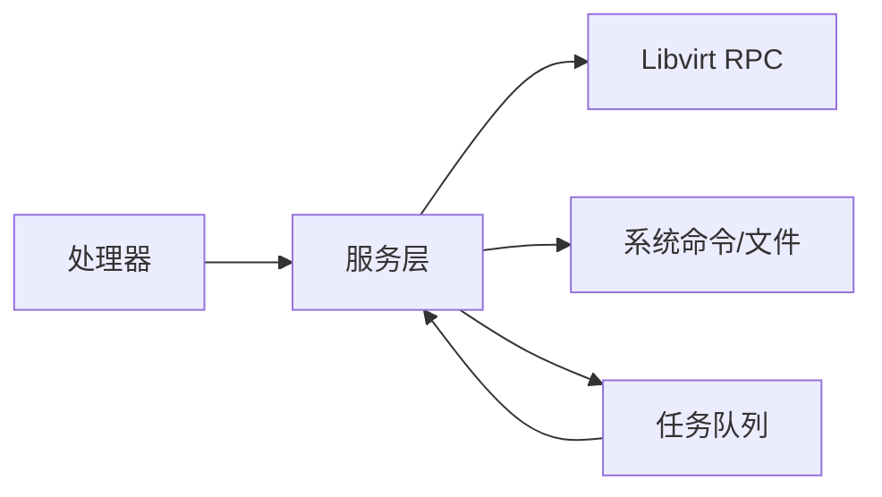

# 虚拟机管理

<cite>
**本文引用的文件**
- [server/main.go](file://server/main.go)
- [server/router/router.go](file://server/router/router.go)
- [server/handler/vm.go](file://server/handler/vm.go)
- [server/handler/vm_create.go](file://server/handler/vm_create.go)
- [server/handler/vm_monitor.go](file://server/handler/vm_monitor.go)
- [server/service/vm/lifecycle.go](file://server/service/vm/lifecycle.go)
- [server/service/vm/stats.go](file://server/service/vm/stats.go)
- [server/service/vm/config.go](file://server/service/vm/config.go)
- [server/service/vm/runtime.go](file://server/service/vm/runtime.go)
- [server/service/vm/helpers.go](file://server/service/vm/helpers.go)
- [server/service/vm/disk_migration.go](file://server/service/vm/disk_migration.go)
- [server/service/vm/migration/execute.go](file://server/service/vm/migration/execute.go)
- [server/service/snapshot/core.go](file://server/service/snapshot/core.go)
- [server/service/clone/core.go](file://server/service/clone/core.go)
- [server/service/rescue/rescue.go](file://server/service/rescue/rescue.go)
</cite>

## 目录
1. [简介](#简介)
2. [项目结构](#项目结构)
3. [核心组件](#核心组件)
4. [架构总览](#架构总览)
5. [详细组件分析](#详细组件分析)
6. [依赖分析](#依赖分析)
7. [性能考虑](#性能考虑)
8. [故障排查指南](#故障排查指南)
9. [结论](#结论)

## 简介
本文件面向 Open 虚拟机管理系统，系统基于 Go 语言与 Libvirt/KVM 技术栈，提供完整的虚拟机生命周期管理、配置与资源调度、监控与统计、迁移、快照与克隆、救援模式等功能。本文档从架构、组件、数据流、处理逻辑、集成点、错误处理与性能优化等维度进行深入解读，帮助开发者与运维人员快速理解与高效使用。

## 项目结构
后端采用“路由层-处理器层-服务层-工具层”的分层设计：
- 路由层：统一注册 REST 接口，按模块分组并应用鉴权与限流中间件。
- 处理器层：接收请求、参数校验、调用服务层并返回标准响应。
- 服务层：封装业务逻辑，调用 Libvirt RPC、系统命令与存储/网络模块。
- 工具层：封装系统命令执行、文件与磁盘操作、解析工具等。

图示来源
- [server/router/router.go:1-539](file://server/router/router.go#L1-L539)
- [server/handler/vm.go:1-1057](file://server/handler/vm.go#L1-L1057)
- [server/handler/vm_create.go:1-399](file://server/handler/vm_create.go#L1-L399)
- [server/handler/vm_monitor.go:1-78](file://server/handler/vm_monitor.go#L1-L78)
- [server/service/vm/lifecycle.go:1-282](file://server/service/vm/lifecycle.go#L1-L282)
- [server/service/vm/stats.go:1-333](file://server/service/vm/stats.go#L1-L333)
- [server/service/vm/config.go:1-229](file://server/service/vm/config.go#L1-L229)
- [server/service/vm/disk_migration.go:1-610](file://server/service/vm/disk_migration.go#L1-L610)
- [server/service/vm/migration/execute.go:1-382](file://server/service/vm/migration/execute.go#L1-L382)
- [server/service/snapshot/core.go:1-488](file://server/service/snapshot/core.go#L1-L488)
- [server/service/clone/core.go:1-349](file://server/service/clone/core.go#L1-L349)
- [server/service/rescue/rescue.go:1-406](file://server/service/rescue/rescue.go#L1-L406)

章节来源
- [server/main.go:1-128](file://server/main.go#L1-L128)
- [server/router/router.go:1-539](file://server/router/router.go#L1-L539)

## 核心组件
- 生命周期管理：开机、关机、强制断电、重启、重置，支持冻结启动、维护模式与 QEMU 内部错误暂停检测。
- 配置管理：CPU/内存在线/离线调整、引导顺序、网卡模型、自动启动、CPU 限制百分比、PCIe 热插槽等。
- 监控与统计：实时 CPU/内存/网络/磁盘 I/O 采集，宿主机资源汇总，连续运行时间追踪。
- 迁移：跨节点热/冷迁移、本机磁盘热/冷迁移，包含 NVRAM 处理、目标磁盘准备、脏页抑制与回滚。
- 快照：内部/外部快照创建、恢复、删除与树形清理，UEFI NVRAM 兼容性处理。
- 克隆：完整/链式克隆、Windows/Linux/FnOS 初始化、首次启动身份重置、自动扩容。
- 救援模式：强制关机、切换磁盘总线/网卡、挂载救援 ISO、引导顺序切换、恢复流程与配置持久化。
- 任务队列：异步任务编排，进度回调，支持取消与清理。

章节来源
- [server/service/vm/lifecycle.go:1-282](file://server/service/vm/lifecycle.go#L1-L282)
- [server/service/vm/config.go:1-229](file://server/service/vm/config.go#L1-L229)
- [server/service/vm/stats.go:1-333](file://server/service/vm/stats.go#L1-L333)
- [server/service/vm/migration/execute.go:1-382](file://server/service/vm/migration/execute.go#L1-L382)
- [server/service/vm/disk_migration.go:1-610](file://server/service/vm/disk_migration.go#L1-L610)
- [server/service/snapshot/core.go:1-488](file://server/service/snapshot/core.go#L1-L488)
- [server/service/clone/core.go:1-349](file://server/service/clone/core.go#L1-L349)
- [server/service/rescue/rescue.go:1-406](file://server/service/rescue/rescue.go#L1-L406)

## 架构总览
系统启动时初始化配置、日志、数据库、Libvirt RPC 连接、VM 缓存、任务队列与后台采集器。路由层统一暴露 REST API，处理器层负责鉴权与参数校验，服务层封装业务与系统交互。

图示来源
- [server/router/router.go:108-141](file://server/router/router.go#L108-L141)
- [server/handler/vm.go:214-352](file://server/handler/vm.go#L214-L352)
- [server/service/vm/lifecycle.go:17-260](file://server/service/vm/lifecycle.go#L17-L260)

章节来源
- [server/main.go:31-128](file://server/main.go#L31-L128)

## 详细组件分析

### 生命周期管理（开机/关机/重启/重置）
- 支持冻结启动（开机即暂停）、维护模式禁止、OVS 网络就绪检查。
- 恢复运行失败时区分 QEMU 内部错误暂停并给出明确指引。
- 修复 on_reboot 策略，避免“重启”变为“关机”。

图示来源
- [server/service/vm/lifecycle.go:43-159](file://server/service/vm/lifecycle.go#L43-L159)

章节来源
- [server/service/vm/lifecycle.go:17-282](file://server/service/vm/lifecycle.go#L17-L282)
- [server/handler/vm.go:214-352](file://server/handler/vm.go#L214-L352)

### 配置管理（CPU/内存/引导/网卡/自动启动）
- 在线/离线修改 vCPU 与内存，持久化与最大内存设置，拓扑一致性校验。
- 引导顺序与网卡模型修改（关机时通过 XML 编辑）。
- 自动启动、PCIe 热插槽、CPU 限制百分比（管理员）。

图示来源
- [server/service/vm/config.go:16-107](file://server/service/vm/config.go#L16-L107)

章节来源
- [server/service/vm/config.go:1-229](file://server/service/vm/config.go#L1-L229)
- [server/handler/vm.go:354-800](file://server/handler/vm.go#L354-L800)

### 监控与统计（实时与历史）
- 实时统计：CPU（两次采样差值）、内存（actual/usable）、网络（domiflist+domifstat）、磁盘 I/O（domblklist+domblkstat）。
- 宿主机统计：CPU/内存/Swap、KSM、磁盘 IO 延迟、磁盘空间、网络 IO、运行 VM 数量。
- 连续运行时间：缓存记录运行起始时间，构建运行时长与起始时刻。

图示来源
- [server/service/vm/stats.go:18-186](file://server/service/vm/stats.go#L18-L186)
- [server/service/vm/runtime.go:11-236](file://server/service/vm/runtime.go#L11-L236)

章节来源
- [server/service/vm/stats.go:1-333](file://server/service/vm/stats.go#L1-L333)
- [server/service/vm/runtime.go:1-236](file://server/service/vm/runtime.go#L1-L236)

### 迁移（跨节点/热迁移、本机磁盘迁移）
- 跨节点迁移：冷/热两种模式，目标 NVRAM 预创建与模板属性剥离，SSH 信任准备，脏页抑制与 CPU 限速，目标节点接管。
- 本机磁盘迁移：热迁移使用 blockcopy pivot，冷迁移使用稀疏复制，链式盘 rebasing，持久化 XML 路径更新。

图示来源
- [server/router/router.go:132-134](file://server/router/router.go#L132-L134)
- [server/service/vm/migration/execute.go:32-101](file://server/service/vm/migration/execute.go#L32-L101)

章节来源
- [server/service/vm/migration/execute.go:1-382](file://server/service/vm/migration/execute.go#L1-L382)
- [server/service/vm/disk_migration.go:1-610](file://server/service/vm/disk_migration.go#L1-L610)

### 快照管理（创建/恢复/删除/树形清理）
- 内部/外部快照识别与处理，运行中内存快照暂停策略与自动修复 UEFI NVRAM。
- 恢复：内部快照直接 revert，外部快照走专用流程。
- 删除：叶子节点逐个删除，必要时合并 overlay 并清理残留文件。

图示来源
- [server/service/snapshot/core.go:104-253](file://server/service/snapshot/core.go#L104-L253)
- [server/service/snapshot/core.go:377-419](file://server/service/snapshot/core.go#L377-L419)

章节来源
- [server/service/snapshot/core.go:1-488](file://server/service/snapshot/core.go#L1-L488)

### 克隆与克隆流程（完整/链式/Windows/Linux/FnOS）
- 链式克隆：qemu-img create -b 模板，支持磁盘扩容；完整克隆：convert + resize。
- Windows/Linux/FnOS 首次启动初始化、系统盘扩展、cloud-init/离线初始化。
- 支持取消：任务取消时销毁域与清理磁盘。

图示来源
- [server/service/clone/core.go:43-326](file://server/service/clone/core.go#L43-L326)

章节来源
- [server/service/clone/core.go:1-349](file://server/service/clone/core.go#L1-L349)
- [server/handler/vm_create.go:66-218](file://server/handler/vm_create.go#L66-L218)

### 救援模式（启动/关闭）
- 启动：强制关机 → 保存原始配置 → 磁盘总线改为 SATA → 网卡改为 e1000e → 挂载救援 ISO → 设置引导顺序 → 开机。
- 关闭：强制关机 → 弹出 ISO → 加载原始配置 → 恢复磁盘总线/网卡/引导 → 开机 → 清理临时配置。

图示来源
- [server/service/rescue/rescue.go:36-111](file://server/service/rescue/rescue.go#L36-L111)
- [server/service/rescue/rescue.go:113-189](file://server/service/rescue/rescue.go#L113-L189)

章节来源
- [server/service/rescue/rescue.go:1-406](file://server/service/rescue/rescue.go#L1-L406)

### QEMU Monitor（安全子集）
- 仅允许安全命令，支持获取状态与执行命令，便于诊断。

章节来源
- [server/handler/vm_monitor.go:1-78](file://server/handler/vm_monitor.go#L1-L78)

## 依赖分析
- 组件耦合：处理器依赖服务层；服务层依赖 Libvirt RPC 与系统命令；迁移/快照/克隆/救援均依赖系统命令与磁盘工具。
- 外部依赖：Libvirt、virsh、virt-xml、qemu-img、iostat、top、hostname、uptime 等。
- 任务队列：统一异步执行，支持进度回调与取消清理。

图示来源
- [server/handler/vm.go:1-1057](file://server/handler/vm.go#L1-L1057)
- [server/service/vm/lifecycle.go:1-282](file://server/service/vm/lifecycle.go#L1-L282)
- [server/service/vm/disk_migration.go:1-610](file://server/service/vm/disk_migration.go#L1-L610)

章节来源
- [server/main.go:130-503](file://server/main.go#L130-L503)

## 性能考虑
- 统计采集：实时采集采用两次 CPU 采样与 1 秒间隔，避免瞬时波动；网络/磁盘 I/O 通过多源回退保证稳定性。
- 迁移：热迁移启用 CPU 限速降低脏页产生；目标磁盘预创建减少迁移时延；NVRAM 模板剥离避免重复转换。
- 磁盘迁移：稀疏复制与 reflink 提升拷贝效率；冷迁移时链式盘 rebasing 保持一致性。
- 内存与 CPU：动态内存与 balloon 调度结合，CPU 限制与亲和性配置按需启用。

## 故障排查指南
- 开机失败
  - 检查维护模式、OVS 网络、宿主机权限与 backingStore XML；若处于 QEMU 内部错误暂停，需重置或强制断电后重启。
- 恢复运行失败
  - 若提示“需要重置虚拟机”，按救援模式建议处理；查看 QEMU Monitor 状态定位问题。
- 快照相关
  - 内存快照失败：检查 VirtFS 共享目录与 NVRAM 兼容性；运行中内存快照可选择暂停策略。
  - 删除失败：确认快照树叶子节点、内部/外部快照差异与磁盘链一致性。
- 迁移相关
  - 热迁移失败：检查目标磁盘空间、SSH 信任、脏页速率与 CPU 限速；必要时回滚并重试。
  - 冷迁移失败：确认磁盘路径与权限，目标目录可写。
- 克隆相关
  - 任务取消：会自动销毁域与删除磁盘文件，避免资源泄露。
- 救援模式
  - 若救援后无法恢复，检查原始配置文件是否存在，必要时仅恢复引导顺序并开机。

章节来源
- [server/service/vm/lifecycle.go:161-184](file://server/service/vm/lifecycle.go#L161-L184)
- [server/service/snapshot/core.go:255-268](file://server/service/snapshot/core.go#L255-L268)
- [server/service/vm/migration/execute.go:138-208](file://server/service/vm/migration/execute.go#L138-L208)
- [server/service/clone/core.go:23-41](file://server/service/clone/core.go#L23-L41)
- [server/service/rescue/rescue.go:113-189](file://server/service/rescue/rescue.go#L113-L189)

## 结论
本系统围绕 Libvirt/KVM 提供了完备的虚拟机管理能力：从生命周期、配置、监控统计，到迁移、快照、克隆与救援模式，均具备清晰的流程与健壮的错误处理。通过任务队列与进度回调，复杂操作可异步执行并可观测。建议在生产环境中结合配额、带宽与网络策略，配合定期快照与迁移演练，保障业务连续性与运维效率。