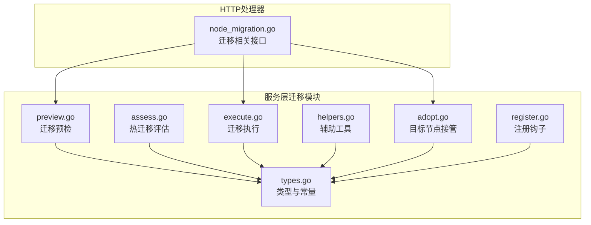
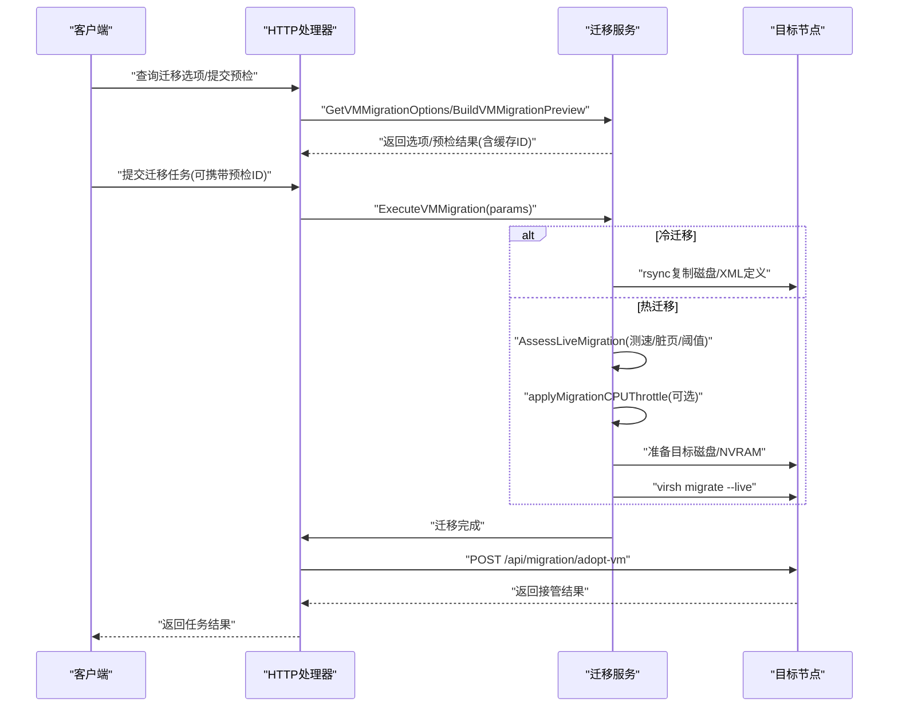
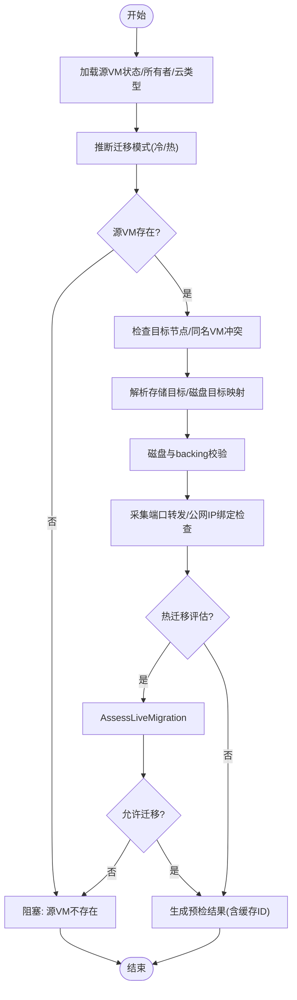
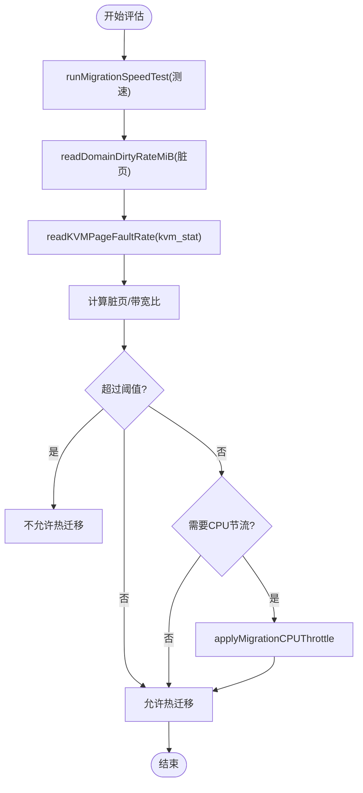
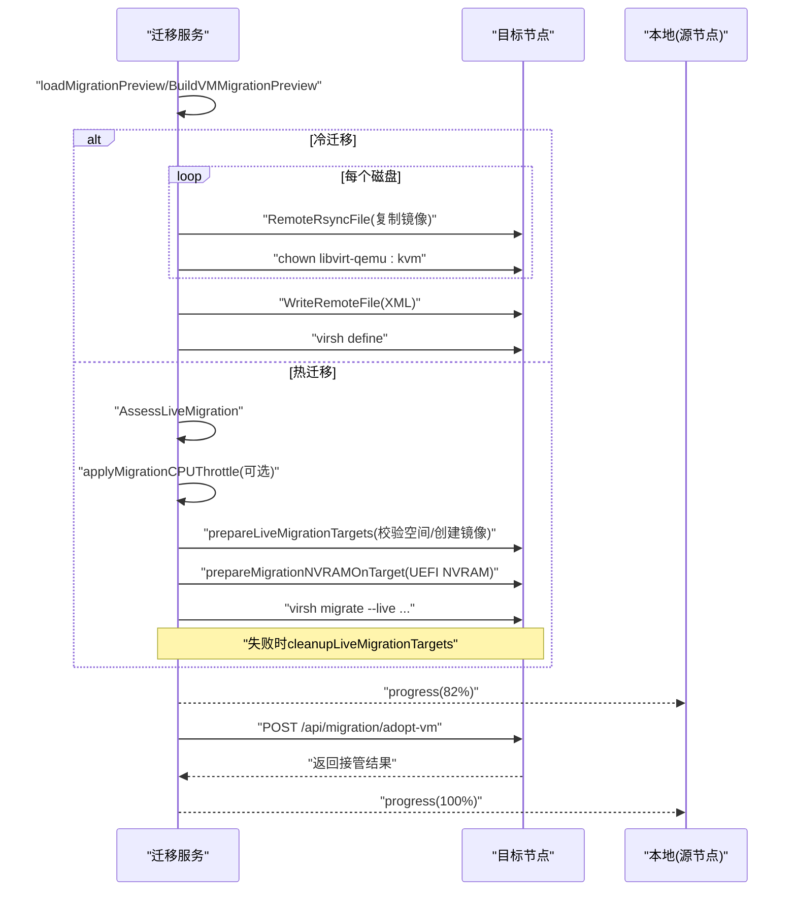
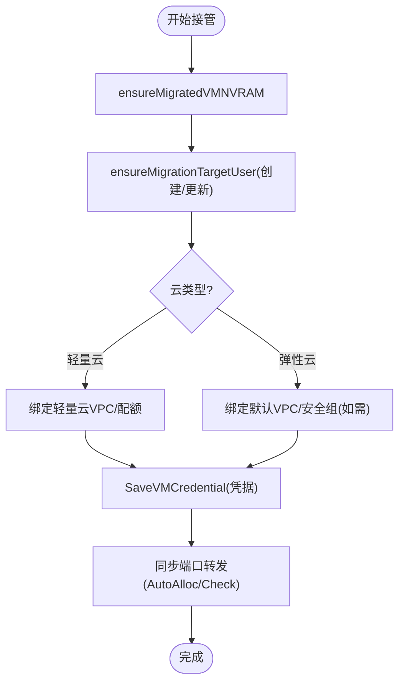
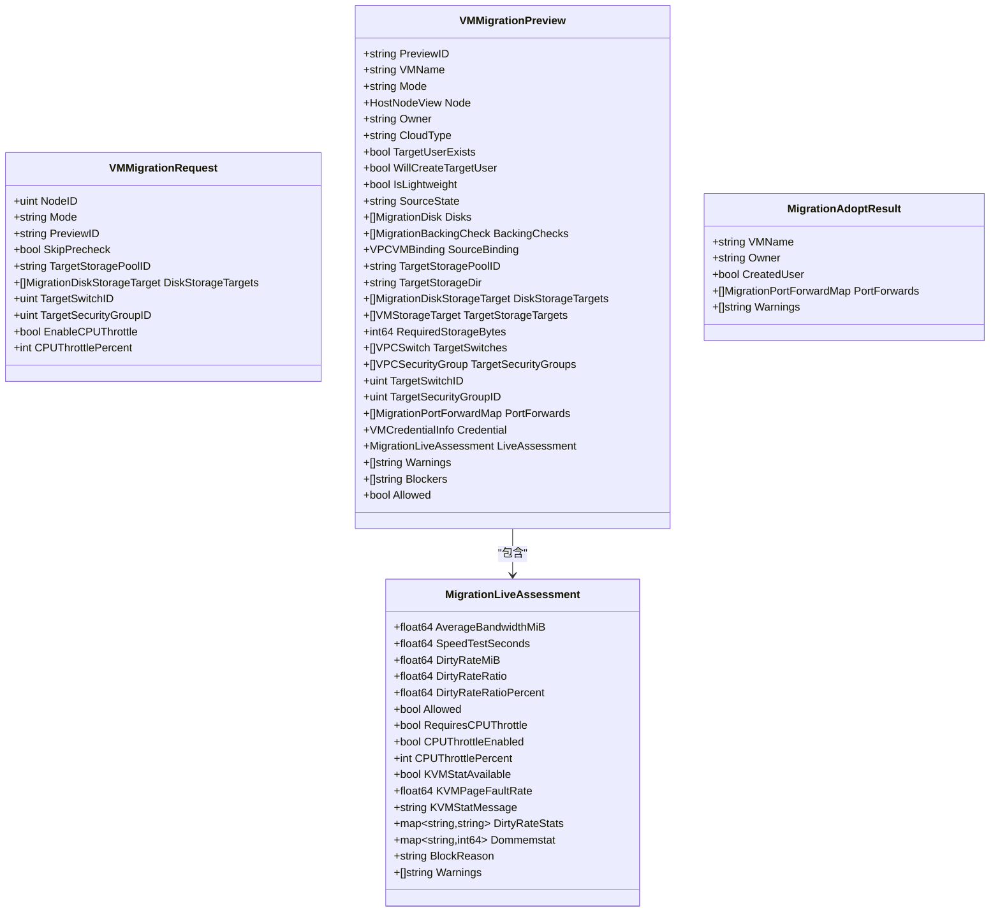
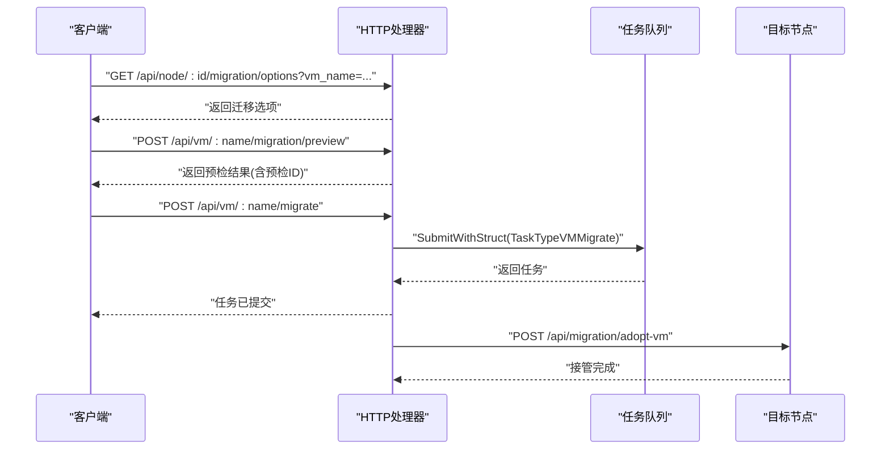
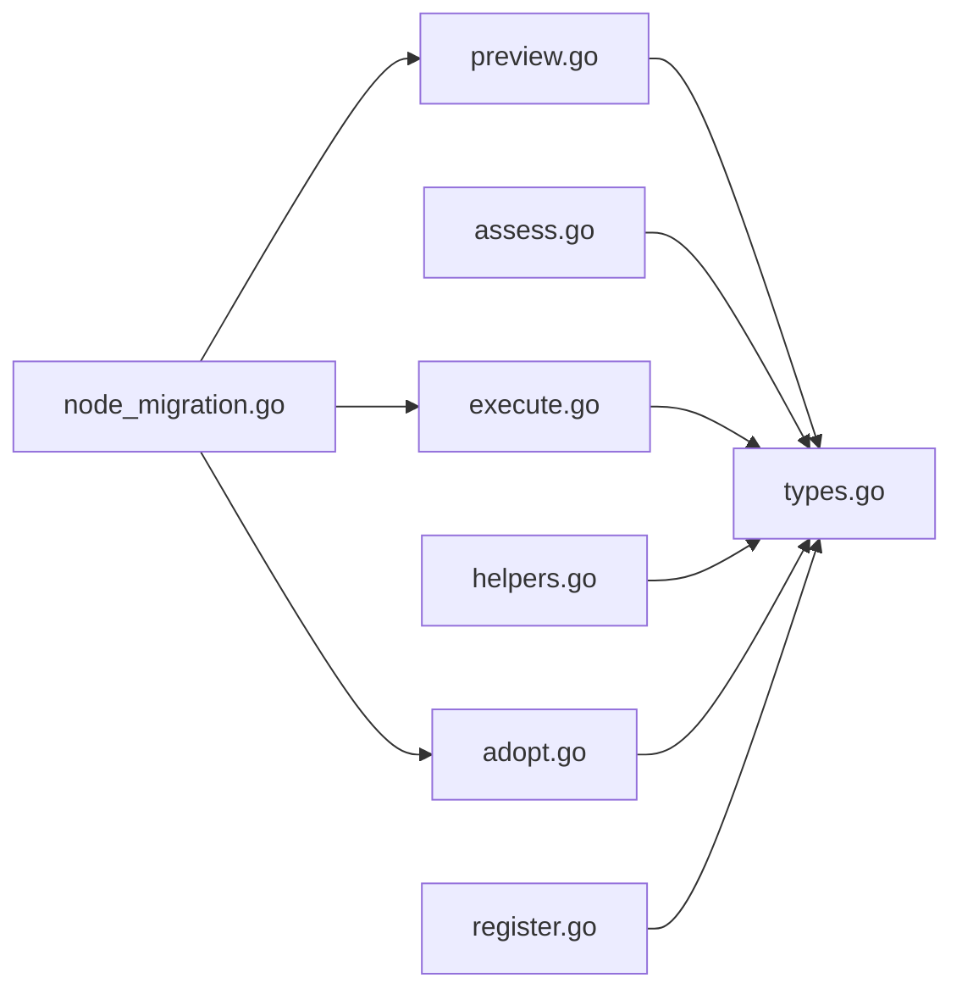

# 虚拟机迁移

<cite>
**本文引用的文件**
- [types.go](file://server/service/vm/migration/types.go)
- [assess.go](file://server/service/vm/migration/assess.go)
- [execute.go](file://server/service/vm/migration/execute.go)
- [helpers.go](file://server/service/vm/migration/helpers.go)
- [preview.go](file://server/service/vm/migration/preview.go)
- [adopt.go](file://server/service/vm/migration/adopt.go)
- [register.go](file://server/service/vm/migration/register.go)
- [node_migration.go](file://server/handler/node_migration.go)
</cite>

## 目录
1. [简介](#简介)
2. [项目结构](#项目结构)
3. [核心组件](#核心组件)
4. [架构总览](#架构总览)
5. [详细组件分析](#详细组件分析)
6. [依赖关系分析](#依赖关系分析)
7. [性能考量](#性能考量)
8. [故障排查指南](#故障排查指南)
9. [结论](#结论)
10. [附录](#附录)

## 简介
本文件系统化梳理了虚拟机迁移功能的设计与实现，覆盖热迁移、冷迁移与跨节点迁移的完整流程，包括迁移前评估、资源与兼容性检查、迁移过程中的数据同步与状态管理、以及失败回滚与异常处理策略。同时提供性能优化建议与最佳实践，帮助运维与开发人员高效、安全地完成虚拟机迁移。

## 项目结构
迁移能力由服务层迁移模块与HTTP处理器共同构成：
- 服务层迁移模块位于 server/service/vm/migration，包含类型定义、预检、评估、执行、接管等逻辑
- HTTP处理器位于 server/handler，提供迁移选项查询、预检、提交迁移任务、目标节点接管等接口

**图表来源**
- [types.go:1-267](file://server/service/vm/migration/types.go#L1-L267)
- [preview.go:1-337](file://server/service/vm/migration/preview.go#L1-L337)
- [assess.go:1-371](file://server/service/vm/migration/assess.go#L1-L371)
- [execute.go:1-382](file://server/service/vm/migration/execute.go#L1-L382)
- [helpers.go:1-362](file://server/service/vm/migration/helpers.go#L1-L362)
- [adopt.go:1-292](file://server/service/vm/migration/adopt.go#L1-L292)
- [register.go:1-10](file://server/service/vm/migration/register.go#L1-L10)
- [node_migration.go:1-150](file://server/handler/node_migration.go#L1-L150)

**章节来源**
- [node_migration.go:73-149](file://server/handler/node_migration.go#L73-L149)
- [types.go:15-21](file://server/service/vm/migration/types.go#L15-L21)

## 核心组件
- 迁移模式与状态
  - 模式常量：冷迁移与热迁移
  - 迁移动态状态标记
- 请求与预检模型
  - 迁移请求、任务参数、预检结果、磁盘与存储目标映射、热迁移评估结果
- 执行引擎
  - 基于预检结果执行冷/热迁移，调用libvirt与远程节点命令
- 接管与收尾
  - 目标节点创建用户/绑定VPC/同步凭据/端口转发等

**章节来源**
- [types.go:15-82](file://server/service/vm/migration/types.go#L15-L82)
- [execute.go:32-101](file://server/service/vm/migration/execute.go#L32-L101)
- [adopt.go:18-125](file://server/service/vm/migration/adopt.go#L18-L125)

## 架构总览
迁移流程分为“预检—评估—执行—接管”四阶段，配合缓存与并发控制保障一致性与可追溯性。

**图表来源**
- [node_migration.go:73-149](file://server/handler/node_migration.go#L73-L149)
- [preview.go:80-218](file://server/service/vm/migration/preview.go#L80-L218)
- [execute.go:32-101](file://server/service/vm/migration/execute.go#L32-L101)
- [assess.go:18-75](file://server/service/vm/migration/assess.go#L18-L75)
- [adopt.go:18-125](file://server/service/vm/migration/adopt.go#L18-L125)

## 详细组件分析

### 预检与兼容性验证
- 预检内容
  - 源虚拟机存在性与状态判定（冷/热）
  - 目标节点可用性与同名VM冲突检查
  - 存储池与磁盘目标映射、目标路径唯一性与存在性
  - backing链校验（格式/大小/哈希），支持跳过哈希
  - 公网IP绑定检查（需先在目标节点配置公网IP资源）
  - 端口转发规则采集与冲突检测（自动分配）
  - 热迁移评估入口（仅当无阻塞时进行）
- 结果缓存
  - 生成临时预检ID，30分钟有效期，避免重复计算
- 执行前校验
  - 对比任务参数与缓存预检，防止中途状态变化导致不一致

**图表来源**
- [preview.go:91-218](file://server/service/vm/migration/preview.go#L91-L218)
- [helpers.go:17-46](file://server/service/vm/migration/helpers.go#L17-L46)
- [helpers.go:123-194](file://server/service/vm/migration/helpers.go#L123-L194)

**章节来源**
- [preview.go:80-218](file://server/service/vm/migration/preview.go#L80-L218)
- [helpers.go:17-46](file://server/service/vm/migration/helpers.go#L17-L46)
- [helpers.go:123-194](file://server/service/vm/migration/helpers.go#L123-L194)

### 热迁移评估与CPU节流
- 评估指标
  - 线路测速：本地发起HTTP下载测速，统计平均带宽(MiB/s)
  - 脏页速率：通过virsh domdirtyrate-calc与domstats读取
  - KVM页面缺页率：尝试kvm_stat工具，降级提示
  - 脏页/带宽比阈值：≥50%阻断，≥20%建议开启CPU节流
- CPU节流
  - 支持全局周期/配额或vcpu周期/配额两种方式
  - 迁移完成后自动恢复原配额
- 评估结果合并到预检，作为是否允许热迁移的依据

**图表来源**
- [assess.go:18-75](file://server/service/vm/migration/assess.go#L18-L75)
- [assess.go:90-139](file://server/service/vm/migration/assess.go#L90-L139)
- [assess.go:158-226](file://server/service/vm/migration/assess.go#L158-L226)
- [assess.go:251-268](file://server/service/vm/migration/assess.go#L251-L268)
- [assess.go:289-350](file://server/service/vm/migration/assess.go#L289-L350)

**章节来源**
- [assess.go:18-75](file://server/service/vm/migration/assess.go#L18-L75)
- [assess.go:289-350](file://server/service/vm/migration/assess.go#L289-L350)

### 迁移执行（冷/热）
- 冷迁移
  - 逐盘rsync复制至目标节点，chown libvirt-qemu:kvm
  - 将修改后的XML写入目标节点并virsh define
- 热迁移
  - 评估与CPU节流（见上）
  - 准备目标磁盘（按目录校验剩余空间、qemu-img创建、chown）
  - 预创建UEFI NVRAM（strip template属性，避免二次转换）
  - virsh migrate --live --persistent --copy-storage-inc --xml/--migrateuri/--disks-uri
  - 失败清理：删除已创建的目标磁盘/NVRAM
- 执行进度回调与错误传播

**图表来源**
- [execute.go:32-101](file://server/service/vm/migration/execute.go#L32-L101)
- [execute.go:116-136](file://server/service/vm/migration/execute.go#L116-L136)
- [execute.go:138-208](file://server/service/vm/migration/execute.go#L138-L208)
- [execute.go:219-287](file://server/service/vm/migration/execute.go#L219-L287)
- [execute.go:308-335](file://server/service/vm/migration/execute.go#L308-L335)

**章节来源**
- [execute.go:32-101](file://server/service/vm/migration/execute.go#L32-L101)
- [execute.go:116-136](file://server/service/vm/migration/execute.go#L116-L136)
- [execute.go:138-208](file://server/service/vm/migration/execute.go#L138-L208)
- [execute.go:219-287](file://server/service/vm/migration/execute.go#L219-L287)
- [execute.go:308-335](file://server/service/vm/migration/execute.go#L308-L335)

### 目标节点接管与资源绑定
- 确保NVRAM文件存在（UEFI/Secure Boot）
- 用户处理
  - 若目标用户不存在且非管理员：创建用户并初始化资源
  - 若目标用户存在：根据请求更新必要字段
- VPC绑定
  - 轻量云：绑定到目标轻量云VPC（NAT模式）
  - 弹性云：若未指定则创建默认VPC与安全组
- 凭据同步
  - 将迁移前的VM凭据写入目标节点
- 端口转发
  - 解析VM目标IP，尝试使用原宿主端口，否则自动分配
  - 应用到目标节点并确保安全组放行

**图表来源**
- [adopt.go:18-125](file://server/service/vm/migration/adopt.go#L18-L125)
- [adopt.go:127-215](file://server/service/vm/migration/adopt.go#L127-L215)
- [adopt.go:255-284](file://server/service/vm/migration/adopt.go#L255-L284)

**章节来源**
- [adopt.go:18-125](file://server/service/vm/migration/adopt.go#L18-L125)
- [adopt.go:127-215](file://server/service/vm/migration/adopt.go#L127-L215)

### 数据结构与类型
- 迁移模式、状态常量
- 请求/任务参数、预检结果、磁盘与存储目标、热迁移评估、用户快照、接管结果
- 预检缓存：随机ID、过期时间、并发锁

**图表来源**
- [types.go:26-82](file://server/service/vm/migration/types.go#L26-L82)
- [types.go:124-141](file://server/service/vm/migration/types.go#L124-L141)
- [types.go:181-187](file://server/service/vm/migration/types.go#L181-L187)

**章节来源**
- [types.go:15-82](file://server/service/vm/migration/types.go#L15-L82)
- [types.go:124-141](file://server/service/vm/migration/types.go#L124-L141)
- [types.go:181-187](file://server/service/vm/migration/types.go#L181-L187)

### HTTP接口与任务编排
- 查询迁移选项：GetVMMigrationOptions
- 预检：PreviewVMMigration（返回预检ID）
- 提交迁移：MigrateVM（高危操作二次校验，提交任务队列）
- 目标节点接管：AdoptMigratedVM（由源节点调用）

**图表来源**
- [node_migration.go:73-149](file://server/handler/node_migration.go#L73-L149)

**章节来源**
- [node_migration.go:73-149](file://server/handler/node_migration.go#L73-L149)

## 依赖关系分析
- 组件内聚与耦合
  - 预检/评估/执行/接管各模块职责清晰，通过公共类型与缓存协同
  - 与libvirt、远程SSH、目标节点API交互紧密，错误路径明确
- 外部依赖
  - virsh、qemu-img、curl、kvm_stat等命令
  - 目标节点的存储池、VPC、端口转发等资源
- 循环依赖
  - 未发现循环导入；注册钩子在init中注入，避免运行时循环

**图表来源**
- [preview.go:1-337](file://server/service/vm/migration/preview.go#L1-L337)
- [assess.go:1-371](file://server/service/vm/migration/assess.go#L1-L371)
- [execute.go:1-382](file://server/service/vm/migration/execute.go#L1-L382)
- [helpers.go:1-362](file://server/service/vm/migration/helpers.go#L1-L362)
- [adopt.go:1-292](file://server/service/vm/migration/adopt.go#L1-L292)
- [register.go:1-10](file://server/service/vm/migration/register.go#L1-L10)
- [node_migration.go:1-150](file://server/handler/node_migration.go#L1-L150)

**章节来源**
- [register.go:5-10](file://server/service/vm/migration/register.go#L5-L10)

## 性能考量
- 热迁移
  - 优先保证网络带宽与脏页速率稳定，避免高抖动
  - 合理设置CPU节流百分比，平衡迁移时延与业务影响
  - 使用增量迁移(copy-storage-inc)，减少全量传输
- 冷迁移
  - rsync复制时关注磁盘I/O与网络带宽，尽量在低峰时段执行
- 资源预留
  - 目标节点按目录校验剩余空间，避免迁移中因空间不足失败
- 并发与缓存
  - 预检结果缓存30分钟，减少重复计算
  - 并发锁保护缓存读写

[本节为通用指导，无需具体文件分析]

## 故障排查指南
- 常见阻塞原因
  - 源VM不存在或状态不符（冷/热模式）
  - 目标节点存在同名虚拟机
  - 存储空间不足或目标路径重复/已存在
  - backing校验失败（格式/大小/哈希不一致）
  - 公网IP绑定未在目标节点配置
- 热迁移失败
  - 脏页/带宽比超阈值：提升网络质量或降低业务负载
  - CPU节流应用失败：确认virsh schedinfo权限与参数
  - 目标NVRAM/磁盘创建失败：检查qemu-img与目录权限
- 接管失败
  - 用户创建/更新失败：检查数据库与资源配额
  - VPC绑定失败：确认目标VPC与安全组存在且匹配
  - 端口转发冲突：查看自动分配日志与占用情况

**章节来源**
- [preview.go:127-218](file://server/service/vm/migration/preview.go#L127-L218)
- [execute.go:116-136](file://server/service/vm/migration/execute.go#L116-L136)
- [execute.go:138-208](file://server/service/vm/migration/execute.go#L138-L208)
- [execute.go:219-287](file://server/service/vm/migration/execute.go#L219-L287)
- [adopt.go:18-125](file://server/service/vm/migration/adopt.go#L18-L125)

## 结论
该迁移系统通过严谨的预检、热迁移评估与CPU节流、冷/热迁移双通道执行、以及目标节点接管与资源绑定，实现了跨节点的可靠迁移。配套的缓存与并发控制提升了用户体验，完善的错误处理与告警便于问题定位与恢复。结合本文提供的性能优化与最佳实践，可在生产环境中安全高效地完成虚拟机迁移。

## 附录
- 最佳实践
  - 迁移前进行预检并记录预检ID，避免重复计算
  - 热迁移优先选择高带宽、低负载时段，合理设置CPU节流
  - 冷迁移尽量在业务低峰执行，监控磁盘与网络I/O
  - 公网IP与VPC资源提前在目标节点准备
  - 关注NVRAM与UEFI安全启动的兼容性
- 回滚与异常处理
  - 热迁移失败自动清理目标磁盘/NVRAM
  - 迁移后CPU节流自动恢复
  - 接管失败保留源节点副本，便于人工介入

[本节为通用指导，无需具体文件分析]