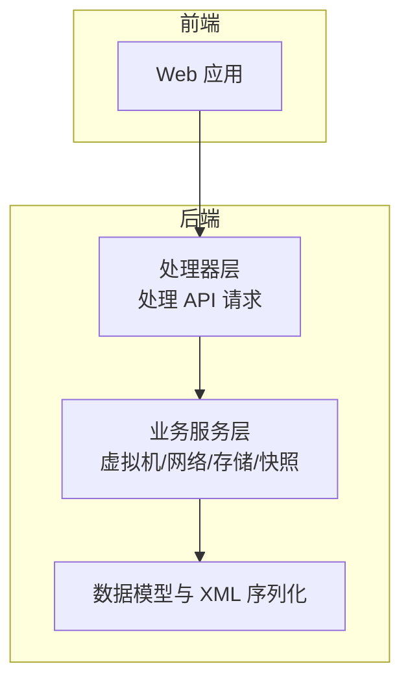
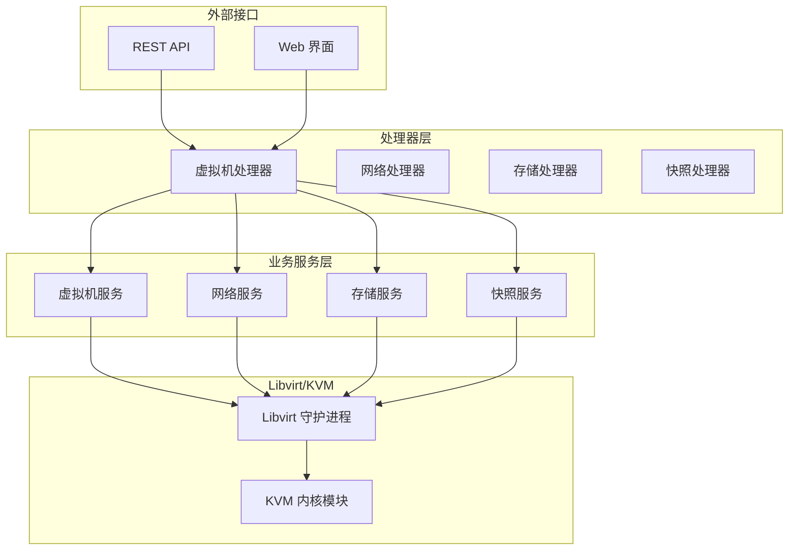
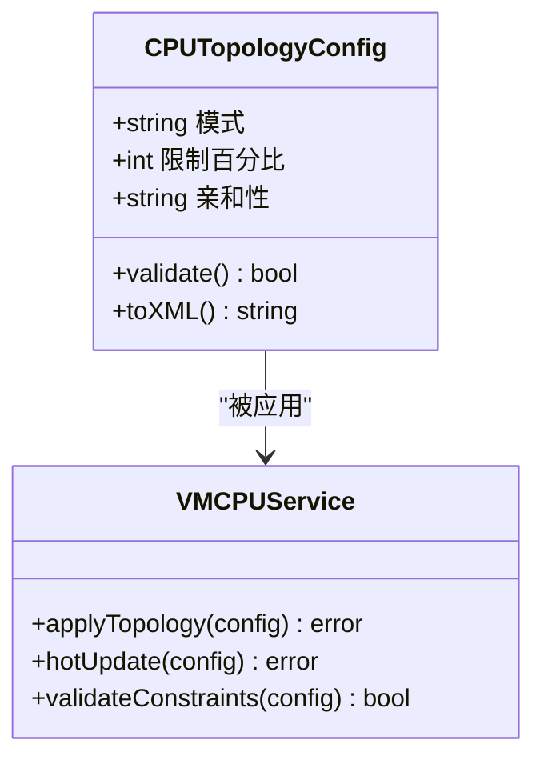
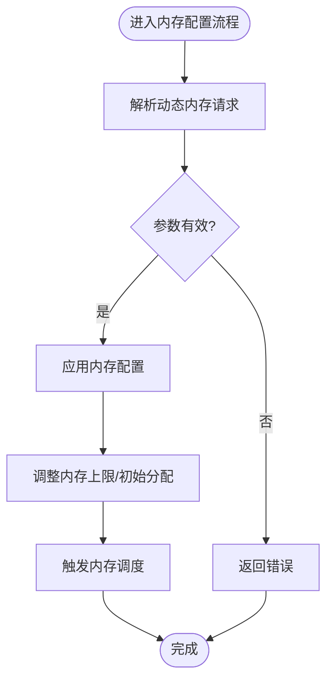
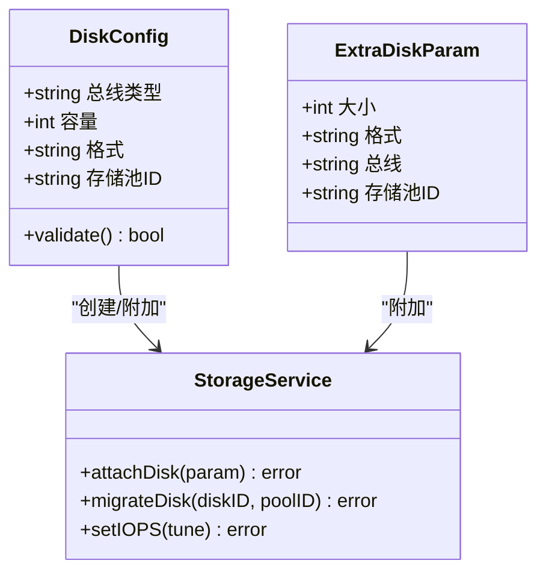
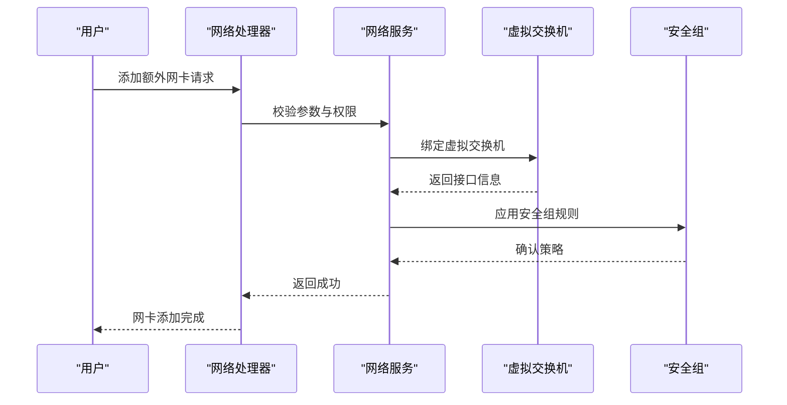
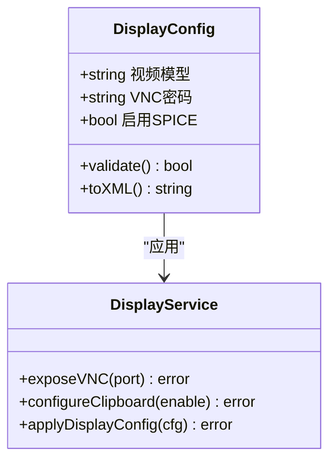
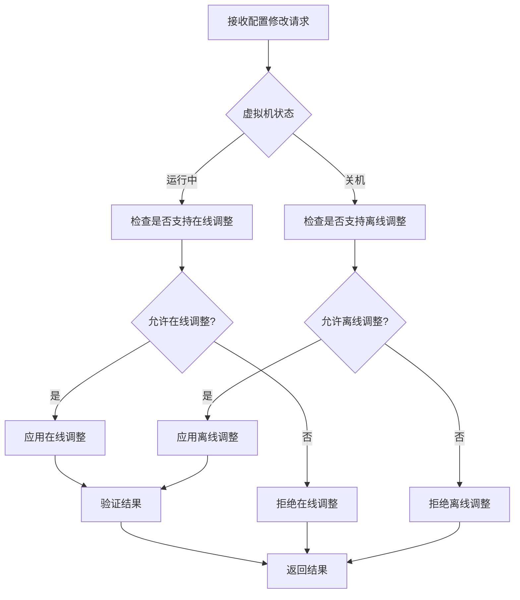
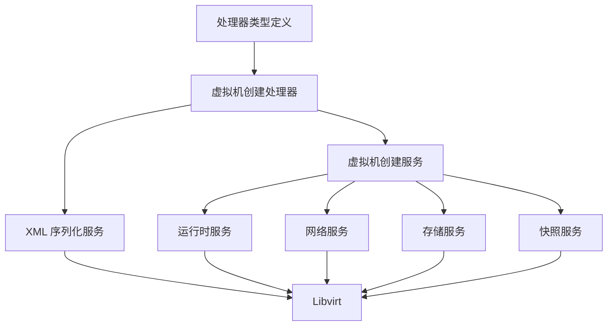

# 虚拟机配置管理

<cite>
**本文档引用的文件**
- [server/handler/types.go](file://server/handler/types.go)
- [server/handler/vm_create.go](file://server/handler/vm_create.go)
- [server/handler/linked_clone.go](file://server/handler/linked_clone.go)
- [server/handler/user_storage.go](file://server/handler/user_storage.go)
- [server/service/vm/create.go](file://server/service/vm/create.go)
- [server/service/lightweight/types.go](file://server/service/lightweight/types.go)
- [server/service/clone/types.go](file://server/service/clone/types.go)
- [server/service/vm/xml.go](file://server/service/vm/xml.go)
- [server/service/vm/display.go](file://server/service/vm/display.go)
- [server/service/vm/cpu_topology.go](file://server/service/vm/cpu_topology.go)
- [server/service/vm/memory/config.go](file://server/service/vm/memory/config.go)
- [server/service/storage/disk/types.go](file://server/service/storage/disk/types.go)
- [server/service/network/vpc/interface_config.go](file://server/service/network/vpc/interface_config.go)
- [server/service/vm/runtime.go](file://server/service/vm/runtime.go)
- [server/service/snapshot/types.go](file://server/service/snapshot/types.go)
- [server/service/vm/config_metadata.go](file://server/service/vm/config_metadata.go)
- [server/service/vm/helpers.go](file://server/service/vm/helpers.go)
- [server/service/vm_xml/display.go](file://server/service/vm_xml/display.go)
- [server/service/vm_xml/boot_type.go](file://server/service/vm_xml/boot_type.go)
- [server/service/vm_xml/pae.go](file://server/service/vm_xml/pae.go)
- [server/service/vm_xml/smbios.go](file://server/service/vm_xml/smbios.go)
</cite>

## 目录
1. [引言](#引言)
2. [项目结构](#项目结构)
3. [核心组件](#核心组件)
4. [架构概览](#架构概览)
5. [详细组件分析](#详细组件分析)
6. [依赖分析](#依赖分析)
7. [性能考虑](#性能考虑)
8. [故障排除指南](#故障排除指南)
9. [结论](#结论)
10. [附录](#附录)

## 引言
本文件面向虚拟机配置管理系统，系统基于 Libvirt/KVM 技术栈，提供完整的虚拟机生命周期管理能力。本文档聚焦于虚拟机硬件资源配置与管理，涵盖 CPU 拓扑结构、内存配置、磁盘配置、网络接口配置以及显示设备配置等核心主题。同时，详细阐述配置参数的语义、取值范围与相互影响关系，说明动态配置修改的实现机制与限制条件，并提供配置优化建议、性能调优指南以及配置备份、恢复与版本管理的实现细节。

## 项目结构
系统采用前后端分离架构，后端服务通过 Go 语言实现，主要模块包括：
- 处理器层：负责接收前端请求、参数校验与路由转发
- 业务服务层：封装虚拟机创建、运行时管理、网络、存储、快照等核心功能
- 数据模型与 XML 序列化：负责虚拟机配置的持久化与 Libvirt 域定义生成
- 前端 Web 应用：提供可视化界面与 API 交互

**章节来源**
- [server/handler/types.go:29-41](file://server/handler/types.go#L29-L41)
- [server/service/vm/create.go:31-46](file://server/service/vm/create.go#L31-L46)

## 核心组件
本节概述虚拟机配置管理的关键组件及其职责：
- 处理器层：统一接收与解析请求参数，执行权限校验与基础校验，调用业务服务层完成具体操作
- 业务服务层：封装虚拟机生命周期管理、运行时配置更新、网络与存储绑定、快照管理等功能
- 数据模型与 XML 序列化：将业务参数映射为 Libvirt 域 XML，确保配置持久化与一致性

**章节来源**
- [server/handler/vm_create.go:33-50](file://server/handler/vm_create.go#L33-L50)
- [server/service/vm/xml.go](file://server/service/vm/xml.go)

## 架构概览
下图展示虚拟机配置管理在系统中的整体架构与交互关系：

**图表来源**
- [server/handler/vm.go](file://server/handler/vm.go)
- [server/service/vm/runtime.go](file://server/service/vm/runtime.go)

## 详细组件分析

### CPU 拓扑配置
CPU 拓扑配置用于定义虚拟机的 vCPU 分配策略，直接影响 NUMA 亲和性、超线程利用与性能表现。关键参数包括：
- CPU 拓扑模式：支持自动推断、单 Socket、宿主机默认等模式，决定 vCPU 的物理核心映射策略
- CPU 限制百分比：以整数百分比形式限制虚拟机可用 CPU 资源，0 表示不限制
- CPU 亲和性：通过 CPU ID 列表指定 vCPU 绑定的物理核心，提升缓存命中率与降低跨 NUMA 访问开销

实现机制与限制：
- 创建阶段：根据模板或用户输入确定 CPU 拓扑参数，生成域 XML 并提交给 Libvirt
- 运行时调整：部分参数可在关机状态下修改；在线热调整需满足宿主机与内核支持
- 参数约束：CPU 限制百分比必须为非负整数；CPU 亲和性列表应与宿主机实际物理核心一致

**图表来源**
- [server/service/vm/cpu_topology.go](file://server/service/vm/cpu_topology.go)
- [server/service/vm/create.go:31-46](file://server/service/vm/create.go#L31-L46)

**章节来源**
- [server/handler/vm_create.go:44-46](file://server/handler/vm_create.go#L44-L46)
- [server/service/clone/types.go:44-46](file://server/service/clone/types.go#L44-L46)
- [server/service/lightweight/types.go:40-42](file://server/service/lightweight/types.go#L40-L42)

### 内存配置
内存配置涉及静态分配与动态调整两个维度：
- 静态内存：创建时确定的初始内存大小，影响虚拟机启动性能与资源占用
- 动态内存：运行时可调整的内存上限与初始分配，结合内存调度器实现按需扩展

关键参数与行为：
- 动态内存请求：包含目标内存大小、最大内存上限、初始分配比例等
- 内存调度：与宿主机内存管理器协同，避免过度交换导致的性能下降
- 共享内存与大页：支持 hugepages 与共享内存配置，减少 TLB 缺失与提高吞吐

**图表来源**
- [server/service/vm/memory/config.go](file://server/service/vm/memory/config.go)
- [server/handler/vm_create.go:48](file://server/handler/vm_create.go#L48)

**章节来源**
- [server/handler/vm_create.go:48](file://server/handler/vm_create.go#L48)
- [server/handler/linked_clone.go:40](file://server/handler/linked_clone.go#L40)
- [server/handler/user_storage.go:460](file://server/handler/user_storage.go#L460)

### 磁盘配置
磁盘配置涵盖系统盘与额外磁盘，支持多种总线类型与存储池选择：
- 系统盘总线：支持 virtio、SCSI、SATA、IDE 等，不同总线对性能与兼容性有显著影响
- 额外磁盘：可按需添加，支持指定容量、格式、总线与存储池
- I/O 调优：系统盘可配置 IOPS 限制（管理员权限），用于资源隔离与公平调度

实现要点：
- 创建阶段：根据模板与用户选择生成磁盘设备定义
- 运行时扩展：支持在线扩容（取决于文件系统与驱动支持）
- 存储池绑定：通过存储池 ID 选择后端存储，便于统一管理与迁移

**图表来源**
- [server/service/storage/disk/types.go](file://server/service/storage/disk/types.go)
- [server/handler/user_storage.go:465-471](file://server/handler/user_storage.go#L465-L471)

**章节来源**
- [server/handler/vm_create.go:42](file://server/handler/vm_create.go#L42)
- [server/handler/linked_clone.go:42](file://server/handler/linked_clone.go#L42)
- [server/handler/user_storage.go:465-471](file://server/handler/user_storage.go#L465-L471)

### 网络接口配置
网络接口配置支持主网卡与额外网卡，结合虚拟交换机与安全组实现灵活的网络拓扑：
- 主网卡模型：支持 virtio、e1000e、RTL8139 等，不同模型在性能与兼容性上有所差异
- 额外网卡：可按需添加，绑定至指定虚拟交换机与安全组
- 网络策略：通过安全组与 ACL 控制入站/出站流量，保障网络安全

**图表来源**
- [server/service/network/vpc/interface_config.go](file://server/service/network/vpc/interface_config.go)
- [server/handler/linked_clone.go:43](file://server/handler/linked_clone.go#L43)
- [server/handler/user_storage.go:463](file://server/handler/user_storage.go#L463)

**章节来源**
- [server/handler/vm_create.go:49](file://server/handler/vm_create.go#L49)
- [server/handler/linked_clone.go:43](file://server/handler/linked_clone.go#L43)
- [server/handler/user_storage.go:463](file://server/handler/user_storage.go#L463)

### 显示设备配置
显示设备配置用于远程访问与图形输出，支持多种视频模型：
- 视频模型：支持 virtio、VGA、VMVGA、Cirrus 等，不同模型在图形性能与兼容性上有差异
- VNC/SPICE：通过显示服务暴露远程桌面，支持加密与多会话管理
- 共享剪贴板与拖放：提升用户体验与效率

**图表来源**
- [server/service/vm/display.go](file://server/service/vm/display.go)
- [server/service/vm_xml/display.go](file://server/service/vm_xml/display.go)
- [server/handler/vm_create.go:42](file://server/handler/vm_create.go#L42)

**章节来源**
- [server/handler/vm_create.go:42](file://server/handler/vm_create.go#L42)
- [server/service/clone/types.go:43](file://server/service/clone/types.go#L43)
- [server/service/lightweight/types.go:39](file://server/service/lightweight/types.go#L39)

### 动态配置修改机制与限制
动态配置修改允许在虚拟机运行期间调整部分参数，但存在严格的限制条件：
- 关机状态修改：PCIe 热插槽数量、自动启动、备注、分组等参数仅能在关机状态下修改
- 在线热调整：CPU 亲和性与内存动态调整通常需要关机或暂停状态
- 权限控制：高风险操作（如直接编辑域 XML）需要二次验证与管理员权限
- 冲突检测：修改前进行资源冲突检查与宿主机能力验证

**图表来源**
- [server/handler/vm.go:534-958](file://server/handler/vm.go#L534-L958)
- [server/service/vm/runtime.go](file://server/service/vm/runtime.go)

**章节来源**
- [server/handler/vm.go:534-958](file://server/handler/vm.go#L534-L958)

### 配置参数语义、取值范围与相互影响
- 引导类型与启动顺序：引导类型支持 BIOS/UEFI/UEFI-secure，启动顺序影响首次引导设备选择
- RTC 设置：RTC 偏移与时钟基准影响虚拟机时间同步策略
- Guest Agent 与 SMBIOS：Guest Agent 提供客户机状态查询能力，SMBIOS 可定制厂商信息
- 网卡与视频模型：不同模型在兼容性与性能上存在差异，需结合操作系统与应用场景选择
- CPU 与内存：CPU 亲和性与内存调度共同决定资源利用率与延迟特性

**章节来源**
- [server/handler/types.go:29-41](file://server/handler/types.go#L29-L41)
- [server/service/vm_xml/boot_type.go](file://server/service/vm_xml/boot_type.go)
- [server/service/vm_xml/pae.go](file://server/service/vm_xml/pae.go)
- [server/service/vm_xml/smbios.go](file://server/service/vm_xml/smbios.go)

## 依赖分析
虚拟机配置管理涉及多个子系统的紧密协作，依赖关系如下：

**图表来源**
- [server/handler/vm_create.go:33-50](file://server/handler/vm_create.go#L33-L50)
- [server/service/vm/create.go:31-46](file://server/service/vm/create.go#L31-L46)

**章节来源**
- [server/handler/vm_create.go:33-50](file://server/handler/vm_create.go#L33-L50)
- [server/service/vm/create.go:31-46](file://server/service/vm/create.go#L31-L46)

## 性能考虑
- CPU 亲和性：将 vCPU 绑定到同一 NUMA 节点内的物理核心，减少跨 NUMA 访问带来的性能损耗
- 内存调度：合理设置内存上限与初始分配，避免频繁页面回收与交换
- 磁盘总线选择：生产环境优先选择 virtio-blk，兼顾性能与兼容性；对大量小文件场景可考虑 NVMe 或 SSD
- 网络模型：服务器工作负载推荐 virtio-net，客户端场景可按兼容性需求选择 e1000e/RTL8139
- 显示设备：远程管理使用 VNC/SPICE，注意启用加密与限制并发连接数
- I/O 调优：为关键业务磁盘设置 IOPS/带宽限制，防止“饿死”其他虚拟机

[本节提供通用指导，无需特定文件来源]

## 故障排除指南
常见问题与排查步骤：
- 配置修改失败：检查虚拟机状态（是否关机）、权限与参数合法性；查看日志定位具体错误
- 网络不可达：确认虚拟交换机与安全组规则、MAC 地址冲突、DHCP/DNS 配置
- 磁盘扩容无效：确认文件系统支持在线扩容、驱动版本与内核支持情况
- 显示服务异常：检查 VNC/SPICE 端口占用、防火墙策略与证书有效性
- 快照回滚失败：确认快照链完整性、存储空间充足与快照锁定状态

**章节来源**
- [server/handler/vm.go:908-947](file://server/handler/vm.go#L908-L947)
- [server/service/vm/helpers.go](file://server/service/vm/helpers.go)

## 结论
本文件系统性梳理了虚拟机配置管理的核心要素，覆盖 CPU、内存、磁盘、网络与显示五大硬件资源的配置方法、参数语义与相互影响。通过明确动态配置修改的机制与限制，结合性能优化建议与故障排除指南，帮助用户在保证稳定性的前提下实现资源的高效利用与灵活管理。后续可进一步完善配置模板化与自动化运维能力，提升大规模部署的可维护性。

## 附录

### 配置备份、恢复与版本管理
- 备份策略：定期导出虚拟机域 XML 与相关配置元数据，保存至安全位置
- 恢复流程：在新环境中重建虚拟机，导入历史配置并逐项验证关键参数
- 版本控制：将域 XML 与配置变更记录纳入版本控制系统，配合自动化脚本实现可追溯的配置演进

**章节来源**
- [server/service/snapshot/types.go](file://server/service/snapshot/types.go)
- [server/service/vm/config_metadata.go](file://server/service/vm/config_metadata.go)