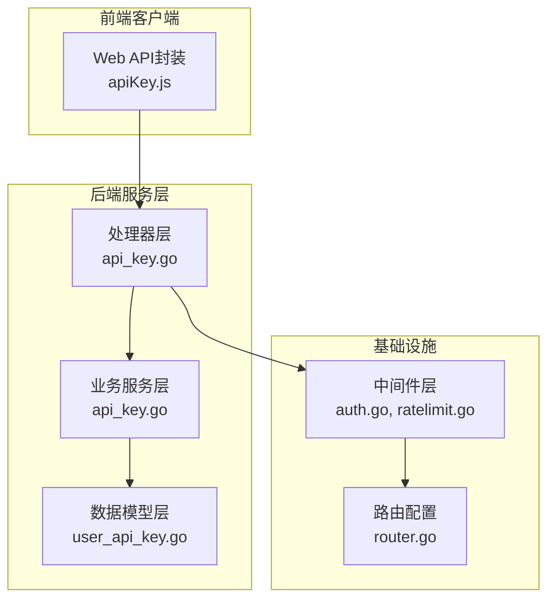
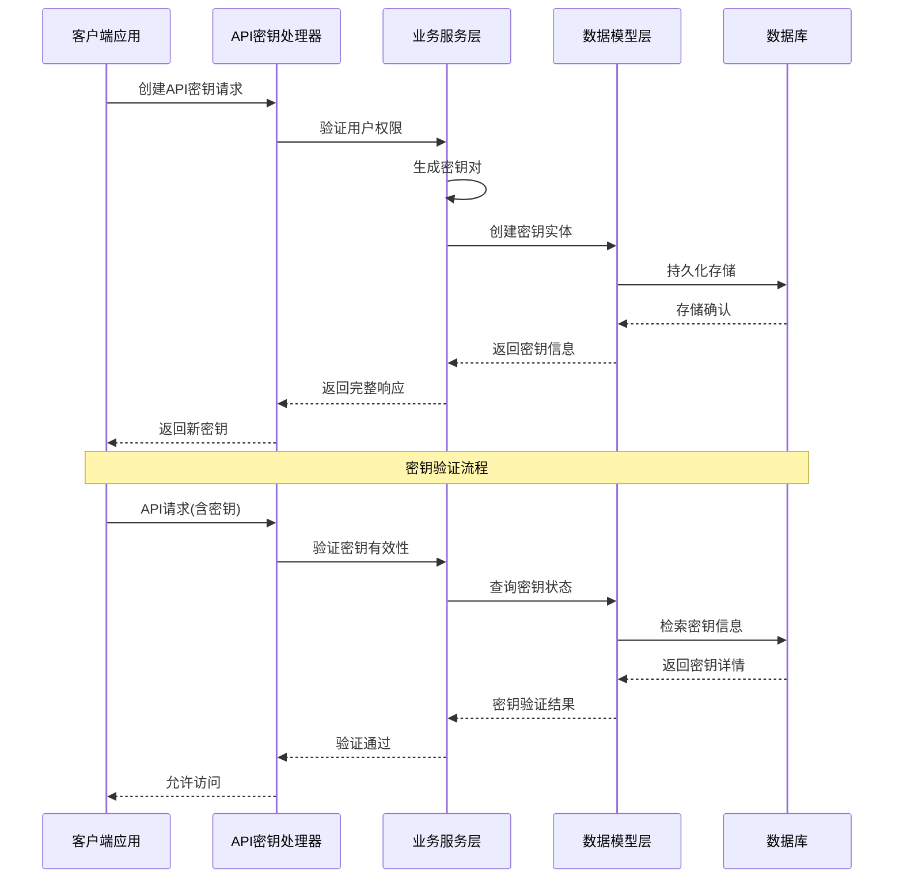
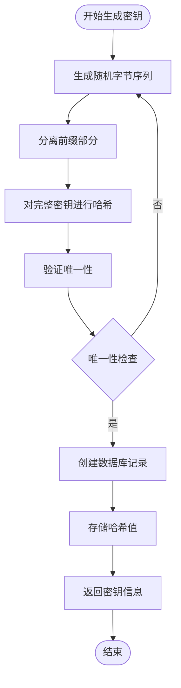
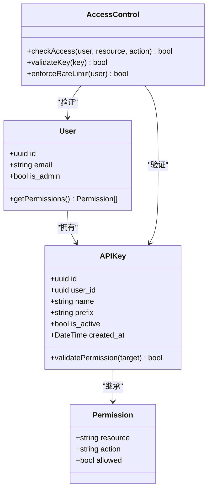
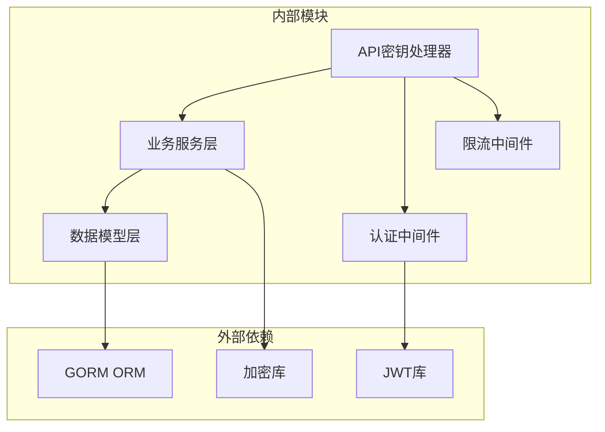
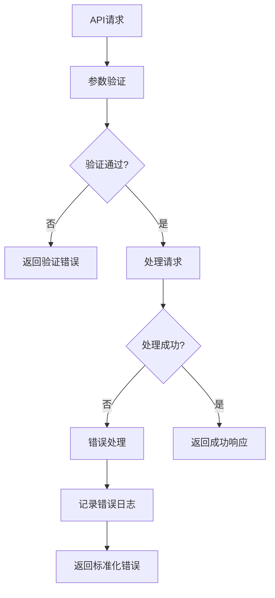

# API密钥管理

<cite>
**本文档引用的文件**
- [server/model/user_api_key.go](file://server/model/user_api_key.go)
- [server/handler/api_key.go](file://server/handler/api_key.go)
- [server/service/api_key.go](file://server/service/api_key.go)
- [web/src/api/apiKey.js](file://web/src/api/apiKey.js)
- [server/middleware/auth.go](file://server/middleware/auth.go)
- [server/router/router.go](file://server/router/router.go)
- [server/middleware/ratelimit.go](file://server/middleware/ratelimit.go)
- [server/model/user.go](file://server/model/user.go)
- [server/service/security/crypto.go](file://server/service/security/crypto.go)
</cite>

## 目录
1. [简介](#简介)
2. [项目结构](#项目结构)
3. [核心组件](#核心组件)
4. [架构概览](#架构概览)
5. [详细组件分析](#详细组件分析)
6. [依赖分析](#依赖分析)
7. [性能考虑](#性能考虑)
8. [故障排除指南](#故障排除指南)
9. [结论](#结论)

## 简介

本文件为API密钥管理系统的详细实现文档。该系统提供了完整的API密钥生命周期管理能力，包括密钥生成、存储、验证、轮换和撤销等功能。系统采用安全的密钥存储机制，结合用户权限控制和访问限制策略，确保API密钥的安全性和可控性。

## 项目结构

API密钥管理系统在代码库中主要分布在以下模块：

**图表来源**
- [server/handler/api_key.go:1-50](file://server/handler/api_key.go#L1-L50)
- [server/service/api_key.go:1-50](file://server/service/api_key.go#L1-L50)
- [server/model/user_api_key.go:1-50](file://server/model/user_api_key.go#L1-L50)

**章节来源**
- [server/handler/api_key.go:1-100](file://server/handler/api_key.go#L1-L100)
- [server/service/api_key.go:1-100](file://server/service/api_key.go#L1-L100)
- [server/model/user_api_key.go:1-100](file://server/model/user_api_key.go#L1-L100)

## 核心组件

### 数据模型设计

API密钥系统的核心数据模型定义了密钥的存储格式和字段结构：

| 字段名称 | 类型 | 描述 | 约束条件 |
|---------|------|------|----------|
| id | UUID | 唯一标识符 | 主键，自动生成 |
| user_id | UUID | 关联用户ID | 外键约束 |
| name | String | 密钥名称 | 非空，长度限制 |
| key_hash | String | 密钥哈希值 | 存储加密后的密钥 |
| prefix | String | 密钥前缀 | 唯一性约束 |
| created_at | DateTime | 创建时间 | 自动记录 |
| expires_at | DateTime | 过期时间 | 可为空 |
| last_used_at | DateTime | 最后使用时间 | 更新追踪 |
| is_active | Boolean | 激活状态 | 默认true |

### 安全存储机制

系统采用两层安全存储策略：

1. **密钥哈希存储**：原始密钥仅以哈希形式存储，不保存明文
2. **前缀索引**：通过唯一前缀支持快速检索和验证
3. **加密保护**：使用强加密算法保护敏感数据

**章节来源**
- [server/model/user_api_key.go:1-80](file://server/model/user_api_key.go#L1-L80)

## 架构概览

API密钥管理系统的整体架构采用分层设计模式：

**图表来源**
- [server/handler/api_key.go:20-80](file://server/handler/api_key.go#L20-L80)
- [server/service/api_key.go:25-90](file://server/service/api_key.go#L25-L90)

## 详细组件分析

### API密钥生成算法

系统实现了基于随机数生成器的安全密钥生成机制：

**图表来源**
- [server/service/api_key.go:45-75](file://server/service/api_key.go#L45-L75)

密钥生成的关键特性：
- 使用密码学安全的随机数生成器
- 自动生成唯一前缀用于快速检索
- 实施重复性检查确保全局唯一性
- 支持可选的过期时间设置

**章节来源**
- [server/service/api_key.go:1-100](file://server/service/api_key.go#L1-L100)

### API密钥存储格式

密钥存储采用混合格式设计：

| 组件 | 格式 | 用途 | 安全特性 |
|------|------|------|----------|
| 原始密钥 | 随机字符串 | 一次性传输 | 明文仅存在于内存 |
| 哈希值 | SHA-256 | 验证匹配 | 单向不可逆 |
| 前缀 | 前4字符 | 快速检索 | 唯一标识 |
| 后缀 | 剩余部分 | 完整验证 | 完整比对 |

存储优化策略：
- 前缀建立数据库索引提高查询效率
- 哈希值存储避免明文泄露风险
- 分离存储减少单点故障影响

**章节来源**
- [server/model/user_api_key.go:1-100](file://server/model/user_api_key.go#L1-L100)

### 权限控制机制

系统实施多层级权限控制：

**图表来源**
- [server/model/user_api_key.go:1-80](file://server/model/user_api_key.go#L1-L80)
- [server/model/user.go:1-80](file://server/model/user.go#L1-L80)

权限控制层次：
1. **用户级别权限**：基于用户角色和权限组
2. **密钥级别权限**：基于密钥创建时的授权范围
3. **资源级别权限**：针对具体API端点的访问控制
4. **操作级别权限**：区分读写操作的不同权限

**章节来源**
- [server/middleware/auth.go:1-80](file://server/middleware/auth.go#L1-L80)

### 访问限制机制

系统实现多层次的访问限制策略：

| 限制类型 | 实现方式 | 配置参数 | 触发条件 |
|----------|----------|----------|----------|
| 请求频率限制 | 滑动窗口计数 | 每分钟请求数量 | 超出设定阈值 |
| 并发连接限制 | 连接池管理 | 最大并发数 | 超出连接上限 |
| IP地址限制 | 白名单/黑名单 | IP列表配置 | IP不在允许范围内 |
| 时间段限制 | 时间窗口控制 | 开始/结束时间 | 超出允许时间段 |

**章节来源**
- [server/middleware/ratelimit.go:1-80](file://server/middleware/ratelimit.go#L1-L80)

## 依赖分析

API密钥管理系统的依赖关系图：

**图表来源**
- [server/service/api_key.go:1-50](file://server/service/api_key.go#L1-L50)
- [server/handler/api_key.go:1-50](file://server/handler/api_key.go#L1-L50)

**章节来源**
- [server/service/security/crypto.go:1-80](file://server/service/security/crypto.go#L1-L80)

## 性能考虑

### 存储性能优化

1. **索引策略**
   - 在密钥前缀上建立唯一索引
   - 在用户ID上建立普通索引
   - 在激活状态上建立过滤索引

2. **查询优化**
   - 使用前缀匹配减少全表扫描
   - 缓存常用查询结果
   - 实施批量操作减少数据库往返

3. **内存管理**
   - 限制密钥缓存大小
   - 实施LRU淘汰策略
   - 及时释放临时对象

### 网络性能优化

1. **请求处理**
   - 异步处理非关键操作
   - 实施请求合并减少开销
   - 优化响应数据结构

2. **连接管理**
   - 连接池复用数据库连接
   - 实施连接超时控制
   - 监控连接使用情况

## 故障排除指南

### 常见问题诊断

| 问题类型 | 症状描述 | 可能原因 | 解决方案 |
|----------|----------|----------|----------|
| 密钥验证失败 | API调用被拒绝 | 密钥过期或无效 | 检查密钥状态和有效期 |
| 权限不足 | 返回403错误 | 权限范围不匹配 | 验证用户权限和密钥授权 |
| 请求被限流 | 返回429错误 | 超出频率限制 | 检查限流配置和请求频率 |
| 数据库连接失败 | 操作超时 | 数据库服务异常 | 检查数据库连接和网络 |

### 错误处理机制

系统实现统一的错误处理框架：

**图表来源**
- [server/handler/api_key.go:60-100](file://server/handler/api_key.go#L60-L100)

**章节来源**
- [server/handler/api_key.go:1-120](file://server/handler/api_key.go#L1-L120)

## 结论

API密钥管理系统通过分层架构设计和多重安全机制，提供了完整的密钥生命周期管理能力。系统在保证安全性的同时，也注重性能优化和用户体验。建议在生产环境中：

1. 定期审查和更新密钥策略
2. 实施监控和告警机制
3. 建立完善的审计日志
4. 制定应急响应预案
5. 持续优化性能指标

该系统为API密钥管理提供了坚实的技术基础，能够满足大多数应用场景的需求。