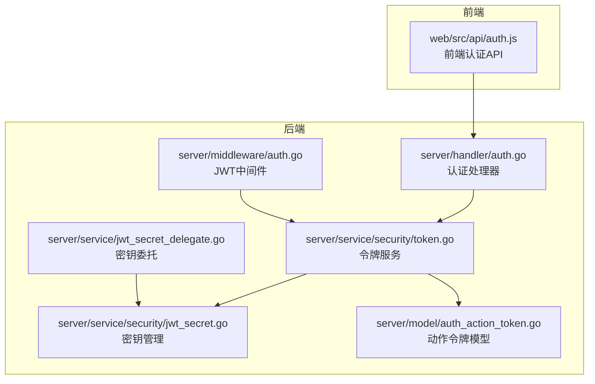
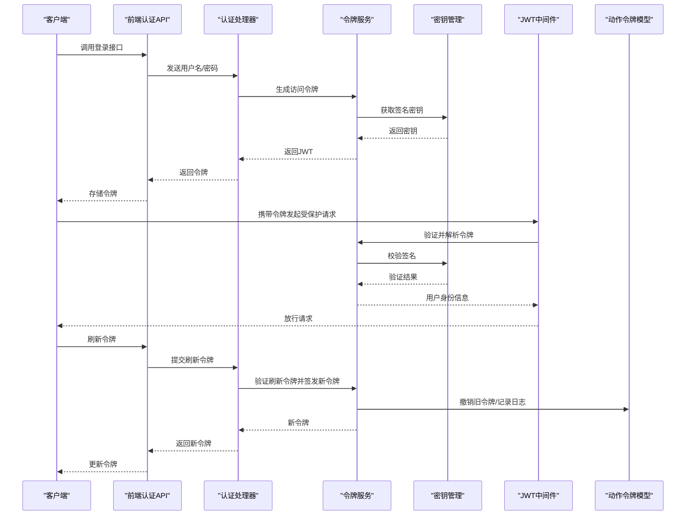
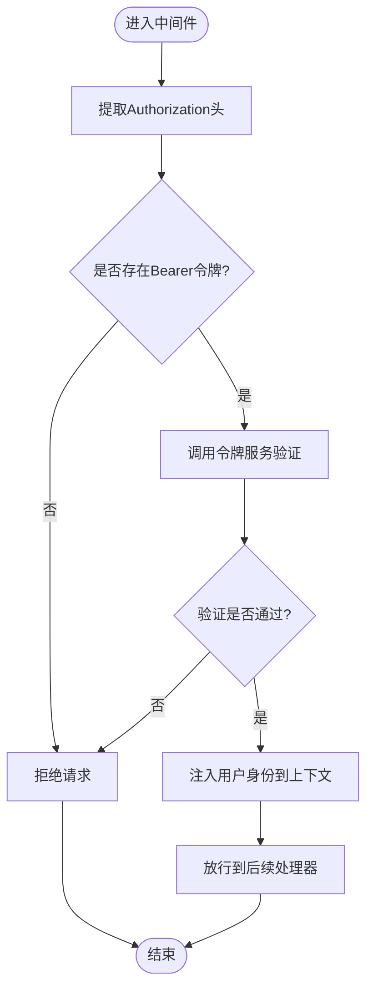
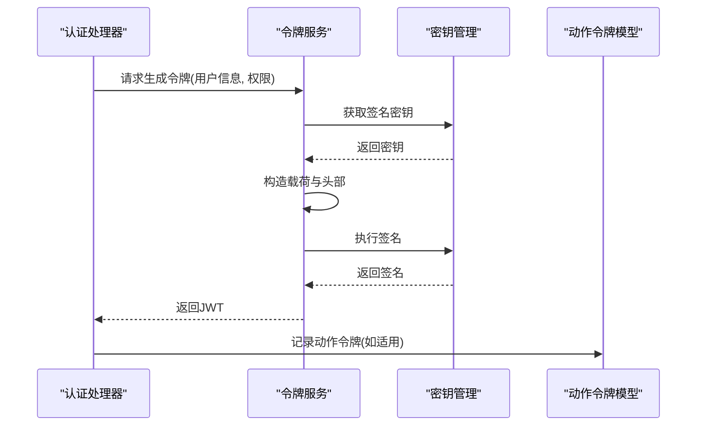
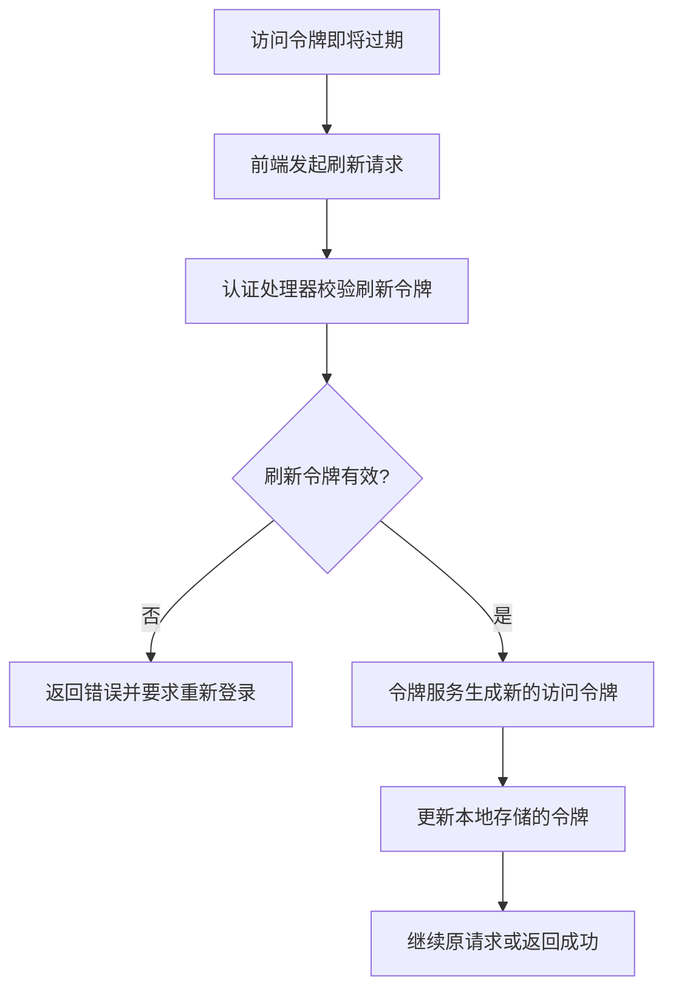
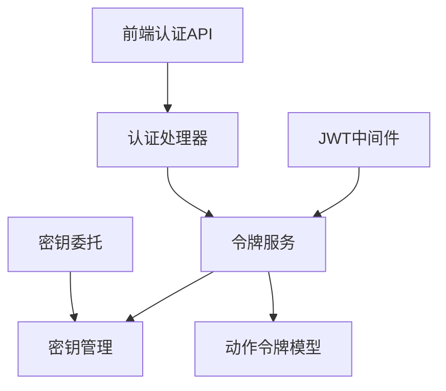

# JWT认证机制

<cite>
**本文档引用的文件**
- [server/middleware/auth.go](file://server/middleware/auth.go)
- [server/handler/auth.go](file://server/handler/auth.go)
- [server/service/security/token.go](file://server/service/security/token.go)
- [server/service/security/jwt_secret.go](file://server/service/security/jwt_secret.go)
- [server/service/jwt_secret_delegate.go](file://server/service/jwt_secret_delegate.go)
- [server/model/auth_action_token.go](file://server/model/auth_action_token.go)
- [web/src/api/auth.js](file://web/src/api/auth.js)
</cite>

## 目录
1. [简介](#简介)
2. [项目结构](#项目结构)
3. [核心组件](#核心组件)
4. [架构概览](#架构概览)
5. [详细组件分析](#详细组件分析)
6. [依赖关系分析](#依赖关系分析)
7. [性能考虑](#性能考虑)
8. [故障排除指南](#故障排除指南)
9. [结论](#结论)

## 简介

本文件详细阐述了系统中的JWT（JSON Web Token）认证机制，包括令牌生成、验证与刷新流程。系统实现了多种类型的令牌以满足不同的安全需求：访问令牌、引导令牌、登录验证令牌以及高风险令牌。本文档将深入解释各类令牌的用途与生命周期、令牌结构、签名算法与安全考量，以及JWT中间件的工作原理，涵盖请求拦截、令牌解析与用户身份验证过程。同时提供令牌过期处理、自动刷新机制、安全最佳实践、配置选项、性能优化建议与故障排除指南。

## 项目结构

JWT认证机制在后端采用分层架构设计，前端通过HTTP API与后端交互。整体结构如下：

图表来源
- [server/middleware/auth.go](file://server/middleware/auth.go)
- [server/handler/auth.go](file://server/handler/auth.go)
- [server/service/security/token.go](file://server/service/security/token.go)
- [server/service/security/jwt_secret.go](file://server/service/security/jwt_secret.go)
- [server/service/jwt_secret_delegate.go](file://server/service/jwt_secret_delegate.go)
- [server/model/auth_action_token.go](file://server/model/auth_action_token.go)

章节来源
- [server/middleware/auth.go](file://server/middleware/auth.go)
- [server/handler/auth.go](file://server/handler/auth.go)
- [server/service/security/token.go](file://server/service/security/token.go)
- [server/service/security/jwt_secret.go](file://server/service/security/jwt_secret.go)
- [server/service/jwt_secret_delegate.go](file://server/service/jwt_secret_delegate.go)
- [server/model/auth_action_token.go](file://server/model/auth_action_token.go)

## 核心组件

- JWT中间件：负责拦截HTTP请求，提取并验证JWT令牌，解析用户身份信息，注入到请求上下文中。
- 认证处理器：处理登录、登出等认证相关接口，生成或撤销令牌。
- 令牌服务：封装JWT生成、验证、刷新与撤销逻辑，管理不同类型的令牌。
- 密钥管理：维护JWT签名密钥，支持密钥轮换与安全存储。
- 动作令牌模型：持久化存储特定操作（如密码重置、邀请注册）所需的临时令牌。
- 前端认证API：提供登录、登出、刷新令牌等前端调用接口。

章节来源
- [server/middleware/auth.go](file://server/middleware/auth.go)
- [server/handler/auth.go](file://server/handler/auth.go)
- [server/service/security/token.go](file://server/service/security/token.go)
- [server/service/security/jwt_secret.go](file://server/service/security/jwt_secret.go)
- [server/model/auth_action_token.go](file://server/model/auth_action_token.go)
- [web/src/api/auth.js](file://web/src/api/auth.js)

## 架构概览

下图展示了JWT认证从请求到响应的完整流程，包括令牌生成、验证与刷新的关键步骤。

图表来源
- [server/middleware/auth.go](file://server/middleware/auth.go)
- [server/handler/auth.go](file://server/handler/auth.go)
- [server/service/security/token.go](file://server/service/security/token.go)
- [server/service/security/jwt_secret.go](file://server/service/security/jwt_secret.go)
- [server/model/auth_action_token.go](file://server/model/auth_action_token.go)
- [web/src/api/auth.js](file://web/src/api/auth.js)

## 详细组件分析

### JWT中间件工作原理

JWT中间件负责全局拦截HTTP请求，执行以下流程：
- 提取Authorization头中的Bearer令牌
- 调用令牌服务进行验证与解析
- 将用户身份信息注入到请求上下文
- 对于需要刷新的场景，触发自动刷新逻辑

图表来源
- [server/middleware/auth.go](file://server/middleware/auth.go)
- [server/service/security/token.go](file://server/service/security/token.go)

章节来源
- [server/middleware/auth.go](file://server/middleware/auth.go)
- [server/service/security/token.go](file://server/service/security/token.go)

### 令牌类型与生命周期

系统实现多种令牌类型以满足不同安全场景：

- 访问令牌：用于常规API访问，具有较短有效期，支持刷新。
- 引导令牌：用于首次登录后的初始化流程，有效期较短且不可刷新。
- 登录验证令牌：用于二次验证（如TOTP），短期有效，一次性使用。
- 高风险令牌：用于高敏感操作（如修改密码、删除账户），有效期极短，严格审计。

生命周期管理要点：
- 过期检测：服务端在验证时检查exp字段。
- 自动刷新：当访问令牌接近过期时，前端触发刷新流程。
- 撤销机制：对高风险操作或异常行为立即撤销相关令牌。

章节来源
- [server/service/security/token.go](file://server/service/security/token.go)
- [server/model/auth_action_token.go](file://server/model/auth_action_token.go)

### 令牌结构与签名算法

- 结构：遵循标准JWT格式，包含头部、载荷与签名三部分。
- 载荷：包含用户标识、角色、权限范围、发行时间、过期时间等声明。
- 签名：采用对称或非对称算法，由密钥管理模块统一维护与轮换。

章节来源
- [server/service/security/token.go](file://server/service/security/token.go)
- [server/service/security/jwt_secret.go](file://server/service/security/jwt_secret.go)

### 令牌生成与验证流程

图表来源
- [server/handler/auth.go](file://server/handler/auth.go)
- [server/service/security/token.go](file://server/service/security/token.go)
- [server/service/security/jwt_secret.go](file://server/service/security/jwt_secret.go)
- [server/model/auth_action_token.go](file://server/model/auth_action_token.go)

章节来源
- [server/handler/auth.go](file://server/handler/auth.go)
- [server/service/security/token.go](file://server/service/security/token.go)
- [server/service/security/jwt_secret.go](file://server/service/security/jwt_secret.go)
- [server/model/auth_action_token.go](file://server/model/auth_action_token.go)

### 令牌刷新机制

图表来源
- [server/handler/auth.go](file://server/handler/auth.go)
- [server/service/security/token.go](file://server/service/security/token.go)

章节来源
- [server/handler/auth.go](file://server/handler/auth.go)
- [server/service/security/token.go](file://server/service/security/token.go)

### 安全最佳实践

- 密钥管理：定期轮换签名密钥，确保密钥存储安全，避免硬编码。
- 传输安全：强制使用HTTPS，防止令牌在传输过程中被窃取。
- 存储安全：前端仅在内存中保存令牌，避免写入localStorage或cookie；必要时使用HttpOnly Cookie。
- 最小权限：令牌载荷中仅包含必要的声明，降低泄露风险。
- 审计与监控：对高风险令牌与敏感操作进行日志记录与告警。
- 速率限制：对认证接口实施速率限制，防范暴力破解。

章节来源
- [server/service/security/jwt_secret.go](file://server/service/security/jwt_secret.go)
- [server/service/security/token.go](file://server/service/security/token.go)

## 依赖关系分析

JWT认证机制的内部依赖关系如下：

图表来源
- [server/middleware/auth.go](file://server/middleware/auth.go)
- [server/handler/auth.go](file://server/handler/auth.go)
- [server/service/security/token.go](file://server/service/security/token.go)
- [server/service/security/jwt_secret.go](file://server/service/security/jwt_secret.go)
- [server/service/jwt_secret_delegate.go](file://server/service/jwt_secret_delegate.go)
- [server/model/auth_action_token.go](file://server/model/auth_action_token.go)
- [web/src/api/auth.js](file://web/src/api/auth.js)

章节来源
- [server/middleware/auth.go](file://server/middleware/auth.go)
- [server/handler/auth.go](file://server/handler/auth.go)
- [server/service/security/token.go](file://server/service/security/token.go)
- [server/service/security/jwt_secret.go](file://server/service/security/jwt_secret.go)
- [server/service/jwt_secret_delegate.go](file://server/service/jwt_secret_delegate.go)
- [server/model/auth_action_token.go](file://server/model/auth_action_token.go)
- [web/src/api/auth.js](file://web/src/api/auth.js)

## 性能考虑

- 缓存策略：对频繁访问的用户权限信息进行缓存，减少重复计算。
- 并发控制：令牌验证应尽量无锁化或使用高效的并发数据结构。
- 日志优化：避免在高频路径中输出大量日志，影响吞吐量。
- 网络开销：合理设置令牌有效期，平衡安全性与网络往返次数。
- 数据库负载：动作令牌的持久化应使用索引与批量写入，降低数据库压力。

## 故障排除指南

常见问题与排查步骤：
- 令牌无效或过期
  - 检查令牌是否正确携带在Authorization头中
  - 验证服务器时间同步，避免因时钟偏差导致验证失败
  - 确认签名密钥未被意外更改或轮换
- 刷新失败
  - 确认刷新令牌未被撤销或过期
  - 检查前后端时间戳一致性
  - 查看服务端日志定位具体错误原因
- 中间件拦截异常
  - 确认中间件顺序与路由匹配规则
  - 检查是否遗漏了无需鉴权的公开接口
- 前端存储问题
  - 确保前端未将令牌写入不安全的存储位置
  - 检查浏览器隐私模式或第三方Cookie策略

章节来源
- [server/middleware/auth.go](file://server/middleware/auth.go)
- [server/handler/auth.go](file://server/handler/auth.go)
- [server/service/security/token.go](file://server/service/security/token.go)
- [server/service/security/jwt_secret.go](file://server/service/security/jwt_secret.go)
- [server/model/auth_action_token.go](file://server/model/auth_action_token.go)
- [web/src/api/auth.js](file://web/src/api/auth.js)

## 结论

本JWT认证机制通过清晰的分层设计与严格的令牌生命周期管理，提供了灵活且安全的身份验证能力。结合密钥轮换、多类型令牌与完善的刷新策略，系统能够在保证安全性的前提下提升用户体验。建议在生产环境中配合HTTPS、严格的密钥管理与审计日志，持续监控与优化性能表现。