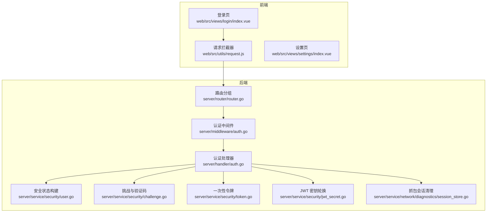
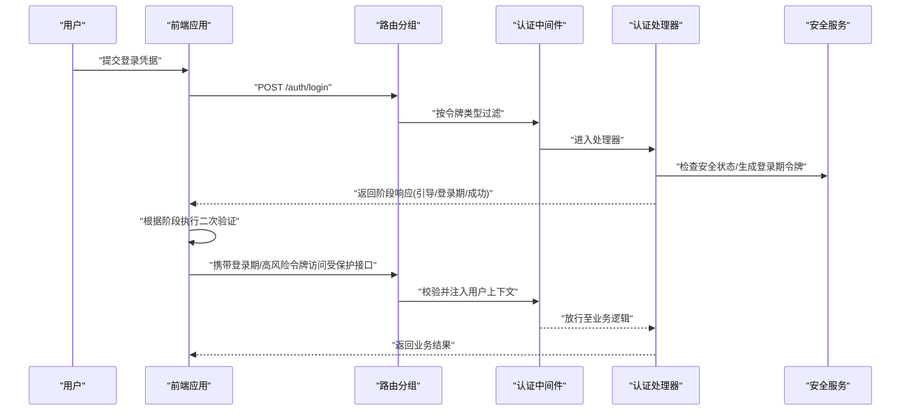
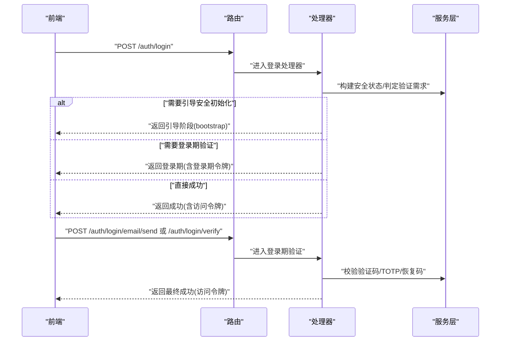
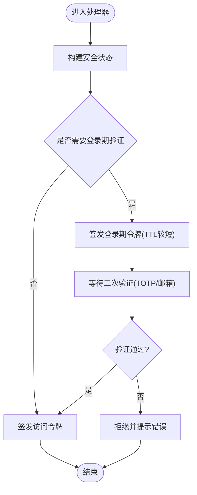
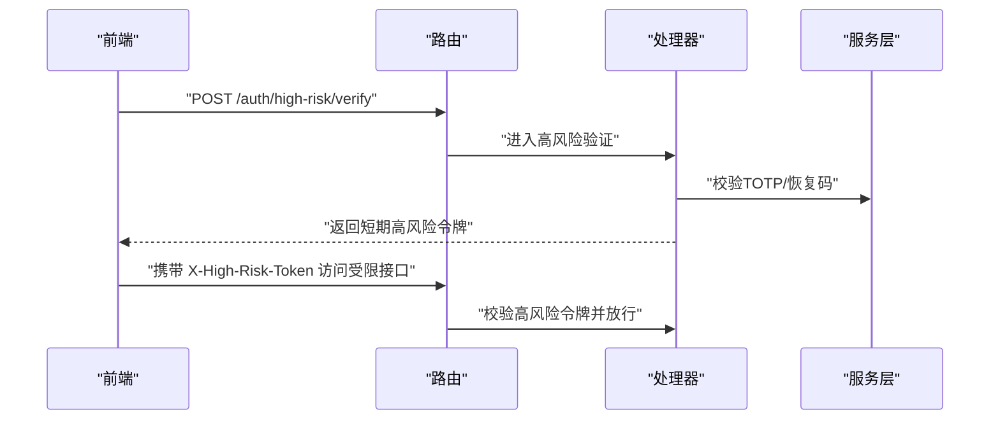
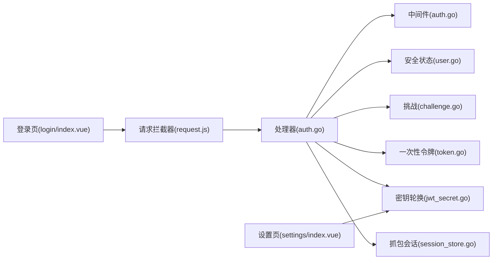

# 会话管理

<cite>
**本文引用的文件**
- [server/middleware/auth.go](file://server/middleware/auth.go)
- [server/router/router.go](file://server/router/router.go)
- [server/handler/auth.go](file://server/handler/auth.go)
- [server/service/security/jwt_secret.go](file://server/service/security/jwt_secret.go)
- [server/service/security/challenge.go](file://server/service/security/challenge.go)
- [server/service/security/token.go](file://server/service/security/token.go)
- [server/service/security/user.go](file://server/service/security/user.go)
- [server/handler/security_helper.go](file://server/handler/security_helper.go)
- [web/src/views/login/index.vue](file://web/src/views/login/index.vue)
- [web/src/utils/request.js](file://web/src/utils/request.js)
- [web/src/views/settings/index.vue](file://web/src/views/settings/index.vue)
- [server/service/network/diagnostics/session_store.go](file://server/service/network/diagnostics/session_store.go)
</cite>

## 目录
1. [引言](#引言)
2. [项目结构](#项目结构)
3. [核心组件](#核心组件)
4. [架构总览](#架构总览)
5. [组件详解](#组件详解)
6. [依赖关系分析](#依赖关系分析)
7. [性能考量](#性能考量)
8. [故障排查指南](#故障排查指南)
9. [结论](#结论)
10. [附录](#附录)

## 引言
本文件面向会话管理系统，系统采用基于 JWT 的多阶段认证与授权模型，结合登录期验证、高风险二次验证与密钥轮换等机制，实现对用户会话的建立、维护与销毁的全流程治理。文档覆盖会话状态管理（登录状态跟踪、会话超时与续期、并发会话控制）、会话安全机制（会话固定攻击防护、会话劫持防范、敏感操作保护）、会话数据存储与同步、配置项与性能优化、监控指标以及最佳实践与安全加固建议。

## 项目结构
后端以 Gin 作为 Web 框架，通过中间件链路实现认证与授权；路由按“安全阶段”分组，分别处理登录期、安全初始化与高风险操作；前端通过统一请求拦截器处理高风险二次验证与会话状态展示。

图示来源
- [server/router/router.go:54-86](file://server/router/router.go#L54-L86)
- [server/middleware/auth.go:38-83](file://server/middleware/auth.go#L38-L83)
- [server/handler/auth.go:16-429](file://server/handler/auth.go#L16-L429)
- [server/service/security/user.go:36-72](file://server/service/security/user.go#L36-L72)
- [server/service/security/challenge.go:130-168](file://server/service/security/challenge.go#L130-L168)
- [server/service/security/token.go:45-87](file://server/service/security/token.go#L45-L87)
- [server/service/security/jwt_secret.go:32-131](file://server/service/security/jwt_secret.go#L32-L131)
- [server/service/network/diagnostics/session_store.go:91-105](file://server/service/network/diagnostics/session_store.go#L91-L105)

章节来源
- [server/router/router.go:54-86](file://server/router/router.go#L54-L86)
- [server/middleware/auth.go:38-83](file://server/middleware/auth.go#L38-L83)
- [server/handler/auth.go:16-429](file://server/handler/auth.go#L16-L429)

## 核心组件
- 认证中间件与 JWT 生成/解析
  - 提供多种令牌类型（访问、登录期、引导、高风险）与 TTL 控制，支持按类型过滤与校验。
- 登录流程与多阶段验证
  - 支持引导安全初始化、登录期验证（TOTP/邮箱验证码），并根据用户角色与安全状态动态决定验证方式。
- 高风险二次验证
  - 对高风险操作进行二次验证，生成短期高风险令牌并在后续请求中携带。
- 密钥轮换与安全状态
  - 定时轮换 JWT 密钥，轮换后旧令牌立即失效；安全状态由用户信息与系统策略共同决定。
- 抓包会话清理
  - 清理过期的抓包会话，避免资源泄漏。

章节来源
- [server/middleware/auth.go:38-83](file://server/middleware/auth.go#L38-L83)
- [server/handler/auth.go:16-429](file://server/handler/auth.go#L16-L429)
- [server/service/security/jwt_secret.go:32-131](file://server/service/security/jwt_secret.go#L32-L131)
- [server/service/security/user.go:36-72](file://server/service/security/user.go#L36-L72)
- [server/service/network/diagnostics/session_store.go:91-105](file://server/service/network/diagnostics/session_store.go#L91-L105)

## 架构总览
系统围绕“路由分组 + 中间件 + 处理器 + 服务层”的层次化设计展开，前端通过拦截器统一处理高风险二次验证与会话状态展示。

图示来源
- [server/router/router.go:54-86](file://server/router/router.go#L54-L86)
- [server/middleware/auth.go:75-83](file://server/middleware/auth.go#L75-L83)
- [server/handler/auth.go:127-202](file://server/handler/auth.go#L127-L202)
- [server/handler/auth.go:352-429](file://server/handler/auth.go#L352-L429)

## 组件详解

### 1) 会话建立与登录流程
- 建立阶段
  - 用户提交凭据后，系统根据用户安全状态判断是否需要引导安全初始化或登录期验证。
  - 登录期令牌（短 TTL）用于完成 TOTP 或邮箱验证码验证；验证通过后发放访问令牌。
- 并发与会话控制
  - 系统通过一次性令牌与挑战机制限制同一会话窗口内的操作有效性，避免重复使用。
- 前端交互
  - 登录页根据返回的阶段与允许方法动态切换 UI，支持 TOTP 与邮箱验证码两种验证方式。

图示来源
- [server/handler/auth.go:127-202](file://server/handler/auth.go#L127-L202)
- [server/handler/auth.go:319-350](file://server/handler/auth.go#L319-L350)
- [server/handler/auth.go:352-429](file://server/handler/auth.go#L352-L429)
- [web/src/views/login/index.vue:481-526](file://web/src/views/login/index.vue#L481-L526)

章节来源
- [server/handler/auth.go:127-202](file://server/handler/auth.go#L127-L202)
- [server/handler/auth.go:319-350](file://server/handler/auth.go#L319-L350)
- [server/handler/auth.go:352-429](file://server/handler/auth.go#L352-L429)
- [web/src/views/login/index.vue:481-526](file://web/src/views/login/index.vue#L481-L526)

### 2) 会话状态管理
- 登录状态跟踪
  - 安全状态由用户邮箱、TOTP、SMTP 配置、维护模式、开发模式、登录验证窗口等字段构成，前端据此决定 UI 与交互策略。
- 会话超时与续期
  - 登录期令牌与高风险令牌均带有 TTL；登录期令牌短 TTL，高风险令牌更短 TTL，降低暴露面。
- 并发会话控制
  - 一次性挑战与验证码在消费后失效，避免并发重放；同时支持对未消费令牌进行失效处理。

图示来源
- [server/service/security/user.go:36-72](file://server/service/security/user.go#L36-L72)
- [server/handler/auth.go:127-202](file://server/handler/auth.go#L127-L202)
- [server/service/security/challenge.go:130-168](file://server/service/security/challenge.go#L130-L168)

章节来源
- [server/service/security/user.go:36-72](file://server/service/security/user.go#L36-L72)
- [server/service/security/challenge.go:130-168](file://server/service/security/challenge.go#L130-L168)
- [server/handler/auth.go:127-202](file://server/handler/auth.go#L127-L202)

### 3) 会话安全机制
- 会话固定攻击防护
  - 登录期令牌与访问令牌分离，登录期令牌仅用于完成验证，验证完成后发放新的访问令牌；一次性挑战与验证码消费即失效。
- 会话劫持防范
  - 使用强随机密钥进行签名，支持定时轮换；轮换后旧令牌立即失效，强制用户重新登录。
- 敏感操作保护
  - 高风险操作需二次验证，生成短期高风险令牌并在后续请求头中携带，服务端校验后放行。

图示来源
- [server/handler/auth.go:661-697](file://server/handler/auth.go#L661-L697)
- [web/src/utils/request.js:113-145](file://web/src/utils/request.js#L113-L145)

章节来源
- [server/handler/auth.go:661-697](file://server/handler/auth.go#L661-L697)
- [web/src/utils/request.js:113-145](file://web/src/utils/request.js#L113-L145)

### 4) 会话数据存储与同步
- 存储与同步
  - JWT 密钥轮换后，运行时即时生效并持久化到 .env；同时尝试写入数据库记录轮换时间，便于审计。
  - 抓包会话在内存中维护，定期清理过期会话，避免资源泄漏。
- 数据一致性
  - 一次性令牌与验证码在消费后标记为已使用，保证单次有效；未消费的令牌可按用户与用途批量失效。

章节来源
- [server/service/security/jwt_secret.go:32-131](file://server/service/security/jwt_secret.go#L32-L131)
- [server/service/network/diagnostics/session_store.go:91-105](file://server/service/network/diagnostics/session_store.go#L91-L105)
- [server/service/security/token.go:45-87](file://server/service/security/token.go#L45-L87)

### 5) 配置选项与性能优化
- 配置项
  - JWT 密钥轮换周期（小时），0 表示禁用；开发模式下跳过轮换；默认密钥禁止自动轮换。
  - 设置页提供手动轮换入口，轮换后所有 Token 失效，需重新登录。
- 性能优化
  - 登录期与高风险令牌短 TTL，降低长期暴露风险；一次性挑战与验证码消费即失效，减少无效请求。
  - 抓包会话定期清理，避免长时间占用内存。

章节来源
- [server/service/security/jwt_secret.go:94-131](file://server/service/security/jwt_secret.go#L94-L131)
- [web/src/views/settings/index.vue:796-822](file://web/src/views/settings/index.vue#L796-L822)
- [server/service/network/diagnostics/session_store.go:91-105](file://server/service/network/diagnostics/session_store.go#L91-L105)

### 6) 监控指标建议
- 认证相关
  - 登录成功率、登录期验证通过率、高风险验证通过率、一次性验证码/令牌消费率。
- 安全相关
  - JWT 密钥轮换次数与失败率、异常登录尝试次数、高风险操作失败次数。
- 资源相关
  - 抓包会话数量峰值、清理频率与保留时长。

## 依赖关系分析

图示来源
- [server/handler/auth.go:16-429](file://server/handler/auth.go#L16-L429)
- [server/middleware/auth.go:38-83](file://server/middleware/auth.go#L38-L83)
- [server/service/security/user.go:36-72](file://server/service/security/user.go#L36-L72)
- [server/service/security/challenge.go:130-168](file://server/service/security/challenge.go#L130-L168)
- [server/service/security/token.go:45-87](file://server/service/security/token.go#L45-L87)
- [server/service/security/jwt_secret.go:32-131](file://server/service/security/jwt_secret.go#L32-L131)
- [server/service/network/diagnostics/session_store.go:91-105](file://server/service/network/diagnostics/session_store.go#L91-L105)
- [web/src/utils/request.js:113-145](file://web/src/utils/request.js#L113-L145)
- [web/src/views/login/index.vue:481-526](file://web/src/views/login/index.vue#L481-L526)
- [web/src/views/settings/index.vue:796-822](file://web/src/views/settings/index.vue#L796-L822)

章节来源
- [server/handler/auth.go:16-429](file://server/handler/auth.go#L16-L429)
- [server/middleware/auth.go:38-83](file://server/middleware/auth.go#L38-L83)
- [server/service/security/jwt_secret.go:32-131](file://server/service/security/jwt_secret.go#L32-L131)
- [web/src/utils/request.js:113-145](file://web/src/utils/request.js#L113-L145)

## 性能考量
- 令牌 TTL 设计
  - 登录期令牌短 TTL，高风险令牌更短 TTL，降低长期暴露风险的同时减少无效会话维持成本。
- 一次性挑战与验证码
  - 消费即失效，避免重复验证带来的额外开销。
- 定时清理
  - 抓包会话定期清理，避免长时间占用内存与磁盘空间。

## 故障排查指南
- 登录失败或验证错误
  - 检查验证码/一次性令牌是否过期或已被消费；确认用户邮箱绑定状态与 SMTP 配置。
- 高风险操作被拒绝
  - 确认是否已完成高风险二次验证并正确携带短期高风险令牌。
- 密钥轮换后无法访问
  - 密钥轮换会导致旧令牌失效，需重新登录；检查轮换周期与开发模式配置。
- 抓包会话异常
  - 检查会话清理任务是否正常运行，确认会话状态与更新时间。

章节来源
- [server/service/security/challenge.go:130-168](file://server/service/security/challenge.go#L130-L168)
- [server/handler/auth.go:661-697](file://server/handler/auth.go#L661-L697)
- [server/service/security/jwt_secret.go:94-131](file://server/service/security/jwt_secret.go#L94-L131)
- [server/service/network/diagnostics/session_store.go:91-105](file://server/service/network/diagnostics/session_store.go#L91-L105)

## 结论
该会话管理系统通过多阶段认证、一次性挑战与令牌轮换等机制，实现了对会话生命周期的精细化治理。配合前端统一的高风险二次验证与会话状态展示，整体具备良好的安全性与可运维性。建议在生产环境中启用密钥轮换、合理设置 TTL、完善监控与告警，并持续评估与优化用户体验。

## 附录
- 最佳实践
  - 启用并定期轮换 JWT 密钥；为高风险操作设置严格的二次验证；对登录期与高风险令牌设置合理的短 TTL。
  - 在开发环境谨慎开启安全验证豁免，避免误判生产风险。
- 安全加固建议
  - 强制要求邮箱绑定与 TOTP；对管理员账户优先采用 TOTP；定期审查与清理一次性令牌与验证码。
  - 对异常登录与高风险操作增加审计与告警。