# 安全挑战机制

<cite>
**本文档引用的文件**
- [server/model/security_challenge.go](file://server/model/security_challenge.go)
- [server/model/user.go](file://server/model/user.go)
- [server/service/security/challenge.go](file://server/service/security/challenge.go)
- [server/service/security/totp.go](file://server/service/security/totp.go)
- [server/service/security/smtp.go](file://server/service/security/smtp.go)
- [server/service/security/constants.go](file://server/service/security/constants.go)
- [server/service/security/account.go](file://server/service/security/account.go)
- [server/service/security/crypto.go](file://server/service/security/crypto.go)
- [server/config/config.go](file://server/config/config.go)
- [server/handler/auth.go](file://server/handler/auth.go)
</cite>

## 目录
1. [引言](#引言)
2. [项目结构](#项目结构)
3. [核心组件](#核心组件)
4. [架构概览](#架构概览)
5. [详细组件分析](#详细组件分析)
6. [依赖分析](#依赖分析)
7. [性能考虑](#性能考虑)
8. [故障排除指南](#故障排除指南)
9. [结论](#结论)

## 引言

本文件全面阐述了 QVMConsole 系统中的安全挑战机制，重点涵盖多因素认证（MFA）的实现，包括 TOTP、邮箱验证码和恢复码三种验证方式。文档详细解释了安全挑战的触发条件和验证流程，包括登录验证、高风险操作验证等场景；说明了挑战码的生成、发送、验证和过期机制；解释了挑战状态管理和重复验证防护措施；提供了不同验证方式的配置选项、用户体验优化和安全考虑；并包含挑战机制的故障排除、监控告警和安全审计功能。

## 项目结构

安全挑战机制涉及的核心模块分布如下：

- 数据模型层：定义安全挑战记录和用户安全状态字段
- 服务层：实现挑战生成、验证、TOTP 和恢复码管理、SMTP 邮件发送等功能
- 处理器层：暴露登录、验证、高风险操作等 API 接口
- 配置层：管理 SMTP 配置和系统安全密钥

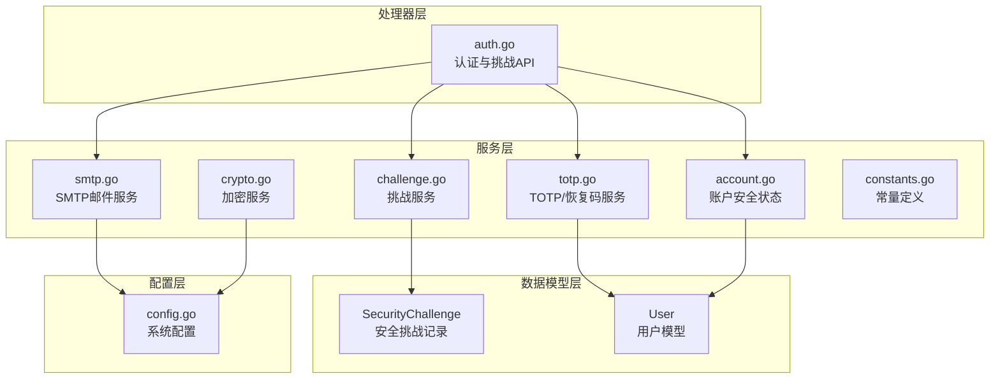

**图表来源**
- [server/model/security_challenge.go:1-23](file://server/model/security_challenge.go#L1-L23)
- [server/model/user.go:1-56](file://server/model/user.go#L1-L56)
- [server/service/security/challenge.go:1-183](file://server/service/security/challenge.go#L1-L183)
- [server/service/security/totp.go:1-163](file://server/service/security/totp.go#L1-L163)
- [server/service/security/smtp.go:1-318](file://server/service/security/smtp.go#L1-L318)
- [server/service/security/account.go:450-675](file://server/service/security/account.go#L450-L675)
- [server/service/security/crypto.go:1-73](file://server/service/security/crypto.go#L1-L73)
- [server/service/security/constants.go:1-46](file://server/service/security/constants.go#L1-L46)
- [server/config/config.go:19-824](file://server/config/config.go#L19-L824)
- [server/handler/auth.go:1-997](file://server/handler/auth.go#L1-L997)

**章节来源**
- [server/model/security_challenge.go:1-23](file://server/model/security_challenge.go#L1-L23)
- [server/model/user.go:1-56](file://server/model/user.go#L1-L56)
- [server/service/security/challenge.go:1-183](file://server/service/security/challenge.go#L1-L183)
- [server/service/security/totp.go:1-163](file://server/service/security/totp.go#L1-L163)
- [server/service/security/smtp.go:1-318](file://server/service/security/smtp.go#L1-L318)
- [server/service/security/account.go:450-675](file://server/service/security/account.go#L450-L675)
- [server/service/security/crypto.go:1-73](file://server/service/security/crypto.go#L1-L73)
- [server/service/security/constants.go:1-46](file://server/service/security/constants.go#L1-L46)
- [server/config/config.go:19-824](file://server/config/config.go#L19-L824)
- [server/handler/auth.go:1-997](file://server/handler/auth.go#L1-L997)

## 核心组件

### 安全挑战数据模型

安全挑战机制的核心数据模型由两个主要结构组成：

- **SecurityChallenge**：存储一次性验证码及其元数据
- **User**：扩展用户模型，包含安全状态字段

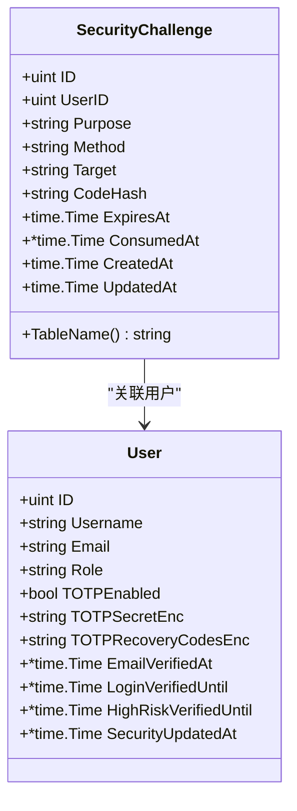

**图表来源**
- [server/model/security_challenge.go:5-22](file://server/model/security_challenge.go#L5-L22)
- [server/model/user.go:9-49](file://server/model/user.go#L9-L49)

### 验证方式与常量

系统支持三种验证方式，每种都有对应的常量定义：

- **邮箱验证码** (`email`)：基于一次性数字验证码的验证
- **TOTP** (`totp`)：基于时间的一次性密码验证
- **恢复码** (`recovery`)：预生成的备用验证码

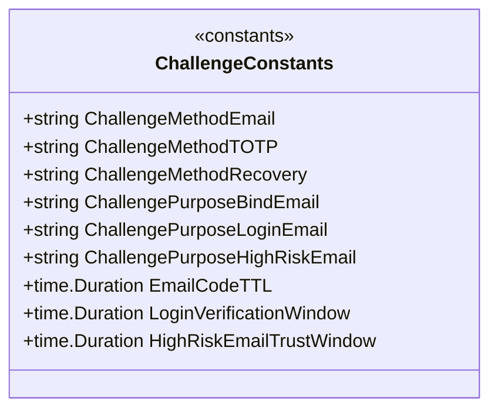

**图表来源**
- [server/service/security/constants.go:20-45](file://server/service/security/constants.go#L20-L45)

**章节来源**
- [server/model/security_challenge.go:5-22](file://server/model/security_challenge.go#L5-L22)
- [server/model/user.go:9-49](file://server/model/user.go#L9-L49)
- [server/service/security/constants.go:20-45](file://server/service/security/constants.go#L20-L45)

## 架构概览

安全挑战机制采用分层架构设计，确保验证流程的安全性和可扩展性：

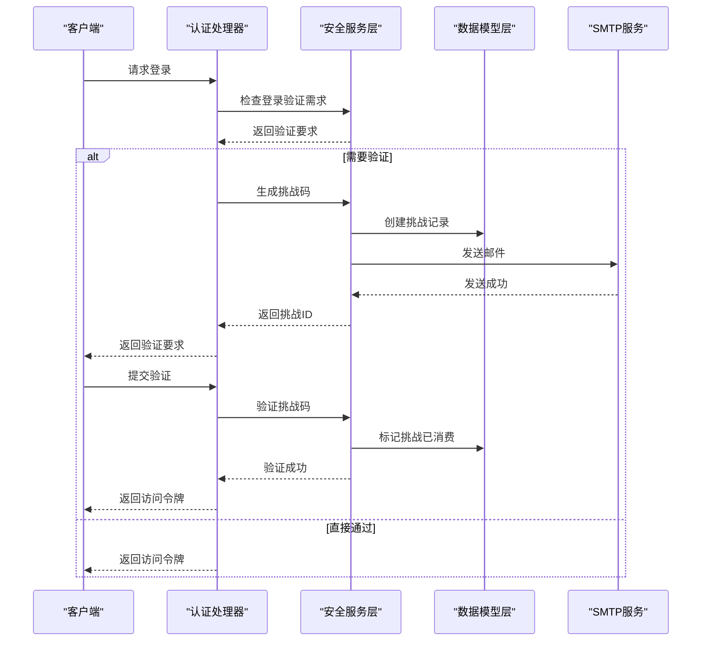

**图表来源**
- [server/handler/auth.go:101-202](file://server/handler/auth.go#L101-L202)
- [server/service/security/challenge.go:15-51](file://server/service/security/challenge.go#L15-L51)
- [server/service/security/smtp.go:181-266](file://server/service/security/smtp.go#L181-L266)

## 详细组件分析

### 邮箱验证码挑战

邮箱验证码是系统中最常用的验证方式，适用于登录验证、邮箱绑定和高风险操作等多种场景。

#### 生成与发送流程

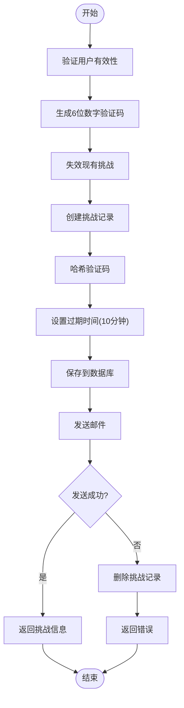

**图表来源**
- [server/service/security/challenge.go:15-51](file://server/service/security/challenge.go#L15-L51)
- [server/service/security/challenge.go:124-136](file://server/service/security/challenge.go#L124-L136)

#### 验证与消费流程

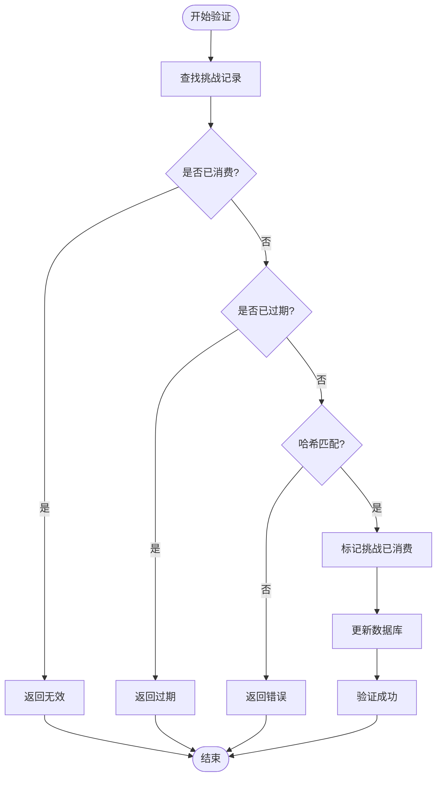

**图表来源**
- [server/service/security/challenge.go:88-122](file://server/service/security/challenge.go#L88-L122)
- [server/service/security/challenge.go:138-165](file://server/service/security/challenge.go#L138-L165)

**章节来源**
- [server/service/security/challenge.go:15-183](file://server/service/security/challenge.go#L15-L183)

### TOTP 多因素认证

TOTP（基于时间的一次性密码）提供更强的安全保障，特别适合管理员和高级用户。

#### TOTP 配置生成

TOTP 服务支持动态生成 TOTP 配置，包括密钥和二维码信息：

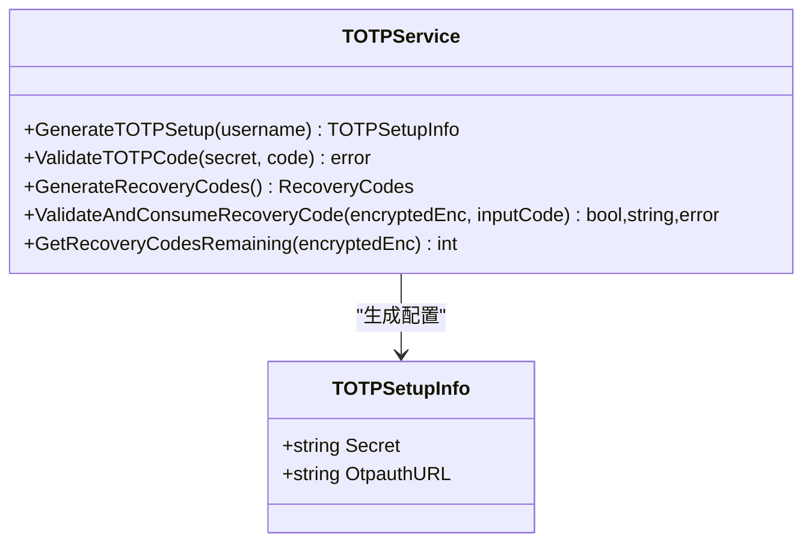

**图表来源**
- [server/service/security/totp.go:17-49](file://server/service/security/totp.go#L17-L49)
- [server/service/security/totp.go:58-95](file://server/service/security/totp.go#L58-L95)

#### 恢复码机制

恢复码提供了一种备用验证方式，防止用户丢失 TOTP 设备时被锁定：

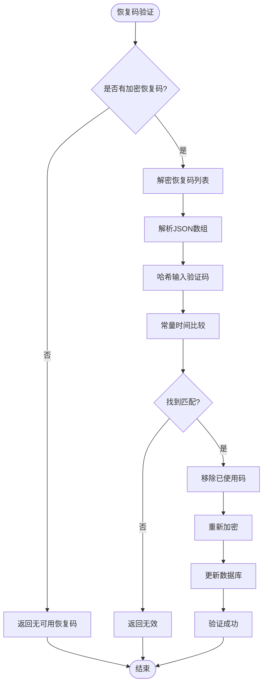

**图表来源**
- [server/service/security/totp.go:97-146](file://server/service/security/totp.go#L97-L146)

**章节来源**
- [server/service/security/totp.go:17-163](file://server/service/security/totp.go#L17-L163)

### SMTP 邮件服务

SMTP 服务负责安全挑战邮件的发送，支持多种安全配置选项。

#### 邮件发送流程

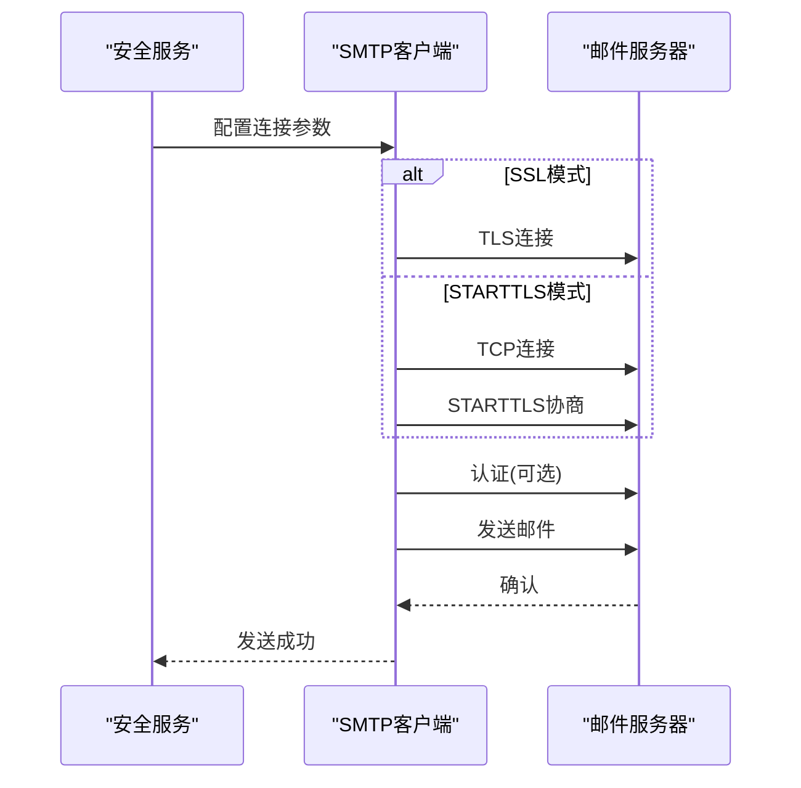

**图表来源**
- [server/service/security/smtp.go:181-266](file://server/service/security/smtp.go#L181-L266)
- [server/service/security/smtp.go:268-294](file://server/service/security/smtp.go#L268-L294)

#### 配置管理

SMTP 服务支持灵活的配置管理，包括：

- 基础配置检查和视图生成
- 测试配置验证
- 运行时密码更新
- 安全连接模式选择

**章节来源**
- [server/service/security/smtp.go:16-318](file://server/service/security/smtp.go#L16-L318)

### 安全状态管理

系统通过多个时间窗口来管理用户的安全状态，确保在合理的时间范围内保持验证有效性。

#### 安全状态判断逻辑

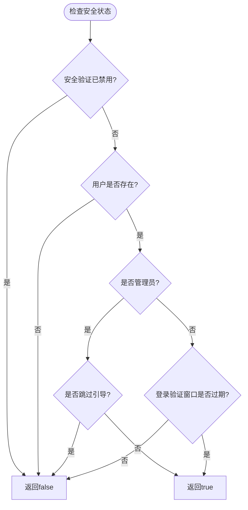

**图表来源**
- [server/service/security/account.go:643-662](file://server/service/security/account.go#L643-L662)

**章节来源**
- [server/service/security/account.go:450-675](file://server/service/security/account.go#L450-L675)

## 依赖分析

安全挑战机制涉及多个模块间的复杂依赖关系：

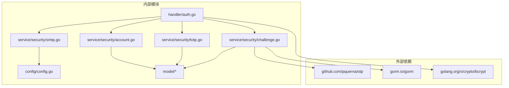

**图表来源**
- [server/handler/auth.go:1-15](file://server/handler/auth.go#L1-L15)
- [server/service/security/challenge.go:3-13](file://server/service/security/challenge.go#L3-L13)
- [server/service/security/totp.go:3-15](file://server/service/security/totp.go#L3-L15)

### 数据流分析

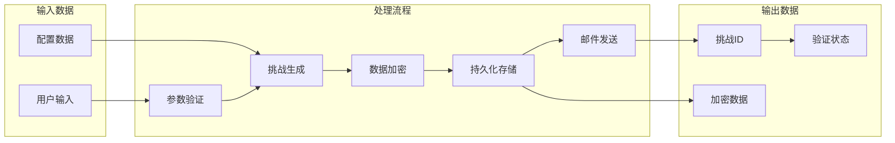

**图表来源**
- [server/service/security/challenge.go:15-51](file://server/service/security/challenge.go#L15-L51)
- [server/service/security/crypto.go:15-67](file://server/service/security/crypto.go#L15-L67)

**章节来源**
- [server/service/security/challenge.go:1-183](file://server/service/security/challenge.go#L1-L183)
- [server/service/security/totp.go:1-163](file://server/service/security/totp.go#L1-L163)
- [server/service/security/smtp.go:1-318](file://server/service/security/smtp.go#L1-L318)
- [server/service/security/account.go:450-675](file://server/service/security/account.go#L450-L675)
- [server/service/security/crypto.go:1-73](file://server/service/security/crypto.go#L1-L73)

## 性能考虑

### 并发安全性

系统通过以下机制确保并发环境下的安全性：

- **数据库事务**：挑战创建和邮件发送在单个事务中完成
- **原子操作**：验证码验证采用原子性的数据库更新
- **常量时间比较**：恢复码验证使用常量时间算法防止时序攻击

### 缓存策略

- **内存缓存**：频繁访问的配置信息缓存在内存中
- **数据库索引**：为常用查询字段建立数据库索引
- **连接池**：SMTP 连接使用连接池复用

### 资源管理

- **超时控制**：所有网络操作设置合理的超时时间
- **重试机制**：邮件发送失败时进行有限次数的重试
- **资源清理**：过期的挑战记录定期清理

## 故障排除指南

### 常见问题诊断

#### SMTP 配置问题

**症状**：验证码邮件发送失败
**排查步骤**：
1. 检查 SMTP 配置是否完整
2. 验证网络连通性
3. 测试 SMTP 认证
4. 查看邮件服务器日志

**解决方案**：
- 确保 SMTP 主机、端口、认证信息正确
- 检查防火墙设置
- 验证 SSL/TLS 配置

#### 验证码过期问题

**症状**：用户收到验证码但无法验证
**排查步骤**：
1. 检查系统时间同步
2. 验证验证码生成时间
3. 确认数据库时间字段

**解决方案**：
- 校正系统时间
- 检查时区设置
- 清理过期记录

#### 恢复码验证失败

**症状**：恢复码无法使用
**排查步骤**：
1. 检查恢复码格式
2. 验证加密密钥
3. 确认数据库更新

**解决方案**：
- 重新生成恢复码
- 检查加密密钥配置
- 手动修复数据库记录

### 监控告警

系统支持以下监控指标：

- **挑战成功率**：验证通过率统计
- **邮件发送失败率**：SMTP 错误统计
- **验证码过期率**：过期挑战统计
- **用户活跃度**：验证频率分析

### 安全审计

系统提供完整的审计功能：

- **操作日志**：记录所有验证操作
- **异常检测**：监控异常验证尝试
- **合规报告**：生成安全合规报告
- **审计追踪**：完整的操作轨迹

**章节来源**
- [server/service/security/smtp.go:45-51](file://server/service/security/smtp.go#L45-L51)
- [server/service/security/challenge.go:146-152](file://server/service/security/challenge.go#L146-L152)
- [server/service/security/totp.go:117-126](file://server/service/security/totp.go#L117-L126)

## 结论

QVMConsole 的安全挑战机制通过多层次的设计实现了强大的安全保障：

1. **多因素认证支持**：同时支持邮箱验证码、TOTP 和恢复码三种验证方式
2. **灵活的触发机制**：根据用户角色和安全状态动态决定验证需求
3. **完善的安全措施**：包括过期控制、重复验证防护、常量时间比较等
4. **良好的用户体验**：提供清晰的错误提示和重试机制
5. **全面的监控审计**：支持完整的安全审计和异常检测

该机制为系统提供了企业级的安全保障，能够有效防范各种常见的安全威胁，同时保持了良好的可维护性和扩展性。