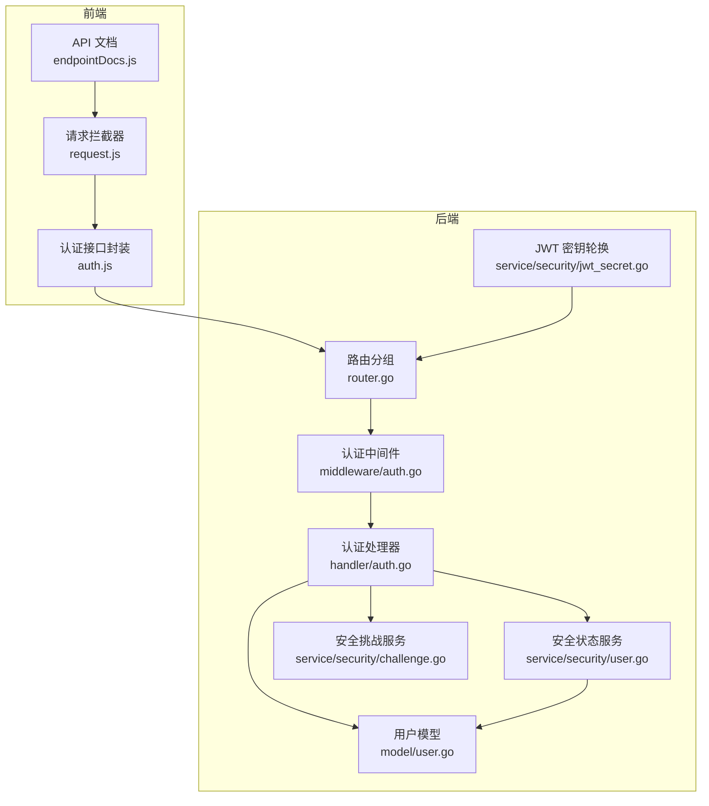
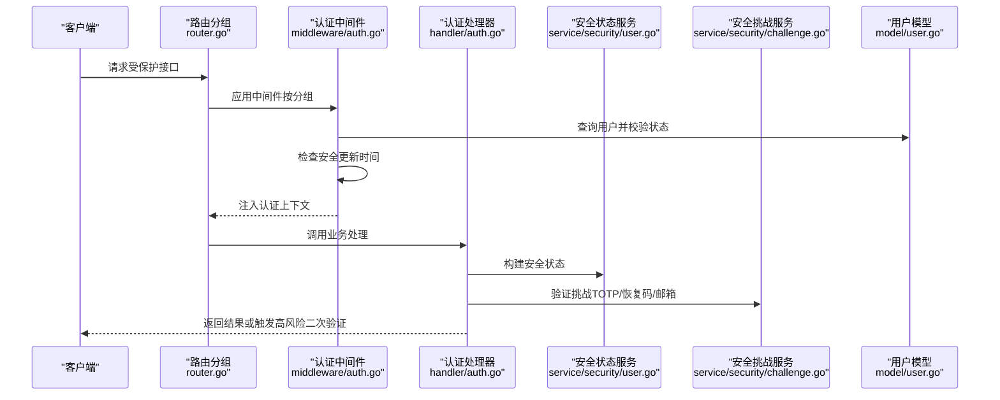
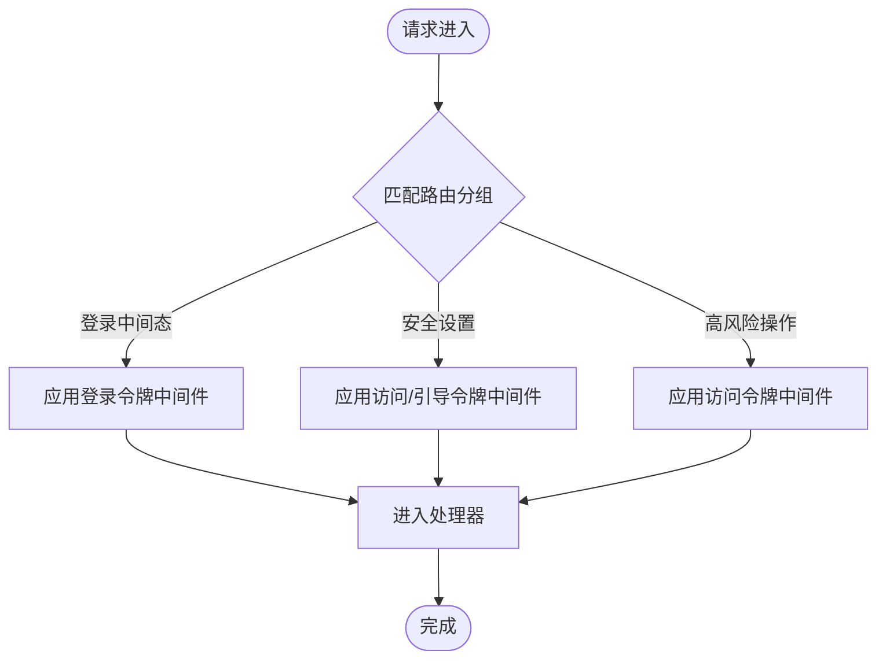
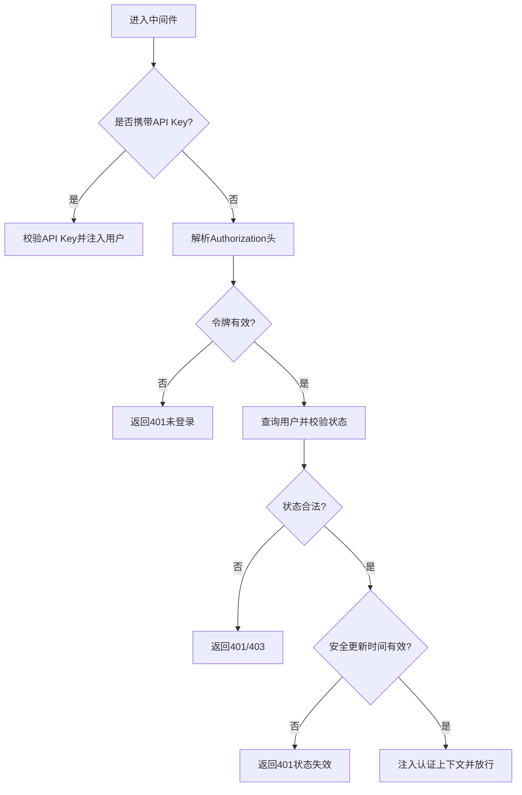
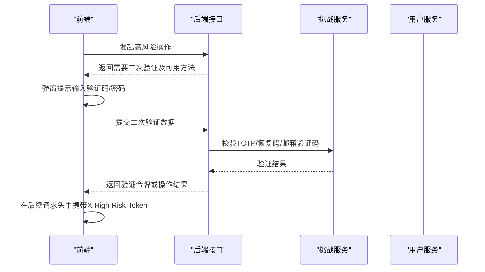
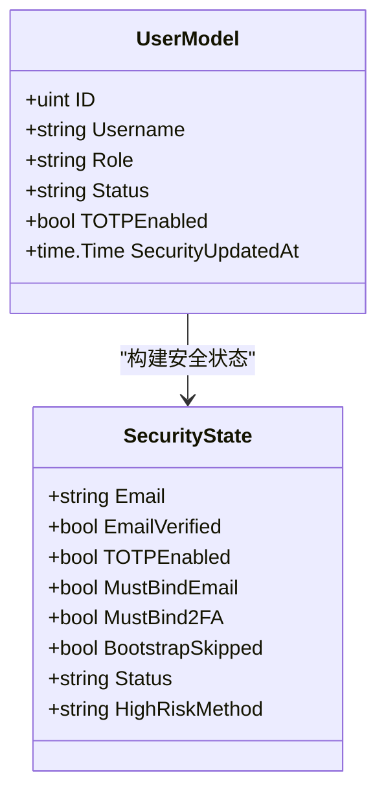
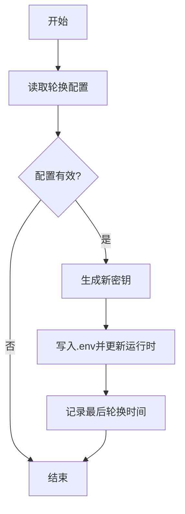
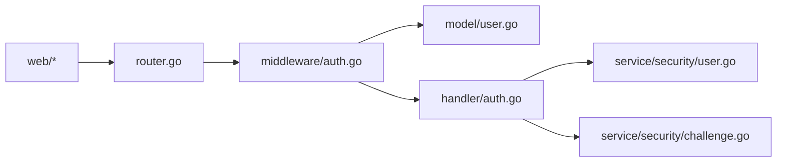

# 权限控制系统

<cite>
**本文档引用的文件**
- [server/router/router.go](file://server/router/router.go)
- [server/middleware/auth.go](file://server/middleware/auth.go)
- [server/handler/auth.go](file://server/handler/auth.go)
- [server/service/security/user.go](file://server/service/security/user.go)
- [server/service/security/challenge.go](file://server/service/security/challenge.go)
- [server/service/security/jwt_secret.go](file://server/service/security/jwt_secret.go)
- [server/model/user.go](file://server/model/user.go)
- [web/src/views/api-docs/endpointDocs.js](file://web/src/views/api-docs/endpointDocs.js)
- [web/src/utils/request.js](file://web/src/utils/request.js)
- [web/src/api/auth.js](file://web/src/api/auth.js)
- [web/src/views/settings/index.vue](file://web/src/views/settings/index.vue)
</cite>

## 目录
1. [简介](#简介)
2. [项目结构](#项目结构)
3. [核心组件](#核心组件)
4. [架构总览](#架构总览)
5. [详细组件分析](#详细组件分析)
6. [依赖关系分析](#依赖关系分析)
7. [性能考量](#性能考量)
8. [故障排除指南](#故障排除指南)
9. [结论](#结论)
10. [附录](#附录)

## 简介
本文件为权限控制系统的技术文档，聚焦于用户角色模型（管理员、普通用户）、基于角色的访问控制（RBAC）、资源级权限管理、权限检查流程（中间件与业务层）、用户状态管理（待激活、禁用、正常）对权限的影响，以及权限配置示例、权限继承关系与权限审计功能。文档同时涵盖相关API接口说明与安全考虑。

## 项目结构
权限控制涉及服务端路由分组、认证中间件、安全挑战与状态管理、用户模型与服务层，以及前端请求拦截与UI展示。整体采用“路由分组 + 中间件 + 服务层”的分层设计，确保不同安全强度的接口具备差异化鉴权策略。

图表来源
- [server/router/router.go:54-86](file://server/router/router.go#L54-L86)
- [server/middleware/auth.go:90-199](file://server/middleware/auth.go#L90-L199)
- [server/handler/auth.go:156-429](file://server/handler/auth.go#L156-L429)
- [server/service/security/user.go:36-72](file://server/service/security/user.go#L36-L72)
- [server/service/security/challenge.go:130-168](file://server/service/security/challenge.go#L130-L168)
- [server/service/security/jwt_secret.go:32-131](file://server/service/security/jwt_secret.go#L32-L131)
- [server/model/user.go](file://server/model/user.go)
- [web/src/views/api-docs/endpointDocs.js:127-152](file://web/src/views/api-docs/endpointDocs.js#L127-L152)
- [web/src/utils/request.js:113-145](file://web/src/utils/request.js#L113-L145)
- [web/src/api/auth.js:73-153](file://web/src/api/auth.js#L73-L153)

章节来源
- [server/router/router.go:54-86](file://server/router/router.go#L54-L86)
- [server/middleware/auth.go:90-199](file://server/middleware/auth.go#L90-L199)
- [server/handler/auth.go:156-429](file://server/handler/auth.go#L156-L429)
- [server/service/security/user.go:36-72](file://server/service/security/user.go#L36-L72)
- [server/service/security/challenge.go:130-168](file://server/service/security/challenge.go#L130-L168)
- [server/service/security/jwt_secret.go:32-131](file://server/service/security/jwt_secret.go#L32-L131)
- [server/model/user.go](file://server/model/user.go)
- [web/src/views/api-docs/endpointDocs.js:127-152](file://web/src/views/api-docs/endpointDocs.js#L127-L152)
- [web/src/utils/request.js:113-145](file://web/src/utils/request.js#L113-L145)
- [web/src/api/auth.js:73-153](file://web/src/api/auth.js#L73-L153)

## 核心组件
- 用户角色模型
  - 角色定义：管理员（admin）与普通用户（user）。前端用户列表页以标签形式区分角色与状态。
  - 角色影响：管理员在登录验证阶段仅支持TOTP/恢复码验证；普通用户可选择TOTP或邮箱验证码。
- 基于角色的访问控制（RBAC）
  - 路由分组按安全强度划分：登录中间态验证、安全初始化与安全设置、高风险验证等，分别绑定不同认证类型与中间件。
  - 中间件支持按令牌类型过滤（如仅允许正式访问令牌、仅允许JWT等），并校验用户状态与安全更新时间。
- 资源级权限管理
  - 通过“高风险验证”接口实现对敏感操作的二次确认，前端在高风险场景自动触发二次验证流程。
- 权限检查流程
  - 中间件层：统一解析令牌、校验用户存在性与状态、检查安全更新时间，注入认证上下文。
  - 业务层：根据用户角色与安全状态动态决定允许的验证方式与后续流程。
- 用户状态管理
  - 状态枚举：待激活（pending_invite）、正常（active）、禁用（disabled）。中间件对不同状态返回相应HTTP状态码。
- 权限审计
  - JWT密钥轮换：定期轮换密钥并记录最后轮换时间，轮换后旧令牌立即失效，便于审计与安全加固。
  - 安全挑战：验证码生成、校验、消费与失效处理，支持公共挑战清理，保障挑战链路安全。

章节来源
- [server/router/router.go:54-86](file://server/router/router.go#L54-L86)
- [server/middleware/auth.go:90-199](file://server/middleware/auth.go#L90-L199)
- [server/handler/auth.go:156-429](file://server/handler/auth.go#L156-L429)
- [server/service/security/user.go:36-72](file://server/service/security/user.go#L36-L72)
- [server/service/security/jwt_secret.go:32-131](file://server/service/security/jwt_secret.go#L32-L131)
- [server/service/security/challenge.go:130-168](file://server/service/security/challenge.go#L130-L168)
- [web/src/views/user/index.vue:57-1594](file://web/src/views/user/index.vue#L57-L1594)

## 架构总览
下图展示了从客户端到服务端的权限控制流程，包括路由分组、中间件认证、业务处理与前端高风险二次验证。

图表来源
- [server/router/router.go:54-86](file://server/router/router.go#L54-L86)
- [server/middleware/auth.go:90-199](file://server/middleware/auth.go#L90-L199)
- [server/handler/auth.go:156-429](file://server/handler/auth.go#L156-L429)
- [server/service/security/user.go:36-72](file://server/service/security/user.go#L36-L72)
- [server/service/security/challenge.go:130-168](file://server/service/security/challenge.go#L130-L168)
- [server/model/user.go](file://server/model/user.go)

## 详细组件分析

### 路由与中间件权限分层
- 登录中间态验证组：仅允许登录令牌类型，用于发送登录验证码与校验登录阶段。
- 安全初始化与安全设置组：允许访问令牌与引导令牌，用于邮箱绑定、2FA设置与启用/禁用等。
- 高风险验证组：要求正式访问令牌，用于敏感操作（修改密码、用户名、API Key等），并支持二次验证。

图表来源
- [server/router/router.go:54-86](file://server/router/router.go#L54-L86)
- [server/middleware/auth.go:80-88](file://server/middleware/auth.go#L80-L88)

章节来源
- [server/router/router.go:54-86](file://server/router/router.go#L54-L86)
- [server/middleware/auth.go:80-88](file://server/middleware/auth.go#L80-L88)

### 中间件认证与用户状态校验
- 令牌解析：支持API Key与JWT两种凭证来源，优先API Key（若允许），否则解析Authorization头。
- 用户状态校验：用户不存在、被禁用、未激活（针对访问令牌）等情况直接拒绝。
- 安全更新时间：若用户安全信息更新时间晚于令牌签发时间，则判定登录状态失效，要求重新登录。
- 上下文注入：成功后将用户信息、令牌类型注入请求上下文供后续处理器使用。

图表来源
- [server/middleware/auth.go:90-199](file://server/middleware/auth.go#L90-L199)

章节来源
- [server/middleware/auth.go:90-199](file://server/middleware/auth.go#L90-L199)

### 登录与高风险二次验证流程
- 登录阶段：根据用户角色与安全状态决定允许的验证方式（TOTP/恢复码/邮箱），生成临时登录令牌或正式访问令牌。
- 高风险二次验证：前端在遇到高风险挑战时，弹出输入框收集验证信息，调用后端接口进行二次验证，成功后在后续请求中携带X-High-Risk-Token。

图表来源
- [server/handler/auth.go:360-398](file://server/handler/auth.go#L360-L398)
- [server/service/security/challenge.go:130-168](file://server/service/security/challenge.go#L130-L168)
- [web/src/utils/request.js:113-145](file://web/src/utils/request.js#L113-L145)

章节来源
- [server/handler/auth.go:360-398](file://server/handler/auth.go#L360-L398)
- [server/service/security/challenge.go:130-168](file://server/service/security/challenge.go#L130-L168)
- [web/src/utils/request.js:113-145](file://web/src/utils/request.js#L113-L145)

### 用户角色与状态对权限的影响
- 角色差异：管理员在登录验证阶段仅允许TOTP/恢复码；普通用户可选TOTP或邮箱验证码。
- 状态差异：禁用用户直接拒绝；未激活用户无法获得访问令牌（仅登录令牌）。
- 前端展示：用户列表页以标签形式展示角色与状态，便于管理员快速识别与操作。

图表来源
- [server/model/user.go](file://server/model/user.go)
- [server/service/security/user.go:36-72](file://server/service/security/user.go#L36-L72)

章节来源
- [server/service/security/user.go:36-72](file://server/service/security/user.go#L36-L72)
- [web/src/views/user/index.vue:57-1594](file://web/src/views/user/index.vue#L57-L1594)

### JWT密钥轮换与审计
- 自动轮换：按配置周期自动轮换JWT签名密钥，写入.env并更新运行时配置。
- 手动轮换：管理员可在设置页触发轮换，轮换后所有旧令牌失效，需重新登录。
- 审计记录：记录最后轮换时间，便于审计与合规。

图表来源
- [server/service/security/jwt_secret.go:32-131](file://server/service/security/jwt_secret.go#L32-L131)
- [web/src/views/settings/index.vue:796-822](file://web/src/views/settings/index.vue#L796-L822)

章节来源
- [server/service/security/jwt_secret.go:32-131](file://server/service/security/jwt_secret.go#L32-L131)
- [web/src/views/settings/index.vue:796-822](file://web/src/views/settings/index.vue#L796-L822)

## 依赖关系分析
- 路由依赖中间件：不同分组绑定不同中间件，形成“低风险—中风险—高风险”的递进式鉴权。
- 中间件依赖模型与服务：中间件查询用户并校验状态，依赖用户模型；业务层依赖安全状态与挑战服务。
- 前端依赖后端接口：请求拦截器在高风险场景自动重试并注入二次验证令牌头。

图表来源
- [server/router/router.go:54-86](file://server/router/router.go#L54-L86)
- [server/middleware/auth.go:90-199](file://server/middleware/auth.go#L90-L199)
- [server/handler/auth.go:156-429](file://server/handler/auth.go#L156-L429)
- [server/service/security/user.go:36-72](file://server/service/security/user.go#L36-L72)
- [server/service/security/challenge.go:130-168](file://server/service/security/challenge.go#L130-L168)
- [server/model/user.go](file://server/model/user.go)
- [web/src/utils/request.js:113-145](file://web/src/utils/request.js#L113-L145)

章节来源
- [server/router/router.go:54-86](file://server/router/router.go#L54-L86)
- [server/middleware/auth.go:90-199](file://server/middleware/auth.go#L90-L199)
- [server/handler/auth.go:156-429](file://server/handler/auth.go#L156-L429)
- [server/service/security/user.go:36-72](file://server/service/security/user.go#L36-L72)
- [server/service/security/challenge.go:130-168](file://server/service/security/challenge.go#L130-L168)
- [server/model/user.go](file://server/model/user.go)
- [web/src/utils/request.js:113-145](file://web/src/utils/request.js#L113-L145)

## 性能考量
- 中间件查询用户与状态校验为O(1)数据库操作，开销极低。
- JWT解析与校验为CPU密集型，建议合理设置令牌TTL与轮换周期，避免频繁轮换。
- 高风险二次验证仅在必要场景触发，减少不必要的交互成本。

## 故障排除指南
- 401 未登录/状态失效
  - 检查Authorization头或查询参数token是否正确传递。
  - 若提示登录状态失效，请重新登录以获取新令牌。
- 403 账号被禁用
  - 管理员需将用户状态调整为正常后方可登录。
- 400 验证码错误/过期
  - 检查验证码是否正确且未过期；必要时重新发送。
- 高风险操作失败
  - 确认已通过二次验证并正确携带X-High-Risk-Token头。

章节来源
- [server/middleware/auth.go:161-194](file://server/middleware/auth.go#L161-L194)
- [server/service/security/challenge.go:138-153](file://server/service/security/challenge.go#L138-L153)
- [web/src/utils/request.js:113-145](file://web/src/utils/request.js#L113-L145)

## 结论
本权限控制系统通过“路由分组 + 中间件 + 服务层”的分层设计，实现了基于角色的访问控制与资源级的安全验证。结合用户状态管理、高风险二次验证与JWT密钥轮换机制，既保证了易用性，又强化了安全性与可审计性。建议在生产环境中开启自动轮换并合理配置令牌TTL，同时对管理员与普通用户的验证方式进行差异化约束。

## 附录

### 权限配置示例
- 登录中间态验证组
  - 接口：发送登录邮箱验证码、校验登录阶段
  - 令牌类型：login
- 安全初始化与安全设置组
  - 接口：发送邮箱验证码、绑定邮箱、2FA设置/启用/禁用、重新生成恢复码、跳过引导
  - 令牌类型：access、bootstrap
- 高风险验证组
  - 接口：获取用户信息、API Key状态、旋转API Key、吊销API Key、修改密码、修改用户名、高风险二次验证
  - 令牌类型：access

章节来源
- [server/router/router.go:54-86](file://server/router/router.go#L54-L86)
- [web/src/views/api-docs/endpointDocs.js:127-152](file://web/src/views/api-docs/endpointDocs.js#L127-L152)

### 权限继承关系
- 管理员拥有更高安全门槛（仅TOTP/恢复码），普通用户可选TOTP或邮箱验证码。
- 禁用用户无任何权限；未激活用户仅能进行登录相关操作，无法获得访问令牌。

章节来源
- [server/handler/auth.go:156-183](file://server/handler/auth.go#L156-L183)
- [server/middleware/auth.go:161-194](file://server/middleware/auth.go#L161-L194)

### 权限审计功能
- JWT密钥轮换审计：记录最后轮换时间，轮换后旧令牌立即失效。
- 安全挑战审计：验证码生成、校验、消费与失效处理，支持公共挑战清理。

章节来源
- [server/service/security/jwt_secret.go:32-131](file://server/service/security/jwt_secret.go#L32-L131)
- [server/service/security/challenge.go:130-168](file://server/service/security/challenge.go#L130-L168)