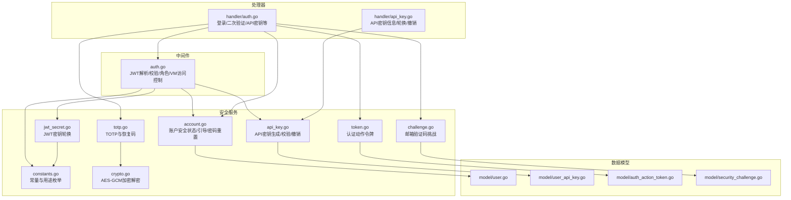
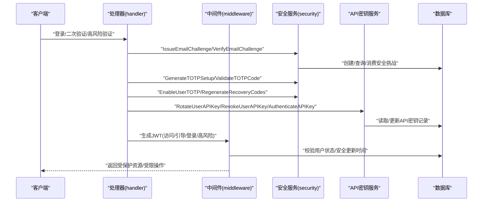
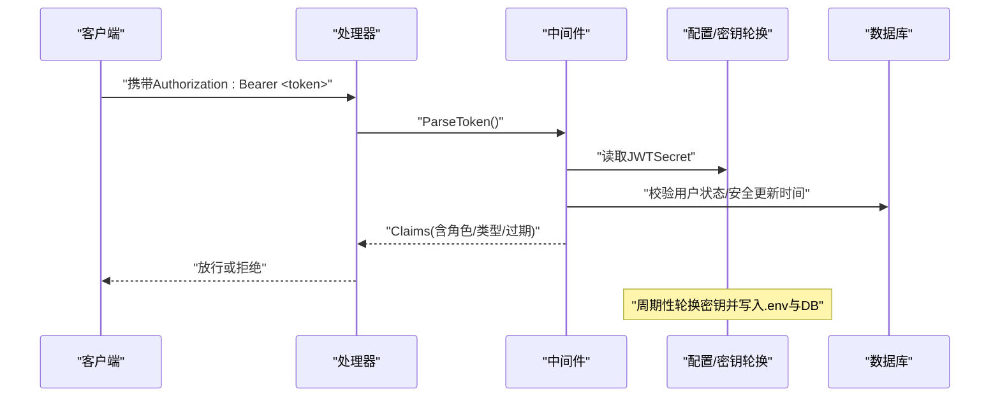
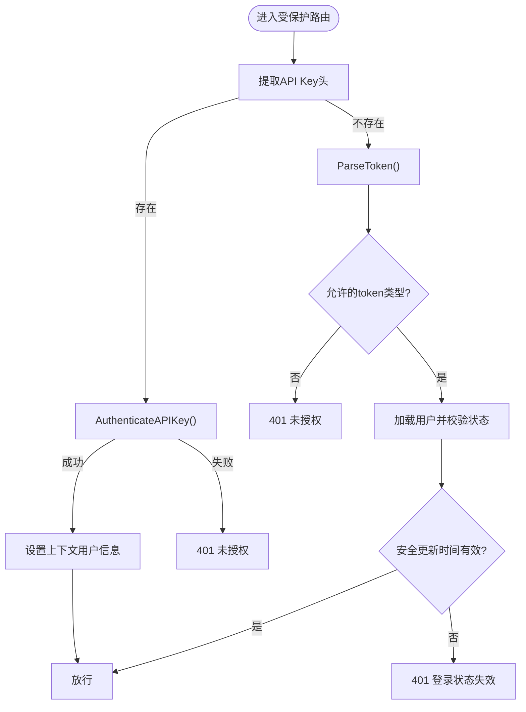
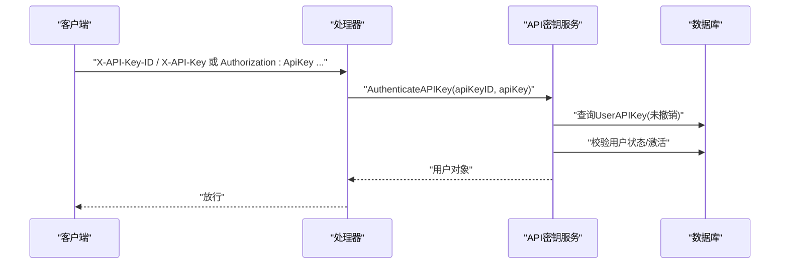
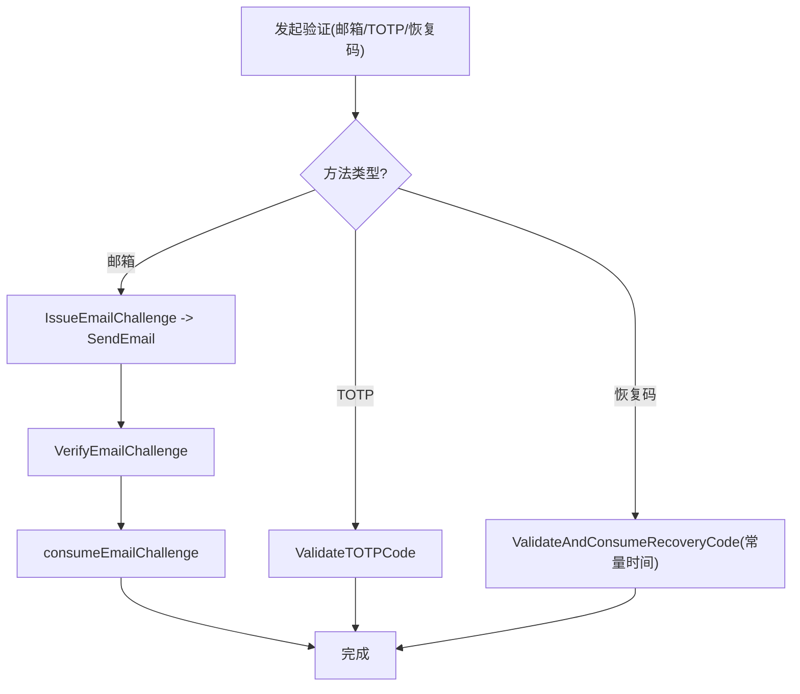
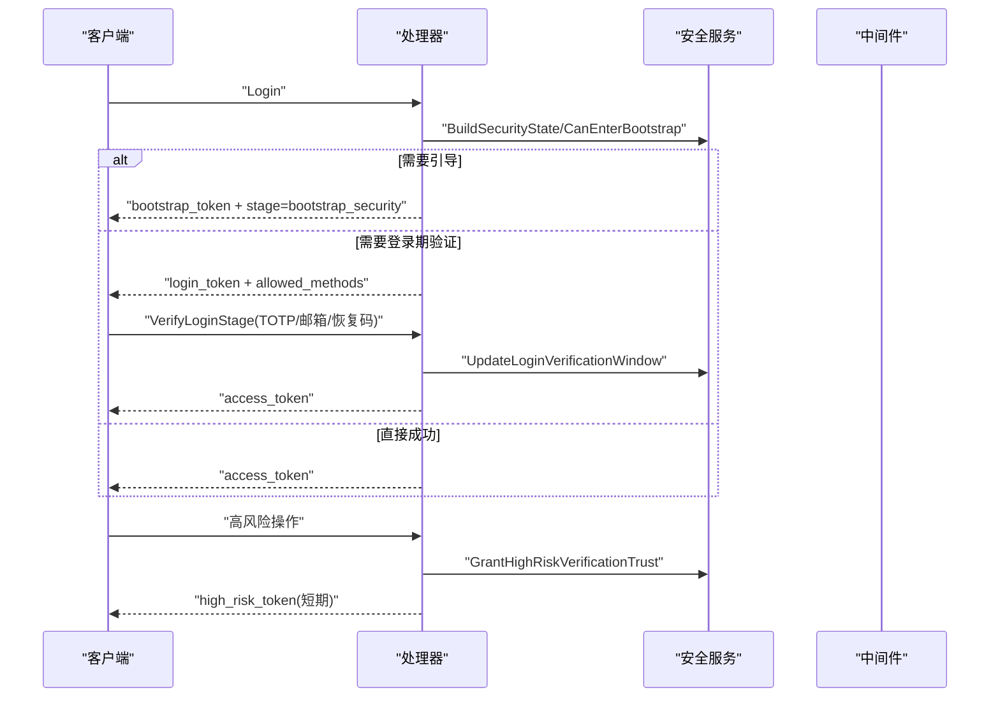
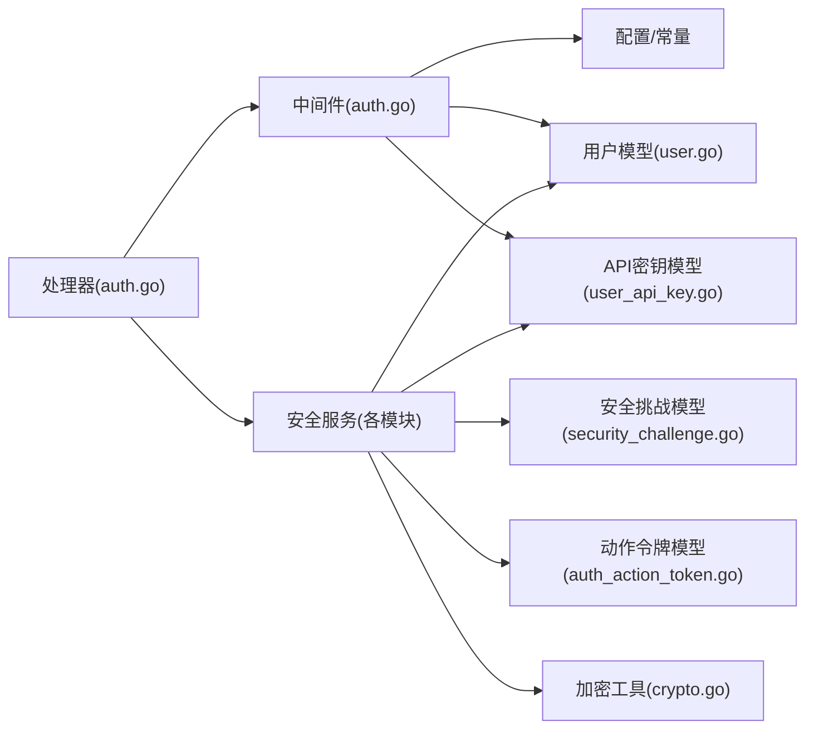

# 认证与授权

<cite>
**本文引用的文件**
- [server/middleware/auth.go](file://server/middleware/auth.go)
- [server/service/security/constants.go](file://server/service/security/constants.go)
- [server/service/security/jwt_secret.go](file://server/service/security/jwt_secret.go)
- [server/service/security/token.go](file://server/service/security/token.go)
- [server/service/security/challenge.go](file://server/service/security/challenge.go)
- [server/service/security/totp.go](file://server/service/security/totp.go)
- [server/service/security/crypto.go](file://server/service/security/crypto.go)
- [server/service/security/account.go](file://server/service/security/account.go)
- [server/service/api_key.go](file://server/service/api_key.go)
- [server/handler/auth.go](file://server/handler/auth.go)
- [server/handler/api_key.go](file://server/handler/api_key.go)
- [server/model/user.go](file://server/model/user.go)
- [server/model/user_api_key.go](file://server/model/user_api_key.go)
- [server/model/auth_action_token.go](file://server/model/auth_action_token.go)
- [server/model/security_challenge.go](file://server/model/security_challenge.go)
</cite>

## 目录
1. [简介](#简介)
2. [项目结构](#项目结构)
3. [核心组件](#核心组件)
4. [架构总览](#架构总览)
5. [详细组件分析](#详细组件分析)
6. [依赖分析](#依赖分析)
7. [性能考虑](#性能考虑)
8. [故障排查指南](#故障排查指南)
9. [结论](#结论)
10. [附录](#附录)

## 简介
本文件面向Open虚拟机管理控制台的认证与授权体系，系统性梳理并解释以下关键能力：
- JWT认证机制：token生成、验证、刷新与轮换策略
- 用户权限控制：角色管理、权限分配与访问控制策略
- API密钥管理：密钥生成、使用与撤销流程
- 安全挑战与TOTP：邮箱验证码、TOTP二次验证与恢复码机制
- 用户会话与状态：登录阶段、安全状态与会话生命周期
- 安全最佳实践与常见攻击防护

## 项目结构
围绕认证与授权的关键代码分布在如下模块：
- 中间件层：统一鉴权入口、角色与资源级访问控制
- 安全服务层：JWT密钥轮换、邮件挑战、TOTP与恢复码、加密工具、账户安全状态
- 业务处理器：登录、二次验证、API密钥管理等对外接口
- 数据模型层：用户、API密钥、认证动作令牌、安全挑战等

图表来源
- [server/middleware/auth.go:1-324](file://server/middleware/auth.go#L1-L324)
- [server/service/security/constants.go:1-46](file://server/service/security/constants.go#L1-L46)
- [server/service/security/jwt_secret.go:1-132](file://server/service/security/jwt_secret.go#L1-L132)
- [server/service/security/token.go:1-88](file://server/service/security/token.go#L1-L88)
- [server/service/security/challenge.go:1-183](file://server/service/security/challenge.go#L1-L183)
- [server/service/security/totp.go:1-163](file://server/service/security/totp.go#L1-L163)
- [server/service/security/crypto.go:1-73](file://server/service/security/crypto.go#L1-L73)
- [server/service/security/account.go:1-675](file://server/service/security/account.go#L1-L675)
- [server/service/api_key.go:1-179](file://server/service/api_key.go#L1-L179)
- [server/handler/auth.go:1-997](file://server/handler/auth.go#L1-L997)
- [server/handler/api_key.go:1-48](file://server/handler/api_key.go#L1-L48)
- [server/model/user.go:1-56](file://server/model/user.go#L1-L56)
- [server/model/user_api_key.go:1-27](file://server/model/user_api_key.go#L1-L27)
- [server/model/auth_action_token.go:1-21](file://server/model/auth_action_token.go#L1-L21)
- [server/model/security_challenge.go:1-23](file://server/model/security_challenge.go#L1-L23)

章节来源
- [server/middleware/auth.go:1-324](file://server/middleware/auth.go#L1-L324)
- [server/service/security/constants.go:1-46](file://server/service/security/constants.go#L1-L46)
- [server/service/security/jwt_secret.go:1-132](file://server/service/security/jwt_secret.go#L1-L132)
- [server/service/security/token.go:1-88](file://server/service/security/token.go#L1-L88)
- [server/service/security/challenge.go:1-183](file://server/service/security/challenge.go#L1-L183)
- [server/service/security/totp.go:1-163](file://server/service/security/totp.go#L1-L163)
- [server/service/security/crypto.go:1-73](file://server/service/security/crypto.go#L1-L73)
- [server/service/security/account.go:1-675](file://server/service/security/account.go#L1-L675)
- [server/service/api_key.go:1-179](file://server/service/api_key.go#L1-L179)
- [server/handler/auth.go:1-997](file://server/handler/auth.go#L1-L997)
- [server/handler/api_key.go:1-48](file://server/handler/api_key.go#L1-L48)
- [server/model/user.go:1-56](file://server/model/user.go#L1-L56)
- [server/model/user_api_key.go:1-27](file://server/model/user_api_key.go#L1-L27)
- [server/model/auth_action_token.go:1-21](file://server/model/auth_action_token.go#L1-L21)
- [server/model/security_challenge.go:1-23](file://server/model/security_challenge.go#L1-L23)

## 核心组件
- JWT认证与中间件
  - Claims结构体承载用户标识、角色、token类型与签发/过期时间
  - 支持生成不同类型的token（访问、引导、登录、高风险）
  - 解析与校验token，结合用户状态与安全更新时间进行有效性判定
  - 提供按token类型与角色的访问控制中间件
- 安全挑战与TOTP
  - 邮箱验证码挑战：生成、发送、校验与失效
  - TOTP二次验证：生成绑定、校验、恢复码机制与常量时间比较
  - 恢复码：生成、哈希存储、消耗与重新生成
- API密钥管理
  - 生成唯一ID与密钥，哈希存储，前缀展示
  - 校验API Key，检查用户状态与启用状态
  - 撤销API Key，轮换时保留历史记录
- 认证动作令牌
  - 邀请注册与密码重置的链接式令牌，带过期与消费标记
- 用户与权限
  - 角色：admin/user；状态：pending_invite/active/disabled
  - 安全状态：邮箱验证、TOTP绑定、登录验证窗口、高风险信任窗口
  - VM访问控制：基于用户名与VM白名单文件的简单授权

章节来源
- [server/middleware/auth.go:17-199](file://server/middleware/auth.go#L17-L199)
- [server/service/security/challenge.go:15-183](file://server/service/security/challenge.go#L15-L183)
- [server/service/security/totp.go:17-163](file://server/service/security/totp.go#L17-L163)
- [server/service/api_key.go:20-179](file://server/service/api_key.go#L20-L179)
- [server/service/security/token.go:14-88](file://server/service/security/token.go#L14-L88)
- [server/model/user.go:9-56](file://server/model/user.go#L9-L56)
- [server/middleware/auth.go:280-324](file://server/middleware/auth.go#L280-L324)

## 架构总览
下图展示了从客户端请求到服务端鉴权与授权的整体流程，涵盖JWT、API Key、邮箱验证码、TOTP与恢复码等关键环节。

图表来源
- [server/handler/auth.go:101-202](file://server/handler/auth.go#L101-L202)
- [server/service/security/challenge.go:15-183](file://server/service/security/challenge.go#L15-L183)
- [server/service/security/totp.go:23-163](file://server/service/security/totp.go#L23-L163)
- [server/service/api_key.go:54-147](file://server/service/api_key.go#L54-L147)
- [server/middleware/auth.go:27-199](file://server/middleware/auth.go#L27-L199)

## 详细组件分析

### JWT认证机制
- 生成
  - 支持默认访问token与带TTL/操作范围的token生成
  - 使用全局JWT密钥签名，注册标准声明（签发/过期时间）
- 解析与校验
  - 解析JWT并校验签名；若缺失token类型则回填默认
  - 结合用户状态与“安全更新时间”判断会话是否仍有效
- 刷新与轮换
  - 定时轮换JWT密钥，轮换后旧token立即失效
  - 开发模式与默认密钥保护：禁止自动轮换以避免生产事故

图表来源
- [server/middleware/auth.go:27-73](file://server/middleware/auth.go#L27-L73)
- [server/service/security/jwt_secret.go:32-55](file://server/service/security/jwt_secret.go#L32-L55)

章节来源
- [server/middleware/auth.go:27-73](file://server/middleware/auth.go#L27-L73)
- [server/service/security/jwt_secret.go:32-55](file://server/service/security/jwt_secret.go#L32-L55)

### 用户权限控制系统
- 角色与状态
  - 角色：admin/user；状态：pending_invite/active/disabled
  - 安全状态：邮箱验证、TOTP绑定、登录验证窗口、高风险信任窗口
- 中间件级控制
  - 按token类型过滤（如仅允许访问型token）
  - 管理员专用中间件
  - VM访问中间件：非admin用户仅能操作其拥有的VM（基于用户名与VM白名单文件）

图表来源
- [server/middleware/auth.go:75-199](file://server/middleware/auth.go#L75-L199)

章节来源
- [server/middleware/auth.go:243-324](file://server/middleware/auth.go#L243-L324)
- [server/model/user.go:9-56](file://server/model/user.go#L9-L56)

### API密钥管理机制
- 生成与轮换
  - 自动生成唯一ID与密钥，仅在生成时返回明文密钥
  - 哈希存储，前缀展示；轮换时更新记录并保留历史
- 校验与使用
  - 校验API Key ID与哈希，检查用户状态与启用状态
  - 支持在中间件中直接作为认证凭据使用
- 撤销
  - 标记撤销时间，后续校验失败

图表来源
- [server/handler/api_key.go:11-48](file://server/handler/api_key.go#L11-L48)
- [server/service/api_key.go:117-147](file://server/service/api_key.go#L117-L147)
- [server/model/user_api_key.go:9-27](file://server/model/user_api_key.go#L9-L27)

章节来源
- [server/handler/api_key.go:11-48](file://server/handler/api_key.go#L11-L48)
- [server/service/api_key.go:41-179](file://server/service/api_key.go#L41-L179)
- [server/model/user_api_key.go:9-27](file://server/model/user_api_key.go#L9-L27)

### 安全挑战与TOTP验证
- 邮箱验证码
  - 生成固定长度数字验证码，SHA-256哈希存储，10分钟有效期
  - 发送后可失效同目的未消费挑战，支持公开场景挑战
- TOTP与恢复码
  - 生成TOTP绑定信息（密钥与otpauth URL）
  - 校验TOTP验证码；恢复码采用SHA-256哈希存储，常量时间比较，消耗后更新
  - 支持重新生成恢复码（旧码立即失效）

图表来源
- [server/service/security/challenge.go:15-183](file://server/service/security/challenge.go#L15-L183)
- [server/service/security/totp.go:23-163](file://server/service/security/totp.go#L23-L163)

章节来源
- [server/service/security/challenge.go:15-183](file://server/service/security/challenge.go#L15-L183)
- [server/service/security/totp.go:23-163](file://server/service/security/totp.go#L23-L163)
- [server/service/security/crypto.go:15-73](file://server/service/security/crypto.go#L15-L73)

### 用户会话与状态维护
- 登录阶段
  - 引导安全初始化（未完成邮箱/2FA等）：发放bootstrap token
  - 登录期验证（超过登录验证窗口）：发放login token，支持邮箱/TOTP/恢复码
  - 成功后发放访问token
- 高风险操作
  - 高风险验证窗口：邮箱/TOTP/恢复码三种方式，成功后发放高风险token（短期）
- 安全状态
  - 邮箱验证、TOTP绑定、登录验证窗口、高风险信任窗口、安全更新时间
  - VM访问白名单文件（非admin用户）

图表来源
- [server/handler/auth.go:101-202](file://server/handler/auth.go#L101-L202)
- [server/handler/auth.go:352-429](file://server/handler/auth.go#L352-L429)
- [server/handler/auth.go:661-738](file://server/handler/auth.go#L661-L738)
- [server/service/security/account.go:483-531](file://server/service/security/account.go#L483-L531)

章节来源
- [server/handler/auth.go:101-202](file://server/handler/auth.go#L101-L202)
- [server/handler/auth.go:352-429](file://server/handler/auth.go#L352-L429)
- [server/handler/auth.go:661-738](file://server/handler/auth.go#L661-L738)
- [server/service/security/account.go:483-531](file://server/service/security/account.go#L483-L531)

### 认证动作令牌（邮件链接）
- 用途：邀请注册、密码重置
- 特性：唯一哈希存储、过期时间、消费标记、失效同类型未消费令牌
- 流程：生成 -> 发送 -> 校验 -> 消费 -> 清理

章节来源
- [server/service/security/token.go:14-88](file://server/service/security/token.go#L14-L88)
- [server/model/auth_action_token.go:5-21](file://server/model/auth_action_token.go#L5-L21)

## 依赖分析
- 中间件依赖
  - 依赖配置中的JWT密钥与过期时长
  - 依赖用户模型与安全更新时间
  - 支持API Key与JWT双通道认证
- 安全服务依赖
  - 数据库模型：用户、API密钥、认证动作令牌、安全挑战
  - 加密工具：AES-GCM用于敏感数据（TOTP密钥、恢复码列表）加密
  - 常量：用途枚举、时间窗口、token类型
- 处理器依赖
  - 调用安全服务执行挑战、TOTP、API Key与账户状态逻辑
  - 通过中间件完成统一鉴权

图表来源
- [server/middleware/auth.go:1-324](file://server/middleware/auth.go#L1-L324)
- [server/handler/auth.go:1-997](file://server/handler/auth.go#L1-L997)
- [server/model/user.go:1-56](file://server/model/user.go#L1-L56)
- [server/model/user_api_key.go:1-27](file://server/model/user_api_key.go#L1-L27)
- [server/model/security_challenge.go:1-23](file://server/model/security_challenge.go#L1-L23)
- [server/model/auth_action_token.go:1-21](file://server/model/auth_action_token.go#L1-L21)
- [server/service/security/crypto.go:1-73](file://server/service/security/crypto.go#L1-L73)

章节来源
- [server/middleware/auth.go:1-324](file://server/middleware/auth.go#L1-L324)
- [server/handler/auth.go:1-997](file://server/handler/auth.go#L1-L997)
- [server/model/user.go:1-56](file://server/model/user.go#L1-L56)
- [server/model/user_api_key.go:1-27](file://server/model/user_api_key.go#L1-L27)
- [server/model/security_challenge.go:1-23](file://server/model/security_challenge.go#L1-L23)
- [server/model/auth_action_token.go:1-21](file://server/model/auth_action_token.go#L1-L21)
- [server/service/security/crypto.go:1-73](file://server/service/security/crypto.go#L1-L73)

## 性能考虑
- JWT解析与校验
  - 使用HS256签名，解析开销低；建议合理设置过期时间以平衡安全性与性能
- 密钥轮换
  - 定时轮换在后台协程执行，不影响请求处理；注意轮换频率与运维策略
- 数据库查询
  - API Key与挑战查询均带索引字段，建议保持索引与查询条件一致
- 加密成本
  - AES-GCM加解密与TOTP哈希在安全服务中使用，建议在高频场景下关注I/O与CPU占用

## 故障排查指南
- 401 未登录/Token无效或已过期
  - 检查Authorization头格式与token类型是否被允许
  - 确认JWT密钥未被轮换或服务重启后未加载最新密钥
- 403 需要管理员权限/无权操作此虚拟机
  - 管理员中间件与VM访问中间件限制
  - 非admin用户需在VM白名单文件中拥有对应VM
- 邮箱验证码错误/过期
  - 验证码有效期10分钟；同一目的挑战会自动失效旧挑战
- TOTP/恢复码错误
  - TOTP周期30秒；恢复码采用常量时间比较，确保输入正确
- API Key无效/已撤销
  - 确认API Key ID与哈希匹配；检查撤销时间与用户状态
- 安全更新导致会话失效
  - 用户安全信息更新后，旧token的签发时间早于安全更新时间会被拒绝

章节来源
- [server/middleware/auth.go:120-199](file://server/middleware/auth.go#L120-L199)
- [server/service/security/challenge.go:88-183](file://server/service/security/challenge.go#L88-L183)
- [server/service/security/totp.go:42-163](file://server/service/security/totp.go#L42-L163)
- [server/service/api_key.go:117-147](file://server/service/api_key.go#L117-L147)

## 结论
本认证与授权体系通过多层安全机制实现：
- JWT提供强身份标识与短期会话能力，配合密钥轮换提升抗风险能力
- 邮箱验证码、TOTP与恢复码构成分层验证，覆盖登录期与高风险操作
- API Key满足自动化调用场景，具备生成、轮换与撤销能力
- 中间件统一接入点，结合角色与资源级控制，形成清晰的访问边界
- 安全状态与会话生命周期设计兼顾用户体验与安全合规

## 附录
- 安全最佳实践
  - 定期轮换JWT密钥，严格控制.env文件权限
  - 强制启用邮箱验证与TOTP，管理员可跳过引导但需满足SMTP与邮箱验证条件
  - 高风险操作使用短期高风险token并结合信任窗口
  - API Key最小权限原则，定期轮换与审计
- 常见攻击防护
  - 时序攻击防护：TOTP恢复码采用常量时间比较
  - 重放与过期：验证码与动作令牌均有明确过期与消费标记
  - 会话劫持：短有效期与安全更新时间强制失效旧会话