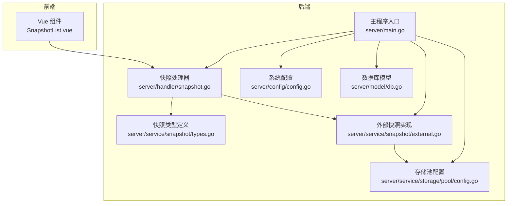
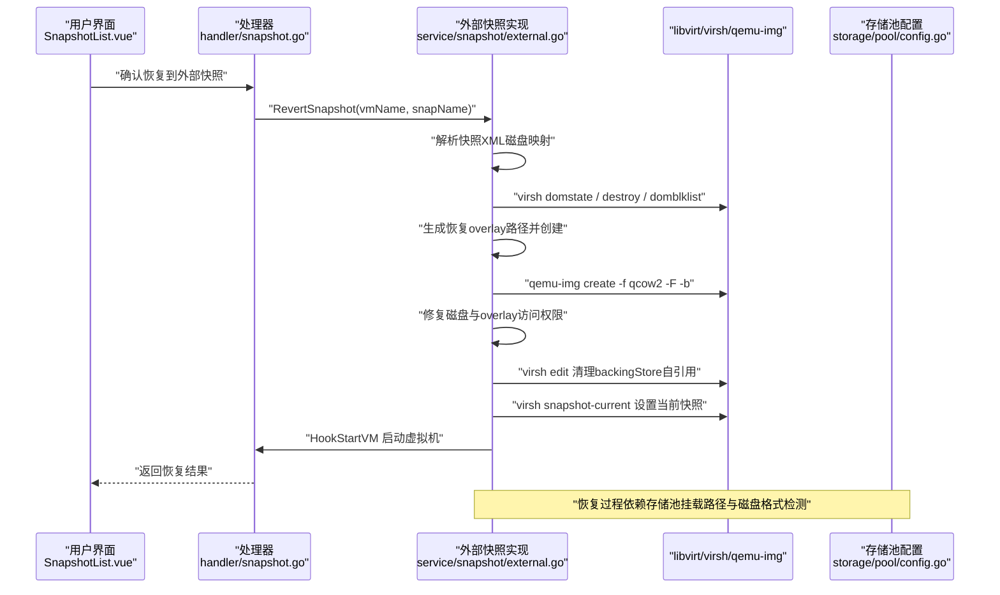
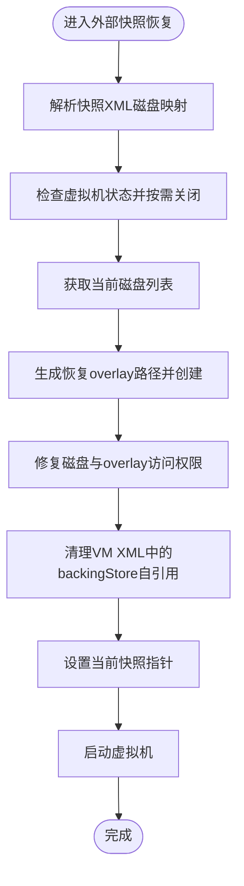
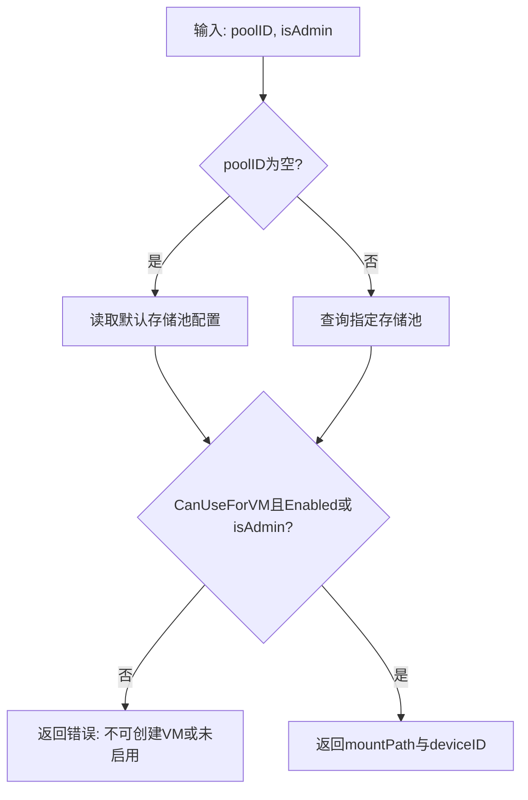
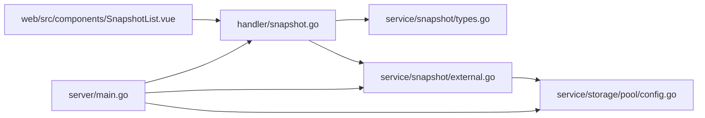

# 备份与恢复

<cite>
**本文引用的文件**
- [server/main.go](file://server/main.go)
- [server/handler/snapshot.go](file://server/handler/snapshot.go)
- [server/service/snapshot/types.go](file://server/service/snapshot/types.go)
- [server/service/snapshot/external.go](file://server/service/snapshot/external.go)
- [server/service/storage/pool/config.go](file://server/service/storage/pool/config.go)
- [server/config/config.go](file://server/config/config.go)
- [web/src/components/SnapshotList.vue](file://web/src/components/SnapshotList.vue)
- [server/model/db.go](file://server/model/db.go)
- [server/handler/settings.go](file://server/handler/settings.go)
</cite>

## 目录
1. [引言](#引言)
2. [项目结构](#项目结构)
3. [核心组件](#核心组件)
4. [架构总览](#架构总览)
5. [详细组件分析](#详细组件分析)
6. [依赖关系分析](#依赖关系分析)
7. [性能考量](#性能考量)
8. [故障排查指南](#故障排查指南)
9. [结论](#结论)
10. [附录](#附录)

## 引言
本指南面向运维与平台管理员，围绕数据库备份、配置文件备份、虚拟机快照备份与恢复、存储池数据保护、灾难恢复计划与演练、以及备份数据的加密与异地备份策略，结合代码库中的实现与接口，给出可落地的实践建议与流程图示。

## 项目结构
本项目采用前后端分离架构，服务端基于 Go 语言，前端基于 Vue。与备份与恢复相关的关键位置包括：
- 服务端快照模块：负责虚拟机快照的创建、列出、恢复与外部快照处理。
- 存储池模块：负责存储池配置、挂载路径与默认存储池选择。
- 配置模块：负责日志轮转与归档等系统配置项。
- 前端组件：提供快照列表与交互操作入口。
- 数据库模型：提供持久化能力与迁移支持。

图表来源
- [server/main.go:1-600](file://server/main.go#L1-L600)
- [server/handler/snapshot.go:1-250](file://server/handler/snapshot.go#L1-L250)
- [server/service/snapshot/types.go:1-75](file://server/service/snapshot/types.go#L1-L75)
- [server/service/snapshot/external.go:1-320](file://server/service/snapshot/external.go#L1-L320)
- [server/service/storage/pool/config.go:1-120](file://server/service/storage/pool/config.go#L1-L120)
- [server/config/config.go:140-160](file://server/config/config.go#L140-L160)
- [server/model/db.go:1-200](file://server/model/db.go#L1-L200)

章节来源
- [server/main.go:1-600](file://server/main.go#L1-L600)
- [server/handler/snapshot.go:1-250](file://server/handler/snapshot.go#L1-L250)
- [server/service/snapshot/types.go:1-75](file://server/service/snapshot/types.go#L1-L75)
- [server/service/snapshot/external.go:1-320](file://server/service/snapshot/external.go#L1-L320)
- [server/service/storage/pool/config.go:1-120](file://server/service/storage/pool/config.go#L1-L120)
- [server/config/config.go:140-160](file://server/config/config.go#L140-L160)
- [server/model/db.go:1-200](file://server/model/db.go#L1-L200)

## 核心组件
- 快照处理器与外部快照恢复逻辑：提供快照创建、列举、配额校验、高风险确认、以及外部快照恢复流程（含磁盘回滚、overlay 创建、权限修复、启动虚拟机）。
- 存储池配置：提供默认存储池选择、挂载路径解析、VM 磁盘目录解析等能力，支撑虚拟机磁盘与镜像的备份定位。
- 系统配置：包含日志轮转与归档配置项，便于日志备份与审计。
- 前端交互：提供快照列表、恢复与删除操作提示，辅助用户正确执行高风险动作。

章节来源
- [server/handler/snapshot.go:1-250](file://server/handler/snapshot.go#L1-L250)
- [server/service/snapshot/external.go:120-272](file://server/service/snapshot/external.go#L120-L272)
- [server/service/storage/pool/config.go:70-90](file://server/service/storage/pool/config.go#L70-L90)
- [server/config/config.go:140-160](file://server/config/config.go#L140-L160)
- [web/src/components/SnapshotList.vue:203-229](file://web/src/components/SnapshotList.vue#L203-L229)

## 架构总览
下图展示从用户操作到后端执行的典型快照恢复流程，涵盖外部快照恢复的关键步骤与系统调用点。

图表来源
- [server/handler/snapshot.go:1-250](file://server/handler/snapshot.go#L1-L250)
- [server/service/snapshot/external.go:53-310](file://server/service/snapshot/external.go#L53-L310)
- [server/service/storage/pool/config.go:70-90](file://server/service/storage/pool/config.go#L70-L90)

## 详细组件分析

### 快照类型与外部快照恢复流程
- 快照类型定义：包含快照信息结构体、配额信息、XML 描述结构等，为后续解析与校验提供基础。
- 外部快照恢复流程：包含解析原始磁盘文件、关闭运行中的虚拟机、获取当前磁盘列表、生成恢复 overlay、修复访问权限、清理 VM XML 中的 backingStore 自引用、设置当前快照指针、最后启动虚拟机等步骤。

图表来源
- [server/service/snapshot/external.go:53-310](file://server/service/snapshot/external.go#L53-L310)
- [server/service/snapshot/types.go:17-75](file://server/service/snapshot/types.go#L17-L75)

章节来源
- [server/service/snapshot/types.go:17-75](file://server/service/snapshot/types.go#L17-L75)
- [server/service/snapshot/external.go:53-310](file://server/service/snapshot/external.go#L53-L310)

### 存储池与虚拟机磁盘目录解析
- 默认存储池选择与挂载路径解析：当未指定存储池 ID 时，解析默认存储池配置；若不可用于创建虚拟机或未启用，则返回错误。
- VM 存储目录解析：根据存储池配置与管理员权限决定最终磁盘目录，确保备份与恢复目标路径一致。

图表来源
- [server/service/storage/pool/config.go:70-90](file://server/service/storage/pool/config.go#L70-L90)

章节来源
- [server/service/storage/pool/config.go:70-90](file://server/service/storage/pool/config.go#L70-L90)

### 前端交互与高风险操作提示
- 恢复与删除外部快照时，前端弹窗明确告知恢复/删除行为（如关闭虚拟机、回滚磁盘状态、合并增量数据等），降低误操作风险。

章节来源
- [web/src/components/SnapshotList.vue:203-229](file://web/src/components/SnapshotList.vue#L203-L229)

### 数据库备份与验证
- SQLite 数据库备份命令：通过 sqlite3 客户端执行在线备份，或使用 .backup 命令将内存数据库写入文件，确保一致性。
- 自动化备份脚本：建议以 cron 或 systemd timer 触发，包含以下步骤：锁定写入、执行备份、校验完整性、清理过期备份、发送通知。
- 备份验证方法：使用 sqlite3 的完整性检查命令与校验和对比，确保可恢复性。

说明：以上为通用实践建议，具体命令与脚本请参考系统环境与安全策略。

### 配置文件备份策略
- 系统配置：包含日志最大归档备份数等项，应纳入配置版本管理与定期备份。
- 网络配置：桥接、VPC、OVN 等网络相关配置文件需单独备份，并与虚拟机快照解耦。
- 用户配置：用户角色、配额、API 密钥等敏感配置应加密存储并限制访问。

章节来源
- [server/config/config.go:140-160](file://server/config/config.go#L140-L160)

### 虚拟机快照备份与恢复流程
- 全量与增量：内部快照适合频繁增量备份；外部快照适合跨主机迁移与长期归档。
- 恢复流程：关闭虚拟机、回滚磁盘状态、修复权限、清理 VM XML、设置当前快照、启动虚拟机。
- 高风险确认：删除外部快照前需合并增量数据并清理 overlay 文件。

章节来源
- [server/handler/snapshot.go:1-250](file://server/handler/snapshot.go#L1-L250)
- [server/service/snapshot/external.go:120-272](file://server/service/snapshot/external.go#L120-L272)
- [web/src/components/SnapshotList.vue:203-229](file://web/src/components/SnapshotList.vue#L203-L229)

### 存储池数据备份（LVM 卷与文件系统）
- LVM 卷快照：在文件系统卸载或应用内一致性冻结后创建快照，随后进行备份与清理。
- 文件系统备份：使用压缩归档工具对挂载路径进行周期性备份，并验证解压与挂载可用性。

说明：以上为通用实践建议，需结合实际存储架构与业务窗口安排。

### 灾难恢复计划与演练
- DRP 制定：明确 RTO/RPO 目标、恢复优先级、责任分工、通信机制与回退策略。
- 演练方法：定期进行“部分恢复”与“全链路演练”，记录耗时与问题，持续优化预案。

说明：本节为概念性内容，不直接对应具体源文件。

### 备份数据加密与异地备份
- 加密存储：对备份介质（磁带、磁盘、对象存储）启用传输与静态加密；密钥管理遵循最小权限原则。
- 异地备份：将备份副本存放在不同地理区域，定期验证异地恢复路径与网络连通性。

说明：本节为概念性内容，不直接对应具体源文件。

## 依赖关系分析
- 处理器依赖快照类型与外部快照实现，外部快照实现依赖存储池配置与系统命令（virsh、qemu-img）。
- 主程序入口串联处理器与快照实现，确保恢复流程在统一调度下执行。
- 前端组件通过处理器暴露的接口触发恢复与删除操作。

图表来源
- [server/handler/snapshot.go:1-250](file://server/handler/snapshot.go#L1-L250)
- [server/service/snapshot/types.go:1-75](file://server/service/snapshot/types.go#L1-L75)
- [server/service/snapshot/external.go:1-320](file://server/service/snapshot/external.go#L1-L320)
- [server/service/storage/pool/config.go:1-120](file://server/service/storage/pool/config.go#L1-L120)
- [server/main.go:1-600](file://server/main.go#L1-L600)
- [web/src/components/SnapshotList.vue:203-229](file://web/src/components/SnapshotList.vue#L203-L229)

章节来源
- [server/handler/snapshot.go:1-250](file://server/handler/snapshot.go#L1-L250)
- [server/service/snapshot/types.go:1-75](file://server/service/snapshot/types.go#L1-L75)
- [server/service/snapshot/external.go:1-320](file://server/service/snapshot/external.go#L1-L320)
- [server/service/storage/pool/config.go:1-120](file://server/service/storage/pool/config.go#L1-L120)
- [server/main.go:1-600](file://server/main.go#L1-L600)
- [web/src/components/SnapshotList.vue:203-229](file://web/src/components/SnapshotList.vue#L203-L229)

## 性能考量
- 快照恢复期间的 I/O 抖动：建议在业务低峰期执行，避免影响其他虚拟机。
- 外部快照恢复的磁盘回滚与 overlay 创建：尽量缩短虚拟机关机时间，提前准备恢复 overlay 目录权限。
- 存储池挂载路径与磁盘格式检测：减少因格式识别失败导致的重试与失败。

## 故障排查指南
- 快照恢复失败：检查虚拟机状态、磁盘列表解析、overlay 创建与权限修复步骤的日志输出。
- 权限问题：确认 AppArmor 配置与 virt-aa-helper 对 backing chain 的访问允许。
- 配额与高风险确认：核对快照配额与前端高风险确认提示，避免误删或越权操作。

章节来源
- [server/service/snapshot/external.go:120-272](file://server/service/snapshot/external.go#L120-L272)
- [server/handler/snapshot.go:1-250](file://server/handler/snapshot.go#L1-L250)

## 结论
本指南基于现有代码实现，梳理了虚拟机快照的恢复流程与存储池配置要点，并补充了数据库、配置文件、存储池数据、灾难恢复与加密异地备份的实践建议。建议结合自身环境完善自动化脚本与演练计划，确保备份与恢复的可靠性与可追溯性。

## 附录
- 数据库备份命令与自动化脚本示例（通用实践，非仓库内置）：请参考系统 sqlite3 文档与运维规范。
- 系统配置项参考：日志最大归档备份数等项可用于日志备份与轮转策略。

章节来源
- [server/config/config.go:140-160](file://server/config/config.go#L140-L160)