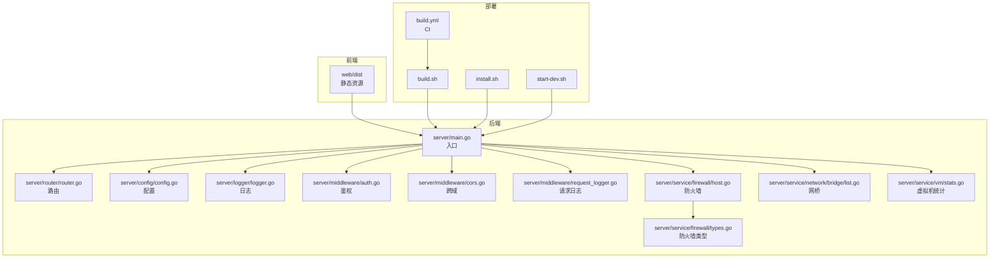
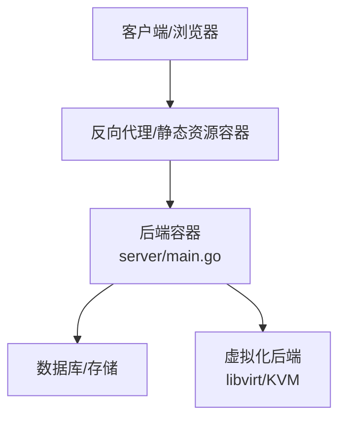
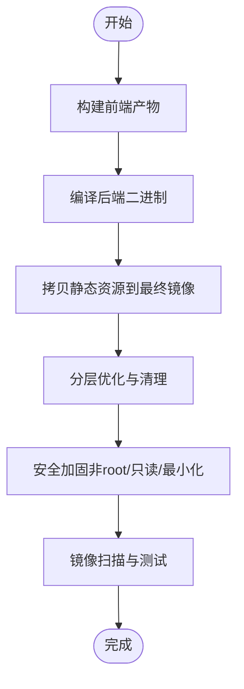
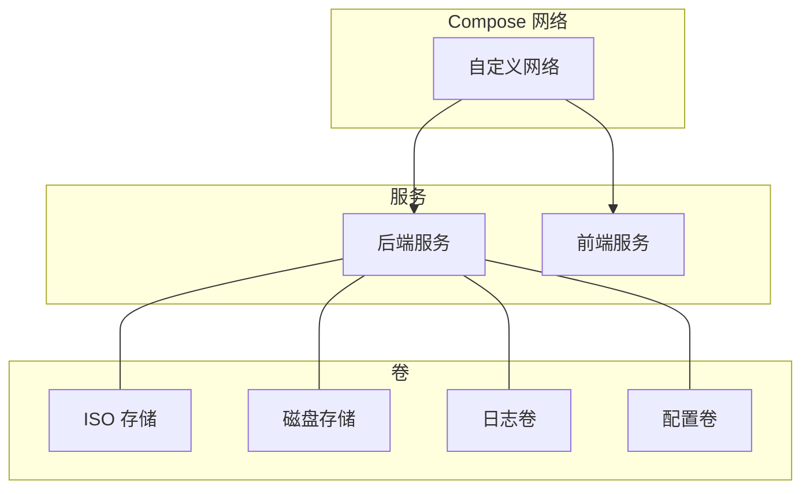
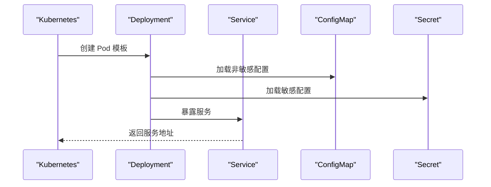
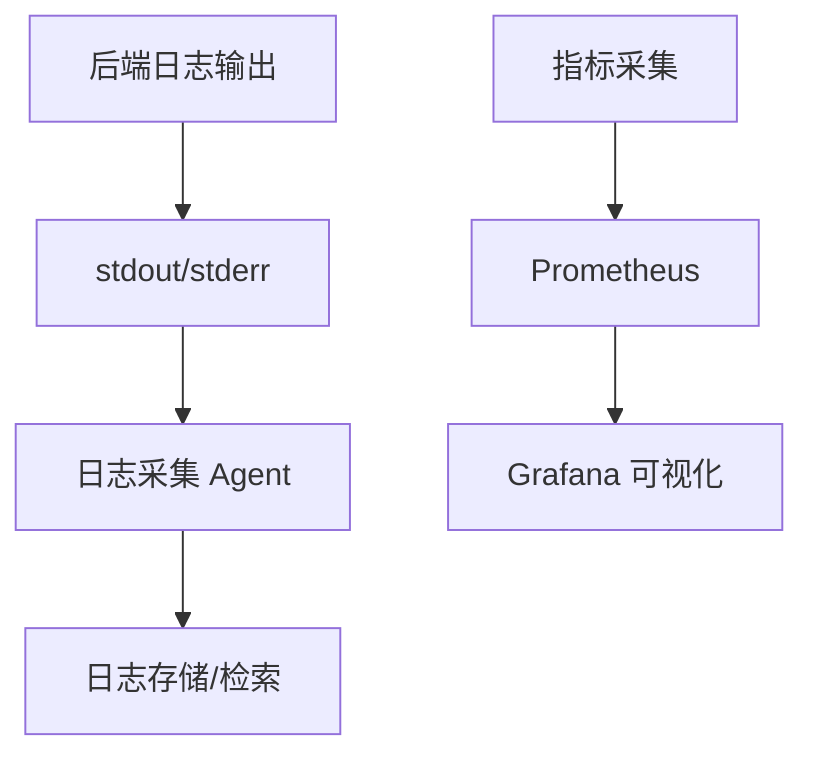
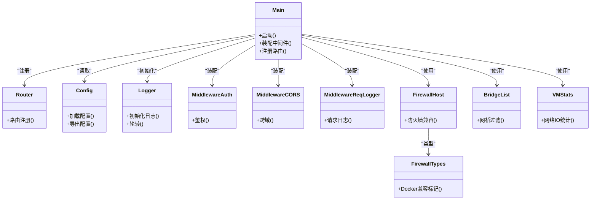

# 容器化部署

<cite>
**本文档引用的文件**
- [build.sh](file://build.sh)
- [install.sh](file://install.sh)
- [start-dev.sh](file://start-dev.sh)
- [main.go](file://server/main.go)
- [router.go](file://server/router/router.go)
- [config.go](file://server/config/config.go)
- [logger.go](file://server/logger/logger.go)
- [auth.go](file://server/middleware/auth.go)
- [cors.go](file://server/middleware/cors.go)
- [request_logger.go](file://server/middleware/request_logger.go)
- [host.go](file://server/service/firewall/host.go)
- [types.go](file://server/service/firewall/types.go)
- [list.go](file://server/service/network/bridge/list.go)
- [stats.go](file://server/service/vm/stats.go)
- [settings.go](file://server/handler/settings.go)
- [build.yml](file://.github/workflows/build.yml)
</cite>

## 目录
1. [简介](#简介)
2. [项目结构](#项目结构)
3. [核心组件](#核心组件)
4. [架构总览](#架构总览)
5. [详细组件分析](#详细组件分析)
6. [依赖关系分析](#依赖关系分析)
7. [性能考虑](#性能考虑)
8. [故障排查指南](#故障排查指南)
9. [结论](#结论)
10. [附录](#附录)

## 简介
本指南面向在容器环境下部署与运维 QVMConsole 的工程团队，围绕以下目标展开：
- Docker 镜像构建：多阶段构建、镜像优化与安全加固
- Docker Compose 编排：服务定义、网络与卷配置
- Kubernetes 部署：Deployment、Service、ConfigMap、Secret 的定义与最佳实践
- 容器编排最佳实践：资源限制、健康检查、滚动更新策略
- 容器监控与日志：采集与可视化
- 性能调优：基于系统指标与业务特征的优化建议

## 项目结构
QVMConsole 采用前后端分离架构：
- 前端：Vue 3 + Vite 构建产物位于 web/dist
- 后端：Go Gin 服务，提供 REST API 与内部服务
- 部署脚本：build.sh、install.sh、start-dev.sh 提供构建与启动入口
- CI：GitHub Actions 工作流负责自动化构建

**图表来源**
- [main.go](file://server/main.go)
- [router.go](file://server/router/router.go)
- [config.go](file://server/config/config.go)
- [logger.go](file://server/logger/logger.go)
- [auth.go](file://server/middleware/auth.go)
- [cors.go](file://server/middleware/cors.go)
- [request_logger.go](file://server/middleware/request_logger.go)
- [host.go](file://server/service/firewall/host.go)
- [types.go](file://server/service/firewall/types.go)
- [list.go](file://server/service/network/bridge/list.go)
- [stats.go](file://server/service/vm/stats.go)
- [build.sh](file://build.sh)
- [install.sh](file://install.sh)
- [start-dev.sh](file://start-dev.sh)
- [build.yml](file://.github/workflows/build.yml)

**章节来源**
- [main.go](file://server/main.go)
- [router.go](file://server/router/router.go)
- [config.go](file://server/config/config.go)
- [logger.go](file://server/logger/logger.go)
- [auth.go](file://server/middleware/auth.go)
- [cors.go](file://server/middleware/cors.go)
- [request_logger.go](file://server/middleware/request_logger.go)
- [host.go](file://server/service/firewall/host.go)
- [types.go](file://server/service/firewall/types.go)
- [list.go](file://server/service/network/bridge/list.go)
- [stats.go](file://server/service/vm/stats.go)
- [build.sh](file://build.sh)
- [install.sh](file://install.sh)
- [start-dev.sh](file://start-dev.sh)
- [build.yml](file://.github/workflows/build.yml)

## 核心组件
- 应用入口与路由
  - server/main.go：应用启动、中间件装配、路由注册
  - server/router/router.go：REST API 路由定义
- 配置与日志
  - server/config/config.go：运行时配置加载与导出
  - server/logger/logger.go：日志初始化与轮转
- 中间件
  - server/middleware/auth.go：鉴权
  - server/middleware/cors.go：跨域
  - server/middleware/request_logger.go：请求日志
- 网络与安全
  - server/service/firewall/host.go、types.go：防火墙兼容性与策略
  - server/service/network/bridge/list.go：网桥识别与过滤（含 Docker 相关关键字）
- 虚拟机监控
  - server/service/vm/stats.go：宿主机网络 IO 统计（排除 Docker 接口）

这些组件共同构成容器化部署的基础：稳定的服务进程、可配置的运行参数、可观测的日志与监控。

**章节来源**
- [main.go](file://server/main.go)
- [router.go](file://server/router/router.go)
- [config.go](file://server/config/config.go)
- [logger.go](file://server/logger/logger.go)
- [auth.go](file://server/middleware/auth.go)
- [cors.go](file://server/middleware/cors.go)
- [request_logger.go](file://server/middleware/request_logger.go)
- [host.go](file://server/service/firewall/host.go)
- [types.go](file://server/service/firewall/types.go)
- [list.go](file://server/service/network/bridge/list.go)
- [stats.go](file://server/service/vm/stats.go)

## 架构总览
容器化部署建议采用“后端服务容器 + 前端静态资源容器”的双容器模式：
- 后端容器：运行 server/main.go，监听 HTTP 端口，提供 API 与内部服务
- 前端容器：运行 web/dist 静态资源，通过反向代理或直接暴露
- 外部依赖：数据库（如 SQLite）、存储池（ISO/磁盘）、虚拟化后端（libvirt/KVM）

[本图为概念性架构图，不直接映射具体源码文件]

## 详细组件分析

### Docker 镜像构建（多阶段、优化与安全）
- 多阶段构建
  - 第一阶段：编译前端产物（Vite 构建），输出到 web/dist
  - 第二阶段：编译后端（Go build），拷贝 web/dist 至只读静态目录
  - 最终阶段：精简基础镜像（如 distroless/static），仅包含运行时所需二进制与证书
- 镜像优化
  - 分层缓存：将依赖安装与编译步骤分离，最大化利用缓存
  - 层顺序：将变动频率低的层（依赖）置于上层，变动频繁的层（源码）置于下层
  - 清理构建产物：移除交叉编译工具链与中间文件
- 安全加固
  - 使用非 root 用户运行
  - 仅授予必要文件权限（静态资源只读）
  - 启用只读根文件系统
  - 禁用不必要的网络端口与服务
  - 使用最小化基础镜像，减少攻击面

[本图为流程图，不直接映射具体源码文件]

### Docker Compose 配置（服务、网络与卷）
- 服务定义
  - 后端服务：映射端口、挂载配置与存储卷、设置环境变量
  - 前端服务：反向代理或直接暴露静态资源
- 网络配置
  - 自定义网络，隔离容器通信
  - 与宿主机网络互通（如需访问宿主机设备）
- 卷挂载
  - 存储池目录（ISO/磁盘）
  - 日志目录
  - 配置文件（ConfigMap/Secret 映射）

[本图为概念性配置图，不直接映射具体源码文件]

### Kubernetes 部署（Deployment、Service、ConfigMap、Secret）
- Deployment
  - 定义副本数、滚动更新策略（maxUnavailable/maxSurge）
  - 资源限制与请求（requests/limits）
  - 健康检查：livenessProbe/readinessProbe/exec 或 httpGet
- Service
  - ClusterIP/NodePort/LB，暴露 API 与前端
- ConfigMap
  - 非敏感配置（如日志级别、网络后端）
- Secret
  - 敏感配置（如数据库凭据、SMTP 凭据）

[本图为概念性序列图，不直接映射具体源码文件]

### 容器编排最佳实践
- 资源限制
  - 为后端设置合理的 CPU/内存 requests/limits，避免资源争抢
  - 根据业务负载调整副本数与水平扩展策略
- 健康检查
  - livenessProbe：检测进程存活
  - readinessProbe：检测服务可用性（可结合 /health 接口）
- 滚动更新
  - maxUnavailable=25%，maxSurge=25%，确保平滑升级
  - 结合 PodDisruptionBudget（PDB）保障可用性

**章节来源**
- [main.go](file://server/main.go)
- [router.go](file://server/router/router.go)
- [config.go](file://server/config/config.go)
- [logger.go](file://server/logger/logger.go)

### 容器监控与日志收集
- 日志
  - 后端日志：server/logger/logger.go 初始化日志，建议输出到 stdout/stderr
  - 日志轮转：按天/大小轮转，保留最近 N 天
- 指标
  - 虚拟机资源：server/service/vm/stats.go 提供 CPU/内存/网络/IO 统计
  - 宿主机资源：server/service/host/* 提供 KSM/zRAM 等参数
- 监控
  - Prometheus 抓取指标（如 /metrics，如需可扩展）
  - Grafana 展示资源趋势与告警

[本图为概念性流程图，不直接映射具体源码文件]

**章节来源**
- [logger.go](file://server/logger/logger.go)
- [stats.go](file://server/service/vm/stats.go)

### 容器环境下的性能调优
- 系统层
  - 关闭不必要的服务与端口（参考防火墙相关实现）
  - 合理设置 KSM/zRAM（宿主机参数）
- 应用层
  - 合理设置动态内存调度参数（见配置项）
  - 控制并发与批处理（如批量克隆最大并发）
- 网络层
  - 端口转发探测间隔与超时
  - VPC 子网前缀、ACL 表等网络参数

**章节来源**
- [settings.go](file://server/handler/settings.go)
- [config.go](file://server/config/config.go)

## 依赖关系分析
后端服务依赖关系如下：

**图表来源**
- [main.go](file://server/main.go)
- [router.go](file://server/router/router.go)
- [config.go](file://server/config/config.go)
- [logger.go](file://server/logger/logger.go)
- [auth.go](file://server/middleware/auth.go)
- [cors.go](file://server/middleware/cors.go)
- [request_logger.go](file://server/middleware/request_logger.go)
- [host.go](file://server/service/firewall/host.go)
- [types.go](file://server/service/firewall/types.go)
- [list.go](file://server/service/network/bridge/list.go)
- [stats.go](file://server/service/vm/stats.go)

**章节来源**
- [main.go](file://server/main.go)
- [router.go](file://server/router/router.go)
- [config.go](file://server/config/config.go)
- [logger.go](file://server/logger/logger.go)
- [auth.go](file://server/middleware/auth.go)
- [cors.go](file://server/middleware/cors.go)
- [request_logger.go](file://server/middleware/request_logger.go)
- [host.go](file://server/service/firewall/host.go)
- [types.go](file://server/service/firewall/types.go)
- [list.go](file://server/service/network/bridge/list.go)
- [stats.go](file://server/service/vm/stats.go)

## 性能考虑
- 构建阶段
  - 使用多核并行编译与缓存友好的分层策略
- 运行阶段
  - 合理设置副本数与资源配额，避免 OOM
  - 利用滚动更新与探针降低停机时间
- 监控与告警
  - 基于指标阈值设置告警，提前扩容或降载

[本节为通用指导，不直接分析具体文件]

## 故障排查指南
- 启动失败
  - 检查日志输出与权限（非 root 用户运行）
  - 核对环境变量与配置文件映射
- 网络问题
  - 确认防火墙策略与 Docker 网桥过滤逻辑
  - 检查端口转发与 VPC 绑定
- 性能问题
  - 查看虚拟机与宿主机资源统计
  - 调整动态内存调度与并发参数

**章节来源**
- [logger.go](file://server/logger/logger.go)
- [host.go](file://server/service/firewall/host.go)
- [list.go](file://server/service/network/bridge/list.go)
- [stats.go](file://server/service/vm/stats.go)

## 结论
通过多阶段构建、精简镜像与安全加固，结合 Compose/Kubernetes 的标准化编排，QVMConsole 可以在容器环境中实现高效、稳定与可观测的部署。配合资源限制、健康检查与滚动更新策略，可进一步提升系统的可靠性与可维护性。

[本节为总结，不直接分析具体文件]

## 附录
- 构建与启动脚本
  - build.sh：构建前后端产物
  - install.sh：安装与初始化
  - start-dev.sh：开发环境启动
- CI 工作流
  - build.yml：自动化构建与制品管理

**章节来源**
- [build.sh](file://build.sh)
- [install.sh](file://install.sh)
- [start-dev.sh](file://start-dev.sh)
- [build.yml](file://.github/workflows/build.yml)