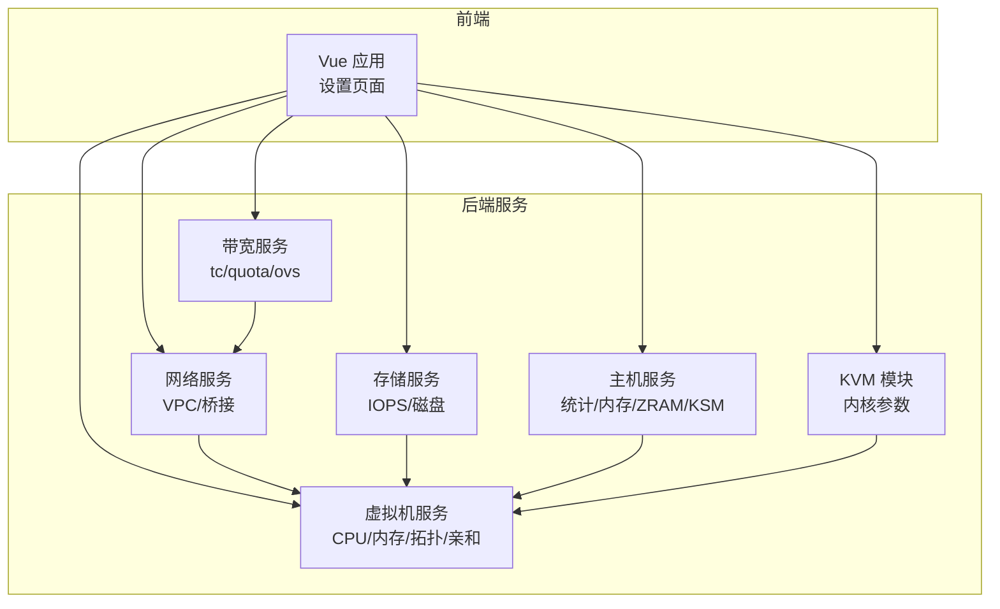
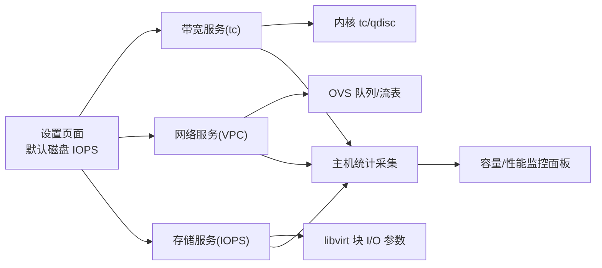
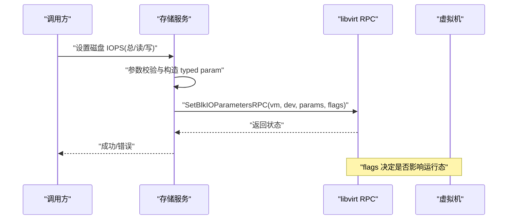
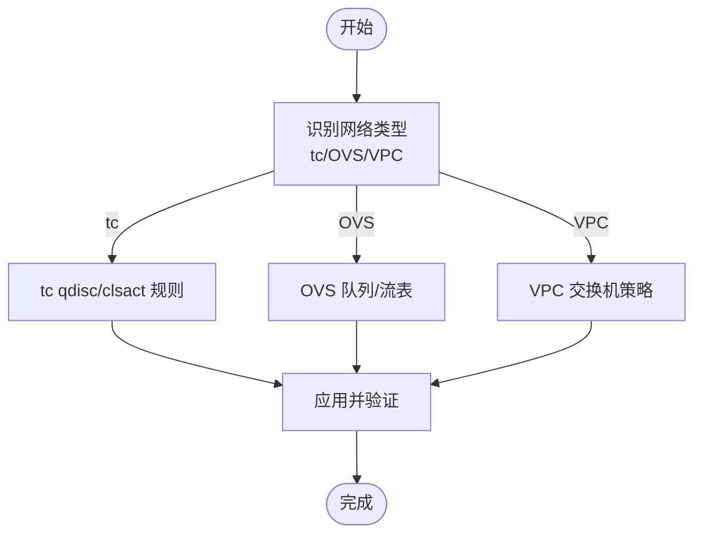
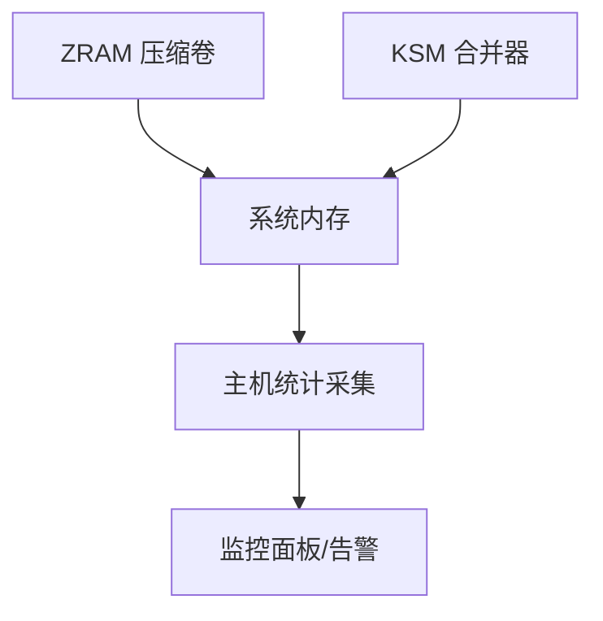
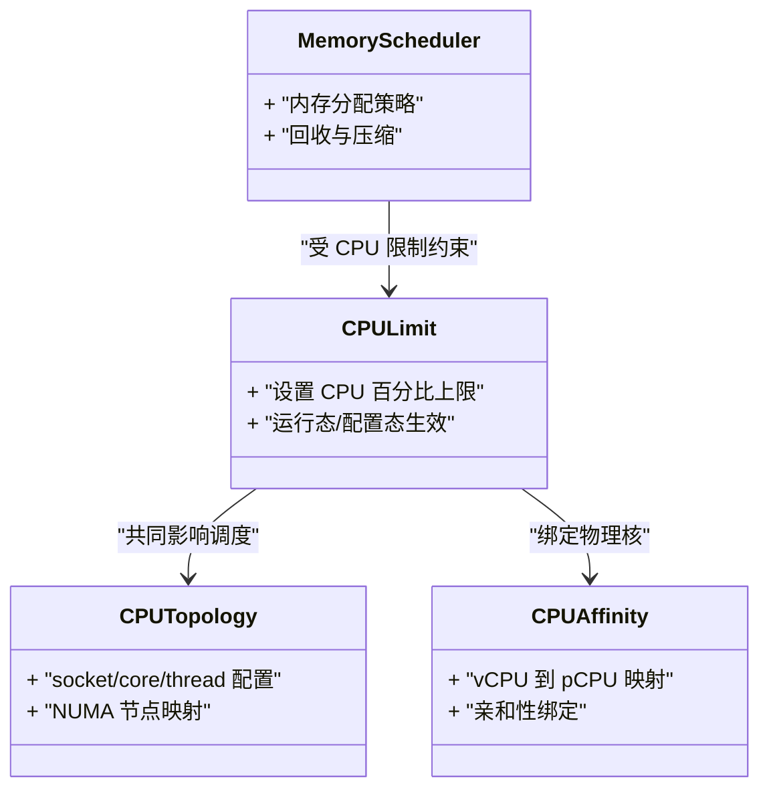
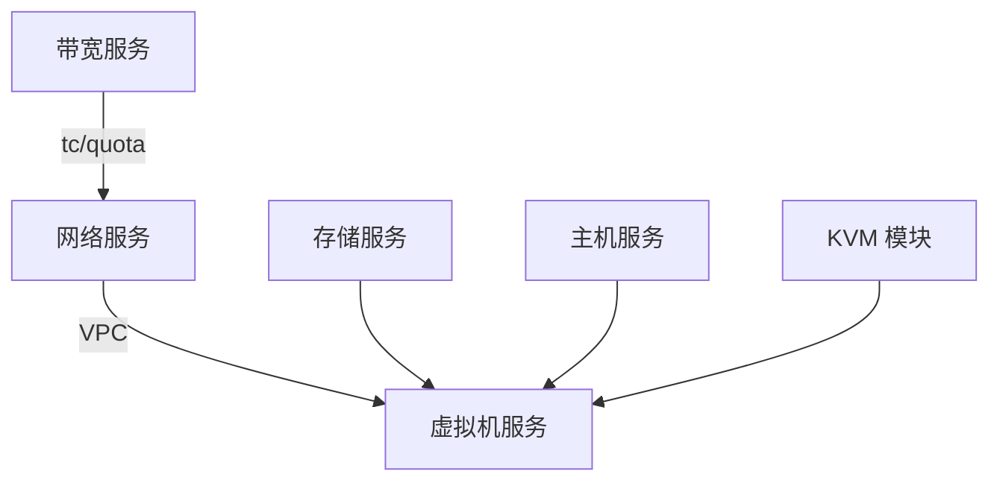

# 性能优化

<cite>
**本文引用的文件**
- [server/service/storage/disk/iops.go](file://server/service/storage/disk/iops.go)
- [server/service/bandwidth/tc.go](file://server/service/bandwidth/tc.go)
- [server/service/bandwidth/quota.go](file://server/service/bandwidth/quota.go)
- [server/service/network/vpc/switch_bandwidth.go](file://server/service/network/vpc/switch_bandwidth.go)
- [server/service/host/stats_collector.go](file://server/service/host/stats_collector.go)
- [server/service/host/zram.go](file://server/service/host/zram.go)
- [server/service/host/ksm.go](file://server/service/host/ksm.go)
- [server/service/vm/cpu_limit.go](file://server/service/vm/cpu_limit.go)
- [server/service/vm/cpu_topology.go](file://server/service/vm/cpu_topology.go)
- [server/service/vm/cpu_affinity.go](file://server/service/vm/cpu_affinity.go)
- [server/service/vm/memory/scheduler.go](file://server/service/vm/memory/scheduler.go)
- [server/service/vm/memory/config.go](file://server/service/vm/memory/config.go)
- [server/service/kvm_module.go](file://server/service/kvm_module.go)
- [web/src/views/settings/index.vue](file://web/src/views/settings/index.vue)
</cite>

## 目录
1. [引言](#引言)
2. [项目结构](#项目结构)
3. [核心组件](#核心组件)
4. [架构总览](#架构总览)
5. [详细组件分析](#详细组件分析)
6. [依赖关系分析](#依赖关系分析)
7. [性能考量](#性能考量)
8. [故障排查指南](#故障排查指南)
9. [结论](#结论)
10. [附录](#附录)

## 引言
本指南聚焦于系统层面的性能优化实践，结合代码库中的实现，系统性地覆盖以下主题：内核参数与模块优化、文件系统与内存管理、网络带宽与 QoS、存储 IOPS 限制与缓存、虚拟化（KVM）参数与 NUMA/CPU 绑定、负载均衡与资源调度，以及性能基准测试方法与工具使用。文档以“可操作”为目标，既适合运维工程师，也便于有一定技术背景的用户理解与落地。

## 项目结构
该代码库采用分层与功能域划分相结合的组织方式：
- 后端服务按领域拆分（如带宽、网络、存储、主机、虚拟机等），每个子域包含独立的类型定义、依赖注入与业务逻辑。
- 前端通过 Vue 单页应用提供可视化界面，部分设置项（如默认磁盘 IOPS）在前端进行展示与输入。
- 服务层通过 libvirt RPC 与底层虚拟化平台交互，实现对虚拟机资源的动态调整。

**章节来源**
- [server/service/bandwidth/tc.go:1-200](file://server/service/bandwidth/tc.go#L1-L200)
- [server/service/network/vpc/switch_bandwidth.go:1-200](file://server/service/network/vpc/switch_bandwidth.go#L1-L200)
- [server/service/storage/disk/iops.go:1-120](file://server/service/storage/disk/iops.go#L1-L120)
- [server/service/host/stats_collector.go:1-200](file://server/service/host/stats_collector.go#L1-L200)
- [server/service/vm/cpu_limit.go:1-200](file://server/service/vm/cpu_limit.go#L1-L200)
- [server/service/kvm_module.go:1-200](file://server/service/kvm_module.go#L1-L200)

## 核心组件
- 存储 IOPS 调优：通过 libvirt 的块设备 I/O 参数接口，支持总 IOPS 或读/写 IOPS 分别限制，并区分运行态与配置态生效范围。
- 网络带宽与 QoS：基于 tc（traffic control）与 OVS（Open vSwitch）实现带宽配额与队列调度；VPC 交换机层提供更细粒度的带宽策略。
- 主机内存优化：ZRAM 压缩与 KSM 内存去重，配合主机统计采集用于容量规划与异常检测。
- 虚拟机 CPU/NUMA/亲和：提供 CPU 使用率上限、拓扑与亲和绑定能力，支撑 NUMA 亲和与 CPU 绑定策略。
- 设置入口：前端设置页提供默认磁盘 IOPS 的配置入口，便于批量新建虚拟机时统一基线。

**章节来源**
- [server/service/storage/disk/iops.go:42-81](file://server/service/storage/disk/iops.go#L42-L81)
- [server/service/bandwidth/tc.go:1-200](file://server/service/bandwidth/tc.go#L1-L200)
- [server/service/bandwidth/quota.go:1-200](file://server/service/bandwidth/quota.go#L1-L200)
- [server/service/network/vpc/switch_bandwidth.go:1-200](file://server/service/network/vpc/switch_bandwidth.go#L1-L200)
- [server/service/host/zram.go:1-200](file://server/service/host/zram.go#L1-L200)
- [server/service/host/ksm.go:1-200](file://server/service/host/ksm.go#L1-L200)
- [server/service/vm/cpu_limit.go:1-200](file://server/service/vm/cpu_limit.go#L1-L200)
- [server/service/vm/cpu_topology.go:1-200](file://server/service/vm/cpu_topology.go#L1-L200)
- [server/service/vm/cpu_affinity.go:1-200](file://server/service/vm/cpu_affinity.go#L1-L200)
- [web/src/views/settings/index.vue:239-267](file://web/src/views/settings/index.vue#L239-L267)

## 架构总览
下图展示了性能相关能力在系统中的交互路径：前端设置 -> 服务层策略 -> 底层资源（tc/OVS/libvirt）。

**图表来源**
- [server/service/bandwidth/tc.go:1-200](file://server/service/bandwidth/tc.go#L1-L200)
- [server/service/network/vpc/switch_bandwidth.go:1-200](file://server/service/network/vpc/switch_bandwidth.go#L1-L200)
- [server/service/storage/disk/iops.go:1-120](file://server/service/storage/disk/iops.go#L1-L120)
- [server/service/host/stats_collector.go:1-200](file://server/service/host/stats_collector.go#L1-L200)

## 详细组件分析

### 存储 IOPS 限制
- 功能要点
  - 支持总 IOPS 或读/写 IOPS 分别限制，避免同时设置冲突。
  - 运行态与配置态分别应用，确保在线调整不影响正在运行的虚拟机。
  - 通过 libvirt RPC 将参数下发到虚拟机块设备。
- 典型流程
  - 输入校验 -> 构造 typed param -> 选择生效标志位 -> 调用 RPC 设置 -> 返回结果。
- 关键路径
  - [设置 IOPS:42-68](file://server/service/storage/disk/iops.go#L42-L68)
  - [获取 IOPS:71-81](file://server/service/storage/disk/iops.go#L71-L81)

**图表来源**
- [server/service/storage/disk/iops.go:42-81](file://server/service/storage/disk/iops.go#L42-L81)

**章节来源**
- [server/service/storage/disk/iops.go:42-81](file://server/service/storage/disk/iops.go#L42-L81)

### 网络带宽与 QoS
- tc（流量控制）
  - 基于内核 qdisc/队列规则实现带宽限制与优先级调度。
  - 适用于网卡/子接口层面的精细化限速。
- OVS（Open vSwitch）
  - 在虚拟交换机层为端口/VM 提供带宽配额与队列策略。
- VPC 交换机
  - 在 VPC 层面提供更细粒度的带宽策略与运行时应用。

**图表来源**
- [server/service/bandwidth/tc.go:1-200](file://server/service/bandwidth/tc.go#L1-L200)
- [server/service/bandwidth/quota.go:1-200](file://server/service/bandwidth/quota.go#L1-L200)
- [server/service/network/vpc/switch_bandwidth.go:1-200](file://server/service/network/vpc/switch_bandwidth.go#L1-L200)

**章节来源**
- [server/service/bandwidth/tc.go:1-200](file://server/service/bandwidth/tc.go#L1-L200)
- [server/service/bandwidth/quota.go:1-200](file://server/service/bandwidth/quota.go#L1-L200)
- [server/service/network/vpc/switch_bandwidth.go:1-200](file://server/service/network/vpc/switch_bandwidth.go#L1-L200)

### 主机内存优化（ZRAM 与 KSM）
- ZRAM
  - 将压缩后的页面驻留在 RAM 中，降低磁盘换入换出频率，提升整体吞吐。
- KSM（Kernel Samepage Merging）
  - 识别并合并相同内容的内存页面，减少重复占用，释放可用内存。
- 统计采集
  - 通过主机统计采集器收集内存使用指标，辅助容量规划与异常告警。

**图表来源**
- [server/service/host/zram.go:1-200](file://server/service/host/zram.go#L1-L200)
- [server/service/host/ksm.go:1-200](file://server/service/host/ksm.go#L1-L200)
- [server/service/host/stats_collector.go:1-200](file://server/service/host/stats_collector.go#L1-L200)

**章节来源**
- [server/service/host/zram.go:1-200](file://server/service/host/zram.go#L1-L200)
- [server/service/host/ksm.go:1-200](file://server/service/host/ksm.go#L1-L200)
- [server/service/host/stats_collector.go:1-200](file://server/service/host/stats_collector.go#L1-L200)

### 虚拟机 CPU 与内存优化
- CPU 限制与拓扑
  - 提供 CPU 使用率上限与拓扑配置，支撑 NUMA 亲和与 CPU 绑定策略。
- CPU 亲和
  - 将虚拟机 vCPU 绑定到物理核，减少迁移开销与 TLB 失效。
- 内存调度
  - 结合内存配置与调度器，优化内存分配与回收策略。

**图表来源**
- [server/service/vm/cpu_limit.go:1-200](file://server/service/vm/cpu_limit.go#L1-L200)
- [server/service/vm/cpu_topology.go:1-200](file://server/service/vm/cpu_topology.go#L1-L200)
- [server/service/vm/cpu_affinity.go:1-200](file://server/service/vm/cpu_affinity.go#L1-L200)
- [server/service/vm/memory/scheduler.go:1-200](file://server/service/vm/memory/scheduler.go#L1-L200)

**章节来源**
- [server/service/vm/cpu_limit.go:1-200](file://server/service/vm/cpu_limit.go#L1-L200)
- [server/service/vm/cpu_topology.go:1-200](file://server/service/vm/cpu_topology.go#L1-L200)
- [server/service/vm/cpu_affinity.go:1-200](file://server/service/vm/cpu_affinity.go#L1-L200)
- [server/service/vm/memory/scheduler.go:1-200](file://server/service/vm/memory/scheduler.go#L1-L200)

### KVM 模块与内核参数
- KVM 模块初始化与参数
  - 通过加载/配置 KVM 内核模块，启用硬件虚拟化加速与相关优化参数。
  - 与虚拟机 CPU/NUMA/亲和策略协同，提升整体虚拟化性能。

**章节来源**
- [server/service/kvm_module.go:1-200](file://server/service/kvm_module.go#L1-L200)

### 设置入口与默认值
- 前端设置页提供默认磁盘 IOPS（总/读）的配置入口，环境变量名与提示清晰，便于批量新建虚拟机时统一基线。

**章节来源**
- [web/src/views/settings/index.vue:239-267](file://web/src/views/settings/index.vue#L239-L267)

## 依赖关系分析
- 松耦合与高内聚
  - 各子域通过明确的类型与依赖注入容器协作，避免循环依赖。
  - 带宽、网络、存储、主机、虚拟机等模块边界清晰，便于独立扩展与优化。
- 外部依赖
  - 依赖 libvirt RPC 实现对虚拟机资源的动态调整。
  - 依赖内核 tc 与 OVS 实现网络带宽与 QoS。
- 可能的瓶颈
  - 网络与存储的链路存在多层封装，需关注参数传递与生效顺序。
  - 虚拟机 CPU/内存策略需与主机资源状况匹配，避免过度限制导致资源浪费或拥塞。

**图表来源**
- [server/service/bandwidth/tc.go:1-200](file://server/service/bandwidth/tc.go#L1-L200)
- [server/service/network/vpc/switch_bandwidth.go:1-200](file://server/service/network/vpc/switch_bandwidth.go#L1-L200)
- [server/service/storage/disk/iops.go:1-120](file://server/service/storage/disk/iops.go#L1-L120)
- [server/service/kvm_module.go:1-200](file://server/service/kvm_module.go#L1-L200)

## 性能考量
- 内核参数与模块
  - 启用 KVM 加速与 NUMA 优化，合理设置内核调度与内存管理参数。
  - 关注中断亲和、网络驱动参数与块设备队列深度。
- 文件系统与内存
  - 选择合适的文件系统（如 XFS/Btrfs）与挂载选项（如 noatime/discard）。
  - 合理配置 ZRAM 压缩比与 KSM 合并阈值，避免过度压缩导致 CPU 开销上升。
- 网络
  - 优先使用 RSS/多队列网卡与硬件卸载；在 tc 层面设置合理的队列长度与调度算法。
  - 对关键业务使用优先级队列与严格保证带宽。
- 存储
  - IOPS 限制应结合业务特征与磁盘能力设定，避免“一刀切”。
  - 使用缓存（ZRAM/KSM）与去重（KSM）降低内存压力，但需监控 CPU 占用。
- 虚拟化
  - NUMA 感知的 vCPU/内存分配与 CPU 绑定，减少跨 NUMA 访问。
  - 合理设置 CPU 上限与拓扑，避免超卖导致抖动。
- 负载均衡与调度
  - 基于主机与虚拟机指标（CPU/内存/网络/磁盘）进行动态调度。
  - 结合业务 SLA 与资源配额，实施公平共享与优先级策略。

## 故障排查指南
- IOPS 设置不生效
  - 检查生效标志位（运行态/配置态）与虚拟机当前状态。
  - 确认 libvirt RPC 是否返回成功，必要时查看底层块设备参数。
- 网络带宽异常
  - 核对 tc 规则与 OVS 流表是否正确应用。
  - 检查队列长度与调度算法是否与业务匹配。
- 内存压力大
  - 查看 ZRAM 压缩比与 KSM 合并效果，评估 CPU 占用。
  - 结合主机统计采集数据定位内存泄漏或异常进程。
- 虚拟机性能抖动
  - 检查 CPU 限制与亲和绑定是否过于严格。
  - 关注 NUMA 跨越与内存回收策略。

**章节来源**
- [server/service/storage/disk/iops.go:42-81](file://server/service/storage/disk/iops.go#L42-L81)
- [server/service/bandwidth/tc.go:1-200](file://server/service/bandwidth/tc.go#L1-L200)
- [server/service/bandwidth/quota.go:1-200](file://server/service/bandwidth/quota.go#L1-L200)
- [server/service/network/vpc/switch_bandwidth.go:1-200](file://server/service/network/vpc/switch_bandwidth.go#L1-L200)
- [server/service/host/zram.go:1-200](file://server/service/host/zram.go#L1-L200)
- [server/service/host/ksm.go:1-200](file://server/service/host/ksm.go#L1-L200)
- [server/service/host/stats_collector.go:1-200](file://server/service/host/stats_collector.go#L1-L200)

## 结论
通过在存储 IOPS、网络带宽与 QoS、主机内存优化、虚拟化参数与调度等方面的系统性优化，可以显著提升整体性能与稳定性。建议以监控数据为依据持续迭代参数，并结合业务特征制定差异化策略，避免通用化配置带来的性能损失。

## 附录
- 性能基准测试方法与工具
  - 存储：使用 fio 评估不同 IOPS/带宽场景下的延迟与吞吐；对比开启/关闭缓存与去重前后的差异。
  - 网络：使用 iperf3/Netperf 测试不同队列深度与调度算法下的带宽与延迟；模拟突发流量观察 QoS 行为。
  - CPU/内存：使用 stress-ng/sysbench 进行 CPU 压力与内存拷贝测试；结合 perf/htop 观察上下文切换与缓存命中。
  - 虚拟化：使用 virt-install/libvirt API 批量创建 VM，结合宿主机与客户机指标评估 NUMA 与亲和策略的影响。
  - 工具集成：将测试脚本与监控采集（stats_collector）联动，形成闭环验证与回归测试。