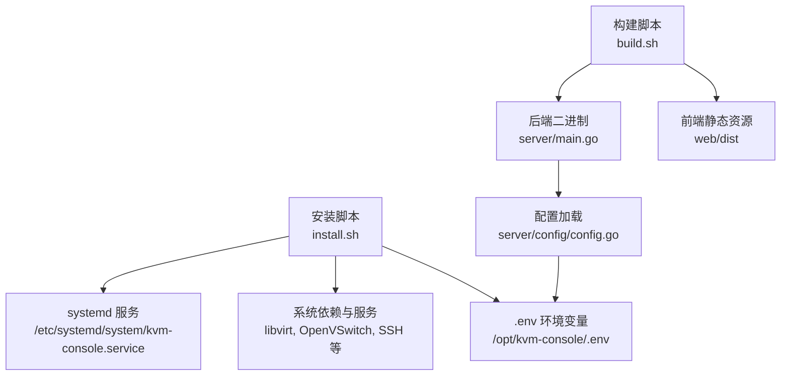
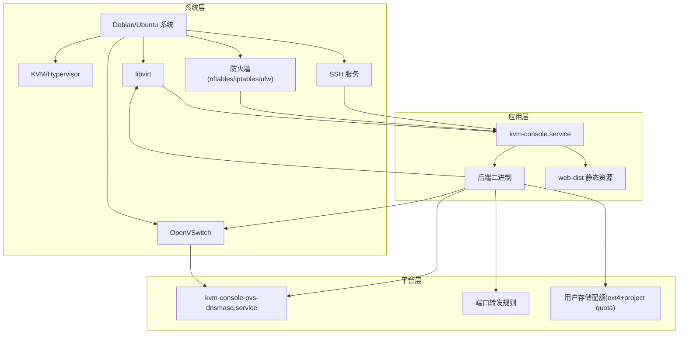
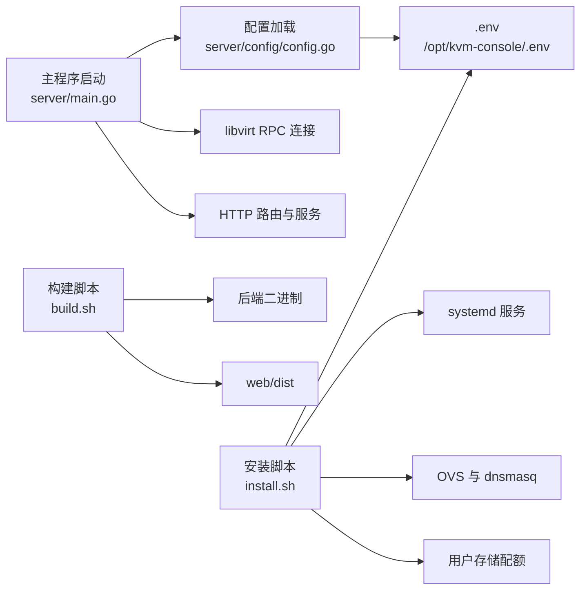

# 生产环境部署

<cite>
**本文引用的文件**
- [build.sh](file://build.sh)
- [install.sh](file://install.sh)
- [start-dev.sh](file://start-dev.sh)
- [DEPENDENCIES.md](file://DEPENDENCIES.md)
- [server/main.go](file://server/main.go)
- [server/config/config.go](file://server/config/config.go)
- [web/package.json](file://web/package.json)
- [web/vite.config.js](file://web/vite.config.js)
</cite>

## 目录
1. [简介](#简介)
2. [项目结构](#项目结构)
3. [核心组件](#核心组件)
4. [架构总览](#架构总览)
5. [详细组件分析](#详细组件分析)
6. [依赖关系分析](#依赖关系分析)
7. [性能考量](#性能考量)
8. [故障排查指南](#故障排查指南)
9. [结论](#结论)
10. [附录](#附录)

## 简介
本指南面向生产环境部署，覆盖系统硬件与软件要求、安装脚本工作原理与自定义选项、构建流程（Go 编译、前端打包、静态资源生成）、部署场景（单机与集群）、环境变量配置、服务启动顺序与健康检查、部署验证与常见问题处理。目标是帮助运维人员在 Debian/Ubuntu 系统上快速、稳定地完成安装与上线。

## 项目结构
- 后端（Go）位于 server/，包含配置、路由、服务层、中间件、模型与任务队列等模块。
- 前端（Vue 3 + Vite）位于 web/，包含构建脚本、代理配置与依赖声明。
- 构建与安装脚本位于仓库根目录，分别负责打包发布与系统级安装。

图表来源
- [build.sh:1-182](file://build.sh#L1-L182)
- [server/main.go:1-128](file://server/main.go#L1-L128)
- [server/config/config.go:157-249](file://server/config/config.go#L157-L249)
- [install.sh:948-976](file://install.sh#L948-L976)

章节来源
- [build.sh:1-182](file://build.sh#L1-L182)
- [install.sh:1-1124](file://install.sh#L1-L1124)
- [server/main.go:1-128](file://server/main.go#L1-L128)
- [server/config/config.go:157-249](file://server/config/config.go#L157-L249)
- [web/package.json:1-30](file://web/package.json#L1-L30)
- [web/vite.config.js:1-27](file://web/vite.config.js#L1-L27)

## 核心组件
- 后端服务
  - 通过 main.go 启动，初始化配置、日志、数据库、libvirt RPC 连接，注册任务队列与定时任务，最后启动 HTTP 服务。
  - 配置通过 server/config/config.go 加载，支持环境变量与数据库持久化配置。
- 安装脚本
  - install.sh 提供安装、更新、卸载、修复配置等功能，自动检测 OS、架构、KVM 硬件与运行时、依赖包与系统服务，创建运行目录、AppArmor 规则、用户存储配额、OVS 网络地基与 dnsmasq 服务，并生成 systemd 服务单元。
- 构建脚本
  - build.sh 支持跳过前端或后端构建，自动安装前端依赖并打包，生成 release/kvm-console-linux-amd64.tar.gz，包含后端二进制、web-dist 与安装脚本。
- 前端
  - 使用 Vite 构建，开发时通过 vite.config.js 配置代理到后端 8080 端口；生产构建生成 dist 目录供后端打包。

章节来源
- [server/main.go:31-128](file://server/main.go#L31-L128)
- [server/config/config.go:157-249](file://server/config/config.go#L157-L249)
- [install.sh:187-220](file://install.sh#L187-L220)
- [install.sh:948-976](file://install.sh#L948-L976)
- [build.sh:96-145](file://build.sh#L96-L145)
- [web/vite.config.js:14-25](file://web/vite.config.js#L14-L25)

## 架构总览
生产部署涉及三层：系统层（OS/内核/虚拟化/网络/存储）、平台层（libvirt/OpenVSwitch/SSH/防火墙）、应用层（后端服务+前端静态资源）。安装脚本负责系统层与平台层的准备，构建脚本产出应用层产物，systemd 负责应用层的托管与健康检查。

图表来源
- [install.sh:313-327](file://install.sh#L313-L327)
- [install.sh:745-806](file://install.sh#L745-L806)
- [install.sh:948-976](file://install.sh#L948-L976)
- [server/main.go:67-127](file://server/main.go#L67-L127)

## 详细组件分析

### 系统与软件要求
- 发行版与架构
  - 仅支持 Debian/Ubuntu 系列，且要求 x86_64 架构。
- 内核与虚拟化
  - 需要 CPU 支持硬件虚拟化（Intel VT-x 或 AMD-V），并确保 /dev/kvm 可用。
- 核心系统服务
  - libvirtd（或 libvirt-daemon）、openvswitch-switch、SSH 服务需启用并运行。
- 依赖包（摘取关键项）
  - 基础：ca-certificates、curl、tar、gzip、util-linux、iproute2、iptables、nftables、openssh-client、openssh-server、parted 等。
  - KVM/QEMU：qemu-system-x86、qemu-utils、libvirt-daemon-system、libvirt-daemon-driver-qemu、libvirt-clients、virtinst、libguestfs-tools、cloud-image-utils、ovmf、lvm2、e2fsprogs、tcpdump、arp-scan、conntrack、nmap、wipefs、findmnt、mount、growpart、partprobe 等。
  - 可选：polkitd/policykit-1、kvm-stat（热迁移辅助指标）。
- Go 与 Node.js
  - 构建后端需要 Go（版本要求见 server/go.mod），前端构建需要 Node.js 与 npm。

章节来源
- [install.sh:126-146](file://install.sh#L126-L146)
- [install.sh:265-295](file://install.sh#L265-L295)
- [install.sh:42-76](file://install.sh#L42-L76)
- [DEPENDENCIES.md:65-114](file://DEPENDENCIES.md#L65-L114)

### 安装脚本工作原理与自定义选项
- 检测与准备
  - 检测 OS/架构、KVM 硬件与 /dev/kvm、核心服务状态。
  - 自动安装缺失的 APT 依赖与常用命令，确保 libvirt、OVS、SSH 正常运行。
- 用户存储与配额
  - 创建用户存储镜像（ext4 + project quota），挂载到 /var/lib/kvm-user-storage，并写入 /etc/fstab。
- 环境变量与配置文件
  - 生成 /opt/kvm-console/.env，补齐关键配置（端口、JWT 密钥、数据库路径、网络后端、SMTP、动态内存调度、VPC 等）。
- 目录与权限
  - 创建运行目录、权限组（vmoperator）、为 libvirt-qemu 用户设置目录属主与权限。
- AppArmor 与网络
  - 配置 libvirt 自定义存储访问规则；启用 IPv4 转发；为 OVS 内部网桥放行 DNS/BOOTP 端口。
- OVS 地基与 dnsmasq
  - 创建网桥、设置网关与 DHCP 范围，生成 dnsmasq.conf 与启动 kvm-console-ovs-dnsmasq.service。
- systemd 服务
  - 生成 /etc/systemd/system/kvm-console.service，设置 After/Wants 依赖 libvirtd、openvswitch-switch、network-online.target，支持重启与健康检查。
- 自定义选项
  - 支持指定 KVM_PORT、KVM_DB_PATH、KVM_JWT_SECRET、KVM_NETWORK_BACKEND、KVM_OVS_*、KVM_VPC_*、KVM_SMTP_*、KVM_DYNAMIC_MEMORY_*、KVM_BATCH_CLONE_MAX_CONCURRENCY 等环境变量。

章节来源
- [install.sh:126-178](file://install.sh#L126-L178)
- [install.sh:265-327](file://install.sh#L265-L327)
- [install.sh:355-423](file://install.sh#L355-L423)
- [install.sh:477-565](file://install.sh#L477-L565)
- [install.sh:576-625](file://install.sh#L576-L625)
- [install.sh:627-678](file://install.sh#L627-L678)
- [install.sh:684-703](file://install.sh#L684-L703)
- [install.sh:745-806](file://install.sh#L745-L806)
- [install.sh:948-976](file://install.sh#L948-L976)

### 构建流程（Go 编译、前端打包、静态资源）
- 前端构建
  - 检查 npm，执行 npm ci 与 npm run build，生成 web/dist。
- 后端构建
  - 检查 go，设置 CGO_ENABLED=1、GOOS=linux、GOARCH=amd64，使用 ldflags 注入版本与构建时间，输出二进制到 release/kvm-console-linux-amd64/kvm-console。
- 打包与产物
  - 复制 web/dist 至 release/kvm-console-linux-amd64/web-dist，复制 install.sh 并赋予执行权限，设置后端二进制可执行，生成 release/kvm-console-linux-amd64.tar.gz。
- 自定义选项
  - 支持 -v/--version 指定版本、--skip-frontend/--skip-backend 跳过构建。

章节来源
- [build.sh:96-145](file://build.sh#L96-L145)
- [build.sh:147-182](file://build.sh#L147-L182)
- [web/package.json:6-10](file://web/package.json#L6-L10)

### 部署场景与配置示例

#### 单机部署
- 前置条件
  - Debian/Ubuntu x86_64，开启 CPU 虚拟化，确保 /dev/kvm 可用。
- 步骤
  - 运行安装脚本，选择“安装”，脚本自动安装依赖、创建用户存储、生成 .env、配置 OVS 与 dnsmasq、创建 systemd 服务并启动。
  - 修改 /opt/kvm-console/.env 中的关键配置（如 KVM_PORT、KVM_JWT_SECRET、KVM_NETWORK_BACKEND、SMTP 等）。
  - 通过 systemctl enable/disable 控制服务启停。
- 健康检查
  - systemctl status kvm-console.service
  - curl -I http://localhost:KVM_PORT/api/health（若后端提供健康端点）
  - journalctl -u kvm-console.service -n 50 --no-pager

章节来源
- [install.sh:187-220](file://install.sh#L187-L220)
- [install.sh:948-976](file://install.sh#L948-L976)
- [server/main.go:121-127](file://server/main.go#L121-L127)

#### 集群部署（概念性说明）
- 节点角色
  - 控制面节点：运行后端服务、管理 libvirt/OVS、提供 API 与前端静态资源。
  - 工作面节点：仅运行 libvirt 与 OVS，不部署后端。
- 网络与存储
  - 统一的 OVS 网络与 DHCP；跨节点共享用户存储（通过 NFS/iSCSI 或分布式文件系统）。
- 负载均衡
  - 使用反向代理（如 Nginx/HAProxy）分发至各控制面节点。
- 配置一致性
  - 通过集中式配置管理（如 etcd/Puppet/Chef）下发 /opt/kvm-console/.env 与 systemd 单元。

（本节为概念性说明，不直接分析具体源码）

### 环境变量配置
- 关键变量（摘取）
  - 服务与端口：KVM_PORT、KVM_DB_PATH、KVM_SERVICE_UNIT_NAME
  - 安全与密钥：KVM_JWT_SECRET、KVM_JWT_SECRET_ROTATE_HOURS、KVM_VM_CREDENTIAL_SECRET、KVM_SECURITY_SECRET
  - 网络与 OVS：KVM_NETWORK_BACKEND、KVM_OVS_BRIDGE、KVM_OVS_UPLINK、KVM_OVS_DHCP_START、KVM_OVS_DHCP_END、KVM_SUBNET_PREFIX、KVM_AUTO_PORT_START、KVM_AUTO_PORT_END、KVM_HOST_IP、KVM_EXTERNAL_NIC
  - VPC：KVM_VPC_SUBNET_PREFIX、KVM_VPC_VLAN_START、KVM_VPC_VLAN_END、KVM_VPC_DNS、KVM_VPC_ACL_TABLE
  - 模板与磁盘：KVM_TEMPLATE_DIR、KVM_TEMPLATE_IMPORT_DIR、KVM_TEMPLATE_EXPORT_DIR、KVM_CLONE_DIR、KVM_ISO_DIR、KVM_DEFAULT_DISK_IOPS_TOTAL/READ/WRITE
  - 带宽与限速：KVM_MAX_BURST_INBOUND、KVM_MAX_BURST_OUTBOUND、KVM_RATE_LIMIT_PUBLIC、KVM_RATE_LIMIT_AUTH
  - 动态内存调度：KVM_DYNAMIC_MEMORY_SCHEDULER_ENABLED、KVM_DYNAMIC_MEMORY_INTERVAL_SECONDS、KVM_DYNAMIC_MEMORY_HOST_RESERVE_MB、KVM_DYNAMIC_MEMORY_HOST_RESERVE_PERCENT、KVM_DYNAMIC_MEMORY_INCREASE_THRESHOLD_PERCENT、KVM_DYNAMIC_MEMORY_RECLAIM_THRESHOLD_PERCENT、KVM_DYNAMIC_MEMORY_COOLDOWN_SECONDS、KVM_DYNAMIC_MEMORY_OBSERVATION_HOURS
  - 端口转发 HTTP 探测：KVM_PORT_FORWARD_HTTP_PROBE_ENABLED、KVM_PORT_FORWARD_HTTP_PROBE_INTERVAL_MINUTES、KVM_PORT_FORWARD_HTTP_PROBE_TIMEOUT_SECONDS
  - SMTP：KVM_SMTP_HOST、KVM_SMTP_PORT、KVM_SMTP_USERNAME、KVM_SMTP_FROM_NAME、KVM_SMTP_FROM_ADDRESS、KVM_SMTP_SECURITY、KVM_SMTP_TIMEOUT_SECONDS、KVM_SMTP_PASSWORD_ENC
  - 日志：KVM_LOG_DIR、KVM_LOG_LEVEL、KVM_LOG_MAX_DAYS、KVM_LOG_COMPRESS、KVM_LOG_CONSOLE、KVM_LOG_CONSOLE_TYPES、KVM_LOG_CONSOLE_LEVEL、KVM_LOG_MAX_SIZE_MB、KVM_LOG_MAX_BACKUPS
  - 其他：KVM_PUBLIC_BASE_URL、KVM_SITE_TITLE、KVM_DEVELOPMENT_MODE、KVM_MAINTENANCE_MODE、KVM_MAINTENANCE_SERVICE_UNITS、KVM_MAINTENANCE_VM_SHUTDOWN_TIMEOUT_SECONDS、KVM_USE_GO_LIBVIRT、KVM_NETWORK_WAIT_ONLINE_DISABLED
- 配置加载顺序
  - 环境变量 > 数据库持久化设置 > 默认值；数据库设置在启动后加载并覆盖未设置的环境变量。

章节来源
- [server/config/config.go:157-249](file://server/config/config.go#L157-L249)
- [server/config/config.go:458-677](file://server/config/config.go#L458-L677)

### 服务启动顺序与健康检查
- 启动顺序
  - network-online.target → libvirtd.service → openvswitch-switch.service → kvm-console.service
  - OVS DHCP 服务（kvm-console-ovs-dnsmasq.service）随 OVS 启动。
- 健康检查
  - systemd 自动重试与监控；可通过 systemctl status 与 journalctl 查看日志。
  - 建议在反向代理层增加 HTTP 健康探针（/api/health，若后端提供）。

章节来源
- [install.sh:948-976](file://install.sh#L948-L976)
- [install.sh:729-743](file://install.sh#L729-L743)
- [server/main.go:121-127](file://server/main.go#L121-L127)

### 部署验证方法
- 服务状态
  - systemctl is-active kvm-console.service
  - systemctl is-active openvswitch-switch.service
  - systemctl is-active libvirtd.service
- 网络连通性
  - OVS 网桥存在且网关/地址配置正确；内部网桥放行 DNS/BOOTP。
- 存储与配额
  - /var/lib/kvm-user-storage 已挂载并启用 project quota。
- 前端访问
  - 浏览器访问 http://<host>:KVM_PORT，确认静态资源加载与登录页面可用。
- 后端日志
  - 查看 /opt/kvm-console/data/kvm_console.db 与日志目录（KVM_LOG_DIR）。

章节来源
- [install.sh:313-327](file://install.sh#L313-L327)
- [install.sh:684-690](file://install.sh#L684-L690)
- [install.sh:355-423](file://install.sh#L355-L423)

## 依赖关系分析

图表来源
- [server/config/config.go:157-249](file://server/config/config.go#L157-L249)
- [server/main.go:39-127](file://server/main.go#L39-L127)
- [build.sh:121-145](file://build.sh#L121-L145)
- [install.sh:948-976](file://install.sh#L948-L976)

章节来源
- [server/config/config.go:157-249](file://server/config/config.go#L157-L249)
- [server/main.go:39-127](file://server/main.go#L39-L127)
- [build.sh:121-145](file://build.sh#L121-L145)
- [install.sh:948-976](file://install.sh#L948-L976)

## 性能考量
- 动态内存调度
  - 通过 KVM_DYNAMIC_MEMORY_* 参数调节周期、阈值、冷却时间与观测窗口，平衡宿主机内存占用与 VM 性能。
- 磁盘 IOPS 限制
  - 通过 KVM_DEFAULT_DISK_IOPS_* 对模板/克隆/导入等场景进行默认 IOPS 限制，避免 IO 抢占。
- 端口转发 HTTP 探测
  - 启用自动封禁明文 HTTP 端口转发，减少安全风险与带宽浪费。
- 日志与磁盘
  - 合理设置日志大小、保留天数与压缩策略，避免日志膨胀影响系统性能。

（本节为通用指导，不直接分析具体源码）

## 故障排查指南
- 安装阶段
  - 依赖缺失：根据 install.sh 的提示安装缺失 APT 包与命令。
  - KVM 不可用：确认 BIOS/UEFI 开启虚拟化、/dev/kvm 可用、内核模块加载正常。
  - OVS/DHCP：若 dnsmasq 未启动，检查网桥与 INPUT 规则，使用 restart_ovs_dnsmasq_service 修复。
- 运行阶段
  - 服务无法启动：检查 systemd 状态与 journalctl 日志；确认 .env 中密钥与端口配置。
  - 网络异常：核对 OVS 网桥、DHCP 范围、iptables 放行规则。
  - 存储问题：检查用户存储镜像挂载、project quota 开启、/etc/fstab 配置。
- 前端访问
  - 若代理不通，检查 vite.config.js 的 /api 代理配置与后端端口。

章节来源
- [install.sh:148-178](file://install.sh#L148-L178)
- [install.sh:265-327](file://install.sh#L265-L327)
- [install.sh:729-743](file://install.sh#L729-L743)
- [install.sh:355-423](file://install.sh#L355-L423)
- [web/vite.config.js:14-25](file://web/vite.config.js#L14-L25)

## 结论
通过 install.sh 的系统级准备与 systemd 托管，结合 build.sh 的标准化产物打包，本项目可在 Debian/Ubuntu 上实现稳定、可重复的生产部署。建议在上线前完成环境变量梳理、网络与存储验证，并建立完善的日志与健康检查机制。

## 附录

### 常用命令速查
- 安装/更新/卸载/修复配置
  - 运行 install.sh，按提示选择操作。
- 启动/停止/重启服务
  - systemctl enable/disable kvm-console.service
  - systemctl start/stop/restart kvm-console.service
- 查看状态与日志
  - systemctl status kvm-console.service
  - journalctl -u kvm-console.service -n 50 --no-pager
- 前端开发调试
  - start-dev.sh 同时启动后端（air）与前端（vite dev），便于开发联调。

章节来源
- [install.sh:187-220](file://install.sh#L187-L220)
- [install.sh:948-976](file://install.sh#L948-L976)
- [start-dev.sh:1-111](file://start-dev.sh#L1-L111)