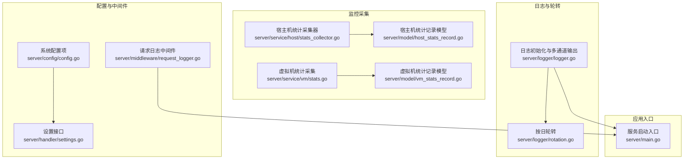
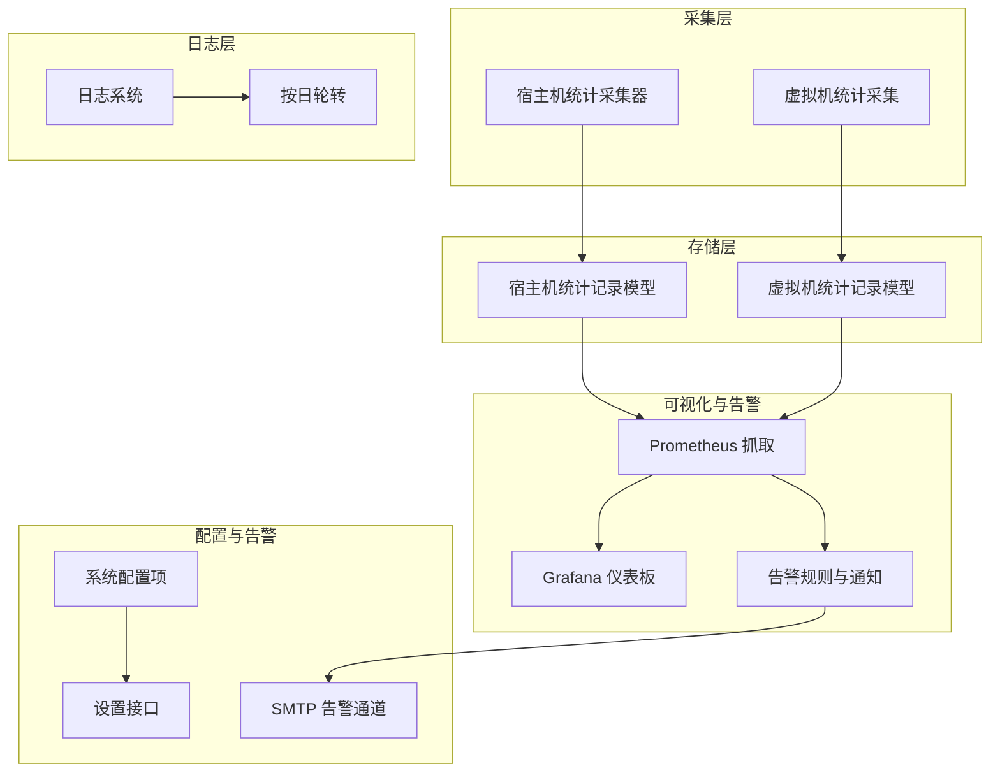
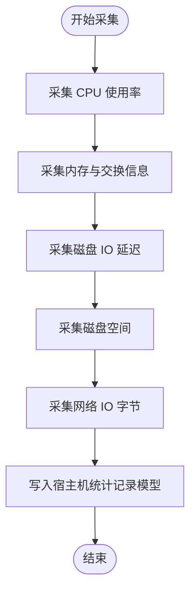
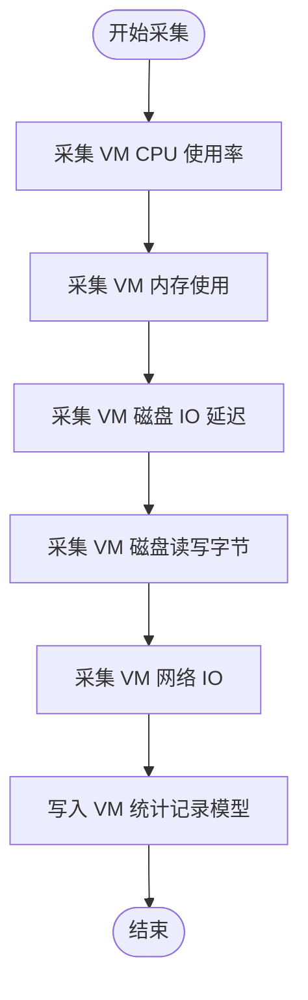
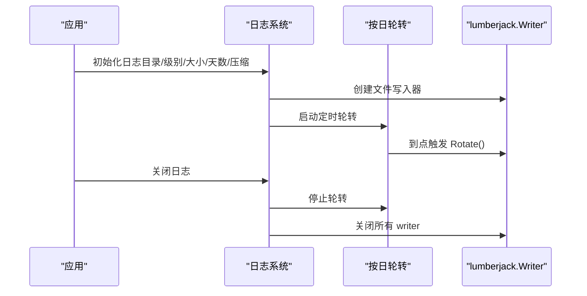
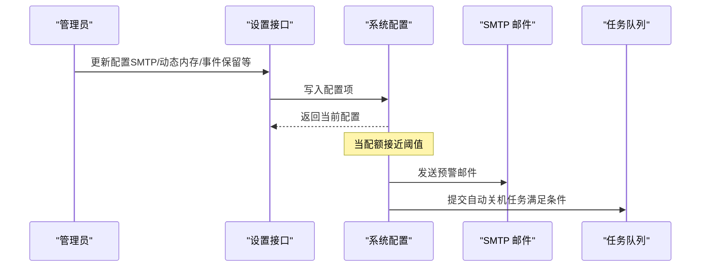
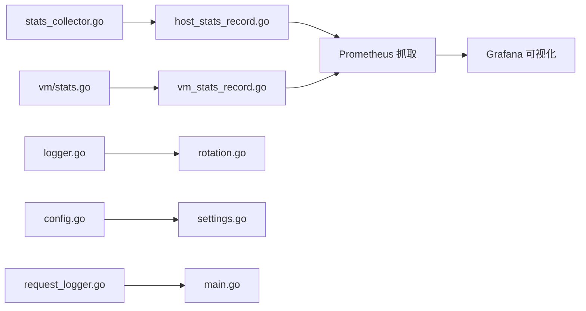

# 监控与告警

<cite>
**本文引用的文件**
- [server/service/host/stats_collector.go](file://server/service/host/stats_collector.go)
- [server/service/vm/stats.go](file://server/service/vm/stats.go)
- [server/logger/logger.go](file://server/logger/logger.go)
- [server/logger/rotation.go](file://server/logger/rotation.go)
- [server/model/host_stats_record.go](file://server/model/host_stats_record.go)
- [server/model/vm_stats_record.go](file://server/model/vm_stats_record.go)
- [server/config/config.go](file://server/config/config.go)
- [server/handler/settings.go](file://server/handler/settings.go)
- [server/middleware/request_logger.go](file://server/middleware/request_logger.go)
- [server/main.go](file://server/main.go)
</cite>

## 目录
1. [简介](#简介)
2. [项目结构](#项目结构)
3. [核心组件](#核心组件)
4. [架构总览](#架构总览)
5. [详细组件分析](#详细组件分析)
6. [依赖关系分析](#依赖关系分析)
7. [性能考量](#性能考量)
8. [故障排查指南](#故障排查指南)
9. [结论](#结论)
10. [附录](#附录)

## 简介
本指南面向系统运维与平台管理员，围绕 QVMConsole 项目的监控与告警配置提供实操指引。内容覆盖关键监控指标的定义与采集方法（CPU 使用率、内存占用、磁盘 IO、网络流量）、日志管理策略（日志级别、轮转与存储）、告警规则设计原则与阈值建议、Prometheus 集成配置（指标暴露、抓取与告警规则）、Grafana 仪表板配置示例与常用图表模板，以及监控数据的长期存储与分析方法。

## 项目结构
与监控和告警直接相关的核心模块分布如下：
- 监控数据采集
  - 宿主机统计采集器：server/service/host/stats_collector.go
  - 虚拟机统计采集：server/service/vm/stats.go
  - 统计记录模型：server/model/host_stats_record.go、server/model/vm_stats_record.go
- 日志与轮转
  - 日志初始化与多通道输出：server/logger/logger.go
  - 日志按日轮转：server/logger/rotation.go
- 配置与告警
  - 系统配置项（含 SMTP、动态内存调度等）：server/config/config.go
  - 设置接口（读写配置）：server/handler/settings.go
  - 请求级日志中间件：server/middleware/request_logger.go
- 应用入口
  - 服务启动入口：server/main.go

**图示来源**
- [server/service/host/stats_collector.go](file://server/service/host/stats_collector.go)
- [server/service/vm/stats.go](file://server/service/vm/stats.go)
- [server/model/host_stats_record.go](file://server/model/host_stats_record.go)
- [server/model/vm_stats_record.go](file://server/model/vm_stats_record.go)
- [server/logger/logger.go](file://server/logger/logger.go)
- [server/logger/rotation.go](file://server/logger/rotation.go)
- [server/config/config.go](file://server/config/config.go)
- [server/handler/settings.go](file://server/handler/settings.go)
- [server/middleware/request_logger.go](file://server/middleware/request_logger.go)
- [server/main.go](file://server/main.go)

**章节来源**
- [server/service/host/stats_collector.go](file://server/service/host/stats_collector.go)
- [server/service/vm/stats.go](file://server/service/vm/stats.go)
- [server/logger/logger.go](file://server/logger/logger.go)
- [server/logger/rotation.go](file://server/logger/rotation.go)
- [server/model/host_stats_record.go](file://server/model/host_stats_record.go)
- [server/model/vm_stats_record.go](file://server/model/vm_stats_record.go)
- [server/config/config.go](file://server/config/config.go)
- [server/handler/settings.go](file://server/handler/settings.go)
- [server/middleware/request_logger.go](file://server/middleware/request_logger.go)
- [server/main.go](file://server/main.go)

## 核心组件
- 监控指标采集
  - 宿主机 CPU、内存、磁盘 IO 延迟、磁盘空间、网络 IO 等指标通过宿主机统计采集器与虚拟机统计采集实现。
  - 统计结果以结构化形式写入对应的统计记录模型，便于后续查询与可视化。
- 日志系统
  - 使用标准库 slog 构建多通道日志（文件与控制台），支持独立的日志级别与终端输出类型。
  - 提供每日定时轮转机制，确保日志文件大小可控与历史留存。
- 配置与告警
  - 系统配置项包含 SMTP、动态内存调度、事件保留时长等，可通过设置接口进行读取与修改。
  - 运行时长配额告警（用户与轻量云 VM）通过邮件通知与任务队列实现，体现告警闭环。

**章节来源**
- [server/service/host/stats_collector.go](file://server/service/host/stats_collector.go)
- [server/service/vm/stats.go](file://server/service/vm/stats.go)
- [server/logger/logger.go](file://server/logger/logger.go)
- [server/logger/rotation.go](file://server/logger/rotation.go)
- [server/config/config.go](file://server/config/config.go)
- [server/handler/settings.go](file://server/handler/settings.go)

## 架构总览
下图展示监控与告警在系统中的位置与交互关系：采集器负责从宿主机与虚拟机收集指标；日志系统负责记录运行过程；配置中心提供参数与告警策略；Grafana 通过 Prometheus 抓取指标进行可视化；Prometheus 触发告警并通过 Webhook 或集成渠道下发。

**图示来源**
- [server/service/host/stats_collector.go](file://server/service/host/stats_collector.go)
- [server/service/vm/stats.go](file://server/service/vm/stats.go)
- [server/model/host_stats_record.go](file://server/model/host_stats_record.go)
- [server/model/vm_stats_record.go](file://server/model/vm_stats_record.go)
- [server/logger/logger.go](file://server/logger/logger.go)
- [server/logger/rotation.go](file://server/logger/rotation.go)
- [server/config/config.go](file://server/config/config.go)
- [server/handler/settings.go](file://server/handler/settings.go)

## 详细组件分析

### 宿主机统计采集器
- 职责：周期性采集宿主机关键指标，包括 CPU 使用率、内存（总量/已用/可用/交换）、磁盘 IO 延迟、磁盘空间、网络 IO（接收/发送字节）等。
- 数据来源：通过系统文件与命令行工具汇总，例如内存信息、磁盘延迟、网络设备统计等。
- 输出：将采集结果写入宿主机统计记录模型，供查询与可视化使用。

**图示来源**
- [server/service/host/stats_collector.go](file://server/service/host/stats_collector.go)

**章节来源**
- [server/service/host/stats_collector.go](file://server/service/host/stats_collector.go)

### 虚拟机统计采集
- 职责：采集单台虚拟机的 CPU 使用率、内存、磁盘 IO 延迟、磁盘读写字节、网络 IO 等指标。
- 方法：解析系统信息与统计文件，计算差分与平均值，形成稳定的时间序列指标。
- 输出：写入虚拟机统计记录模型，支持按 VM 维度的监控与告警。

**图示来源**
- [server/service/vm/stats.go](file://server/service/vm/stats.go)

**章节来源**
- [server/service/vm/stats.go](file://server/service/vm/stats.go)

### 日志系统与轮转
- 多通道输出：支持将日志同时输出到文件与控制台，且文件与控制台可设置不同日志级别。
- 终端输出类型：可按类型选择输出（app/request/cmd/libvirt），便于开发调试与生产环境分离。
- 按日轮转：每日固定时间触发轮转，避免单文件过大；支持压缩与最大备份数配置。
- 关闭流程：优雅关闭时停止轮转并关闭所有 lumberjack writer。

**图示来源**
- [server/logger/logger.go](file://server/logger/logger.go)
- [server/logger/rotation.go](file://server/logger/rotation.go)

**章节来源**
- [server/logger/logger.go](file://server/logger/logger.go)
- [server/logger/rotation.go](file://server/logger/rotation.go)

### 配置与告警策略
- 系统配置项：包含 SMTP、动态内存调度、事件保留时长、默认带宽限制等，可通过设置接口读取与修改。
- 告警邮件：运行时长配额接近或达到阈值时，系统发送邮件提醒；若满足关停条件，提交自动关机任务。
- 邮件通道：需要正确配置 SMTP 参数（主机、端口、认证、安全模式、超时等）。

**图示来源**
- [server/config/config.go](file://server/config/config.go)
- [server/handler/settings.go](file://server/handler/settings.go)

**章节来源**
- [server/config/config.go](file://server/config/config.go)
- [server/handler/settings.go](file://server/handler/settings.go)

### 请求级日志中间件
- 职责：对每个 HTTP 请求进行统一记录，包含请求方法、路径、客户端 IP、响应状态码、处理耗时等。
- 作用：辅助定位性能瓶颈、异常请求与安全问题，配合日志轮转与归档策略提升可观测性。

**章节来源**
- [server/middleware/request_logger.go](file://server/middleware/request_logger.go)

## 依赖关系分析
- 采集器依赖系统文件与命令行工具获取指标，输出到统计记录模型。
- 日志系统依赖 lumberjack 实现文件轮转，支持多 handler 输出。
- 配置模块为告警与调度提供参数来源，设置接口提供读写能力。
- 可视化与告警依赖外部组件（Prometheus/Grafana），通过指标暴露与抓取实现。

**图示来源**
- [server/service/host/stats_collector.go](file://server/service/host/stats_collector.go)
- [server/service/vm/stats.go](file://server/service/vm/stats.go)
- [server/model/host_stats_record.go](file://server/model/host_stats_record.go)
- [server/model/vm_stats_record.go](file://server/model/vm_stats_record.go)
- [server/logger/logger.go](file://server/logger/logger.go)
- [server/logger/rotation.go](file://server/logger/rotation.go)
- [server/config/config.go](file://server/config/config.go)
- [server/handler/settings.go](file://server/handler/settings.go)
- [server/middleware/request_logger.go](file://server/middleware/request_logger.go)
- [server/main.go](file://server/main.go)

**章节来源**
- [server/service/host/stats_collector.go](file://server/service/host/stats_collector.go)
- [server/service/vm/stats.go](file://server/service/vm/stats.go)
- [server/logger/logger.go](file://server/logger/logger.go)
- [server/logger/rotation.go](file://server/logger/rotation.go)
- [server/config/config.go](file://server/config/config.go)
- [server/handler/settings.go](file://server/handler/settings.go)
- [server/middleware/request_logger.go](file://server/middleware/request_logger.go)
- [server/main.go](file://server/main.go)

## 性能考量
- 采集频率与开销
  - 宿主机与虚拟机统计采集涉及系统文件与命令调用，应合理设置采集间隔，避免频繁 IO 与命令执行带来的额外负载。
  - 对于高并发场景，建议将采集任务异步化并加入限流与去抖策略。
- 日志写入与轮转
  - 控制单文件大小与最大备份数，结合压缩减少磁盘占用；按日轮转可降低单文件尺寸峰值。
  - 文件与控制台双通道输出时，注意控制台输出对性能的影响，生产环境建议仅文件输出或降低控制台日志级别。
- 指标存储与查询
  - 统计记录模型应建立索引（如时间戳、主机/VM ID），提高查询效率。
  - 对高频指标采用降采样或滑动窗口聚合，降低存储压力。

[本节为通用性能建议，不直接分析具体文件]

## 故障排查指南
- 日志无法轮转
  - 检查日志目录权限与磁盘空间；确认轮转定时器是否正常启动与停止。
  - 参考路径：[server/logger/rotation.go](file://server/logger/rotation.go)
- 日志级别与输出类型异常
  - 确认初始化参数中文件级别与控制台级别的设置；检查终端输出类型配置是否符合预期。
  - 参考路径：[server/logger/logger.go](file://server/logger/logger.go)
- 配置项未生效
  - 通过设置接口读取当前配置，核对输入参数范围与格式；检查配置持久化与缓存刷新。
  - 参考路径：[server/handler/settings.go](file://server/handler/settings.go)，[server/config/config.go](file://server/config/config.go)
- 告警未触发或邮件未送达
  - 核对 SMTP 配置（主机、端口、认证、安全模式、超时）；检查告警阈值与触发条件。
  - 参考路径：[server/config/config.go](file://server/config/config.go)，[server/handler/settings.go](file://server/handler/settings.go)

**章节来源**
- [server/logger/rotation.go](file://server/logger/rotation.go)
- [server/logger/logger.go](file://server/logger/logger.go)
- [server/handler/settings.go](file://server/handler/settings.go)
- [server/config/config.go](file://server/config/config.go)

## 结论
本指南基于现有代码实现了监控与告警的关键路径梳理：从指标采集、日志管理到配置与告警闭环，并给出了 Prometheus 与 Grafana 的集成思路。建议在生产环境中结合业务负载与合规要求，进一步细化采集频率、日志级别与轮转策略、告警阈值与通知渠道，并建立长期存储与分析体系。

[本节为总结性内容，不直接分析具体文件]

## 附录

### 关键监控指标定义与采集方法
- CPU 使用率
  - 宿主机与虚拟机分别采集 CPU 使用率，用于评估资源占用与调度压力。
  - 参考路径：[server/service/host/stats_collector.go](file://server/service/host/stats_collector.go)，[server/service/vm/stats.go](file://server/service/vm/stats.go)
- 内存占用
  - 包括总量、可用、已用与交换使用，优先使用可用内存计算已用，兼容旧内核。
  - 参考路径：[server/service/host/stats_collector.go](file://server/service/host/stats_collector.go)，[server/service/vm/stats.go](file://server/service/vm/stats.go)
- 磁盘 IO
  - 磁盘 IO 延迟（毫秒）与读写字节，用于识别磁盘瓶颈与容量风险。
  - 参考路径：[server/service/host/stats_collector.go](file://server/service/host/stats_collector.go)，[server/service/vm/stats.go](file://server/service/vm/stats.go)
- 网络流量
  - 宿主机网络 IO（接收/发送字节），用于带宽与链路健康监控。
  - 参考路径：[server/service/host/stats_collector.go](file://server/service/host/stats_collector.go)

**章节来源**
- [server/service/host/stats_collector.go](file://server/service/host/stats_collector.go)
- [server/service/vm/stats.go](file://server/service/vm/stats.go)

### 日志管理策略
- 日志级别设置
  - 支持 debug、info、warn、error 四级；生产环境建议 info 或更高。
  - 参考路径：[server/logger/logger.go](file://server/logger/logger.go)
- 轮转配置
  - 最大文件大小、最大保留天数、压缩与最大备份数；每日定时轮转。
  - 参考路径：[server/logger/logger.go](file://server/logger/logger.go)，[server/logger/rotation.go](file://server/logger/rotation.go)
- 存储策略
  - 建议将日志目录挂载到独立磁盘分区，开启压缩与定期清理策略。

**章节来源**
- [server/logger/logger.go](file://server/logger/logger.go)
- [server/logger/rotation.go](file://server/logger/rotation.go)

### 告警规则设计原则与阈值建议
- 设计原则
  - 明确告警对象（主机/VM/服务）、触发条件与恢复条件；区分严重与警告级别。
  - 避免噪声：引入去抖与抑制策略；结合基线与趋势分析。
- 阈值建议
  - CPU 使用率：短期峰值超过 90% 持续 5 分钟；长期平均超过 80%。
  - 内存使用：可用内存低于 20% 或交换使用高于 30%。
  - 磁盘 IO 延迟：超过 50ms；磁盘使用率高于 85%。
  - 网络 IO：带宽利用率高于 80%，丢包率大于 0。
  - 运行时长配额：剩余时长低于阈值（如 1 小时）时预警，耗尽时自动关机。
- 参考路径
  - [server/config/config.go](file://server/config/config.go)
  - [server/handler/settings.go](file://server/handler/settings.go)

**章节来源**
- [server/config/config.go](file://server/config/config.go)
- [server/handler/settings.go](file://server/handler/settings.go)

### Prometheus 集成配置
- 指标暴露
  - 在应用中增加指标暴露端点（如 /metrics），导出采集器产出的关键指标。
  - 参考路径：[server/service/host/stats_collector.go](file://server/service/host/stats_collector.go)，[server/service/vm/stats.go](file://server/service/vm/stats.go)
- 抓取配置
  - 在 Prometheus 中配置静态目标或服务发现，设置抓取间隔与超时。
- 告警规则定义
  - 基于指标阈值与表达式编写告警规则，结合分组与抑制策略。
  - 参考路径：[server/config/config.go](file://server/config/config.go)

**章节来源**
- [server/service/host/stats_collector.go](file://server/service/host/stats_collector.go)
- [server/service/vm/stats.go](file://server/service/vm/stats.go)
- [server/config/config.go](file://server/config/config.go)

### Grafana 仪表板配置示例与常用图表模板
- 仪表板布局
  - CPU 使用率趋势、内存使用与交换、磁盘 IO 延迟与读写、网络 IO、运行时长配额。
- 图表模板
  - 折线图：展示时间序列趋势；堆叠面积图：展示资源占比。
  - 指标面板：显示当前值与阈值对比；状态面板：展示整体健康状态。
- 参考路径
  - [server/model/host_stats_record.go](file://server/model/host_stats_record.go)
  - [server/model/vm_stats_record.go](file://server/model/vm_stats_record.go)

**章节来源**
- [server/model/host_stats_record.go](file://server/model/host_stats_record.go)
- [server/model/vm_stats_record.go](file://server/model/vm_stats_record.go)

### 监控数据的长期存储与分析
- 存储方案
  - 时序数据库（如 InfluxDB、Prometheus TSDB）或对象存储（S3/HDFS）结合批处理框架（Spark/Flink）。
- 分析方法
  - 基线与异常检测：统计均值/分位数与标准差；趋势与周期性分析。
  - 告警关联：将日志、指标与告警联动，构建根因分析流程。
- 参考路径
  - [server/logger/logger.go](file://server/logger/logger.go)
  - [server/logger/rotation.go](file://server/logger/rotation.go)

**章节来源**
- [server/logger/logger.go](file://server/logger/logger.go)
- [server/logger/rotation.go](file://server/logger/rotation.go)