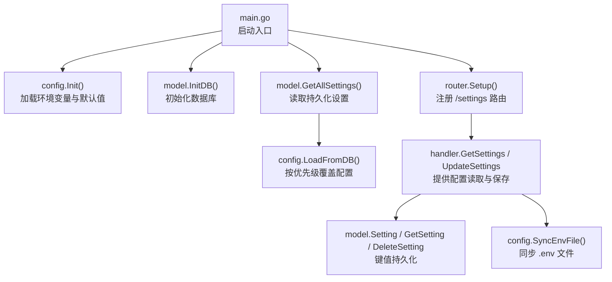
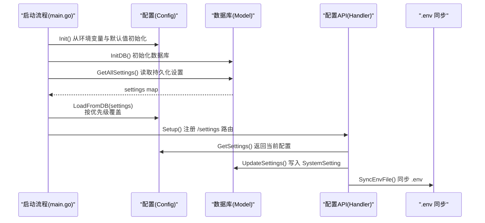
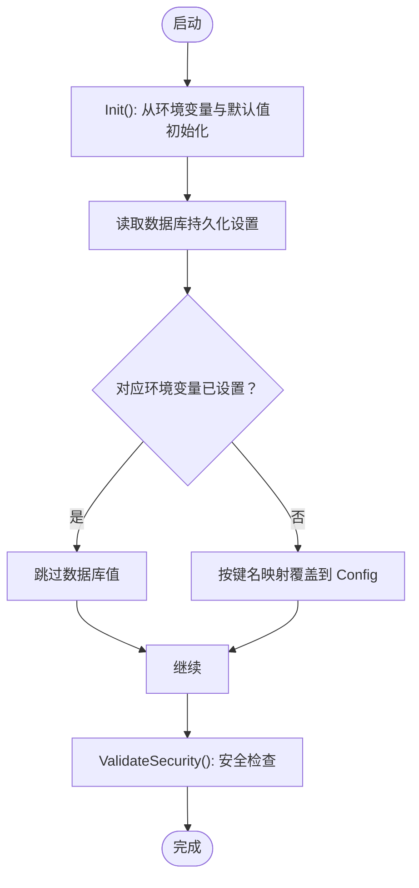
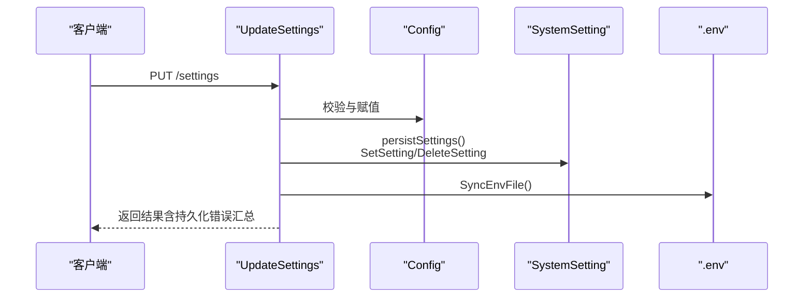
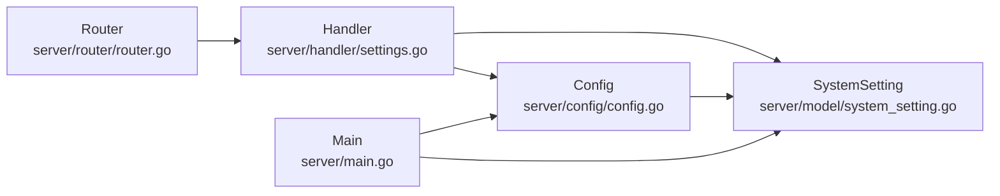

# 动态配置

<cite>
**本文引用的文件**
- [server/config/config.go](file://server/config/config.go)
- [server/model/system_setting.go](file://server/model/system_setting.go)
- [server/handler/settings.go](file://server/handler/settings.go)
- [server/main.go](file://server/main.go)
- [server/router/router.go](file://server/router/router.go)
- [web/src/views/api-docs/endpointDocs.js](file://web/src/views/api-docs/endpointDocs.js)
- [server/model/db.go](file://server/model/db.go)
</cite>

## 目录
1. [简介](#简介)
2. [项目结构](#项目结构)
3. [核心组件](#核心组件)
4. [架构总览](#架构总览)
5. [详细组件分析](#详细组件分析)
6. [依赖分析](#依赖分析)
7. [性能考量](#性能考量)
8. [故障排查指南](#故障排查指南)
9. [结论](#结论)
10. [附录](#附录)

## 简介
本文件面向 Open 虚拟机管理控制台的“动态配置”能力，系统性阐述配置的管理界面与 API 接口、可持久化配置项清单、配置项到环境变量的映射关系、优先级机制（环境变量 > 数据库 > 默认值）、配置加载/保存/同步流程、配置验证与安全检查、动态更新实现细节，以及配置迁移、备份与恢复策略与最佳实践。

## 项目结构
动态配置相关的关键模块分布如下：
- 配置定义与加载：server/config/config.go
- 配置持久化模型：server/model/system_setting.go
- 配置管理 API：server/handler/settings.go
- 启动流程与优先级应用：server/main.go
- 路由注册：server/router/router.go
- 前端接口文档：web/src/views/api-docs/endpointDocs.js
- 数据库初始化：server/model/db.go

图示来源
- [server/main.go:31-128](file://server/main.go#L31-L128)
- [server/config/config.go:157-249](file://server/config/config.go#L157-L249)
- [server/model/system_setting.go:10-45](file://server/model/system_setting.go#L10-L45)
- [server/router/router.go:88-101](file://server/router/router.go#L88-L101)
- [server/handler/settings.go:181-696](file://server/handler/settings.go#L181-L696)

章节来源
- [server/main.go:31-128](file://server/main.go#L31-L128)
- [server/config/config.go:157-249](file://server/config/config.go#L157-L249)
- [server/model/system_setting.go:10-45](file://server/model/system_setting.go#L10-L45)
- [server/router/router.go:88-101](file://server/router/router.go#L88-L101)
- [server/handler/settings.go:181-696](file://server/handler/settings.go#L181-L696)

## 核心组件
- 全局配置对象 Config：集中定义所有可动态调整的系统配置字段，包含服务端口、数据库路径、JWT 密钥、网络后端、OVS 参数、带宽限制、SMTP、动态内存调度、VPC 参数、端口转发探测、磁盘 IOPS、批量克隆并发、日志策略、网络等待就绪开关等。
- 配置加载与优先级：Init() 从环境变量与默认值初始化；LoadFromDB() 在数据库存在持久化设置时按“环境变量 > 数据库 > 默认值”的优先级覆盖。
- 配置持久化：SystemSetting 键值表；GetAllSettings/SetSetting/DeleteSetting 提供 CRUD。
- 配置 API：GetSettings 返回当前配置视图；UpdateSettings 支持运行时生效并持久化；支持 SMTP 测试、JWT 密钥轮换、日志状态查询与导出等。
- 同步与一致性：SyncEnvFile() 将当前可持久化配置同步写入 .env 文件，保证重启后环境变量与数据库一致。

章节来源
- [server/config/config.go:19-152](file://server/config/config.go#L19-L152)
- [server/config/config.go:458-677](file://server/config/config.go#L458-L677)
- [server/model/system_setting.go:3-45](file://server/model/system_setting.go#L3-L45)
- [server/handler/settings.go:23-87](file://server/handler/settings.go#L23-L87)
- [server/handler/settings.go:181-696](file://server/handler/settings.go#L181-L696)
- [server/config/config.go:756-800](file://server/config/config.go#L756-L800)

## 架构总览
动态配置的生命周期从启动到运行时更新的总体流程如下：

图示来源
- [server/main.go:39-80](file://server/main.go#L39-L80)
- [server/config/config.go:157-249](file://server/config/config.go#L157-L249)
- [server/model/system_setting.go:29-45](file://server/model/system_setting.go#L29-L45)
- [server/handler/settings.go:181-696](file://server/handler/settings.go#L181-L696)
- [server/config/config.go:756-800](file://server/config/config.go#L756-L800)

## 详细组件分析

### 配置项与环境变量映射
- 可持久化配置项清单：PersistableKeys 列表定义了可通过界面保存并持久化的配置键集合。
- 映射关系：keyToEnvVar 将每个可持久化键映射到对应的环境变量名，用于 LoadFromDB 时判断“环境变量是否已设置”，从而决定是否采用数据库值。
- 示例映射（节选）：
  - template_dir → KVM_TEMPLATE_DIR
  - auto_port_start → KVM_AUTO_PORT_START
  - max_burst_inbound → KVM_MAX_BURST_INBOUND
  - smtp_host → KVM_SMTP_HOST
  - dynamic_memory_scheduler_enabled → KVM_DYNAMIC_MEMORY_SCHEDULER_ENABLED
  - vpc_subnet_prefix → KVM_VPC_SUBNET_PREFIX
  - default_disk_iops_total → KVM_DEFAULT_DISK_IOPS_TOTAL
  - jwt_secret_rotate_hours → KVM_JWT_SECRET_ROTATE_HOURS
  - use_go_libvirt → KVM_USE_GO_LIBVIRT
  - log_dir → KVM_LOG_DIR
  - network_wait_online_disabled → KVM_NETWORK_WAIT_ONLINE_DISABLED

章节来源
- [server/config/config.go:318-386](file://server/config/config.go#L318-L386)
- [server/config/config.go:388-456](file://server/config/config.go#L388-L456)

### 优先级机制与加载流程
- 优先级：环境变量 > 数据库 > 默认值
- 加载顺序：
  1) Init() 从环境变量与默认值初始化 Config；
  2) 从数据库读取所有 SystemSetting；
  3) LoadFromDB() 遍历持久化设置，若对应环境变量未设置，则按键名映射写入 Config；
  4) ValidateSecurity() 在数据库设置加载完成后进行安全检查（如默认 JWT 密钥禁止生产使用）。

图示来源
- [server/main.go:39-80](file://server/main.go#L39-L80)
- [server/config/config.go:458-471](file://server/config/config.go#L458-L471)
- [server/config/config.go:251-283](file://server/config/config.go#L251-L283)

章节来源
- [server/main.go:39-80](file://server/main.go#L39-L80)
- [server/config/config.go:458-471](file://server/config/config.go#L458-L471)
- [server/config/config.go:251-283](file://server/config/config.go#L251-L283)

### 配置保存与同步流程
- UpdateSettings：
  - 解析请求体，逐项校验与赋值到 Config；
  - 调用 persistSettings() 将当前可持久化配置写入数据库；
  - 若带宽或网络等待就绪等关键项变更，触发异步任务或系统调用；
  - 最终调用 SyncEnvFile() 将当前可持久化配置同步至 .env 文件。
- persistSettings：
  - 将 Config.ToSettingsMap() 导出的键值对写入数据库；
  - 对空值或特殊零值进行删除处理；
  - 返回持久化失败的键列表（便于提示）。

图示来源
- [server/handler/settings.go:259-618](file://server/handler/settings.go#L259-L618)
- [server/handler/settings.go:681-696](file://server/handler/settings.go#L681-L696)
- [server/config/config.go:679-749](file://server/config/config.go#L679-L749)
- [server/config/config.go:756-800](file://server/config/config.go#L756-L800)

章节来源
- [server/handler/settings.go:259-618](file://server/handler/settings.go#L259-L618)
- [server/handler/settings.go:681-696](file://server/handler/settings.go#L681-L696)
- [server/config/config.go:679-749](file://server/config/config.go#L679-L749)
- [server/config/config.go:756-800](file://server/config/config.go#L756-L800)

### 配置验证与安全检查
- 环境变量与默认值校验：Init() 对端口、路径、布尔、整数等进行解析与默认值填充。
- 安全检查（ValidateSecurity）：
  - 若使用默认 JWT 密钥且非开发模式，直接拒绝启动；
  - 开发模式仅发出安全警告；
  - 对未显式设置的 VM 凭据与安全密钥给出回退提示，建议独立密钥。
- 高风险操作二次验证：维护模式切换、JWT 密钥轮换等敏感操作需二次验证。

章节来源
- [server/config/config.go:251-283](file://server/config/config.go#L251-L283)
- [server/handler/settings.go:270-279](file://server/handler/settings.go#L270-L279)
- [server/handler/settings.go:656-679](file://server/handler/settings.go#L656-L679)

### 动态更新与运行时影响
- 带宽设置变更：异步触发全局带宽重新分配（清空或应用新限制）。
- 网络等待就绪检测：变更后执行 systemctl 相关操作（失败仅记录警告，不阻断设置保存）。
- 维护模式：提交异步任务以启用/关闭维护模式，涉及服务单元管理与 VM 优雅关停。

章节来源
- [server/handler/settings.go:562-583](file://server/handler/settings.go#L562-L583)

### API 接口定义
- GET /settings：读取系统设置（含 SMTP 视图、维护模式服务单元、JWT 密钥轮换时间戳等）。
- PUT /settings：保存系统设置（支持运行时生效与持久化，返回持久化错误汇总）。
- POST /settings/smtp/test：发送 SMTP 测试邮件。
- POST /settings/jwt-secret/rotate：手动轮换 JWT 密钥（高风险）。
- GET /settings/log/status：获取日志状态（总大小、文件列表、分类）。
- POST /settings/log/delete：删除日志文件。
- POST /settings/log/export：导出日志文件为 ZIP。

章节来源
- [server/router/router.go:88-101](file://server/router/router.go#L88-L101)
- [server/handler/settings.go:166-257](file://server/handler/settings.go#L166-L257)
- [server/handler/settings.go:259-696](file://server/handler/settings.go#L259-L696)
- [web/src/views/api-docs/endpointDocs.js:174-200](file://web/src/views/api-docs/endpointDocs.js#L174-L200)

### 配置迁移、备份与恢复策略
- 迁移策略：
  - 通过数据库键值表 SystemSetting 实现跨版本迁移与增量更新；
  - 新增配置项时，可在启动阶段或升级脚本中向数据库写入默认值。
- 备份策略：
  - 数据库文件即为配置备份（SQLite）；可定期复制 DBPath 指向的数据库文件；
  - .env 文件同步了当前可持久化配置，可作为环境层备份。
- 恢复策略：
  - 停止服务后替换数据库文件或 .env 文件，重启后按优先级生效；
  - 如需回滚，可删除对应键或写入历史值，重启后 LoadFromDB 生效。

章节来源
- [server/model/system_setting.go:3-45](file://server/model/system_setting.go#L3-L45)
- [server/config/config.go:756-800](file://server/config/config.go#L756-L800)
- [server/model/db.go:57-83](file://server/model/db.go#L57-L83)

### 最佳实践
- 环境变量优先：生产环境通过环境变量固化关键配置，避免误用默认值。
- 独立密钥：为不同用途生成独立密钥（JWT、VM 凭据、安全），降低泄露风险。
- 严格校验：更新前进行参数范围与格式校验，必要时进行二次验证。
- 渐进式变更：对带宽、维护模式等高风险项采用异步任务与告警机制。
- 备份与演练：定期备份数据库与 .env，制定恢复演练计划。

## 依赖分析
- 配置与模型耦合：Config 依赖 SystemSetting 的键值持久化能力；LoadFromDB 依赖 keyToEnvVar 映射。
- API 与服务解耦：Handler 仅负责请求解析、校验与持久化，具体系统调用（如带宽重算、网络等待就绪）委托 service 层。
- 路由与中间件：/settings 路由受 TokenTypeMiddleware 与 AdminMiddleware 保护。

图示来源
- [server/config/config.go:458-677](file://server/config/config.go#L458-L677)
- [server/model/system_setting.go:3-45](file://server/model/system_setting.go#L3-L45)
- [server/handler/settings.go:181-696](file://server/handler/settings.go#L181-L696)
- [server/router/router.go:88-101](file://server/router/router.go#L88-L101)
- [server/main.go:39-80](file://server/main.go#L39-L80)

章节来源
- [server/config/config.go:458-677](file://server/config/config.go#L458-L677)
- [server/model/system_setting.go:3-45](file://server/model/system_setting.go#L3-L45)
- [server/handler/settings.go:181-696](file://server/handler/settings.go#L181-L696)
- [server/router/router.go:88-101](file://server/router/router.go#L88-L101)
- [server/main.go:39-80](file://server/main.go#L39-L80)

## 性能考量
- 配置读取：GetAllSettings() 一次性读取所有键值，建议在启动阶段完成，避免频繁查询。
- 持久化写入：persistSettings() 批量写入，对空值与零值进行删除，减少冗余。
- 异步任务：带宽重算与网络等待就绪变更采用异步执行，避免阻塞主流程。
- 日志管理：日志状态查询与导出支持分文件统计与压缩，降低 I/O 压力。

## 故障排查指南
- 启动被拒绝（默认 JWT 密钥）：
  - 现象：生产模式下启动被拒绝。
  - 处理：设置 KVM_JWT_SECRET 为强随机密钥；开发模式仅警告。
- 环境变量未生效：
  - 现象：修改环境变量后配置未更新。
  - 处理：确认环境变量名与 keyToEnvVar 映射一致；重启服务使 LoadFromDB 生效。
- 持久化失败：
  - 现象：保存设置返回部分持久化失败。
  - 处理：检查数据库权限与磁盘空间；查看返回的失败键列表并重试。
- SMTP 测试失败：
  - 现象：发送测试邮件失败。
  - 处理：核对 SMTP 配置参数；检查网络连通性与防火墙。
- 维护模式任务异常：
  - 现象：启用/关闭维护模式提交失败或回滚。
  - 处理：查看任务队列与日志；必要时回滚设置并重试。

章节来源
- [server/config/config.go:251-283](file://server/config/config.go#L251-L283)
- [server/handler/settings.go:556-618](file://server/handler/settings.go#L556-L618)
- [server/handler/settings.go:620-654](file://server/handler/settings.go#L620-L654)

## 结论
该动态配置体系通过“环境变量 > 数据库 > 默认值”的优先级设计，结合键值持久化与 .env 同步，实现了灵活、可控、可审计的系统配置管理。配合严格的参数校验、安全检查与高风险操作二次验证，以及异步任务与日志管理，满足生产环境对稳定性与安全性的要求。建议在生产环境中优先使用环境变量固化关键配置，并定期备份数据库与 .env 文件，制定完善的迁移与恢复预案。

## 附录
- 可持久化配置项清单（节选）：template_dir、auto_port_start、max_burst_inbound、smtp_host、dynamic_memory_scheduler_enabled、vpc_subnet_prefix、default_disk_iops_total、jwt_secret_rotate_hours、use_go_libvirt、log_dir、network_wait_online_disabled 等。
- 关键环境变量映射：参见 keyToEnvVar 映射表。
- API 文档：参见 endpointDocs.js 中的 /settings 相关条目。