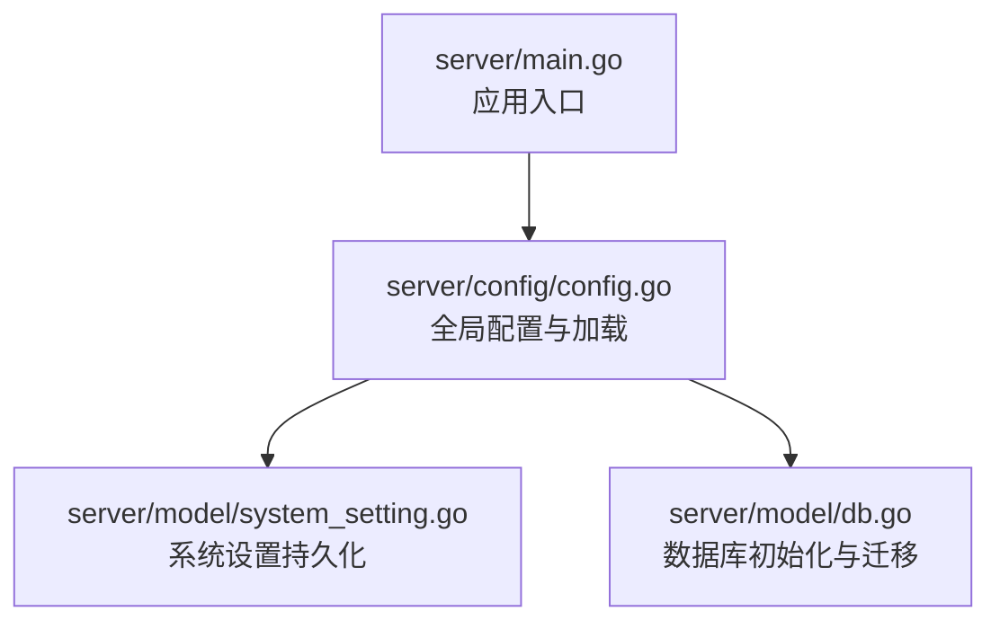
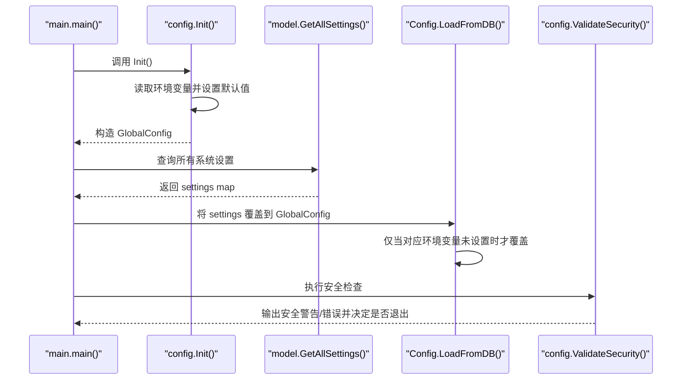
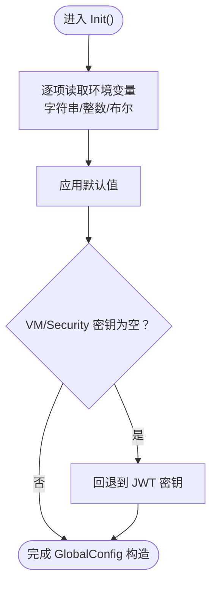

# 配置加载机制

<cite>
**本文引用的文件**
- [server/config/config.go](file://server/config/config.go)
- [server/main.go](file://server/main.go)
- [server/model/system_setting.go](file://server/model/system_setting.go)
- [server/model/db.go](file://server/model/db.go)
</cite>

## 目录
1. [简介](#简介)
2. [项目结构](#项目结构)
3. [核心组件](#核心组件)
4. [架构总览](#架构总览)
5. [详细组件分析](#详细组件分析)
6. [依赖分析](#依赖分析)
7. [性能考量](#性能考量)
8. [故障排查指南](#故障排查指南)
9. [结论](#结论)
10. [附录](#附录)

## 简介
本文档系统性阐述 Open 虚拟机管理控制台的配置加载机制，重点解释“环境变量 > 数据库 > 默认值”的优先级体系，以及 Init 初始化流程、getEnv 系列函数的工作原理、配置项到环境变量映射关系、配置验证与安全检查（ValidateSecurity）机制，并提供实际加载示例与最佳实践，帮助运维与开发者高效、安全地部署与维护系统。

## 项目结构
配置相关的核心代码集中在 server/config 包中，配合 server/main.go 的启动流程，以及 server/model 下的数据库持久化能力，共同构成完整的配置加载闭环。

图表来源
- [server/main.go:31-128](file://server/main.go#L31-L128)
- [server/config/config.go:157-249](file://server/config/config.go#L157-L249)
- [server/model/system_setting.go:29-40](file://server/model/system_setting.go#L29-L40)
- [server/model/db.go:57-113](file://server/model/db.go#L57-L113)

章节来源
- [server/main.go:31-128](file://server/main.go#L31-L128)
- [server/config/config.go:157-249](file://server/config/config.go#L157-L249)
- [server/model/system_setting.go:29-40](file://server/model/system_setting.go#L29-L40)
- [server/model/db.go:57-113](file://server/model/db.go#L57-L113)

## 核心组件
- 全局配置对象：Config 结构体承载所有可配置项，包含服务端口、数据库路径、JWT 密钥、网络与日志等。
- 初始化流程：Init() 从环境变量读取配置，结合默认值构造 GlobalConfig；随后从数据库加载持久化设置进行覆盖；最后执行 ValidateSecurity() 安全检查。
- getEnv 系列函数：统一处理字符串、整数、布尔类型的环境变量解析与类型转换。
- 数据库持久化：SystemSetting 表用于存储管理员通过界面修改的配置项，实现“数据库 > 默认值”的覆盖。
- 映射关系：keyToEnvVar 提供配置项到环境变量的精确映射，PersistableKeys 列出可持久化的配置项集合。

章节来源
- [server/config/config.go:19-152](file://server/config/config.go#L19-L152)
- [server/config/config.go:157-249](file://server/config/config.go#L157-L249)
- [server/config/config.go:285-311](file://server/config/config.go#L285-L311)
- [server/config/config.go:388-456](file://server/config/config.go#L388-L456)
- [server/config/config.go:458-677](file://server/config/config.go#L458-L677)
- [server/model/system_setting.go:3-8](file://server/model/system_setting.go#L3-L8)

## 架构总览
下图展示了配置加载的总体流程与优先级：环境变量 > 数据库 > 默认值；并在启动末尾进行安全校验。

图表来源
- [server/main.go:39-80](file://server/main.go#L39-L80)
- [server/config/config.go:157-249](file://server/config/config.go#L157-L249)
- [server/config/config.go:458-677](file://server/config/config.go#L458-L677)
- [server/model/system_setting.go:29-40](file://server/model/system_setting.go#L29-L40)

## 详细组件分析

### Init 初始化流程
- 作用：从环境变量读取配置，结合默认值构造全局配置对象 GlobalConfig。
- 关键点：
  - 使用 getEnv、getEnvInt、getEnvBool 分别处理字符串、整数、布尔类型。
  - 对部分敏感密钥（VM 凭据密钥、安全密钥）在未显式设置时回退至 JWT 密钥，便于快速启动但会触发安全警告。
- 流程图：

图表来源
- [server/config/config.go:157-249](file://server/config/config.go#L157-L249)
- [server/config/config.go:285-311](file://server/config/config.go#L285-L311)

章节来源
- [server/config/config.go:157-249](file://server/config/config.go#L157-L249)
- [server/config/config.go:285-311](file://server/config/config.go#L285-L311)

### getEnv 系列函数
- getEnv：返回环境变量值，若为空则返回默认值。
- getEnvInt：将环境变量解析为整数，解析失败则返回默认值。
- getEnvBool：将环境变量解析为布尔值，解析失败则返回默认值。
- 类型转换与错误处理：
  - 整数与布尔解析失败时，直接回退默认值，保证系统稳定性。
  - 字符串解析始终返回字符串，不会抛错。

章节来源
- [server/config/config.go:285-311](file://server/config/config.go#L285-L311)

### 数据库持久化与覆盖策略
- SystemSetting 表：键值对存储管理员通过界面修改的配置项。
- LoadFromDB 策略：
  - 仅当对应环境变量未设置时，才使用数据库中的持久化值覆盖。
  - 对整数/布尔类型进行安全解析，失败则跳过该键。
- 可持久化键集合：PersistableKeys 列出了所有可通过界面持久化的配置项。

章节来源
- [server/model/system_setting.go:29-40](file://server/model/system_setting.go#L29-L40)
- [server/config/config.go:458-677](file://server/config/config.go#L458-L677)
- [server/config/config.go:318-386](file://server/config/config.go#L318-L386)

### 配置项到环境变量映射关系
- keyToEnvVar 提供了配置项到环境变量的精确映射，覆盖网络、日志、SMTP、动态内存、VPC、端口转发、IOPS、并发、JWT 等全部配置项。
- 示例映射（节选）：
  - template_dir -> KVM_TEMPLATE_DIR
  - auto_port_start -> KVM_AUTO_PORT_START
  - development_mode -> KVM_DEVELOPMENT_MODE
  - smtp_host -> KVM_SMTP_HOST
  - log_dir -> KVM_LOG_DIR
  - vpc_subnet_prefix -> KVM_VPC_SUBNET_PREFIX
  - default_disk_iops_total -> KVM_DEFAULT_DISK_IOPS_TOTAL
  - batch_clone_max_concurrency -> KVM_BATCH_CLONE_MAX_CONCURRENCY
  - jwt_secret_rotate_hours -> KVM_JWT_SECRET_ROTATE_HOURS
  - use_go_libvirt -> KVM_USE_GO_LIBVIRT
  - network_wait_online_disabled -> KVM_NETWORK_WAIT_ONLINE_DISABLED

章节来源
- [server/config/config.go:388-456](file://server/config/config.go#L388-L456)

### 验证与安全检查（ValidateSecurity）
- 安全检查时机：数据库设置加载完成后立即执行。
- 检查内容：
  - 若 VM 凭据密钥或安全密钥未设置而回退到 JWT 密钥，且非开发模式，输出安全警告。
  - 若 JWT 密钥为默认值：
    - 开发模式：仅输出安全警告，允许继续启动。
    - 非开发模式：输出安全错误并终止进程。
- 建议：
  - 生产环境务必设置独立的 KVM_JWT_SECRET，避免使用默认密钥。
  - 如确需测试，可设置 KVM_DEVELOPMENT_MODE=true。

章节来源
- [server/config/config.go:251-283](file://server/config/config.go#L251-L283)

### 启动流程与配置加载顺序
- main.main() 调用顺序：
  1) config.Init()：从环境变量与默认值构造 GlobalConfig。
  2) model.InitDB()：初始化数据库并自动迁移。
  3) 从数据库读取系统设置并调用 Config.LoadFromDB() 覆盖。
  4) 初始化各类服务与任务队列。
  5) config.ValidateSecurity()：执行安全检查。
  6) 启动 HTTP 服务。

章节来源
- [server/main.go:31-128](file://server/main.go#L31-L128)
- [server/model/db.go:57-113](file://server/model/db.go#L57-L113)

## 依赖分析
- 组件耦合：
  - main.main() 依赖 config.Init() 与 config.ValidateSecurity()。
  - config.Config 依赖 os 环境变量与默认常量。
  - config.LoadFromDB() 依赖 model.GetAllSettings() 与 keyToEnvVar 映射。
  - model.InitDB() 依赖 config.GlobalConfig 的 DBPath。
- 外部依赖：
  - GORM + SQLite：用于系统设置持久化与自动迁移。
  - 标准库 os、strconv、strings 等。

图表来源
- [server/main.go:31-128](file://server/main.go#L31-L128)
- [server/config/config.go:157-249](file://server/config/config.go#L157-L249)
- [server/model/system_setting.go:29-40](file://server/model/system_setting.go#L29-L40)
- [server/model/db.go:57-113](file://server/model/db.go#L57-L113)

章节来源
- [server/main.go:31-128](file://server/main.go#L31-L128)
- [server/config/config.go:157-249](file://server/config/config.go#L157-L249)
- [server/model/system_setting.go:29-40](file://server/model/system_setting.go#L29-L40)
- [server/model/db.go:57-113](file://server/model/db.go#L57-L113)

## 性能考量
- 环境变量读取：O(n) 遍历所有配置项，开销极低。
- 数据库读取：一次性读取所有系统设置，随后按需覆盖，避免重复查询。
- 类型转换：仅在必要时进行，失败即回退默认值，不引入额外异常处理成本。
- 建议：
  - 将高频访问的配置项尽量通过环境变量设置，减少数据库交互。
  - 对于大量整数/布尔配置，确保输入格式正确，避免频繁回退默认值。

[本节为通用指导，无需特定文件来源]

## 故障排查指南
- 现象：启动时报“默认 JWT 密钥”安全错误
  - 原因：未设置 KVM_JWT_SECRET 或使用默认值，且非开发模式。
  - 处理：设置独立密钥或开启开发模式。
  - 参考：[server/config/config.go:262-282](file://server/config/config.go#L262-L282)
- 现象：某些配置未生效
  - 原因：对应环境变量已设置，数据库覆盖被跳过。
  - 处理：清除环境变量或在界面修改配置。
  - 参考：[server/config/config.go:466-471](file://server/config/config.go#L466-L471)
- 现象：整数/布尔配置无效
  - 原因：环境变量值无法解析为目标类型。
  - 处理：修正为合法值（如 1/0、true/false）。
  - 参考：[server/config/config.go:498-504](file://server/config/config.go#L498-L504)

章节来源
- [server/config/config.go:262-282](file://server/config/config.go#L262-L282)
- [server/config/config.go:466-471](file://server/config/config.go#L466-L471)
- [server/config/config.go:498-504](file://server/config/config.go#L498-L504)

## 结论
该配置加载机制以“环境变量 > 数据库 > 默认值”的清晰优先级实现灵活部署与安全可控。Init 与 LoadFromDB 的组合既满足容器化与多环境部署需求，又保留了界面可调的灵活性。ValidateSecurity 在启动阶段进行安全把关，确保生产环境不使用默认密钥。建议在生产环境中严格设置独立密钥与必要的环境变量，遵循最小权限原则，并定期轮换密钥。

[本节为总结，无需特定文件来源]

## 附录

### 实际配置加载示例与最佳实践
- 示例 1：仅使用环境变量
  - 步骤：设置 KVM_PORT、KVM_DB_PATH、KVM_JWT_SECRET 等关键环境变量，不依赖数据库持久化。
  - 优点：部署简单，配置明确。
  - 适用：容器编排、CI/CD 管道。
- 示例 2：环境变量 + 界面持久化
  - 步骤：先通过环境变量设置基础配置，再在管理界面调整部分网络、日志等参数；这些参数将写入数据库并在后续启动时覆盖默认值。
  - 注意：若某配置项设置了环境变量，则界面修改不会影响该值。
  - 适用：需要界面可视化管理的场景。
- 最佳实践
  - 生产环境必须设置独立的 KVM_JWT_SECRET，避免使用默认值。
  - 对于敏感密钥（VM 凭据密钥、安全密钥），建议单独设置，不要回退到 JWT 密钥。
  - 使用 .env 文件同步持久化配置时，注意文件权限（0600）与编码（去除 BOM）。
  - 定期检查 ValidateSecurity 的输出，确保密钥安全策略得到执行。

章节来源
- [server/main.go:39-80](file://server/main.go#L39-L80)
- [server/config/config.go:251-283](file://server/config/config.go#L251-L283)
- [server/config/config.go:751-800](file://server/config/config.go#L751-L800)