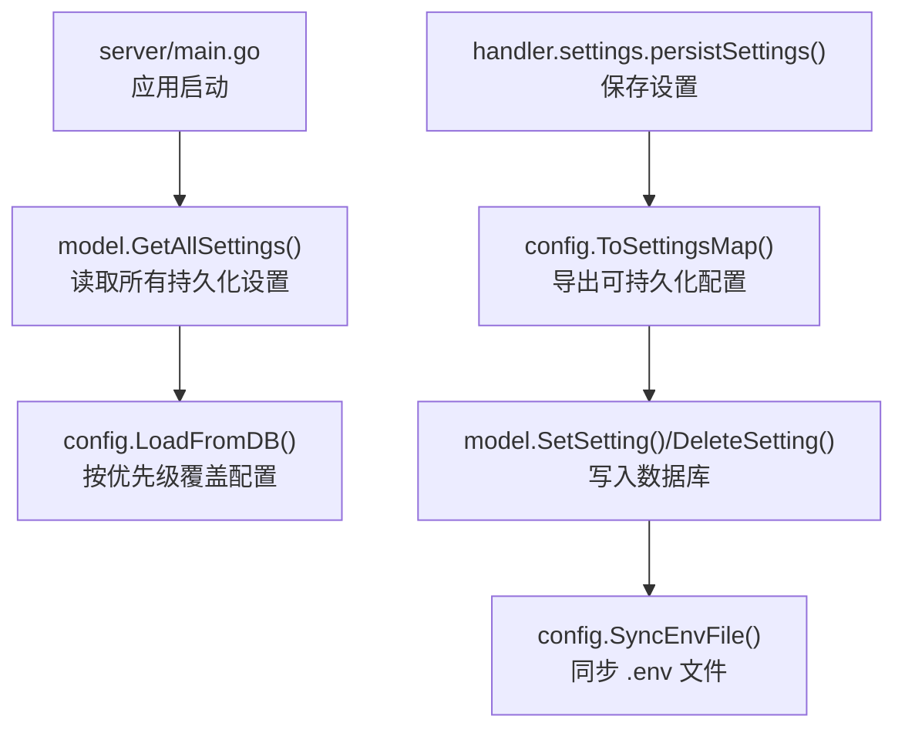
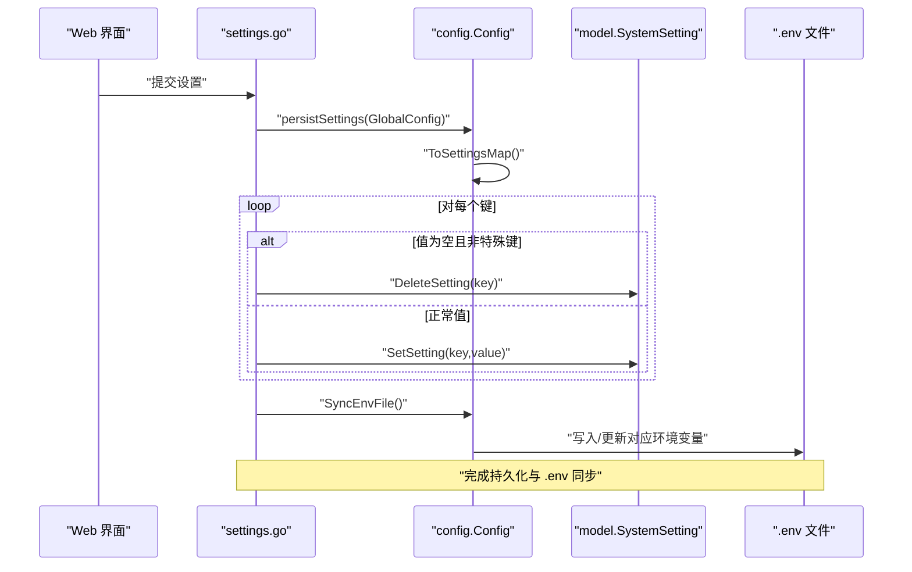
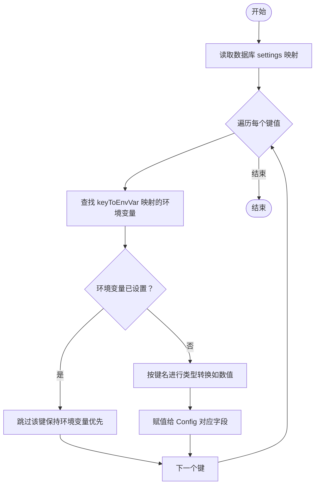
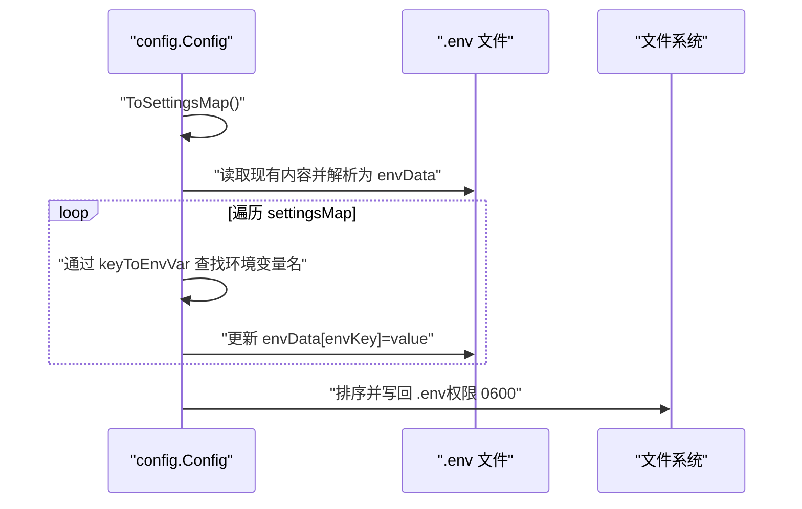
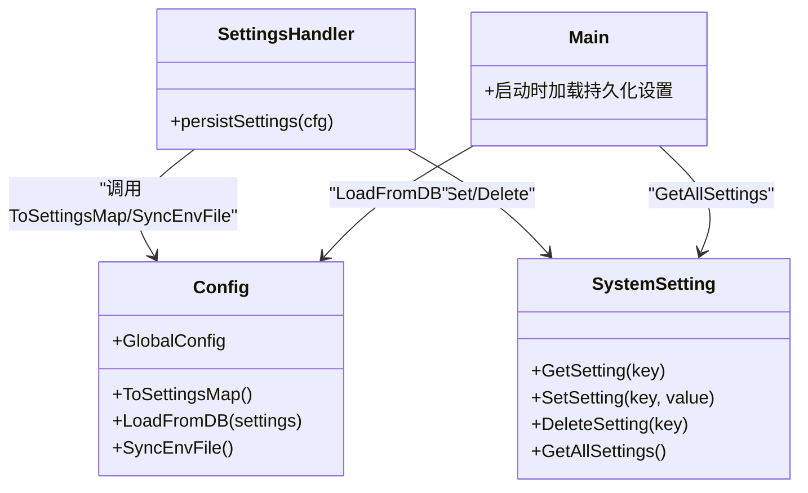

# 配置持久化

<cite>
**本文引用的文件**
- [server/config/config.go](file://server/config/config.go)
- [server/model/system_setting.go](file://server/model/system_setting.go)
- [server/model/db.go](file://server/model/db.go)
- [server/handler/settings.go](file://server/handler/settings.go)
- [server/main.go](file://server/main.go)
</cite>

## 目录
1. [简介](#简介)
2. [项目结构](#项目结构)
3. [核心组件](#核心组件)
4. [架构总览](#架构总览)
5. [详细组件分析](#详细组件分析)
6. [依赖分析](#依赖分析)
7. [性能考虑](#性能考虑)
8. [故障排除指南](#故障排除指南)
9. [结论](#结论)
10. [附录](#附录)

## 简介
本文件系统性阐述 Open 虚拟机管理控制台的“配置持久化”能力，涵盖以下主题：
- 可持久化配置项清单（PersistableKeys）及其作用范围
- 配置从内存到数据库的保存流程（ToSettingsMap 实现机制）
- 加载流程（LoadFromDB 的加载逻辑与环境变量优先级）
- 配置同步机制（SyncEnvFile 将配置写入 .env 文件）
- keyToEnvVar 映射表的作用与配置项与环境变量的对应关系
- 配置迁移、备份与恢复策略建议
- 配置变更的实时生效机制
- 提供可定位的代码片段路径与故障排除要点

## 项目结构
与配置持久化直接相关的模块分布如下：
- server/config/config.go：定义 Config 结构体、可持久化键列表、键到环境变量映射、ToSettingsMap、LoadFromDB、SyncEnvFile 等
- server/model/system_setting.go：系统设置的数据库模型与 CRUD 接口（GetSetting/SetSetting/DeleteSetting/GetAllSettings）
- server/model/db.go：数据库初始化与日志器封装
- server/handler/settings.go：设置接口的保存与变更处理逻辑，调用持久化与环境文件同步
- server/main.go：应用启动时从数据库加载持久化设置并覆盖默认配置

图表来源
- [server/main.go](file://server/main.go)
- [server/model/system_setting.go](file://server/model/system_setting.go)
- [server/config/config.go](file://server/config/config.go)
- [server/handler/settings.go](file://server/handler/settings.go)

章节来源
- [server/config/config.go](file://server/config/config.go)
- [server/model/system_setting.go](file://server/model/system_setting.go)
- [server/model/db.go](file://server/model/db.go)
- [server/handler/settings.go](file://server/handler/settings.go)
- [server/main.go](file://server/main.go)

## 核心组件
- Config 结构体与全局实例
  - 包含大量运行期配置字段（如模板目录、网络后端、OVS 参数、带宽限制、SMTP、动态内存调度、日志等）
  - 全局实例 GlobalConfig 在应用启动时被初始化并加载持久化设置
- PersistableKeys
  - 列表定义了可通过 Web 界面修改并持久化的配置项集合
  - 该列表决定 ToSettingsMap 的导出范围与数据库存储的键集合
- keyToEnvVar 映射表
  - 将配置键映射到对应的环境变量名，用于环境变量优先级判断与 .env 同步
- ToSettingsMap
  - 将当前 Config 中的可持久化字段导出为键值对映射（字符串值）
- LoadFromDB
  - 从数据库读取持久化设置，并按“环境变量 > 数据库 > 默认值”的优先级覆盖当前配置
- SyncEnvFile
  - 将数据库中已持久化的配置键对应的值写回 .env 文件，保证面板重启后环境变量与数据库一致

章节来源
- [server/config/config.go](file://server/config/config.go)

## 架构总览
配置持久化涉及“内存配置 -> 数据库 -> 环境变量文件”的双向协同：
- 写入路径：Web 设置变更 -> persistSettings -> ToSettingsMap -> SetSetting/删除空值 -> SyncEnvFile
- 读取路径：应用启动 -> GetAllSettings -> LoadFromDB -> 覆盖 Config -> 运行期生效

图表来源
- [server/handler/settings.go](file://server/handler/settings.go)
- [server/config/config.go](file://server/config/config.go)
- [server/model/system_setting.go](file://server/model/system_setting.go)

## 详细组件分析

### 可持久化配置项清单（PersistableKeys）
- 范围与用途概览
  - 存储与导入导出：template_dir、template_import_dir、template_export_dir、clone_dir、iso_dir
  - 网络与 OVS：default_network、network_backend、ovs_bridge、ovs_uplink、ovs_dhcp_start、ovs_dhcp_end、subnet_prefix、vpc_* 系列
  - 端口与主机：auto_port_start、auto_port_end、host_ip、external_nic
  - 带宽与救援：max_burst_inbound、max_burst_outbound、rescue_iso
  - 站点与模式：public_base_url、site_title、development_mode、maintenance_mode、maintenance_service_units、maintenance_vm_shutdown_timeout_seconds
  - SMTP：smtp_host、smtp_port、smtp_username、smtp_password_enc、smtp_from_name、smtp_from_address、smtp_security、smtp_timeout_seconds
  - 动态内存调度：dynamic_memory_* 系列
  - 调度事件保留：scheduler_event_retention_hours
  - 端口转发探测：port_forward_http_probe_* 系列
  - 默认磁盘 IOPS：default_disk_iops_total/read/write
  - 批量克隆并发：batch_clone_max_concurrency
  - JWT 密钥轮换周期：jwt_secret_rotate_hours
  - Libvirt 后端：use_go_libvirt
  - 日志：log_dir、log_level、log_max_days、log_compress、log_console、log_console_types、log_console_level、log_max_size_mb、log_max_backups
  - 网络等待在线检测：network_wait_online_disabled
- 作用范围
  - 影响面板行为与 VM 网络、存储、安全、可观测性等关键领域
  - 通过数据库持久化，避免每次重启丢失用户界面修改

章节来源
- [server/config/config.go](file://server/config/config.go)

### ToSettingsMap 方法的实现机制
- 作用
  - 将当前 Config 中的可持久化字段转换为 map[string]string，供数据库写入与 .env 同步使用
- 关键点
  - 仅包含 PersistableKeys 列表中的键
  - 数值型字段统一转为字符串；布尔型使用 FormatBool
  - 与 keyToEnvVar 的键集合一致，确保后续 SyncEnvFile 可正确映射
- 复杂度
  - 时间复杂度 O(n)，n 为可持久化键数量；空间复杂度 O(n)

章节来源
- [server/config/config.go](file://server/config/config.go)

### LoadFromDB 的加载逻辑与环境变量优先级
- 优先级规则
  - 环境变量 > 数据库 > 默认值
  - 若某键存在对应的环境变量且已设置，则跳过数据库覆盖
- 处理流程
  - 遍历数据库返回的 settings 映射
  - 对每个键检查 keyToEnvVar 是否存在对应环境变量，若环境变量非空则跳过
  - 对于未被环境变量覆盖的键，根据键名进行类型转换与赋值（如数值型转换）
- 错误处理
  - 数值转换失败时忽略该键，避免影响其他键的加载

图表来源
- [server/config/config.go](file://server/config/config.go)

章节来源
- [server/config/config.go](file://server/config/config.go)

### SyncEnvFile 的 .env 同步机制
- 目标
  - 将数据库中已持久化的配置键对应的值写回 .env 文件，确保重启后环境变量与数据库一致
- 流程
  - 解析现有 .env 文件内容，构建 envData 映射
  - 读取当前 Config.ToSettingsMap() 的结果
  - 遍历持久化键，通过 keyToEnvVar 映射得到环境变量名，更新 envData
  - 若发生变更，排序并写回 .env 文件（权限 0600）
- 异常处理
  - 写入失败会打印错误信息（不影响数据库持久化）

图表来源
- [server/config/config.go](file://server/config/config.go)

章节来源
- [server/config/config.go](file://server/config/config.go)

### keyToEnvVar 映射表与配置项对应关系
- 作用
  - 定义配置键与环境变量之间的唯一映射，支撑环境变量优先级判断与 .env 同步
- 使用场景
  - LoadFromDB：当环境变量存在时跳过数据库覆盖
  - SyncEnvFile：将持久化键对应的值写回 .env
- 示例（节选）
  - template_dir <-> KVM_TEMPLATE_DIR
  - auto_port_start <-> KVM_AUTO_PORT_START
  - development_mode <-> KVM_DEVELOPMENT_MODE
  - log_console_level <-> KVM_LOG_CONSOLE_LEVEL
  - ……（完整映射见源码）

章节来源
- [server/config/config.go](file://server/config/config.go)

### 保存流程（从内存到数据库）
- 触发点
  - Web 设置接口提交后，调用 persistSettings
- 步骤
  - ToSettingsMap 导出当前可持久化配置
  - 遍历映射：
    - 若值为空或特定“0”值（除 dynamic_memory_observation_hours），执行 DeleteSetting
    - 否则执行 SetSetting(key, value)
  - 最后调用 SyncEnvFile，确保 .env 与数据库一致
- 错误处理
  - 数据库写入失败时收集错误并在响应中提示

章节来源
- [server/handler/settings.go](file://server/handler/settings.go)
- [server/config/config.go](file://server/config/config.go)
- [server/model/system_setting.go](file://server/model/system_setting.go)

### 应用启动时的加载流程
- 触发点
  - 服务器启动阶段
- 步骤
  - 调用 model.GetAllSettings 获取所有持久化设置
  - 调用 config.LoadFromDB 将数据库设置按优先级覆盖到 GlobalConfig
  - 后续组件基于 GlobalConfig 运行

章节来源
- [server/main.go](file://server/main.go)
- [server/model/system_setting.go](file://server/model/system_setting.go)
- [server/config/config.go](file://server/config/config.go)

### 配置变更的实时生效机制
- 带宽设置
  - 当 MaxBurstInbound 或 MaxBurstOutbound 发生变化时，异步触发全局带宽重新分配或清理
- 网络等待在线检测
  - 当 network_wait_online_disabled 发生变化时，异步执行 systemctl 相关操作以启用/禁用检测

章节来源
- [server/handler/settings.go](file://server/handler/settings.go)

## 依赖分析
- 组件耦合
  - config.Config 依赖 keyToEnvVar 与 PersistableKeys，负责导出/加载/同步
  - model.SystemSetting 提供数据库访问接口，承担持久化存储职责
  - handler.settings 作为入口协调配置保存与环境文件同步
  - main.go 在启动时拉取数据库设置并覆盖全局配置
- 外部依赖
  - SQLite（GORM）用于本地持久化
  - .env 文件用于环境变量注入与重启一致性保障

图表来源
- [server/config/config.go](file://server/config/config.go)
- [server/model/system_setting.go](file://server/model/system_setting.go)
- [server/handler/settings.go](file://server/handler/settings.go)
- [server/main.go](file://server/main.go)

章节来源
- [server/config/config.go](file://server/config/config.go)
- [server/model/system_setting.go](file://server/model/system_setting.go)
- [server/handler/settings.go](file://server/handler/settings.go)
- [server/main.go](file://server/main.go)

## 性能考虑
- 数据库写入
  - SetSetting 使用 Upsert（存在则更新，否则插入），避免重复建表/索引开销
  - DeleteSetting 仅在值为空时触发，减少不必要的写操作
- 查询与加载
  - GetAllSettings 返回全量映射，建议在启动阶段一次性加载，避免频繁 IO
- 日志与慢查询
  - 数据库日志器封装仅记录慢查询与错误，降低噪音

章节来源
- [server/model/system_setting.go](file://server/model/system_setting.go)
- [server/model/db.go](file://server/model/db.go)

## 故障排除指南
- .env 写入失败
  - 现象：控制台打印“同步 .env 文件失败”
  - 排查：确认 .env 文件路径与权限（0600）、磁盘空间、进程权限
  - 参考位置：[server/config/config.go](file://server/config/config.go)
- 数据库写入失败
  - 现象：保存设置后返回部分持久化失败
  - 排查：检查数据库连接、表结构、字段长度限制
  - 参考位置：[server/handler/settings.go](file://server/handler/settings.go)、[server/model/system_setting.go](file://server/model/system_setting.go)
- 环境变量覆盖导致设置未生效
  - 现象：修改界面后重启发现未生效
  - 排查：确认对应 KVM_* 环境变量是否已设置；LoadFromDB 会优先环境变量
  - 参考位置：[server/config/config.go](file://server/config/config.go)
- 数值转换异常
  - 现象：某些数值型设置未被加载
  - 排查：检查数据库中对应值是否为合法整数
  - 参考位置：[server/config/config.go](file://server/config/config.go)
- 启动时未加载持久化设置
  - 现象：面板重启后设置恢复默认
  - 排查：确认启动阶段是否调用 GetAllSettings 并传入 LoadFromDB
  - 参考位置：[server/main.go](file://server/main.go)

章节来源
- [server/config/config.go](file://server/config/config.go)
- [server/handler/settings.go](file://server/handler/settings.go)
- [server/model/system_setting.go](file://server/model/system_setting.go)
- [server/main.go](file://server/main.go)

## 结论
本持久化体系通过“可持久化键集合 + 键到环境变量映射 + 数据库存储 + .env 同步”的组合，实现了：
- 界面可配置项的可靠持久化
- 环境变量优先级与重启一致性
- 启动时自动覆盖与运行期变更的异步生效
建议在生产环境中配合数据库备份与 .env 文件版本管理，确保变更可追溯与可回滚。

## 附录

### 可持久化配置项清单（摘录）
- 存储与导入导出：template_dir、template_import_dir、template_export_dir、clone_dir、iso_dir
- 网络与 OVS：default_network、network_backend、ovs_bridge、ovs_uplink、ovs_dhcp_start、ovs_dhcp_end、subnet_prefix、vpc_subnet_prefix、vpc_vlan_start、vpc_vlan_end、vpc_dns、vpc_acl_table
- 端口与主机：auto_port_start、auto_port_end、host_ip、external_nic
- 带宽与救援：max_burst_inbound、max_burst_outbound、rescue_iso
- 站点与模式：public_base_url、site_title、development_mode、maintenance_mode、maintenance_service_units、maintenance_vm_shutdown_timeout_seconds
- SMTP：smtp_host、smtp_port、smtp_username、smtp_password_enc、smtp_from_name、smtp_from_address、smtp_security、smtp_timeout_seconds
- 动态内存调度：dynamic_memory_scheduler_enabled、dynamic_memory_interval_seconds、dynamic_memory_host_reserve_mb、dynamic_memory_host_reserve_percent、dynamic_memory_increase_threshold_percent、dynamic_memory_reclaim_threshold_percent、dynamic_memory_cooldown_seconds、dynamic_memory_observation_hours
- 调度事件保留：scheduler_event_retention_hours
- 端口转发探测：port_forward_http_probe_enabled、port_forward_http_probe_interval_minutes、port_forward_http_probe_timeout_seconds
- 默认磁盘 IOPS：default_disk_iops_total、default_disk_iops_read、default_disk_iops_write
- 批量克隆并发：batch_clone_max_concurrency
- JWT 密钥轮换周期：jwt_secret_rotate_hours
- Libvirt 后端：use_go_libvirt
- 日志：log_dir、log_level、log_max_days、log_compress、log_console、log_console_types、log_console_level、log_max_size_mb、log_max_backups
- 网络等待在线检测：network_wait_online_disabled

章节来源
- [server/config/config.go](file://server/config/config.go)

### 配置迁移、备份与恢复策略
- 迁移
  - 新版本若新增键，可在启动时通过默认值与 LoadFromDB 自动补齐；或提供脚本批量 SetSetting
- 备份
  - 备份数据库文件（SQLite）与 .env 文件
- 恢复
  - 恢复数据库与 .env 后，重启服务使 LoadFromDB 生效
- 版本管理
  - 建议将 .env 与数据库快照纳入版本管理，便于回滚

### 代码示例（路径定位）
- 保存设置流程
  - [server/handler/settings.go](file://server/handler/settings.go)
- 导出可持久化配置
  - [server/config/config.go](file://server/config/config.go)
- 写入数据库
  - [server/model/system_setting.go](file://server/model/system_setting.go)
- 启动时加载持久化设置
  - [server/main.go](file://server/main.go)
- 同步 .env 文件
  - [server/config/config.go](file://server/config/config.go)