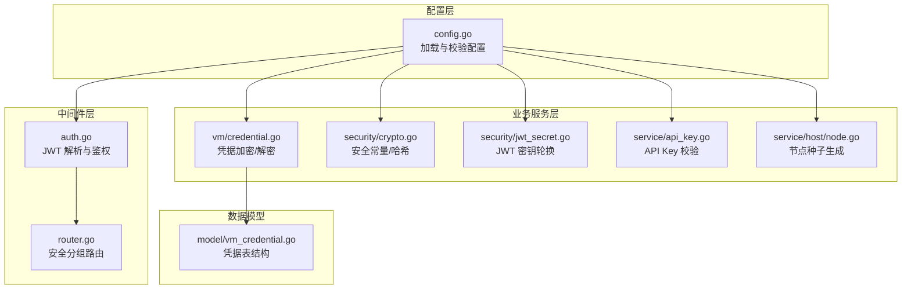
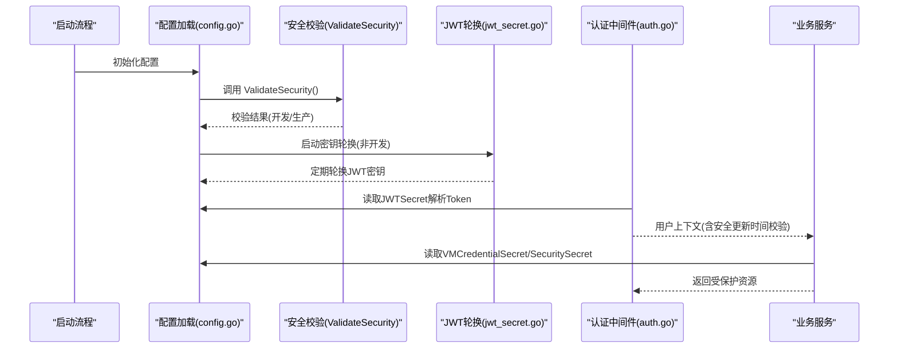
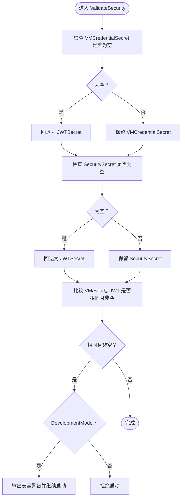
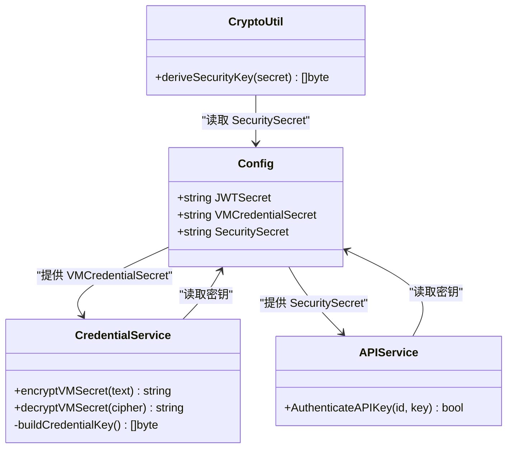
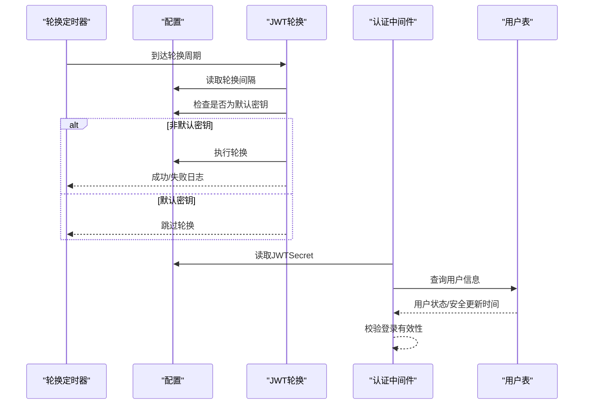
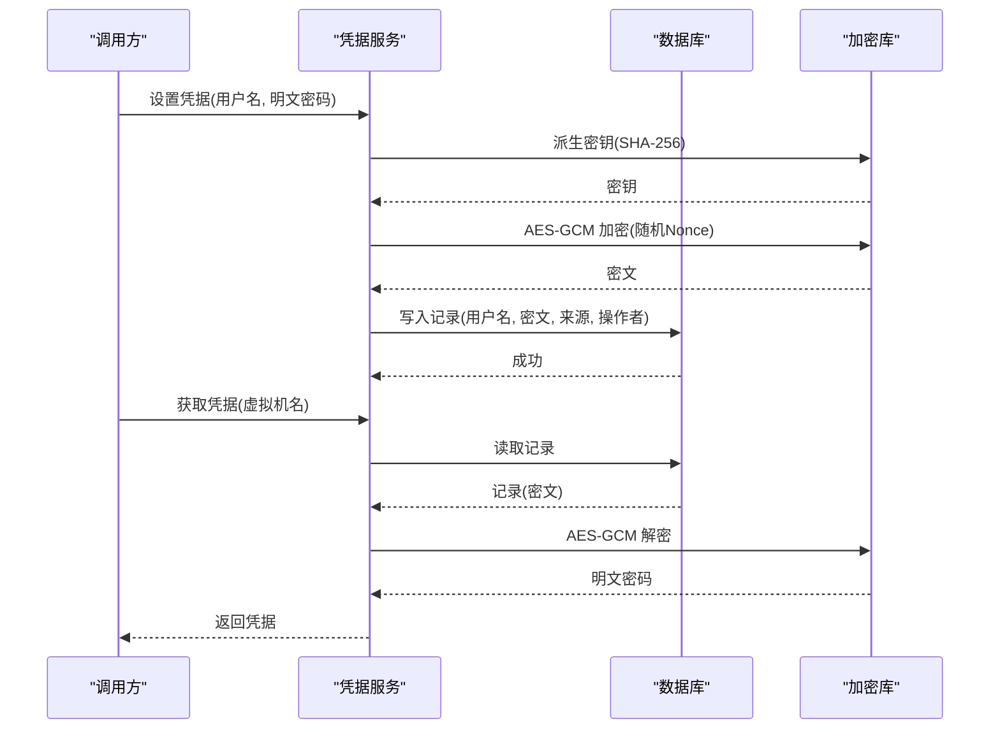
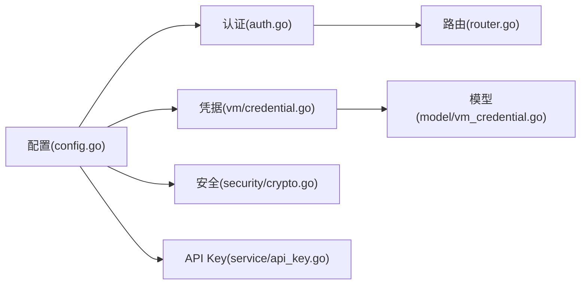

# 配置验证与安全

<cite>
**本文引用的文件**
- [server/config/config.go](file://server/config/config.go)
- [server/middleware/auth.go](file://server/middleware/auth.go)
- [server/router/router.go](file://server/router/router.go)
- [server/service/security/crypto.go](file://server/service/security/crypto.go)
- [server/service/security/jwt_secret.go](file://server/service/security/jwt_secret.go)
- [server/service/vm/credential.go](file://server/service/vm/credential.go)
- [server/model/vm_credential.go](file://server/model/vm_credential.go)
- [server/service/api_key.go](file://server/service/api_key.go)
- [server/service/host/node.go](file://server/service/host/node.go)
</cite>

## 目录
1. [简介](#简介)
2. [项目结构](#项目结构)
3. [核心组件](#核心组件)
4. [架构总览](#架构总览)
5. [详细组件分析](#详细组件分析)
6. [依赖关系分析](#依赖关系分析)
7. [性能考量](#性能考量)
8. [故障排查指南](#故障排查指南)
9. [结论](#结论)
10. [附录](#附录)

## 简介
本文件聚焦于 Open 虚拟机管理控制台的“配置验证与安全”主题，系统性解析以下内容：
- ValidateSecurity 函数的安全检查逻辑与默认 JWT 密钥检测及安全警告机制
- VMCredentialSecret 与 SecuritySecret 的回退与独立性设计
- 开发模式与生产模式下的不同行为
- 各类配置项的安全风险评估（网络、存储、SMTP 等）
- 配置验证最佳实践（强密码、密钥管理、配置审计）
- 常见配置错误的诊断与加固建议

## 项目结构
围绕安全与配置验证的关键模块分布如下：
- 配置层：负责加载与校验各类安全相关配置，包括 JWT 密钥、凭据密钥、安全密钥等
- 中间件层：基于 JWT 密钥进行认证与授权，限制访问类型与生命周期
- 业务服务层：实现凭据加密、TOTP、SMTP、API Key 等安全能力
- 路由层：按安全级别划分接口组，区分登录态、安全初始化、高风险操作等

图表来源
- [server/config/config.go:242-283](file://server/config/config.go#L242-L283)
- [server/middleware/auth.go:58-73](file://server/middleware/auth.go#L58-L73)
- [server/router/router.go:54-86](file://server/router/router.go#L54-L86)
- [server/service/vm/credential.go:119-177](file://server/service/vm/credential.go#L119-L177)
- [server/service/security/crypto.go](file://server/service/security/crypto.go#L69)
- [server/service/security/jwt_secret.go:96-131](file://server/service/security/jwt_secret.go#L96-L131)
- [server/service/api_key.go](file://server/service/api_key.go#L168)
- [server/service/host/node.go](file://server/service/host/node.go#L284)
- [server/model/vm_credential.go:1-21](file://server/model/vm_credential.go#L1-L21)

章节来源
- [server/config/config.go:242-283](file://server/config/config.go#L242-L283)
- [server/middleware/auth.go:58-73](file://server/middleware/auth.go#L58-L73)
- [server/router/router.go:54-86](file://server/router/router.go#L54-L86)
- [server/service/vm/credential.go:119-177](file://server/service/vm/credential.go#L119-L177)
- [server/service/security/crypto.go](file://server/service/security/crypto.go#L69)
- [server/service/security/jwt_secret.go:96-131](file://server/service/security/jwt_secret.go#L96-L131)
- [server/service/api_key.go](file://server/service/api_key.go#L168)
- [server/service/host/node.go](file://server/service/host/node.go#L284)
- [server/model/vm_credential.go:1-21](file://server/model/vm_credential.go#L1-L21)

## 核心组件
- 配置加载与安全校验：在配置加载完成后执行 ValidateSecurity，确保密钥独立且非默认值；开发模式下对默认 JWT 密钥仅发出安全警告，生产模式直接拒绝启动
- JWT 密钥轮换：在非开发模式下，若未使用默认密钥则按周期自动轮换，避免长期使用同一密钥带来的风险
- 凭据与安全密钥：VMCredentialSecret 与 SecuritySecret 分别用于虚拟机凭据加密与通用安全功能，二者在未显式配置时会回退到 JWT 密钥，但推荐独立配置以降低耦合与风险
- 中间件认证：基于 JWT 密钥解析 Token 并进行用户状态与安全更新时间校验，确保登录有效性与安全性
- API Key 校验：使用 SecuritySecret 进行 HMAC-SHA256 校验，保证 API Key 的机密性与完整性

章节来源
- [server/config/config.go:242-283](file://server/config/config.go#L242-L283)
- [server/service/security/jwt_secret.go:96-131](file://server/service/security/jwt_secret.go#L96-L131)
- [server/service/vm/credential.go:174-177](file://server/service/vm/credential.go#L174-L177)
- [server/middleware/auth.go:58-73](file://server/middleware/auth.go#L58-L73)
- [server/service/api_key.go](file://server/service/api_key.go#L168)

## 架构总览
下图展示从配置加载到安全校验、密钥轮换、凭据处理与认证鉴权的整体流程。

图表来源
- [server/config/config.go:242-283](file://server/config/config.go#L242-L283)
- [server/service/security/jwt_secret.go:96-131](file://server/service/security/jwt_secret.go#L96-L131)
- [server/middleware/auth.go:58-73](file://server/middleware/auth.go#L58-L73)
- [server/service/vm/credential.go:174-177](file://server/service/vm/credential.go#L174-L177)
- [server/service/api_key.go](file://server/service/api_key.go#L168)

## 详细组件分析

### 组件一：ValidateSecurity 安全检查与默认 JWT 密钥检测
- 触发时机：在数据库设置加载完成后调用，确保后续依赖的配置可用
- 核心逻辑：
  - 若 VMCredentialSecret 为空，则回退为 JWTSecret
  - 若 SecuritySecret 为空，则回退为 JWTSecret
  - 若 VMCredentialSecret 或 SecuritySecret 与 JWTSecret 相同且非空，则发出安全警告（开发模式）或拒绝启动（生产模式）
- 开发/生产差异：
  - 开发模式：检测到默认 JWT 密钥仅输出安全警告，服务继续启动
  - 生产模式：检测到默认 JWT 密钥直接拒绝启动，防止因默认密钥导致的身份伪造风险

图表来源
- [server/config/config.go:242-283](file://server/config/config.go#L242-L283)

章节来源
- [server/config/config.go:242-283](file://server/config/config.go#L242-L283)

### 组件二：VMCredentialSecret 与 SecuritySecret 的回退机制与独立性
- 回退机制：
  - VMCredentialSecret 与 SecuritySecret 在未显式配置时，均回退为 JWTSecret
- 独立性设计原因：
  - 降低耦合：凭据加密与通用安全功能不应与 JWT 认证密钥绑定
  - 风险隔离：若 JWT 密钥泄露或轮换，不影响凭据与安全功能的独立性
  - 最佳实践：建议为 VMCredentialSecret 与 SecuritySecret 单独配置强密钥，避免与 JWTSecret 相同
- 实现细节：
  - 凭据加密使用 AES-GCM，密钥通过 SHA-256 对 VMCredentialSecret 进行派生
  - API Key 校验使用 HMAC-SHA256，密钥为 SecuritySecret

图表来源
- [server/service/vm/credential.go:119-177](file://server/service/vm/credential.go#L119-L177)
- [server/service/api_key.go](file://server/service/api_key.go#L168)
- [server/service/security/crypto.go](file://server/service/security/crypto.go#L69)
- [server/config/config.go:242-246](file://server/config/config.go#L242-L246)

章节来源
- [server/service/vm/credential.go:119-177](file://server/service/vm/credential.go#L119-L177)
- [server/service/api_key.go](file://server/service/api_key.go#L168)
- [server/service/security/crypto.go](file://server/service/security/crypto.go#L69)
- [server/config/config.go:242-246](file://server/config/config.go#L242-L246)

### 组件三：JWT 密钥轮换与安全中间件
- 密钥轮换：
  - 非开发模式下，若未使用默认 JWT 密钥，则按配置周期启动轮换任务
  - 轮换失败会记录告警日志，避免静默失败
- 安全中间件：
  - 基于 JWTSecret 解析 Token，校验用户存在性、状态与安全更新时间
  - 支持按 Token 类型过滤（如仅允许 JWT，不接受 API Key）

图表来源
- [server/service/security/jwt_secret.go:96-131](file://server/service/security/jwt_secret.go#L96-L131)
- [server/middleware/auth.go:58-73](file://server/middleware/auth.go#L58-L73)

章节来源
- [server/service/security/jwt_secret.go:96-131](file://server/service/security/jwt_secret.go#L96-L131)
- [server/middleware/auth.go:58-73](file://server/middleware/auth.go#L58-L73)

### 组件四：凭据存储与解密流程
- 存储结构：凭据记录包含用户名、加密密码、来源、操作者、最后重置时间等字段
- 加密流程：AES-GCM，密钥由 VMCredentialSecret 的 SHA-256 派生
- 解密流程：从存储读取密文，使用相同密钥与随机 Nonce 进行解密

图表来源
- [server/service/vm/credential.go:50-108](file://server/service/vm/credential.go#L50-L108)
- [server/model/vm_credential.go:1-21](file://server/model/vm_credential.go#L1-L21)

章节来源
- [server/service/vm/credential.go:50-108](file://server/service/vm/credential.go#L50-L108)
- [server/model/vm_credential.go:1-21](file://server/model/vm_credential.go#L1-L21)

### 组件五：路由安全分组与高风险操作
- 登录中间态验证：仅允许特定登录态 Token
- 安全初始化与安全设置：要求 JWT Token 类型为 access 或 bootstrap
- 高风险验证：要求普通 access Token，且通常需要二次验证或高风险确认

章节来源
- [server/router/router.go:54-86](file://server/router/router.go#L54-L86)

## 依赖关系分析
- 配置层对各模块提供密钥与开关参数
- 中间件依赖配置中的 JWTSecret 进行 Token 解析
- 业务服务依赖配置中的 VMCredentialSecret 与 SecuritySecret 进行加密与校验
- 路由层通过中间件实现按安全级别的访问控制

图表来源
- [server/config/config.go:242-283](file://server/config/config.go#L242-L283)
- [server/middleware/auth.go:58-73](file://server/middleware/auth.go#L58-L73)
- [server/service/vm/credential.go:119-177](file://server/service/vm/credential.go#L119-L177)
- [server/service/security/crypto.go](file://server/service/security/crypto.go#L69)
- [server/service/api_key.go](file://server/service/api_key.go#L168)
- [server/router/router.go:54-86](file://server/router/router.go#L54-L86)
- [server/model/vm_credential.go:1-21](file://server/model/vm_credential.go#L1-L21)

章节来源
- [server/config/config.go:242-283](file://server/config/config.go#L242-L283)
- [server/middleware/auth.go:58-73](file://server/middleware/auth.go#L58-L73)
- [server/service/vm/credential.go:119-177](file://server/service/vm/credential.go#L119-L177)
- [server/service/security/crypto.go](file://server/service/security/crypto.go#L69)
- [server/service/api_key.go](file://server/service/api_key.go#L168)
- [server/router/router.go:54-86](file://server/router/router.go#L54-L86)
- [server/model/vm_credential.go:1-21](file://server/model/vm_credential.go#L1-L21)

## 性能考量
- 密钥轮换：采用后台定时任务，周期性执行，避免阻塞主请求路径
- 加密/解密：AES-GCM 为轻量级对称加密，单次调用开销较小；建议在批量操作时合并请求以减少往返
- 中间件校验：仅涉及内存中的密钥与数据库查询，通常不会成为瓶颈

## 故障排查指南
- 默认 JWT 密钥导致启动失败（生产模式）
  - 现象：启动时直接拒绝
  - 处理：设置 KVM_JWT_SECRET 环境变量为强随机密钥，或切换到开发模式（不推荐生产）
  - 参考：[server/config/config.go:262-283](file://server/config/config.go#L262-L283)
- 开发模式下出现安全警告
  - 现象：启动继续但输出安全警告
  - 处理：尽快在生产环境中替换为强密钥
  - 参考：[server/config/config.go:262-272](file://server/config/config.go#L262-L272)
- VM 凭据无法解密
  - 现象：解密报错或返回空
  - 排查：确认 VMCredentialSecret 未变更；检查存储中的密文格式；核对数据库连接
  - 参考：[server/service/vm/credential.go:141-171](file://server/service/vm/credential.go#L141-L171)
- API Key 校验失败
  - 现象：401 未授权
  - 排查：确认 SecuritySecret 与生成时一致；检查头部 X-API-Key-ID 与 X-API-Key
  - 参考：[server/service/api_key.go](file://server/service/api_key.go#L168)
- JWT 密钥轮换未生效
  - 现象：轮换定时器未触发或失败
  - 排查：确认未处于开发模式；检查 JWTSecretRotateHours 配置；查看日志中的轮换失败告警
  - 参考：[server/service/security/jwt_secret.go:96-131](file://server/service/security/jwt_secret.go#L96-L131)

章节来源
- [server/config/config.go:262-283](file://server/config/config.go#L262-L283)
- [server/service/vm/credential.go:141-171](file://server/service/vm/credential.go#L141-L171)
- [server/service/api_key.go](file://server/service/api_key.go#L168)
- [server/service/security/jwt_secret.go:96-131](file://server/service/security/jwt_secret.go#L96-L131)

## 结论
- ValidateSecurity 通过严格的回退与对比逻辑，确保 VMCredentialSecret 与 SecuritySecret 的独立性与安全性
- 开发模式与生产模式在默认 JWT 密钥处理上存在显著差异，生产环境必须使用强密钥
- JWT 密钥轮换与中间件安全校验共同保障了认证链路的持续安全
- 建议在生产环境中为 VMCredentialSecret 与 SecuritySecret 单独配置强密钥，避免与 JWTSecret 相同

## 附录
- 配置项安全风险评估要点
  - JWT 密钥：若泄露可伪造任意身份，必须强随机且定期轮换
  - VMCredentialSecret：泄露可能导致虚拟机登录凭据被解密，应独立于 JWT 密钥
  - SecuritySecret：泄露可能影响 API Key 校验与通用安全功能，应独立于 JWT 密钥
  - SMTP 配置：泄露可能导致邮件投递被滥用，应使用专用凭据并启用 TLS
  - 网络与存储配置：不当的网络 ACL 与存储权限可能导致横向移动与数据泄露
- 配置验证最佳实践
  - 强密码生成：使用足够熵的随机源生成密钥与密码
  - 安全密钥管理：密钥分层存储、最小权限访问、定期轮换
  - 配置审计：记录密钥变更与敏感配置修改，建立审批流程
  - 环境隔离：开发、测试、生产环境密钥严格分离