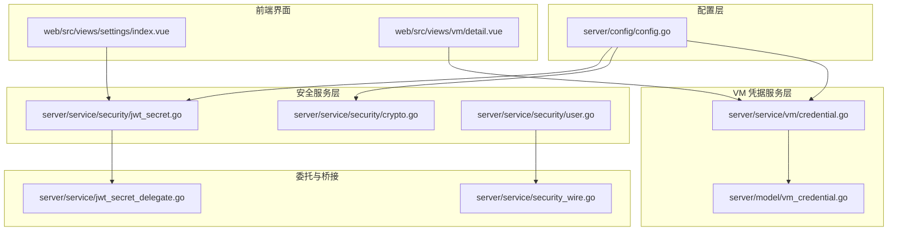
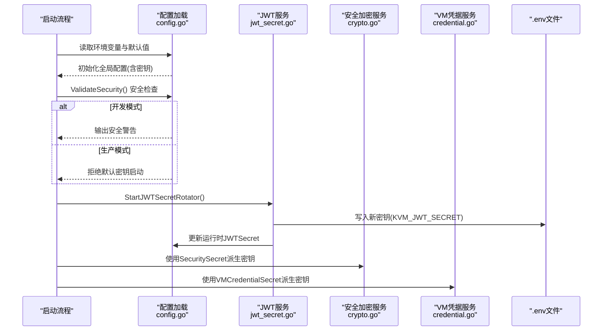
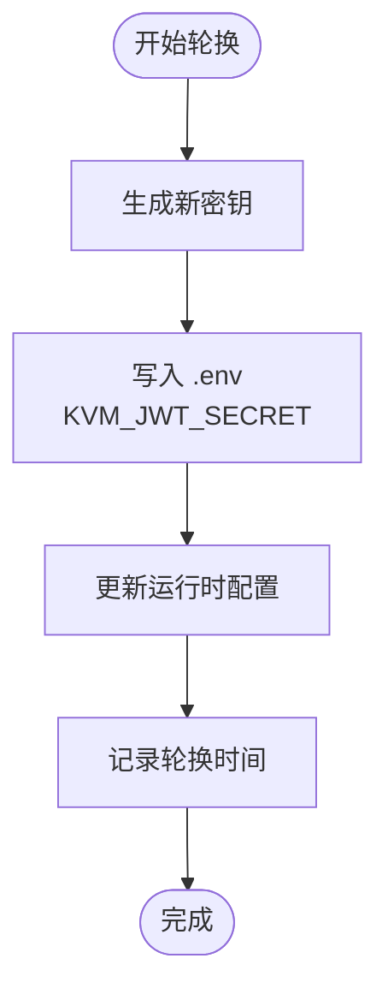
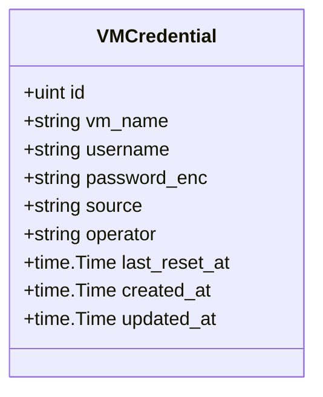
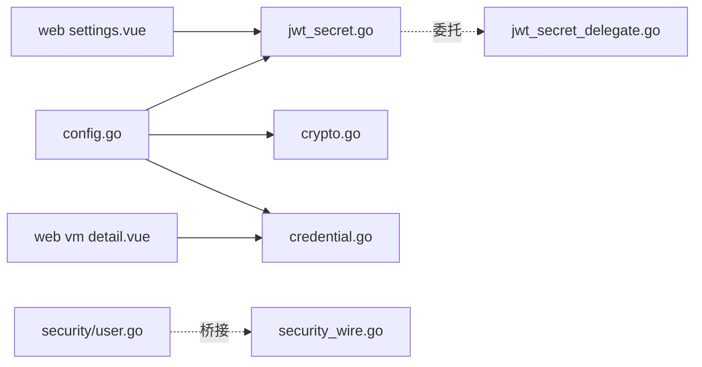

# 安全配置

<cite>
**本文引用的文件**
- [config.go](file://server/config/config.go)
- [jwt_secret.go](file://server/service/security/jwt_secret.go)
- [credential.go](file://server/service/vm/credential.go)
- [crypto.go](file://server/service/security/crypto.go)
- [vm_credential.go](file://server/model/vm_credential.go)
- [user.go](file://server/service/security/user.go)
- [index.vue](file://web/src/views/settings/index.vue)
- [detail.vue](file://web/src/views/vm/detail.vue)
- [jwt_secret_delegate.go](file://server/service/jwt_secret_delegate.go)
- [security_wire.go](file://server/service/security_wire.go)
</cite>

## 目录
1. [简介](#简介)
2. [项目结构](#项目结构)
3. [核心组件](#核心组件)
4. [架构总览](#架构总览)
5. [详细组件分析](#详细组件分析)
6. [依赖分析](#依赖分析)
7. [性能考量](#性能考量)
8. [故障排查指南](#故障排查指南)
9. [结论](#结论)
10. [附录](#附录)

## 简介
本文件聚焦 Open 虚拟机管理控制台的安全配置，围绕三类密钥与安全机制展开：JWT 签名密钥、虚拟机凭据加密密钥、账户安全加密密钥。内容涵盖安全要求与最佳实践、默认密钥检测与开发模式安全警告、强密码生成方法、密钥轮换策略、验证步骤、故障排查、开发与生产模式差异以及审计与合规检查方法。

## 项目结构
与安全配置直接相关的代码主要分布在以下模块：
- 配置层：集中定义与加载密钥、轮换参数、开发模式开关等
- 安全服务层：负责密钥轮换、加密/解密、安全状态构建与验证
- VM 凭据服务层：负责虚拟机登录凭据的加密封存与检索
- 前端界面：提供密钥轮换与密码生成的交互入口

**图表来源**
- [config.go:157-249](file://server/config/config.go#L157-L249)
- [jwt_secret.go:1-131](file://server/service/security/jwt_secret.go#L1-L131)
- [crypto.go:1-73](file://server/service/security/crypto.go#L1-L73)
- [credential.go:1-177](file://server/service/vm/credential.go#L1-L177)
- [vm_credential.go:1-21](file://server/model/vm_credential.go#L1-L21)
- [user.go:1-72](file://server/service/security/user.go#L1-L72)
- [index.vue:796-822](file://web/src/views/settings/index.vue#L796-L822)
- [detail.vue:1081-1097](file://web/src/views/vm/detail.vue#L1081-L1097)
- [jwt_secret_delegate.go:1-22](file://server/service/jwt_secret_delegate.go#L1-L22)
- [security_wire.go:65-72](file://server/service/security_wire.go#L65-L72)

**章节来源**
- [config.go:157-249](file://server/config/config.go#L157-L249)
- [jwt_secret.go:1-131](file://server/service/security/jwt_secret.go#L1-L131)
- [crypto.go:1-73](file://server/service/security/crypto.go#L1-L73)
- [credential.go:1-177](file://server/service/vm/credential.go#L1-L177)
- [vm_credential.go:1-21](file://server/model/vm_credential.go#L1-L21)
- [user.go:1-72](file://server/service/security/user.go#L1-L72)
- [index.vue:796-822](file://web/src/views/settings/index.vue#L796-L822)
- [detail.vue:1081-1097](file://web/src/views/vm/detail.vue#L1081-L1097)
- [jwt_secret_delegate.go:1-22](file://server/service/jwt_secret_delegate.go#L1-L22)
- [security_wire.go:65-72](file://server/service/security_wire.go#L65-L72)

## 核心组件
- JWT 密钥与轮换
  - 生成随机强密钥、写入 .env、运行时生效、持久化轮换时间
  - 定时轮换协程，受开发模式与默认密钥保护
- 虚拟机凭据加密密钥
  - 基于 SHA-256 的固定长度密钥派生，AES-GCM 加密封存
  - 支持保存、读取、删除凭据
- 账户安全加密密钥
  - 用于加密 TOTP 密钥、恢复码等敏感文本
  - AES-GCM 加密/解密流程与密钥派生
- 安全检查与状态
  - 启动时默认密钥检测与开发模式警告
  - 安全状态构建与验证逻辑
- 前端交互
  - 密钥轮换按钮与提示
  - 强密码生成器

**章节来源**
- [jwt_secret.go:23-55](file://server/service/security/jwt_secret.go#L23-L55)
- [jwt_secret.go:94-131](file://server/service/security/jwt_secret.go#L94-L131)
- [credential.go:119-177](file://server/service/vm/credential.go#L119-L177)
- [crypto.go:15-73](file://server/service/security/crypto.go#L15-L73)
- [config.go:251-283](file://server/config/config.go#L251-L283)
- [user.go:31-72](file://server/service/security/user.go#L31-L72)
- [index.vue:796-822](file://web/src/views/settings/index.vue#L796-L822)
- [detail.vue:1081-1097](file://web/src/views/vm/detail.vue#L1081-L1097)

## 架构总览
JWT 密钥与两类加密密钥的加载、校验与使用流程如下：

**图表来源**
- [config.go:157-249](file://server/config/config.go#L157-L249)
- [config.go:251-283](file://server/config/config.go#L251-L283)
- [jwt_secret.go:94-131](file://server/service/security/jwt_secret.go#L94-L131)
- [crypto.go:69-72](file://server/service/security/crypto.go#L69-L72)
- [credential.go:173-177](file://server/service/vm/credential.go#L173-L177)

## 详细组件分析

### JWT 密钥与轮换
- 密钥生成
  - 使用加密安全的随机源生成固定长度字节，经 URL 安全 Base64 编码
- 轮换流程
  - 生成新密钥 -> 写入 .env 文件(KVM_JWT_SECRET) -> 更新运行时配置 -> 记录轮换时间
- 自动轮换
  - 受轮换间隔配置控制；开发模式跳过；默认密钥保护；协程按间隔休眠触发
- 前端交互
  - 提供“立即轮换”按钮与轮换间隔设置；开发模式禁用轮换

**图表来源**
- [jwt_secret.go:32-55](file://server/service/security/jwt_secret.go#L32-L55)
- [jwt_secret.go:57-92](file://server/service/security/jwt_secret.go#L57-L92)
- [jwt_secret.go:94-131](file://server/service/security/jwt_secret.go#L94-L131)
- [index.vue:796-822](file://web/src/views/settings/index.vue#L796-L822)

**章节来源**
- [jwt_secret.go:23-55](file://server/service/security/jwt_secret.go#L23-L55)
- [jwt_secret.go:57-92](file://server/service/security/jwt_secret.go#L57-L92)
- [jwt_secret.go:94-131](file://server/service/security/jwt_secret.go#L94-L131)
- [index.vue:796-822](file://web/src/views/settings/index.vue#L796-L822)

### 虚拟机凭据加密
- 密钥派生
  - 使用 SHA-256 对配置中的凭据密钥进行哈希，取固定长度字节作为 AES 密钥
- 加密/解密
  - 使用 AES-GCM，随机 Nonce，密文包含 Nonce 前缀
- 数据模型
  - 存储 VM 名称、用户名、加密后的密码、来源、操作者、更新时间等

**图表来源**
- [vm_credential.go:5-21](file://server/model/vm_credential.go#L5-L21)

**章节来源**
- [credential.go:119-177](file://server/service/vm/credential.go#L119-L177)
- [credential.go:173-177](file://server/service/vm/credential.go#L173-L177)
- [vm_credential.go:1-21](file://server/model/vm_credential.go#L1-L21)

### 账户安全加密
- 用途
  - 加密 TOTP 密钥、恢复码等敏感文本
- 实现
  - AES-GCM 加密/解密，密钥由 SHA-256 派生自配置中的安全密钥

**章节来源**
- [crypto.go:15-73](file://server/service/security/crypto.go#L15-L73)

### 安全检查与状态
- 默认密钥检测
  - 生产模式拒绝默认密钥启动；开发模式仅输出安全警告
- 安全状态
  - 构建前端展示的安全状态，包含邮箱绑定、2FA、登录验证窗口、高风险验证等
- 开发模式影响
  - 安全验证可被禁用，部分风险控制逻辑被跳过

**章节来源**
- [config.go:251-283](file://server/config/config.go#L251-L283)
- [user.go:31-72](file://server/service/security/user.go#L31-L72)

### 强密码生成与密钥轮换
- 强密码生成
  - 前端实现：确保至少包含大写字母、小写字母、数字、特殊字符各一项，长度满足要求，字符集排除易混淆字符
- 密钥轮换
  - 后端支持手动轮换与定时轮换；开发模式禁用自动轮换与手动轮换

**章节来源**
- [detail.vue:1081-1097](file://web/src/views/vm/detail.vue#L1081-L1097)
- [index.vue:796-822](file://web/src/views/settings/index.vue#L796-L822)
- [jwt_secret.go:94-131](file://server/service/security/jwt_secret.go#L94-L131)

## 依赖分析
- 配置依赖
  - 全局配置集中定义密钥、轮换间隔、开发模式等
- 服务依赖
  - JWT 轮换依赖配置与 .env 文件；VM 凭据与账户加密依赖配置中的密钥
- 前端依赖
  - 设置页面提供轮换与提示；VM 详情页提供强密码生成

**图表来源**
- [config.go:157-249](file://server/config/config.go#L157-L249)
- [jwt_secret.go:1-131](file://server/service/security/jwt_secret.go#L1-L131)
- [crypto.go:1-73](file://server/service/security/crypto.go#L1-L73)
- [credential.go:1-177](file://server/service/vm/credential.go#L1-L177)
- [jwt_secret_delegate.go:1-22](file://server/service/jwt_secret_delegate.go#L1-L22)
- [user.go:1-72](file://server/service/security/user.go#L1-L72)
- [security_wire.go:65-72](file://server/service/security_wire.go#L65-L72)
- [index.vue:796-822](file://web/src/views/settings/index.vue#L796-L822)
- [detail.vue:1081-1097](file://web/src/views/vm/detail.vue#L1081-L1097)

**章节来源**
- [config.go:157-249](file://server/config/config.go#L157-L249)
- [jwt_secret.go:1-131](file://server/service/security/jwt_secret.go#L1-L131)
- [crypto.go:1-73](file://server/service/security/crypto.go#L1-L73)
- [credential.go:1-177](file://server/service/vm/credential.go#L1-L177)
- [jwt_secret_delegate.go:1-22](file://server/service/jwt_secret_delegate.go#L1-L22)
- [user.go:1-72](file://server/service/security/user.go#L1-L72)
- [security_wire.go:65-72](file://server/service/security_wire.go#L65-L72)
- [index.vue:796-822](file://web/src/views/settings/index.vue#L796-L822)
- [detail.vue:1081-1097](file://web/src/views/vm/detail.vue#L1081-L1097)

## 性能考量
- 密钥轮换
  - AES-GCM 加密开销极低；轮换频率建议结合业务风险与运维成本权衡
- 加密密钥派生
  - SHA-256 派生一次性完成，对性能影响可忽略
- 开发模式
  - 安全验证跳过可减少请求链路开销，但会降低安全性

## 故障排查指南
- 启动被拒绝（默认 JWT 密钥）
  - 现象：生产模式启动时报错并退出
  - 处理：设置 KVM_JWT_SECRET 为强随机密钥；或在测试环境设置开发模式
  - 参考
    - [config.go:262-282](file://server/config/config.go#L262-L282)
- 开发模式安全警告
  - 现象：启动日志出现安全警告
  - 处理：生产环境务必替换默认密钥
  - 参考
    - [config.go:262-271](file://server/config/config.go#L262-L271)
- 密钥轮换失败
  - 现象：轮换协程告警或手动轮换报错
  - 处理：检查 .env 文件权限与路径、磁盘空间、运行时配置一致性
  - 参考
    - [jwt_secret.go:40-54](file://server/service/security/jwt_secret.go#L40-L54)
    - [jwt_secret.go:115-129](file://server/service/security/jwt_secret.go#L115-L129)
- VM 凭据解密失败
  - 现象：读取凭据时报解密错误
  - 处理：确认凭据密钥未变更；检查数据完整性
  - 参考
    - [credential.go:141-171](file://server/service/vm/credential.go#L141-L171)
- 账户加密文本异常
  - 现象：解密 TOTP 密钥或恢复码失败
  - 处理：确认安全密钥未变更；检查密文格式
  - 参考
    - [crypto.go:37-67](file://server/service/security/crypto.go#L37-L67)

**章节来源**
- [config.go:262-282](file://server/config/config.go#L262-L282)
- [jwt_secret.go:40-54](file://server/service/security/jwt_secret.go#L40-L54)
- [jwt_secret.go:115-129](file://server/service/security/jwt_secret.go#L115-L129)
- [credential.go:141-171](file://server/service/vm/credential.go#L141-L171)
- [crypto.go:37-67](file://server/service/security/crypto.go#L37-L67)

## 结论
本项目通过严格的密钥管理与安全检查机制保障系统安全：默认密钥检测与开发模式警告、独立密钥派生、AES-GCM 加密、定时与手动密钥轮换。建议在生产环境严格遵循密钥安全最佳实践，定期轮换密钥并进行安全审计与合规检查。

## 附录

### 安全要求与最佳实践
- JWT 密钥
  - 必须为强随机字符串；长度满足加密算法要求；生产环境禁止使用默认密钥
- 虚拟机凭据加密密钥
  - 与 JWT 密钥分离；独立轮换；妥善保管
- 账户安全加密密钥
  - 与 JWT 密钥分离；独立轮换；仅用于加密敏感文本
- 开发与生产模式
  - 开发模式禁用多项安全验证；仅用于测试；生产环境必须开启完整安全校验

**章节来源**
- [config.go:251-283](file://server/config/config.go#L251-L283)
- [credential.go:173-177](file://server/service/vm/credential.go#L173-L177)
- [crypto.go:69-72](file://server/service/security/crypto.go#L69-L72)
- [user.go:31-34](file://server/service/security/user.go#L31-L34)

### 密钥轮换策略
- 自动轮换
  - 配置轮换间隔；开发模式跳过；默认密钥保护
- 手动轮换
  - 前端提供按钮；开发模式禁用；轮换后旧 Token 失效
- 强密码生成
  - 前端实现强密码生成器，确保复杂度与可读性

**章节来源**
- [jwt_secret.go:94-131](file://server/service/security/jwt_secret.go#L94-L131)
- [index.vue:796-822](file://web/src/views/settings/index.vue#L796-L822)
- [detail.vue:1081-1097](file://web/src/views/vm/detail.vue#L1081-L1097)

### 安全配置验证步骤
- 启动验证
  - 检查是否使用默认密钥；开发模式是否符合预期
- 密钥轮换验证
  - 执行手动轮换；检查 .env 与运行时配置一致性；验证旧 Token 失效
- 凭据与加密验证
  - 保存/读取 VM 凭据；加密/解密账户敏感文本；检查密文格式

**章节来源**
- [config.go:251-283](file://server/config/config.go#L251-L283)
- [jwt_secret.go:32-55](file://server/service/security/jwt_secret.go#L32-L55)
- [credential.go:28-108](file://server/service/vm/credential.go#L28-L108)
- [crypto.go:15-67](file://server/service/security/crypto.go#L15-L67)

### 审计与合规检查方法
- 密钥管理
  - 检查密钥是否独立配置；轮换记录是否完整；默认密钥是否已被替换
- 配置合规
  - 开发模式仅在测试环境启用；生产环境必须开启安全验证
- 日志与监控
  - 关注密钥轮换与安全警告日志；建立告警机制

**章节来源**
- [config.go:251-283](file://server/config/config.go#L251-L283)
- [jwt_secret.go:94-131](file://server/service/security/jwt_secret.go#L94-L131)
- [user.go:31-72](file://server/service/security/user.go#L31-L72)