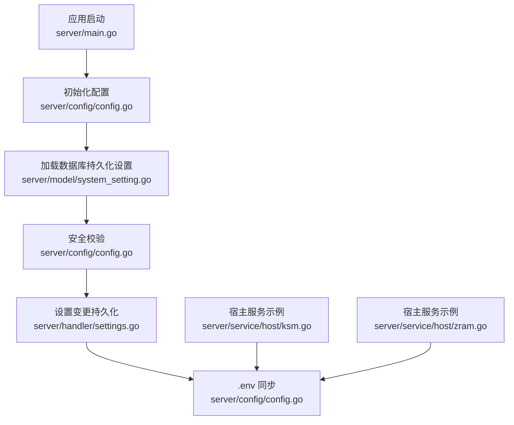
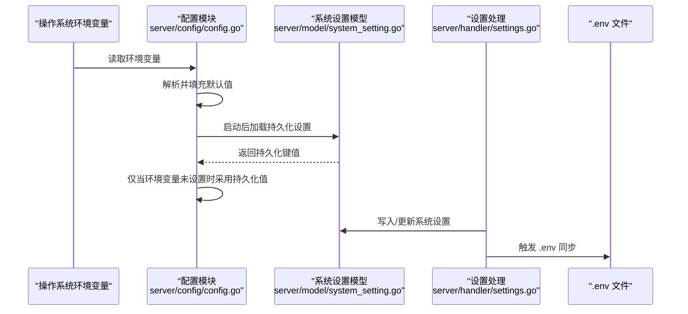
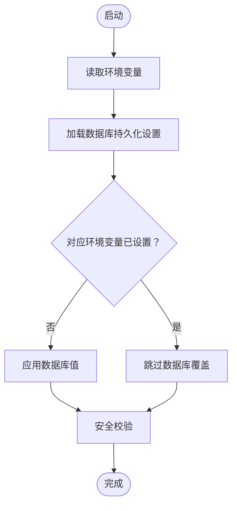
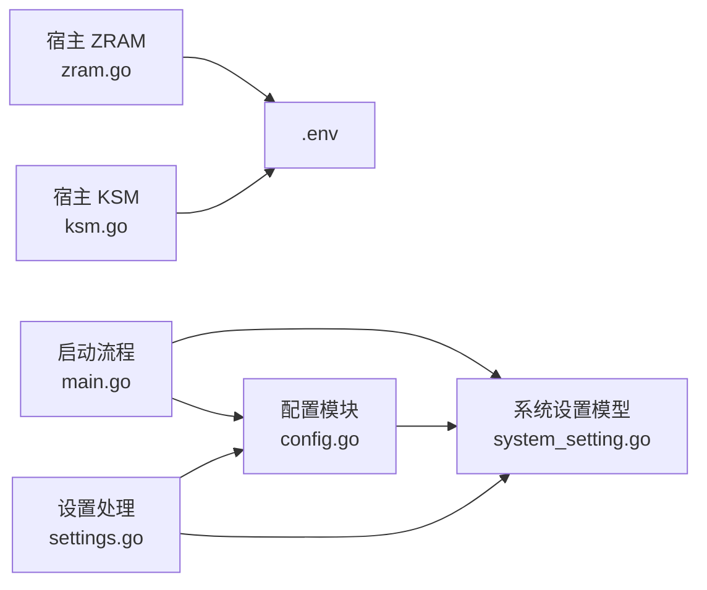

# 环境变量配置

<cite>
**本文引用的文件**
- [server/config/config.go](file://server/config/config.go)
- [server/main.go](file://server/main.go)
- [server/model/system_setting.go](file://server/model/system_setting.go)
- [server/handler/settings.go](file://server/handler/settings.go)
- [server/service/host/ksm.go](file://server/service/host/ksm.go)
- [server/service/host/zram.go](file://server/service/host/zram.go)
</cite>

## 目录
1. [简介](#简介)
2. [项目结构](#项目结构)
3. [核心组件](#核心组件)
4. [架构总览](#架构总览)
5. [详细组件分析](#详细组件分析)
6. [依赖分析](#依赖分析)
7. [性能考量](#性能考量)
8. [故障排查指南](#故障排查指南)
9. [结论](#结论)
10. [附录](#附录)

## 简介
本文件面向 Open 虚拟机管理控制台的运维与开发人员，系统性梳理“环境变量配置”的设计与实现，涵盖：
- 完整环境变量清单及其与内部配置项的映射关系
- 每个变量的作用、数据类型、默认值与取值范围
- 优先级与覆盖机制（环境变量 > 数据库持久化 > 默认值）
- 不同部署场景下的配置示例（开发、测试、生产）
- 环境变量文件格式与同步机制
- 配置验证方法与常见问题排查

## 项目结构
围绕环境变量配置的关键文件与职责如下：
- server/config/config.go：定义全局配置结构体、初始化流程、环境变量解析、持久化键集合、映射表、以及 .env 同步逻辑
- server/main.go：应用启动顺序，先初始化配置，再从数据库加载持久化设置，最后进行安全校验
- server/model/system_setting.go：系统设置的键值持久化模型
- server/handler/settings.go：设置变更的持久化入口，并触发 .env 同步
- server/service/host/ksm.go、server/service/host/zram.go：额外的宿主环境变量文件示例（EnvironmentFile）

图表来源
- [server/main.go:51-93](file://server/main.go#L51-L93)
- [server/config/config.go:157-249](file://server/config/config.go#L157-L249)
- [server/model/system_setting.go:1-45](file://server/model/system_setting.go#L1-L45)
- [server/handler/settings.go:681-696](file://server/handler/settings.go#L681-L696)
- [server/service/host/ksm.go:20](file://server/service/host/ksm.go#L20)
- [server/service/host/zram.go:29](file://server/service/host/zram.go#L29)

章节来源
- [server/config/config.go:157-249](file://server/config/config.go#L157-L249)
- [server/main.go:51-93](file://server/main.go#L51-L93)

## 核心组件
- 配置结构体与初始化
  - 全局配置结构体集中定义了所有可由环境变量驱动的参数
  - 初始化函数按“环境变量 > 默认值”的策略填充配置
- 持久化与覆盖
  - 应用启动后从数据库加载持久化设置，但仅当对应环境变量未设置时生效
  - 该机制确保“环境变量优先”，同时允许通过 Web 界面调整并持久化
- 安全校验
  - 对默认 JWT 密钥进行严格校验，开发模式下仅警告，生产模式下直接拒绝启动
- .env 同步
  - 将数据库中已持久化的配置项写回 .env 文件，保证重启后与数据库状态一致

章节来源
- [server/config/config.go:19-152](file://server/config/config.go#L19-L152)
- [server/config/config.go:157-249](file://server/config/config.go#L157-L249)
- [server/config/config.go:458-677](file://server/config/config.go#L458-L677)
- [server/config/config.go:751-800](file://server/config/config.go#L751-L800)
- [server/main.go:58-80](file://server/main.go#L58-L80)

## 架构总览
环境变量配置的生命周期与交互如下：

图表来源
- [server/config/config.go:157-249](file://server/config/config.go#L157-L249)
- [server/config/config.go:458-677](file://server/config/config.go#L458-L677)
- [server/model/system_setting.go:19-45](file://server/model/system_setting.go#L19-L45)
- [server/handler/settings.go:681-696](file://server/handler/settings.go#L681-L696)
- [server/config/config.go:751-800](file://server/config/config.go#L751-L800)

## 详细组件分析

### 配置项与环境变量映射总览
以下表格汇总了全部环境变量与其对应的内部配置项、数据类型、默认值与取值范围/约束。

- 通用参数
  - KVM_PORT：端口；整数；默认 8080；范围 1–65535
  - KVM_DB_PATH：数据库文件路径；字符串；默认 ./data/kvm_console.db
  - KVM_ENV_FILE：.env 文件路径；字符串；默认 /opt/kvm-console/.env
  - KVM_DEVELOPMENT_MODE：开发模式开关；布尔；默认 false
  - KVM_USE_GO_LIBVIRT：是否使用 go-libvirt RPC；布尔；默认 true

- 安全与鉴权
  - KVM_JWT_SECRET：JWT 密钥；字符串；默认 kvm-console-secret-key-change-me（生产禁止使用默认值）
  - KVM_JWT_EXPIRE_HOURS：JWT 过期间（小时）；整数；默认 24；≥1
  - KVM_JWT_SECRET_ROTATE_HOURS：JWT 密钥轮换间隔（小时，0=禁用）；整数；默认 24；≥0
  - KVM_VM_CREDENTIAL_SECRET：虚拟机凭据加密密钥；字符串；默认为空（若为空则回退使用 JWT 密钥）
  - KVM_SECURITY_SECRET：账户安全加密密钥；字符串；默认为空（若为空则回退使用 JWT 密钥）

- 模板与镜像
  - KVM_TEMPLATE_DIR：模板根目录；字符串；默认 /var/lib/libvirt/images/templates
  - KVM_TEMPLATE_IMPORT_DIR：模板导入目录；字符串；默认 ${KVM_TEMPLATE_DIR}/_imports
  - KVM_TEMPLATE_EXPORT_DIR：模板导出目录；字符串；默认 ${KVM_TEMPLATE_DIR}/_exports
  - KVM_CLONE_DIR：克隆磁盘目录；字符串；默认 /var/lib/libvirt/images
  - KVM_ISO_DIR：ISO 目录；字符串；默认 /var/lib/libvirt/images/ISO

- 网络与 OVS
  - KVM_DEFAULT_NETWORK：默认网络名称；字符串；默认 default
  - KVM_NETWORK_BACKEND：网络后端；字符串；默认 ovs
  - KVM_OVS_BRIDGE：OVS 网桥名称；字符串；默认 br-ovs
  - KVM_OVS_UPLINK：OVS 上行出口网卡；字符串；默认空（自动检测）
  - KVM_OVS_DHCP_START/KVM_OVS_DHCP_END：DHCP 地址池起止；字符串；默认空
  - KVM_SUBNET_PREFIX：子网前缀；字符串；默认 192.168.122
  - KVM_AUTO_PORT_START/KVM_AUTO_PORT_END：自动端口分配范围；整数；默认 10000/20000；要求 end ≥ start
  - KVM_HOST_IP：宿主机外网 IP（端口转发用）；字符串；默认空（自动检测）
  - KVM_EXTERNAL_NIC：外网网卡名称；字符串；默认空（自动检测）
  - KVM_MAX_BURST_INBOUND/KVM_MAX_BURST_OUTBOUND：全局限速（Mbps）；整数；默认 0（不限制）；≥0
  - KVM_VPC_SUBNET_PREFIX：VPC 子网前缀；字符串；默认 10.200
  - KVM_VPC_VLAN_START/KVM_VPC_VLAN_END：VPC VLAN 范围；整数；默认 100/4094；要求 end ≥ start
  - KVM_VPC_DNS：VPC DNS；字符串；默认 223.5.5.5,223.6.6.6
  - KVM_VPC_ACL_TABLE：VPC ACL 表名；字符串；默认 kvm_console_vpc_acl

- 端口转发与探测
  - KVM_PORTFORWARD_DIR：端口转发持久化目录；字符串；默认 /etc/kvm-portforward
  - KVM_PORT_FORWARD_HTTP_PROBE_ENABLED：HTTP 探测开关；布尔；默认 true
  - KVM_PORT_FORWARD_HTTP_PROBE_INTERVAL_MINUTES：探测周期（分钟）；整数；默认 60；≥1
  - KVM_PORT_FORWARD_HTTP_PROBE_TIMEOUT_SECONDS：探测超时（秒）；整数；默认 3；≥1

- 抓包与诊断
  - KVM_NETWORK_CAPTURE_DIR：抓包目录；字符串；默认 /var/lib/kvm-console/captures
  - KVM_NETWORK_CAPTURE_DEFAULT_SECONDS/MAX_SECONDS/MAX_MB/MAX_PACKETS：抓包时长/大小/包数限制；整数；默认 30/120/64/5000；均 ≥0

- 动态内存调度
  - KVM_DYNAMIC_MEMORY_SCHEDULER_ENABLED：开关；布尔；默认 true
  - KVM_DYNAMIC_MEMORY_INTERVAL_SECONDS：调度间隔；整数；默认 30；≥1
  - KVM_DYNAMIC_MEMORY_HOST_RESERVE_MB/PERCENT：主机保留内存；整数；默认 2048/20；均 ≥0
  - KVM_DYNAMIC_MEMORY_INCREASE_THRESHOLD_PERCENT：提升阈值；整数；默认 15；0–100
  - KVM_DYNAMIC_MEMORY_RECLAIM_THRESHOLD_PERCENT：回收阈值；整数；默认 35；0–100
  - KVM_DYNAMIC_MEMORY_COOLDOWN_SECONDS：冷却时间；整数；默认 120；≥0
  - KVM_DYNAMIC_MEMORY_OBSERVATION_HOURS：观察窗口；整数；默认 24；≥0
  - KVM_SCHEDULER_EVENT_RETENTION_HOURS：调度事件保留；整数；默认 168；≥0

- 磁盘 IOPS 限制
  - KVM_DEFAULT_DISK_IOPS_TOTAL/READ/WRITE：默认 IOPS 总/读/写限制；整数；默认 0（不限制）；≥0

- 批量克隆并发
  - KVM_BATCH_CLONE_MAX_CONCURRENCY：批量克隆最大并发；整数；默认 10；≥1

- 日志
  - KVM_LOG_DIR：日志目录；字符串；默认 ./log
  - KVM_LOG_LEVEL：日志级别；字符串；默认 info
  - KVM_LOG_MAX_DAYS：日志保留天数；整数；默认 7；≥0
  - KVM_LOG_COMPRESS：日志压缩；布尔；默认 true
  - KVM_LOG_CONSOLE：控制台输出；布尔；默认 true
  - KVM_LOG_CONSOLE_TYPES：控制台输出类型（逗号分隔）；字符串；默认 app,cmd,libvirt
  - KVM_LOG_CONSOLE_LEVEL：控制台输出级别；字符串；默认空（继承文件级别）
  - KVM_LOG_MAX_SIZE_MB：单文件最大大小（MB）；整数；默认 100；≥0
  - KVM_LOG_MAX_BACKUPS：最大归档备份数；整数；默认 0（不限制）；≥0

- SMTP
  - KVM_SMTP_HOST：SMTP 主机；字符串；默认空
  - KVM_SMTP_PORT：SMTP 端口；整数；默认 587；≥1
  - KVM_SMTP_USERNAME：用户名；字符串；默认空
  - KVM_SMTP_PASSWORD_ENC：加密密码；字符串；默认空
  - KVM_SMTP_FROM_NAME：发件人名称；字符串；默认 QVMConsole
  - KVM_SMTP_FROM_ADDRESS：发件人邮箱；字符串；默认空
  - KVM_SMTP_SECURITY：安全协议；字符串；默认 starttls
  - KVM_SMTP_TIMEOUT_SECONDS：超时（秒）；整数；默认 15；≥1

- 管理员与站点
  - KVM_ADMIN_USER：默认管理员用户名；字符串；默认 admin
  - KVM_ADMIN_PASS：默认管理员密码；字符串；默认 admin123
  - KVM_SITE_TITLE：网站标题；字符串；默认 QVMConsole
  - KVM_PUBLIC_BASE_URL：面板对外访问地址；字符串；默认空
  - KVM_RESCUE_ISO：救援系统 ISO 路径；字符串；默认空

- 维护模式
  - KVM_MAINTENANCE_MODE：维护模式开关；布尔；默认 false
  - KVM_MAINTENANCE_SERVICE_UNITS：需要停用的服务单元（逗号/换行分隔）；字符串；默认多个 systemd 单元
  - KVM_MAINTENANCE_VM_SHUTDOWN_TIMEOUT_SECONDS：优雅关机等待时间（秒）；整数；默认 40；≥0

- 网络等待在线检测
  - KVM_NETWORK_WAIT_ONLINE_DISABLED：禁用网络等待就绪检测；布尔；默认 false

章节来源
- [server/config/config.go:19-152](file://server/config/config.go#L19-L152)
- [server/config/config.go:157-249](file://server/config/config.go#L157-L249)
- [server/config/config.go:388-456](file://server/config/config.go#L388-L456)

### 优先级与覆盖机制
- 优先级顺序：环境变量 > 数据库持久化 > 默认值
- 加载顺序：
  1) 初始化阶段读取环境变量并填充默认值
  2) 启动后从数据库加载持久化设置
  3) 若某配置项已在环境变量中设置，则跳过数据库覆盖
  4) 安全校验在数据库设置加载完成后执行，防止默认密钥上线

图表来源
- [server/config/config.go:458-471](file://server/config/config.go#L458-L471)
- [server/main.go:61-80](file://server/main.go#L61-L80)

章节来源
- [server/config/config.go:458-471](file://server/config/config.go#L458-L471)
- [server/main.go:61-80](file://server/main.go#L61-L80)

### 环境变量文件格式与同步机制
- 文件格式
  - .env 文件为键值对形式，每行一个条目，格式为 KEY=VALUE
  - 支持 UTF-8-BOM 的去除处理
- 同步策略
  - 仅同步数据库中已持久化的键（PersistableKeys）
  - 写入权限为 0600，避免非所有者读取
  - 同步由设置保存流程触发，确保重启后环境变量与数据库一致

章节来源
- [server/config/config.go:751-800](file://server/config/config.go#L751-L800)
- [server/handler/settings.go:692-696](file://server/handler/settings.go#L692-L696)

### 不同部署场景下的配置示例
- 开发环境
  - 允许使用默认 JWT 密钥（通过 KVM_DEVELOPMENT_MODE=true）
  - 示例要点：KVM_DEVELOPMENT_MODE=true、KVM_PORT=8080、KVM_DB_PATH=./data/dev.db
- 测试环境
  - 关闭默认密钥，使用随机密钥；开启必要的网络与日志配置
  - 示例要点：KVM_JWT_SECRET=<随机强密钥>、KVM_LOG_LEVEL=debug、KVM_NETWORK_BACKEND=ovs
- 生产环境
  - 必须设置独立且强随机的 KVM_JWT_SECRET；禁用默认密钥
  - 示例要点：KVM_JWT_SECRET=<随机强密钥>、KVM_DEVELOPMENT_MODE=false、KVM_LOG_COMPRESS=true、KVM_MAX_BURST_INBOUND/NOUTBOUND=合理带宽上限

章节来源
- [server/config/config.go:251-283](file://server/config/config.go#L251-L283)
- [server/config/config.go:157-249](file://server/config/config.go#L157-L249)

## 依赖分析
- 组件耦合
  - 配置模块与数据库模型紧密耦合，通过系统设置表实现持久化
  - 设置处理模块负责写入数据库并触发 .env 同步
  - 启动流程严格控制加载顺序，避免覆盖与安全风险
- 外部集成
  - 宿主服务示例展示了 systemd EnvironmentFile 的使用方式，体现与 .env 的互补关系

图表来源
- [server/config/config.go:458-677](file://server/config/config.go#L458-L677)
- [server/model/system_setting.go:19-45](file://server/model/system_setting.go#L19-L45)
- [server/handler/settings.go:681-696](file://server/handler/settings.go#L681-L696)
- [server/main.go:58-80](file://server/main.go#L58-L80)
- [server/service/host/ksm.go:20](file://server/service/host/ksm.go#L20)
- [server/service/host/zram.go:29](file://server/service/host/zram.go#L29)

章节来源
- [server/config/config.go:458-677](file://server/config/config.go#L458-L677)
- [server/model/system_setting.go:19-45](file://server/model/system_setting.go#L19-L45)
- [server/handler/settings.go:681-696](file://server/handler/settings.go#L681-L696)
- [server/main.go:58-80](file://server/main.go#L58-L80)
- [server/service/host/ksm.go:20](file://server/service/host/ksm.go#L20)
- [server/service/host/zram.go:29](file://server/service/host/zram.go#L29)

## 性能考量
- 环境变量解析为常量时间操作，对启动时间影响极小
- 数据库持久化设置仅在启动时加载一次，后续通过内存配置对象访问
- 日志与网络抓包的大小/时长限制可有效控制资源占用
- 动态内存调度与带宽限制参数可根据实际负载调优

## 故障排查指南
- 启动被拒绝（默认 JWT 密钥）
  - 现象：生产模式下启动失败并提示使用默认密钥
  - 处理：设置 KVM_JWT_SECRET 为强随机密钥；或在开发模式下设置 KVM_DEVELOPMENT_MODE=true
  - 参考：安全校验逻辑
- 环境变量未生效
  - 现象：Web 界面修改后重启配置未更新
  - 处理：确认 .env 文件路径与权限；检查设置保存流程是否触发 .env 同步
- 端口冲突或网络异常
  - 现象：服务端口不可用或 OVS 网络不通
  - 处理：核对 KVM_PORT、KVM_SUBNET_PREFIX、KVM_AUTO_PORT_START/END、KVM_OVS_* 参数；确保网卡与路由正确
- 日志过大或磁盘不足
  - 现象：日志文件增长过快
  - 处理：调整 KVM_LOG_MAX_SIZE_MB、KVM_LOG_MAX_BACKUPS、KVM_LOG_MAX_DAYS；清理历史日志
- 密钥轮换导致会话失效
  - 现象：轮换 JWT 密钥后用户需重新登录
  - 处理：通过设置页面或接口进行轮换；注意生产模式下禁止手动轮换（除非满足条件）

章节来源
- [server/config/config.go:251-283](file://server/config/config.go#L251-L283)
- [server/config/config.go:751-800](file://server/config/config.go#L751-L800)
- [server/handler/settings.go:656-679](file://server/handler/settings.go#L656-L679)

## 结论
本项目的环境变量体系以“环境变量优先”为核心原则，结合数据库持久化与 .env 同步，实现了灵活、可控且可审计的配置管理。生产环境务必避免使用默认密钥，并根据实际网络与资源情况调优各项参数。

## 附录
- 验证方法
  - 启动日志查看：确认已加载数据库持久化设置与安全校验结果
  - .env 校验：确认关键键已写入且权限为 0600
  - 端到端测试：通过 Web 界面修改设置并重启验证生效
- 常用命令参考
  - 生成强随机密钥：openssl rand -base64 48
  - 查看日志：tail -f ./log/app.log（依据 KVM_LOG_DIR）