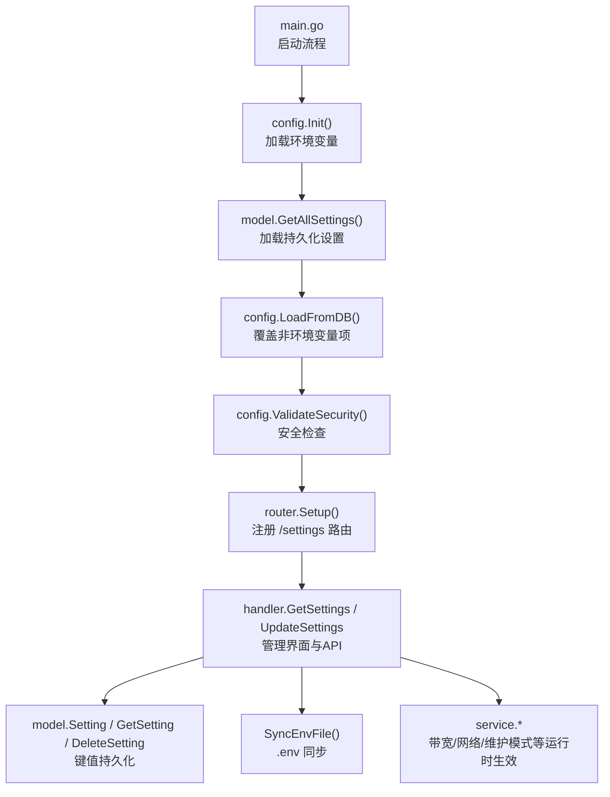
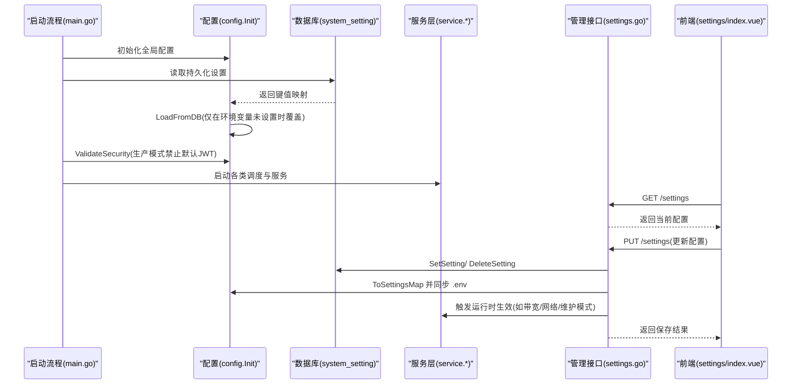
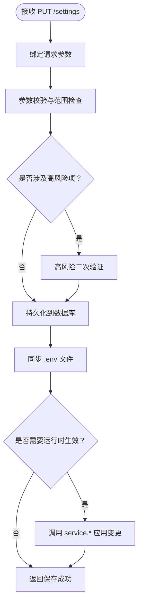
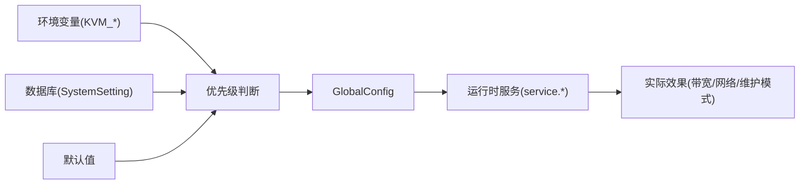

# 配置管理

<cite>
**本文引用的文件**
- [config.go](file://server/config/config.go)
- [system_setting.go](file://server/model/system_setting.go)
- [settings.go](file://server/handler/settings.go)
- [main.go](file://server/main.go)
- [router.go](file://server/router/router.go)
- [jwt_secret.go](file://server/service/security/jwt_secret.go)
- [restore.go](file://server/service/network/bridge/restore.go)
- [endpointDocs.js](file://web/src/views/api-docs/endpointDocs.js)
- [index.vue](file://web/src/views/settings/index.vue)
</cite>

## 目录
1. [简介](#简介)
2. [项目结构](#项目结构)
3. [核心组件](#核心组件)
4. [架构总览](#架构总览)
5. [详细组件分析](#详细组件分析)
6. [依赖分析](#依赖分析)
7. [性能考量](#性能考量)
8. [故障排除指南](#故障排除指南)
9. [结论](#结论)
10. [附录](#附录)

## 简介
本文件面向 Open 虚拟机管理控制台的“配置管理”主题，系统性阐述配置文件结构、环境变量映射、动态配置更新机制、配置验证与安全策略、配置迁移与备份恢复流程，以及系统设置的管理界面与 API 接口。目标是帮助运维与开发人员快速理解并正确使用配置体系，实现安全、稳定、可追溯的系统配置管理。

## 项目结构
配置管理涉及以下关键模块：
- 配置定义与加载：server/config/config.go
- 数据库存储：server/model/system_setting.go
- 管理接口与前端：server/handler/settings.go、web/src/views/settings/index.vue
- 路由与权限：server/router/router.go
- 安全与轮换：server/service/security/jwt_secret.go
- 网络桥接恢复脚本：server/service/network/bridge/restore.go
- API 文档：web/src/views/api-docs/endpointDocs.js
- 启动流程与优先级：server/main.go

图表来源
- [main.go:39-80](file://server/main.go#L39-L80)
- [config.go:157-249](file://server/config/config.go#L157-L249)
- [system_setting.go:29-45](file://server/model/system_setting.go#L29-L45)
- [router.go:88-101](file://server/router/router.go#L88-L101)
- [settings.go:181-257](file://server/handler/settings.go#L181-L257)

章节来源
- [main.go:39-128](file://server/main.go#L39-L128)
- [config.go:157-249](file://server/config/config.go#L157-L249)
- [router.go:88-101](file://server/router/router.go#L88-L101)

## 核心组件
- 配置结构体 Config：集中定义所有可配置项，涵盖服务端口、数据库路径、JWT 与凭据密钥、网络后端与 OVS 参数、带宽与端口转发、SMTP、动态内存调度、VPC 参数、网络抓包、IOPS 限制、批量克隆并发、go-libvirt 使用开关、日志配置、网络等待就绪检测等。
- 全局配置实例 GlobalConfig：单例持有当前生效配置。
- 环境变量映射：keyToEnvVar 提供配置项到环境变量的双向映射，支持通过环境变量覆盖默认值。
- 持久化键集合：PersistableKeys 定义可通过界面持久化的配置项清单。
- 数据库存储：SystemSetting 表以键值对形式持久化配置，支持查询、设置、删除与全量导出。
- 安全验证：ValidateSecurity 在数据库设置加载后进行安全检查，拒绝默认 JWT 密钥在生产模式下的使用。
- 运行时同步：LoadFromDB 与 ToSettingsMap 实现“环境变量 > 数据库 > 默认值”的优先级策略；SyncEnvFile 将数据库持久化的配置同步回 .env 文件。

章节来源
- [config.go:19-152](file://server/config/config.go#L19-L152)
- [config.go:318-456](file://server/config/config.go#L318-L456)
- [system_setting.go:3-8](file://server/model/system_setting.go#L3-L8)
- [config.go:458-749](file://server/config/config.go#L458-L749)
- [config.go:251-283](file://server/config/config.go#L251-L283)

## 架构总览
配置生命周期分为“启动加载—运行时更新—持久化—重启生效”四个阶段，遵循“环境变量优先”的原则，确保配置来源可控、可审计。

图表来源
- [main.go:39-128](file://server/main.go#L39-L128)
- [config.go:458-749](file://server/config/config.go#L458-L749)
- [settings.go:181-257](file://server/handler/settings.go#L181-L257)
- [index.vue:1593-1618](file://web/src/views/settings/index.vue#L1593-L1618)

## 详细组件分析

### 配置项分类与作用
- 服务与安全
  - 端口、JWT 密钥、JWT 过期与轮换、开发模式、服务单元名、维护模式及其服务单元列表、维护模式关机超时、VM 凭据与安全密钥回退策略。
- 存储与模板
  - 模板目录、导入/导出目录、克隆目录、ISO 目录、救援 ISO。
- 网络与虚拟化
  - 默认网络、网络后端(OVS 固定)、OVS 网桥、上联口、DHCP 起止、子网前缀、自动端口范围、端口转发持久化目录、VM 权限目录、go-libvirt 使用开关。
- VPC 与 ACL
  - VPC 子网前缀、VLAN 范围、DNS、ACL 表名。
- 带宽与端口转发
  - 全局限速上下行、端口转发 HTTP 探测开关与周期、超时。
- 动态内存调度
  - 开关、调度间隔、宿主机保留 MB 与百分比、增长/回收阈值、冷却时间、观察时长。
- 日志与诊断
  - 日志目录、级别、压缩、终端输出、大小与备份数、抓包目录与限额。
- 其他
  - 默认管理员账户、外网 IP 与出口 NIC、站点标题、公共访问地址、网络等待就绪检测开关。

章节来源
- [config.go:19-152](file://server/config/config.go#L19-L152)
- [config.go:157-249](file://server/config/config.go#L157-L249)

### 环境变量与配置映射
- 环境变量命名规范：KVM_ 前缀，驼峰转大写下划线，如 KVM_PORT、KVM_JWT_SECRET、KVM_OVS_BRIDGE 等。
- 映射关系：keyToEnvVar 提供配置项到环境变量的精确映射，用于 LoadFromDB 时判断是否跳过数据库覆盖。
- .env 同步：SyncEnvFile 将数据库中已持久化的配置项写回 .env 文件，保证重启后环境变量与数据库一致。

章节来源
- [config.go:388-456](file://server/config/config.go#L388-L456)
- [config.go:751-800](file://server/config/config.go#L751-L800)

### 动态配置更新机制
- 接口：/settings 支持 GET 读取、PUT 更新。
- 更新流程：
  - 前端提交 UpdateSettingsRequest，后端进行参数校验与范围约束。
  - 对敏感项（如维护模式、开发模式、SMTP 密码）进行高风险二次验证。
  - 写入数据库（SetSetting/DeleteSetting），并将变更同步至 .env。
  - 部分配置运行时即时生效（如带宽、网络等待就绪检测），或提交异步任务（如维护模式启停）。
- 优先级：环境变量 > 数据库持久化 > 默认值；若环境变量已设置，则跳过数据库覆盖。

图表来源
- [settings.go:259-618](file://server/handler/settings.go#L259-L618)
- [config.go:681-749](file://server/config/config.go#L681-L749)

章节来源
- [settings.go:181-257](file://server/handler/settings.go#L181-L257)
- [settings.go:259-618](file://server/handler/settings.go#L259-L618)
- [config.go:458-749](file://server/config/config.go#L458-L749)

### 配置验证与安全
- 安全检查：ValidateSecurity 在数据库设置加载后执行，拒绝默认 JWT 密钥在生产模式下的使用；对未显式设置的 VM 凭据与安全密钥给出回退提示。
- JWT 密钥轮换：支持自动轮换（按配置的轮换间隔）与手动轮换；轮换后旧 Token 立即失效，需重新登录。
- 高风险操作：维护模式启停、SMTP 密码修改、JWT 密钥轮换均需二次验证。

章节来源
- [config.go:251-283](file://server/config/config.go#L251-L283)
- [jwt_secret.go:32-55](file://server/service/security/jwt_secret.go#L32-L55)
- [jwt_secret.go:94-131](file://server/service/security/jwt_secret.go#L94-L131)
- [settings.go:270-279](file://server/handler/settings.go#L270-L279)

### 配置迁移、备份与恢复
- 迁移与备份
  - .env 文件：通过 SyncEnvFile 将数据库持久化的配置写回 .env，便于版本化管理与迁移。
  - 数据库：SystemSetting 表保存键值对配置，可作为配置备份与恢复的依据。
- 恢复策略
  - 启动时优先读取环境变量，其次读取数据库持久化配置，最后使用默认值。
  - 若 .env 与数据库不一致，以环境变量为准；若需恢复历史配置，可回写 .env 或更新数据库键值。

章节来源
- [config.go:751-800](file://server/config/config.go#L751-L800)
- [system_setting.go:29-45](file://server/model/system_setting.go#L29-L45)
- [main.go:61-65](file://server/main.go#L61-L65)

### 系统设置管理界面与 API
- 管理界面：前端 settings/index.vue 提供配置表单，支持模板目录、网络、带宽、SMTP、动态内存、VPC、IOPS、并发、JWT 轮换、日志、网络等待就绪等配置项的编辑与提交。
- API 接口：
  - GET /settings：读取当前配置
  - PUT /settings：更新配置并持久化
  - POST /settings/smtp/test：发送 SMTP 测试邮件
  - POST /settings/jwt-secret/rotate：手动轮换 JWT 密钥
  - GET /settings/log/status：获取日志状态
  - POST /settings/log/delete：删除日志文件
  - POST /settings/log/export：导出日志文件为 ZIP

章节来源
- [router.go:88-101](file://server/router/router.go#L88-L101)
- [endpointDocs.js:173-200](file://web/src/views/api-docs/endpointDocs.js#L173-L200)
- [index.vue:1593-1618](file://web/src/views/settings/index.vue#L1593-L1618)

## 依赖分析
- 配置加载顺序与优先级
  - 环境变量 > 数据库持久化 > 默认值
  - 环境变量存在时跳过数据库覆盖
- 运行时依赖
  - 带宽变更触发全局带宽重新分配
  - 网络等待就绪检测变更触发 systemd 操作
  - 维护模式启停通过任务队列异步执行

图表来源
- [config.go:458-471](file://server/config/config.go#L458-L471)
- [settings.go:562-583](file://server/handler/settings.go#L562-L583)

章节来源
- [config.go:458-471](file://server/config/config.go#L458-L471)
- [settings.go:562-583](file://server/handler/settings.go#L562-L583)

## 性能考量
- 动态内存调度：通过阈值与冷却时间平衡内存回收与抖动，降低宿主机压力。
- 带宽限制：全局上下行限速按 VM/VPC 交换机均分，避免单点拥塞。
- 日志管理：支持按大小与备份数限制，减少磁盘占用与 IO 压力。
- 端口转发探测：可配置探测周期与超时，避免频繁探测带来的开销。

## 故障排除指南
- 启动失败（默认 JWT 密钥）
  - 现象：生产模式下拒绝启动并提示默认密钥不可用。
  - 处理：设置 KVM_JWT_SECRET 为强随机密钥，或在开发模式下设置 KVM_DEVELOPMENT_MODE=true。
- 环境变量未生效
  - 现象：修改环境变量后配置未更新。
  - 处理：确认环境变量命名与 keyToEnvVar 映射一致；重启服务使环境变量生效；或通过 /settings 接口更新并持久化。
- SMTP 发送失败
  - 现象：测试邮件或业务邮件发送失败。
  - 处理：使用 /settings/smtp/test 接口单独测试；检查 SMTP 配置与网络连通性；确认密码已加密保存。
- 维护模式启停异常
  - 现象：启停后 VM 未按预期停止或恢复。
  - 处理：检查维护模式服务单元列表与关机超时；确认高风险二次验证已完成；查看任务队列日志。
- 日志清理与导出
  - 现象：日志文件过多或磁盘空间不足。
  - 处理：使用 /settings/log/status 查看占用；通过 /settings/log/delete 删除指定文件；通过 /settings/log/export 导出打包。

章节来源
- [config.go:262-282](file://server/config/config.go#L262-L282)
- [settings.go:620-654](file://server/handler/settings.go#L620-L654)
- [settings.go:585-615](file://server/handler/settings.go#L585-L615)
- [settings.go:763-983](file://server/handler/settings.go#L763-L983)

## 结论
Open 虚拟机管理控制台的配置管理采用“环境变量优先 + 数据库持久化 + 默认值兜底”的设计，结合前端管理界面与完善的 API，实现了可审计、可追溯、可运行时生效的配置体系。通过安全检查、JWT 轮换与高风险操作二次验证，保障了生产环境的安全性。配合 .env 同步与数据库持久化，可实现平滑的配置迁移与恢复。

## 附录

### 常见配置场景示例
- 生产环境安全加固
  - 设置 KVM_JWT_SECRET 为强随机密钥；开启 KVM_JWT_SECRET_ROTATE_HOURS；禁用开发模式。
- OVS 网络桥接
  - 设置 KVM_NETWORK_BACKEND=ovs；配置 KVM_OVS_BRIDGE、KVM_OVS_UPLINK、KVM_SUBNET_PREFIX；必要时调整 KVM_AUTO_PORT_START/END。
- 全局限速与带宽
  - 设置 KVM_MAX_BURST_INBOUND/KVM_MAX_BURST_OUTBOUND；通过 /settings 接口应用并验证。
- SMTP 邮件通知
  - 配置 SMTP 主机、端口、用户名、加密方式与超时；使用 /settings/smtp/test 测试。
- 维护模式
  - 设置 KVM_MAINTENANCE_MODE=true 并提交高风险二次验证；设置 KVM_MAINTENANCE_SERVICE_UNITS 与关机超时。

章节来源
- [config.go:157-249](file://server/config/config.go#L157-L249)
- [settings.go:259-618](file://server/handler/settings.go#L259-L618)
- [jwt_secret.go:94-131](file://server/service/security/jwt_secret.go#L94-L131)