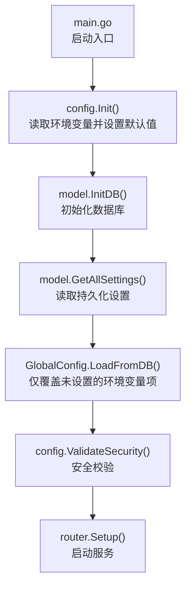
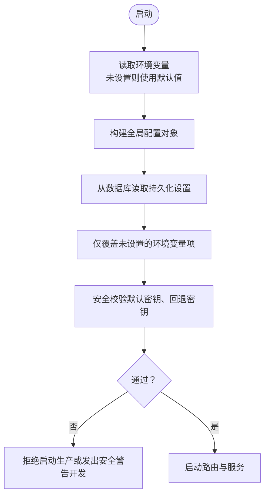
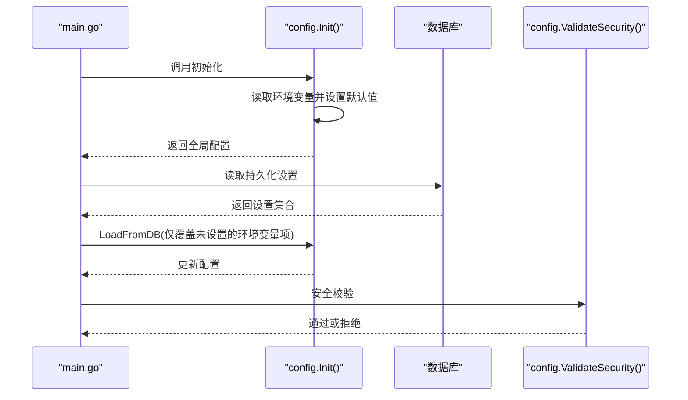

# 静态配置

<cite>
**本文引用的文件**
- [server/config/config.go](file://server/config/config.go)
- [server/main.go](file://server/main.go)
- [server/service/security/jwt_secret.go](file://server/service/security/jwt_secret.go)
- [server/handler/settings.go](file://server/handler/settings.go)
</cite>

## 目录
1. [简介](#简介)
2. [项目结构](#项目结构)
3. [核心组件](#核心组件)
4. [架构总览](#架构总览)
5. [详细组件分析](#详细组件分析)
6. [依赖分析](#依赖分析)
7. [性能考量](#性能考量)
8. [故障排除指南](#故障排除指南)
9. [结论](#结论)
10. [附录](#附录)

## 简介
本文件面向 Open 虚拟机管理控制台的“静态配置”主题，系统性说明服务启动阶段的配置来源、结构与优先级、环境变量映射、默认值设定、可持久化配置项以及安全校验策略。重点覆盖以下方面：
- 配置项清单：含数据类型、默认值、取值范围与作用域
- 环境变量机制与默认值设置
- 配置加载顺序与优先级（环境变量 > 数据库持久化 > 默认值）
- 安全校验与最佳实践
- 常见配置场景与故障排除

## 项目结构
静态配置由服务启动流程统一初始化，核心流程如下：
- 服务启动入口加载配置模块
- 从环境变量与默认值构造全局配置对象
- 从数据库加载持久化设置，覆盖未设置的环境变量项
- 安全校验通过后进入业务初始化与路由启动

**图表来源**
- [server/main.go:39-80](file://server/main.go#L39-L80)
- [server/config/config.go:157-249](file://server/config/config.go#L157-L249)
- [server/config/config.go:458-677](file://server/config/config.go#L458-L677)

**章节来源**
- [server/main.go:39-80](file://server/main.go#L39-L80)
- [server/config/config.go:157-249](file://server/config/config.go#L157-L249)

## 核心组件
- 配置结构体：集中定义所有静态配置项及其注释说明
- 初始化函数：按环境变量与默认值填充配置
- 加载数据库持久化设置：在环境变量未设置时生效
- 安全校验：对默认密钥与回退密钥进行告警或拒绝启动
- 环境文件同步：将可持久化配置写回 .env 文件

**章节来源**
- [server/config/config.go:19-152](file://server/config/config.go#L19-L152)
- [server/config/config.go:157-249](file://server/config/config.go#L157-L249)
- [server/config/config.go:458-677](file://server/config/config.go#L458-L677)
- [server/config/config.go:251-283](file://server/config/config.go#L251-L283)
- [server/config/config.go:751-800](file://server/config/config.go#L751-L800)

## 架构总览
下图展示配置项在启动阶段的来源与优先级：

**图表来源**
- [server/config/config.go:157-249](file://server/config/config.go#L157-L249)
- [server/config/config.go:458-677](file://server/config/config.go#L458-L677)
- [server/config/config.go:251-283](file://server/config/config.go#L251-L283)
- [server/main.go:58-80](file://server/main.go#L58-L80)

## 详细组件分析

### 配置项清单与说明
以下为静态配置的关键项（按类别组织）。每个条目包含：
- 配置键（小写短横线命名）
- 环境变量名
- 数据类型
- 默认值
- 取值范围/约束
- 作用域与用途

- 基础服务
  - 键：port
    - 环境变量：KVM_PORT
    - 类型：整数
    - 默认值：8080
    - 取值范围：1–65535
    - 作用：监听端口
  - 键：db_path
    - 环境变量：KVM_DB_PATH
    - 类型：字符串（路径）
    - 默认值：./data/kvm_console.db
    - 取值范围：合法文件路径
    - 作用：SQLite 数据库存储路径
  - 键：development_mode
    - 环境变量：KVM_DEVELOPMENT_MODE
    - 类型：布尔
    - 默认值：false
    - 取值范围：true/false
    - 作用：开发模式，绕过部分安全校验
  - 键：service_unit_name
    - 环境变量：KVM_SERVICE_UNIT_NAME
    - 类型：字符串
    - 默认值：kvm-console.service
    - 取值范围：合法 systemd 单元名
    - 作用：当前服务单元名称

- 认证与安全
  - 键：jwt_secret
    - 环境变量：KVM_JWT_SECRET
    - 类型：字符串
    - 默认值：内置默认密钥常量
    - 取值范围：强随机密钥（建议 base64 编码）
    - 作用：JWT 签名密钥；生产禁止使用默认值
  - 键：jwt_expire_hours
    - 环境变量：KVM_JWT_EXPIRE_HOURS
    - 类型：整数（小时）
    - 默认值：24
    - 取值范围：>0
    - 作用：JWT 过期时间
  - 键：jwt_secret_rotate_hours
    - 环境变量：KVM_JWT_SECRET_ROTATE_HOURS
    - 类型：整数（小时）
    - 默认值：24
    - 取值范围：>=0（0 表示禁用轮换）
    - 作用：JWT 密钥自动轮换周期
  - 键：vm_credential_secret
    - 环境变量：KVM_VM_CREDENTIAL_SECRET
    - 类型：字符串
    - 默认值：空（回退使用 jwt_secret）
    - 取值范围：独立密钥更佳
    - 作用：虚拟机凭据加密密钥（若为空则回退使用 jwt_secret）
  - 键：security_secret
    - 环境变量：KVM_SECURITY_SECRET
    - 类型：字符串
    - 默认值：空（回退使用 jwt_secret）
    - 取值范围：独立密钥更佳
    - 作用：账户安全相关加密密钥（若为空则回退使用 jwt_secret）

- 模板与镜像
  - 键：template_dir
    - 环境变量：KVM_TEMPLATE_DIR
    - 类型：字符串（路径）
    - 默认值：/var/lib/libvirt/images/templates
    - 作用：模板根目录
  - 键：template_import_dir
    - 环境变量：KVM_TEMPLATE_IMPORT_DIR
    - 类型：字符串（路径）
    - 默认值：template_dir/_imports
    - 作用：模板导入临时目录
  - 键：template_export_dir
    - 环境变量：KVM_TEMPLATE_EXPORT_DIR
    - 类型：字符串（路径）
    - 默认值：template_dir/_exports
    - 作用：模板导出目录
  - 键：clone_dir
    - 环境变量：KVM_CLONE_DIR
    - 类型：字符串（路径）
    - 默认值：/var/lib/libvirt/images
    - 作用：克隆磁盘目录
  - 键：iso_dir
    - 环境变量：KVM_ISO_DIR
    - 类型：字符串（路径）
    - 默认值：/var/lib/libvirt/images/ISO
    - 作用：全局 ISO 目录
  - 键：rescue_iso
    - 环境变量：KVM_RESCUE_ISO
    - 类型：字符串（路径）
    - 默认值：空
    - 作用：救援系统 ISO 路径

- 网络与 VPC
  - 键：default_network
    - 环境变量：KVM_DEFAULT_NETWORK
    - 类型：字符串
    - 默认值：default
    - 作用：默认网络名
  - 键：network_backend
    - 环境变量：KVM_NETWORK_BACKEND
    - 类型：字符串
    - 默认值：ovs
    - 作用：网络后端（如 ovs）
  - 键：ovs_bridge
    - 环境变量：KVM_OVS_BRIDGE
    - 类型：字符串
    - 默认值：br-ovs
    - 作用：OVS 网桥名称
  - 键：ovs_uplink
    - 环境变量：KVM_OVS_UPLINK
    - 类型：字符串
    - 默认值：空（自动检测默认路由）
    - 作用：OVS NAT 出口网卡
  - 键：ovs_dhcp_start
    - 环境变量：KVM_OVS_DHCP_START
    - 类型：字符串
    - 默认值：空
    - 作用：OVS DHCP 起始地址
  - 键：ovs_dhcp_end
    - 环境变量：KVM_OVS_DHCP_END
    - 类型：字符串
    - 默认值：空
    - 作用：OVS DHCP 结束地址
  - 键：subnet_prefix
    - 环境变量：KVM_SUBNET_PREFIX
    - 类型：字符串
    - 默认值：192.168.122
    - 作用：子网前缀
  - 键：auto_port_start / auto_port_end
    - 环境变量：KVM_AUTO_PORT_START / KVM_AUTO_PORT_END
    - 类型：整数
    - 默认值：10000 / 20000
    - 作用：自动端口分配范围
  - 键：port_forward_dir
    - 环境变量：KVM_PORTFORWARD_DIR
    - 类型：字符串（路径）
    - 默认值：/etc/kvm-portforward
    - 作用：端口转发持久化目录
  - 键：vpc_subnet_prefix
    - 环境变量：KVM_VPC_SUBNET_PREFIX
    - 类型：字符串
    - 默认值：10.200
    - 作用：VPC 子网前缀
  - 键：vpc_vlan_start / vpc_vlan_end
    - 环境变量：KVM_VPC_VLAN_START / KVM_VPC_VLAN_END
    - 类型：整数
    - 默认值：100 / 4094
    - 作用：VPC VLAN 范围
  - 键：vpc_dns
    - 环境变量：KVM_VPC_DNS
    - 类型：字符串
    - 默认值：223.5.5.5,223.6.6.6
    - 作用：VPC DNS
  - 键：vpc_acl_table
    - 环境变量：KVM_VPC_ACL_TABLE
    - 类型：字符串
    - 默认值：kvm_console_vpc_acl
    - 作用：VPC ACL 表名

- 外网与带宽
  - 键：max_burst_inbound / max_burst_outbound
    - 环境变量：KVM_MAX_BURST_INBOUND / KVM_MAX_BURST_OUTBOUND
    - 类型：整数（Mbps）
    - 默认值：0（不限制）
    - 作用：全局限速总带宽（所有 VM/VPC 均分）

- 主机与维护
  - 键：host_ip
    - 环境变量：KVM_HOST_IP
    - 类型：字符串
    - 默认值：空（自动检测）
    - 作用：宿主机外网 IP（端口转发用）
  - 键：external_nic
    - 环境变量：KVM_EXTERNAL_NIC
    - 类型：字符串
    - 默认值：空（自动检测）
    - 作用：外网网卡名称
  - 键：maintenance_mode
    - 环境变量：KVM_MAINTENANCE_MODE
    - 类型：布尔
    - 默认值：false
    - 作用：维护模式，阻止 VM 启动类操作
  - 键：maintenance_service_units
    - 环境变量：KVM_MAINTENANCE_SERVICE_UNITS
    - 类型：字符串（逗号/换行分隔）
    - 默认值：内置默认服务集合
    - 作用：维护模式需停用的服务单元
  - 键：maintenance_vm_shutdown_timeout_seconds
    - 环境变量：KVM_MAINTENANCE_VM_SHUTDOWN_TIMEOUT_SECONDS
    - 类型：整数（秒）
    - 默认值：40
    - 作用：维护模式关闭 VM 的优雅关机等待时间

- SMTP 邮件
  - 键：smtp_host
    - 环境变量：KVM_SMTP_HOST
    - 类型：字符串
    - 默认值：空
    - 作用：SMTP 服务器
  - 键：smtp_port
    - 环境变量：KVM_SMTP_PORT
    - 类型：整数
    - 默认值：587
    - 作用：SMTP 端口
  - 键：smtp_username
    - 环境变量：KVM_SMTP_USERNAME
    - 类型：字符串
    - 默认值：空
    - 作用：SMTP 用户名
  - 键：smtp_password_enc
    - 环境变量：KVM_SMTP_PASSWORD_ENC
    - 类型：字符串
    - 默认值：空
    - 作用：SMTP 密码（加密存储）
  - 键：smtp_from_name
    - 环境变量：KVM_SMTP_FROM_NAME
    - 类型：字符串
    - 默认值：QVMConsole
    - 作用：发件人显示名
  - 键：smtp_from_address
    - 环境变量：KVM_SMTP_FROM_ADDRESS
    - 类型：字符串
    - 默认值：空
    - 作用：发件人邮箱地址
  - 键：smtp_security
    - 环境变量：KVM_SMTP_SECURITY
    - 类型：字符串
    - 默认值：starttls
    - 作用：SMTP 安全协议（如 starttls/ssl/plain）
  - 键：smtp_timeout_seconds
    - 环境变量：KVM_SMTP_TIMEOUT_SECONDS
    - 类型：整数（秒）
    - 默认值：15
    - 作用：SMTP 超时

- 动态内存调度
  - 键：dynamic_memory_scheduler_enabled
    - 环境变量：KVM_DYNAMIC_MEMORY_SCHEDULER_ENABLED
    - 类型：布尔
    - 默认值：true
    - 作用：是否启用动态内存调度
  - 键：dynamic_memory_interval_seconds
    - 环境变量：KVM_DYNAMIC_MEMORY_INTERVAL_SECONDS
    - 类型：整数（秒）
    - 默认值：30
    - 作用：调度采样间隔
  - 键：dynamic_memory_host_reserve_mb
    - 环境变量：KVM_DYNAMIC_MEMORY_HOST_RESERVE_MB
    - 类型：整数（MB）
    - 默认值：2048
    - 作用：主机保留内存
  - 键：dynamic_memory_host_reserve_percent
    - 环境变量：KVM_DYNAMIC_MEMORY_HOST_RESERVE_PERCENT
    - 类型：整数（百分比）
    - 默认值：20
    - 作用：主机保留内存占比
  - 键：dynamic_memory_increase_threshold_percent
    - 环境变量：KVM_DYNAMIC_MEMORY_INCREASE_THRESHOLD_PERCENT
    - 类型：整数（百分比）
    - 默认值：15
    - 作用：内存增加阈值
  - 键：dynamic_memory_reclaim_threshold_percent
    - 环境变量：KVM_DYNAMIC_MEMORY_RECLAIM_THRESHOLD_PERCENT
    - 类型：整数（百分比）
    - 默认值：35
    - 作用：内存回收阈值
  - 键：dynamic_memory_cooldown_seconds
    - 环境变量：KVM_DYNAMIC_MEMORY_COOLDOWN_SECONDS
    - 类型：整数（秒）
    - 默认值：120
    - 作用：冷却时间
  - 键：dynamic_memory_observation_hours
    - 环境变量：KVM_DYNAMIC_MEMORY_OBSERVATION_HOURS
    - 类型：整数（小时）
    - 默认值：24
    - 作用：观察窗口
  - 键：scheduler_event_retention_hours
    - 环境变量：KVM_SCHEDULER_EVENT_RETENTION_HOURS
    - 类型：整数（小时）
    - 默认值：168
    - 作用：调度事件保留时长

- 抓包与探测
  - 键：network_capture_dir
    - 环境变量：KVM_NETWORK_CAPTURE_DIR
    - 类型：字符串（路径）
    - 默认值：/var/lib/kvm-console/captures
    - 作用：抓包文件目录
  - 键：network_capture_default_seconds / network_capture_max_seconds
    - 环境变量：KVM_NETWORK_CAPTURE_DEFAULT_SECONDS / KVM_NETWORK_CAPTURE_MAX_SECONDS
    - 类型：整数（秒）
    - 默认值：30 / 120
    - 作用：抓包默认/最大时长
  - 键：network_capture_max_mb
    - 环境变量：KVM_NETWORK_CAPTURE_MAX_MB
    - 类型：整数（MB）
    - 默认值：64
    - 作用：抓包最大大小
  - 键：network_capture_max_packets
    - 环境变量：KVM_NETWORK_CAPTURE_MAX_PACKETS
    - 类型：整数（个）
    - 默认值：5000
    - 作用：抓包最大包数
  - 键：port_forward_http_probe_enabled
    - 环境变量：KVM_PORT_FORWARD_HTTP_PROBE_ENABLED
    - 类型：布尔
    - 默认值：true
    - 作用：端口转发 HTTP 探测开关
  - 键：port_forward_http_probe_interval_minutes
    - 环境变量：KVM_PORT_FORWARD_HTTP_PROBE_INTERVAL_MINUTES
    - 类型：整数（分钟）
    - 默认值：60
    - 作用：探测间隔
  - 键：port_forward_http_probe_timeout_seconds
    - 环境变量：KVM_PORT_FORWARD_HTTP_PROBE_TIMEOUT_SECONDS
    - 类型：整数（秒）
    - 默认值：3
    - 作用：探测超时

- IOPS 与并发
  - 键：default_disk_iops_total / default_disk_iops_read / default_disk_iops_write
    - 环境变量：KVM_DEFAULT_DISK_IOPS_TOTAL / KVM_DEFAULT_DISK_IOPS_READ / KVM_DEFAULT_DISK_IOPS_WRITE
    - 类型：整数（IOPS）
    - 默认值：0（不限制）
    - 作用：默认磁盘 IOPS 限制
  - 键：batch_clone_max_concurrency
    - 环境变量：KVM_BATCH_CLONE_MAX_CONCURRENCY
    - 类型：整数（>0）
    - 默认值：10
    - 作用：批量克隆最大并发数

- 连接与日志
  - 键：use_go_libvirt
    - 环境变量：KVM_USE_GO_LIBVIRT
    - 类型：布尔
    - 默认值：true
    - 作用：是否使用 go-libvirt RPC（否则降级为 virsh）
  - 键：log_dir / log_level / log_max_days / log_compress / log_console / log_console_types / log_console_level / log_max_size_mb / log_max_backups
    - 环境变量：KVM_LOG_DIR / KVM_LOG_LEVEL / KVM_LOG_MAX_DAYS / KVM_LOG_COMPRESS / KVM_LOG_CONSOLE / KVM_LOG_CONSOLE_TYPES / KVM_LOG_CONSOLE_LEVEL / KVM_LOG_MAX_SIZE_MB / KVM_LOG_MAX_BACKUPS
    - 类型：字符串/整数/布尔
    - 默认值：./log / info / 7 / true / true / app,cmd,libvirt / 空（继承文件级别） / 100 / 0
    - 作用：日志配置

- 其他
  - 键：public_base_url
    - 环境变量：KVM_PUBLIC_BASE_URL
    - 类型：字符串（URL）
    - 默认值：空
    - 作用：面板对外访问地址（用于邮件链接）
  - 键：site_title
    - 环境变量：KVM_SITE_TITLE
    - 类型：字符串
    - 默认值：QVMConsole
    - 作用：网站标题
  - 键：network_wait_online_disabled
    - 环境变量：KVM_NETWORK_WAIT_ONLINE_DISABLED
    - 类型：布尔
    - 默认值：false
    - 作用：禁用网络等待就绪检测（解决 OVS 桥接后开机卡住问题）

**章节来源**
- [server/config/config.go:19-152](file://server/config/config.go#L19-L152)
- [server/config/config.go:157-249](file://server/config/config.go#L157-L249)
- [server/config/config.go:388-456](file://server/config/config.go#L388-L456)

### 环境变量机制与默认值
- 初始化流程
  - 读取环境变量，若未设置则采用默认值
  - 构造全局配置对象
  - 从数据库读取持久化设置，仅覆盖未设置的环境变量项
- 环境变量到配置键的映射
  - 通过键到环境变量的映射表实现双向一致性
- .env 文件
  - 支持指定 .env 文件路径（默认位于 /opt/kvm-console/.env）
  - 可将可持久化配置写回 .env 文件，保持与数据库一致

**章节来源**
- [server/config/config.go:157-249](file://server/config/config.go#L157-L249)
- [server/config/config.go:388-456](file://server/config/config.go#L388-L456)
- [server/config/config.go:751-800](file://server/config/config.go#L751-L800)

### 配置加载与优先级
- 优先级（从高到低）
  1) 环境变量
  2) 数据库持久化设置
  3) 默认值
- 加载顺序
  - 启动时先按环境变量与默认值初始化
  - 再从数据库读取持久化设置，仅覆盖未设置的环境变量项
  - 最后执行安全校验

**图表来源**
- [server/main.go:58-80](file://server/main.go#L58-L80)
- [server/config/config.go:157-249](file://server/config/config.go#L157-L249)
- [server/config/config.go:458-677](file://server/config/config.go#L458-L677)
- [server/config/config.go:251-283](file://server/config/config.go#L251-L283)

### 安全校验与最佳实践
- 默认密钥拒绝
  - 若使用内置默认 JWT 密钥且非开发模式，直接拒绝启动
  - 开发模式会打印安全警告但仍允许启动
- 回退密钥告警
  - 若 vm_credential_secret 或 security_secret 为空，将回退使用 jwt_secret，并发出安全警告
- 密钥轮换
  - 支持定时轮换 JWT 密钥，并写回 .env 文件
- 最佳实践
  - 生产环境必须设置独立的 KVM_JWT_SECRET、KVM_VM_CREDENTIAL_SECRET、KVM_SECURITY_SECRET
  - 使用强随机密钥（例如 base64 编码的 32 字节以上）
  - 启用密钥轮换并定期更新
  - 严格控制 .env 文件权限（仅 root 可读写）

**章节来源**
- [server/config/config.go:251-283](file://server/config/config.go#L251-L283)
- [server/service/security/jwt_secret.go:31-59](file://server/service/security/jwt_secret.go#L31-L59)

### 可持久化配置与 .env 同步
- 可持久化键列表
  - 包括网络、VPC、带宽、SMTP、动态内存、日志、端口转发探测、IOPS、并发、维护模式等配置
- .env 同步
  - 将数据库中已持久化的键写回 .env 文件，确保重启后环境变量与数据库一致
  - 仅更新数据库中已存在的键，避免污染其他配置

**章节来源**
- [server/config/config.go:318-386](file://server/config/config.go#L318-L386)
- [server/config/config.go:751-800](file://server/config/config.go#L751-L800)
- [server/handler/settings.go:692](file://server/handler/settings.go#L692)

## 依赖分析
- 启动依赖
  - main.go 依赖 config.Init() 完成配置初始化
  - 安全校验依赖数据库设置加载完成后的上下文
- 配置依赖
  - 多处业务模块读取配置（如救援 ISO、日志、网络等）
- 环境文件依赖
  - .env 文件路径与写入由配置模块统一管理

**图表来源**
- [server/main.go:39-80](file://server/main.go#L39-L80)
- [server/config/config.go:157-249](file://server/config/config.go#L157-L249)
- [server/config/config.go:458-677](file://server/config/config.go#L458-L677)
- [server/config/config.go:251-283](file://server/config/config.go#L251-L283)

**章节来源**
- [server/main.go:39-80](file://server/main.go#L39-L80)
- [server/config/config.go:157-249](file://server/config/config.go#L157-L249)
- [server/config/config.go:458-677](file://server/config/config.go#L458-L677)

## 性能考量
- 端口与并发
  - auto_port_start/auto_port_end 控制端口分配范围，合理设置避免冲突
  - batch_clone_max_concurrency 影响批量克隆吞吐
- IOPS 限制
  - default_disk_iops_* 限制磁盘 IOPS，避免单机资源争用
- 动态内存调度
  - interval、cooldown、threshold 等参数影响内存回收效率与抖动
- 日志
  - log_max_size_mb 与 log_max_backups 控制日志体积与保留数量，平衡磁盘占用与排障需求

## 故障排除指南
- 启动被拒绝（生产模式）
  - 现象：启动时报错并退出
  - 原因：使用了默认 JWT 密钥
  - 处理：设置 KVM_JWT_SECRET 为强随机密钥，或在开发模式下设置 KVM_DEVELOPMENT_MODE=true
  - 参考：安全校验逻辑
- 回退密钥安全警告
  - 现象：启动日志出现安全警告
  - 原因：vm_credential_secret 或 security_secret 为空，回退使用 jwt_secret
  - 处理：分别设置独立密钥，避免回退
- 环境变量未生效
  - 现象：修改环境变量后配置未更新
  - 原因：数据库持久化设置了相同键，且环境变量未设置
  - 处理：清空数据库中对应键或显式设置环境变量
- .env 文件未写入
  - 现象：界面修改配置后重启不生效
  - 原因：未配置 .env 文件路径或写入失败
  - 处理：检查 KVM_ENV_FILE 路径与权限，确认写入成功

**章节来源**
- [server/config/config.go:251-283](file://server/config/config.go#L251-L283)
- [server/config/config.go:458-677](file://server/config/config.go#L458-L677)
- [server/config/config.go:751-800](file://server/config/config.go#L751-L800)

## 结论
Open 虚拟机管理控制台的静态配置体系以“环境变量 > 数据库持久化 > 默认值”的优先级设计，既保证了灵活性，又确保了生产环境的安全性。通过明确的配置项清单、严格的默认密钥校验与密钥轮换机制、以及 .env 文件的同步能力，系统能够在复杂部署场景中稳定运行。建议在生产环境中：
- 为各类密钥设置独立且强随机的值
- 启用并定期轮换 JWT 密钥
- 明确 .env 文件路径与权限
- 合理规划网络、VPC、带宽与日志参数

## 附录

### 配置项与环境变量对照表（节选）
- port ↔ KVM_PORT
- db_path ↔ KVM_DB_PATH
- development_mode ↔ KVM_DEVELOPMENT_MODE
- jwt_secret ↔ KVM_JWT_SECRET
- vm_credential_secret ↔ KVM_VM_CREDENTIAL_SECRET
- security_secret ↔ KVM_SECURITY_SECRET
- template_dir ↔ KVM_TEMPLATE_DIR
- clone_dir ↔ KVM_CLONE_DIR
- iso_dir ↔ KVM_ISO_DIR
- network_backend ↔ KVM_NETWORK_BACKEND
- ovs_bridge ↔ KVM_OVS_BRIDGE
- subnet_prefix ↔ KVM_SUBNET_PREFIX
- auto_port_start/auto_port_end ↔ KVM_AUTO_PORT_START/KVM_AUTO_PORT_END
- max_burst_inbound/outbound ↔ KVM_MAX_BURST_INBOUND/KVM_MAX_BURST_OUTBOUND
- smtp_* ↔ KVM_SMTP_*
- dynamic_memory_* ↔ KVM_DYNAMIC_MEMORY_*
- log_* ↔ KVM_LOG_*
- 其余项依此类推

**章节来源**
- [server/config/config.go:388-456](file://server/config/config.go#L388-L456)