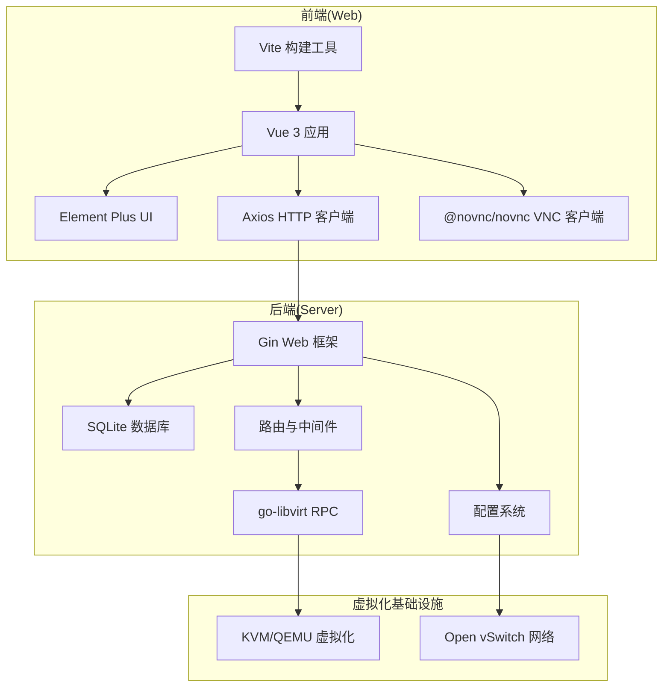
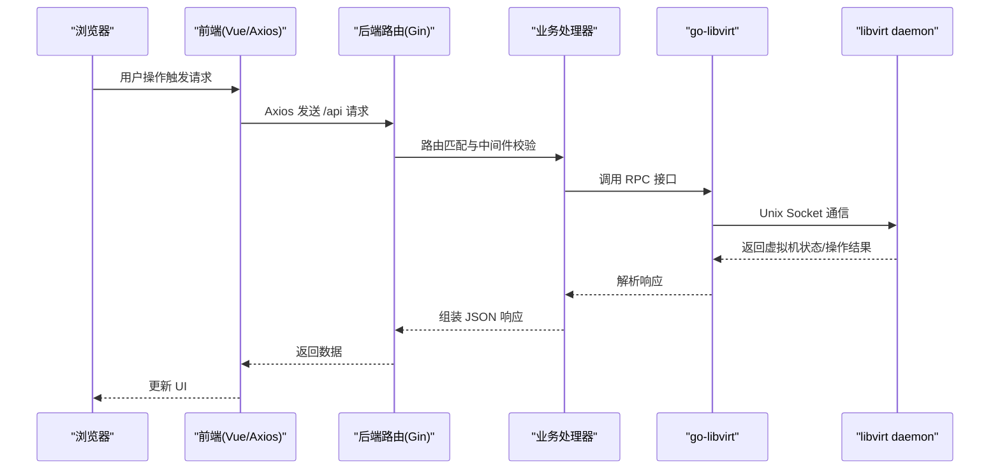
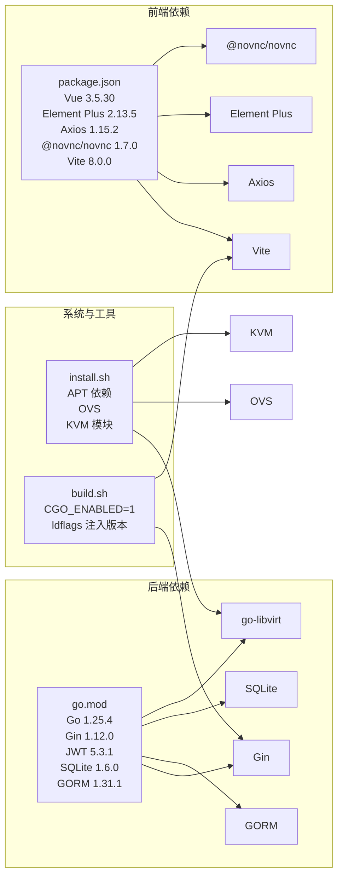

# 技术栈与依赖

<cite>
**本文引用的文件**
- [go.mod](file://server/go.mod)
- [main.go](file://server/main.go)
- [config.go](file://server/config/config.go)
- [router.go](file://server/router/router.go)
- [db.go](file://server/model/db.go)
- [connection.go](file://server/service/libvirt_rpc/connection.go)
- [vite.config.js](file://web/vite.config.js)
- [package.json](file://web/package.json)
- [request.js](file://web/src/utils/request.js)
- [vnc.js](file://web/src/utils/vnc.js)
- [vm.js](file://web/src/api/vm.js)
- [install.sh](file://install.sh)
- [build.sh](file://build.sh)
</cite>

## 目录
1. [简介](#简介)
2. [项目结构](#项目结构)
3. [核心组件](#核心组件)
4. [架构总览](#架构总览)
5. [详细组件分析](#详细组件分析)
6. [依赖关系分析](#依赖关系分析)
7. [性能考量](#性能考量)
8. [故障排查指南](#故障排查指南)
9. [结论](#结论)
10. [附录](#附录)

## 简介
本文件面向开发者与运维人员，系统梳理 Open 虚拟机管理控制台（QVMConsole）的技术栈与依赖，覆盖后端（Go + Gin + Libvirt RPC + SQLite）、前端（Vue 3 + Element Plus + Axios + NVNC）、虚拟化基础设施（KVM/QEMU + Open vSwitch + OVS 管理）、构建工具链（Vite + Go Modules + Node.js 包管理）以及版本兼容性、安装与配置要点。文末提供技术选型理由与替代方案对比，帮助读者理解项目决策并进行定制化扩展。

## 项目结构
项目采用前后端分离架构：
- 后端位于 server 目录，基于 Go 语言，使用 Gin Web 框架提供 REST API，通过 go-libvirt 与 libvirt daemon 通信，SQLite 作为本地数据库。
- 前端位于 web 目录，基于 Vue 3 + Vite，使用 Element Plus UI 库、Axios 发起 HTTP 请求，@novnc/novnc 实现 VNC 控制台。
- 安装与构建脚本位于根目录，提供一键安装、系统依赖检测、OVS 网络地基建造、打包发布等功能。

图表来源
- [vite.config.js:1-27](file://web/vite.config.js#L1-L27)
- [package.json:1-30](file://web/package.json#L1-L30)
- [request.js:1-209](file://web/src/utils/request.js#L1-L209)
- [vnc.js:1-316](file://web/src/utils/vnc.js#L1-L316)
- [main.go:1-128](file://server/main.go#L1-L128)
- [router.go:1-539](file://server/router/router.go#L1-L539)
- [config.go:1-824](file://server/config/config.go#L1-L824)
- [connection.go:1-138](file://server/service/libvirt_rpc/connection.go#L1-L138)

章节来源
- [main.go:1-128](file://server/main.go#L1-L128)
- [router.go:18-485](file://server/router/router.go#L18-L485)
- [config.go:12-152](file://server/config/config.go#L12-L152)

## 核心组件
- 后端技术栈
  - Go 语言：版本要求见 go.mod。
  - Web 框架：Gin v1.12.0。
  - RPC 通信：go-libvirt v0.0.0-20260217163227-273eaa321819，连接 /var/run/libvirt/libvirt-sock。
  - 数据库：SQLite + GORM v1.31.1 + gorm.io/driver/sqlite v1.6.0。
  - 安全与鉴权：JWT v5.3.1，配合自研中间件实现登录态与权限控制。
  - 日志：lumberjack v2.2.1，支持滚动日志。
- 前端技术栈
  - 框架：Vue 3.5.30。
  - UI 库：Element Plus v2.13.5。
  - HTTP 客户端：Axios v1.15.2。
  - VNC 客户端：@novnc/novnc v1.7.0。
  - 构建工具：Vite v8.0.0。
- 虚拟化与网络
  - 虚拟化平台：KVM/QEMU。
  - 网络虚拟化：Open vSwitch，支持 OVS DHCP、NAT、ACL、VPC 等。
- 构建工具链
  - Go 模块：go.mod 管理依赖。
  - Node.js 包管理：package.json + npm。
  - Vite：开发与生产构建。
  - 安装脚本：install.sh，检测系统、安装依赖、配置 OVS、创建用户存储等。
  - 打包脚本：build.sh，构建前端与后端，生成发行包。

章节来源
- [go.mod:3-15](file://server/go.mod#L3-L15)
- [package.json:11-29](file://web/package.json#L11-L29)
- [connection.go:14-43](file://server/service/libvirt_rpc/connection.go#L14-L43)
- [db.go:57-113](file://server/model/db.go#L57-L113)
- [install.sh:42-110](file://install.sh#L42-L110)
- [build.sh:96-145](file://build.sh#L96-L145)

## 架构总览
后端启动流程：初始化配置 -> 日志 -> 数据库 -> go-libvirt 连接 -> 注册任务处理器 -> 启动统计采集与定时任务 -> 设置路由 -> 启动服务。前端通过 Axios 访问 /api 路由，VNC 通过 WebSocket 与后端交互，后端再通过 go-libvirt 与 libvirt 通信。

图表来源
- [main.go:31-128](file://server/main.go#L31-L128)
- [router.go:18-485](file://server/router/router.go#L18-L485)
- [connection.go:20-76](file://server/service/libvirt_rpc/connection.go#L20-L76)

## 详细组件分析

### 后端：Gin Web 框架与路由
- 路由组织：/api 分组，按模块划分认证、虚拟机、网络、存储、用户、任务等。
- 中间件：CORS、限流、请求日志、JWT 鉴权、VM 归属校验、管理员校验等。
- 静态文件服务：当存在 web-dist 时，提供前端 SPA 回退与资源服务。

章节来源
- [router.go:18-485](file://server/router/router.go#L18-L485)

### 后端：配置系统
- 全局配置结构体包含端口、数据库路径、JWT 密钥、网络后端(OVS)、带宽限制、日志、动态内存调度、VPC 等。
- 支持环境变量与数据库持久化配置，启动时加载并做安全检查（默认密钥禁止生产）。

章节来源
- [config.go:19-152](file://server/config/config.go#L19-L152)
- [config.go:157-249](file://server/config/config.go#L157-L249)
- [config.go:251-283](file://server/config/config.go#L251-L283)

### 后端：数据库与 ORM
- 使用 GORM + SQLite，自动迁移表结构，包含用户、虚拟机、网络、存储、任务、系统设置等模型。
- 自定义 GORM 日志器，将 SQL 日志输出到应用日志，便于审计与排障。

章节来源
- [db.go:57-113](file://server/model/db.go#L57-L113)
- [db.go:86-112](file://server/model/db.go#L86-L112)

### 后端：Libvirt RPC 与虚拟机控制
- 通过 go-libvirt 连接 /var/run/libvirt/libvirt-sock，支持连接探测与自动重连。
- 提供虚拟机生命周期、快照、磁盘、VNC、监控、迁移等能力的封装。

章节来源
- [connection.go:20-76](file://server/service/libvirt_rpc/connection.go#L20-L76)
- [connection.go:100-121](file://server/service/libvirt_rpc/connection.go#L100-L121)

### 后端：启动流程与任务队列
- 启动阶段初始化配置、日志、数据库、go-libvirt，注册任务处理器，启动资源采集与定时任务。
- 任务队列支持多类型异步任务（克隆、模板、快照、迁移、磁盘操作、防火墙等）。

章节来源
- [main.go:31-128](file://server/main.go#L31-L128)
- [main.go:130-800](file://server/main.go#L130-L800)

### 前端：Vue 3 + Element Plus + Axios
- Axios 拦截器统一处理 Token、高风险验证、进度条、错误提示与 401 登出。
- Element Plus 提供丰富的 UI 组件，结合 Vue Router 实现页面导航。

章节来源
- [request.js:25-209](file://web/src/utils/request.js#L25-L209)
- [package.json:11-29](file://web/package.json#L11-L29)

### 前端：VNC 控制台与 WebSocket
- @novnc/novnc 1.7.0，封装 VNC 连接、快捷键发送、文本输入、视图缩放等。
- WebSocket 用于 VNC 通道，URL 由 buildVncWsUrl 生成，支持 wss/http 自适应。

章节来源
- [vnc.js:129-133](file://web/src/utils/vnc.js#L129-L133)
- [vnc.js:144-168](file://web/src/utils/vnc.js#L144-L168)
- [vnc.js:285-315](file://web/src/utils/vnc.js#L285-L315)

### 前端：API 封装与路由
- API 模块集中封装 /vm、/template、/network、/storage-pool、/host、/task 等接口。
- 支持 SSE（Server-Sent Events）用于实时推送（VM 列表、详情、主机统计、调度事件）。

章节来源
- [vm.js:1-705](file://web/src/api/vm.js#L1-L705)

### 前端：Vite 构建与代理
- 本地开发代理到后端 8080 端口，支持 WebSocket（noVNC 需要）。
- 生产环境通过后端静态文件服务提供 SPA。

章节来源
- [vite.config.js:7-26](file://web/vite.config.js#L7-L26)

### 虚拟化与网络：KVM/QEMU + Open vSwitch
- 安装脚本检测 KVM 硬件虚拟化、加载内核模块、启用 libvirt 与 OVS 服务。
- OVS 地基：创建网桥、DHCP、NAT、iptables 规则，支持 VPC 与 ACL 管理。

章节来源
- [install.sh:148-178](file://install.sh#L148-L178)
- [install.sh:313-327](file://install.sh#L313-L327)
- [install.sh:745-800](file://install.sh#L745-L800)

### 构建工具链：Go + Node.js + Vite
- Go：CGO_ENABLED=1，Linux amd64，ldflags 注入版本与构建时间。
- Node.js：npm ci 安装依赖，Vite 生产构建，dist 复制到 release。
- 安装脚本：检测系统、安装 APT 依赖、配置 OVS、创建用户存储、写入 .env。

章节来源
- [build.sh:121-145](file://build.sh#L121-L145)
- [build.sh:96-119](file://build.sh#L96-L119)
- [install.sh:265-295](file://install.sh#L265-L295)

## 依赖关系分析

图表来源
- [go.mod:3-15](file://server/go.mod#L3-L15)
- [package.json:11-29](file://web/package.json#L11-L29)
- [install.sh:42-110](file://install.sh#L42-L110)
- [build.sh:121-145](file://build.sh#L121-L145)

章节来源
- [go.mod:3-15](file://server/go.mod#L3-L15)
- [package.json:11-29](file://web/package.json#L11-L29)
- [install.sh:42-110](file://install.sh#L42-L110)
- [build.sh:121-145](file://build.sh#L121-L145)

## 性能考量
- 后端
  - go-libvirt 连接具备自动重连与探测机制，降低因 libvirt daemon 重启导致的中断风险。
  - GORM 日志器仅输出慢查询与错误，减少噪声，便于定位性能瓶颈。
  - 任务队列并发 worker 数量在启动时固定，可根据负载调整。
- 前端
  - Axios 统一拦截器与 NProgress 进度条提升用户体验。
  - Vite 开发模式热更新，生产构建优化资源体积。
- 网络
  - OVS DHCP/NAT 与 iptables 规则在安装脚本中统一配置，避免手工干预带来的性能与稳定性问题。

章节来源
- [connection.go:100-121](file://server/service/libvirt_rpc/connection.go#L100-L121)
- [db.go:20-52](file://server/model/db.go#L20-L52)
- [install.sh:745-800](file://install.sh#L745-L800)

## 故障排查指南
- 启动失败（JWT 默认密钥）
  - 若检测到默认 JWT 密钥且非开发模式，将拒绝启动并打印安全警告。请设置 KVM_JWT_SECRET。
- libvirt 连接失败
  - 检查 /var/run/libvirt/libvirt-sock 是否存在，libvirtd 服务是否运行。
- 前端无法访问 /api
  - 确认 Vite 代理配置指向后端 8080 端口，或生产环境后端提供静态文件服务。
- OVS 网络异常
  - 使用安装脚本提供的修复流程，检查网桥、DHCP、iptables 规则与 dnsmasq 服务状态。
- 数据库迁移失败
  - 查看 GORM 日志与错误输出，确认 SQLite 文件权限与路径。

章节来源
- [config.go:251-283](file://server/config/config.go#L251-L283)
- [connection.go:20-43](file://server/service/libvirt_rpc/connection.go#L20-L43)
- [vite.config.js:17-24](file://web/vite.config.js#L17-L24)
- [install.sh:729-743](file://install.sh#L729-L743)
- [db.go:42-52](file://server/model/db.go#L42-L52)

## 结论
本项目采用成熟稳定的后端（Go + Gin + Libvirt + SQLite）与现代化前端（Vue 3 + Element Plus + Vite + NVNC）组合，结合 KVM/QEMU 与 Open vSwitch 的虚拟化与网络基础设施，形成一套可部署、可扩展、易维护的虚拟机管理控制台。安装脚本与构建脚本降低了部署门槛，配置系统与中间件提供了灵活的安全与权限控制。建议在生产环境中严格配置密钥与网络策略，并根据实际负载调整任务队列并发与数据库性能参数。

## 附录

### 版本兼容性与安装配置要点
- Go 语言版本：1.25.4（go.mod 指定）
- Node.js：推荐 v20+（构建脚本提示）
- Linux 发行版：Debian/Ubuntu（install.sh 检测）
- 硬件虚拟化：需开启 VT-x/AMD-V（install.sh 检测）
- 系统服务：libvirtd、openvswitch-switch、ssh（install.sh 启用）

章节来源
- [go.mod:3](file://server/go.mod#L3)
- [build.sh:99-101](file://build.sh#L99-L101)
- [install.sh:126-146](file://install.sh#L126-L146)
- [install.sh:313-327](file://install.sh#L313-L327)

### 技术选型与替代方案对比
- 后端框架：Gin
  - 优点：高性能、生态丰富、中间件体系完善。
  - 替代：Fiber、Echo。权衡在于社区规模与生态。
- 数据库：SQLite + GORM
  - 优点：零配置、轻量、适合中小规模部署。
  - 替代：PostgreSQL/MySQL + gorm，适合高并发与复杂事务场景。
- RPC：go-libvirt
  - 优点：稳定可靠，与 libvirt daemon 紧密集成。
  - 替代：virsh 命令行（降级路径），但缺乏连接管理与错误恢复。
- 前端：Vue 3 + Element Plus + Vite + Axios + NVNC
  - 优点：生态成熟、组件丰富、开发体验佳。
  - 替代：React + Ant Design + Webpack（工程化差异较大）。
- 网络：Open vSwitch
  - 优点：企业级网络虚拟化，支持 ACL、VPC、NAT、DHCP。
  - 替代：Linux Bridge + iptables，灵活性高但复杂度上升。

章节来源
- [go.mod:5-15](file://server/go.mod#L5-L15)
- [package.json:11-29](file://web/package.json#L11-L29)
- [connection.go:20-43](file://server/service/libvirt_rpc/connection.go#L20-L43)
- [install.sh:42-110](file://install.sh#L42-L110)