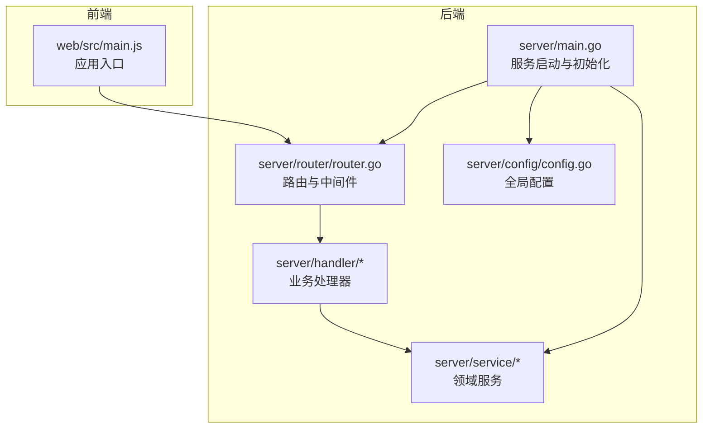
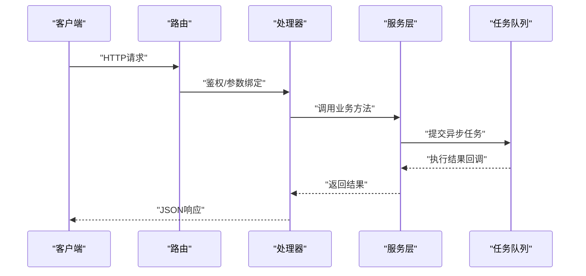
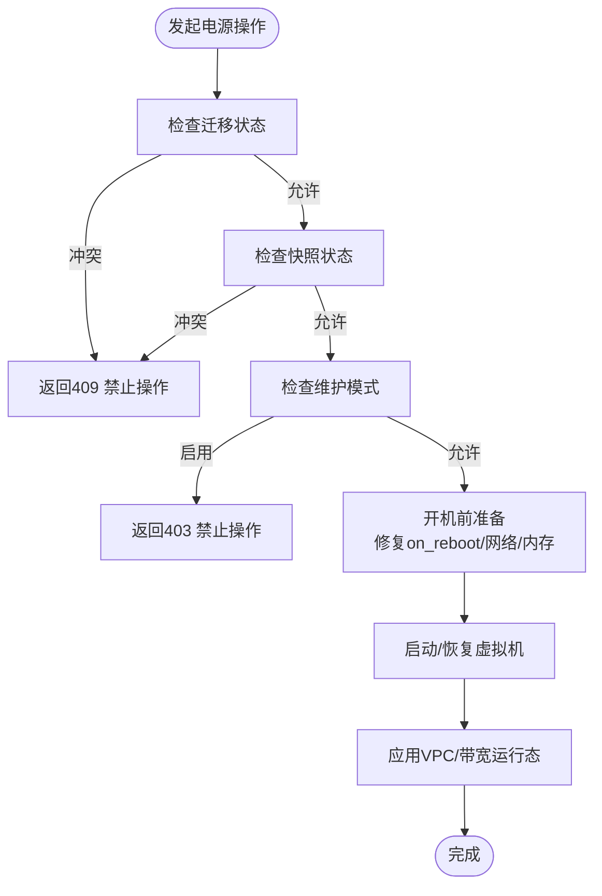
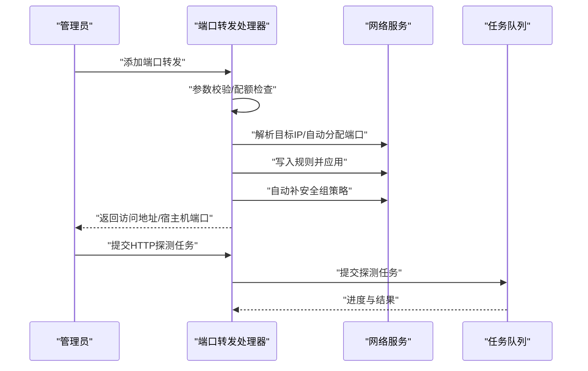
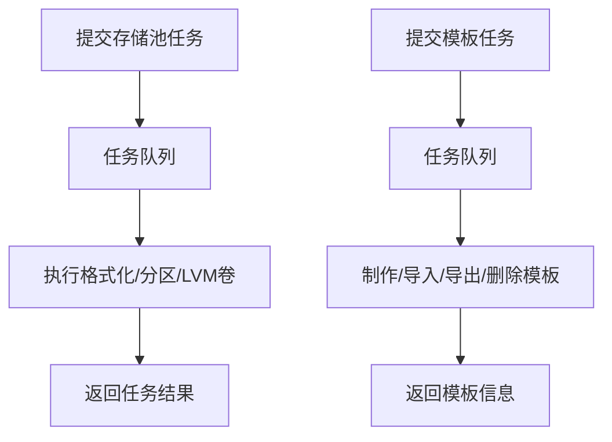
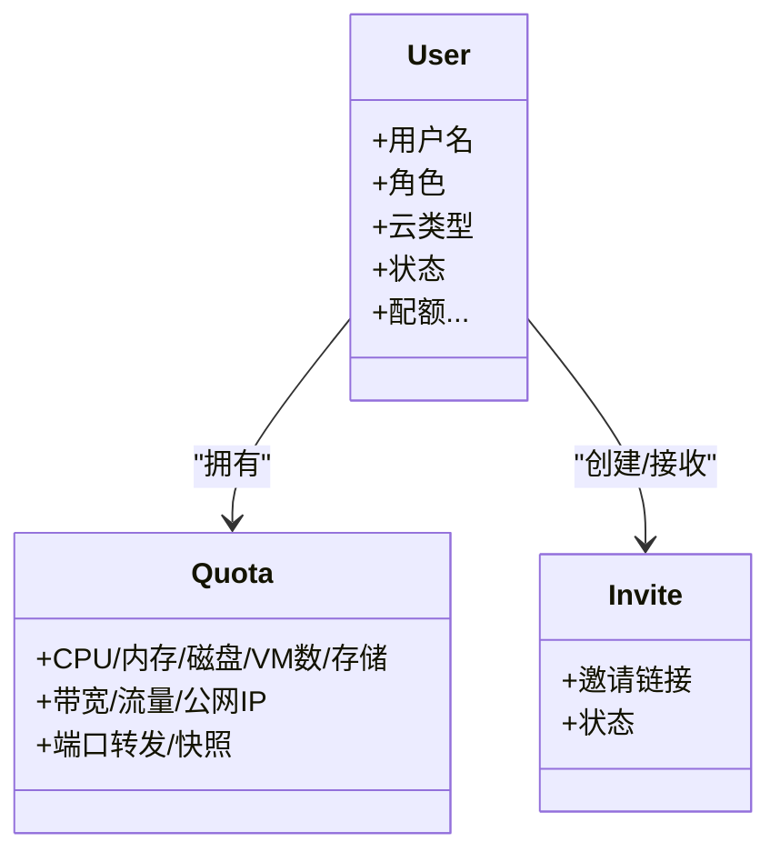
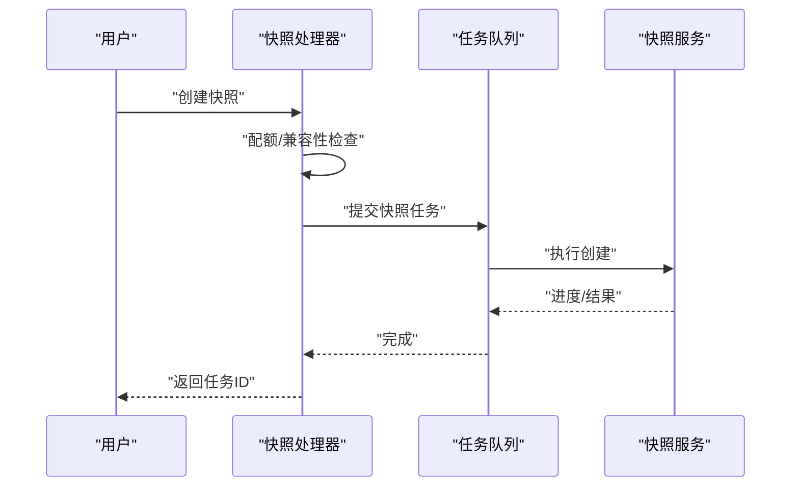
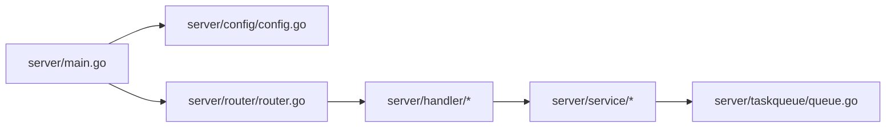

# 核心功能特性

<cite>
**本文引用的文件**
- [server/main.go](file://server/main.go)
- [server/config/config.go](file://server/config/config.go)
- [server/router/router.go](file://server/router/router.go)
- [server/handler/vm.go](file://server/handler/vm.go)
- [server/handler/network.go](file://server/handler/network.go)
- [server/handler/storage_pool.go](file://server/handler/storage_pool.go)
- [server/handler/user.go](file://server/handler/user.go)
- [server/handler/snapshot.go](file://server/handler/snapshot.go)
- [server/service/vm/lifecycle.go](file://server/service/vm/lifecycle.go)
- [server/service/network/vpc/types.go](file://server/service/network/vpc/types.go)
- [server/service/storage/pool/types.go](file://server/service/storage/pool/types.go)
- [server/service/firewall/types.go](file://server/service/firewall/types.go)
- [web/src/main.js](file://web/src/main.js)
</cite>

## 目录
1. [简介](#简介)
2. [项目结构](#项目结构)
3. [核心组件](#核心组件)
4. [架构总览](#架构总览)
5. [详细组件分析](#详细组件分析)
6. [依赖分析](#依赖分析)
7. [性能考量](#性能考量)
8. [故障排查指南](#故障排查指南)
9. [结论](#结论)
10. [附录](#附录)

## 简介
本文件面向Open虚拟机管理控制台的使用者与运维人员，系统化梳理平台的核心功能特性，覆盖虚拟机生命周期管理、网络虚拟化（VPC/端口转发/防火墙）、存储管理（存储池/LVM卷/模板）、用户权限与配额、监控告警与任务调度、快照备份等关键能力，并提供典型使用场景与操作指引，帮助快速理解与上手。

## 项目结构
后端采用Go语言基于Gin框架构建，提供REST API；前端使用Vue 3 + Pinia + Element Plus，通过统一路由与鉴权中间件对接后端服务。核心启动流程包含配置初始化、数据库与缓存同步、网络与防火墙运行态恢复、任务队列与定时器启动、路由注册与服务监听。

图示来源
- [server/main.go:31-128](file://server/main.go#L31-L128)
- [server/router/router.go:18-485](file://server/router/router.go#L18-L485)
- [server/config/config.go:157-249](file://server/config/config.go#L157-L249)
- [web/src/main.js:1-26](file://web/src/main.js#L1-L26)

章节来源
- [server/main.go:31-128](file://server/main.go#L31-L128)
- [server/router/router.go:18-485](file://server/router/router.go#L18-L485)
- [server/config/config.go:157-249](file://server/config/config.go#L157-L249)
- [web/src/main.js:1-26](file://web/src/main.js#L1-L26)

## 核心组件
- 虚拟机生命周期管理：启动/关机/重启/强制断电/重置、电源操作前置校验（迁移/快照中禁止）、维护模式与配额控制。
- 网络虚拟化：VPC逻辑交换机、安全组、端口转发、静态IP、防火墙策略（VM/宿主机）、网络诊断与抓包。
- 存储管理：宿主机存储池（格式化/分区/LVM卷）、模板管理、用户ISO与挂载、磁盘管理与IOPS限制。
- 用户权限与配额：多租户支持（弹性云/轻量云）、CPU/内存/磁盘/VM数/存储/带宽/流量/公网IP/端口转发/快照配额、SSH访问开关、用户状态与邀请流程。
- 监控告警与任务调度：VM/宿主机统计与历史、任务队列与SSE、定时事件中心、带宽与资源回收。
- 快照备份：创建/恢复/删除/批量删除、NVRAM与共享目录兼容性检查、配额校验。

章节来源
- [server/handler/vm.go:214-352](file://server/handler/vm.go#L214-L352)
- [server/handler/network.go:174-672](file://server/handler/network.go#L174-L672)
- [server/handler/storage_pool.go:15-254](file://server/handler/storage_pool.go#L15-L254)
- [server/handler/user.go:139-762](file://server/handler/user.go#L139-L762)
- [server/handler/snapshot.go:34-274](file://server/handler/snapshot.go#L34-L274)

## 架构总览
后端启动时完成配置加载、数据库初始化、libvirt RPC连接、VM缓存同步与运行态恢复（网络/防火墙/端口转发/VPC/公网IP）。路由按权限与功能分组，处理器负责参数校验与调用服务层，服务层封装具体业务逻辑并提交异步任务至任务队列。

图示来源
- [server/main.go:118-128](file://server/main.go#L118-L128)
- [server/router/router.go:18-485](file://server/router/router.go#L18-L485)
- [server/handler/vm.go:214-352](file://server/handler/vm.go#L214-L352)

章节来源
- [server/main.go:118-128](file://server/main.go#L118-L128)
- [server/router/router.go:18-485](file://server/router/router.go#L18-L485)

## 详细组件分析

### 虚拟机生命周期管理
- 支持操作：开机、关机、强制断电、重启、重置；开机前校验迁移/快照状态与维护模式；关机/断电后触发全局带宽再分配。
- 配额与权限：非管理员开机前校验配额；轻量云用户运行时配额独立控制。
- 网络与带宽：启动后应用VPC运行态与带宽策略；支持动态内存配置与当前内存调整。
- 错误处理：针对QEMU内部错误暂停状态给出明确提示与建议。

图示来源
- [server/handler/vm.go:233-352](file://server/handler/vm.go#L233-L352)
- [server/service/vm/lifecycle.go:43-159](file://server/service/vm/lifecycle.go#L43-L159)

章节来源
- [server/handler/vm.go:214-352](file://server/handler/vm.go#L214-L352)
- [server/service/vm/lifecycle.go:43-159](file://server/service/vm/lifecycle.go#L43-L159)

使用场景与操作示例
- 场景1：为轻量云用户开机，系统自动校验运行时配额并应用带宽策略。
- 场景2：虚拟机处于“内部错误暂停”，需先重置或强制断电后重启。

### 网络虚拟化（VPC/端口转发/防火墙/诊断）
- VPC：逻辑交换机、安全组、多网口管理、带宽与流量统计、自动安全组规则补充。
- 端口转发：自动分配宿主机端口、自动绑定静态IP、协议计数、配额校验、HTTP探测任务。
- 防火墙：VM/宿主机双层策略，支持区域白名单、GeoIP导入与更新、端口转发豁免、连接预览与关闭。
- 诊断：网络抓包、VM网络诊断、OVS状态检查与修复。

图示来源
- [server/handler/network.go:222-348](file://server/handler/network.go#L222-L348)
- [server/handler/network.go:622-672](file://server/handler/network.go#L622-L672)

章节来源
- [server/handler/network.go:174-672](file://server/handler/network.go#L174-L672)
- [server/service/network/vpc/types.go:13-96](file://server/service/network/vpc/types.go#L13-L96)
- [server/service/firewall/types.go:31-200](file://server/service/firewall/types.go#L31-L200)

使用场景与操作示例
- 场景1：为VM添加TCP端口转发，系统自动分配端口并写入规则。
- 场景2：批量删除端口转发前进行高风险二次验证。
- 场景3：对某VM执行端口转发HTTP探测，定位可达性问题。

### 存储管理（存储池/磁盘/模板/LVM卷）
- 宿主机存储池：列出/详情/更新配置/设为默认、格式化并挂载、创建/删除分区、可用PV目标查询。
- LVM卷：创建/删除卷组与逻辑卷，支持异步任务提交与进度反馈。
- 模板：模板制作/导入/导出/删除、发布状态与元数据管理。
- 磁盘：新增/扩容/迁移/挂载/卸载、IOPS限制、PCIe直通设备管理。

图示来源
- [server/handler/storage_pool.go:77-254](file://server/handler/storage_pool.go#L77-L254)
- [server/main.go:361-444](file://server/main.go#L361-L444)

章节来源
- [server/handler/storage_pool.go:15-254](file://server/handler/storage_pool.go#L15-L254)
- [server/service/storage/pool/types.go:8-159](file://server/service/storage/pool/types.go#L8-L159)
- [server/main.go:361-444](file://server/main.go#L361-L444)

使用场景与操作示例
- 场景1：为新磁盘创建分区并格式化挂载，系统返回任务ID以便跟踪。
- 场景2：创建LVM卷组与逻辑卷，完成后返回VG/LV名称。

### 用户权限与配额（多租户/SSH/邀请）
- 多租户：弹性云/轻量云两类用户，配额与行为差异（如轻量云带宽由单机配额控制）。
- 配额：CPU/内存/磁盘/VM数/存储/运行时长/带宽/流量/公网IP/端口转发/快照等。
- 安全：邀请注册/邮件发送/二次验证/高风险操作保护/SSH访问开关/流量配额重置。
- 资产管理：用户删除（异步级联删除所有资产）、封禁/解封、分配/回收VM。

图示来源
- [server/handler/user.go:16-762](file://server/handler/user.go#L16-L762)

章节来源
- [server/handler/user.go:139-762](file://server/handler/user.go#L139-L762)

使用场景与操作示例
- 场景1：为弹性云用户创建并发送邀请，支持SMTP未配置时直接创建激活用户。
- 场景2：为轻量云用户分配已有VM并设置单VM配额，完成后应用带宽策略。

### 快照备份与任务调度
- 快照：创建/恢复/删除/批量删除，支持含内存快照与NVRAM兼容性检查，提交异步任务并返回任务ID。
- 任务调度：SSE推送任务进度、定时事件中心、全局带宽与资源回收、端口转发HTTP探测计划任务。
- 监控：VM/宿主机统计与历史、带宽与资源图表、任务列表与取消。

图示来源
- [server/handler/snapshot.go:59-161](file://server/handler/snapshot.go#L59-L161)
- [server/main.go:505-508](file://server/main.go#L505-L508)

章节来源
- [server/handler/snapshot.go:34-274](file://server/handler/snapshot.go#L34-L274)
- [server/main.go:505-508](file://server/main.go#L505-L508)

使用场景与操作示例
- 场景1：创建含内存快照前检查共享目录与UEFI NVRAM兼容性。
- 场景2：批量删除VM快照，提交异步任务并查看进度。

## 依赖分析
- 启动阶段依赖：配置模块、日志模块、数据库、libvirt RPC、网络/防火墙运行态恢复、任务队列与定时器。
- 路由与中间件：CORS、限流、请求日志、JWT与角色中间件、VM访问控制中间件。
- 服务层：VM生命周期、网络/VPC、防火墙、存储池/LVM、模板、快照、用户与配额、任务队列。

图示来源
- [server/main.go:31-128](file://server/main.go#L31-L128)
- [server/router/router.go:18-485](file://server/router/router.go#L18-L485)

章节来源
- [server/main.go:31-128](file://server/main.go#L31-L128)
- [server/router/router.go:18-485](file://server/router/router.go#L18-L485)

## 性能考量
- 动态内存调度：可配置周期、阈值与冷却时间，减少内存抖动与资源浪费。
- 全局限速与带宽再分配：VM电源操作后异步触发全局带宽再平衡，避免瞬时拥塞。
- I/O与网络限速：磁盘IOPS限制、VPC/VM带宽策略、端口转发HTTP探测间隔与超时。
- 日志与资源：日志轮转与大小限制，避免磁盘压力。

## 故障排查指南
- 维护模式：维护模式启用时禁止启动类操作，需关闭维护模式或延长优雅关机等待时间。
- QEMU内部错误暂停：出现内部错误暂停时，需先重置或强制断电后重启。
- 端口转发冲突：宿主机端口占用或协议冲突时，系统返回409；可自动分配端口或调整协议。
- 防火墙策略：VM/宿主机防火墙策略应用失败时，检查nftables可用性与规则文件；支持回滚与连接预览。
- 任务执行失败：通过任务队列SSE查看进度与错误，必要时重试或取消任务。

章节来源
- [server/config/config.go:251-283](file://server/config/config.go#L251-L283)
- [server/service/vm/lifecycle.go:161-184](file://server/service/vm/lifecycle.go#L161-L184)
- [server/handler/network.go:269-275](file://server/handler/network.go#L269-L275)
- [server/service/firewall/types.go:117-131](file://server/service/firewall/types.go#L117-L131)

## 结论
Open虚拟机管理控制台围绕“虚拟机生命周期+网络虚拟化+存储管理+权限与配额+监控与任务”的完整闭环设计，通过严格的权限控制、完善的配额体系、丰富的网络与存储能力以及强大的任务调度与诊断工具，满足从个人用户到企业多租户的多样化需求。建议在生产环境中结合维护模式、带宽与配额策略、防火墙与网络诊断工具，确保系统稳定与安全。

## 附录
- 前端技术栈：Vue 3 + Pinia + Element Plus，国际化与主题配置。
- API路由：按功能与权限分组，支持SSE与高风险操作二次验证。
- 配置项：涵盖端口、网络后端、VPC参数、带宽、日志、限流、维护模式等，支持环境变量与数据库持久化。

章节来源
- [web/src/main.js:1-26](file://web/src/main.js#L1-L26)
- [server/router/router.go:18-485](file://server/router/router.go#L18-L485)
- [server/config/config.go:318-386](file://server/config/config.go#L318-L386)