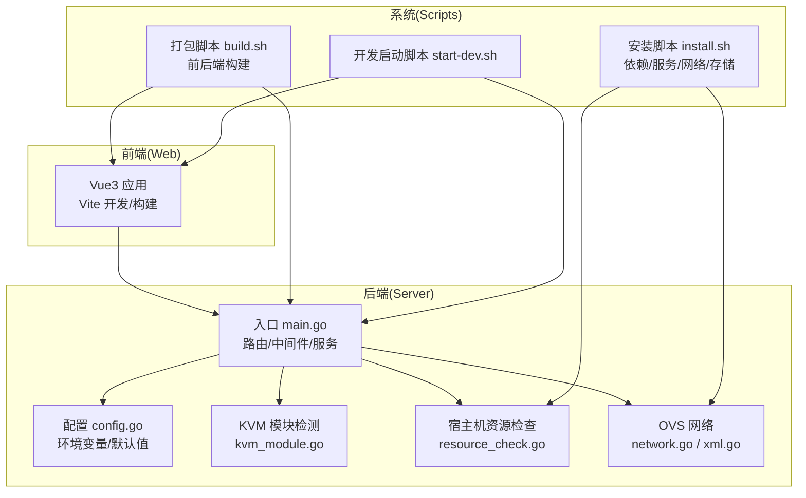
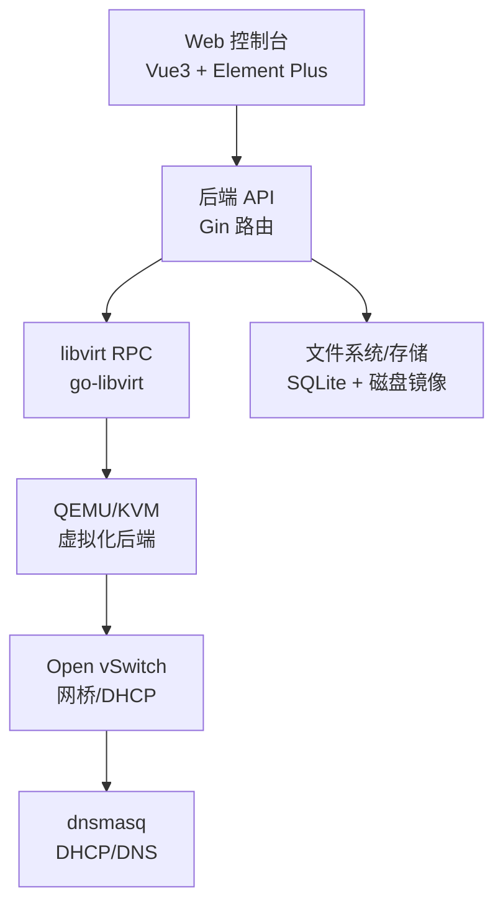
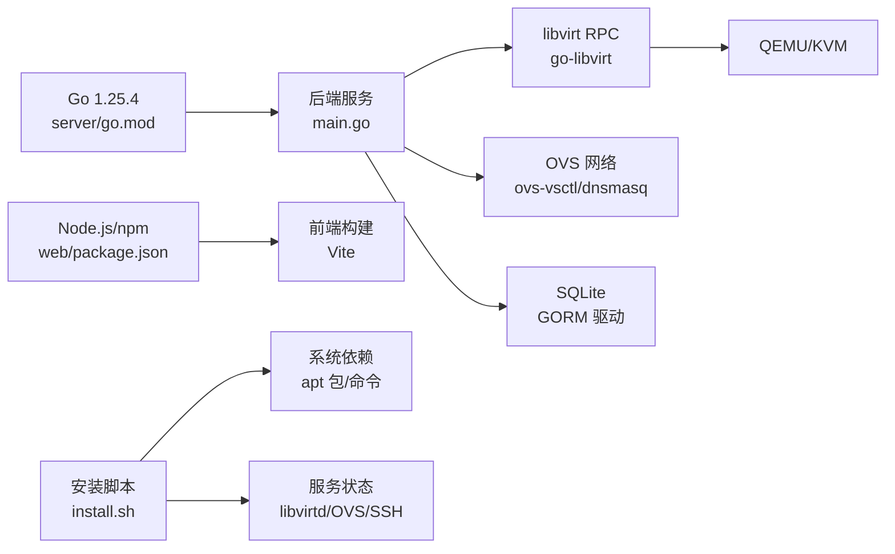

# 系统要求

<cite>
**本文档引用的文件**
- [go.mod](file://server/go.mod)
- [package.json](file://web/package.json)
- [install.sh](file://install.sh)
- [build.sh](file://build.sh)
- [main.go](file://server/main.go)
- [config.go](file://server/config/config.go)
- [kvm_module.go](file://server/service/kvm_module.go)
- [resource_check.go](file://server/service/host/resource_check.go)
- [DEPENDENCIES.md](file://DEPENDENCIES.md)
- [start-dev.sh](file://start-dev.sh)
- [network.go](file://server/service/ovs/network.go)
- [xml.go](file://server/service/network/bridge/xml.go)
- [VmForm.vue](file://web/src/components/VmForm.vue)
- [firewall.js](file://web/src/api/firewall.js)
- [host.go](file://server/service/firewall/host.go)
- [host_conn.go](file://server/service/firewall/host_conn.go)
- [types.go](file://server/service/ovs/types.go)
- [diagnostics.go](file://server/service/ovs/diagnostics.go)
- [resource_check_delegate.go](file://server/service/resource_check_delegate.go)
</cite>

## 目录
1. [简介](#简介)
2. [项目结构](#项目结构)
3. [核心组件](#核心组件)
4. [架构总览](#架构总览)
5. [详细组件分析](#详细组件分析)
6. [依赖关系分析](#依赖关系分析)
7. [性能考量](#性能考量)
8. [故障排查指南](#故障排查指南)
9. [结论](#结论)
10. [附录](#附录)

## 简介
本文件面向部署与运维人员，系统性梳理 Open 虚拟机管理控制台（QVMConsole）的系统要求与环境验证方法，涵盖操作系统兼容性、虚拟化与网络环境、硬件资源、软件依赖、系统预检查与常见问题排查，帮助用户顺利完成安装与稳定运行。

## 项目结构
- 后端（Go）：提供 API、虚拟机生命周期管理、网络与存储编排、任务队列与定时调度。
- 前端（Vue3 + Vite）：提供 Web 控制台，支持虚拟机创建、网络配置、防火墙管理、诊断与监控。
- 安装与打包：Shell 脚本负责系统依赖安装、KVM/OVS 环境准备、服务配置与打包发布。

**图表来源**
- [main.go:31-128](file://server/main.go#L31-L128)
- [config.go:157-249](file://server/config/config.go#L157-L249)
- [kvm_module.go:12-134](file://server/service/kvm_module.go#L12-L134)
- [resource_check.go:12-90](file://server/service/host/resource_check.go#L12-L90)
- [network.go:112-122](file://server/service/ovs/network.go#L112-L122)
- [xml.go:11-39](file://server/service/network/bridge/xml.go#L11-L39)
- [install.sh:126-146](file://install.sh#L126-L146)
- [build.sh:96-145](file://build.sh#L96-L145)
- [start-dev.sh:67-109](file://start-dev.sh#L67-L109)

**章节来源**
- [main.go:31-128](file://server/main.go#L31-L128)
- [config.go:157-249](file://server/config/config.go#L157-L249)
- [install.sh:126-146](file://install.sh#L126-L146)
- [build.sh:96-145](file://build.sh#L96-L145)
- [start-dev.sh:67-109](file://start-dev.sh#L67-L109)

## 核心组件
- 运行时与依赖
  - 后端：Go 1.25.4（模块声明）
  - 前端：Node.js 与 npm（构建工具链）
  - 数据库：SQLite（GORM 驱动）
  - 网络：Open vSwitch + dnsmasq（默认网络后端）
  - 虚拟化：libvirt + QEMU/KVM（go-libvirt RPC）
- 系统服务与命令
  - libvirtd、openvswitch-switch、ssh（systemd）
  - virt-install、qemu-img、ovs-vsctl、dnsmasq、iptables/nft 等
- 环境变量与配置
  - KVM_PORT、KVM_DB_PATH、KVM_JWT_SECRET、KVM_NETWORK_BACKEND、KVM_OVS_* 等
- 开发与打包
  - air 热重载、Vite 开发服务器、打包为 release/kvm-console-linux-amd64.tar.gz

**章节来源**
- [go.mod:3-14](file://server/go.mod#L3-L14)
- [package.json:11-28](file://web/package.json#L11-L28)
- [config.go:157-249](file://server/config/config.go#L157-L249)
- [install.sh:313-327](file://install.sh#L313-L327)
- [build.sh:121-145](file://build.sh#L121-L145)

## 架构总览
系统采用“Web 前端 + Go 后端 + libvirt/QEMU/KVM + OVS/dnsmasq”的组合，通过 go-libvirt 与 libvirt RPC 交互，实现虚拟机生命周期、网络与存储管理。

**图表来源**
- [main.go:67-71](file://server/main.go#L67-L71)
- [network.go:112-122](file://server/service/ovs/network.go#L112-L122)
- [xml.go:11-39](file://server/service/network/bridge/xml.go#L11-L39)
- [config.go:157-249](file://server/config/config.go#L157-L249)

## 详细组件分析

### 操作系统与硬件架构
- 发行版与内核
  - 安装脚本明确要求 Debian/Ubuntu 系列（/etc/os-release 检测）
  - 仅支持 x86_64 架构（uname -m）
  - KVM 硬件虚拟化标记检测（Intel VT-x 或 AMD-V）
- 硬件要求
  - 至少需要具备硬件虚拟化能力的 CPU
  - /dev/kvm 可用（内核 KVM 模块加载）

**章节来源**
- [install.sh:126-146](file://install.sh#L126-L146)
- [install.sh:148-178](file://install.sh#L148-L178)
- [kvm_module.go:12-134](file://server/service/kvm_module.go#L12-L134)

### 虚拟化与网络环境
- 虚拟化后端
  - libvirt + QEMU/KVM（go-libvirt RPC 连接）
  - 支持 KVM（硬件加速）与 QEMU（纯软件）
- 网络后端
  - 默认 OVS（Open vSwitch）+ dnsmasq
  - 支持通过环境变量切换网络后端
- 关键命令与服务
  - ovs-vsctl、dnsmasq、iptables/nft、libvirtd、openvswitch-switch、ssh

**章节来源**
- [main.go:67-71](file://server/main.go#L67-L71)
- [config.go:157-249](file://server/config/config.go#L157-L249)
- [network.go:112-122](file://server/service/ovs/network.go#L112-L122)
- [xml.go:11-39](file://server/service/network/bridge/xml.go#L11-L39)
- [install.sh:313-327](file://install.sh#L313-L327)

### 软件依赖与运行时
- 后端运行时
  - Go 1.25.4（模块声明）
  - SQLite（GORM 驱动）
- 前端运行时
  - Node.js 与 npm（构建工具链）
- 开发依赖
  - air（Go 热重载）、Vite（前端开发服务器）
- 一键安装脚本会安装系统级依赖（QEMU、libvirt、OVS、dnsmasq、nftables、iproute2 等）

**章节来源**
- [go.mod:3-14](file://server/go.mod#L3-L14)
- [package.json:11-28](file://web/package.json#L11-L28)
- [DEPENDENCIES.md:7-13](file://DEPENDENCIES.md#L7-L13)
- [install.sh:42-76](file://install.sh#L42-L76)

### 系统资源与存储
- 存储空间检查
  - 提供目录可用空间检查与可写性验证
  - 支持磁盘 backing chain 完整性校验
- 存储配额
  - 用户存储使用 Project Quota（ext4 + loop + prjquota）
  - 自动挂载与 fstab 写入
- 磁盘镜像工具
  - qemu-img 用于镜像信息与 backing chain 查询

**章节来源**
- [resource_check.go:12-90](file://server/service/host/resource_check.go#L12-L90)
- [install.sh:347-423](file://install.sh#L347-L423)

### 网络与防火墙
- 网络后端
  - OVS 网桥、DHCP（dnsmasq）、VLAN 支持
  - 支持通过 XML/CLI 生成 OVS 接口配置
- 防火墙
  - UFW 可用性检测与规则管理
  - SSH 与面板端口保护与推荐规则
  - 连接状态预览与关闭

**章节来源**
- [network.go:112-122](file://server/service/ovs/network.go#L112-L122)
- [xml.go:11-39](file://server/service/network/bridge/xml.go#L11-L39)
- [host.go:18-43](file://server/service/firewall/host.go#L18-L43)
- [firewall.js:47-81](file://web/src/api/firewall.js#L47-L81)
- [host_conn.go:86-123](file://server/service/firewall/host_conn.go#L86-L123)

### 系统预检查与环境验证
- 安装脚本预检查
  - OS 类型与架构检测
  - KVM 硬件虚拟化与 /dev/kvm 可用性
  - 必备系统包与命令检查
  - 核心服务（libvirt、OVS、SSH）状态
- 运行时安全检查
  - JWT 密钥安全校验（禁止默认密钥）
  - 环境变量与数据库持久化配置优先级

**章节来源**
- [install.sh:126-146](file://install.sh#L126-L146)
- [install.sh:265-327](file://install.sh#L265-L327)
- [config.go:251-283](file://server/config/config.go#L251-L283)

### 系统要求清单

- 操作系统与架构
  - 发行版：Debian/Ubuntu 系列（/etc/os-release）
  - 架构：x86_64
  - 内核：支持 KVM 硬件虚拟化（VT-x/AMD-V）
- 虚拟化与网络
  - KVM 模块可用（/dev/kvm）
  - libvirt 与 QEMU/KVM（go-libvirt RPC）
  - Open vSwitch + dnsmasq（默认网络后端）
- 软件依赖
  - 后端：Go 1.25.4
  - 前端：Node.js 与 npm
  - 系统工具：virt-install、qemu-img、ovs-vsctl、dnsmasq、iptables/nft、ssh 等
- 硬件资源
  - 存储：用户存储使用 Project Quota（ext4 + loop + prjquota）
  - 网络：至少一个 OVS 网桥与 DHCP 服务
- 网络端口与防火墙
  - 面板端口（默认 8080，可通过环境变量配置）
  - UFW 可用时，建议遵循推荐规则与保护策略

**章节来源**
- [install.sh:126-146](file://install.sh#L126-L146)
- [install.sh:265-327](file://install.sh#L265-L327)
- [config.go:157-249](file://server/config/config.go#L157-L249)
- [go.mod:3-14](file://server/go.mod#L3-L14)
- [package.json:11-28](file://web/package.json#L11-L28)

## 依赖关系分析

**图表来源**
- [go.mod:3-14](file://server/go.mod#L3-L14)
- [package.json:11-28](file://web/package.json#L11-L28)
- [main.go:67-71](file://server/main.go#L67-L71)
- [install.sh:265-327](file://install.sh#L265-L327)

**章节来源**
- [go.mod:3-14](file://server/go.mod#L3-L14)
- [package.json:11-28](file://web/package.json#L11-L28)
- [install.sh:265-327](file://install.sh#L265-L327)

## 性能考量
- 动态内存调度
  - 支持基于 virtio-balloon 与 virtio-mem 的动态内存策略
  - 可配置观察周期、阈值与冷却时间
- 带宽与 IOPS
  - 支持全局带宽限制与端口转发探测
  - 支持磁盘 IOPS 总量与读/写限制
- 资源采集与任务队列
  - 后台定时采集 VM 资源数据
  - 任务队列并行处理克隆、迁移、导入导出等任务

**章节来源**
- [config.go:106-137](file://server/config/config.go#L106-L137)
- [main.go:91-98](file://server/main.go#L91-L98)

## 故障排查指南

### 常见问题与解决方案
- 无法加载 /dev/kvm 或未检测到硬件虚拟化
  - 检查 BIOS/UEFI 中的虚拟化开关
  - 确认 CPU 支持 VT-x/AMD-V
  - 安装脚本会尝试加载 kvm_intel/kvm_amd 模块
- OVS 未安装或 dnsmasq 不可用
  - 安装脚本会检查并提示安装 openvswitch-switch 与 dnsmasq-base
  - 确认 ovs-vsctl 与 dnsmasq 命令可用
- libvirt 服务未运行
  - 安装脚本会尝试启用并启动 libvirtd/openvswitch-switch/ssh
  - 检查 systemd 状态
- 端口占用或防火墙阻断
  - 面板默认端口 8080（可通过环境变量配置）
  - 若使用 UFW，建议遵循推荐规则与保护策略
- 默认 JWT 密钥导致启动失败
  - 安装脚本会检测并拒绝使用默认密钥
  - 建议设置 KVM_JWT_SECRET 并在生产环境禁用开发模式

**章节来源**
- [install.sh:148-178](file://install.sh#L148-L178)
- [install.sh:265-327](file://install.sh#L265-L327)
- [config.go:251-283](file://server/config/config.go#L251-L283)
- [host.go:18-43](file://server/service/firewall/host.go#L18-L43)

### 系统预检查与诊断
- 宿主机资源检查
  - 目录可用空间与可写性
  - 磁盘 backing chain 完整性
- OVS 网络诊断
  - 状态检查、端口与租约冲突检测
  - 修复建议与自动修复流程
- 虚拟机创建回滚
  - 关机/取消定义/删除磁盘的尽力而为清理

**章节来源**
- [resource_check.go:12-90](file://server/service/host/resource_check.go#L12-L90)
- [diagnostics.go:129-189](file://server/service/ovs/diagnostics.go#L129-L189)
- [types.go:120-137](file://server/service/ovs/types.go#L120-L137)
- [resource_check.go:107-152](file://server/service/host/resource_check.go#L107-L152)

## 结论
QVMConsole 对 Debian/Ubuntu x86_64 环境有明确要求，依赖 KVM/Hypervisor、libvirt/QEMU 与 OVS/dnsmasq。通过安装脚本可完成系统依赖、服务与网络的自动化准备；结合运行时安全检查与 OVS/防火墙诊断，可显著提升部署成功率与运行稳定性。建议在生产环境严格配置密钥与网络策略，并根据业务规模调整动态内存与带宽/IOPS 策略。

## 附录

### 系统预检查脚本与验证方法
- 安装脚本（install.sh）
  - OS/架构检测、KVM 能力检测、/dev/kvm 可用性
  - 依赖包与命令检查、核心服务状态
  - 用户存储 Project Quota 初始化
- 运行时安全检查（config.ValidateSecurity）
  - JWT 密钥安全校验
- OVS 网络诊断（service/ovs/diagnostics.go）
  - 状态、端口、租约健康度与修复建议
- 宿主机资源检查（service/host/resource_check.go）
  - 存储空间、可写性、磁盘 backing chain 校验

**章节来源**
- [install.sh:126-146](file://install.sh#L126-L146)
- [install.sh:265-327](file://install.sh#L265-L327)
- [config.go:251-283](file://server/config/config.go#L251-L283)
- [diagnostics.go:129-189](file://server/service/ovs/diagnostics.go#L129-L189)
- [resource_check.go:12-90](file://server/service/host/resource_check.go#L12-L90)