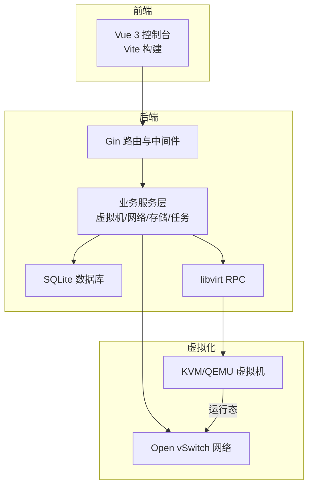
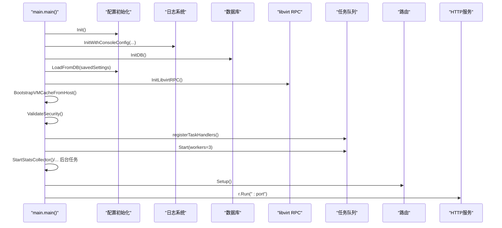
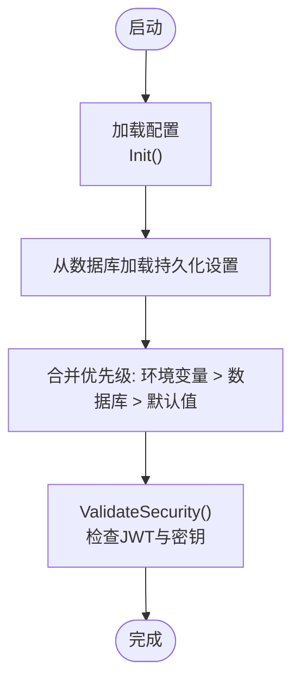
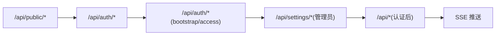
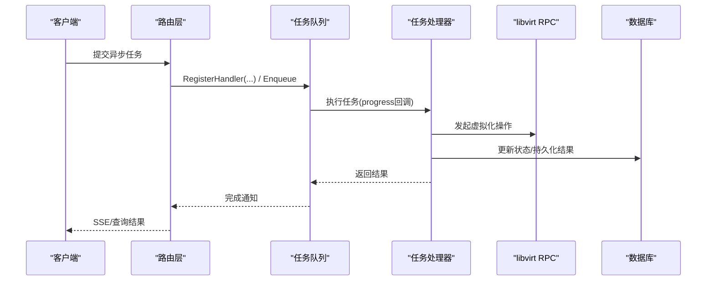
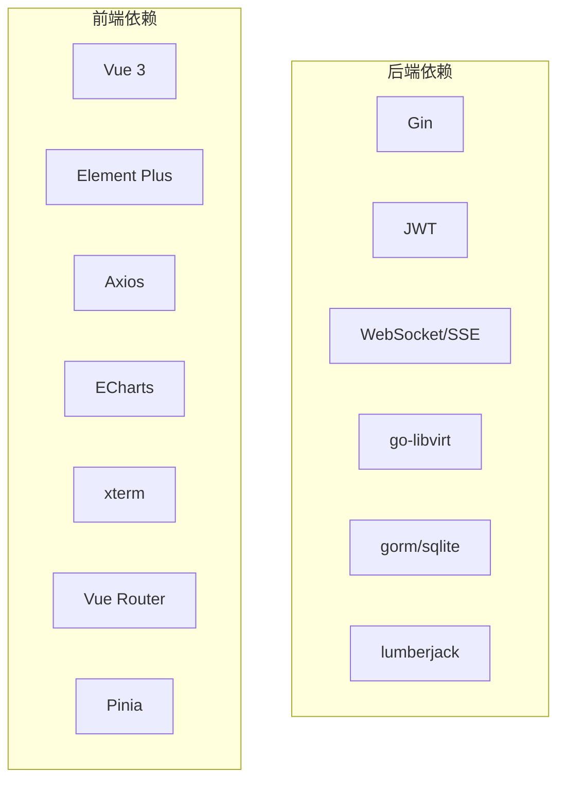

# 项目介绍

<cite>
**本文引用的文件**
- [server/main.go](file://server/main.go)
- [server/router/router.go](file://server/router/router.go)
- [server/config/config.go](file://server/config/config.go)
- [server/go.mod](file://server/go.mod)
- [DEPENDENCIES.md](file://DEPENDENCIES.md)
- [build.sh](file://build.sh)
- [web/README.md](file://web/README.md)
- [web/package.json](file://web/package.json)
- [web/src/main.js](file://web/src/main.js)
</cite>

## 目录
1. [引言](#引言)
2. [项目结构](#项目结构)
3. [核心组件](#核心组件)
4. [架构总览](#架构总览)
5. [详细组件分析](#详细组件分析)
6. [依赖分析](#依赖分析)
7. [性能考量](#性能考量)
8. [故障排查指南](#故障排查指南)
9. [结论](#结论)
10. [附录](#附录)

## 引言
Open虚拟机管理控制台（QVMConsole）是一个面向企业与云服务场景的开源虚拟机管理平台，围绕KVM/QEMU虚拟化进行深度集成，提供从虚拟机生命周期管理、网络与存储编排、快照与克隆、防火墙与带宽治理，到Web控制台与API一体化交付的一体化解决方案。项目旨在降低企业与机构在虚拟化基础设施上的运维门槛，提升资源利用率与安全性，同时保持对多租户、弹性扩缩容与合规治理的支持。

本项目的核心使命是：
- 为企业与云服务商提供“即开即用”的虚拟化管理平台，减少重复造轮子的成本
- 通过模块化设计与可插拔网络后端（如Open vSwitch），适配多样化的网络拓扑与安全策略
- 以Web控制台与RESTful API双入口，兼顾自动化与人工运维效率
- 以任务队列与SSE机制实现长耗时操作的可观测与可中断，保障大规模并发下的稳定性

## 项目结构
项目采用前后端分离架构：
- 后端（Go）：基于Gin框架提供REST API，集成libvirt RPC与SQLite数据库，负责虚拟化资源编排、网络与存储治理、任务调度与安全控制
- 前端（Vue 3 + Vite）：基于Element Plus构建管理界面，提供虚拟机列表、VNC控制台、网络与存储管理、任务与日志查看等功能
- 构建与部署：提供一键打包脚本，产出包含后端二进制与前端静态资源的发行包

图表来源
- [server/router/router.go:18-485](file://server/router/router.go#L18-L485)
- [server/main.go:31-128](file://server/main.go#L31-L128)
- [server/go.mod:5-15](file://server/go.mod#L5-L15)

章节来源
- [server/router/router.go:18-485](file://server/router/router.go#L18-L485)
- [server/main.go:31-128](file://server/main.go#L31-L128)
- [web/README.md:1-6](file://web/README.md#L1-L6)
- [web/package.json:1-30](file://web/package.json#L1-L30)
- [web/src/main.js:1-26](file://web/src/main.js#L1-L26)

## 核心组件
- 配置中心：集中管理端口、网络、存储、日志、带宽、SMTP、JWT轮换等系统参数，并支持从数据库持久化覆盖
- 路由与鉴权：基于Gin的路由分组与中间件，提供登录、二次验证、高风险操作验证、管理员与资源访问控制
- 业务服务：覆盖虚拟机生命周期、模板与克隆、快照、网络与VPC、防火墙、存储池、任务队列、主机监控等
- 任务队列：异步任务处理器，支持克隆、导入导出、迁移、磁盘操作、防火墙应用等长耗时操作
- 前端控制台：基于Vue生态，提供虚拟机管理、VNC、网络与存储配置、任务与日志等界面

章节来源
- [server/config/config.go:19-152](file://server/config/config.go#L19-L152)
- [server/router/router.go:18-485](file://server/router/router.go#L18-L485)
- [server/main.go:130-800](file://server/main.go#L130-L800)

## 架构总览
后端启动流程概览：
- 初始化配置与日志
- 初始化数据库与系统设置
- 建立libvirt RPC连接
- 同步虚拟机缓存与网络运行态
- 注册任务处理器与启动后台采集器
- 设置路由并启动HTTP服务

图表来源
- [server/main.go:31-128](file://server/main.go#L31-L128)

章节来源
- [server/main.go:31-128](file://server/main.go#L31-L128)

## 详细组件分析

### 配置与安全
- 配置项覆盖顺序：环境变量 > 数据库持久化设置 > 默认值
- 安全检查：禁止使用默认JWT密钥；当未设置专用密钥时给出明确提示
- 关键配置：端口、数据库路径、JWT与凭据加密密钥、网络后端（OVS）、VPC子网与ACL表、带宽总限速、日志级别与归档、维护模式与优雅关机超时、SMTP等

图表来源
- [server/config/config.go:157-283](file://server/config/config.go#L157-L283)

章节来源
- [server/config/config.go:157-283](file://server/config/config.go#L157-L283)

### 路由与鉴权
- 路由分组：公开设置、认证、系统设置（管理员）、认证后路由（虚拟机、网络、VPC、存储、用户、主机、任务、调度等）
- 中间件：CORS、请求日志、限流、JWT与登录态验证、资源访问控制、管理员校验
- 实时推送：SSE用于虚拟机列表、详情、主机统计、调度事件等

图表来源
- [server/router/router.go:18-485](file://server/router/router.go#L18-L485)

章节来源
- [server/router/router.go:18-485](file://server/router/router.go#L18-L485)

### 任务队列与异步处理
- 支持的任务类型：克隆（含链式克隆与批量）、重装系统、模板制作/导入/导出/删除、创建/删除虚拟机、跨节点与本机磁盘迁移、存储池格式化/分区/LVM卷、快照创建/恢复/删除、用户与轻量云配额关停、防火墙策略应用/禁用/回滚、救援系统启停、重置Linux密码、端口转发探测、磁盘导入/附加等
- 任务进度回调与可取消能力，结合SSE向客户端推送进度

图表来源
- [server/main.go:130-800](file://server/main.go#L130-L800)

章节来源
- [server/main.go:130-800](file://server/main.go#L130-L800)

### 前端控制台
- 技术栈：Vue 3 + Vite + Element Plus + Axios + Pinia + Vue Router
- 主要页面：登录、仪表盘、虚拟机管理（列表/详情/VNC）、网络与VPC、存储池、用户与任务、主机监控、系统设置等
- 集成：通过代理或直接访问后端API，SSE用于实时数据更新

章节来源
- [web/README.md:1-6](file://web/README.md#L1-L6)
- [web/package.json:1-30](file://web/package.json#L1-L30)
- [web/src/main.js:1-26](file://web/src/main.js#L1-L26)

## 依赖分析
- 后端依赖：Gin（Web框架）、JWT（鉴权）、WebSocket（SSE）、libvirt RPC（虚拟化）、SQLite（本地存储）、日志轮转、校验与序列化等
- 前端依赖：Vue 3、Element Plus、Axios、ECharts、xterm、QRCode、Pinia、Vue Router等

图表来源
- [server/go.mod:5-15](file://server/go.mod#L5-L15)
- [web/package.json:11-24](file://web/package.json#L11-L24)

章节来源
- [server/go.mod:1-51](file://server/go.mod#L1-L51)
- [web/package.json:1-30](file://web/package.json#L1-L30)

## 性能考量
- 任务并发：任务队列默认3个工作线程，可根据资源与负载调整
- 网络与存储：支持OVS网络后端与带宽总限速，结合IOPS限制与磁盘迁移优化
- 虚拟化交互：优先使用go-libvirt RPC，必要时降级为virsh命令行
- 日志与监控：可配置日志级别、大小与归档，后台定时采集主机与VM资源数据

## 故障排查指南
- 启动失败：检查JWT密钥是否为默认值（生产环境必须修改）；确认libvirt RPC连接是否正常
- 网络异常：检查OVS网桥、DHCP范围、UPlink网卡与端口转发规则；使用网络诊断与抓包功能
- 任务卡住：通过任务队列接口查看进度与错误；必要时取消任务并重试
- 日志定位：根据日志级别与类型筛选，关注libvirt与命令执行日志

章节来源
- [server/config/config.go:251-283](file://server/config/config.go#L251-L283)
- [server/main.go:67-71](file://server/main.go#L67-L71)

## 结论
QVMConsole以“企业级虚拟机管理平台”为目标，围绕KVM/QEMU提供从虚拟机生命周期、网络与存储治理到安全与合规的完整能力。通过模块化服务、任务队列与SSE推送、以及可插拔网络后端，项目既适合云服务提供商的多租户场景，也能满足企业IT与教育机构的日常管理需求。依托简洁的构建与部署流程，团队可以快速落地并持续迭代。

## 附录

### 主要应用场景
- 云服务提供商：提供多租户虚拟机服务、VPC隔离、带宽与配额治理、模板与批量克隆
- 企业IT部门：集中管理虚拟化资源、自动化运维与应急处置（救援系统）、网络与防火墙策略
- 教育机构：教学与实验环境的快速发放与回收、快照与克隆、资源隔离与审计

### 与其他方案的差异化优势
- 一体化交付：后端二进制+前端静态资源，便于部署与升级
- 任务化与可观测：长耗时操作统一纳入任务队列，支持进度回调与取消
- 网络与存储深度集成：OVS网络、VPC安全组、带宽与IOPS治理、存储池与LVM卷
- 安全与合规：JWT轮换、二次验证、高风险操作验证、日志与审计

### 发展历程与版本演进
- 版本标识：后端通过ldflags注入版本号，构建脚本支持指定版本与跳过前后端构建
- 构建产物：包含后端二进制、前端静态资源与安装脚本，便于分发与安装

章节来源
- [build.sh:72-80](file://build.sh#L72-L80)
- [server/main.go:27-29](file://server/main.go#L27-L29)

### 技术选型决策
- 后端：Go + Gin + gorm/sqlite，兼顾性能与易部署
- 前端：Vue 3 + Element Plus，组件丰富、生态完善
- 虚拟化：go-libvirt RPC，稳定可靠；支持降级为virsh命令行
- 网络：OVS为主，支持DHCP、ACL与带宽治理

章节来源
- [server/go.mod:5-15](file://server/go.mod#L5-L15)
- [web/package.json:11-24](file://web/package.json#L11-L24)
- [server/config/config.go:51-62](file://server/config/config.go#L51-L62)

### 开源协议、社区与规划
- 协议与社区：仓库未包含许可证文件，建议在发布前补充明确的开源许可声明；社区支持可通过Issue与PR参与
- 规划方向：持续完善网络与存储治理、增强多租户与合规能力、优化前端体验与移动端支持、扩展模板与镜像生态

[本节为概念性总结，不直接分析具体文件]