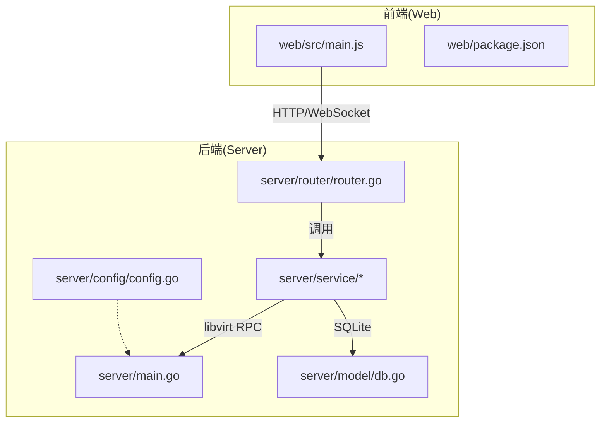
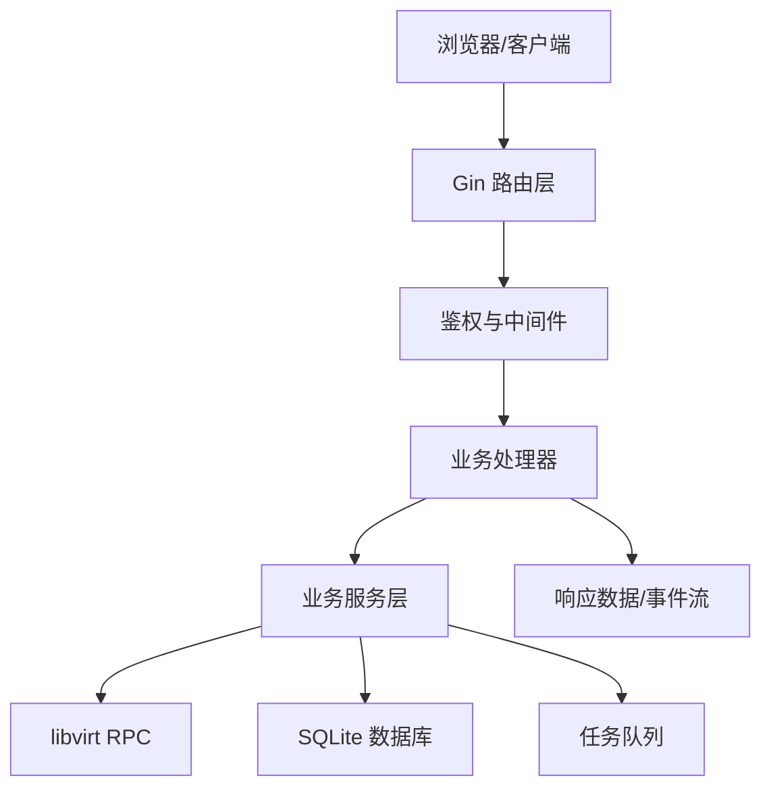
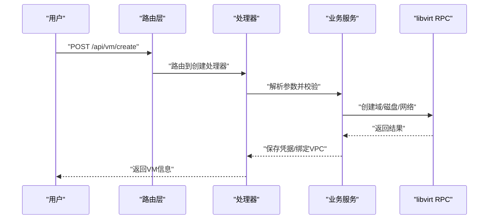
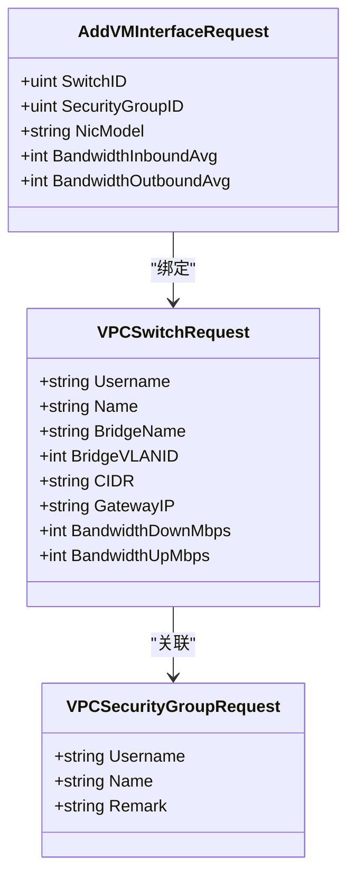
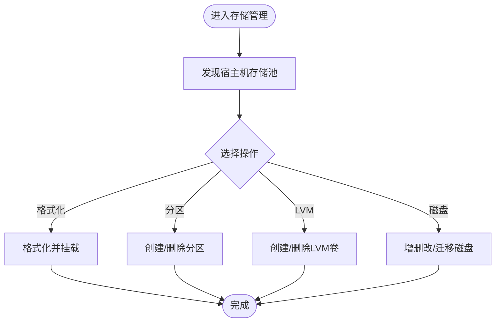
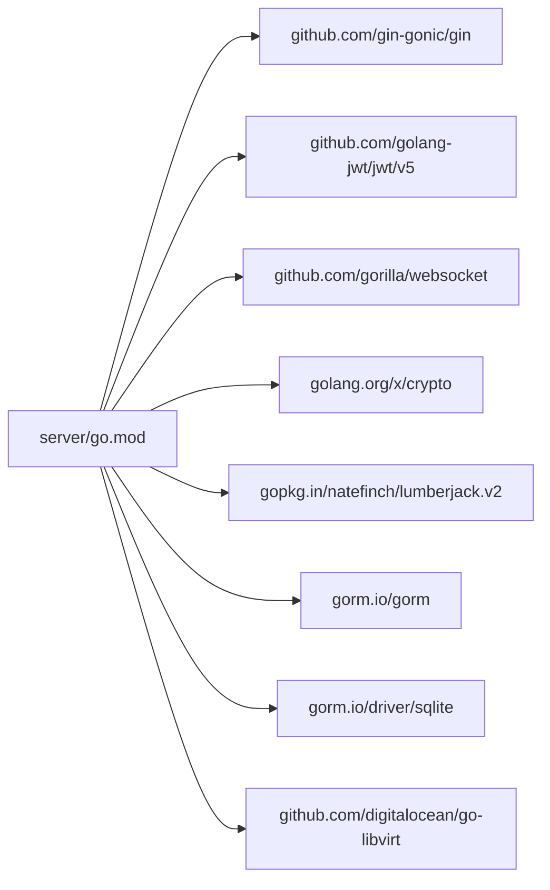

# 项目概述

<cite>
**本文引用的文件**
- [server/main.go](file://server/main.go)
- [server/go.mod](file://server/go.mod)
- [server/config/config.go](file://server/config/config.go)
- [server/router/router.go](file://server/router/router.go)
- [server/model/db.go](file://server/model/db.go)
- [server/service/vm/create.go](file://server/service/vm/create.go)
- [server/service/network/vpc/types.go](file://server/service/network/vpc/types.go)
- [server/service/storage/pool/types.go](file://server/service/storage/pool/types.go)
- [web/package.json](file://web/package.json)
- [web/src/main.js](file://web/src/main.js)
- [web/README.md](file://web/README.md)
</cite>

## 目录
1. [引言](#引言)
2. [项目结构](#项目结构)
3. [核心组件](#核心组件)
4. [架构总览](#架构总览)
5. [详细组件分析](#详细组件分析)
6. [依赖分析](#依赖分析)
7. [性能考虑](#性能考虑)
8. [故障排查指南](#故障排查指南)
9. [结论](#结论)
10. [附录](#附录)

## 引言
Open虚拟机管理控制台是一个面向企业的KVM/QEMU虚拟机管理平台，提供从虚拟机生命周期管理、网络虚拟化（含VPC）、存储管理到安全与运维的完整能力。项目采用前后端分离架构：前端基于Vue 3 + Vite构建，后端基于Go语言开发，通过REST API进行交互；后端以libvirt RPC为虚拟化后端，结合SQLite持久化与任务队列机制，实现高可靠、可扩展的企业级虚拟化管理。

## 项目结构
项目分为三个主要部分：
- 服务端（Go）：负责业务逻辑、API路由、鉴权与安全、虚拟化操作、网络与存储编排、任务调度与执行等。
- 前端（Vue 3）：提供Web管理界面，集成Element Plus、Axios、Pinia、Vue Router等生态组件。
- 工具与脚本：包含构建、安装与开发启动脚本，以及依赖说明文档。

图表来源
- [server/main.go:31-128](file://server/main.go#L31-L128)
- [server/router/router.go:18-200](file://server/router/router.go#L18-L200)
- [server/config/config.go:157-200](file://server/config/config.go#L157-L200)
- [server/model/db.go:57-113](file://server/model/db.go#L57-L113)
- [web/src/main.js:13-26](file://web/src/main.js#L13-L26)
- [web/package.json:1-30](file://web/package.json#L1-L30)

章节来源
- [server/main.go:31-128](file://server/main.go#L31-L128)
- [server/router/router.go:18-200](file://server/router/router.go#L18-L200)
- [server/config/config.go:157-200](file://server/config/config.go#L157-L200)
- [server/model/db.go:57-113](file://server/model/db.go#L57-L113)
- [web/src/main.js:13-26](file://web/src/main.js#L13-L26)
- [web/package.json:1-30](file://web/package.json#L1-L30)

## 核心组件
- 配置中心：集中管理端口、JWT、网络后端、日志、带宽、维护模式等系统级参数，并支持从数据库加载持久化设置。
- 路由与中间件：基于Gin框架，提供认证、跨域、限流、请求日志、权限校验等中间件。
- 数据层：基于GORM + SQLite，自动迁移表结构，兼容历史版本字段，初始化默认管理员账户。
- 业务服务：涵盖虚拟机生命周期、克隆/批量克隆、导入导出、磁盘管理、快照、VNC、防火墙、VPC网络、存储池与LVM、带宽与流量配额、计划任务与调度等。
- 任务队列：统一的任务处理器注册与执行，支持进度回调、可取消、幂等与错误恢复。
- 前端应用：基于Vue 3 + Element Plus，提供虚拟机列表、详情、网络诊断、存储管理、用户与系统设置等视图。

章节来源
- [server/config/config.go:19-152](file://server/config/config.go#L19-L152)
- [server/router/router.go:18-200](file://server/router/router.go#L18-L200)
- [server/model/db.go:57-113](file://server/model/db.go#L57-L113)
- [server/main.go:130-800](file://server/main.go#L130-L800)
- [web/src/main.js:13-26](file://web/src/main.js#L13-L26)

## 架构总览
系统采用“前端Vue应用 + 后端Go服务”的分层架构，后端通过libvirt RPC与本地KVM/QEMU通信，数据库用于持久化配置、用户、网络与资源配额等元数据。整体流程如下：

图表来源
- [server/router/router.go:18-200](file://server/router/router.go#L18-L200)
- [server/main.go:67-127](file://server/main.go#L67-L127)
- [server/model/db.go:57-113](file://server/model/db.go#L57-L113)

## 详细组件分析

### 虚拟机生命周期管理
- 支持普通创建、模板制作/导入/导出、克隆（含链式克隆与批量克隆）、重装系统、导入磁盘、删除（含强制删除）、定时任务等。
- 提供VNC控制台、QEMU Monitor、磁盘增删改、CD/DVD切换、PCI直通、快照管理、统计与历史监控等能力。
- 关键流程：创建/克隆/导入 → 绑定VPC/安全组 → 应用IOPS限制 → 保存凭据 → 刷新缓存。

图表来源
- [server/router/router.go:108-160](file://server/router/router.go#L108-L160)
- [server/service/vm/create.go:147-200](file://server/service/vm/create.go#L147-L200)
- [server/main.go:296-316](file://server/main.go#L296-L316)

章节来源
- [server/router/router.go:108-200](file://server/router/router.go#L108-L200)
- [server/service/vm/create.go:147-200](file://server/service/vm/create.go#L147-L200)
- [server/main.go:296-316](file://server/main.go#L296-L316)

### 网络虚拟化（VPC）
- VPC交换机、安全组、ACL与带宽策略统一管理；支持自动/手动网段分配、DHCP、网卡绑定与带宽调整。
- 提供VM与VPC绑定查询、更新、多网口管理等接口，支持按VM维度查看/变更网络运行态与诊断能力。

图表来源
- [server/service/network/vpc/types.go:13-96](file://server/service/network/vpc/types.go#L13-L96)

章节来源
- [server/service/network/vpc/types.go:13-96](file://server/service/network/vpc/types.go#L13-L96)
- [server/router/router.go:127-140](file://server/router/router.go#L127-L140)

### 存储管理
- 支持宿主机存储池发现、格式化/挂载、分区创建/删除、LVM卷创建/删除、ISO管理、磁盘增删改与迁移等。
- 提供VM存储目标选择、容量与使用率展示、默认存储池配置等。

图表来源
- [server/service/storage/pool/types.go:8-159](file://server/service/storage/pool/types.go#L8-L159)
- [server/router/router.go:185-196](file://server/router/router.go#L185-L196)

章节来源
- [server/service/storage/pool/types.go:8-159](file://server/service/storage/pool/types.go#L8-L159)
- [server/router/router.go:185-196](file://server/router/router.go#L185-L196)

### 前端技术栈与入口
- 前端基于Vue 3 + Vite，使用Element Plus UI库、Axios进行HTTP请求、Pinia做状态管理、Vue Router进行路由管理。
- 应用入口在web/src/main.js中初始化Pinia、路由与UI组件库，并挂载到DOM。

章节来源
- [web/package.json:11-24](file://web/package.json#L11-L24)
- [web/src/main.js:13-26](file://web/src/main.js#L13-L26)
- [web/README.md:1-6](file://web/README.md#L1-L6)

## 依赖分析
后端依赖以Go模块管理，核心依赖包括：
- Web框架：Gin
- JWT：golang-jwt
- WebSocket：gorilla/websocket
- 加解密：golang.org/x/crypto
- 日志轮转：lumberjack
- ORM：gorm.io/driver/sqlite + gorm.io/gorm
- 虚拟化：digitalocean/go-libvirt

图表来源
- [server/go.mod:5-15](file://server/go.mod#L5-L15)

章节来源
- [server/go.mod:5-15](file://server/go.mod#L5-L15)

## 性能考虑
- 任务队列：后端内置任务队列，支持多Worker并发执行，任务处理器可上报进度，便于长耗时操作的可观测性与可中断。
- 资源采集：后台定时采集VM资源统计、内存动态调度、端口转发探测、调度事件清理等，降低对前台请求的阻塞。
- 网络与存储：支持带宽配额与IOPS限制，结合VPC与安全组策略，保障多租户隔离与性能稳定。
- 日志与限流：统一的日志配置与API限流中间件，有助于在高负载场景下维持系统稳定性。

章节来源
- [server/main.go:85-117](file://server/main.go#L85-L117)
- [server/config/config.go:132-152](file://server/config/config.go#L132-L152)
- [server/router/router.go:26-34](file://server/router/router.go#L26-L34)

## 故障排查指南
- 启动失败：检查libvirt RPC连接初始化与端口占用情况，确认配置项（端口、JWT密钥、日志目录）正确。
- 数据库问题：确认DB路径存在且可写，关注自动迁移日志与慢查询记录。
- 网络异常：核对OVS网桥、DHCP范围、UPlink网卡与默认网络配置；必要时启用/禁用网络等待在线检测。
- 任务未执行：查看任务队列Worker状态与任务处理器日志，确认参数解析与权限校验通过。
- 前端无法访问：确认Vite开发服务器端口与代理配置，检查CORS与鉴权中间件是否正常。

章节来源
- [server/main.go:67-71](file://server/main.go#L67-L71)
- [server/model/db.go:57-113](file://server/model/db.go#L57-L113)
- [server/config/config.go:157-200](file://server/config/config.go#L157-L200)
- [server/router/router.go:18-34](file://server/router/router.go#L18-L34)

## 结论
Open虚拟机管理控制台以企业级需求为导向，围绕KVM/QEMU提供完整的虚拟化管理能力。通过清晰的分层架构、完善的网络与存储抽象、可扩展的任务体系与现代化的前后端技术栈，既能满足初学者快速上手，也能为有经验的开发者提供深入定制与优化的空间。

## 附录
- 系统要求：Linux发行版（建议Ubuntu/Debian/CentOS），安装libvirt、QEMU与相关工具（virt-install、virsh等），Go 1.25+，Node.js（用于前端开发）。
- 许可证：仓库未包含许可证文件，请参考项目根目录下的LICENSE或COPYING文件（若存在）。
- 社区贡献：建议遵循代码风格与提交规范，先开Issue讨论再提交PR；提供单元测试与集成测试用例；更新相关文档与依赖说明。